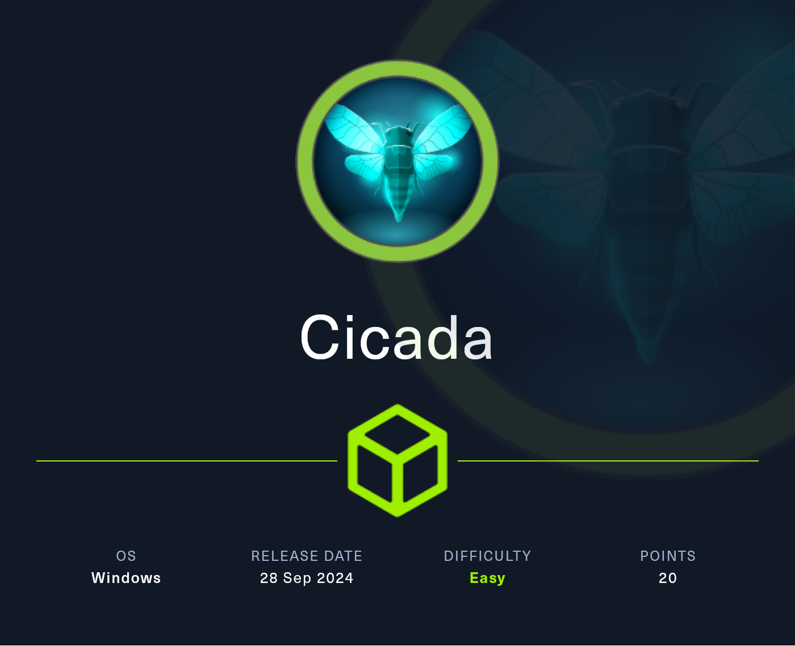
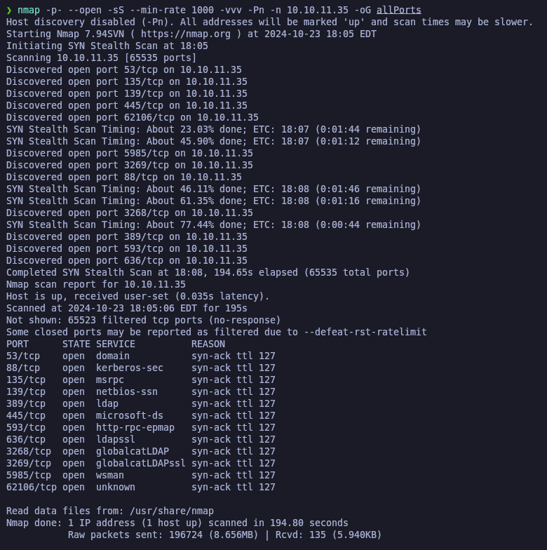

# Cicada

<figure><figcaption></figcaption></figure>

## Reconnaissance

Comenzaremos a realizar un escaneo de todos los puertos abiertos de la máquina víctima. Entre los puertos que hemos encontrado interesantes se encuentran:

* 88 --> Kerberos
* 389 --> ldap
* 445 --> SMB
* 5985 --> Wsman (WinRM)


```bash
map -p- --open -sS --min-rate 1000 -vvv -Pn -n 10.10.11.35 -oG allPorts
```


<figure><figcaption></figcaption></figure>

<figure><figcaption></figcaption></figure>
