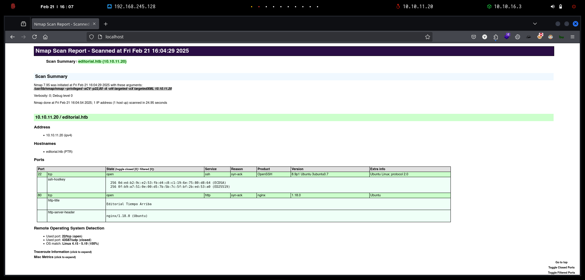
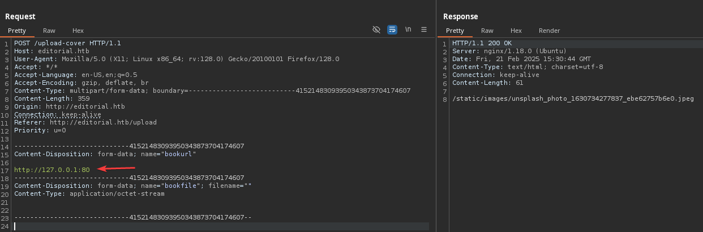

# Editorial

`Editorial` es una máquina Linux de dificultad fácil que cuenta con una aplicación web de publicación vulnerable a `Server-Side Request Forgery (SSRF)`. Esta vulnerabilidad se aprovecha para obtener acceso a una API interna en ejecución, que luego se aprovecha para obtener credenciales que conducen al acceso `SSH` a la máquina. Al enumerar el sistema, se revela además un repositorio Git que se aprovecha para revelar las credenciales de un nuevo usuario. El usuario `root` se puede obtener explotando [CVE-2022-24439](https://nvd.nist.gov/vuln/detail/CVE-2022-24439) y la configuración sudo.

<figure><figcaption></figcaption></figure>

***


```bash
❯ nmap -p- --open -sS --min-rate 1000 -vvv -Pn -n 10.10.11.20 -oG allPorts
Host discovery disabled (-Pn). All addresses will be marked 'up' and scan times may be slower.
Starting Nmap 7.95 ( https://nmap.org ) at 2025-02-21 15:58 CET
Initiating SYN Stealth Scan at 15:58
Scanning 10.10.11.20 [65535 ports]
Discovered open port 80/tcp on 10.10.11.20
Discovered open port 22/tcp on 10.10.11.20
Completed SYN Stealth Scan at 15:59, 33.46s elapsed (65535 total ports)
Nmap scan report for 10.10.11.20
Host is up, received user-set (0.21s latency).
Scanned at 2025-02-21 15:58:53 CET for 34s
Not shown: 65533 closed tcp ports (reset)
PORT   STATE SERVICE REASON
22/tcp open  ssh     syn-ack ttl 63
80/tcp open  http    syn-ack ttl 63

Read data files from: /usr/share/nmap
Nmap done: 1 IP address (1 host up) scanned in 33.63 seconds
           Raw packets sent: 76684 (3.374MB) | Rcvd: 76462 (3.059MB)
```


```bash
❯ extractPorts allPorts

[*] Extracting information...

	[*] IP Address: 10.10.11.20
	[*] Open ports: 22,80

[*] Ports copied to clipboard
```


```bash
❯ nmap -sCV -p22,80 10.10.11.20 -A -oN targeted -oX targetedXML
Starting Nmap 7.95 ( https://nmap.org ) at 2025-02-21 16:04 CET
Nmap scan report for editorial.htb (10.10.11.20)
Host is up (0.34s latency).

PORT   STATE SERVICE VERSION
22/tcp open  ssh     OpenSSH 8.9p1 Ubuntu 3ubuntu0.7 (Ubuntu Linux; protocol 2.0)
| ssh-hostkey: 
|   256 0d:ed:b2:9c:e2:53:fb:d4:c8:c1:19:6e:75:80:d8:64 (ECDSA)
|_  256 0f:b9:a7:51:0e:00:d5:7b:5b:7c:5f:bf:2b:ed:53:a0 (ED25519)
80/tcp open  http    nginx 1.18.0 (Ubuntu)
|_http-title: Editorial Tiempo Arriba
|_http-server-header: nginx/1.18.0 (Ubuntu)
Warning: OSScan results may be unreliable because we could not find at least 1 open and 1 closed port
Device type: general purpose
Running: Linux 4.X|5.X
OS CPE: cpe:/o:linux:linux_kernel:4 cpe:/o:linux:linux_kernel:5
OS details: Linux 4.15 - 5.19
Network Distance: 2 hops
Service Info: OS: Linux; CPE: cpe:/o:linux:linux_kernel

TRACEROUTE (using port 80/tcp)
HOP RTT       ADDRESS
1   312.88 ms 10.10.16.1
2   117.62 ms editorial.htb (10.10.11.20)

OS and Service detection performed. Please report any incorrect results at https://nmap.org/submit/ .
Nmap done: 1 IP address (1 host up) scanned in 24.95 seconds
```


```bash
❯ xsltproc targetedXML > index.html

❯ python3 -m http.server 80
Serving HTTP on 0.0.0.0 port 80 (http://0.0.0.0:80/) ...
```


<figure><figcaption></figcaption></figure>


```bash
❯ cat /etc/hosts | grep editorial
10.10.11.20 editorial.htb
```


```bash
❯ whatweb http://editorial.htb
http://editorial.htb [200 OK] Bootstrap, Country[RESERVED][ZZ], HTML5, HTTPServer[Ubuntu Linux][nginx/1.18.0 (Ubuntu)], IP[10.10.11.20], Title[Editorial Tiempo Arriba], X-UA-Compatible[IE=edge], nginx[1.18.0]
```


<figure><figcaption></figcaption></figure>


```bash
❯ feroxbuster -u http://editorial.htb/ -t 200 -C 500,502,404
                                                                                                                                                                                                                                      
 ___  ___  __   __     __      __         __   ___
|__  |__  |__) |__) | /  `    /  \ \_/ | |  \ |__
|    |___ |  \ |  \ | \__,    \__/ / \ | |__/ |___
by Ben "epi" Risher 🤓                 ver: 2.11.0
───────────────────────────┬──────────────────────
 🎯  Target Url            │ http://editorial.htb/
 🚀  Threads               │ 200
 📖  Wordlist              │ /usr/share/seclists/Discovery/Web-Content/raft-medium-directories.txt
 💢  Status Code Filters   │ [500, 502, 404]
 💥  Timeout (secs)        │ 7
 🦡  User-Agent            │ feroxbuster/2.11.0
 💉  Config File           │ /etc/feroxbuster/ferox-config.toml
 🔎  Extract Links         │ true
 🏁  HTTP methods          │ [GET]
 🔃  Recursion Depth       │ 4
───────────────────────────┴──────────────────────
 🏁  Press [ENTER] to use the Scan Management Menu™
──────────────────────────────────────────────────
404      GET        5l       31w      207c Auto-filtering found 404-like response and created new filter; toggle off with --dont-filter
200      GET       72l      232w     2939c http://editorial.htb/about
200      GET      210l      537w     7140c http://editorial.htb/upload
302      GET        5l       22w      201c http://editorial.htb/upload-cover => http://editorial.htb/upload
200      GET       81l      467w    28535c http://editorial.htb/static/images/unsplash_photo_1630734277837_ebe62757b6e0.jpeg
200      GET        7l     2189w   194901c http://editorial.htb/static/css/bootstrap.min.css
200      GET     4780l    27457w  2300540c http://editorial.htb/static/images/pexels-min-an-694740.jpg
200      GET      177l      589w     8577c http://editorial.htb/
200      GET    10938l    65137w  4902042c http://editorial.htb/static/images/pexels-janko-ferlic-590493.jpg
[####################] - 30s    30015/30015   0s      found:8       errors:0      
[####################] - 30s    30002/30002   1010/s  http://editorial.htb/       
```


<figure><figcaption></figcaption></figure>


```bash
❯ python3 -m http.server 80
Serving HTTP on 0.0.0.0 port 80 (http://0.0.0.0:80/) ...
```


send book nada

<figure><figcaption></figcaption></figure>

preview.png>)

<figure><figcaption></figcaption></figure>


```bash
❯ python3 -m http.server 80
Serving HTTP on 0.0.0.0 port 80 (http://0.0.0.0:80/) ...
10.10.11.20 - - [21/Feb/2025 16:27:21] code 404, message File not found
10.10.11.20 - - [21/Feb/2025 16:27:21] "GET /gzzcoo HTTP/1.1" 404 -
```


<figure><figcaption></figcaption></figure>


