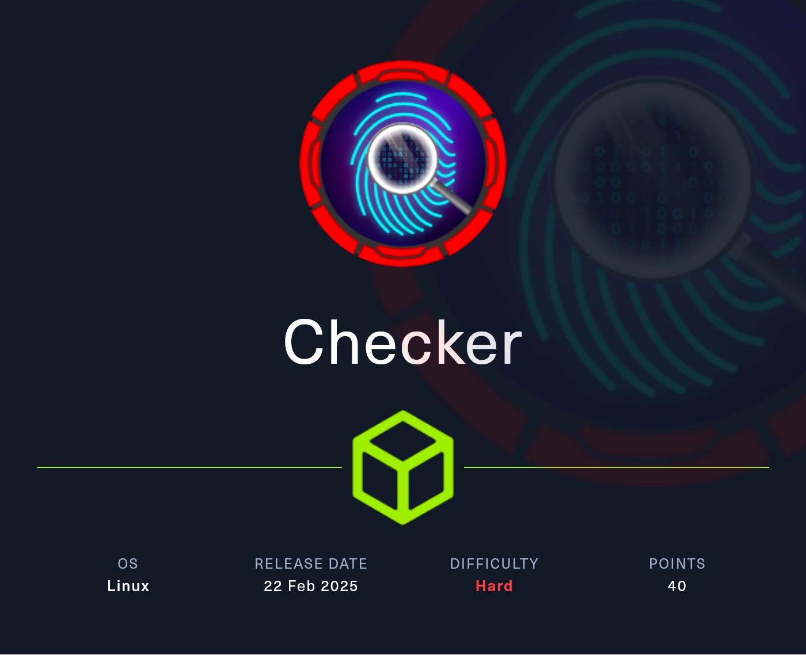

# Copy of Copy of Checker

<figure><figcaption></figcaption></figure>

***

## Reconnaissance

Realizaremos un reconocimiento con `nmap` para ver los puertos que están expuestos en la máquina **`Checker`**. Este resultado lo almacenaremos en un archivo llamado `allPorts`.

```bash
❯ nmap -p- --open -sS --min-rate 1000 -vvv -Pn -n 10.10.11.56 -oG allPorts
Host discovery disabled (-Pn). All addresses will be marked 'up' and scan times may be slower.
Starting Nmap 7.95 ( https://nmap.org ) at 2025-03-05 01:00 CET
Initiating SYN Stealth Scan at 01:00
Scanning 10.10.11.56 [65535 ports]
Discovered open port 8080/tcp on 10.10.11.56
Discovered open port 22/tcp on 10.10.11.56
Discovered open port 80/tcp on 10.10.11.56
Completed SYN Stealth Scan at 01:01, 23.91s elapsed (65535 total ports)
Nmap scan report for 10.10.11.56
Host is up, received user-set (0.096s latency).
Scanned at 2025-03-05 01:00:50 CET for 24s
Not shown: 65523 closed tcp ports (reset), 9 filtered tcp ports (no-response)
Some closed ports may be reported as filtered due to --defeat-rst-ratelimit
PORT     STATE SERVICE    REASON
22/tcp   open  ssh        syn-ack ttl 63
80/tcp   open  http       syn-ack ttl 63
8080/tcp open  http-proxy syn-ack ttl 63

Read data files from: /usr/share/nmap
Nmap done: 1 IP address (1 host up) scanned in 24.02 seconds
           Raw packets sent: 66520 (2.927MB) | Rcvd: 66149 (2.647MB)
```


> ⚠️ This box is still active on **`HackTheBox`**. Once retired, this article will be published for public access as per [HackTheBox’s policy on publishing content from their platform](https://help.hackthebox.com/en/articles/5188925-streaming-writeups-walkthrough-guidelines?).
>
> If you need a **hint** or want to **discuss anything related to the box**, feel free to reach out to me on Discord.



<figure><figcaption></figcaption></figure>
